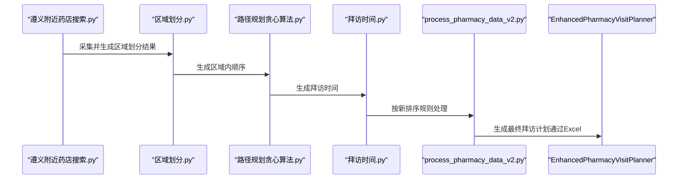
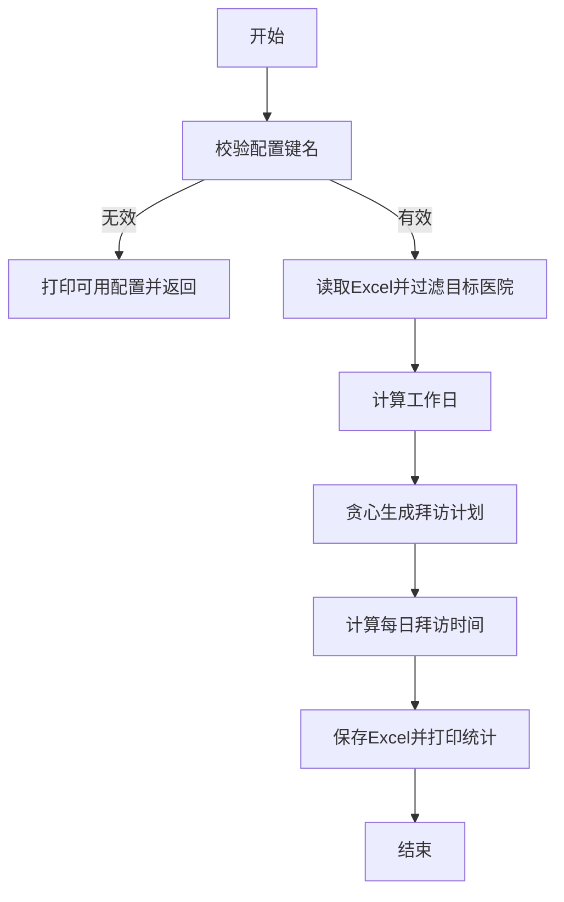
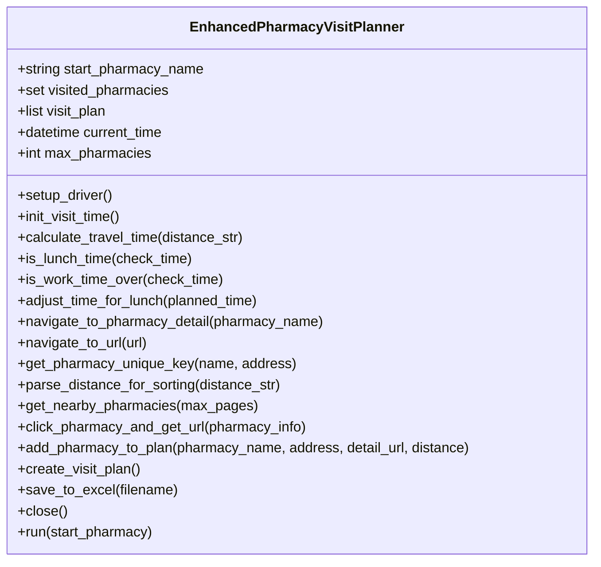
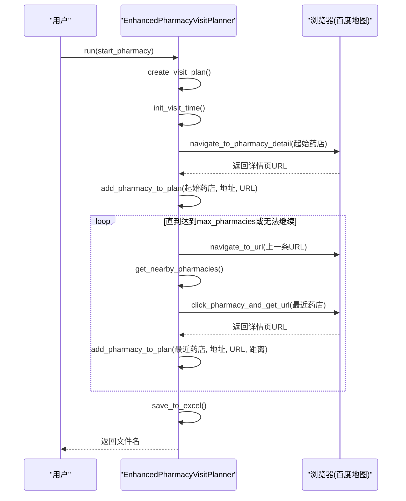
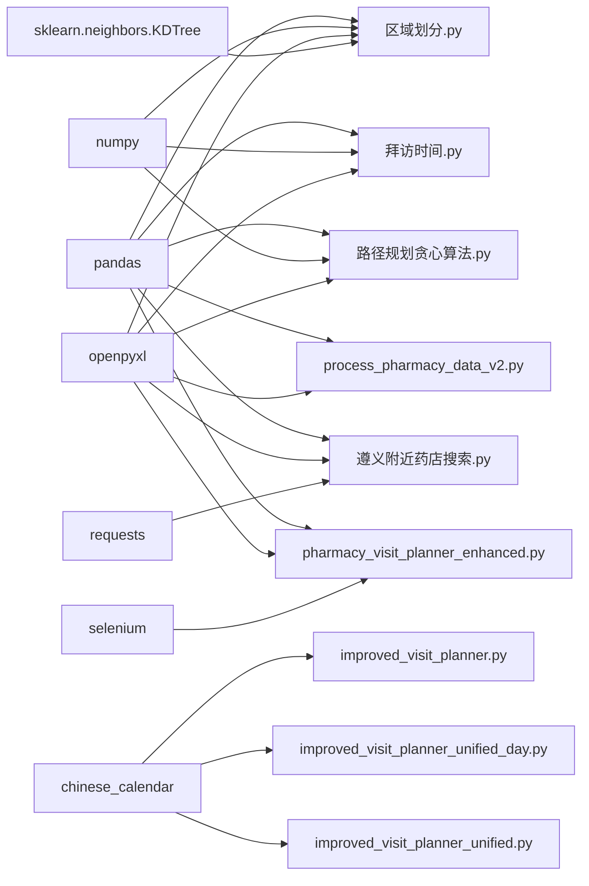

# API参考

<cite>
**本文引用的文件**
- [improved_visit_planner_unified.py](file://医院/improved_visit_planner_unified.py)
- [improved_visit_planner.py](file://医院/improved_visit_planner.py)
- [improved_visit_planner_unified_day.py](file://药店/improved_visit_planner_unified_day.py)
- [pharmacy_visit_planner_enhanced.py](file://药店/pharmacy_visit_planner_enhanced.py)
- [process_pharmacy_data_v2.py](file://药店/process_pharmacy_data_v2.py)
- [区域划分.py](file://药店/区域划分.py)
- [路径规划贪心算法.py](file://药店/路径规划贪心算法.py)
- [遵义附近药店搜索.py](file://药店/遵义附近药店搜索.py)
- [拜访时间.py](file://药店/拜访时间.py)
</cite>

## 目录
1. [简介](#简介)
2. [项目结构](#项目结构)
3. [核心组件](#核心组件)
4. [架构总览](#架构总览)
5. [详细组件分析](#详细组件分析)
6. [依赖关系分析](#依赖关系分析)
7. [性能考量](#性能考量)
8. [故障排查指南](#故障排查指南)
9. [结论](#结论)
10. [附录](#附录)

## 简介
本文件为仓库中所有Python脚本提供统一的API参考文档，覆盖以下目标：
- 为每个可执行脚本的入口方法（main函数或run方法）列出参数列表、类型说明、默认值与业务含义。
- 文档化关键类（如EnhancedPharmacyVisitPlanner）的构造函数与核心方法行为。
- 说明各脚本的返回值或输出文件格式（如CSV、Excel）。
- 标注脚本间的调用关系与依赖顺序。
- 提供标准调用代码片段路径与参数边界条件、异常抛出情况提示，帮助开发者直接集成或二次开发。

## 项目结构
仓库包含“医院”和“药店”两大模块，分别提供医院医生拜访计划与药店拜访规划相关的自动化脚本。核心脚本如下：
- 医院模块
  - improved_visit_planner_unified.py：统一配置版本的医院拜访计划生成器（main入口）
  - improved_visit_planner.py：通用版本的医院拜访计划生成器（main入口）
  - improved_visit_planner_unified_day.py：按具体日期范围的统一配置版本（main入口）
- 药店模块
  - pharmacy_visit_planner_enhanced.py：增强版药店拜访规划系统（EnhancedPharmacyVisitPlanner类）
  - process_pharmacy_data_v2.py：按新排序规则处理药店数据
  - 区域划分.py：基于地理坐标的区域划分与区域编号生成
  - 路径规划贪心算法.py：区域内贪心路径规划
  - 遵义附近药店搜索.py：基于百度地图API的周边药店采集
  - 拜访时间.py：为区域划分结果添加拜访时间

```mermaid
graph TB
subgraph "医院模块"
H1["improved_visit_planner_unified.py<br/>main(visitor_config, daily_visits_range, excel_file, output_file, start_year_month, end_year_month, target_visits)"]
H2["improved_visit_planner.py<br/>main()"]
H3["improved_visit_planner_unified_day.py<br/>main(visitor_config, daily_visits_range, excel_file, output_file, start_date, end_date, target_visits)"]
end
subgraph "药店模块"
P1["pharmacy_visit_planner_enhanced.py<br/>EnhancedPharmacyVisitPlanner 类"]
P2["process_pharmacy_data_v2.py<br/>process_pharmacy_data_v2()"]
P3["区域划分.py<br/>greedy_algorithm()/相关函数"]
P4["路径规划贪心算法.py<br/>greedy_route_planning()"]
P5["遵义附近药店搜索.py<br/>get_all_pharmacy_data()/read_pharmacy_data_from_excel()/save_to_excel()"]
P6["拜访时间.py<br/>按区域编号分组生成拜访时间"]
end
P5 --> P3 --> P4 --> P6 --> P2 --> P1
H1 --> H2 --> H3
```

图表来源
- [improved_visit_planner_unified.py](file://医院/improved_visit_planner_unified.py#L514-L639)
- [improved_visit_planner.py](file://医院/improved_visit_planner.py#L503-L551)
- [improved_visit_planner_unified_day.py](file://药店/improved_visit_planner_unified_day.py#L534-L653)
- [pharmacy_visit_planner_enhanced.py](file://药店/pharmacy_visit_planner_enhanced.py#L28-L525)
- [process_pharmacy_data_v2.py](file://药店/process_pharmacy_data_v2.py#L21-L170)
- [区域划分.py](file://药店/区域划分.py#L13-L83)
- [路径规划贪心算法.py](file://药店/路径规划贪心算法.py#L13-L65)
- [遵义附近药店搜索.py](file://药店/遵义附近药店搜索.py#L33-L184)
- [拜访时间.py](file://药店/拜访时间.py#L1-L92)

章节来源
- [improved_visit_planner_unified.py](file://医院/improved_visit_planner_unified.py#L514-L639)
- [improved_visit_planner.py](file://医院/improved_visit_planner.py#L503-L551)
- [improved_visit_planner_unified_day.py](file://药店/improved_visit_planner_unified_day.py#L534-L653)
- [pharmacy_visit_planner_enhanced.py](file://药店/pharmacy_visit_planner_enhanced.py#L28-L525)
- [process_pharmacy_data_v2.py](file://药店/process_pharmacy_data_v2.py#L21-L170)
- [区域划分.py](file://药店/区域划分.py#L13-L83)
- [路径规划贪心算法.py](file://药店/路径规划贪心算法.py#L13-L65)
- [遵义附近药店搜索.py](file://药店/遵义附近药店搜索.py#L33-L184)
- [拜访时间.py](file://药店/拜访时间.py#L1-L92)

## 核心组件
本节对每个可执行脚本的入口方法与关键类进行API级说明，涵盖参数、类型、默认值、业务含义、返回值与输出文件格式。

- 医院/ImprovedVisitPlannerUnified（统一配置版本）
  - 入口方法：main(visitor_config, daily_visits_range, excel_file, output_file, start_year_month, end_year_month, target_visits=400)
  - 参数
    - visitor_config: str，配置键名，必须存在于内部CONFIG字典中；否则抛出错误并返回
    - daily_visits_range: tuple[int, int]，每日拜访条数范围，闭区间
    - excel_file: str，输入Excel文件路径，需包含“导出筛选结果”和“医院地址”两个工作表
    - output_file: str，输出Excel文件路径
    - start_year_month: tuple[int, int]，起始年、月
    - end_year_month: tuple[int, int]，结束年、月
    - target_visits: int，默认400，总拜访目标
  - 行为
    - 校验visitor_config有效性
    - 读取Excel数据并过滤目标医院
    - 计算工作日（周一至周六，排除法定节假日）
    - 贪心生成拜访计划，按科室与医生数量平衡
    - 计算每日拜访时间（考虑午休与最晚开始时间）
    - 保存到Excel，包含“拜访计划”和“统计信息”两个工作表
  - 返回值：无（直接保存Excel并打印统计）
  - 输出文件：Excel，包含“拜访计划”和“统计信息”
  - 异常与边界
    - 未找到配置键：打印可用配置并返回
    - Excel读取失败：返回None
    - 工作日为空：生成空计划
  - 代码片段路径
    - [main入口](file://医院/improved_visit_planner_unified.py#L514-L639)

- 医院/ImprovedVisitPlanner（通用版本）
  - 入口方法：main()
  - 参数：无（内部硬编码参数）
  - 行为：读取固定Excel，生成多人计划，保存到Excel
  - 返回值：无（直接保存Excel）
  - 输出文件：Excel，包含“拜访计划”和“统计信息”
  - 代码片段路径
    - [main入口](file://医院/improved_visit_planner.py#L503-L551)

- 药店/ImprovedVisitPlannerUnifiedDay（按具体日期范围）
  - 入口方法：main(visitor_config, daily_visits_range, excel_file, output_file, start_date, end_date, target_visits=400)
  - 参数
    - visitor_config: str，配置键名
    - daily_visits_range: tuple[int, int]
    - excel_file: str
    - output_file: str
    - start_date: datetime.date
    - end_date: datetime.date
    - target_visits: int，默认400
  - 行为：与统一配置版本一致，但日期范围为具体日期
  - 返回值：无（直接保存Excel）
  - 输出文件：Excel
  - 代码片段路径
    - [main入口](file://药店/improved_visit_planner_unified_day.py#L534-L653)

- 药店/EnhancedPharmacyVisitPlanner（增强版药店拜访规划）
  - 类：EnhancedPharmacyVisitPlanner(start_pharmacy_name="一心堂大健康药店(花果园C区店)")
  - 构造函数参数
    - start_pharmacy_name: str，起始药店名称（默认值见类定义）
  - 核心方法
    - setup_driver()：初始化Chrome WebDriver
    - init_visit_time()：初始化拜访开始时间（8:30-9:00随机）
    - calculate_travel_time(distance_str)：根据距离字符串估算路程时间
    - is_lunch_time(check_time)：判断是否处于午休时间（12:00-13:30）
    - is_work_time_over(check_time)：判断是否超过工作时间（18:30）
    - adjust_time_for_lunch(planned_time)：午休调整
    - navigate_to_pharmacy_detail(pharmacy_name)：打开百度地图并搜索药店详情页URL
    - navigate_to_url(url)：直接导航到指定URL
    - get_pharmacy_unique_key(name, address)：生成唯一标识（名称+地址）
    - parse_distance_for_sorting(distance_str)：解析距离字符串用于排序
    - get_nearby_pharmacies(max_pages=3)：获取附近药店信息（支持翻页）
    - click_pharmacy_and_get_url(pharmacy_info)：点击药店并获取详情页URL
    - add_pharmacy_to_plan(pharmacy_name, address, detail_url, distance="")：加入计划并计算时间
    - create_visit_plan()：创建完整拜访计划（循环搜索附近药店，最多规划16-19家）
    - save_to_excel(filename=None)：保存Excel，自动格式化列宽与标题样式
    - close()：关闭浏览器
    - run(start_pharmacy=None)：运行完整流程，返回Excel文件名或None
  - 行为要点
    - 使用WebDriver自动化百度地图，抓取药店详情页URL
    - 按距离最近原则选择未访问药店，避免重复规划
    - 路线规划考虑午休与工作时间限制，计算路程时间
    - 保存Excel并格式化
  - 返回值
    - save_to_excel：返回文件名
    - run：返回文件名或None
  - 输出文件：Excel（默认文件名包含时间戳）
  - 异常与边界
    - 浏览器启动失败：抛出异常
    - 无法获取详情页URL：跳过该药店
    - 超过工作时间：停止规划
  - 代码片段路径
    - [类定义与方法](file://药店/pharmacy_visit_planner_enhanced.py#L28-L525)

- 药店/ProcessPharmacyDataV2（按新排序规则处理药店数据）
  - 函数：process_pharmacy_data_v2()
  - 行为
    - 读取Excel（默认文件路径与工作表名）
    - 按区域编号统计各区域的药店数量，确定“区域a”
    - 计算“区域a计数”，并按优先级、计数、区域a值、区域编号、区域内顺序进行多级排序
    - 将排序结果写入原Excel的新工作表
  - 返回值：排序后的DataFrame或None
  - 输出文件：Excel（新增工作表“拜访时间安排-删减-新排序”）
  - 代码片段路径
    - [函数实现](file://药店/process_pharmacy_data_v2.py#L21-L170)

- 药店/区域划分（地理聚类与区域编号）
  - 函数：greedy_algorithm(data, x_column_name, y_column_name, id_column_name)
  - 行为
    - 初始化网格系统，估算密度
    - 贪心选择起始点（基于网格密度与采样估算）
    - 在阈值范围内寻找最近未使用点，构建区域
    - 为每个点分配“区域编号”和“区域内顺序”
  - 返回值：regions（区域列表）、result_data（包含区域编号与顺序的点数据）
  - 输出文件：Excel（默认文件名包含时间戳）
  - 代码片段路径
    - [函数实现](file://药店/区域划分.py#L13-L83)

- 药店/路径规划贪心算法（区域内贪心路径）
  - 函数：greedy_route_planning(df)
  - 行为
    - 以第一个点为起点，按欧氏距离贪心选择下一个最近未访问点
    - 为每个点赋值“order”列
  - 返回值：按索引排序后的DataFrame
  - 输出文件：Excel（默认输出路径）
  - 代码片段路径
    - [函数实现](file://药店/路径规划贪心算法.py#L13-L65)

- 药店/遵义附近药店搜索（百度地图API采集）
  - 函数
    - build_url(page_num, location)：构建API请求URL
    - get_all_pharmacy_data(api_count, location, source_name)：分页获取附近药店数据
    - read_pharmacy_data_from_excel(file_path)：读取Excel中的药店坐标
    - save_to_excel(data_list, output_path)：保存结果
  - 行为
    - 读取源药店坐标，调用百度地图API获取半径1000米内的药店
    - 分页拉取并累计API调用次数
    - 临时文件定期保存，最终输出Excel
  - 返回值：无（直接保存Excel）
  - 输出文件：Excel
  - 代码片段路径
    - [函数实现](file://药店/遵义附近药店搜索.py#L33-L184)

- 药店/拜访时间（按区域编号生成拜访时间）
  - 行为
    - 读取区域划分结果
    - 按区域编号分组，随机生成区域开始时间（9:00-9:15）
    - 计算每个点的拜访时间（停留时间+移动时间，必要时加1小时午休）
    - 保存“原始数据”和“拜访时间安排”两个工作表
  - 返回值：无（直接保存Excel）
  - 输出文件：Excel
  - 代码片段路径
    - [函数实现](file://药店/拜访时间.py#L1-L92)

章节来源
- [improved_visit_planner_unified.py](file://医院/improved_visit_planner_unified.py#L514-L639)
- [improved_visit_planner.py](file://医院/improved_visit_planner.py#L503-L551)
- [improved_visit_planner_unified_day.py](file://药店/improved_visit_planner_unified_day.py#L534-L653)
- [pharmacy_visit_planner_enhanced.py](file://药店/pharmacy_visit_planner_enhanced.py#L28-L525)
- [process_pharmacy_data_v2.py](file://药店/process_pharmacy_data_v2.py#L21-L170)
- [区域划分.py](file://药店/区域划分.py#L13-L83)
- [路径规划贪心算法.py](file://药店/路径规划贪心算法.py#L13-L65)
- [遵义附近药店搜索.py](file://药店/遵义附近药店搜索.py#L33-L184)
- [拜访时间.py](file://药店/拜访时间.py#L1-L92)

## 架构总览
下图展示从数据采集到最终输出的整体流程与脚本间依赖关系。

图表来源
- [遵义附近药店搜索.py](file://药店/遵义附近药店搜索.py#L144-L184)
- [区域划分.py](file://药店/区域划分.py#L295-L321)
- [路径规划贪心算法.py](file://药店/路径规划贪心算法.py#L44-L65)
- [拜访时间.py](file://药店/拜访时间.py#L1-L92)
- [process_pharmacy_data_v2.py](file://药店/process_pharmacy_data_v2.py#L128-L170)
- [pharmacy_visit_planner_enhanced.py](file://药店/pharmacy_visit_planner_enhanced.py#L495-L525)

## 详细组件分析

### 医院/ImprovedVisitPlannerUnified（统一配置版本）
- 主要流程
  - 校验配置键名
  - 读取Excel并过滤目标医院
  - 计算工作日
  - 贪心生成拜访计划
  - 计算每日拜访时间（考虑午休与最晚开始时间）
  - 保存Excel并打印统计
- 关键函数与复杂度
  - 读取Excel：O(N)（N为记录数）
  - 工作日计算：O(D)（D为日期跨度）
  - 贪心分配与选择：整体O(N log N)（按医生数量排序与分组）
  - 时间计算：O(M)（M为当日拜访数）
- 代码片段路径
  - [main入口](file://医院/improved_visit_planner_unified.py#L514-L639)
  - [贪心生成计划](file://医院/improved_visit_planner_unified.py#L276-L468)
  - [保存Excel](file://医院/improved_visit_planner_unified.py#L470-L499)

图表来源
- [improved_visit_planner_unified.py](file://医院/improved_visit_planner_unified.py#L514-L639)
- [improved_visit_planner_unified.py](file://医院/improved_visit_planner_unified.py#L276-L468)
- [improved_visit_planner_unified.py](file://医院/improved_visit_planner_unified.py#L470-L499)

章节来源
- [improved_visit_planner_unified.py](file://医院/improved_visit_planner_unified.py#L514-L639)
- [improved_visit_planner_unified.py](file://医院/improved_visit_planner_unified.py#L276-L468)
- [improved_visit_planner_unified.py](file://医院/improved_visit_planner_unified.py#L470-L499)

### 药店/EnhancedPharmacyVisitPlanner（增强版药店拜访规划）
- 类关系图

图表来源
- [pharmacy_visit_planner_enhanced.py](file://药店/pharmacy_visit_planner_enhanced.py#L28-L525)

- 方法调用序列（创建拜访计划）

图表来源
- [pharmacy_visit_planner_enhanced.py](file://药店/pharmacy_visit_planner_enhanced.py#L370-L525)

- 关键行为与边界
  - 路径规划：基于距离最近原则，避免重复规划（唯一标识）
  - 午休与工作时间：12:00-13:30午休，18:30结束
  - 路程时间：根据距离字符串解析并估算
  - 异常处理：浏览器启动失败抛出异常；无法获取URL跳过该药店
- 代码片段路径
  - [类定义与方法](file://药店/pharmacy_visit_planner_enhanced.py#L28-L525)

章节来源
- [pharmacy_visit_planner_enhanced.py](file://药店/pharmacy_visit_planner_enhanced.py#L28-L525)

### 药店/ProcessPharmacyDataV2（按新排序规则处理）
- 排序规则
  - 1. 区域a优先级（以“区”结尾优先）
  - 2. 区域a计数（降序）
  - 3. 区域a值（升序）
  - 4. 区域编号（升序）
  - 5. 区域内顺序（升序）
- 输出：在原Excel新增工作表“拜访时间安排-删减-新排序”
- 代码片段路径
  - [函数实现](file://药店/process_pharmacy_data_v2.py#L21-L170)

章节来源
- [process_pharmacy_data_v2.py](file://药店/process_pharmacy_data_v2.py#L21-L170)

### 药店/区域划分与路径规划
- 区域划分
  - 使用网格系统与密度估算，贪心选择起始点并在阈值范围内扩展
  - 为每个点分配“区域编号”和“区域内顺序”
- 路径规划
  - 对每个区域内的点，按欧氏距离贪心选择下一个最近未访问点
- 代码片段路径
  - [区域划分](file://药店/区域划分.py#L13-L83)
  - [路径规划](file://药店/路径规划贪心算法.py#L13-L65)

章节来源
- [区域划分.py](file://药店/区域划分.py#L13-L83)
- [路径规划贪心算法.py](file://药店/路径规划贪心算法.py#L13-L65)

### 药店/遵义附近药店搜索
- 行为
  - 读取Excel中的药店坐标，调用百度地图API按半径1000米搜索附近药店
  - 分页拉取并累计API调用次数，达到上限停止
  - 临时文件定期保存，最终输出Excel
- 代码片段路径
  - [函数实现](file://药店/遵义附近药店搜索.py#L33-L184)

章节来源
- [遵义附近药店搜索.py](file://药店/遵义附近药店搜索.py#L33-L184)

### 药店/拜访时间
- 行为
  - 按区域编号分组，随机生成区域开始时间（9:00-9:15）
  - 计算每个点的拜访时间（停留时间+移动时间，必要时加1小时午休）
  - 保存“原始数据”和“拜访时间安排”两个工作表
- 代码片段路径
  - [函数实现](file://药店/拜访时间.py#L1-L92)

章节来源
- [拜访时间.py](file://药店/拜访时间.py#L1-L92)

## 依赖关系分析
- 外部依赖
  - pandas、numpy、openpyxl：数据读写与Excel处理
  - selenium：浏览器自动化（药店增强版）
  - requests：HTTP请求（周边药店搜索）
  - scikit-learn（KDTree）：区域划分中的空间索引
  - chinese_calendar：节假日判断（可选）
- 内部依赖
  - 药店模块：遵义附近药店搜索 → 区域划分 → 路径规划 → 拜访时间 → 新排序处理 → 增强版药店拜访规划
  - 医院模块：统一配置版本与通用版本共享核心算法，输出Excel

图表来源
- [improved_visit_planner_unified.py](file://医院/improved_visit_planner_unified.py#L1-L20)
- [improved_visit_planner_unified_day.py](file://药店/improved_visit_planner_unified_day.py#L1-L20)
- [improved_visit_planner.py](file://医院/improved_visit_planner.py#L1-L20)
- [pharmacy_visit_planner_enhanced.py](file://药店/pharmacy_visit_planner_enhanced.py#L1-L27)
- [区域划分.py](file://药店/区域划分.py#L1-L12)
- [路径规划贪心算法.py](file://药店/路径规划贪心算法.py#L1-L6)
- [遵义附近药店搜索.py](file://药店/遵义附近药店搜索.py#L1-L12)
- [拜访时间.py](file://药店/拜访时间.py#L1-L6)
- [process_pharmacy_data_v2.py](file://药店/process_pharmacy_data_v2.py#L1-L16)

章节来源
- [improved_visit_planner_unified.py](file://医院/improved_visit_planner_unified.py#L1-L20)
- [improved_visit_planner_unified_day.py](file://药店/improved_visit_planner_unified_day.py#L1-L20)
- [improved_visit_planner.py](file://医院/improved_visit_planner.py#L1-L20)
- [pharmacy_visit_planner_enhanced.py](file://药店/pharmacy_visit_planner_enhanced.py#L1-L27)
- [区域划分.py](file://药店/区域划分.py#L1-L12)
- [路径规划贪心算法.py](file://药店/路径规划贪心算法.py#L1-L6)
- [遵义附近药店搜索.py](file://药店/遵义附近药店搜索.py#L1-L12)
- [拜访时间.py](file://药店/拜访时间.py#L1-L6)
- [process_pharmacy_data_v2.py](file://药店/process_pharmacy_data_v2.py#L1-L16)

## 性能考量
- 数据读写
  - Excel读取与写入为I/O瓶颈，建议批量保存（如临时文件定期落盘）
- 算法复杂度
  - 医院拜访：整体O(N log N)，主要瓶颈在按医生数量排序与分组
  - 药店区域划分：网格系统与采样估算降低密度计算成本
  - 路径规划：贪心算法O(K^2)（K为区域内点数），建议按区域拆分
- 外部服务
  - 百度地图API有调用次数限制，应合理控制分页与频率
- 并发与稳定性
  - 浏览器自动化易受网络波动影响，建议增加重试与超时处理

## 故障排查指南
- 未安装chinese_calendar包
  - 现象：节假日判断降级为简化逻辑
  - 处理：安装依赖包或接受简化逻辑
  - 代码片段路径
    - [节假日处理](file://医院/improved_visit_planner_unified.py#L12-L20)
- 浏览器启动失败
  - 现象：抛出异常
  - 处理：检查ChromeDriver版本与系统环境
  - 代码片段路径
    - [浏览器初始化](file://药店/pharmacy_visit_planner_enhanced.py#L39-L52)
- 无法获取药店详情页URL
  - 现象：跳过该药店
  - 处理：检查网络与百度地图接口状态
  - 代码片段路径
    - [导航与获取URL](file://药店/pharmacy_visit_planner_enhanced.py#L110-L146)
- API调用次数达到上限
  - 现象：停止查询
  - 处理：降低频率或更换AK
  - 代码片段路径
    - [API限制检查](file://药店/遵义附近药店搜索.py#L93-L107)
- Excel读取失败
  - 现象：返回None并终止
  - 处理：确认工作表名称与列名
  - 代码片段路径
    - [读取Excel](file://医院/improved_visit_planner_unified.py#L81-L99)

章节来源
- [improved_visit_planner_unified.py](file://医院/improved_visit_planner_unified.py#L12-L20)
- [pharmacy_visit_planner_enhanced.py](file://药店/pharmacy_visit_planner_enhanced.py#L39-L52)
- [pharmacy_visit_planner_enhanced.py](file://药店/pharmacy_visit_planner_enhanced.py#L110-L146)
- [遵义附近药店搜索.py](file://药店/遵义附近药店搜索.py#L93-L107)
- [improved_visit_planner_unified.py](file://医院/improved_visit_planner_unified.py#L81-L99)

## 结论
本API参考文档梳理了仓库中所有Python脚本的入口方法、关键类与核心流程，明确了参数、默认值、业务含义、返回值与输出格式，并标注了脚本间的依赖与调用顺序。开发者可据此直接集成或二次开发，同时结合故障排查指南快速定位问题。

## 附录
- 标准调用代码片段路径
  - 医院统一配置版本：[main入口](file://医院/improved_visit_planner_unified.py#L514-L639)
  - 医院通用版本：[main入口](file://医院/improved_visit_planner.py#L503-L551)
  - 药店按日期版本：[main入口](file://药店/improved_visit_planner_unified_day.py#L534-L653)
  - 增强版药店规划：[类与方法](file://药店/pharmacy_visit_planner_enhanced.py#L28-L525)
  - 新排序处理：[函数实现](file://药店/process_pharmacy_data_v2.py#L21-L170)
  - 区域划分：[函数实现](file://药店/区域划分.py#L13-L83)
  - 路径规划：[函数实现](file://药店/路径规划贪心算法.py#L13-L65)
  - 周边搜索：[函数实现](file://药店/遵义附近药店搜索.py#L33-L184)
  - 拜访时间：[函数实现](file://药店/拜访时间.py#L1-L92)