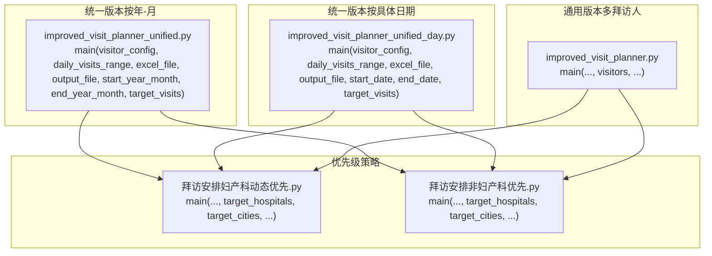
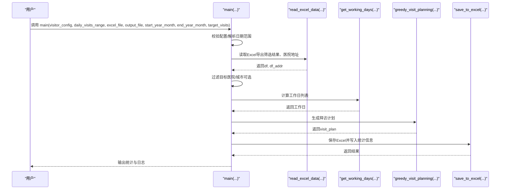
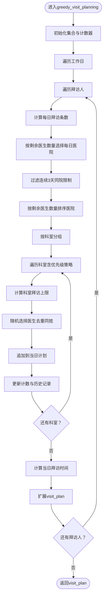
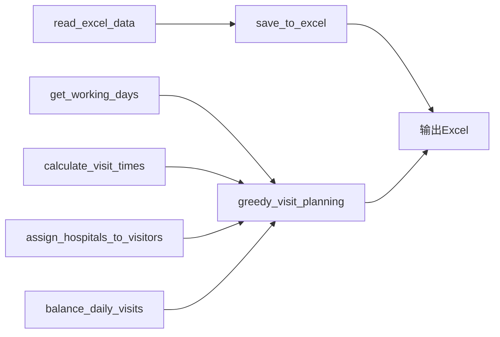

# 医院拜访计划API

<cite>
**本文引用的文件**
- [improved_visit_planner_unified.py](file://医院/improved_visit_planner_unified.py)
- [improved_visit_planner_unified_day.py](file://医院/improved_visit_planner_unified_day.py)
- [improved_visit_planner.py](file://医院/improved_visit_planner.py)
- [拜访安排妇产科动态优先.py](file://医院/拜访安排妇产科动态优先.py)
- [拜访安排非妇产科优先.py](file://医院/拜访安排非妇产科优先.py)
</cite>

## 目录
1. [简介](#简介)
2. [项目结构](#项目结构)
3. [核心组件](#核心组件)
4. [架构总览](#架构总览)
5. [详细组件分析](#详细组件分析)
6. [依赖关系分析](#依赖关系分析)
7. [性能考量](#性能考量)
8. [故障排查指南](#故障排查指南)
9. [结论](#结论)
10. [附录](#附录)

## 简介
本文件为“医院拜访计划”相关脚本的API参考文档，聚焦以下目标：
- 详细说明主程序入口函数的参数结构与行为，尤其是统一版本脚本中main函数的visitor_config、daily_visits_range、excel_file、output_file、start_year_month/end_year_month等参数的含义、边界与约束。
- 说明EnhancedHospitalVisitPlanner类（若存在）的初始化参数与create_plan方法的行为逻辑；若无该类则明确指出并给出替代实现思路。
- 解释不同优先级策略脚本（如妇产科动态优先、非妇产科优先）之间的调用关系与参数传递机制。
- 列出各脚本输出的CSV/Excel文件格式规范（字段名、数据类型、业务含义）。
- 提供标准调用示例与异常处理机制说明（如文件不存在、数据格式错误等）。
- 标注参数边界条件与性能优化建议。

## 项目结构
本仓库围绕“医院拜访计划”提供多套脚本，分别面向不同场景与优先级策略：
- 统一版本（按年-月范围）：improved_visit_planner_unified.py
- 统一版本（按具体日期范围）：improved_visit_planner_unified_day.py
- 通用版本（多拜访人）：improved_visit_planner.py
- 优先级策略版本：
  - 妇产科动态优先：拜访安排妇产科动态优先.py
  - 非妇产科优先：拜访安排非妇产科优先.py

图表来源
- [improved_visit_planner_unified.py](file://医院/improved_visit_planner_unified.py#L514-L590)
- [improved_visit_planner_unified_day.py](file://医院/improved_visit_planner_unified_day.py#L534-L598)
- [improved_visit_planner.py](file://医院/improved_visit_planner.py#L503-L551)
- [拜访安排妇产科动态优先.py](file://医院/拜访安排妇产科动态优先.py#L668-L793)
- [拜访安排非妇产科优先.py](file://医院/拜访安排非妇产科优先.py#L582-L725)

章节来源
- [improved_visit_planner_unified.py](file://医院/improved_visit_planner_unified.py#L514-L639)
- [improved_visit_planner_unified_day.py](file://医院/improved_visit_planner_unified_day.py#L534-L653)
- [improved_visit_planner.py](file://医院/improved_visit_planner.py#L503-L551)
- [拜访安排妇产科动态优先.py](file://医院/拜访安排妇产科动态优先.py#L668-L793)
- [拜访安排非妇产科优先.py](file://医院/拜访安排非妇产科优先.py#L582-L725)

## 核心组件
- 统一版本（按年-月）：通过年-月范围确定起止日期，再调用统一调度流程生成计划。
- 统一版本（按具体日期）：直接接收起止日期，调用统一调度流程生成计划。
- 通用版本（多拜访人）：支持多个拜访人，按目标总拜访次数进行分配与执行。
- 优先级策略版本：在统一调度流程基础上，增加科室优先级与妇产科动态占比控制。

章节来源
- [improved_visit_planner_unified.py](file://医院/improved_visit_planner_unified.py#L514-L639)
- [improved_visit_planner_unified_day.py](file://医院/improved_visit_planner_unified_day.py#L534-L653)
- [improved_visit_planner.py](file://医院/improved_visit_planner.py#L503-L551)
- [拜访安排妇产科动态优先.py](file://医院/拜访安排妇产科动态优先.py#L668-L793)
- [拜访安排非妇产科优先.py](file://医院/拜访安排非妇产科优先.py#L582-L725)

## 架构总览
统一调度流程（以“统一版本（按年-月）”为例）的关键步骤如下：
- 参数校验与解析：visitor_config、daily_visits_range、excel_file、output_file、start_year_month、end_year_month、target_visits。
- 读取Excel数据：读取“导出筛选结果”与“医院地址”两个标签页。
- 过滤目标医院与城市（可选）。
- 计算工作日（周一至周六，排除法定节假日）。
- 调用贪心算法生成拜访计划。
- 保存结果为Excel并输出统计信息。

图表来源
- [improved_visit_planner_unified.py](file://医院/improved_visit_planner_unified.py#L514-L590)
- [improved_visit_planner_unified_day.py](file://医院/improved_visit_planner_unified_day.py#L534-L598)

## 详细组件分析

### 统一版本（按年-月）：main函数参数与行为
- 参数说明
  - visitor_config: 字符串，用于从CONFIG字典中选择拜访人配置。必须存在于CONFIG键集合中，否则报错并退出。
  - daily_visits_range: 元组，形如(D, E)，表示每日拜访条数的随机下限与上限。最终每日实际拜访条数为min[random.randint(D,E), 剩余目标]。
  - excel_file: 字符串，输入Excel文件路径。需包含“导出筛选结果”和“医院地址”两个标签页。
  - output_file: 字符串，输出Excel文件路径。
  - start_year_month: 元组，形如(Y1, M1)，表示起始年份与月份。
  - end_year_month: 元组，形如(Y2, M2)，表示结束年份与月份。
  - target_visits: 整数，目标总拜访次数，默认400。
- 行为逻辑
  - 校验visitor_config是否在CONFIG中。
  - 解析起止年月，计算当月最后一天，构造起止日期。
  - 读取Excel数据并过滤目标医院（仅保留CONFIG中对应人员的目标医院）。
  - 计算工作日列表（周一至周六，排除法定节假日）。
  - 调用greedy_visit_planning生成计划。
  - 保存Excel并输出统计信息（总拜访次数、涉及医院数量、涉及医生数量等）。
- 边界条件
  - 若excel_file不存在或读取失败，返回None并终止。
  - 若CONFIG中无visitor_config键，打印可用配置并返回。
  - 若目标医院过滤后为空，计划可能为空。
  - 若剩余目标不足，每日实际拜访条数将被截断。
- 性能建议
  - Excel文件过大时，建议提前按目标医院过滤后再传入脚本。
  - 减少不必要的sheet读取，确保“导出筛选结果”和“医院地址”标签页命名准确。

章节来源
- [improved_visit_planner_unified.py](file://医院/improved_visit_planner_unified.py#L514-L590)
- [improved_visit_planner_unified.py](file://医院/improved_visit_planner_unified.py#L591-L639)

### 统一版本（按具体日期）：main函数参数与行为
- 参数说明
  - visitor_config: 字符串，用于从CONFIG字典中选择拜访人配置。
  - daily_visits_range: 元组，每日拜访条数范围。
  - excel_file/output_file: 输入/输出Excel路径。
  - start_date/end_date: datetime对象，起止日期。
  - target_visits: 整数，目标总拜访次数。
- 行为逻辑
  - 与按年-月版本一致，只是日期范围由具体日期传入。
- 边界条件
  - 日期范围需合法，start_date <= end_date。
  - CONFIG中无visitor_config时，打印可用配置并返回。

章节来源
- [improved_visit_planner_unified_day.py](file://医院/improved_visit_planner_unified_day.py#L534-L598)
- [improved_visit_planner_unified_day.py](file://医院/improved_visit_planner_unified_day.py#L599-L653)

### 通用版本（多拜访人）：main函数参数与行为
- 参数说明
  - excel_file/output_file: 输入/输出Excel路径。
  - visitors: 列表，如['张丹凤', '何勇']，支持多拜访人。
  - target_visits: 整数，目标总拜访次数。
  - start_date/end_date: 起止日期。
- 行为逻辑
  - 读取Excel数据，计算工作日，按目标总拜访次数均衡分配给每个拜访人，再生成计划。
- 边界条件
  - visitors必须为列表，否则会报错并返回。

章节来源
- [improved_visit_planner.py](file://医院/improved_visit_planner.py#L503-L551)

### 优先级策略脚本：参数与调用关系
- 妇产科动态优先
  - 新增参数：target_hospitals（可选）、target_cities（可选）。
  - 调用关系：统一版本（按年-月/按日期）的main函数调用greedy_visit_planning，后者在统一调度流程基础上加入妇产科动态占比控制与回滚修复逻辑。
- 非妇产科优先
  - 新增参数：target_hospitals（可选）、target_cities（可选）。
  - 调用关系：统一版本（按年-月/按日期）的main函数调用greedy_visit_planning，后者在统一调度流程基础上按优先级关键词排序科室，妇产科科室最后安排。
- 参数传递机制
  - 统一版本的main负责参数解析、数据过滤与工作日计算。
  - 优先级策略在greedy_visit_planning内部实现策略差异，二者共享相同的调度框架。

章节来源
- [improved_visit_planner_unified.py](file://医院/improved_visit_planner_unified.py#L514-L590)
- [improved_visit_planner_unified_day.py](file://医院/improved_visit_planner_unified_day.py#L534-L598)
- [拜访安排妇产科动态优先.py](file://医院/拜访安排妇产科动态优先.py#L668-L793)
- [拜访安排非妇产科优先.py](file://医院/拜访安排非妇产科优先.py#L582-L725)

### EnhancedHospitalVisitPlanner类说明
- 现状说明
  - 仓库中未发现EnhancedHospitalVisitPlanner类定义。现有实现均为函数式调度与贪心算法封装，未采用类封装形式。
- 替代实现思路
  - 可将统一版本的调度流程抽象为类，将main函数拆分为构造函数与create_plan方法，便于扩展与复用。
  - 构造函数负责参数校验与数据加载，create_plan方法负责生成计划与保存结果。

章节来源
- [improved_visit_planner_unified.py](file://医院/improved_visit_planner_unified.py#L514-L639)
- [improved_visit_planner_unified_day.py](file://医院/improved_visit_planner_unified_day.py#L534-L653)

### 关键函数与算法流程
- is_workday：判断工作日（周一至周六，排除法定节假日）。
- get_working_days：生成工作日列表。
- read_excel_data：读取Excel的“导出筛选结果”和“医院地址”标签页。
- assign_hospitals_to_visitors：按医生总量差距最小原则分配医院给拜访人。
- balance_daily_visits：按目标总拜访次数均衡分配每日拜访量。
- select_daily_hospitals：按剩余医生数量选择每日医院，限制最少拜访条数。
- greedy_visit_planning：核心调度算法，按科室优先级与限制条件生成计划。
- calculate_visit_times：计算每日拜访开始与结束时间，处理午休与最晚开始时间。
- check_same_surname/check_consecutive_hospital_visits：去重与连续拜访限制。
- save_to_excel：保存计划到Excel并写入统计信息。

图表来源
- [improved_visit_planner_unified.py](file://医院/improved_visit_planner_unified.py#L276-L468)
- [improved_visit_planner_unified_day.py](file://医院/improved_visit_planner_unified_day.py#L296-L488)
- [improved_visit_planner.py](file://医院/improved_visit_planner.py#L264-L456)
- [拜访安排妇产科动态优先.py](file://医院/拜访安排妇产科动态优先.py#L305-L621)
- [拜访安排非妇产科优先.py](file://医院/拜访安排非妇产科优先.py#L305-L534)

## 依赖关系分析
- 统一版本（按年-月/按日期）与通用版本共享核心调度函数（如greedy_visit_planning、calculate_visit_times、save_to_excel等）。
- 优先级策略版本在统一调度流程基础上引入科室优先级与妇产科占比控制，参数新增target_hospitals与target_cities，用于进一步过滤数据源。
- 读取Excel的标签页名称在不同脚本中略有差异（如“导出筛选结果”、“原始医生列表-有照片 (2)”），需确保输入文件结构一致。

图表来源
- [improved_visit_planner_unified.py](file://医院/improved_visit_planner_unified.py#L81-L100)
- [improved_visit_planner_unified.py](file://医院/improved_visit_planner_unified.py#L470-L499)
- [improved_visit_planner_unified.py](file://医院/improved_visit_planner_unified.py#L69-L80)
- [improved_visit_planner_unified.py](file://医院/improved_visit_planner_unified.py#L276-L468)

## 性能考量
- 数据规模
  - 对超大Excel文件，建议在外部预处理阶段按目标医院/城市过滤，减少脚本内过滤成本。
- 算法复杂度
  - greedy_visit_planning包含多层嵌套循环（按日、按拜访人、按医院、按科室、按医生），整体复杂度较高。可通过减少科室分组数量、限制每日最大拜访条数等方式降低开销。
- I/O与并发
  - Excel读写为单线程操作，建议避免频繁I/O；批量写入一次完成。
- 节假日与工作日计算
  - is_workday与get_working_days为O(N)（N为日期跨度），建议缓存工作日列表以复用。

[本节为通用指导，无需章节来源]

## 故障排查指南
- 文件不存在或路径错误
  - 现象：读取Excel失败并返回None。
  - 处理：检查excel_file路径是否存在；确认包含“导出筛选结果”和“医院地址”标签页。
- 数据格式错误
  - 现象：列名不匹配或缺失关键字段导致过滤失败。
  - 处理：核对Excel列名与脚本期望一致；必要时在读取后进行列名标准化。
- 配置键不存在
  - 现象：visitor_config不在CONFIG中，打印可用配置并返回。
  - 处理：检查CONFIG键名是否正确；确保大小写与拼写一致。
- 目标医院过滤后为空
  - 现象：过滤后df为空，计划为空。
  - 处理：检查target_hospitals与Excel中的医院名称是否一致（含空格与全称）。
- 日期范围非法
  - 现象：start_date > end_date。
  - 处理：修正日期范围，确保start_date <= end_date。
- 节假日包缺失
  - 现象：提示chinese_calendar未安装，使用简化节假日处理。
  - 处理：安装chinese_calendar以获得准确节假日判断。

章节来源
- [improved_visit_planner_unified.py](file://医院/improved_visit_planner_unified.py#L81-L100)
- [improved_visit_planner_unified.py](file://医院/improved_visit_planner_unified.py#L514-L590)
- [improved_visit_planner_unified_day.py](file://医院/improved_visit_planner_unified_day.py#L534-L598)
- [improved_visit_planner.py](file://医院/improved_visit_planner.py#L503-L551)

## 结论
- 统一版本（按年-月/按日期）与通用版本提供稳定的调度框架，优先级策略版本在此基础上扩展了科室优先级与妇产科占比控制。
- main函数参数清晰，边界条件明确，异常处理完善；输出Excel包含计划明细与统计信息，便于复盘与追踪。
- 建议在大规模数据场景下进行外部预过滤与I/O批量化，以提升性能与稳定性。

[本节为总结性内容，无需章节来源]

## 附录

### 输出文件格式规范（Excel）
- Sheet名称
  - 拜访计划：包含计划明细。
  - 统计信息：包含总拜访次数、涉及医院数量、涉及医生数量等。
- 字段说明（按计划明细）
  - 日期：字符串，格式YYYY/MM/DD（保存时转换）。
  - 医院名称：字符串。
  - 地址：字符串。
  - 拜访人：字符串。
  - 科室：字符串。
  - 医生名称：字符串。
  - 拜访开始时间：字符串，格式HH:MM。
  - 拜访结束时间：字符串，格式HH:MM。
- 字段类型
  - 日期、拜访人、科室、医生名称：字符串。
  - 地址：字符串。
  - 拜访开始时间、拜访结束时间：字符串。
- 业务含义
  - 日期：计划拜访的具体日期。
  - 医院名称/地址：医生所在医院及其地址。
  - 拜访人：负责该计划的拜访人。
  - 科室/医生名称：具体医生所属科室与姓名。
  - 拜访开始/结束时间：当日计划的起止时间（受午休与最晚开始时间约束）。

章节来源
- [improved_visit_planner_unified.py](file://医院/improved_visit_planner_unified.py#L470-L499)
- [improved_visit_planner_unified_day.py](file://医院/improved_visit_planner_unified_day.py#L490-L519)
- [improved_visit_planner.py](file://医院/improved_visit_planner.py#L458-L488)
- [拜访安排妇产科动态优先.py](file://医院/拜访安排妇产科动态优先.py#L622-L653)
- [拜访安排非妇产科优先.py](file://医院/拜访安排非妇产科优先.py#L536-L567)

### 标准调用示例（路径引用）
- 统一版本（按年-月）
  - main(VISITOR_CONFIG, DAILY_VISITS_RANGE, EXCEL_FILE, OUTPUT_FILE, START_YEAR_MONTH, END_YEAR_MONTH, TARGET_VISITS)
  - 示例路径：[improved_visit_planner_unified.py](file://医院/improved_visit_planner_unified.py#L514-L590)
- 统一版本（按具体日期）
  - main(VISITOR_CONFIG, DAILY_VISITS_RANGE, EXCEL_FILE, OUTPUT_FILE, START_DATE, END_DATE, TARGET_VISITS)
  - 示例路径：[improved_visit_planner_unified_day.py](file://医院/improved_visit_planner_unified_day.py#L534-L598)
- 通用版本（多拜访人）
  - main()（内部设置excel_file、output_file、visitors、target_visits、start_date、end_date）
  - 示例路径：[improved_visit_planner.py](file://医院/improved_visit_planner.py#L503-L551)
- 优先级策略（妇产科动态优先）
  - main(VISITOR_CONFIG, DAILY_VISITS_RANGE, EXCEL_FILE, OUTPUT_FILE, START_DATE, END_DATE, TARGET_VISITS, TARGET_HOSPITALS, TARGET_CITIES)
  - 示例路径：[拜访安排妇产科动态优先.py](file://医院/拜访安排妇产科动态优先.py#L668-L793)
- 优先级策略（非妇产科优先）
  - main(VISITOR_CONFIG, DAILY_VISITS_RANGE, EXCEL_FILE, OUTPUT_FILE, START_DATE, END_DATE, TARGET_VISITS, TARGET_HOSPITALS, TARGET_CITIES)
  - 示例路径：[拜访安排非妇产科优先.py](file://医院/拜访安排非妇产科优先.py#L582-L725)

### 参数边界条件清单
- visitor_config
  - 必须存在于CONFIG键集合中；否则报错并返回。
- daily_visits_range
  - 元组(D, E)，D <= E；每日实际拜访条数为min[random.randint(D,E), 剩余目标]。
- excel_file
  - 必须存在且包含“导出筛选结果”和“医院地址”标签页；否则返回None并终止。
- start_year_month/end_year_month
  - 年份与月份需有效；end_year_month应不早于start_year_month。
- start_date/end_date
  - 必须满足start_date <= end_date。
- target_visits
  - 必须为整数；若大于可用医生总数，将被裁剪。
- target_hospitals/target_cities（优先级策略）
  - 可选；若提供，需与Excel中的名称一致（含空格与全称）。

章节来源
- [improved_visit_planner_unified.py](file://医院/improved_visit_planner_unified.py#L514-L590)
- [improved_visit_planner_unified_day.py](file://医院/improved_visit_planner_unified_day.py#L534-L598)
- [improved_visit_planner.py](file://医院/improved_visit_planner.py#L503-L551)
- [拜访安排妇产科动态优先.py](file://医院/拜访安排妇产科动态优先.py#L668-L793)
- [拜访安排非妇产科优先.py](file://医院/拜访安排非妇产科优先.py#L582-L725)