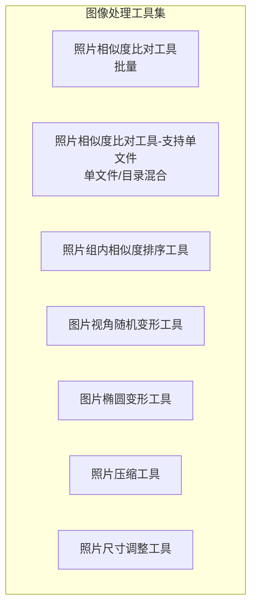
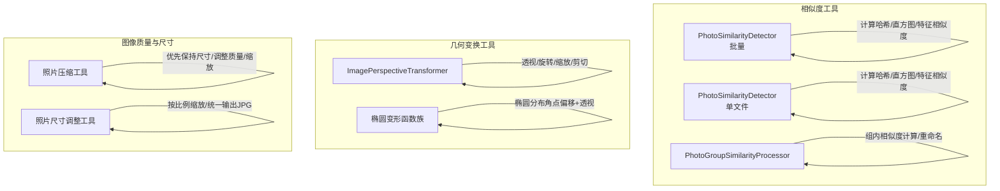
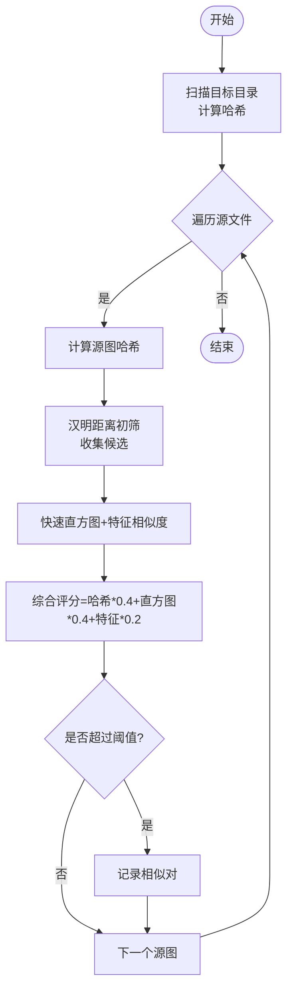
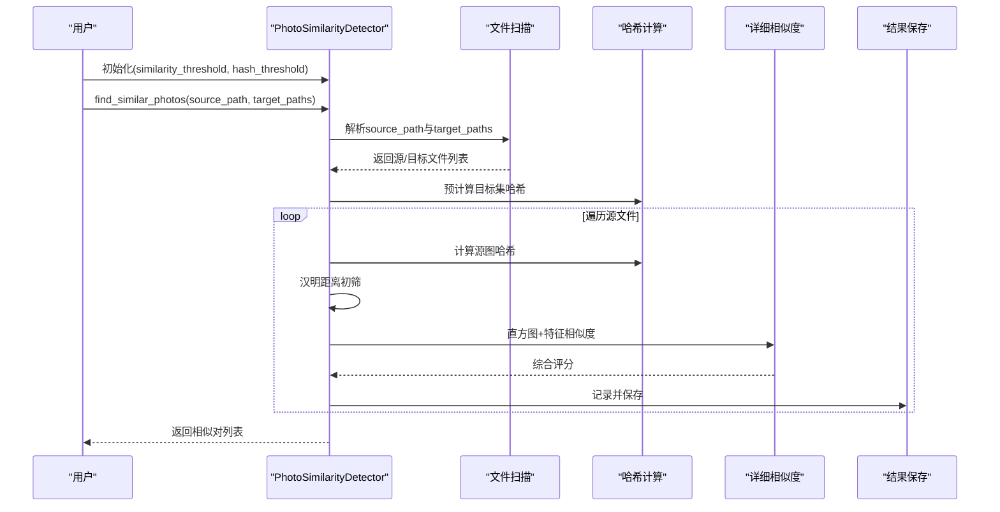
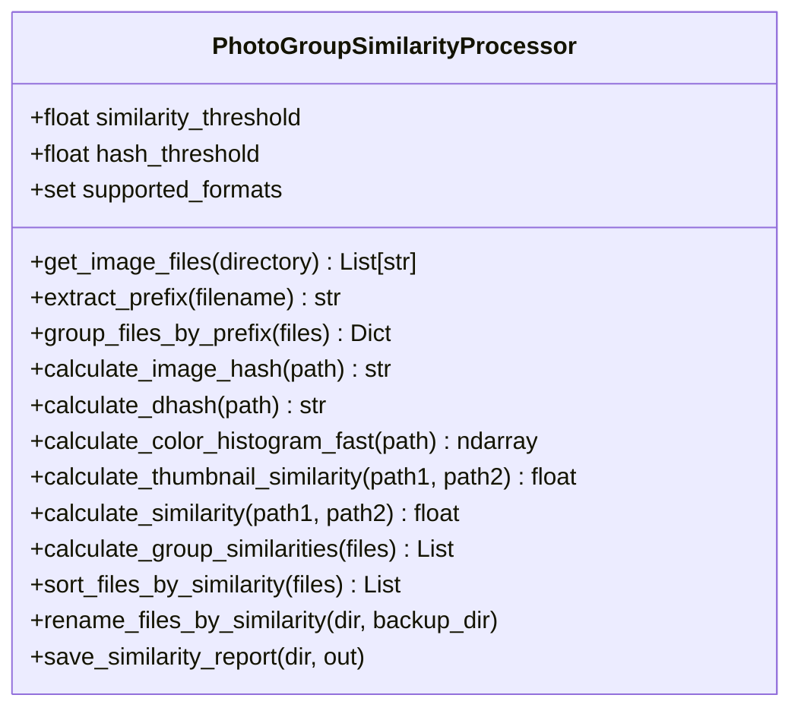
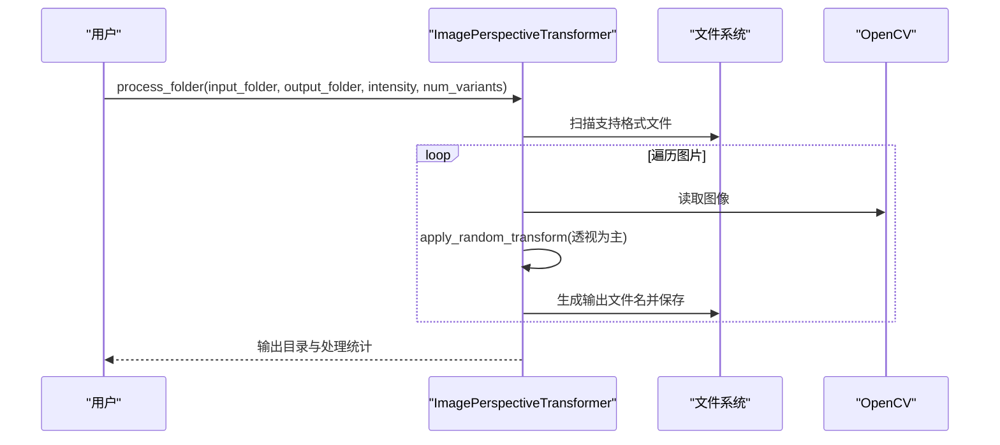
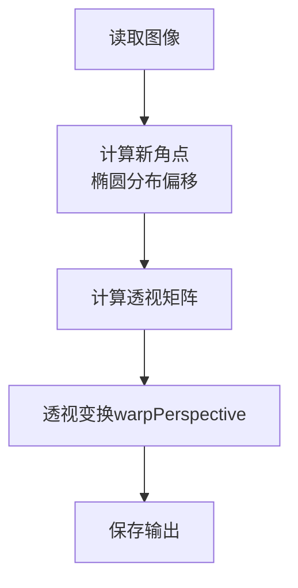
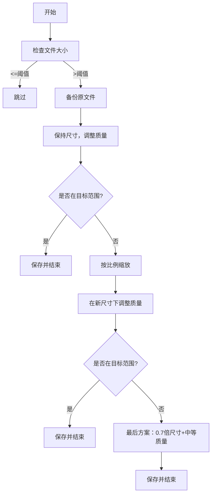
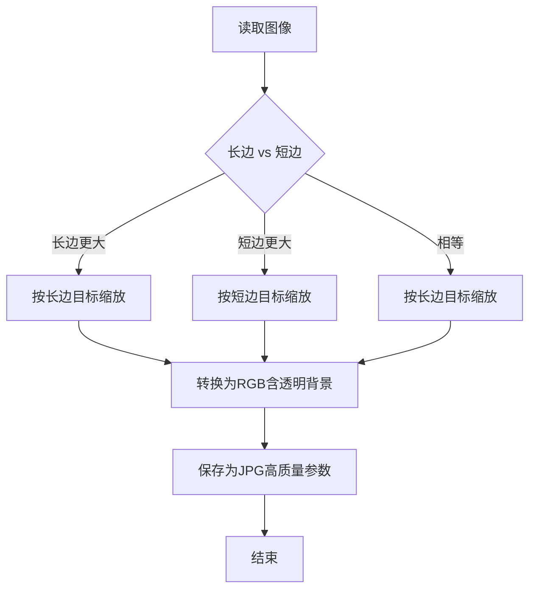
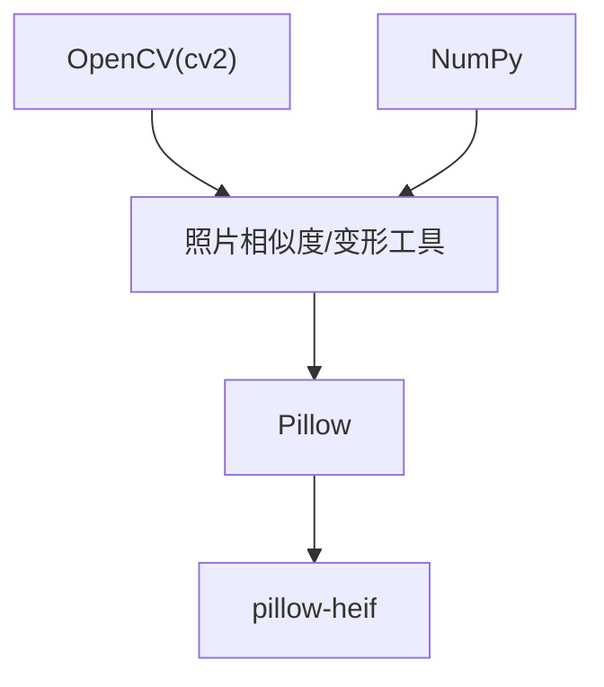

# 图像处理工具API

<cite>
**本文引用的文件**
- [照片相似度比对工具.py](file://医院/照片相似度比对工具.py)
- [照片相似度比对工具-支持单文件.py](file://医院/照片相似度比对工具-支持单文件.py)
- [照片组内相似度排序工具.py](file://医院/照片组内相似度排序工具.py)
- [图片视角随机变形工具.py](file://医院/图片视角随机变形工具.py)
- [图片椭圆变形工具.py](file://医院/图片椭圆变形工具.py)
- [照片压缩工具.py](file://医院/照片压缩工具.py)
- [照片尺寸调整工具.py](file://医院/照片尺寸调整工具.py)
</cite>

## 目录
1. [简介](#简介)
2. [项目结构](#项目结构)
3. [核心组件](#核心组件)
4. [架构总览](#架构总览)
5. [详细组件分析](#详细组件分析)
6. [依赖关系分析](#依赖关系分析)
7. [性能与内存优化](#性能与内存优化)
8. [故障排查指南](#故障排查指南)
9. [结论](#结论)
10. [附录](#附录)

## 简介
本文件为“图像处理工具集”的统一API文档，面向使用者与开发者，系统梳理以下工具的接口、参数、流程与注意事项：
- 照片相似度比对工具（批量与单文件支持）
- 照片组内相似度排序工具
- 图片视角随机变形工具
- 图片椭圆变形工具
- 照片压缩工具
- 照片尺寸调整工具

文档重点覆盖：
- 核心算法参数（如哈希初筛阈值、最终相似度阈值、汉明距离容忍度、ORB特征点数量等）
- 单文件与批量处理接口差异
- 仿射/透视变换参数范围（旋转角度、缩放因子、平移量、透视强度）
- 压缩与尺寸调整的质量控制参数（quality、target_size）
- 输入图像格式支持与输出文件命名规则
- OpenCV版本兼容性与内存使用优化建议
- 典型调用场景与示例代码路径

## 项目结构
该工具集采用“按功能模块”组织，每个工具独立为一个Python脚本，便于单独运行与集成。

图表来源
- [照片相似度比对工具.py](file://医院/照片相似度比对工具.py#L1-L318)
- [照片相似度比对工具-支持单文件.py](file://医院/照片相似度比对工具-支持单文件.py#L1-L341)
- [照片组内相似度排序工具.py](file://医院/照片组内相似度排序工具.py#L1-L476)
- [图片视角随机变形工具.py](file://医院/图片视角随机变形工具.py#L1-L310)
- [图片椭圆变形工具.py](file://医院/图片椭圆变形工具.py#L1-L219)
- [照片压缩工具.py](file://医院/照片压缩工具.py#L1-L286)
- [照片尺寸调整工具.py](file://医院/照片尺寸调整工具.py#L1-L214)

章节来源
- [照片相似度比对工具.py](file://医院/照片相似度比对工具.py#L1-L318)
- [照片相似度比对工具-支持单文件.py](file://医院/照片相似度比对工具-支持单文件.py#L1-L341)
- [照片组内相似度排序工具.py](file://医院/照片组内相似度排序工具.py#L1-L476)
- [图片视角随机变形工具.py](file://医院/图片视角随机变形工具.py#L1-L310)
- [图片椭圆变形工具.py](file://医院/图片椭圆变形工具.py#L1-L219)
- [照片压缩工具.py](file://医院/照片压缩工具.py#L1-L286)
- [照片尺寸调整工具.py](file://医院/照片尺寸调整工具.py#L1-L214)

## 核心组件
- 照片相似度比对工具（批量）：基于多阶段相似度评分（哈希初筛+直方图+特征），支持批量目录扫描与结果导出。
- 照片相似度比对工具（单文件）：支持源/目标路径为文件或目录，混合配置，适合灵活比对。
- 照片组内相似度排序工具：按文件名前缀分组，计算组内相似度并重命名，保留备份。
- 图片视角随机变形工具：提供透视、旋转、缩放裁剪、剪切等随机仿射变换，支持批量处理与输出命名。
- 图片椭圆变形工具：基于椭圆概率分布对四角点进行随机偏移，再做透视变换，避免黑边。
- 照片压缩工具：优先保持尺寸，再调整质量；必要时按比例缩放，支持HEIF/HEIC。
- 照片尺寸调整工具：按长宽比例分别缩放长边或短边，统一输出为JPG，支持HEIF/HEIC。

章节来源
- [照片相似度比对工具.py](file://医院/照片相似度比对工具.py#L1-L318)
- [照片相似度比对工具-支持单文件.py](file://医院/照片相似度比对工具-支持单文件.py#L1-L341)
- [照片组内相似度排序工具.py](file://医院/照片组内相似度排序工具.py#L1-L476)
- [图片视角随机变形工具.py](file://医院/图片视角随机变形工具.py#L1-L310)
- [图片椭圆变形工具.py](file://医院/图片椭圆变形工具.py#L1-L219)
- [照片压缩工具.py](file://医院/照片压缩工具.py#L1-L286)
- [照片尺寸调整工具.py](file://医院/照片尺寸调整工具.py#L1-L214)

## 架构总览
整体采用“模块化脚本+类封装”的设计，相似度工具以类封装算法逻辑，变形与压缩/尺寸工具以函数式为主，便于直接调用与批量处理。

图表来源
- [照片相似度比对工具.py](file://医院/照片相似度比对工具.py#L1-L318)
- [照片相似度比对工具-支持单文件.py](file://医院/照片相似度比对工具-支持单文件.py#L1-L341)
- [照片组内相似度排序工具.py](file://医院/照片组内相似度排序工具.py#L1-L476)
- [图片视角随机变形工具.py](file://医院/图片视角随机变形工具.py#L1-L310)
- [图片椭圆变形工具.py](file://医院/图片椭圆变形工具.py#L1-L219)
- [照片压缩工具.py](file://医院/照片压缩工具.py#L1-L286)
- [照片尺寸调整工具.py](file://医院/照片尺寸调整工具.py#L1-L214)

## 详细组件分析

### 照片相似度比对工具（批量）
- 类：PhotoSimilarityDetector
- 主要方法
  - get_image_files：扫描目录，返回支持格式的文件列表
  - calculate_image_hash：感知哈希（8x8二值化）
  - calculate_histogram_similarity：快速直方图相似度（64x64 RGB直方图）
  - calculate_feature_similarity：像素差分相似度（32x32）
  - hamming_distance：汉明距离
  - find_similar_photos：两阶段比对（哈希初筛+详细比对），综合评分
  - save_results：导出结果文本
- 关键参数
  - similarity_threshold：最终相似度阈值（默认0.85）
  - hash_threshold：哈希初筛阈值（默认0.7）
  - supported_formats：支持格式集合（.jpg/.jpeg/.png/.bmp/.tiff/.tif）
- 数据流
  - 预计算目标集哈希 → 源图哈希初筛 → 详细相似度计算 → 综合评分过滤 → 结果保存

图表来源
- [照片相似度比对工具.py](file://医院/照片相似度比对工具.py#L127-L217)

章节来源
- [照片相似度比对工具.py](file://医院/照片相似度比对工具.py#L1-L318)

### 照片相似度比对工具（单文件）
- 类：PhotoSimilarityDetector
- 主要差异
  - get_image_files_from_path：支持传入文件或目录，自动判断并收集
  - find_similar_photos：源/目标路径均可为文件或目录
- 参数与行为同批量版本一致，适用于灵活场景

图表来源
- [照片相似度比对工具-支持单文件.py](file://医院/照片相似度比对工具-支持单文件.py#L151-L241)

章节来源
- [照片相似度比对工具-支持单文件.py](file://医院/照片相似度比对工具-支持单文件.py#L1-L341)

### 照片组内相似度排序工具
- 类：PhotoGroupSimilarityProcessor
- 功能
  - 按文件名前缀分组
  - 计算组内两两相似度（pHash/dHash/颜色直方图/缩略图相似度加权）
  - 基于相似度排序并重命名，保留备份
- 关键参数
  - similarity_threshold/hash_threshold：与相似度比对一致
  - supported_formats：支持格式集合
- 算法要点
  - dHash：对图像变化更敏感
  - 颜色直方图：简化RGB直方图并归一化
  - 缩略图相似度：基于均方误差的简化SSIM近似
  - 综合评分权重：pHash/dHash/颜色直方图/缩略图分别为30%/30%/25%/15%

图表来源
- [照片组内相似度排序工具.py](file://医院/照片组内相似度排序工具.py#L1-L476)

章节来源
- [照片组内相似度排序工具.py](file://医院/照片组内相似度排序工具.py#L1-L476)

### 图片视角随机变形工具
- 类：ImagePerspectiveTransformer
- 变换能力
  - random_perspective_transform：透视变换（四角点随机偏移，椭圆范围约束）
  - random_rotation：旋转（扩展画布后中心裁剪）
  - random_scale_crop：缩放+裁剪或填充
  - random_shear：剪切
  - apply_random_transform：组合变换（当前默认仅透视）
- 参数范围
  - 透视强度：intensity（0.1-1.0，示例默认0.3）
  - 旋转角度：±max_angle（示例默认10度）
  - 缩放范围：scale_range（示例默认0.85-1.15）
  - 剪切强度：max_shear（示例默认0.2）
- 输出命名
  - 单变体：原名+后缀（默认“_transformed”）
  - 多变体：原名+后缀+“_序号”
- 批处理
  - process_folder：自动扫描支持格式，创建输出目录，逐张处理

图表来源
- [图片视角随机变形工具.py](file://医院/图片视角随机变形工具.py#L153-L268)

章节来源
- [图片视角随机变形工具.py](file://医院/图片视角随机变形工具.py#L1-L310)

### 图片椭圆变形工具
- 函数族
  - generate_ellipse_point：在四分之一椭圆内按概率密度生成点，确保在边界内
  - get_new_corners：对四个角点进行椭圆偏移
  - transform_image：计算透视矩阵并应用（避免黑边）
  - process_single_image/process_directory：单图/批量处理
- 参数范围
  - 椭圆半轴：a≈width/10，b≈height/10
  - 角点偏移遵循概率密度分布，峰值在半径1/2处，边界概率为0
- 输出命名
  - 批处理：在输入目录下创建“processed”子目录，输出文件名前缀“transformed_”

图表来源
- [图片椭圆变形工具.py](file://医院/图片椭圆变形工具.py#L113-L167)

章节来源
- [图片椭圆变形工具.py](file://医院/图片椭圆变形工具.py#L1-L219)

### 照片压缩工具
- 功能
  - 优先保持原始尺寸，调整JPEG质量至目标大小范围（示例：0.8-1.5MB）
  - 若质量降到最低仍过大，则按比例缩放（0.95/0.9/0.85/0.8/0.75/0.7）
  - HEIF/HEIC支持通过pillow-heif注册
- 关键参数
  - TARGET_SIZE_MB：目标大小（示例1.0MB）
  - MAX_SIZE_MB：触发压缩的阈值（示例1.5MB）
  - QUALITY_START/QUALITY_MIN：初始质量与最低质量（示例85/60）
  - SUPPORTED_FORMATS：.jpg/.jpeg/.png/.bmp/.tiff/.tif/.heic/.heif
- 输出命名
  - 原文件备份为“.backup”，压缩后写回原路径
- 错误处理
  - 失败时恢复原文件，打印错误信息

图表来源
- [照片压缩工具.py](file://医院/照片压缩工具.py#L30-L126)

章节来源
- [照片压缩工具.py](file://医院/照片压缩工具.py#L1-L286)

### 照片尺寸调整工具
- 功能
  - 按长宽比例调整：长>宽时将长边缩放至RESIZE_LONG_EDGE，否则将短边缩放至RESIZE_SHORT_EDGE
  - 统一输出为JPG（HEIF/HEIC转换为RGB并保存为JPEG）
- 关键参数
  - RESIZE_LONG_EDGE：长边目标像素（示例1600）
  - RESIZE_SHORT_EDGE：短边目标像素（示例1700）
  - SUPPORTED_FORMATS：.jpg/.jpeg/.png/.bmp/.tiff/.tif/.heic/.heif
- 输出命名
  - 保持目录结构，输出扩展名为“.jpg”

图表来源
- [照片尺寸调整工具.py](file://医院/照片尺寸调整工具.py#L68-L114)

章节来源
- [照片尺寸调整工具.py](file://医院/照片尺寸调整工具.py#L1-L214)

## 依赖关系分析
- OpenCV版本兼容性
  - 本工具集广泛使用cv2模块（imread/warpPerspective/getPerspectiveTransform/calcHist/compareHist等），建议使用OpenCV 4.x稳定版本。
  - 注意：某些OpenCV版本在warpPerspective的borderMode行为上可能略有差异，若出现黑边或裁剪异常，请检查OpenCV版本与参数设置。
- Python依赖
  - Pillow：图像读写与HEIF支持
  - pillow-heif：HEIF/HEIC解码
  - numpy：数值计算
  - argparse（变形工具）：命令行参数解析

图表来源
- [照片相似度比对工具.py](file://医院/照片相似度比对工具.py#L1-L318)
- [图片视角随机变形工具.py](file://医院/图片视角随机变形工具.py#L1-L310)
- [照片压缩工具.py](file://医院/照片压缩工具.py#L1-L286)
- [照片尺寸调整工具.py](file://医院/照片尺寸调整工具.py#L1-L214)

章节来源
- [照片相似度比对工具.py](file://医院/照片相似度比对工具.py#L1-L318)
- [图片视角随机变形工具.py](file://医院/图片视角随机变形工具.py#L1-L310)
- [照片压缩工具.py](file://医院/照片压缩工具.py#L1-L286)
- [照片尺寸调整工具.py](file://医院/照片尺寸调整工具.py#L1-L214)

## 性能与内存优化
- 相似度工具
  - 多阶段策略：先计算目标集哈希，再对候选做详细比对，显著减少计算量
  - 缩小尺寸：直方图与特征相似度均在较小尺寸上计算，兼顾速度与精度
  - 建议：适当提高hash_threshold可进一步减少候选数量；合理设置similarity_threshold平衡召回与误报
- 变形工具
  - 透视强度intensity建议在0.1-0.5之间，过大可能导致图像失真或边缘噪声
  - 批量处理时建议分批执行，避免一次性加载过多图像导致内存峰值过高
- 压缩与尺寸调整
  - 压缩优先保持尺寸，质量步进建议适中（如-3/-5），避免过度降质
  - 尺寸调整使用Lanczos插值，质量较高但耗时较长；如需更快速度可改用其他插值，但会牺牲清晰度
  - HEIF/HEIC转换涉及像素格式转换与背景合成，建议在内存充足的环境下运行

[本节为通用性能建议，不直接分析具体文件]

## 故障排查指南
- OpenCV读取失败
  - 现象：提示无法读取图片
  - 排查：确认文件路径正确、格式受支持、权限正常
  - 参考路径
    - [图片视角随机变形工具.py](file://医院/图片视角随机变形工具.py#L178-L183)
    - [图片椭圆变形工具.py](file://医院/图片椭圆变形工具.py#L146-L151)
- 依赖缺失
  - 现象：导入Pillow/pillow-heif失败
  - 排查：运行脚本内置安装流程或手动安装
  - 参考路径
    - [照片压缩工具.py](file://医院/照片压缩工具.py#L228-L258)
    - [照片尺寸调整工具.py](file://医院/照片尺寸调整工具.py#L25-L67)
- 压缩失败回滚
  - 现象：压缩后失败，原文件被备份
  - 排查：查看日志与错误信息，确认HEIF支持与磁盘空间
  - 参考路径
    - [照片压缩工具.py](file://医院/照片压缩工具.py#L188-L206)
- 输出目录不存在
  - 现象：批量处理时报错
  - 排查：确认输出目录存在或允许自动创建
  - 参考路径
    - [照片尺寸调整工具.py](file://医院/照片尺寸调整工具.py#L120-L129)

章节来源
- [图片视角随机变形工具.py](file://医院/图片视角随机变形工具.py#L178-L183)
- [图片椭圆变形工具.py](file://医院/图片椭圆变形工具.py#L146-L151)
- [照片压缩工具.py](file://医院/照片压缩工具.py#L228-L258)
- [照片尺寸调整工具.py](file://医院/照片尺寸调整工具.py#L120-L129)

## 结论
本工具集提供了从相似度检测、组内排序、几何变换到压缩与尺寸调整的完整链路。通过合理的参数配置与分阶段策略，可在保证质量的同时提升处理效率。建议在生产环境中：
- 明确相似度阈值与哈希初筛阈值，平衡召回与误报
- 控制变形强度，避免过度失真
- 合理设置压缩质量与尺寸目标，兼顾体积与清晰度
- 使用HEIF/HEIC时确保依赖安装与内存充足

[本节为总结性内容，不直接分析具体文件]

## 附录

### API参数与命名规则汇总
- 相似度工具
  - 相似度阈值：similarity_threshold（默认0.85）
  - 哈希初筛阈值：hash_threshold（默认0.7）
  - 支持格式：.jpg/.jpeg/.png/.bmp/.tiff/.tif
  - 输出：结果文本文件（含综合评分与路径）
- 单文件/目录混合比对
  - 输入：源路径/目标路径可为文件或目录
  - 输出：结果文本文件（保存在源路径上一级目录）
- 变形工具
  - 透视强度：intensity（0.1-1.0，默认0.3）
  - 旋转角度：±max_angle（示例10）
  - 缩放范围：scale_range（示例0.85-1.15）
  - 剪切强度：max_shear（示例0.2）
  - 输出命名：原名+“_transformed”（单变体）或“_transformed_序号”（多变体）
- 椭圆变形
  - 椭圆半轴：a≈width/10，b≈height/10
  - 输出命名：transformed_原名
- 压缩工具
  - 目标大小：TARGET_SIZE_MB（示例1.0MB）
  - 触发阈值：MAX_SIZE_MB（示例1.5MB）
  - 质量范围：QUALITY_START/QUALITY_MIN（示例85/60）
  - 支持格式：.jpg/.jpeg/.png/.bmp/.tiff/.tif/.heic/.heif
  - 输出：原文件备份“.backup”，压缩后写回原路径
- 尺寸调整工具
  - 长边目标：RESIZE_LONG_EDGE（示例1600）
  - 短边目标：RESIZE_SHORT_EDGE（示例1700）
  - 支持格式：.jpg/.jpeg/.png/.bmp/.tiff/.tif/.heic/.heif
  - 输出：统一JPG，保持目录结构

章节来源
- [照片相似度比对工具.py](file://医院/照片相似度比对工具.py#L19-L31)
- [照片相似度比对工具-支持单文件.py](file://医院/照片相似度比对工具-支持单文件.py#L19-L31)
- [照片组内相似度排序工具.py](file://医院/照片组内相似度排序工具.py#L18-L23)
- [图片视角随机变形工具.py](file://医院/图片视角随机变形工具.py#L153-L214)
- [图片椭圆变形工具.py](file://医院/图片椭圆变形工具.py#L168-L199)
- [照片压缩工具.py](file://医院/照片压缩工具.py#L16-L25)
- [照片尺寸调整工具.py](file://医院/照片尺寸调整工具.py#L16-L24)

### 典型调用场景与示例代码路径
- 批量相似度比对（多目录）
  - 示例路径：[main入口](file://医院/照片相似度比对工具.py#L240-L318)
- 单文件/目录混合相似度比对
  - 示例路径：[main入口](file://医院/照片相似度比对工具-支持单文件.py#L264-L341)
- 组内相似度排序与重命名
  - 示例路径：[main入口](file://医院/照片组内相似度排序工具.py#L440-L476)
- 图片视角随机变形（命令行）
  - 示例路径：[命令行入口](file://医院/图片视角随机变形工具.py#L269-L299)
- 图片椭圆变形（批量）
  - 示例路径：[main入口](file://医院/图片椭圆变形工具.py#L200-L219)
- 照片压缩（批量）
  - 示例路径：[process_directory](file://医院/照片压缩工具.py#L135-L227)
- 照片尺寸调整（批量）
  - 示例路径：[process_directory](file://医院/照片尺寸调整工具.py#L120-L193)

章节来源
- [照片相似度比对工具.py](file://医院/照片相似度比对工具.py#L240-L318)
- [照片相似度比对工具-支持单文件.py](file://医院/照片相似度比对工具-支持单文件.py#L264-L341)
- [照片组内相似度排序工具.py](file://医院/照片组内相似度排序工具.py#L440-L476)
- [图片视角随机变形工具.py](file://医院/图片视角随机变形工具.py#L269-L299)
- [图片椭圆变形工具.py](file://医院/图片椭圆变形工具.py#L200-L219)
- [照片压缩工具.py](file://医院/照片压缩工具.py#L135-L227)
- [照片尺寸调整工具.py](file://医院/照片尺寸调整工具.py#L120-L193)