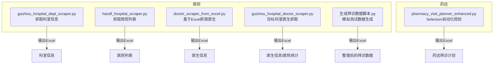
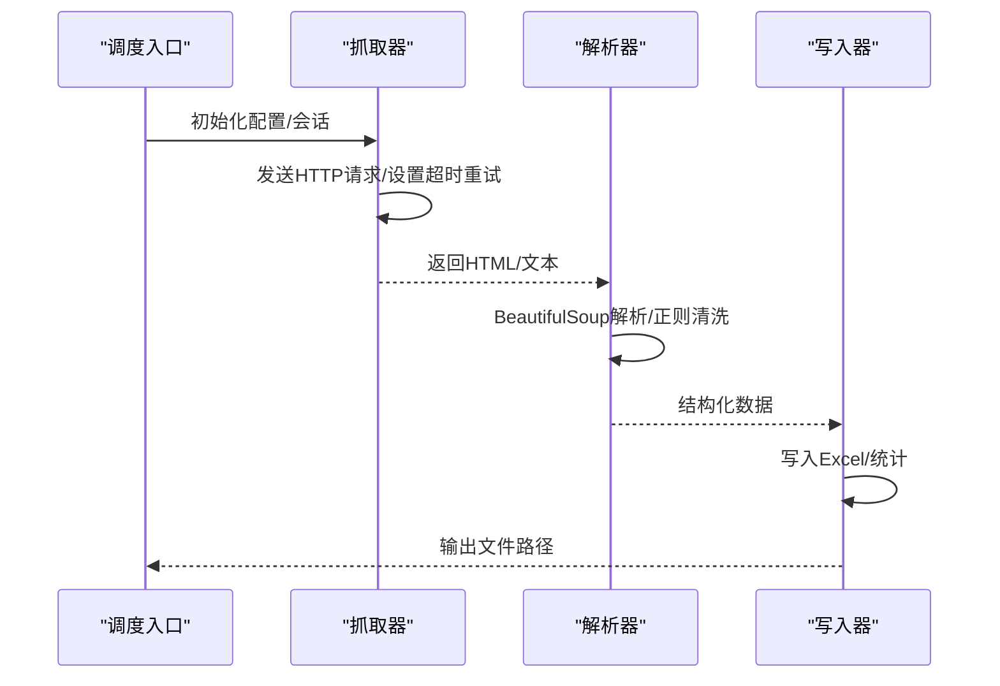
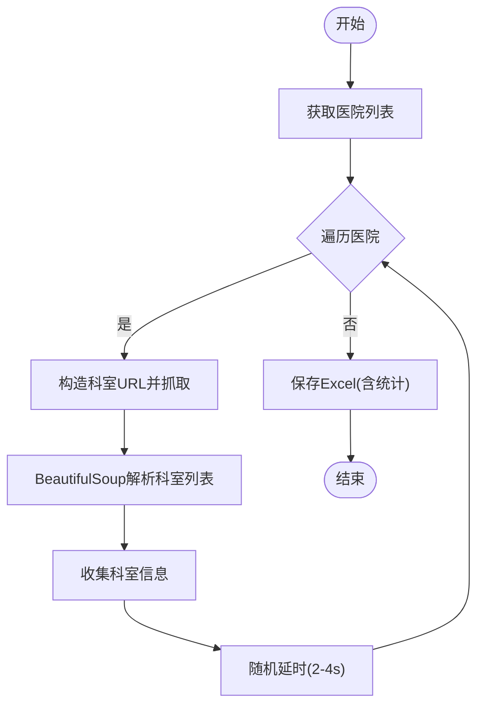
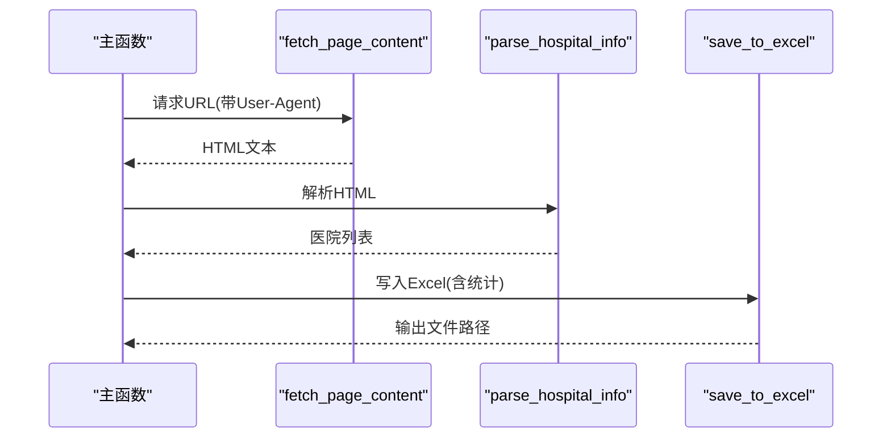
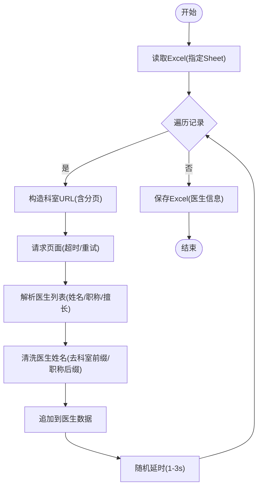
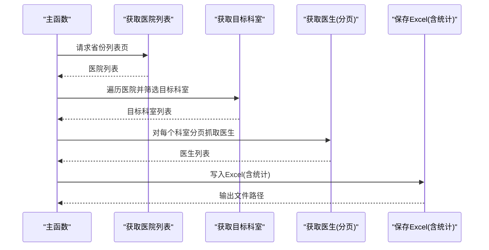
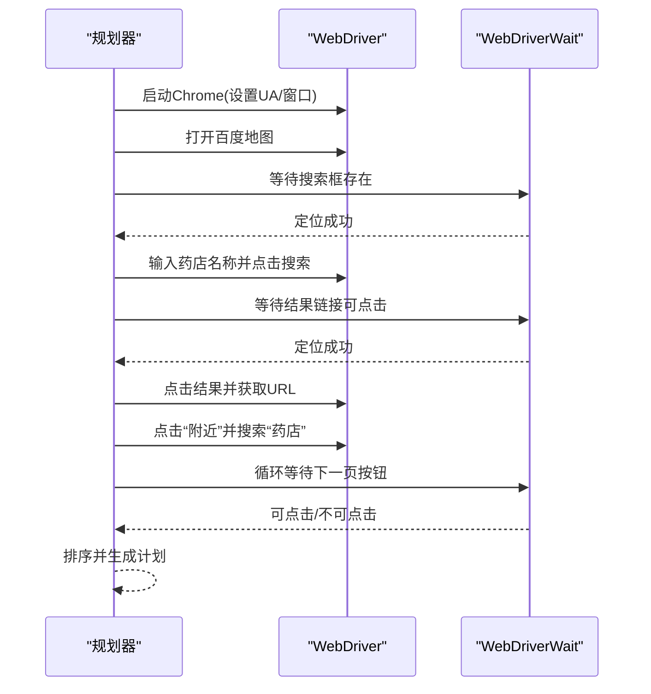
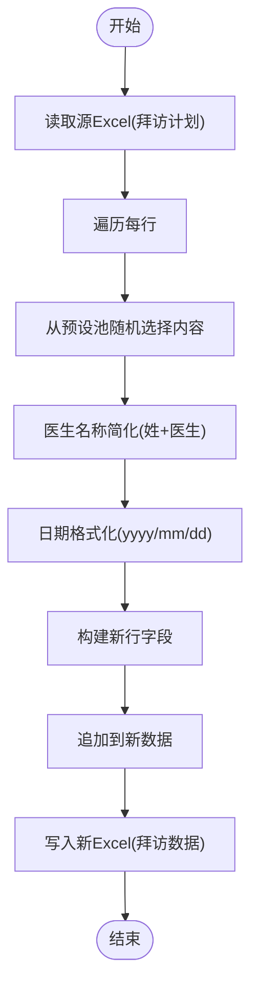
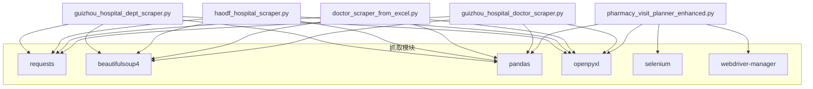

# 数据提取与抓取API

<cite>
**本文引用的文件**
- [guizhou_hospital_dept_scraper.py](file://医院/guizhou_hospital_dept_scraper.py)
- [haodf_hospital_scraper.py](file://医院/haodf_hospital_scraper.py)
- [doctor_scraper_from_excel.py](file://医院/doctor_scraper_from_excel.py)
- [guizhou_hospital_doctor_scraper.py](file://医院/guizhou_hospital_doctor_scraper.py)
- [pharmacy_visit_planner_enhanced.py](file://药店/pharmacy_visit_planner_enhanced.py)
- [生成拜访数据脚本.py](file://医院/生成拜访数据脚本.py)
</cite>

## 目录
1. [简介](#简介)
2. [项目结构](#项目结构)
3. [核心组件](#核心组件)
4. [架构总览](#架构总览)
5. [详细组件分析](#详细组件分析)
6. [依赖关系分析](#依赖关系分析)
7. [性能与稳定性建议](#性能与稳定性建议)
8. [故障排查指南](#故障排查指南)
9. [结论](#结论)
10. [附录：输出数据结构与字段定义](#附录输出数据结构与字段定义)

## 简介
本文件为“数据抓取模块”的API参考文档，聚焦于以下脚本的功能说明、配置参数、数据结构与异常处理：
- 贵州省医院科室抓取：guizhou_hospital_dept_scraper.py
- 好大夫在线医院列表抓取：haodf_hospital_scraper.py
- 基于Excel的医生抓取：doctor_scraper_from_excel.py
- 贵州省医生抓取（目标科室过滤）：guizhou_hospital_doctor_scraper.py
- 药店Selenium自动化规划：pharmacy_visit_planner_enhanced.py
- 模拟测试数据生成：生成拜访数据脚本.py

文档同时给出各脚本的输出JSON/CSV结构（以Excel形式呈现）、异常处理机制（网络超时、验证码触发等）、模拟测试数据生成接口说明以及依赖的第三方库版本要求。

## 项目结构
抓取模块位于“医院”与“药店”两个子目录中，分别承担静态网页抓取与Selenium自动化两类任务。核心脚本如下：
- 医院/：科室与医生信息抓取、Excel驱动抓取、目标科室医生抓取
- 药店/：基于Selenium的药店自动规划与导航

图表来源
- [guizhou_hospital_dept_scraper.py](file://医院/guizhou_hospital_dept_scraper.py#L328-L391)
- [haodf_hospital_scraper.py](file://医院/haodf_hospital_scraper.py#L118-L183)
- [doctor_scraper_from_excel.py](file://医院/doctor_scraper_from_excel.py#L284-L310)
- [guizhou_hospital_doctor_scraper.py](file://医院/guizhou_hospital_doctor_scraper.py#L470-L529)
- [pharmacy_visit_planner_enhanced.py](file://药店/pharmacy_visit_planner_enhanced.py#L1-L200)
- [生成拜访数据脚本.py](file://医院/生成拜访数据脚本.py#L1-L127)

章节来源
- [guizhou_hospital_dept_scraper.py](file://医院/guizhou_hospital_dept_scraper.py#L1-L391)
- [haodf_hospital_scraper.py](file://医院/haodf_hospital_scraper.py#L1-L183)
- [doctor_scraper_from_excel.py](file://医院/doctor_scraper_from_excel.py#L1-L310)
- [guizhou_hospital_doctor_scraper.py](file://医院/guizhou_hospital_doctor_scraper.py#L1-L529)
- [pharmacy_visit_planner_enhanced.py](file://药店/pharmacy_visit_planner_enhanced.py#L1-L200)
- [生成拜访数据脚本.py](file://医院/生成拜访数据脚本.py#L1-L127)

## 核心组件
- 网络请求与解析
  - requests会话与超时重试、指数退避、编码处理
  - BeautifulSoup解析HTML结构
- Excel读写与统计
  - pandas DataFrame构建与openpyxl写入
  - 统计信息（按城市/医院/科室维度）
- Selenium自动化
  - WebDriverWait显式等待、元素定位器（By.ID/By.XPATH/By.CSS_SELECTOR）
  - Chrome驱动配置与异常捕获
- 数据清洗与映射
  - 正则清洗医生姓名、职称、擅长领域
  - Excel列映射与字段规范化

章节来源
- [guizhou_hospital_dept_scraper.py](file://医院/guizhou_hospital_dept_scraper.py#L43-L110)
- [doctor_scraper_from_excel.py](file://医院/doctor_scraper_from_excel.py#L55-L110)
- [guizhou_hospital_doctor_scraper.py](file://医院/guizhou_hospital_doctor_scraper.py#L56-L120)
- [pharmacy_visit_planner_enhanced.py](file://药店/pharmacy_visit_planner_enhanced.py#L14-L52)

## 架构总览
整体流程分为“抓取—清洗—落盘”，部分脚本还包含“模拟测试数据生成”。

图表来源
- [guizhou_hospital_dept_scraper.py](file://医院/guizhou_hospital_dept_scraper.py#L43-L110)
- [doctor_scraper_from_excel.py](file://医院/doctor_scraper_from_excel.py#L105-L210)
- [guizhou_hospital_doctor_scraper.py](file://医院/guizhou_hospital_doctor_scraper.py#L285-L390)
- [pharmacy_visit_planner_enhanced.py](file://药店/pharmacy_visit_planner_enhanced.py#L110-L160)

## 详细组件分析

### 组件A：guizhou_hospital_dept_scraper.py（贵州省医院科室抓取）
- 目标URL模式
  - 医院列表页：固定域名下的省份列表页
  - 科室列表页：从医院URL中提取ID，拼接为科室列表页
- 请求头设置
  - User-Agent、Accept、Accept-Language、Accept-Encoding、Connection、Upgrade-Insecure-Requests
- 反爬策略
  - 指数退避重试（最大重试次数、等待时间）
  - 随机延时（2-4秒）降低请求频率
  - 编码统一为UTF-8
- 页面解析
  - 城市标题容器、医院列表容器、科室大类容器、科室链接与医生数量
- 输出结构
  - Excel包含“科室信息”、“统计信息”、“医院科室统计”、“城市科室统计”
  - 字段：医院名称、所属城市、医院等级、科室名称、医生数量、科室链接

图表来源
- [guizhou_hospital_dept_scraper.py](file://医院/guizhou_hospital_dept_scraper.py#L152-L327)
- [guizhou_hospital_dept_scraper.py](file://医院/guizhou_hospital_dept_scraper.py#L328-L391)

章节来源
- [guizhou_hospital_dept_scraper.py](file://医院/guizhou_hospital_dept_scraper.py#L28-L110)
- [guizhou_hospital_dept_scraper.py](file://医院/guizhou_hospital_dept_scraper.py#L152-L327)
- [guizhou_hospital_dept_scraper.py](file://医院/guizhou_hospital_dept_scraper.py#L328-L391)

### 组件B：haodf_hospital_scraper.py（好大夫在线医院列表抓取）
- 目标URL模式
  - 固定URL：省份列表页
- 请求头设置
  - User-Agent
- 页面解析
  - 城市标题、医院列表项、等级与特色提取
- 输出结构
  - Excel包含“医院列表”、“统计信息”、“城市统计”
  - 字段：城市、医院名称、医院等级、特色科室、医院URL、原始类型信息

图表来源
- [haodf_hospital_scraper.py](file://医院/haodf_hospital_scraper.py#L23-L117)
- [haodf_hospital_scraper.py](file://医院/haodf_hospital_scraper.py#L118-L183)

章节来源
- [haodf_hospital_scraper.py](file://医院/haodf_hospital_scraper.py#L17-L22)
- [haodf_hospital_scraper.py](file://医院/haodf_hospital_scraper.py#L23-L117)
- [haodf_hospital_scraper.py](file://医院/haodf_hospital_scraper.py#L118-L183)

### 组件C：doctor_scraper_from_excel.py（基于Excel的医生抓取）
- 配置参数
  - EXCEL_FILE_PATH：Excel文件路径
  - TARGET_SHEET_NAME：目标标签页名称
  - 输出文件：在同一目录生成带时间戳的Excel
- 请求头设置
  - User-Agent、Accept、Accept-Language、Accept-Encoding、Connection、Upgrade-Insecure-Requests
- 页面解析与分页
  - 科室URL构造（推荐列表页），分页参数（type=keshi, p=页码）
  - 医生列表容器、姓名、职称、学历/教授、擅长领域
- 数据映射规则
  - 从Excel读取：医院名称、所属城市、医院等级、科室名称、科室链接、医生数量
  - 写入Excel：医院名称、所属城市、医院等级、科室名称、医生姓名、职称、擅长领域、医生链接、抓取时间
- 异常处理
  - 网络超时/状态码异常：指数退避重试
  - 解析异常：逐条记录日志并跳过
  - 文件不存在：记录错误并返回空列表

图表来源
- [doctor_scraper_from_excel.py](file://医院/doctor_scraper_from_excel.py#L71-L210)
- [doctor_scraper_from_excel.py](file://医院/doctor_scraper_from_excel.py#L284-L310)

章节来源
- [doctor_scraper_from_excel.py](file://医院/doctor_scraper_from_excel.py#L20-L39)
- [doctor_scraper_from_excel.py](file://医院/doctor_scraper_from_excel.py#L71-L210)
- [doctor_scraper_from_excel.py](file://医院/doctor_scraper_from_excel.py#L284-L310)

### 组件D：guizhou_hospital_doctor_scraper.py（目标科室医生抓取）
- 目标科室关键词
  - 呼吸、儿科、妇科、泌尿、肾脏、中医、全科等
- 请求头设置
  - User-Agent、Accept、Accept-Language、Accept-Encoding、Connection、Upgrade-Insecure-Requests
- 页面解析与分页
  - 科室URL构造（推荐列表页），分页参数（type=keshi, p=页码）
  - 医生列表容器、姓名、职称、学历/教授、擅长领域
- 输出结构
  - Excel包含“医生信息”、“医院统计”、“科室统计”
  - 字段：医院名称、所属城市、医院等级、科室名称、医生姓名、职称、擅长领域、医生链接、抓取时间

图表来源
- [guizhou_hospital_doctor_scraper.py](file://医院/guizhou_hospital_doctor_scraper.py#L72-L177)
- [guizhou_hospital_doctor_scraper.py](file://医院/guizhou_hospital_doctor_scraper.py#L178-L284)
- [guizhou_hospital_doctor_scraper.py](file://医院/guizhou_hospital_doctor_scraper.py#L285-L390)
- [guizhou_hospital_doctor_scraper.py](file://医院/guizhou_hospital_doctor_scraper.py#L470-L529)

章节来源
- [guizhou_hospital_doctor_scraper.py](file://医院/guizhou_hospital_doctor_scraper.py#L30-L60)
- [guizhou_hospital_doctor_scraper.py](file://医院/guizhou_hospital_doctor_scraper.py#L178-L284)
- [guizhou_hospital_doctor_scraper.py](file://医院/guizhou_hospital_doctor_scraper.py#L285-L390)
- [guizhou_hospital_doctor_scraper.py](file://医院/guizhou_hospital_doctor_scraper.py#L470-L529)

### 组件E：pharmacy_visit_planner_enhanced.py（Selenium自动化规划）
- Selenium等待策略
  - WebDriverWait显式等待，结合ExpectedConditions：
    - presence_of_element_located
    - element_to_be_clickable
    - By.ID、By.XPATH、By.CSS_SELECTOR
- 页面元素定位器示例
  - 搜索框：ID="sole-input"
  - 搜索按钮：ID="search-button"
  - 结果链接：XPath包含药店名称
  - 附近按钮：XPath包含“附近”
  - 附近输入框：ID="nearby-input"
  - 下一页按钮：CSS选择器[tid="toNextPage"]
- 反爬策略
  - 设置窗口大小、User-Agent
  - 显式等待减少“元素不存在”异常
  - 异常捕获与降级处理
- 输出结构
  - Excel包含“药店拜访计划”工作表，字段：拜访编号、终端名称、医院/商业/药店、终端等级、地址、拜访日期、拜访时间、拜访科室/部门、拜访对象、拜访人员、拜访目的及效果、客户反馈、拜访结束时间、药店详情页URL、距离、路程时间(分钟)

图表来源
- [pharmacy_visit_planner_enhanced.py](file://药店/pharmacy_visit_planner_enhanced.py#L14-L52)
- [pharmacy_visit_planner_enhanced.py](file://药店/pharmacy_visit_planner_enhanced.py#L110-L160)
- [pharmacy_visit_planner_enhanced.py](file://药店/pharmacy_visit_planner_enhanced.py#L183-L293)

章节来源
- [pharmacy_visit_planner_enhanced.py](file://药店/pharmacy_visit_planner_enhanced.py#L14-L52)
- [pharmacy_visit_planner_enhanced.py](file://药店/pharmacy_visit_planner_enhanced.py#L110-L160)
- [pharmacy_visit_planner_enhanced.py](file://药店/pharmacy_visit_planner_enhanced.py#L183-L293)

### 组件F：生成拜访数据脚本.py（模拟测试数据生成）
- 功能概述
  - 读取现有“拜访计划”Excel，基于预设内容池随机生成“拜访目的及效果”与“客户反馈”
  - 对医生名称进行“姓+医生”的简化处理
  - 日期格式标准化
- 输出结构
  - 新Excel包含“拜访数据”工作表，字段：拜访编号、终端名称、医院/商业/药店、终端等级、地址、拜访日期（yyyy/mm/dd）、拜访时间、拜访科室/部门、拜访对象、拜访人员、拜访目的及效果、客户反馈

图表来源
- [生成拜访数据脚本.py](file://医院/生成拜访数据脚本.py#L1-L127)

章节来源
- [生成拜访数据脚本.py](file://医院/生成拜访数据脚本.py#L1-L127)

## 依赖关系分析
- 第三方库
  - requests、BeautifulSoup4、pandas、openpyxl（抓取与Excel）
  - selenium、webdriver-manager（Selenium自动化）
  - pillow、pillow-heif（图片处理相关工具，非抓取模块直接依赖）
- 版本要求
  - 仓库未提供明确版本约束文件，建议在隔离环境中安装最新稳定版本以确保兼容性
  - Selenium自动化依赖Chrome浏览器与对应版本的chromedriver

图表来源
- [guizhou_hospital_dept_scraper.py](file://医院/guizhou_hospital_dept_scraper.py#L8-L16)
- [haodf_hospital_scraper.py](file://医院/haodf_hospital_scraper.py#L9-L14)
- [doctor_scraper_from_excel.py](file://医院/doctor_scraper_from_excel.py#L8-L18)
- [guizhou_hospital_doctor_scraper.py](file://医院/guizhou_hospital_doctor_scraper.py#L8-L18)
- [pharmacy_visit_planner_enhanced.py](file://药店/pharmacy_visit_planner_enhanced.py#L18-L27)

章节来源
- [guizhou_hospital_dept_scraper.py](file://医院/guizhou_hospital_dept_scraper.py#L8-L16)
- [haodf_hospital_scraper.py](file://医院/haodf_hospital_scraper.py#L9-L14)
- [doctor_scraper_from_excel.py](file://医院/doctor_scraper_from_excel.py#L8-L18)
- [guizhou_hospital_doctor_scraper.py](file://医院/guizhou_hospital_doctor_scraper.py#L8-L18)
- [pharmacy_visit_planner_enhanced.py](file://药店/pharmacy_visit_planner_enhanced.py#L18-L27)

## 性能与稳定性建议
- 网络请求
  - 合理设置超时与指数退避，避免触发反爬机制
  - 控制并发与请求频率，必要时使用代理池
- 解析健壮性
  - 对HTML结构变化进行容错处理（备用解析路径）
  - 对缺失字段进行默认值填充
- Excel写入
  - 分sheet写入，避免单文件过大
  - 统计信息与明细分离，便于后续分析
- Selenium自动化
  - 显式等待优于固定sleep
  - 异常捕获与降级策略，避免因个别元素异常导致整个流程中断

[本节为通用建议，不直接分析具体文件]

## 故障排查指南
- 网络超时/状态码异常
  - 指数退避重试（最大重试次数、等待时间）
  - 日志记录URL与错误信息
- 验证码触发
  - Selenium自动化中遇到验证码时，建议暂停并人工干预
  - 可考虑加入验证码识别或人工确认流程
- HTML结构变化
  - 备用解析路径（如不同容器类名）
  - 正则清洗与字段默认值
- 文件读写失败
  - 检查文件路径与权限
  - Excel写入异常时记录详细错误

章节来源
- [guizhou_hospital_dept_scraper.py](file://医院/guizhou_hospital_dept_scraper.py#L43-L110)
- [doctor_scraper_from_excel.py](file://医院/doctor_scraper_from_excel.py#L55-L110)
- [guizhou_hospital_doctor_scraper.py](file://医院/guizhou_hospital_doctor_scraper.py#L56-L120)
- [pharmacy_visit_planner_enhanced.py](file://药店/pharmacy_visit_planner_enhanced.py#L110-L160)

## 结论
本API参考文档梳理了四个核心抓取脚本的配置参数、解析逻辑、输出结构与异常处理策略，并给出了Selenium等待策略与页面元素定位器说明。建议在生产环境中结合指数退避、显式等待与日志监控，确保抓取稳定性与可维护性。

[本节为总结性内容，不直接分析具体文件]

## 附录：输出数据结构与字段定义

### Excel输出结构与字段定义
- 贵州省医院科室信息（科室信息）
  - 字段：医院名称、所属城市、医院等级、科室名称、医生数量、科室链接
  - 统计信息：总科室数、医院数、城市数、总医生数
  - 按医院统计：医院名称、科室数量
  - 按城市统计：所属城市、科室数量
- 贵州省医院列表（医院列表）
  - 字段：城市、医院名称、医院等级、特色科室、医院URL、原始类型信息
  - 统计信息：总医院数、城市数、三甲/二甲/其他数量
  - 按城市统计：城市、医院数量
- 贵州省医生信息（医生信息）
  - 字段：医院名称、所属城市、医院等级、科室名称、医生姓名、职称、擅长领域、医生链接、抓取时间
  - 统计：按医院统计（医生数量、科室列表）、按科室统计（医生数量、医院列表）
- 药店拜访计划（药店拜访计划）
  - 字段：拜访编号、终端名称、医院/商业/药店、终端等级、地址、拜访日期、拜访时间、拜访科室/部门、拜访对象、拜访人员、拜访目的及效果、客户反馈、拜访结束时间、药店详情页URL、距离、路程时间(分钟)
- 模拟测试数据（拜访数据）
  - 字段：拜访编号、终端名称、医院/商业/药店、终端等级（固定）、地址、拜访日期（yyyy/mm/dd）、拜访时间、拜访科室/部门、拜访对象（姓+医生）、拜访人员、拜访目的及效果、客户反馈

章节来源
- [guizhou_hospital_dept_scraper.py](file://医院/guizhou_hospital_dept_scraper.py#L328-L391)
- [haodf_hospital_scraper.py](file://医院/haodf_hospital_scraper.py#L118-L183)
- [doctor_scraper_from_excel.py](file://医院/doctor_scraper_from_excel.py#L284-L310)
- [guizhou_hospital_doctor_scraper.py](file://医院/guizhou_hospital_doctor_scraper.py#L470-L529)
- [pharmacy_visit_planner_enhanced.py](file://药店/pharmacy_visit_planner_enhanced.py#L1-L200)
- [生成拜访数据脚本.py](file://医院/生成拜访数据脚本.py#L78-L113)