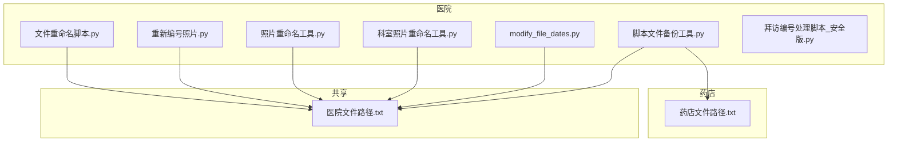
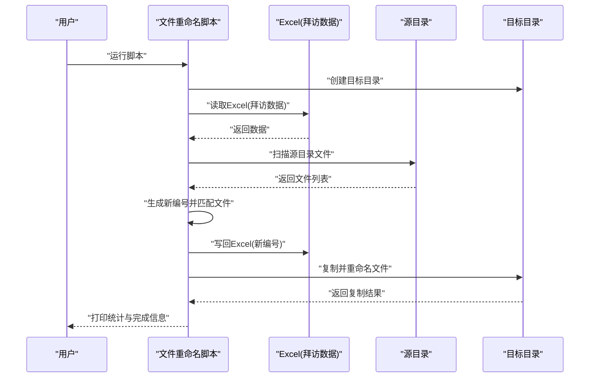
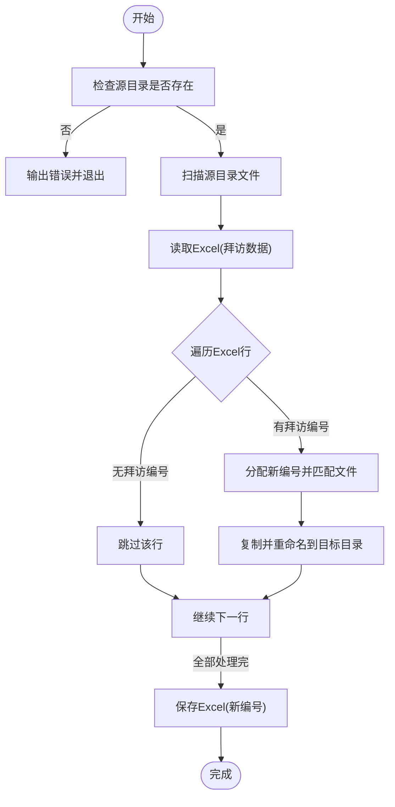
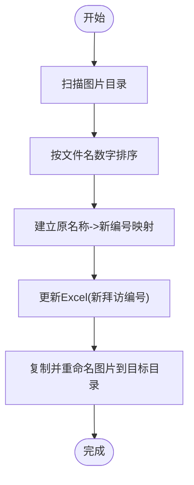
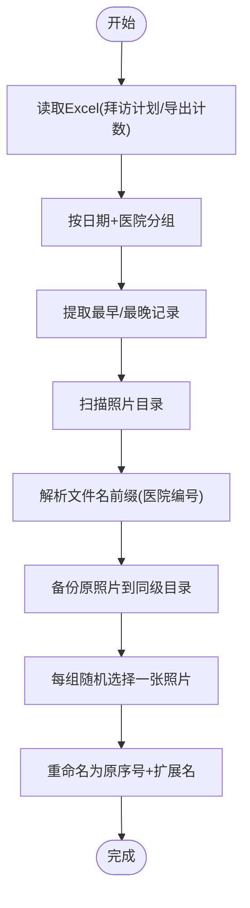
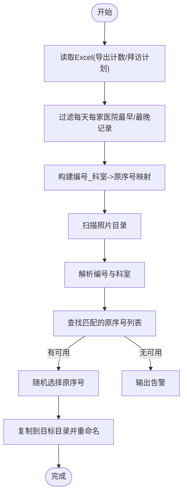
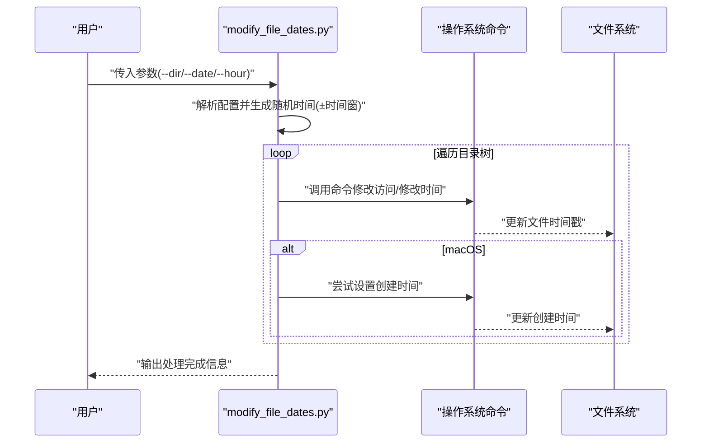
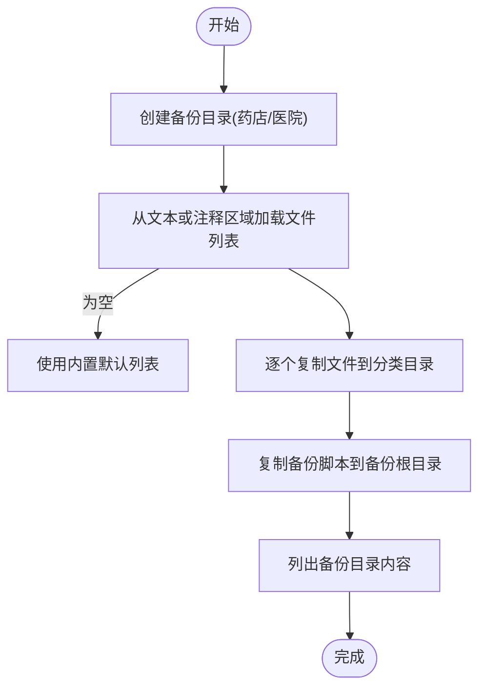
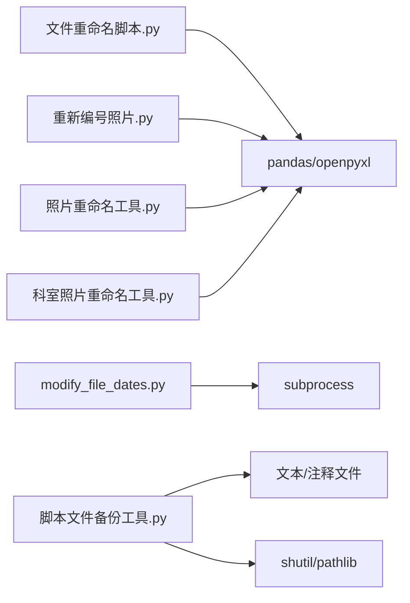

# 文件管理工具API

<cite>
**本文引用的文件**
- [文件重命名脚本.py](file://医院/文件重命名脚本.py)
- [重新编号照片.py](file://医院/重新编号照片.py)
- [照片重命名工具.py](file://医院/照片重命名工具.py)
- [科室照片重命名工具.py](file://医院/科室照片重命名工具.py)
- [modify_file_dates.py](file://医院/modify_file_dates.py)
- [脚本文件备份工具.py](file://医院/脚本文件备份工具.py)
- [拜访编号处理脚本_安全版.py](file://医院/拜访编号处理脚本_安全版.py)
- [药店文件路径.txt](file://药店文件路径.txt)
- [医院文件路径.txt](file://医院文件路径.txt)
</cite>

## 目录
1. [简介](#简介)
2. [项目结构](#项目结构)
3. [核心组件](#核心组件)
4. [架构总览](#架构总览)
5. [详细组件分析](#详细组件分析)
6. [依赖分析](#依赖分析)
7. [性能考虑](#性能考虑)
8. [故障排查指南](#故障排查指南)
9. [结论](#结论)
10. [附录](#附录)

## 简介
本文件管理工具API文档面向“文件重命名脚本”“重新编号照片工具”“照片重命名工具”“科室照片重命名工具”“modify_file_dates.py”“脚本文件备份工具”等工具，系统化说明以下内容：
- 文件重命名脚本的命名模板语法与批量处理流程、冲突处理策略
- 重新编号照片的序列生成规则与文件排序逻辑
- 照片重命名工具与科室照片重命名工具的匹配与重命名规则
- modify_file_dates.py 的时间戳修改精度与时区处理
- 跨平台路径处理兼容性说明
- 脚本文件备份工具的版本控制策略与备份路径生成规则
- 安全防护机制（防覆盖重要文件）的配置参数说明
- 返回状态码定义与常见错误处理

## 项目结构
仓库采用按功能模块划分的组织方式，核心工具集中在“医院”目录下，另有“药店”相关规划与数据处理脚本。关键工具分布如下：
- 文件重命名脚本：基于Excel中的“拜访编号”与源文件名匹配，批量重命名并复制到目标目录
- 重新编号照片：按照片文件名排序后重新编号，更新Excel中的“新拜访编号”，同时复制重命名后的照片
- 照片重命名工具：根据Excel中的“拜访计划”和“导出计数_列B”映射，按医院编号与最早/最晚拜访时间规则，随机选择照片重命名为“原序号”
- 科室照片重命名工具：从文件名中解析编号与科室，匹配Excel中的“编号_科室”映射，随机分配“原序号”作为新文件名
- modify_file_dates.py：遍历目录树，修改文件/目录的访问/修改时间，并在macOS上尝试设置创建时间
- 脚本文件备份工具：从文本或脚本注释区域提取待备份文件列表，按“药店/医院”分类复制到备份目录

图表来源
- [文件重命名脚本.py](file://医院/文件重命名脚本.py#L1-L130)
- [重新编号照片.py](file://医院/重新编号照片.py#L1-L108)
- [照片重命名工具.py](file://医院/照片重命名工具.py#L1-L263)
- [科室照片重命名工具.py](file://医院/科室照片重命名工具.py#L1-L200)
- [modify_file_dates.py](file://医院/modify_file_dates.py#L1-L95)
- [脚本文件备份工具.py](file://医院/脚本文件备份工具.py#L1-L285)
- [药店文件路径.txt](file://药店文件路径.txt#L1-L30)
- [医院文件路径.txt](file://医院文件路径.txt#L1-L54)

章节来源
- [文件重命名脚本.py](file://医院/文件重命名脚本.py#L1-L130)
- [重新编号照片.py](file://医院/重新编号照片.py#L1-L108)
- [照片重命名工具.py](file://医院/照片重命名工具.py#L1-L263)
- [科室照片重命名工具.py](file://医院/科室照片重命名工具.py#L1-L200)
- [modify_file_dates.py](file://医院/modify_file_dates.py#L1-L95)
- [脚本文件备份工具.py](file://医院/脚本文件备份工具.py#L1-L285)
- [药店文件路径.txt](file://药店文件路径.txt#L1-L30)
- [医院文件路径.txt](file://医院文件路径.txt#L1-L54)

## 核心组件
- 文件重命名脚本：读取Excel“拜访数据”，生成“新编号”，匹配源文件名，复制并重命名到目标目录；支持空“拜访编号”的跳过与告警
- 重新编号照片：扫描图片目录，按文件名数字排序，生成新编号，更新Excel“新拜访编号”，复制重命名后的照片
- 照片重命名工具：读取“拜访计划”和“导出计数_列B”，按日期+医院分组取最早/最晚记录，随机选择照片重命名为“原序号”
- 科室照片重命名工具：从文件名解析“编号_科室”，匹配Excel映射，随机分配“原序号”作为新文件名
- modify_file_dates.py：遍历目录树，生成目标时间（含小时与时间窗），调用系统命令修改访问/修改时间；macOS额外设置创建时间
- 脚本文件备份工具：从文本或脚本注释区域提取文件列表，按“药店/医院”分类复制到备份目录，支持复制自身到备份根目录

章节来源
- [文件重命名脚本.py](file://医院/文件重命名脚本.py#L1-L130)
- [重新编号照片.py](file://医院/重新编号照片.py#L1-L108)
- [照片重命名工具.py](file://医院/照片重命名工具.py#L1-L263)
- [科室照片重命名工具.py](file://医院/科室照片重命名工具.py#L1-L200)
- [modify_file_dates.py](file://医院/modify_file_dates.py#L1-L95)
- [脚本文件备份工具.py](file://医院/脚本文件备份工具.py#L1-L285)

## 架构总览
以下序列图展示“文件重命名脚本”的典型执行流程，包括Excel读取、文件扫描、匹配与复制重命名、结果输出。

图表来源
- [文件重命名脚本.py](file://医院/文件重命名脚本.py#L1-L130)

章节来源
- [文件重命名脚本.py](file://医院/文件重命名脚本.py#L1-L130)

## 详细组件分析

### 文件重命名脚本（命名模板与批量处理）
- 命名模板语法
  - 该脚本未定义通用命名模板语法，而是依据Excel中的“拜访编号”与源文件名匹配，生成“新编号”并重命名为“新编号+扩展名”。若“拜访编号”为空或缺失，则跳过该行并输出告警。
- 批量处理机制
  - 扫描源目录文件，构建“文件名(不含扩展) -> 文件名”的映射
  - 遍历Excel行，对存在“拜访编号”的记录分配自增新编号，并查找对应文件
  - 将匹配成功的文件复制到目标目录，重命名为“新编号+扩展名”
- 冲突解决策略
  - 若Excel中“拜访编号”与源文件名不匹配，输出告警并跳过该条记录
  - 若源目录不存在或不可访问，提前终止并输出错误
  - 复制过程异常会捕获并输出错误信息，不影响其他文件处理
- 输出与统计
  - 统计处理文件数量、目标目录与Excel更新情况

图表来源
- [文件重命名脚本.py](file://医院/文件重命名脚本.py#L1-L130)

章节来源
- [文件重命名脚本.py](file://医院/文件重命名脚本.py#L1-L130)

### 重新编号照片工具（序列生成与排序）
- 序列生成规则
  - 读取Excel工作表“科室”，在末尾添加“新拜访编号”列（若不存在）
  - 遍历Excel行，将第一列的原始名称映射到新编号（1,2,3…），缺失则留空
- 文件排序逻辑
  - 扫描图片源目录，仅保留图片文件（.jpg/.jpeg/.png/.webp）
  - 按文件名转换为整数排序；非数字文件名排在最后
  - 依序生成新编号并复制到目标目录，文件名重命名为“新编号+扩展名”
- 输出与统计
  - 打印处理数量、目标目录与Excel更新情况

图表来源
- [重新编号照片.py](file://医院/重新编号照片.py#L1-L108)

章节来源
- [重新编号照片.py](file://医院/重新编号照片.py#L1-L108)

### 照片重命名工具（匹配与重命名规则）
- 匹配规则
  - 读取“拜访计划”和“导出计数_列B”，建立“医院名称 -> 编号”的映射
  - 按“日期+医院”分组，提取每组最早/最晚的拜访记录
  - 识别照片文件名前缀（以数字-或数字_开头）并提取“医院编号”
- 重命名逻辑
  - 按医院编号分组照片，备份原目录同级“大门原照片备份”
  - 对每组随机选择一张照片，重命名为“原序号+扩展名”
- 安全与容错
  - 无法解析文件名时输出告警
  - 目录不存在或重命名失败时输出告警并继续处理

图表来源
- [照片重命名工具.py](file://医院/照片重命名工具.py#L1-L263)

章节来源
- [照片重命名工具.py](file://医院/照片重命名工具.py#L1-L263)

### 科室照片重命名工具（文件名解析与分配）
- 文件名解析
  - 从文件名中提取“编号_科室_…”的编号与科室信息
- 映射与分配
  - 读取Excel“导出计数_列B”建立“编号 -> 名称”映射
  - 读取“拜访计划”，过滤掉每天每家医院最早/最晚的记录
  - 构建“编号_科室 -> 原序号列表”的映射
  - 对每个照片文件，随机从可用原序号中选择一个，复制到目标目录并重命名为“原序号+扩展名”
- 容错与提示
  - 无法解析文件名或无可用原序号时输出告警

图表来源
- [科室照片重命名工具.py](file://医院/科室照片重命名工具.py#L1-L200)

章节来源
- [科室照片重命名工具.py](file://医院/科室照片重命名工具.py#L1-L200)

### modify_file_dates.py（时间戳修改与精度/时区）
- 功能概述
  - 遍历目标目录树，逐个文件与目录修改访问/修改时间
  - 通过命令行参数支持覆盖默认配置（目标目录、目标日期、目标小时）
- 精度控制与时区处理
  - 精度：使用系统命令将时间精确到分钟级别
  - 时区：脚本未显式处理时区转换，实际时间由系统本地时区决定
- 平台差异
  - macOS：额外尝试设置创建时间（依赖系统工具）
- 命令行参数
  - --dir：目标目录
  - --date：目标日期（YYYYMMDD）
  - --hour：目标小时（0-23）

图表来源
- [modify_file_dates.py](file://医院/modify_file_dates.py#L1-L95)

章节来源
- [modify_file_dates.py](file://医院/modify_file_dates.py#L1-L95)

### 脚本文件备份工具（版本控制与备份路径）
- 版本控制策略
  - 通过复制脚本文件到备份目录实现“版本化”；脚本自身也会被复制到备份目录根目录，便于后续恢复
- 备份路径生成规则
  - 备份根目录：固定基路径下创建“药店/医院”子目录
  - 文件列表来源：
    - 优先从文本文件（药店/医院文件路径.txt）加载路径
    - 若文本文件为空或缺失，则从当前脚本注释区域提取（注释块包含起止标记）
    - 若仍为空，则使用内置默认列表
  - 复制行为：逐个文件复制到对应分类目录，失败项单独记录
- 输出与统计
  - 打印成功/失败数量、失败文件清单、备份目录内容列表

图表来源
- [脚本文件备份工具.py](file://医院/脚本文件备份工具.py#L1-L285)
- [药店文件路径.txt](file://药店文件路径.txt#L1-L30)
- [医院文件路径.txt](file://医院文件路径.txt#L1-L54)

章节来源
- [脚本文件备份工具.py](file://医院/脚本文件备份工具.py#L1-L285)
- [药店文件路径.txt](file://药店文件路径.txt#L1-L30)
- [医院文件路径.txt](file://医院文件路径.txt#L1-L54)

### 安全防护机制与配置参数
- 防覆盖重要文件
  - “拜访编号处理脚本_安全版.py”在修改Excel时先创建备份文件，避免直接覆盖原文件，降低风险
  - “照片重命名工具.py”在重命名前会备份原照片到同级目录，保留原始文件
  - “科室照片重命名工具.py”采用复制而非移动，保留原文件
- 配置参数
  - modify_file_dates.py：可通过命令行参数覆盖默认配置（目标目录、目标日期、目标小时）
  - 脚本文件备份工具：可通过注释块或文本文件自定义待备份文件列表

章节来源
- [拜访编号处理脚本_安全版.py](file://医院/拜访编号处理脚本_安全版.py#L1-L170)
- [照片重命名工具.py](file://医院/照片重命名工具.py#L1-L263)
- [科室照片重命名工具.py](file://医院/科室照片重命名工具.py#L1-L200)
- [modify_file_dates.py](file://医院/modify_file_dates.py#L1-L95)
- [脚本文件备份工具.py](file://医院/脚本文件备份工具.py#L1-L285)

## 依赖分析
- 组件耦合
  - 文件重命名脚本与Excel紧密耦合，依赖“拜访数据/拜访计划”工作表
  - 重新编号照片与Excel“科室”工作表耦合，依赖“新拜访编号”列
  - 照片重命名工具依赖“拜访计划”和“导出计数_列B”两个工作表
  - 科室照片重命名工具依赖“导出计数_列B”和“拜访计划”，并解析文件名
  - modify_file_dates.py依赖系统命令行工具（macOS需安装Xcode命令行工具以支持创建时间设置）
  - 脚本文件备份工具依赖文本文件或脚本注释区域提供的文件列表
- 外部依赖
  - pandas、openpyxl（Excel读写）
  - pathlib、shutil（路径与文件操作）
  - subprocess（系统命令调用）

图表来源
- [文件重命名脚本.py](file://医院/文件重命名脚本.py#L1-L130)
- [重新编号照片.py](file://医院/重新编号照片.py#L1-L108)
- [照片重命名工具.py](file://医院/照片重命名工具.py#L1-L263)
- [科室照片重命名工具.py](file://医院/科室照片重命名工具.py#L1-L200)
- [modify_file_dates.py](file://医院/modify_file_dates.py#L1-L95)
- [脚本文件备份工具.py](file://医院/脚本文件备份工具.py#L1-L285)

章节来源
- [文件重命名脚本.py](file://医院/文件重命名脚本.py#L1-L130)
- [重新编号照片.py](file://医院/重新编号照片.py#L1-L108)
- [照片重命名工具.py](file://医院/照片重命名工具.py#L1-L263)
- [科室照片重命名工具.py](file://医院/科室照片重命名工具.py#L1-L200)
- [modify_file_dates.py](file://医院/modify_file_dates.py#L1-L95)
- [脚本文件备份工具.py](file://医院/脚本文件备份工具.py#L1-L285)

## 性能考虑
- I/O密集型：大量文件复制与重命名操作，建议在SSD上执行，避免网络盘
- Excel读写：pandas/openpyxl在大数据量时可能较慢，建议拆分工作表或减少不必要的列
- 排序与映射：文件名数字排序与字典映射复杂度较低，主要瓶颈在磁盘IO
- 并发：当前脚本未使用并发，如需加速可考虑多进程处理不同目录或文件组

## 故障排查指南
- Excel读取失败
  - 症状：读取Excel报错或无法定位工作表
  - 处理：确认工作表名称与列名；必要时更换引擎或检查文件格式
- 目录不存在或权限不足
  - 症状：脚本报错提示目录不存在或复制失败
  - 处理：检查路径配置，确保目录存在且具备读写权限
- 文件名解析失败
  - 症状：无法从文件名提取编号或匹配不到记录
  - 处理：检查文件命名规范与Excel映射关系
- modify_file_dates.py权限问题
  - 症状：macOS设置创建时间失败
  - 处理：安装Xcode命令行工具并授予相应权限
- 脚本备份工具路径为空
  - 症状：未复制任何文件
  - 处理：检查文本文件或注释块格式，确保路径正确

章节来源
- [文件重命名脚本.py](file://医院/文件重命名脚本.py#L1-L130)
- [重新编号照片.py](file://医院/重新编号照片.py#L1-L108)
- [照片重命名工具.py](file://医院/照片重命名工具.py#L1-L263)
- [科室照片重命名工具.py](file://医院/科室照片重命名工具.py#L1-L200)
- [modify_file_dates.py](file://医院/modify_file_dates.py#L1-L95)
- [脚本文件备份工具.py](file://医院/脚本文件备份工具.py#L1-L285)

## 结论
上述工具围绕“文件重命名”“照片编号”“时间戳修改”“脚本备份”四大主题，提供了从数据驱动到批量处理的完整链路。通过明确的匹配规则、安全防护与容错机制，能够在保证数据一致性的同时提升自动化效率。建议在生产环境中结合命令行参数与备份策略，确保可追溯与可恢复。

## 附录

### 返回状态码定义
- 文件重命名脚本
  - 成功：正常完成（无显式返回码）
  - 失败：捕获异常并打印堆栈，返回码取决于运行环境（通常为非零）
- 重新编号照片
  - 成功：正常完成
  - 失败：异常捕获并打印，返回码取决于运行环境
- 照片重命名工具
  - 成功：正常完成
  - 失败：异常捕获并打印，返回码取决于运行环境
- 科室照片重命名工具
  - 成功：正常完成
  - 失败：异常捕获并打印，返回码取决于运行环境
- modify_file_dates.py
  - 成功：遍历完成
  - 失败：命令行调用失败或权限不足
- 脚本文件备份工具
  - 成功：复制完成并列出统计
  - 失败：路径无效或复制异常

章节来源
- [文件重命名脚本.py](file://医院/文件重命名脚本.py#L1-L130)
- [重新编号照片.py](file://医院/重新编号照片.py#L1-L108)
- [照片重命名工具.py](file://医院/照片重命名工具.py#L1-L263)
- [科室照片重命名工具.py](file://医院/科室照片重命名工具.py#L1-L200)
- [modify_file_dates.py](file://医院/modify_file_dates.py#L1-L95)
- [脚本文件备份工具.py](file://医院/脚本文件备份工具.py#L1-L285)

### 跨平台路径处理兼容性说明
- 路径分隔符：使用pathlib与os.path统一处理，避免硬编码斜杠
- 文件扩展名：统一使用扩展名判断与拼接
- 平台差异：
  - macOS：modify_file_dates.py额外调用系统命令设置创建时间，需安装Xcode命令行工具
  - Windows/Linux：modify_file_dates.py依赖系统命令行工具，需确保命令可用

章节来源
- [modify_file_dates.py](file://医院/modify_file_dates.py#L1-L95)