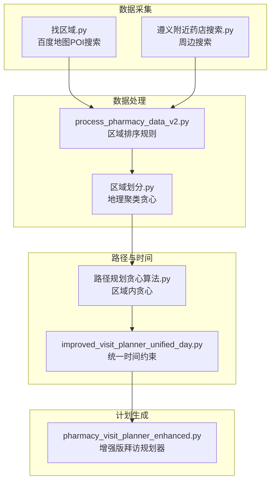
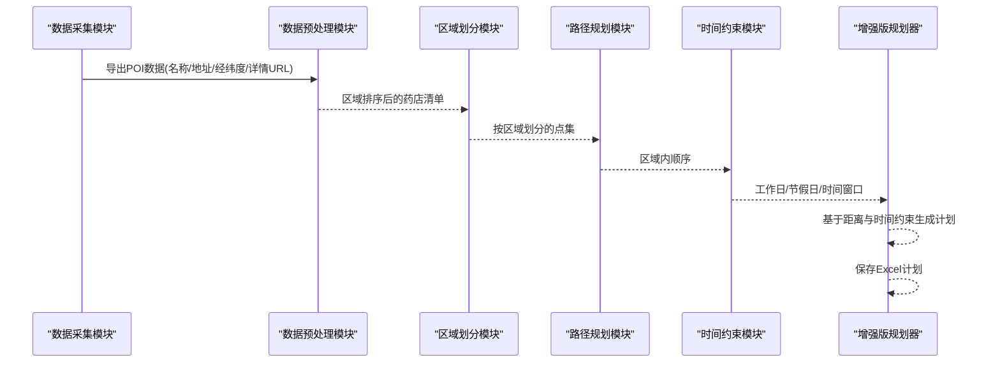
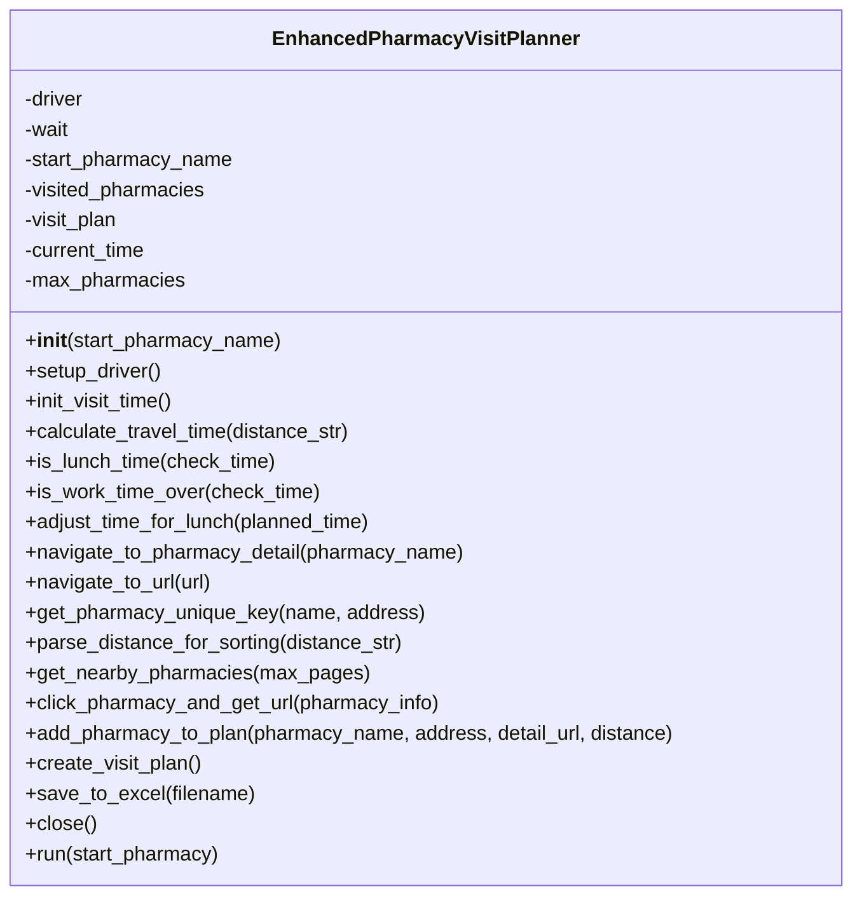
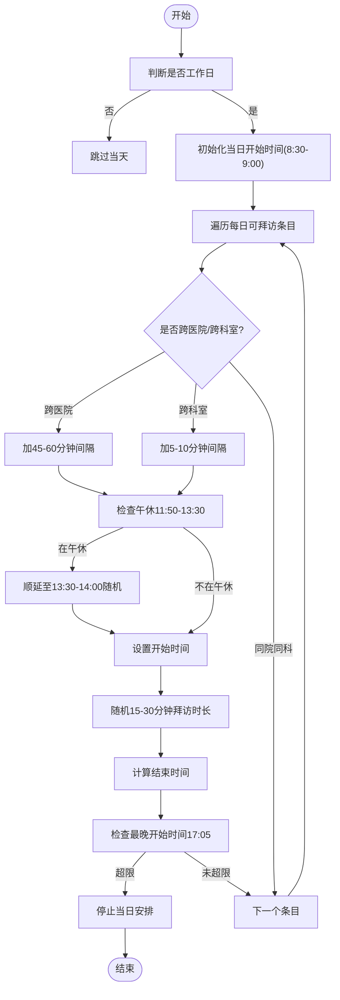
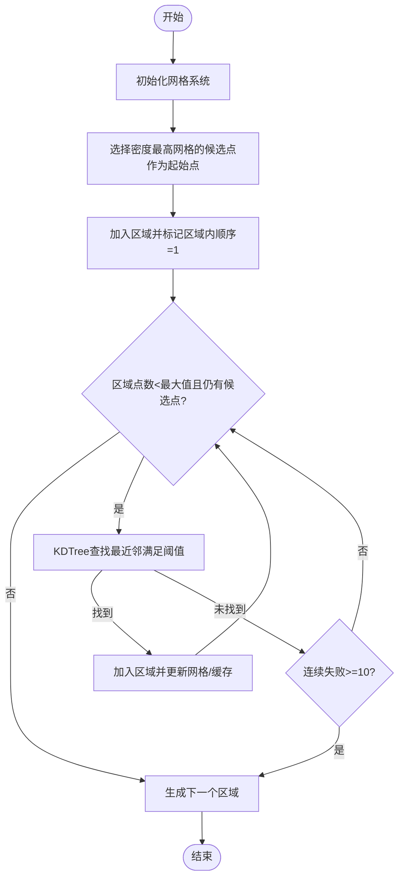
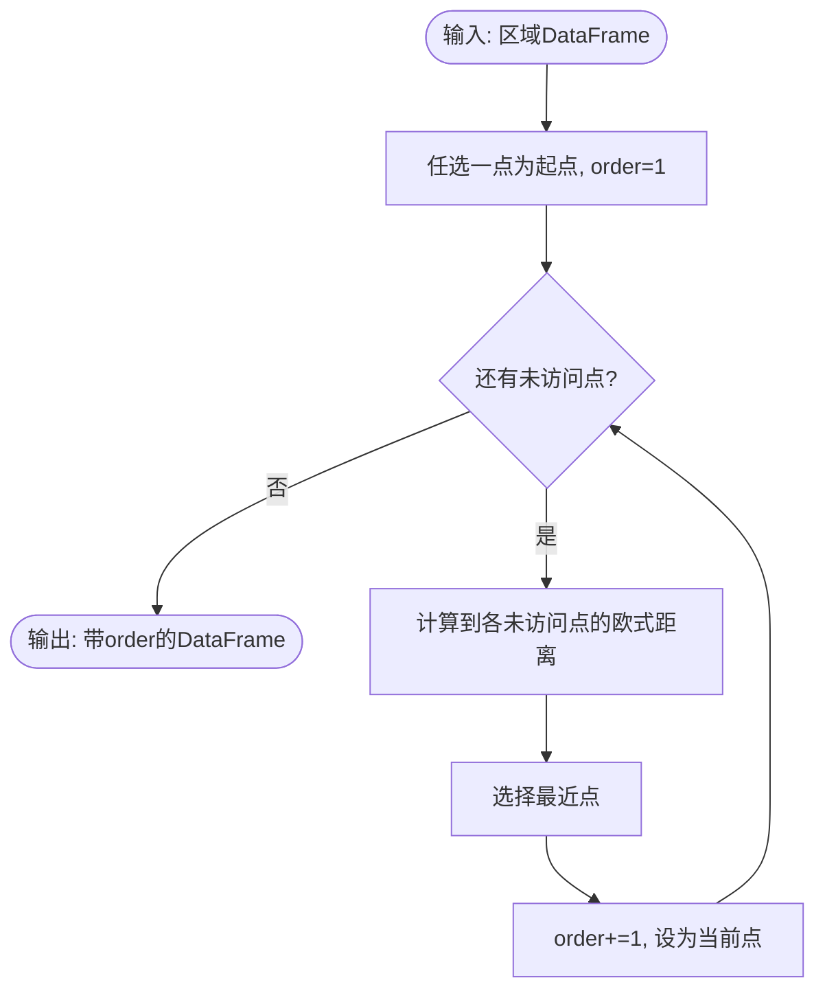
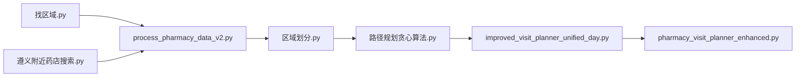
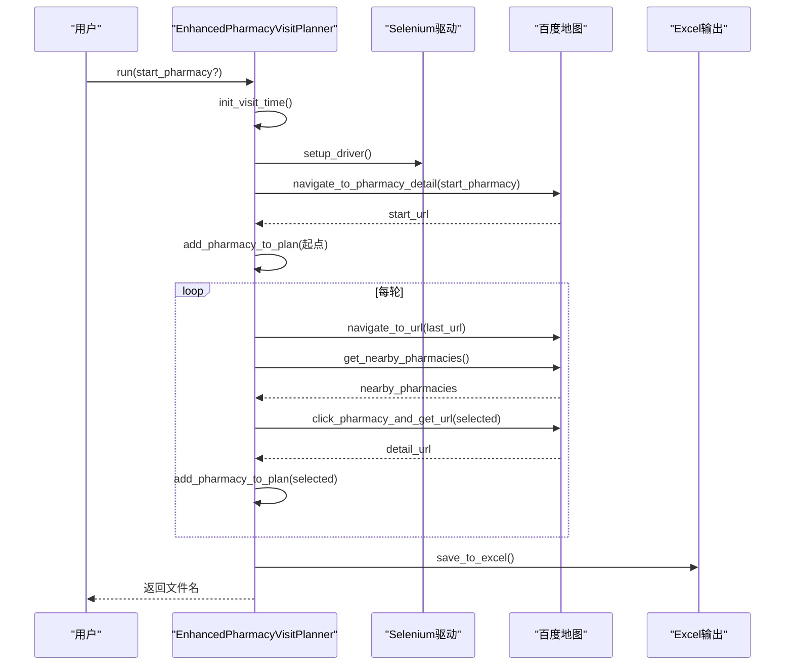
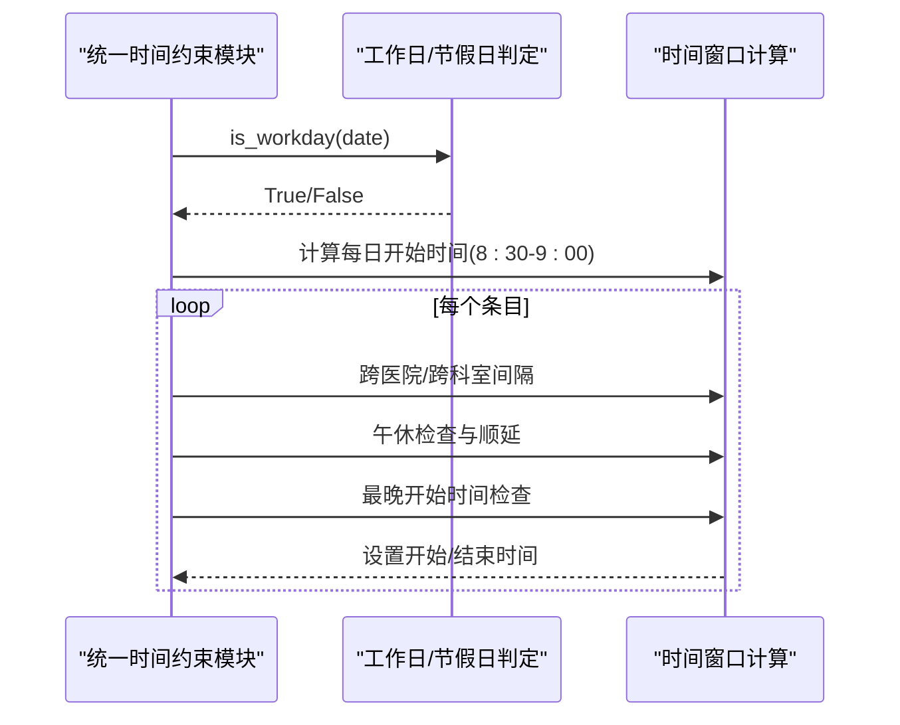

# 药店拜访计划API

<cite>
**本文引用的文件**
- [pharmacy_visit_planner_enhanced.py](file://药店/pharmacy_visit_planner_enhanced.py)
- [improved_visit_planner_unified_day.py](file://药店/improved_visit_planner_unified_day.py)
- [process_pharmacy_data_v2.py](file://药店/process_pharmacy_data_v2.py)
- [区域划分.py](file://药店/区域划分.py)
- [路径规划贪心算法.py](file://药店/路径规划贪心算法.py)
- [找区域.py](file://药店/找区域.py)
- [遵义附近药店搜索.py](file://药店/遵义附近药店搜索.py)
</cite>

## 目录
1. [简介](#简介)
2. [项目结构](#项目结构)
3. [核心组件](#核心组件)
4. [架构总览](#架构总览)
5. [详细组件分析](#详细组件分析)
6. [依赖关系分析](#依赖关系分析)
7. [性能考量](#性能考量)
8. [故障排查指南](#故障排查指南)
9. [结论](#结论)
10. [附录](#附录)

## 简介
本文件为“药店拜访计划系统”的完整API文档，聚焦以下目标：
- 文档化增强版药店拜访规划器 EnhancedPharmacyVisitPlanner 类的构造与核心方法，尤其是 create_visit_plan 的执行逻辑与时间约束处理。
- 说明改进版统一时间约束处理模块 improved_visit_planner_unified_day.py 的节假日与工作日判定机制。
- 描述区域划分模块的地理聚类算法参数与实现要点。
- 解释路径规划贪心算法的输入输出格式与流程。
- 提供药店数据预处理接口说明，包括 process_pharmacy_data_v2.py 的数据转换规则。
- 给出调用序列图、参数验证规则、错误码定义与集成示例。

## 项目结构
系统围绕“药店”子目录展开，包含数据采集、区域划分、路径规划、时间约束与计划生成等模块。整体采用“数据采集—区域划分—路径规划—时间约束—计划生成”的流水线式组织。

图表来源
- [找区域.py](file://药店/找区域.py#L1-L184)
- [遵义附近药店搜索.py](file://药店/遵义附近药店搜索.py#L1-L184)
- [process_pharmacy_data_v2.py](file://药店/process_pharmacy_data_v2.py#L1-L173)
- [区域划分.py](file://药店/区域划分.py#L1-L321)
- [路径规划贪心算法.py](file://药店/路径规划贪心算法.py#L1-L65)
- [improved_visit_planner_unified_day.py](file://药店/improved_visit_planner_unified_day.py#L1-L653)
- [pharmacy_visit_planner_enhanced.py](file://药店/pharmacy_visit_planner_enhanced.py#L1-L555)

章节来源
- [pharmacy_visit_planner_enhanced.py](file://药店/pharmacy_visit_planner_enhanced.py#L1-L555)
- [improved_visit_planner_unified_day.py](file://药店/improved_visit_planner_unified_day.py#L1-L653)
- [process_pharmacy_data_v2.py](file://药店/process_pharmacy_data_v2.py#L1-L173)
- [区域划分.py](file://药店/区域划分.py#L1-L321)
- [路径规划贪心算法.py](file://药店/路径规划贪心算法.py#L1-L65)
- [找区域.py](file://药店/找区域.py#L1-L184)
- [遵义附近药店搜索.py](file://药店/遵义附近药店搜索.py#L1-L184)

## 核心组件
- 增强版药店拜访规划器 EnhancedPharmacyVisitPlanner
  - 职责：基于百度地图自动搜索附近药店、智能时间规划（午休与工作时间限制）、距离与时间估算、生成Excel计划。
  - 关键方法：构造函数、init_visit_time、calculate_travel_time、is_lunch_time、is_work_time_over、adjust_time_for_lunch、navigate_to_pharmacy_detail、get_nearby_pharmacies、click_pharmacy_and_get_url、add_pharmacy_to_plan、create_visit_plan、save_to_excel、run。
- 改进版统一时间约束模块 improved_visit_planner_unified_day.py
  - 职责：节假日与工作日判定、每日拜访时间计算、跨医院/跨科室间隔、连续同院限制等。
- 区域划分模块 区域划分.py
  - 职责：基于地理密度的贪心聚类，生成区域编号与区域内顺序。
- 路径规划贪心算法 路径规划贪心算法.py
  - 职责：区域内按最近邻贪心生成拜访顺序。
- 数据预处理 process_pharmacy_data_v2.py
  - 职责：按区域维度的排序规则对药店数据进行重排与统计。

章节来源
- [pharmacy_visit_planner_enhanced.py](file://药店/pharmacy_visit_planner_enhanced.py#L28-L555)
- [improved_visit_planner_unified_day.py](file://药店/improved_visit_planner_unified_day.py#L1-L653)
- [区域划分.py](file://药店/区域划分.py#L1-L321)
- [路径规划贪心算法.py](file://药店/路径规划贪心算法.py#L1-L65)
- [process_pharmacy_data_v2.py](file://药店/process_pharmacy_data_v2.py#L1-L173)

## 架构总览
系统以“数据采集—区域划分—路径规划—时间约束—计划生成”为主线，形成端到端的自动化流程。

图表来源
- [找区域.py](file://药店/找区域.py#L1-L184)
- [遵义附近药店搜索.py](file://药店/遵义附近药店搜索.py#L1-L184)
- [process_pharmacy_data_v2.py](file://药店/process_pharmacy_data_v2.py#L1-L173)
- [区域划分.py](file://药店/区域划分.py#L1-L321)
- [路径规划贪心算法.py](file://药店/路径规划贪心算法.py#L1-L65)
- [improved_visit_planner_unified_day.py](file://药店/improved_visit_planner_unified_day.py#L1-L653)
- [pharmacy_visit_planner_enhanced.py](file://药店/pharmacy_visit_planner_enhanced.py#L1-L555)

## 详细组件分析

### 增强版药店拜访规划器 EnhancedPharmacyVisitPlanner
- 构造函数参数
  - start_pharmacy_name: 起始药店名称，默认值为特定字符串；用于规划起点与首条计划的生成。
- 核心方法与职责
  - init_visit_time: 初始化当日拜访开始时间（8:30-9:00随机），作为规划起点。
  - calculate_travel_time: 依据距离字符串解析（支持“km”“米”等单位），按距离区间估算步行/骑行/长距离交通所需分钟数，并加入随机扰动。
  - is_lunch_time / adjust_time_for_lunch: 判断是否处于午休时间（12:00-13:30），若在午休时段则顺延至13:30之后。
  - is_work_time_over: 判断是否超过工作结束时间（18:30），超过则终止规划。
  - navigate_to_pharmacy_detail / navigate_to_url: 通过Selenium驱动访问百度地图，搜索并进入药店详情页，获取详情URL。
  - get_nearby_pharmacies: 点击“附近”，输入“药店”，循环翻页抓取药店列表，解析名称、地址、距离，按距离排序并返回最近未访问药店集合。
  - click_pharmacy_and_get_url: 点击搜索结果中的药店名称，获取详情页URL。
  - add_pharmacy_to_plan: 计算拜访时长（10-20分钟随机）、路程时间（除首家外），累加当前时间并调整午休与工作时间限制，生成计划条目并记录唯一标识。
  - create_visit_plan: 主流程控制，先搜索起始药店并添加到计划，随后循环获取附近药店、点击获取URL、添加到计划，直至达到上限或无可用药店。
  - save_to_excel: 将计划写入Excel，设置列宽与标题样式。
  - run: 统一调度 create_visit_plan 与 save_to_excel，并在finally阶段保持浏览器打开以便观察，随后关闭。
- 时间约束与参数验证
  - 时间窗口：开始时间8:30-9:00随机；午休12:00-13:30；工作结束18:30。
  - 参数校验：构造函数仅接收起始药店名称；其余行为由内部逻辑保障（如距离解析失败时采用默认值）。
- 错误处理
  - Selenium异常捕获与提示；浏览器启动失败抛出异常；导航失败返回空URL或False；获取附近药店失败返回空列表；异常均打印日志并继续流程。

图表来源
- [pharmacy_visit_planner_enhanced.py](file://药店/pharmacy_visit_planner_enhanced.py#L28-L555)

章节来源
- [pharmacy_visit_planner_enhanced.py](file://药店/pharmacy_visit_planner_enhanced.py#L28-L555)

### 改进版统一时间约束模块 improved_visit_planner_unified_day.py
- 工作日判定
  - 周日不可拜访；法定节假日不可拜访（2025年节假日清单内置）。
- 每日时间窗口
  - 每人每天拜访开始时间8:30-9:00随机；跨医院间隔45-60分钟；跨科室间隔5-10分钟；午休11:50-13:30顺延；最晚开始时间17:05。
- 连续同院限制
  - 若连续2天在同一医院拜访，第3天不得再次安排同院。
- 贪心策略
  - 按剩余医生数量优先选择医院，动态放宽最少拜访限制以平衡收尾阶段的覆盖率。
- 输出
  - 生成Excel计划，包含日期、医院、地址、拜访人、科室、医生、开始/结束时间等字段，并输出统计信息。

图表来源
- [improved_visit_planner_unified_day.py](file://药店/improved_visit_planner_unified_day.py#L1-L653)

章节来源
- [improved_visit_planner_unified_day.py](file://药店/improved_visit_planner_unified_day.py#L1-L653)

### 区域划分模块：地理聚类算法
- 算法概述
  - 使用贪心策略，按地理密度选择起始点，再迭代寻找最近邻且满足阈值条件的点，形成区域；每个区域最大点数在16-19之间随机。
- 关键参数
  - threshold：区域聚类阈值（影响邻域半径与密度估算）。
  - distance_cache：点对距离缓存，降低重复计算成本。
  - 网格系统：初始化网格，按网格密度估算候选起始点，提升效率。
- 核心函数
  - greedy_algorithm：主流程，维护剩余点集、区域编号与区域内顺序。
  - initialize_grid / update_grid：网格初始化与更新。
  - select_start_index_grid / fast_density_estimate：基于网格密度与采样的起始点选择。
  - find_nearest_unused：使用KDTree查找最近邻满足阈值的点。
  - count_nearby_points：基于缓存的邻域计数。
- 输出
  - 返回区域列表与带“区域编号/区域内顺序”的结果数据帧，可用于后续路径规划。

图表来源
- [区域划分.py](file://药店/区域划分.py#L1-L321)

章节来源
- [区域划分.py](file://药店/区域划分.py#L1-L321)

### 路径规划贪心算法：区域内顺序
- 输入
  - DataFrame：包含“纬度”“经度”等地理字段，以及区域分组字段。
- 算法
  - 以区域内某点为起点，循环选择当前点最近的未访问点，依次赋予顺序号。
- 输出
  - 返回按索引排序的DataFrame，新增“order”列记录拜访顺序；可按区域分组分别执行后合并。

图表来源
- [路径规划贪心算法.py](file://药店/路径规划贪心算法.py#L1-L65)

章节来源
- [路径规划贪心算法.py](file://药店/路径规划贪心算法.py#L1-L65)

### 数据预处理接口：process_pharmacy_data_v2.py
- 目标
  - 按区域维度对药店数据进行排序，优先“主要区域a”的药店数量，其次区域a值与区域编号，最后区域内顺序。
- 步骤
  - 统计每个“区域编号-区域”的药店数量，确定“区域a”（数量最多的区域）。
  - 计算“区域a计数”，并按“区域a优先级（以‘区’结尾优先）→区域a计数（降序）→区域a（升序）→区域编号（升序）→区域内顺序（升序）”排序。
  - 将排序结果写入原Excel文件的新标签页或备份文件。
- 输出
  - 新排序后的DataFrame与统计信息，便于后续区域划分与路径规划。

章节来源
- [process_pharmacy_data_v2.py](file://药店/process_pharmacy_data_v2.py#L1-L173)

## 依赖关系分析
- 模块耦合
  - 数据采集模块（找区域.py、遵义附近药店搜索.py）为上游提供POI数据。
  - process_pharmacy_data_v2.py 依赖pandas与openpyxl，负责排序与写入。
  - 区域划分.py 依赖numpy/pandas/scikit-learn(KDTree)，实现地理聚类。
  - 路径规划贪心算法.py 依赖pandas/numpy，实现区域内顺序生成。
  - improved_visit_planner_unified_day.py 依赖pandas/numpy/datetime，实现统一时间约束与贪心分配。
  - EnhancedPharmacyVisitPlanner 依赖selenium/pandas/openpyxl，负责网页自动化与Excel输出。
- 外部依赖
  - 百度地图API（ak、query、region/location、page_size/page_num、scope等）。
  - chinese_calendar（节假日判定，可选）。

图表来源
- [找区域.py](file://药店/找区域.py#L1-L184)
- [遵义附近药店搜索.py](file://药店/遵义附近药店搜索.py#L1-L184)
- [process_pharmacy_data_v2.py](file://药店/process_pharmacy_data_v2.py#L1-L173)
- [区域划分.py](file://药店/区域划分.py#L1-L321)
- [路径规划贪心算法.py](file://药店/路径规划贪心算法.py#L1-L65)
- [improved_visit_planner_unified_day.py](file://药店/improved_visit_planner_unified_day.py#L1-L653)
- [pharmacy_visit_planner_enhanced.py](file://药店/pharmacy_visit_planner_enhanced.py#L1-L555)

章节来源
- [pharmacy_visit_planner_enhanced.py](file://药店/pharmacy_visit_planner_enhanced.py#L1-L555)
- [improved_visit_planner_unified_day.py](file://药店/improved_visit_planner_unified_day.py#L1-L653)
- [process_pharmacy_data_v2.py](file://药店/process_pharmacy_data_v2.py#L1-L173)
- [区域划分.py](file://药店/区域划分.py#L1-L321)
- [路径规划贪心算法.py](file://药店/路径规划贪心算法.py#L1-L65)
- [找区域.py](file://药店/找区域.py#L1-L184)
- [遵义附近药店搜索.py](file://药店/遵义附近药店搜索.py#L1-L184)

## 性能考量
- 地理聚类
  - 使用网格系统与采样密度估算，减少全量邻域计算；KDTree加速最近邻查询；distance_cache缓存点对距离。
- 路径规划
  - 区域内贪心，复杂度近似O(N^2)，适合中小规模区域；可按区域分组并发处理以提升吞吐。
- 时间约束
  - 随机化与顺延逻辑在保证合规的同时引入不确定性，建议在批量运行时记录随机种子以复现。
- 数据处理
  - process_pharmacy_data_v2.py 使用分组统计与映射，注意内存占用；建议分批处理大规模Excel。

[本节为通用指导，无需列出具体文件来源]

## 故障排查指南
- 百度地图API
  - 状态码非0时会记录错误消息；达到最大调用次数（默认20000）会提前停止；检查ak、region/location、page_size/page_num等参数。
- Selenium驱动
  - 浏览器启动失败会抛出异常；页面元素定位失败会返回空或False；建议检查网络与元素选择器稳定性。
- 数据解析
  - 距离字符串解析失败时采用默认值；地址解析失败时使用默认值；请确认输入数据格式一致。
- 时间约束
  - 午休与工作结束时间检查失败时会提前终止；跨医院/跨科室间隔不足时会自动补足。
- Excel输出
  - 保存失败时会尝试备份到新文件；请检查文件路径权限与磁盘空间。

章节来源
- [找区域.py](file://药店/找区域.py#L1-L184)
- [pharmacy_visit_planner_enhanced.py](file://药店/pharmacy_visit_planner_enhanced.py#L1-L555)
- [improved_visit_planner_unified_day.py](file://药店/improved_visit_planner_unified_day.py#L1-L653)

## 结论
本系统通过“数据采集—区域划分—路径规划—时间约束—计划生成”的闭环流程，实现了从POI数据到可执行拜访计划的自动化。EnhancedPharmacyVisitPlanner 提供了灵活的时间约束与路径估算能力；improved_visit_planner_unified_day.py 则统一了节假日与工作日、午休与最晚开始时间等规则；区域划分与路径规划模块分别在地理与拓扑层面优化了效率与可达性；process_pharmacy_data_v2.py 则提供了面向区域的排序规则，便于后续聚类与规划。建议在生产环境中结合日志监控、异常告警与参数调优，持续提升稳定性与性能。

[本节为总结性内容，无需列出具体文件来源]

## 附录

### API与调用序列图

#### 增强版规划器调用序列（简化）

图表来源
- [pharmacy_visit_planner_enhanced.py](file://药店/pharmacy_visit_planner_enhanced.py#L370-L525)

#### 时间约束模块调用序列（简化）

图表来源
- [improved_visit_planner_unified_day.py](file://药店/improved_visit_planner_unified_day.py#L1-L653)

### 参数验证规则
- 构造函数
  - start_pharmacy_name: 字符串；默认值为特定字符串；建议非空且可被百度地图识别。
- 时间约束
  - 午休窗口：12:00-13:30；跨医院间隔：45-60分钟；跨科室间隔：5-10分钟；最晚开始时间：17:05。
- 区域划分
  - threshold：聚类阈值；建议根据实际地理密度调整。
  - distance_cache：自动缓存点对距离；注意内存占用。
- 路径规划
  - 以“纬度/经度”为坐标字段；按区域分组执行。
- 数据预处理
  - 依赖“区域编号”“区域”“区域内顺序”等字段；排序规则明确。

章节来源
- [pharmacy_visit_planner_enhanced.py](file://药店/pharmacy_visit_planner_enhanced.py#L28-L555)
- [improved_visit_planner_unified_day.py](file://药店/improved_visit_planner_unified_day.py#L1-L653)
- [区域划分.py](file://药店/区域划分.py#L1-L321)
- [路径规划贪心算法.py](file://药店/路径规划贪心算法.py#L1-L65)
- [process_pharmacy_data_v2.py](file://药店/process_pharmacy_data_v2.py#L1-L173)

### 错误码定义
- 百度地图API
  - status非0：返回错误消息；建议记录message并重试或检查参数。
- Selenium
  - 页面元素定位异常：返回空或False；建议检查选择器与等待条件。
- 数据解析
  - 距离字符串解析失败：采用默认值；地址解析失败：采用默认值。
- 时间约束
  - 超过工作结束时间：提前终止；跨医院/跨科室间隔不足：自动补足。

章节来源
- [找区域.py](file://药店/找区域.py#L1-L184)
- [pharmacy_visit_planner_enhanced.py](file://药店/pharmacy_visit_planner_enhanced.py#L1-L555)
- [improved_visit_planner_unified_day.py](file://药店/improved_visit_planner_unified_day.py#L1-L653)

### 集成示例
- 数据采集
  - 使用找区域.py或遵义附近药店搜索.py获取POI数据，确保包含名称、地址、经纬度、详情URL等字段。
- 数据预处理
  - 运行process_pharmacy_data_v2.py，按区域维度排序并生成新标签页。
- 区域划分
  - 运行区域划分.py，得到“区域编号/区域内顺序”字段。
- 路径规划
  - 运行路径规划贪心算法.py，按区域生成“order”列。
- 时间约束
  - 运行improved_visit_planner_unified_day.py，生成统一时间窗口的计划。
- 计划生成
  - 运行EnhancedPharmacyVisitPlanner.run()，生成Excel计划并保存。

章节来源
- [pharmacy_visit_planner_enhanced.py](file://药店/pharmacy_visit_planner_enhanced.py#L495-L555)
- [improved_visit_planner_unified_day.py](file://药店/improved_visit_planner_unified_day.py#L534-L653)
- [process_pharmacy_data_v2.py](file://药店/process_pharmacy_data_v2.py#L1-L173)
- [区域划分.py](file://药店/区域划分.py#L1-L321)
- [路径规划贪心算法.py](file://药店/路径规划贪心算法.py#L1-L65)
- [找区域.py](file://药店/找区域.py#L1-L184)
- [遵义附近药店搜索.py](file://药店/遵义附近药店搜索.py#L1-L184)