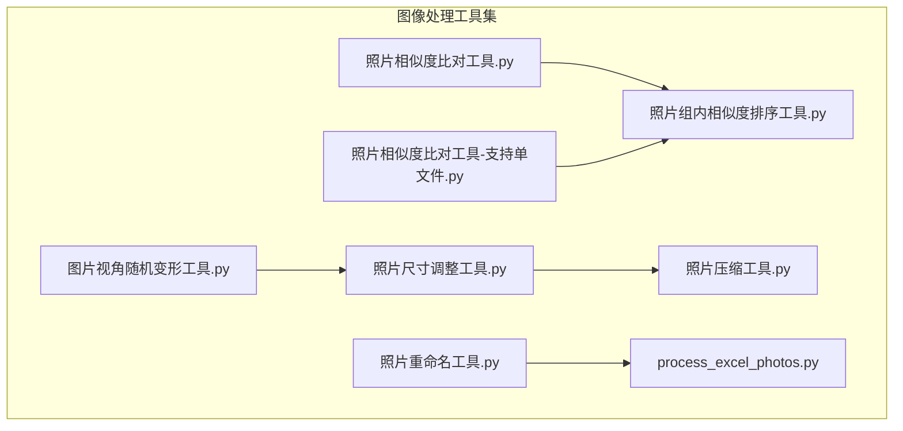
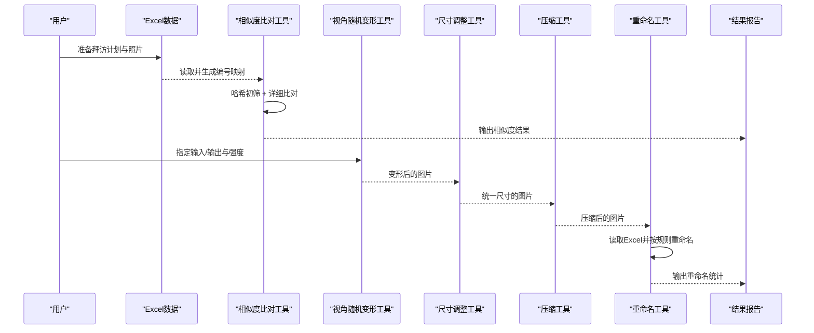
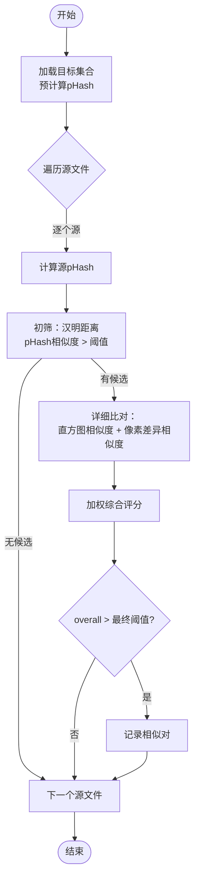
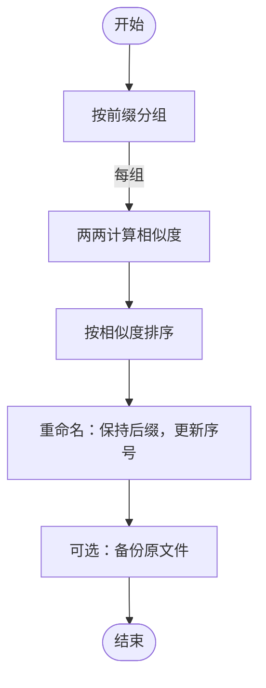
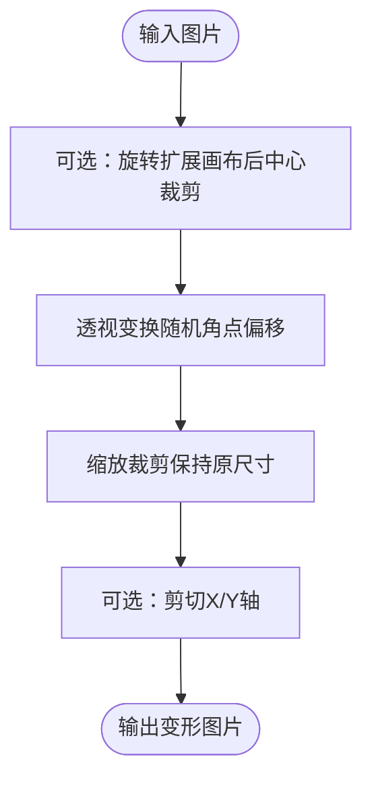
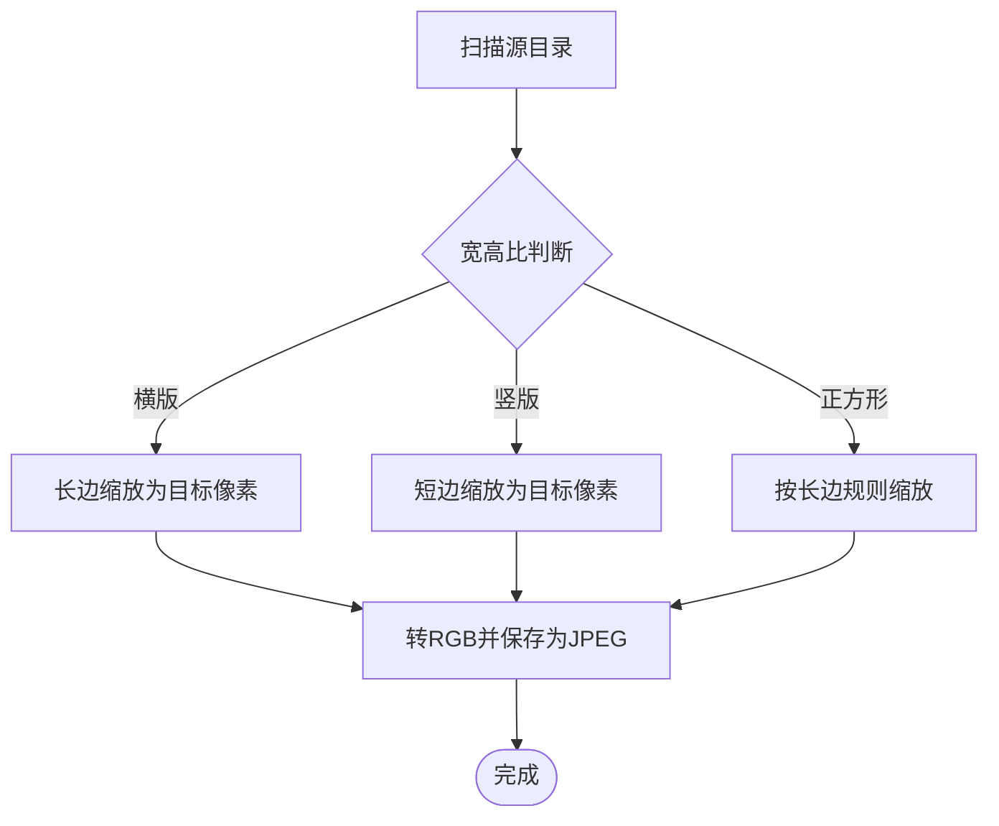
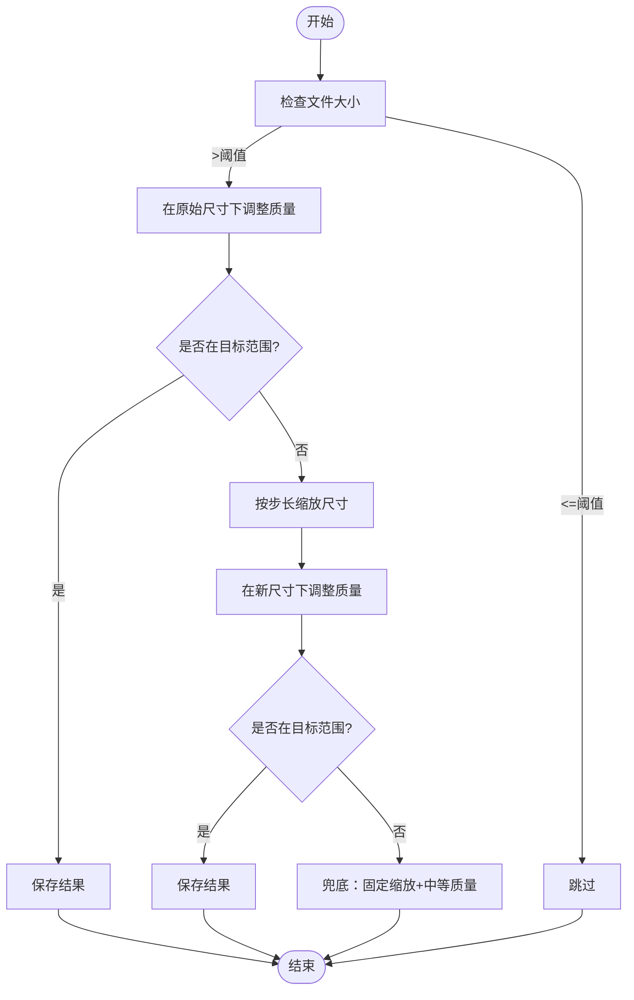
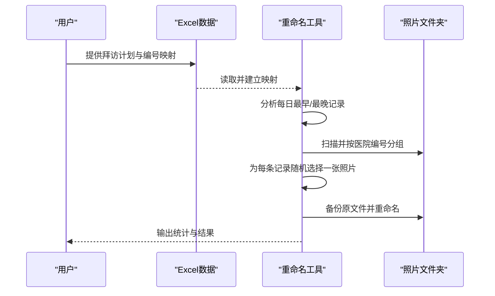
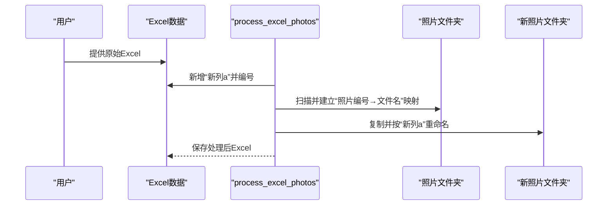
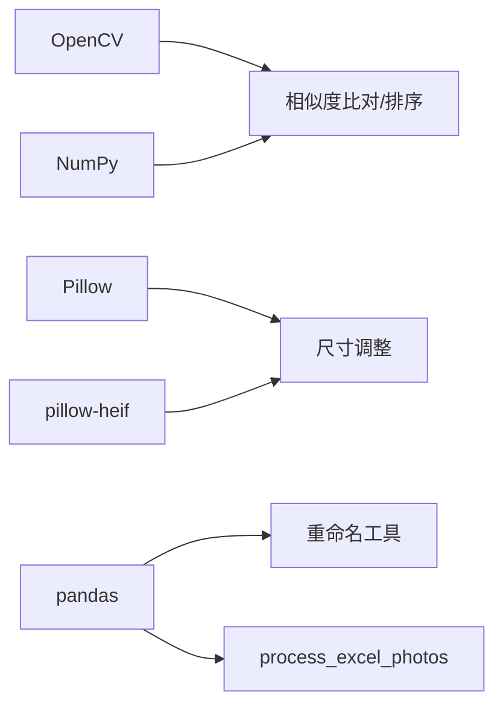

# 图像处理工具

<cite>
**本文引用的文件**
- [照片相似度比对工具.py](file://医院/照片相似度比对工具.py)
- [照片相似度比对工具-支持单文件.py](file://医院/照片相似度比对工具-支持单文件.py)
- [照片组内相似度排序工具.py](file://医院/照片组内相似度排序工具.py)
- [图片视角随机变形工具.py](file://医院/图片视角随机变形工具.py)
- [照片尺寸调整工具.py](file://医院/照片尺寸调整工具.py)
- [照片压缩工具.py](file://医院/照片压缩工具.py)
- [照片重命名工具.py](file://医院/照片重命名工具.py)
- [process_excel_photos.py](file://医院/process_excel_photos.py)
</cite>

## 目录
1. [简介](#简介)
2. [项目结构](#项目结构)
3. [核心组件](#核心组件)
4. [架构总览](#架构总览)
5. [详细组件分析](#详细组件分析)
6. [依赖关系分析](#依赖关系分析)
7. [性能考量](#性能考量)
8. [故障排查指南](#故障排查指南)
9. [结论](#结论)
10. [附录：命令行调用示例与实践价值](#附录命令行调用示例与实践价值)

## 简介
本文件系统性梳理“图像处理工具集”的功能设计与技术实现，聚焦以下目标：
- 解析照片相似度比对工具基于OpenCV的图像哈希与快速相似度策略，说明其查重原理与精度控制。
- 说明图片视角随机变形工具如何通过透视变换模拟不同拍摄角度，增强图像多样性。
- 解释照片尺寸调整与压缩工具在批量处理中的性能优化技巧（如多线程思路、内存缓冲与I/O策略）。
- 描述照片重命名工具如何依据规则（如按科室、编号）统一命名格式，提升文件管理效率。
- 结合process_excel_photos.py说明图像元数据与Excel记录的关联处理方式。
- 提供各工具的命令行调用示例，并指出在医药拜访场景中防止重复提交照片、统一视觉规范的实际价值。

## 项目结构
该工具集位于“医院”目录下，围绕“照片相似度比对、视角随机变形、尺寸调整、压缩、重命名、与Excel元数据关联”六大能力展开，形成完整的图像批处理流水线。

图表来源
- [照片相似度比对工具.py](file://医院/照片相似度比对工具.py#L1-L318)
- [照片相似度比对工具-支持单文件.py](file://医院/照片相似度比对工具-支持单文件.py#L1-L341)
- [照片组内相似度排序工具.py](file://医院/照片组内相似度排序工具.py#L1-L476)
- [图片视角随机变形工具.py](file://医院/图片视角随机变形工具.py#L1-L310)
- [照片尺寸调整工具.py](file://医院/照片尺寸调整工具.py#L1-L214)
- [照片压缩工具.py](file://医院/照片压缩工具.py#L1-L286)
- [照片重命名工具.py](file://医院/照片重命名工具.py#L1-L263)
- [process_excel_photos.py](file://医院/process_excel_photos.py#L1-L127)

章节来源
- [照片相似度比对工具.py](file://医院/照片相似度比对工具.py#L1-L318)
- [图片视角随机变形工具.py](file://医院/图片视角随机变形工具.py#L1-L310)
- [照片尺寸调整工具.py](file://医院/照片尺寸调整工具.py#L1-L214)
- [照片压缩工具.py](file://医院/照片压缩工具.py#L1-L286)
- [照片重命名工具.py](file://医院/照片重命名工具.py#L1-L263)
- [process_excel_photos.py](file://医院/process_excel_photos.py#L1-L127)

## 核心组件
- 相似度检测与查重：基于感知哈希（pHash）、直方图相似度与像素差异的快速相似度组合，采用双阶段筛选（哈希初筛+详细比对）以平衡精度与性能。
- 视角随机变形：提供透视变换、旋转、缩放裁剪、剪切等随机几何扰动，模拟不同拍摄角度，增强训练/展示多样性。
- 尺寸调整与压缩：按长宽比例分别设定目标长边/短边像素，统一转码为JPEG；压缩工具在保持尺寸优先的前提下逐步降低质量或适度缩放，确保目标大小范围。
- 文件重命名：依据Excel中的拜访计划与编号映射，按“原序号”规则随机选取照片并重命名，同时备份原文件，便于追溯。
- 元数据与Excel关联：读取Excel工作表，建立“照片编号”与“新列a”的映射，复制并改名对应照片，输出处理后Excel。

章节来源
- [照片相似度比对工具.py](file://医院/照片相似度比对工具.py#L1-L318)
- [照片相似度比对工具-支持单文件.py](file://医院/照片相似度比对工具-支持单文件.py#L1-L341)
- [照片组内相似度排序工具.py](file://医院/照片组内相似度排序工具.py#L1-L476)
- [图片视角随机变形工具.py](file://医院/图片视角随机变形工具.py#L1-L310)
- [照片尺寸调整工具.py](file://医院/照片尺寸调整工具.py#L1-L214)
- [照片压缩工具.py](file://医院/照片压缩工具.py#L1-L286)
- [照片重命名工具.py](file://医院/照片重命名工具.py#L1-L263)
- [process_excel_photos.py](file://医院/process_excel_photos.py#L1-L127)

## 架构总览
整体流程从“数据准备（Excel/照片）”出发，经“相似度比对/去重”、“视角随机变形”、“尺寸调整/压缩”、“重命名与备份”，最终输出规范化文件与报告。

图表来源
- [照片相似度比对工具.py](file://医院/照片相似度比对工具.py#L127-L217)
- [图片视角随机变形工具.py](file://医院/图片视角随机变形工具.py#L220-L268)
- [照片尺寸调整工具.py](file://医院/照片尺寸调整工具.py#L120-L193)
- [照片压缩工具.py](file://医院/照片压缩工具.py#L135-L227)
- [照片重命名工具.py](file://医院/照片重命名工具.py#L83-L246)
- [process_excel_photos.py](file://医院/process_excel_photos.py#L26-L124)

## 详细组件分析

### 相似度比对工具（双阶段策略）
- 设计要点
  - 双阶段筛选：先计算目标集合的感知哈希（pHash），以哈希相似度阈值进行初筛，再对候选执行直方图相似度与像素差异的详细比对，最后加权综合评分。
  - 多种相似度融合：pHash（感知哈希）、直方图相关性、像素差异相似度，权重可调，兼顾鲁棒性与速度。
  - 扩展性：支持文件夹与单文件混合输入，便于灵活比对。
- 精度控制
  - 哈希初筛阈值提高可显著减少详细比对数量，降低总体计算量。
  - 最终相似度阈值决定“相似”判定，需结合业务容忍度调整。
- 性能特性
  - 预计算目标哈希，避免重复读取与重复哈希计算。
  - 对图像进行快速缩放（如64×64、32×32）以加速直方图与像素差异计算。
- 错误处理
  - 对读取失败、权限问题、异常路径等情况进行容错与提示。

图表来源
- [照片相似度比对工具.py](file://医院/照片相似度比对工具.py#L127-L217)
- [照片相似度比对工具-支持单文件.py](file://医院/照片相似度比对工具-支持单文件.py#L151-L241)

章节来源
- [照片相似度比对工具.py](file://医院/照片相似度比对工具.py#L1-L318)
- [照片相似度比对工具-支持单文件.py](file://医院/照片相似度比对工具-支持单文件.py#L1-L341)

### 组内相似度排序工具（按前缀分组与重命名）
- 设计要点
  - 按文件名前缀（如“编号_”前的数字）分组，组内两两计算相似度（pHash、dHash、颜色直方图、缩略图像素相似度）并加权聚合。
  - 基于相似度对构建排序序列，尽量将高相似度照片相邻，同时保证未参与对的文件也能有序排列。
  - 重命名时保留原有后缀，仅更新序号，支持备份目录以防误操作。
- 精度控制
  - 通过多特征融合与阈值控制，提升排序的稳定性与可解释性。
- 性能特性
  - 组内两两比较复杂度较高，适合中小规模组；对大规模组建议分批处理或并行化（见性能章节）。

图表来源
- [照片组内相似度排序工具.py](file://医院/照片组内相似度排序工具.py#L259-L407)

章节来源
- [照片组内相似度排序工具.py](file://医院/照片组内相似度排序工具.py#L1-L476)

### 图片视角随机变形工具（透视/旋转/缩放/剪切）
- 设计要点
  - 透视变换：随机生成四个角点偏移，计算透视矩阵并将剪切区域拉伸回原图尺寸，模拟不同拍摄角度。
  - 旋转：在扩展画布上旋转后按原图大小中心裁剪，可能丢失边缘内容。
  - 缩放裁剪：按比例缩放后裁剪或填充至原尺寸，保持输出一致性。
  - 剪切：沿X/Y轴施加剪切变换，产生轻微倾斜效果。
  - 支持批量处理，可配置强度与每张图生成的变体数量。
- 实践价值
  - 通过随机几何扰动增强模型泛化能力，或丰富展示素材的多样性。

图表来源
- [图片视角随机变形工具.py](file://医院/图片视角随机变形工具.py#L22-L168)

章节来源
- [图片视角随机变形工具.py](file://医院/图片视角随机变形工具.py#L1-L310)

### 照片尺寸调整工具（按比例缩放与统一编码）
- 设计要点
  - 横版（长>宽）：将长边缩放到目标像素；竖版（长<宽）：将短边缩放到目标像素；正方形按长边规则处理。
  - 统一转码为RGB并保存为JPEG，质量参数与渐进式编码以保证清晰度与体积平衡。
  - 自动安装依赖（Pillow、pillow-heif），支持HEIF格式读取。
  - 保持目录结构，按相对路径输出。
- 性能特性
  - 使用高质量插值（LANCZOS）保证缩放质量。
  - 通过依赖自动安装减少环境配置成本。

图表来源
- [照片尺寸调整工具.py](file://医院/照片尺寸调整工具.py#L68-L119)

章节来源
- [照片尺寸调整工具.py](file://医院/照片尺寸调整工具.py#L1-L214)

### 照片压缩工具（目标大小优先策略）
- 设计要点
  - 优先在原始尺寸下调整质量，若仍超目标范围则按预设缩放步长逐步缩小尺寸，最后兜底策略使用固定缩放与中等质量。
  - 采用备份文件名（.backup）保护原文件，失败时自动恢复。
  - 统计处理总数、跳过数、失败数、节省空间与平均速度。
- 性能特性
  - 通过“先质量后尺寸”的策略减少不必要的重采样，提高整体吞吐。
  - 临时文件清理避免磁盘残留。

图表来源
- [照片压缩工具.py](file://医院/照片压缩工具.py#L30-L127)

章节来源
- [照片压缩工具.py](file://医院/照片压缩工具.py#L1-L286)

### 照片重命名工具（按Excel规则统一命名）
- 设计要点
  - 读取Excel中的“拜访计划”和“导出计数_列B”，建立“医院名称→编号”的映射。
  - 按日期与医院分组，提取每日最早/最晚时间记录，按“原序号”作为目标文件名。
  - 随机从该医院的待处理照片中选择一张进行重命名，同时在同一级创建备份目录。
- 实践价值
  - 将照片与拜访计划严格绑定，避免重复提交与命名混乱，提升审核与检索效率。

图表来源
- [照片重命名工具.py](file://医院/照片重命名工具.py#L83-L246)

章节来源
- [照片重命名工具.py](file://医院/照片重命名工具.py#L1-L263)

### 与Excel元数据的关联处理（process_excel_photos.py）
- 设计要点
  - 在Excel中新增“新列a”，对“拜访编号”有值的行从1开始顺序编号。
  - 扫描照片文件夹，按“照片编号”与文件名匹配，复制到新文件夹并以“新列a”命名。
  - 保存处理后的Excel，提供前20行预览。
- 实践价值
  - 将照片与Excel记录强关联，便于后续审核、归档与溯源。

图表来源
- [process_excel_photos.py](file://医院/process_excel_photos.py#L26-L124)

章节来源
- [process_excel_photos.py](file://医院/process_excel_photos.py#L1-L127)

## 依赖关系分析
- OpenCV与NumPy：用于图像读取、灰度转换、缩放、直方图计算、相似度评估与几何变换。
- Pillow与pillow-heif：用于图像解码、格式转换、质量控制与HEIF支持。
- pandas：用于Excel读写与数据结构处理（重命名工具与process_excel_photos）。
- 路径与系统：pathlib、os、shutil用于文件系统操作与备份。

图表来源
- [照片相似度比对工具.py](file://医院/照片相似度比对工具.py#L1-L318)
- [照片组内相似度排序工具.py](file://医院/照片组内相似度排序工具.py#L1-L476)
- [照片尺寸调整工具.py](file://医院/照片尺寸调整工具.py#L1-L214)
- [照片压缩工具.py](file://医院/照片压缩工具.py#L1-L286)
- [照片重命名工具.py](file://医院/照片重命名工具.py#L1-L263)
- [process_excel_photos.py](file://医院/process_excel_photos.py#L1-L127)

章节来源
- [照片相似度比对工具.py](file://医院/照片相似度比对工具.py#L1-L318)
- [照片组内相似度排序工具.py](file://医院/照片组内相似度排序工具.py#L1-L476)
- [照片尺寸调整工具.py](file://医院/照片尺寸调整工具.py#L1-L214)
- [照片压缩工具.py](file://医院/照片压缩工具.py#L1-L286)
- [照片重命名工具.py](file://医院/照片重命名工具.py#L1-L263)
- [process_excel_photos.py](file://医院/process_excel_photos.py#L1-L127)

## 性能考量
- 相似度比对
  - 预计算目标哈希，避免重复读取与重复哈希计算，显著降低总体比对次数。
  - 对图像进行快速缩放（如64×64、32×32）以加速直方图与像素差异计算。
  - 可引入多线程/进程池对候选集或组内两两比较进行并行化（建议按组拆分任务，避免共享状态竞争）。
- 视角随机变形
  - 透视/旋转/缩放/剪切均为纯CPU密集型操作，可考虑多进程并行处理不同图片。
  - 输出路径与强度参数可作为并行任务的输入参数，避免I/O争用。
- 尺寸调整与压缩
  - 尺寸调整使用高质量插值，建议在批量处理时限制并发度以平衡CPU与I/O。
  - 压缩工具采用“先质量后尺寸”的策略，减少不必要的重采样，提高吞吐。
  - 临时文件与备份文件的清理应放在finally块中，避免磁盘占用。
- 文件重命名
  - 备份与重命名操作建议串行或加锁，避免竞态导致的文件覆盖。
  - 对超大目录建议分批处理，先统计再执行，降低内存峰值。

[本节为通用性能指导，不直接分析具体文件，故无章节来源]

## 故障排查指南
- OpenCV/NumPy/Pillow缺失
  - 相似度与视角变形工具依赖OpenCV与NumPy；尺寸调整与压缩工具依赖Pillow与pillow-heif。
  - 若自动安装失败，参考脚本中的安装提示，使用镜像源与强制重装方式修复。
- 文件读取失败
  - 相似度工具对读取失败的图片会跳过并打印错误信息；建议检查文件权限与损坏情况。
- 目录不存在或权限不足
  - 各工具均包含目录存在性检查与权限提示，修正路径或提权后重试。
- 压缩失败回滚
  - 压缩工具在失败时会将备份文件恢复为原文件，确保数据安全。
- Excel读取异常
  - 重命名工具与process_excel_photos对Excel读取异常进行捕获与提示，检查工作表名称与字段是否正确。

章节来源
- [照片相似度比对工具.py](file://医院/照片相似度比对工具.py#L1-L318)
- [图片视角随机变形工具.py](file://医院/图片视角随机变形工具.py#L1-L310)
- [照片尺寸调整工具.py](file://医院/照片尺寸调整工具.py#L1-L214)
- [照片压缩工具.py](file://医院/照片压缩工具.py#L1-L286)
- [照片重命名工具.py](file://医院/照片重命名工具.py#L1-L263)
- [process_excel_photos.py](file://医院/process_excel_photos.py#L1-L127)

## 结论
该工具集围绕“相似度查重、视角多样化、尺寸与压缩规范化、命名与元数据绑定”五大环节，形成闭环的图像批处理流水线。通过双阶段相似度策略、随机几何扰动与统一编码压缩，有效提升照片质量与多样性；通过Excel驱动的命名规则，确保文件管理的规范性与可追溯性。在医药拜访场景中，这些工具能够显著降低重复提交风险、统一视觉规范、提升审核效率与数据治理水平。

[本节为总结性内容，不直接分析具体文件，故无章节来源]

## 附录：命令行调用示例与实践价值

- 命令行调用示例
  - 相似度比对（文件夹与单文件混合）
    - python 医院/照片相似度比对工具-支持单文件.py
    - 参数：源路径（文件夹或单文件）、目标路径列表（文件夹或单文件）
  - 组内相似度排序
    - python 医院/照片组内相似度排序工具.py
    - 参数：目标目录（含前缀分组的文件）
  - 视角随机变形
    - python 医院/图片视角随机变形工具.py 输入目录 -o 输出目录 -i 强度 -n 变体数
  - 尺寸调整
    - python 医院/照片尺寸调整工具.py
    - 注意：脚本内置源目录与输出目录变量，运行前可按需修改
  - 压缩
    - python 医院/照片压缩工具.py
    - 注意：脚本内置源目录、目标大小、质量参数等，运行前可按需修改
  - 重命名（Excel驱动）
    - python 医院/照片重命名工具.py
    - 注意：脚本内置Excel与照片目录变量，运行前可按需修改
  - Excel与照片关联
    - python 医院/process_excel_photos.py
    - 注意：脚本内置Excel、工作表、照片目录与输出Excel路径，运行前可按需修改

- 实际价值（医药拜访场景）
  - 防止重复提交：通过相似度比对与组内排序，及时发现并剔除高度相似或重复照片，减少冗余提交。
  - 统一视觉规范：通过尺寸调整与压缩，确保照片分辨率与文件大小一致，提升展示与传输效率。
  - 规范命名与可追溯：通过Excel驱动的命名规则，将照片与拜访计划严格绑定，便于审核、归档与溯源。
  - 增强多样性：通过视角随机变形，模拟不同拍摄角度，提升模型训练与展示的多样性与鲁棒性。

[本节为通用示例与价值说明，不直接分析具体文件，故无章节来源]