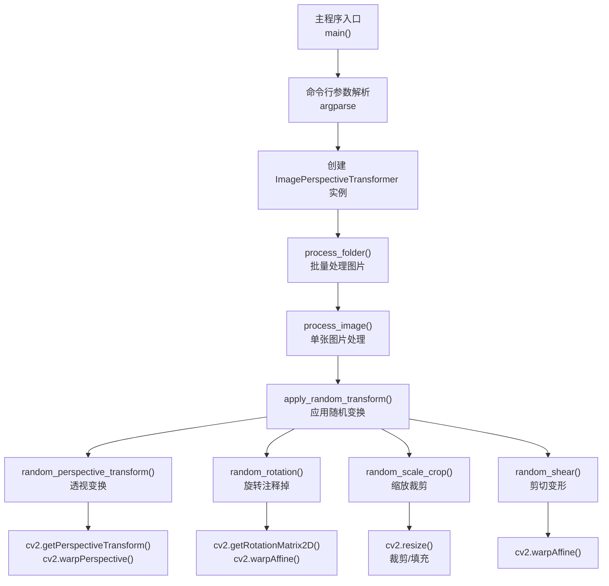
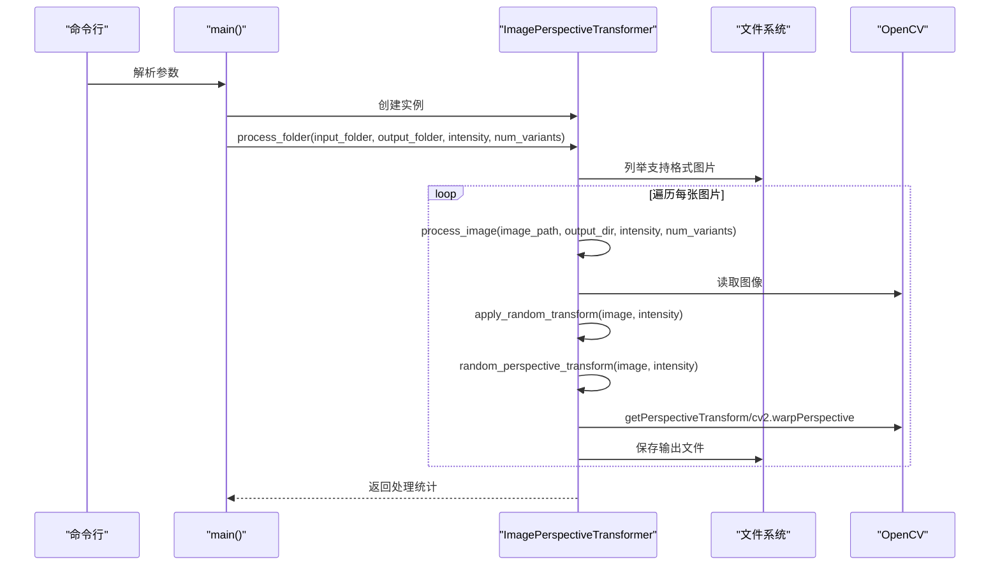
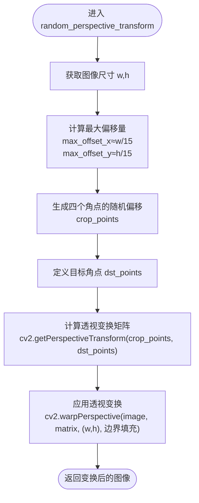
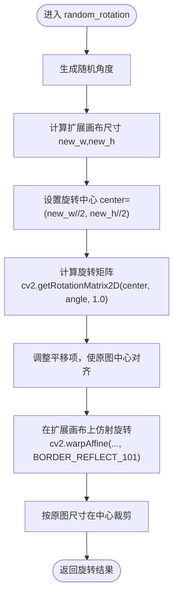
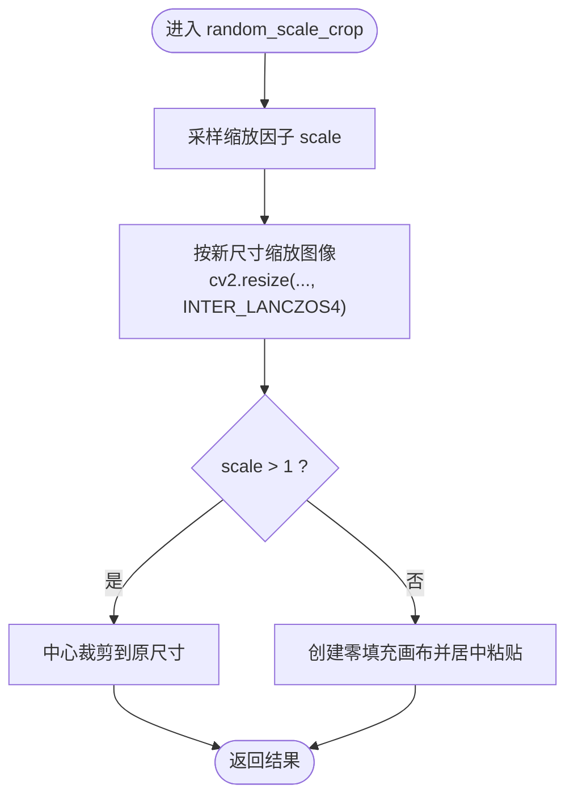
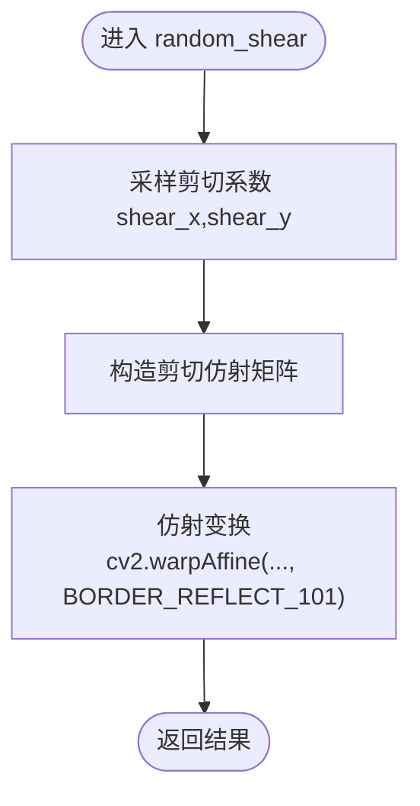
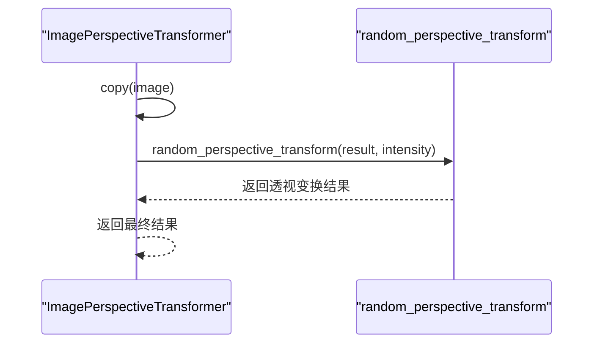
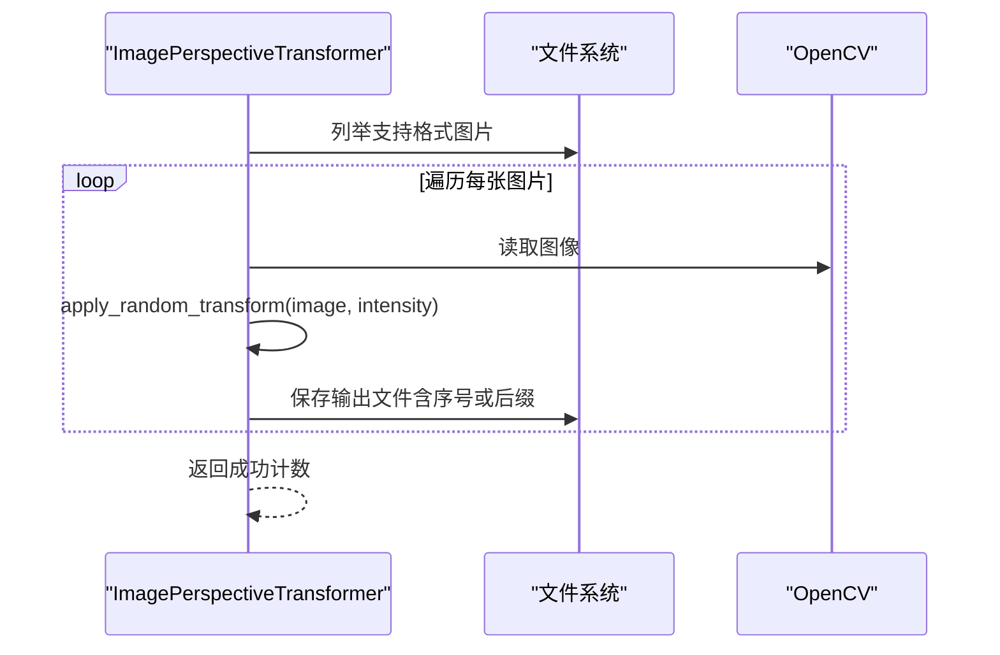
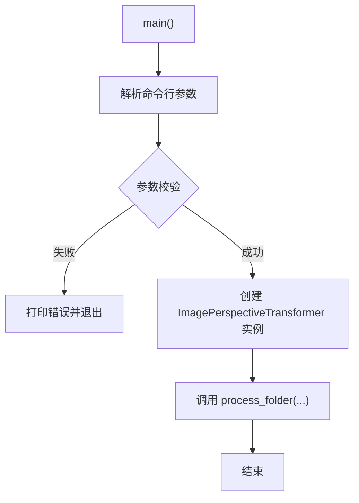
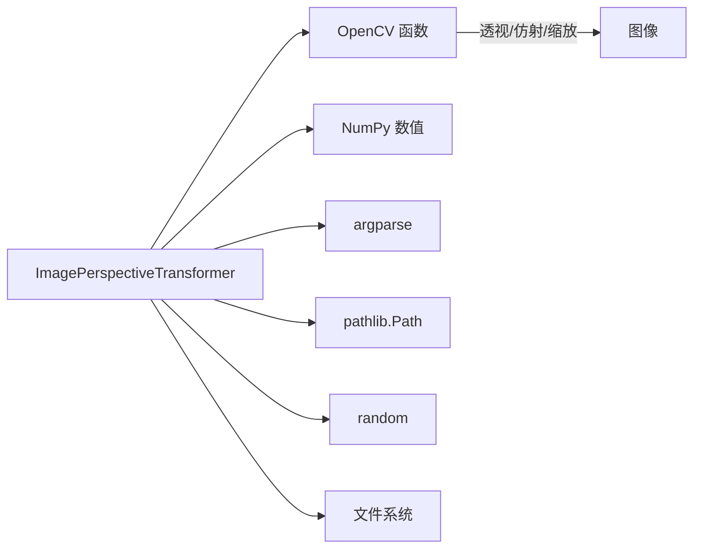

# 图片视角变形处理

<cite>
**本文引用的文件**
- [图片视角随机变形工具.py](file://医院/图片视角随机变形工具.py)
- [图片椭圆变形工具.py](file://医院/图片椭圆变形工具.py)
</cite>

## 目录
1. [简介](#简介)
2. [项目结构](#项目结构)
3. [核心组件](#核心组件)
4. [架构总览](#架构总览)
5. [详细组件分析](#详细组件分析)
6. [依赖关系分析](#依赖关系分析)
7. [性能考量](#性能考量)
8. [故障排查指南](#故障排查指南)
9. [结论](#结论)
10. [附录](#附录)

## 简介
本文件围绕“图片视角随机变形工具”的实现机制展开，重点解析以下内容：
- ImagePerspectiveTransformer 类中 random_perspective_transform 方法如何通过生成随机偏移的四个角点（crop_points）与目标角点（dst_points）构建透视变换矩阵，并使用 cv2.getPerspectiveTransform 和 cv2.warpPerspective 实现图像拉伸效果。
- random_rotation 方法中基于旋转中心调整的仿射变换矩阵计算过程，以及如何通过扩展画布和中心裁剪实现旋转后的内容保留。
- random_scale_crop 与 random_shear 方法分别实现的缩放裁剪与剪切变形效果。
- apply_random_transform 方法中变换组合策略（当前仅启用透视变换），以及 process_folder 方法如何批量处理文件夹内所有支持格式的图片。
- 结合 main 函数中的配置参数，说明变形强度（intensity）和变体数量（num_variants）对输出结果的影响。

## 项目结构
该仓库包含多个与图片处理相关的脚本，其中与本主题直接相关的是“图片视角随机变形工具.py”。其主要职责是提供图像视角随机变形能力，并支持批量处理文件夹中的图片。

图表来源
- [图片视角随机变形工具.py](file://医院/图片视角随机变形工具.py#L153-L218)
- [图片视角随机变形工具.py](file://医院/图片视角随机变形工具.py#L220-L310)

章节来源
- [图片视角随机变形工具.py](file://医院/图片视角随机变形工具.py#L1-L310)

## 核心组件
- ImagePerspectiveTransformer：封装了多种随机图像变形方法，负责单张图片与批量图片的处理流程。
- 关键方法：
  - random_perspective_transform：生成随机偏移的四个角点并计算透视变换矩阵，实现图像拉伸。
  - random_rotation：计算旋转中心与仿射矩阵，扩展画布并通过中心裁剪保留内容。
  - random_scale_crop：按比例缩放并裁剪或填充至原尺寸。
  - random_shear：沿水平与垂直方向施加剪切变形。
  - apply_random_transform：当前仅启用透视变换（旋转为注释状态）。
  - process_image/process_folder：单张与批量处理流程，支持输出命名与保存。

章节来源
- [图片视角随机变形工具.py](file://医院/图片视角随机变形工具.py#L17-L152)
- [图片视角随机变形工具.py](file://医院/图片视角随机变形工具.py#L153-L218)
- [图片视角随机变形工具.py](file://医院/图片视角随机变形工具.py#L220-L310)

## 架构总览
整体流程由命令行参数驱动，创建 ImagePerspectiveTransformer 实例后调用 process_folder，遍历输入文件夹中的图片，逐张应用随机变换并保存到输出目录。当前变换组合策略仅启用透视变换，其余方法（旋转、缩放裁剪、剪切）均保留为独立方法，便于后续启用与组合。

图表来源
- [图片视角随机变形工具.py](file://医院/图片视角随机变形工具.py#L220-L310)
- [图片视角随机变形工具.py](file://医院/图片视角随机变形工具.py#L153-L218)
- [图片视角随机变形工具.py](file://医院/图片视角随机变形工具.py#L22-L61)

## 详细组件分析

### 透视变换：random_perspective_transform
- 角点生成策略
  - 以图像宽高为基准，计算最大偏移量（约长宽的 1/15），四个角点在各自边缘上随机偏移，保证生成的四边形位于原图内部。
  - 目标角点为原图四个角点，用于构建从“剪切区域”到原图尺寸的透视映射。
- 透视矩阵与拉伸
  - 使用 cv2.getPerspectiveTransform 将四个源点映射到目标角点，得到透视变换矩阵。
  - 使用 cv2.warpPerspective 将图像按矩阵映射，边界采用常量填充（默认黑色）。
- 强度控制
  - 通过传入的 intensity 参数间接影响偏移幅度（在该实现中，偏移上限与图像尺寸相关，未直接线性缩放 intensity，但可通过调整偏移上限来改变强度）。

图表来源
- [图片视角随机变形工具.py](file://医院/图片视角随机变形工具.py#L22-L61)

章节来源
- [图片视角随机变形工具.py](file://医院/图片视角随机变形工具.py#L22-L61)

### 旋转：random_rotation
- 旋转中心与画布扩展
  - 根据旋转角度计算新画布尺寸，使旋转后图像完整显示；旋转中心设为扩展画布中心。
  - 使用 cv2.getRotationMatrix2D 计算基础旋转矩阵，并通过平移项将原图中心对齐到扩展画布中心。
- 边界处理与中心裁剪
  - 在扩展画布上进行仿射旋转，边界采用反射填充策略。
  - 以原图尺寸在扩展画布中心进行裁剪，从而保留旋转后的主要内容，同时丢弃超出部分。

图表来源
- [图片视角随机变形工具.py](file://医院/图片视角随机变形工具.py#L63-L97)

章节来源
- [图片视角随机变形工具.py](file://医院/图片视角随机变形工具.py#L63-L97)

### 缩放裁剪：random_scale_crop
- 缩放策略
  - 在给定范围内随机采样缩放因子，按比例调整图像尺寸。
  - 使用高质量插值进行缩放。
- 裁剪与填充
  - 若放大：以中心裁剪方式恢复到原尺寸。
  - 若缩小：先创建原尺寸零填充画布，再将缩放后图像居中放置。

图表来源
- [图片视角随机变形工具.py](file://医院/图片视角随机变形工具.py#L99-L128)

章节来源
- [图片视角随机变形工具.py](file://医院/图片视角随机变形工具.py#L99-L128)

### 剪切变形：random_shear
- 剪切矩阵
  - 水平与垂直方向分别采样随机剪切系数，构造 2×3 仿射矩阵。
- 变换与边界
  - 使用 cv2.warpAffine 对图像施加剪切，边界采用反射填充策略。

图表来源
- [图片视角随机变形工具.py](file://医院/图片视角随机变形工具.py#L130-L151)

章节来源
- [图片视角随机变形工具.py](file://医院/图片视角随机变形工具.py#L130-L151)

### 变换组合策略：apply_random_transform
- 当前策略
  - 仅启用透视变换；旋转方法在当前实现中被注释，未参与组合。
- 组合顺序
  - 先对输入图像进行拷贝，再依次应用各变换（当前仅透视变换生效）。

图表来源
- [图片视角随机变形工具.py](file://医院/图片视角随机变形工具.py#L153-L167)

章节来源
- [图片视角随机变形工具.py](file://医院/图片视角随机变形工具.py#L153-L167)

### 批量处理：process_folder 与 process_image
- process_folder
  - 校验输入目录是否存在。
  - 若未指定输出目录，则在输入目录的父目录下创建带时间戳的同级输出文件夹。
  - 枚举支持的图片格式（大小写不敏感），统计并打印处理进度。
  - 调用 process_image 对每张图片进行处理。
- process_image
  - 读取图像，若失败则记录错误。
  - 依据 num_variants 循环生成多个变体，输出文件名包含序号或后缀。
  - 保存图像并统计成功数量。

图表来源
- [图片视角随机变形工具.py](file://医院/图片视角随机变形工具.py#L220-L310)
- [图片视角随机变形工具.py](file://医院/图片视角随机变形工具.py#L169-L218)

章节来源
- [图片视角随机变形工具.py](file://医院/图片视角随机变形工具.py#L169-L218)
- [图片视角随机变形工具.py](file://医院/图片视角随机变形工具.py#L220-L310)

### 主程序与参数配置：main
- 命令行参数
  - input_folder：输入文件夹路径。
  - -o/--output：输出文件夹路径（可选）。
  - -i/--intensity：变形强度（0.1-1.0，默认0.3）。
  - -n/--num_variants：每张图片生成的变体数量（默认1）。
- 参数校验
  - 强度范围校验与变体数量校验。
- 默认执行
  - 若直接运行脚本，提供默认输入、输出、强度与变体数量，随后调用 process_folder。

图表来源
- [图片视角随机变形工具.py](file://医院/图片视角随机变形工具.py#L269-L310)

章节来源
- [图片视角随机变形工具.py](file://医院/图片视角随机变形工具.py#L269-L310)

## 依赖关系分析
- OpenCV 依赖
  - cv2.getPerspectiveTransform：计算透视变换矩阵。
  - cv2.warpPerspective：执行透视变换。
  - cv2.getRotationMatrix2D 与 cv2.warpAffine：执行旋转与仿射变换。
  - cv2.resize：执行缩放（Lanczos 插值）。
- NumPy 依赖
  - 使用 numpy.float32 构造点集与矩阵，进行数值计算。
- Python 标准库
  - argparse：命令行参数解析。
  - pathlib.Path：路径操作与目录创建。
  - random：随机数生成（用于各类变换的随机参数采样）。
- 文件格式支持
  - 默认支持 .jpg/.jpeg/.png/.bmp/.tiff/.tif（大小写不敏感）。

图表来源
- [图片视角随机变形工具.py](file://医院/图片视角随机变形工具.py#L1-L310)

章节来源
- [图片视角随机变形工具.py](file://医院/图片视角随机变形工具.py#L1-L310)

## 性能考量
- 计算复杂度
  - 透视与仿射变换均为线性映射，对每个像素进行一次查找与插值，整体复杂度近似 O(W×H)。
  - 缩放与剪切同样为 O(W×H)，插值质量越高（如 Lanczos）开销越大。
- 内存占用
  - 扩展画布（旋转）会临时增加内存占用，尺寸约为 new_w×new_h×通道数。
- I/O 开销
  - 批量处理时，读取与写入是主要瓶颈；建议使用 SSD 或合理并发策略（当前实现为串行）。
- 可优化点
  - 旋转时的扩展画布尺寸可进一步优化，避免过大导致内存压力。
  - 插值算法可按需求调整，平衡质量与速度。
  - 批量处理可引入多进程/多线程加速（当前实现未启用）。

[本节为通用性能讨论，无需特定文件引用]

## 故障排查指南
- 无法读取图片
  - 现象：process_image 中打印“无法读取图片”。
  - 排查：确认路径正确、文件存在且为支持格式；检查权限与磁盘空间。
- 输出目录创建失败
  - 现象：process_folder 中输出目录创建异常。
  - 排查：确认父目录权限与磁盘配额；避免非法字符与过长路径。
- 参数校验失败
  - 现象：main 中打印“变形强度必须在 0.1-1.0 之间”或“变体数量必须大于0”。
  - 排查：修正命令行参数范围与数值。
- 变换结果异常
  - 透视变换出现黑边：random_perspective_transform 使用常量边界填充，可调整填充策略或增大输入图像尺寸。
  - 旋转后内容缺失：random_rotation 采用中心裁剪，若内容靠近边缘可能被裁掉，可降低最大旋转角度或扩大输入尺寸。
  - 缩放裁剪失真：random_scale_crop 使用高质量插值，若仍出现锯齿可考虑更高阶插值或预处理锐化。

章节来源
- [图片视角随机变形工具.py](file://医院/图片视角随机变形工具.py#L169-L218)
- [图片视角随机变形工具.py](file://医院/图片视角随机变形工具.py#L220-L310)

## 结论
本工具通过多种随机几何变换增强图像视角多样性，当前以透视变换为核心，辅以旋转、缩放裁剪与剪切的独立实现。通过命令行参数可灵活控制强度与变体数量，process_folder 提供便捷的批量处理能力。未来可在 apply_random_transform 中启用更多变换组合，并根据场景需求优化边界处理与内存占用。

[本节为总结性内容，无需特定文件引用]

## 附录
- 与椭圆视角变形工具的对比
  - 椭圆工具通过在四分之一椭圆范围内随机生成角点，再计算从新角点到原角点的透视矩阵，从而消除黑边并保持内容完整。
  - 透视工具通过随机偏移角点并映射到原图角点，边界采用常量填充，适合追求更强烈透视效果的场景。
  
章节来源
- [图片椭圆变形工具.py](file://医院/图片椭圆变形工具.py#L85-L139)
- [图片视角随机变形工具.py](file://医院/图片视角随机变形工具.py#L22-L61)