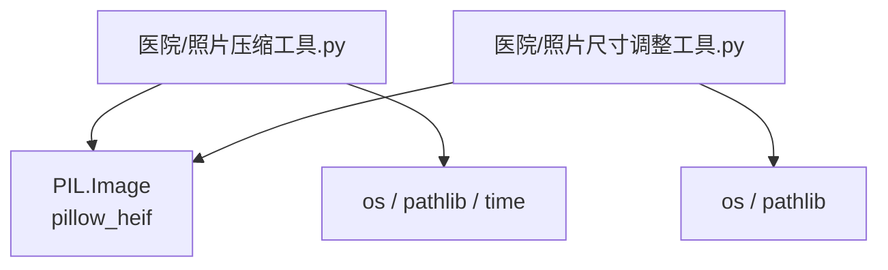
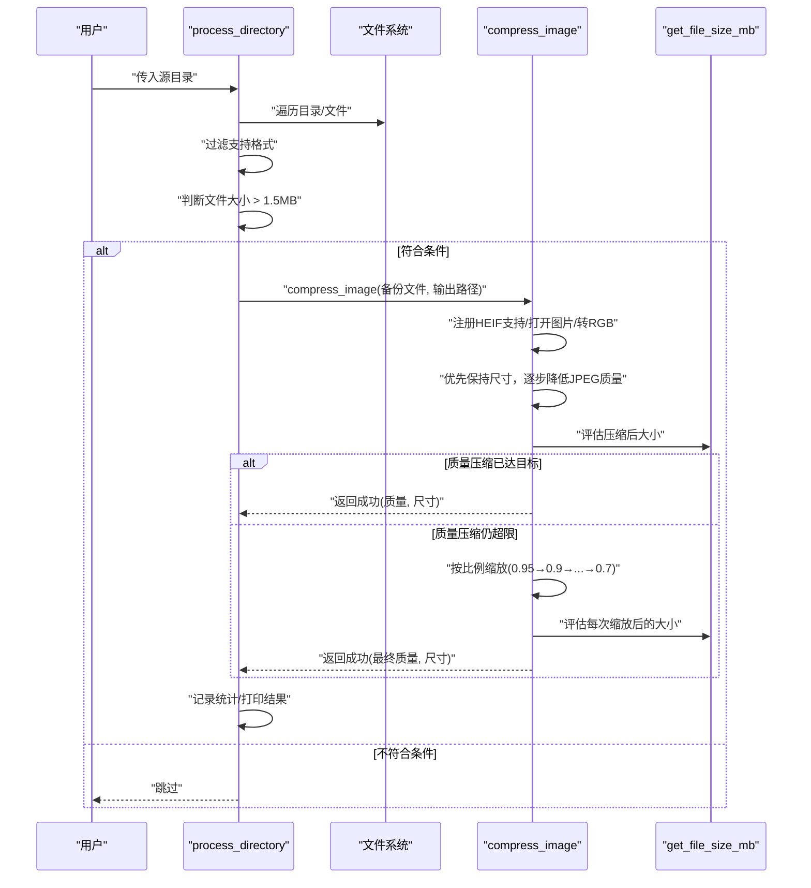
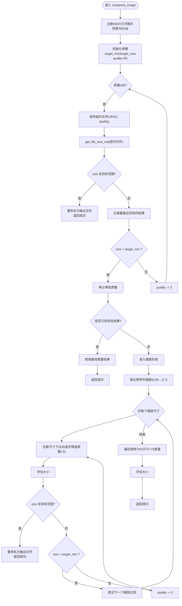
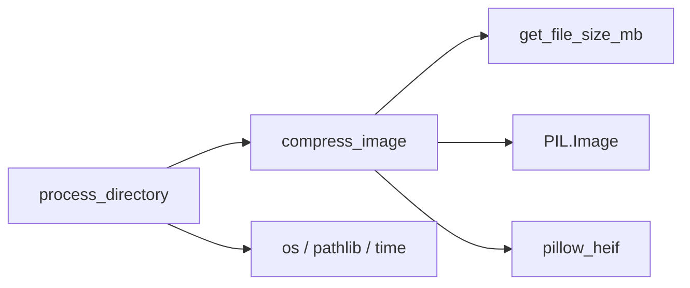

# 照片压缩工具

<cite>
**本文引用的文件**
- [照片压缩工具.py](file://医院/照片压缩工具.py)
- [照片尺寸调整工具.py](file://医院/照片尺寸调整工具.py)
</cite>

## 目录
1. [简介](#简介)
2. [项目结构](#项目结构)
3. [核心组件](#核心组件)
4. [架构总览](#架构总览)
5. [详细组件分析](#详细组件分析)
6. [依赖关系分析](#依赖关系分析)
7. [性能考量](#性能考量)
8. [故障排查指南](#故障排查指南)
9. [结论](#结论)

## 简介
本文件面向“照片压缩工具”的工作原理与实现细节，围绕以下目标展开：
- 解析 compress_image 函数的双重压缩策略：先在不改变分辨率的前提下，通过逐步降低 JPEG 质量参数（从 85 降至 60）来减小体积；若仍超过阈值，则进入第二阶段，按 0.95、0.9、0.85、0.8、0.75、0.7 的比例递减逐步缩小图像尺寸，每次缩放后重新评估文件大小，直至满足目标。
- 解析 get_file_size_mb 函数如何精确计算文件大小并返回 MB 单位数值，支撑压缩决策。
- 说明 process_directory 如何遍历目录，自动识别大于 1.5MB 的图像文件并触发压缩流程，处理后文件保留原始命名和路径结构。
- 强调工具同样支持 HEIC/HEIF 格式的自动转换与压缩，确保全流程兼容性。
- 提供性能优化建议（如批量处理大图时的内存管理策略）以及常见问题排查步骤。

## 项目结构
本仓库包含多个与照片处理相关的脚本，其中与“照片压缩工具”直接相关的核心文件为：
- 医院/照片压缩工具.py：实现双阶段压缩、文件遍历、HEIC/HEIF 支持、依赖安装等功能。
- 医院/照片尺寸调整工具.py：提供尺寸调整与格式转换能力，便于与压缩工具配合使用。

图表来源
- [照片压缩工具.py](file://医院/照片压缩工具.py#L1-L30)
- [照片尺寸调整工具.py](file://医院/照片尺寸调整工具.py#L1-L30)

章节来源
- [照片压缩工具.py](file://医院/照片压缩工具.py#L1-L30)
- [照片尺寸调整工具.py](file://医院/照片尺寸调整工具.py#L1-L30)

## 核心组件
- get_file_size_mb：用于获取文件大小（MB），为压缩决策提供依据。
- compress_image：双阶段压缩主逻辑，优先保持分辨率，再按比例缩放。
- process_directory：遍历目录，筛选大于阈值的图像并执行压缩，保留原文件命名与路径结构。
- install_dependencies：自动安装 Pillow 与 pillow-heif 依赖。
- SUPPORTED_FORMATS：支持的图片格式集合，包含 HEIC/HEIF。

章节来源
- [照片压缩工具.py](file://医院/照片压缩工具.py#L26-L134)
- [照片压缩工具.py](file://医院/照片压缩工具.py#L135-L227)
- [照片压缩工具.py](file://医院/照片压缩工具.py#L228-L286)

## 架构总览
整体流程由“目录扫描—条件判断—双阶段压缩—结果落盘”构成。HEIF/HEIC 通过 pillow_heif 注册打开器，统一转换为 RGB 模式后进行压缩。

图表来源
- [照片压缩工具.py](file://医院/照片压缩工具.py#L135-L227)
- [照片压缩工具.py](file://医院/照片压缩工具.py#L30-L134)
- [照片压缩工具.py](file://医院/照片压缩工具.py#L26-L28)

## 详细组件分析

### get_file_size_mb：文件大小计算
- 功能：读取文件字节数并换算为 MB（保留两位小数）。
- 实现要点：
  - 使用 os.path.getsize 获取字节大小。
  - 除以 1024×1024 得到 MB 数值。
- 作用：为压缩决策提供精确的大小参考，避免误差累积。

章节来源
- [照片压缩工具.py](file://医院/照片压缩工具.py#L26-L28)

### compress_image：双阶段压缩策略
- 输入输出：
  - 输入：输入路径、输出路径、目标大小、初始质量、最低质量。
  - 输出：是否成功、最终大小(MB)、使用的质量、最终尺寸(width,height)。
- 关键流程：
  1) 注册 HEIF 打开器，打开图片并转换为 RGB（含 RGBA/LA/P 等透明/索引模式的白底合成）。
  2) 保持原始尺寸，逐步降低 JPEG 质量（从 85 降至 60），每次保存到临时文件并评估大小，若落入目标范围则直接写入输出路径。
  3) 若质量压缩仍超限，则按比例递减（0.95、0.9、0.85、0.8、0.75、0.7）逐次缩放，每次在新尺寸下再次从高到低寻找合适质量，直至满足目标或达到备选方案。
  4) 备选方案：若仍未达标，使用 70% 尺寸与中等质量（75）保存。
  5) 异常处理：捕获异常并返回失败状态；finally 清理临时文件。
- 目标范围：目标大小的 0.8～1.5 倍区间，兼顾可接受范围与性能。
- 质量步进：在原始尺寸下步进较小（-3），在缩放后步进较大（-5），以提高收敛效率。
- 尺寸步进：采用更细粒度的比例序列，提升在不同分辨率下的适配性。

图表来源
- [照片压缩工具.py](file://医院/照片压缩工具.py#L30-L134)
- [照片压缩工具.py](file://医院/照片压缩工具.py#L26-L28)

章节来源
- [照片压缩工具.py](file://医院/照片压缩工具.py#L30-L134)

### process_directory：目录遍历与处理
- 功能：遍历指定目录，识别支持格式且大于 1.5MB 的文件，触发压缩流程。
- 关键点：
  - 使用 os.walk 递归遍历。
  - 通过 Path(file).suffix.lower() 判断扩展名是否在 SUPPORTED_FORMATS。
  - 对于每个文件，先备份为 .backup（若不存在），再调用 compress_image 压缩到目标大小附近。
  - 成功后统计节省空间、处理速度等指标；失败则恢复原文件。
  - 保持原文件命名与路径结构，仅替换为压缩后的 JPEG。
- 统计信息：总文件数、已处理、已跳过、失败、总节省空间、处理时间、平均每个文件节省、平均处理速度。

章节来源
- [照片压缩工具.py](file://医院/照片压缩工具.py#L135-L227)

### HEIC/HEIF 支持与格式转换
- 通过 pillow_heif.register_heif_opener() 注册 HEIF 打开器，使 PIL.Image.open 能正确读取 HEIC/HEIF。
- 在压缩前将图像转换为 RGB 模式，必要时进行白底合成（处理 RGBA/LA/P 等透明/索引模式），确保后续 JPEG 保存稳定。

章节来源
- [照片压缩工具.py](file://医院/照片压缩工具.py#L30-L50)

### 依赖安装与兼容性
- install_dependencies：检测并安装 Pillow 与 pillow-heif；若失败，提示用户手动安装。
- SUPPORTED_FORMATS：包含 .heic/.heif，确保 HEIC/HEIF 文件被纳入处理范围。

章节来源
- [照片压缩工具.py](file://医院/照片压缩工具.py#L228-L286)
- [照片压缩工具.py](file://医院/照片压缩工具.py#L23-L25)

## 依赖关系分析
- compress_image 依赖 PIL.Image 与 pillow_heif，用于打开与转换 HEIF/HEIC，以及 JPEG 保存。
- process_directory 依赖 os、pathlib、time，负责目录遍历、路径处理与统计。
- get_file_size_mb 依赖 os.path，用于精确计算文件大小。
- install_dependencies 依赖 sys/subprocess，用于自动安装依赖。

图表来源
- [照片压缩工具.py](file://医院/照片压缩工具.py#L135-L227)
- [照片压缩工具.py](file://医院/照片压缩工具.py#L30-L134)
- [照片压缩工具.py](file://医院/照片压缩工具.py#L26-L28)

章节来源
- [照片压缩工具.py](file://医院/照片压缩工具.py#L135-L227)
- [照片压缩工具.py](file://医院/照片压缩工具.py#L30-L134)
- [照片压缩工具.py](file://医院/照片压缩工具.py#L26-L28)

## 性能考量
- 内存管理（大图场景）：
  - 采用“临时文件 + 重命名”的策略，避免重复加载与解码，减少峰值内存占用。
  - 在质量压缩阶段，尽量使用较小步进（-3）以快速收敛；在缩放阶段使用较大步进（-5）以平衡精度与速度。
  - 白底合成与缩放均在内存中进行，建议在处理超大图时控制并发与中间变量生命周期，必要时分批处理。
- I/O 优化：
  - 临时文件仅在评估阶段使用，完成后立即清理，避免磁盘碎片与冗余占用。
  - 压缩后文件直接写入目标路径，减少不必要的拷贝。
- 并发与批处理：
  - 当前实现为顺序处理；如需加速，可在外部引入多进程池，但需注意 PIL 的线程安全性与锁竞争。
- 质量与尺寸权衡：
  - 优先质量压缩可显著节省空间且保持视觉一致性；仅在必要时进行缩放，避免过度失真。
  - 目标范围设置为 0.8～1.5 倍目标大小，兼顾可接受性与性能。

[本节为通用性能建议，不直接分析具体代码文件]

## 故障排查指南
- 依赖缺失：
  - 现象：运行时报错提示缺少 Pillow 或 pillow-heif。
  - 处理：使用 install_dependencies 自动安装；若失败，按提示手动安装。
- HEIF/HEIC 无法打开：
  - 现象：读取 HEIC/HEIF 报错。
  - 处理：确认已注册 HEIF 打开器；检查文件是否损坏；确认 Pillow 与 pillow-heif 版本兼容。
- 压缩后仍过大：
  - 现象：即使已缩放到 0.7 倍仍超过目标。
  - 处理：检查输入图像是否为灰度或特殊模式；确认目标范围设置合理；尝试提高质量步进或调整缩放序列。
- 失败回滚：
  - 现象：压缩失败导致原文件丢失。
  - 处理：脚本会在失败时将 .backup 恢复为原文件；若 .backup 不存在，需手动备份。
- 权限与路径：
  - 现象：无法读取/写入文件。
  - 处理：检查源目录权限、磁盘空间与路径有效性；确认输出路径可写。

章节来源
- [照片压缩工具.py](file://医院/照片压缩工具.py#L228-L286)
- [照片压缩工具.py](file://医院/照片压缩工具.py#L135-L227)

## 结论
“照片压缩工具”通过“质量压缩优先、尺寸缩放兜底”的双阶段策略，在保证视觉质量的同时有效控制文件体积。其设计具备良好的可维护性与扩展性：HEIF/HEIC 的自动支持、精确的大小评估、稳健的失败回滚与统计输出，使其适用于大规模照片处理任务。结合本文提供的性能优化建议与故障排查步骤，可在实际工程中稳定落地并持续迭代。