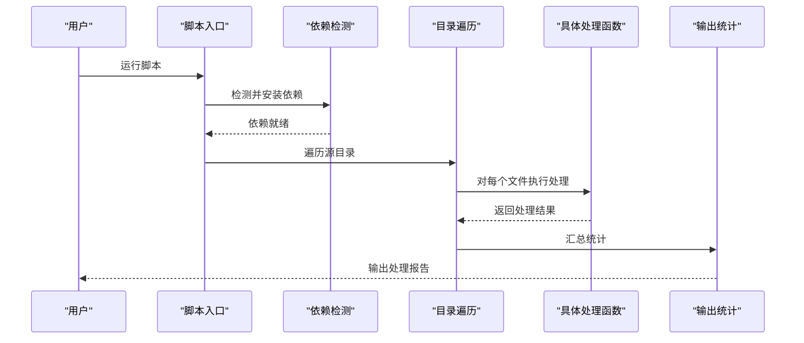
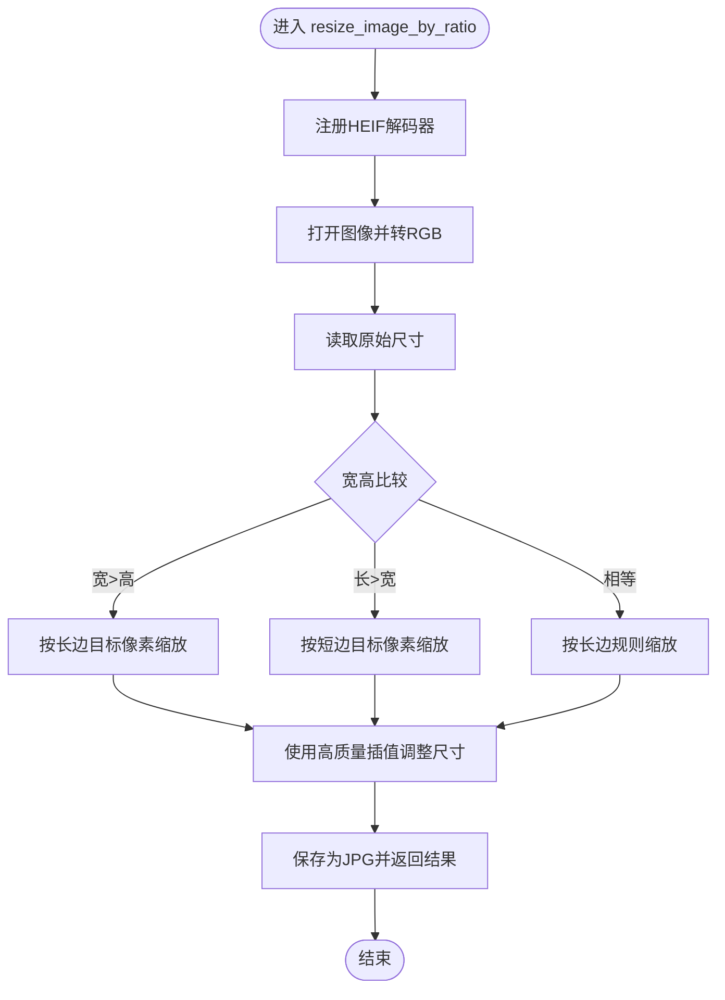
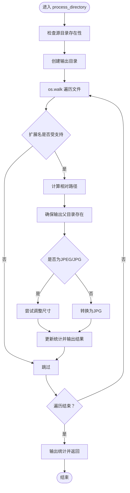
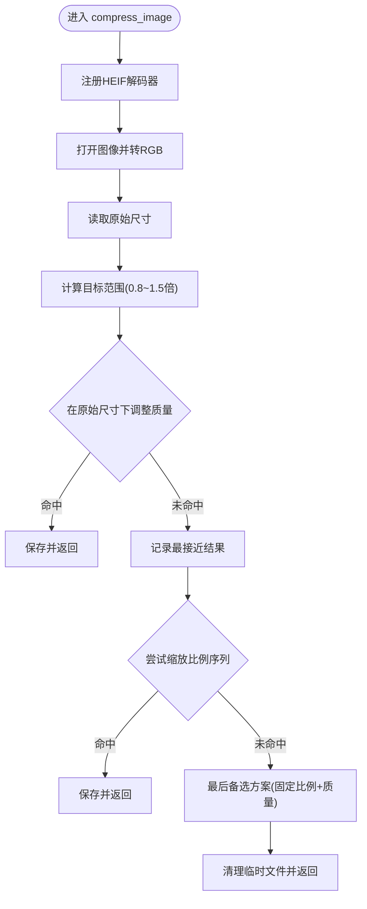
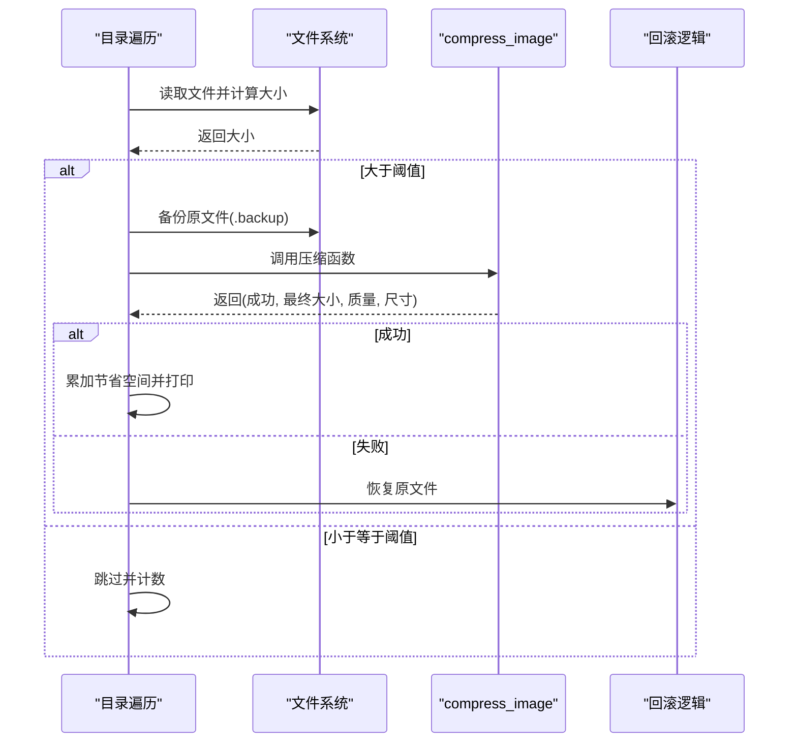
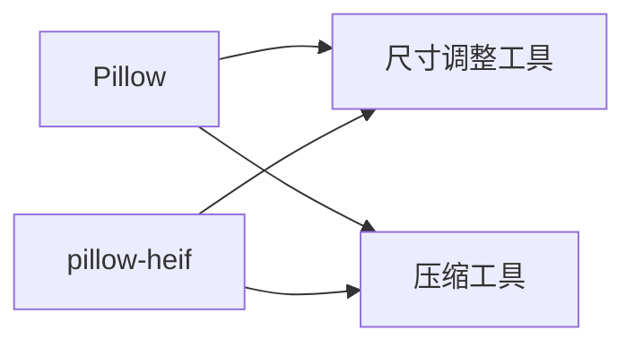

# 照片尺寸调整与压缩

<cite>
**本文引用的文件**
- [医院/照片尺寸调整工具.py](file://医院/照片尺寸调整工具.py)
- [药店/照片尺寸调整工具.py](file://药店/照片尺寸调整工具.py)
- [医院/照片压缩工具.py](file://医院/照片压缩工具.py)
</cite>

## 目录
1. [简介](#简介)
2. [项目结构](#项目结构)
3. [核心组件](#核心组件)
4. [架构总览](#架构总览)
5. [详细组件分析](#详细组件分析)
6. [依赖关系分析](#依赖关系分析)
7. [性能考量](#性能考量)
8. [故障排查指南](#故障排查指南)
9. [结论](#结论)

## 简介
本文件系统性阐述两类照片处理工具的工作原理：
- 照片尺寸调整工具：基于图像长宽比选择缩放策略，横版图按长边缩放至固定像素、竖版图按短边缩放至固定像素，并统一输出为JPG，同时支持HEIC/HEIF格式自动转换。
- 照片压缩工具：对大于阈值的图片进行双重压缩策略：优先保持原始尺寸通过调整JPEG质量控制体积；若仍超目标则按预设比例逐步缩小尺寸，最终输出JPG。

两者均通过注册HEIF格式支持、统一转为RGB模式、使用高质量插值算法，确保处理质量与兼容性。

## 项目结构
- 工具分布于“医院”与“药店”两个子目录，分别提供相同功能的脚本，便于在不同场景复用。
- 两套工具共享一致的处理流程：依赖检测与安装、遍历目录、格式判断与转换、执行具体处理、输出统计。

```mermaid
graph TB
subgraph "医院"
R1["照片尺寸调整工具.py"]
C1["照片压缩工具.py"]
end
subgraph "药店"
R2["照片尺寸调整工具.py"]
C2["照片压缩工具.py"]
end
R1 --> |"调用|" R2
C1 --> |"调用|" C2
```

图表来源
- [医院/照片尺寸调整工具.py](file://医院/照片尺寸调整工具.py#L1-L214)
- [药店/照片尺寸调整工具.py](file://药店/照片尺寸调整工具.py#L1-L214)
- [医院/照片压缩工具.py](file://医院/照片压缩工具.py#L1-L286)

章节来源
- [医院/照片尺寸调整工具.py](file://医院/照片尺寸调整工具.py#L1-L214)
- [药店/照片尺寸调整工具.py](file://药店/照片尺寸调整工具.py#L1-L214)
- [医院/照片压缩工具.py](file://医院/照片压缩工具.py#L1-L286)

## 核心组件
- 依赖安装与检测
  - 自动检测并安装 Pillow 与 pillow-heif；安装镜像源为国内镜像，避免网络问题。
  - 成功后动态导入模块，保证后续图像处理可用。
- 照片尺寸调整
  - 根据长宽比选择缩放策略：横版图按长边缩放、竖版图按短边缩放，正方形采用长边规则。
  - 使用高质量插值算法，统一输出为JPG，必要时将透明或索引模式转换为RGB。
  - 支持HEIC/HEIF格式，自动注册解码器并转换为JPG。
- 照片压缩
  - 双重策略：先在原始尺寸下调整JPEG质量，若仍超目标再按比例逐步缩小尺寸。
  - 对大于阈值的文件进行处理，小于阈值的文件直接跳过。
  - 压缩前备份原文件，失败时自动回滚，记录节省空间与处理耗时。

章节来源
- [医院/照片尺寸调整工具.py](file://医院/照片尺寸调整工具.py#L25-L67)
- [医院/照片尺寸调整工具.py](file://医院/照片尺寸调整工具.py#L68-L119)
- [医院/照片尺寸调整工具.py](file://医院/照片尺寸调整工具.py#L120-L193)
- [医院/照片压缩工具.py](file://医院/照片压缩工具.py#L26-L29)
- [医院/照片压缩工具.py](file://医院/照片压缩工具.py#L30-L126)
- [医院/照片压缩工具.py](file://医院/照片压缩工具.py#L135-L227)
- [医院/照片压缩工具.py](file://医院/照片压缩工具.py#L228-L258)

## 架构总览
两套工具均采用“目录遍历 + 条件处理 + 输出统计”的通用架构，关键流程如下：



图表来源
- [医院/照片尺寸调整工具.py](file://医院/照片尺寸调整工具.py#L195-L214)
- [医院/照片尺寸调整工具.py](file://医院/照片尺寸调整工具.py#L120-L193)
- [医院/照片压缩工具.py](file://医院/照片压缩工具.py#L228-L258)
- [医院/照片压缩工具.py](file://医院/照片压缩工具.py#L135-L227)

## 详细组件分析

### 照片尺寸调整工具

#### resize_image_by_ratio 函数：按长宽比决策缩放策略
- 输入：图像路径、输出路径
- 关键步骤
  - 注册HEIF格式支持，确保HEIC/HEIF可读取。
  - 打开图像并转换为RGB：对透明或索引模式创建白色背景并合并透明通道，非RGB模式统一转RGB。
  - 读取原始尺寸，依据长宽比选择策略：
    - 横版（宽>高）：将长边缩放到固定像素，短边按同比例缩放。
    - 竖版（长<宽）：将短边缩放到固定像素，长边按同比例缩放。
    - 正方形：采用长边规则，确保输出尺寸合理。
  - 使用高质量插值算法调整尺寸。
  - 保存为JPG，设置高质量参数以保持清晰度。
- 输出：布尔值表示处理是否成功。



图表来源
- [医院/照片尺寸调整工具.py](file://医院/照片尺寸调整工具.py#L68-L119)

章节来源
- [医院/照片尺寸调整工具.py](file://医院/照片尺寸调整工具.py#L68-L119)

#### process_directory 函数：遍历目录并保持原始结构
- 输入：源目录、输出目录
- 关键步骤
  - 检查源目录存在性，创建输出目录。
  - 使用递归遍历目录，统计总数、成功、失败数量。
  - 对每个文件：
    - 判断扩展名是否受支持（含HEIC/HEIF）。
    - 计算相对路径以保持目录层级。
    - 若为JPEG/JPG，直接尝试调整尺寸；否则转换为JPG。
    - 输出处理结果与统计信息。
- 输出：布尔值表示处理是否完成。



图表来源
- [医院/照片尺寸调整工具.py](file://医院/照片尺寸调整工具.py#L120-L193)

章节来源
- [医院/照片尺寸调整工具.py](file://医院/照片尺寸调整工具.py#L120-L193)

#### HEIC/HEIF 支持与自动转换为JPG
- 通过注册HEIF解码器支持HEIC/HEIF读取。
- 在转换为RGB时处理透明通道，确保输出为JPG时无透明背景。
- 输出统一为JPG，便于后续处理与兼容。

章节来源
- [医院/照片尺寸调整工具.py](file://医院/照片尺寸调整工具.py#L23-L23)
- [医院/照片尺寸调整工具.py](file://医院/照片尺寸调整工具.py#L71-L86)
- [医院/照片尺寸调整工具.py](file://医院/照片尺寸调整工具.py#L109-L113)

### 照片压缩工具

#### compress_image 函数：双重压缩策略
- 输入：输入路径、输出路径、目标大小、初始质量、最低质量
- 关键步骤
  - 注册HEIF格式支持，打开图像并转换为RGB。
  - 计算目标范围（目标大小的0.8~1.5倍），优先在原始尺寸下调整JPEG质量。
  - 在质量范围内找到最接近目标的结果；若低于最小范围则提前停止。
  - 若原始尺寸无法达到目标范围，则按预设比例序列逐步缩小尺寸（0.95→0.7），在每种尺寸下再次寻找合适质量。
  - 若仍不满足，使用最后的备选方案（固定比例与质量）。
  - 清理临时文件并返回最终结果（是否成功、最终大小、使用质量、最终尺寸）。
- 输出：元组（是否成功, 最终大小MB, 使用质量, 最终尺寸）。



图表来源
- [医院/照片压缩工具.py](file://医院/照片压缩工具.py#L30-L126)

章节来源
- [医院/照片压缩工具.py](file://医院/照片压缩工具.py#L30-L126)

#### process_directory 函数：自动压缩逻辑与备份回滚
- 输入：源目录
- 关键步骤
  - 遍历目录，统计总数、已处理、已跳过、失败数量与总节省空间。
  - 对每个文件：
    - 计算文件大小，若不大于阈值则跳过。
    - 备份原文件（若不存在同名备份），然后调用压缩函数。
    - 成功则累加节省空间并打印详细信息；失败则回滚原文件。
  - 输出统计信息与处理耗时、平均节省与平均速度。
- 输出：无（副作用为写入文件与打印日志）。



图表来源
- [医院/照片压缩工具.py](file://医院/照片压缩工具.py#L135-L227)

章节来源
- [医院/照片压缩工具.py](file://医院/照片压缩工具.py#L135-L227)

#### get_file_size_mb 函数：文件大小监控机制
- 功能：以MB为单位返回文件大小，用于压缩阈值判断与结果对比。
- 实现：通过系统调用获取字节大小并换算为MB。

章节来源
- [医院/照片压缩工具.py](file://医院/照片压缩工具.py#L26-L29)

#### 大于1.5MB文件的自动压缩逻辑
- 遍历时对每个文件计算大小，仅对超过阈值的文件执行压缩。
- 压缩前后打印详细信息，包括节省空间、使用质量与最终尺寸。

章节来源
- [医院/照片压缩工具.py](file://医院/照片压缩工具.py#L167-L176)
- [医院/照片压缩工具.py](file://医院/照片压缩工具.py#L189-L205)

#### HEIC/HEIF 支持与自动转换为JPG
- 与尺寸调整工具一致，注册HEIF解码器并在转换为RGB时处理透明通道，最终输出JPG。

章节来源
- [医院/照片压缩工具.py](file://医院/照片压缩工具.py#L23-L25)
- [医院/照片压缩工具.py](file://医院/照片压缩工具.py#L33-L47)

## 依赖关系分析
- 通用依赖
  - Pillow：图像读取、模式转换、尺寸调整、保存。
  - pillow-heif：HEIF/HEIC格式支持。
- 工具间耦合
  - 两套工具独立运行，功能互补，无直接代码耦合。
  - 均依赖相同的外部库，减少环境差异带来的问题。



图表来源
- [医院/照片尺寸调整工具.py](file://医院/照片尺寸调整工具.py#L25-L67)
- [医院/照片压缩工具.py](file://医院/照片压缩工具.py#L228-L258)

章节来源
- [医院/照片尺寸调整工具.py](file://医院/照片尺寸调整工具.py#L25-L67)
- [医院/照片压缩工具.py](file://医院/照片压缩工具.py#L228-L258)

## 性能考量
- 插值算法
  - 尺寸调整工具使用高质量插值算法，兼顾清晰度与处理效率。
  - 压缩工具在原始尺寸下先尝试质量调整，避免不必要的缩放。
- 质量步进
  - 压缩工具在原始尺寸下采用较小步进，在缩放后采用较大步进，平衡精度与速度。
- 临时文件
  - 压缩工具使用临时文件进行中间结果评估，结束后清理，避免污染磁盘。
- 并发与批量
  - 当前实现为顺序处理，适合中小规模目录；大规模批量建议结合外部并发框架或分批执行。

## 故障排查指南
- 依赖安装失败
  - 现象：提示缺少依赖或安装失败。
  - 排查：检查网络与镜像源可用性；手动执行安装命令；确认Python解释器路径正确。
  - 参考路径
    - [医院/照片尺寸调整工具.py](file://医院/照片尺寸调整工具.py#L25-L67)
    - [医院/照片压缩工具.py](file://医院/照片压缩工具.py#L228-L258)
- HEIF/HEIC读取异常
  - 现象：无法打开HEIC/HEIF文件。
  - 排查：确认已注册HEIF解码器；检查文件完整性；转换为RGB时注意透明通道处理。
  - 参考路径
    - [医院/照片尺寸调整工具.py](file://医院/照片尺寸调整工具.py#L71-L73)
    - [医院/照片压缩工具.py](file://医院/照片压缩工具.py#L33-L35)
- 输出为透明背景
  - 现象：JPG输出出现白色背景或透明残留。
  - 排查：确认转换为RGB时已创建白色背景并合并透明通道。
  - 参考路径
    - [医院/照片尺寸调整工具.py](file://医院/照片尺寸调整工具.py#L77-L86)
    - [医院/照片压缩工具.py](file://医院/照片压缩工具.py#L39-L47)
- 压缩失败回滚
  - 现象：压缩失败导致原文件丢失。
  - 排查：确认备份文件存在；失败时自动回滚；检查权限与磁盘空间。
  - 参考路径
    - [医院/照片压缩工具.py](file://医院/照片压缩工具.py#L181-L205)

## 结论
- 照片尺寸调整工具通过明确的长宽比策略与高质量插值，确保横竖版图片在视觉上保持良好比例，同时统一输出JPG并支持HEIC/HEIF。
- 照片压缩工具采用“先质量后尺寸”的双重策略，优先在原始尺寸下优化质量，仅在必要时缩小尺寸，兼顾体积与画质。
- 两套工具均具备完善的依赖管理、格式支持与错误处理，适合在不同场景下稳定使用。