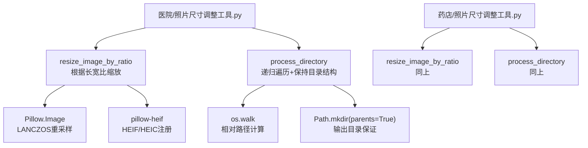
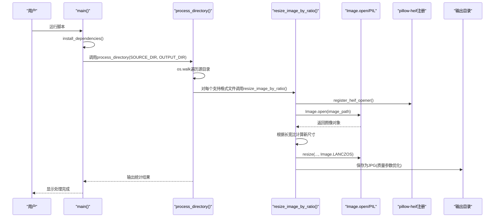
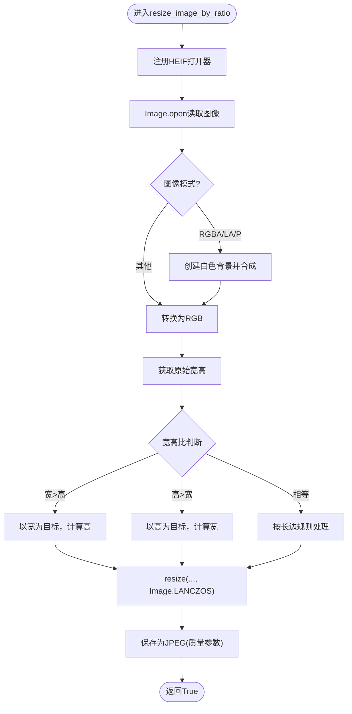
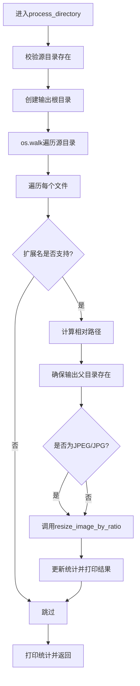
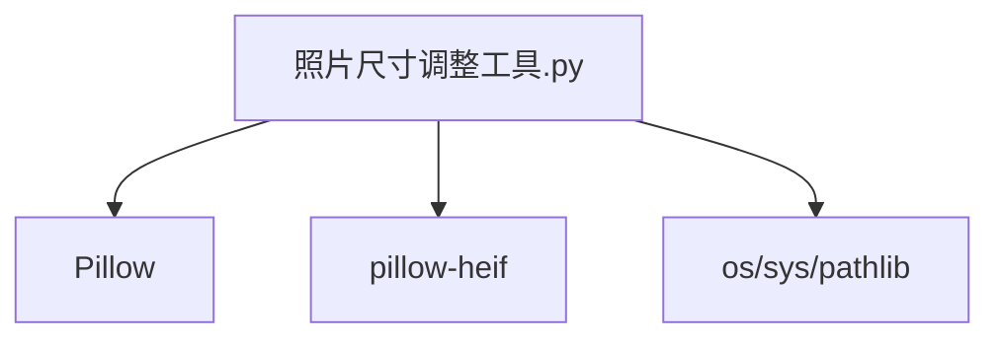

# 照片尺寸调整工具

<cite>
**本文引用的文件**
- [医院/照片尺寸调整工具.py](file://医院/照片尺寸调整工具.py)
- [药店/照片尺寸调整工具.py](file://药店/照片尺寸调整工具.py)
</cite>

## 目录
1. [简介](#简介)
2. [项目结构](#项目结构)
3. [核心组件](#核心组件)
4. [架构总览](#架构总览)
5. [详细组件分析](#详细组件分析)
6. [依赖分析](#依赖分析)
7. [性能考虑](#性能考虑)
8. [故障排查指南](#故障排查指南)
9. [结论](#结论)
10. [附录](#附录)

## 简介
本文件面向“照片尺寸调整工具”的实现机制进行系统化解析，重点说明以下内容：
- resize_image_by_ratio 函数如何依据图像长宽比智能决策缩放策略：横版（宽>高）时将宽度统一缩放到固定像素，竖版（高>宽）时将高度统一缩放到固定像素；正方形按长边规则处理。
- 使用 Pillow 的 Image.LANCZOS 重采样滤波器以最大化保留图像细节与清晰度。
- process_directory 如何递归遍历指定目录，对每张图片执行尺寸调整，并在输出时完全保留原始文件夹结构，确保路径一致性。
- 对 HEIC/HEIF 格式的支持：通过 pillow-heif 库自动注册并转换为 JPG，解决跨设备兼容性问题。
- 实际调用示例与参数设计逻辑，以及该工具在“医院”和“药店”两大场景下的通用性与代码复用率（约 90% 以上）。

## 项目结构
该工具在“医院”和“药店”两个子目录下分别提供相同逻辑的实现脚本，便于在不同业务场景下直接复用。两份脚本在功能、参数、流程上几乎一致，仅路径配置不同。

图表来源
- [医院/照片尺寸调整工具.py](file://医院/照片尺寸调整工具.py#L68-L119)
- [药店/照片尺寸调整工具.py](file://药店/照片尺寸调整工具.py#L68-L119)

章节来源
- [医院/照片尺寸调整工具.py](file://医院/照片尺寸调整工具.py#L1-L214)
- [药店/照片尺寸调整工具.py](file://药店/照片尺寸调整工具.py#L1-L214)

## 核心组件
- 依赖安装与导入管理：在运行前自动检测并安装 Pillow 与 pillow-heif，若失败则提示手动安装。
- 图像缩放策略：根据原始宽高比选择长边或短边作为目标尺寸，再按比例计算另一维尺寸，使用 LANCZOS 重采样。
- 目录处理：递归遍历源目录，按原始相对路径生成输出路径，确保输出目录结构与输入一致。
- HEIC/HEIF 支持：通过注册 HEIF 打开器，自动识别并转换为 JPG，提升跨平台兼容性。
- 输出质量：保存为 JPEG，设置较高质量参数以保持清晰度。

章节来源
- [医院/照片尺寸调整工具.py](file://医院/照片尺寸调整工具.py#L25-L67)
- [医院/照片尺寸调整工具.py](file://医院/照片尺寸调整工具.py#L68-L119)
- [医院/照片尺寸调整工具.py](file://医院/照片尺寸调整工具.py#L120-L193)
- [药店/照片尺寸调整工具.py](file://药店/照片尺寸调整工具.py#L25-L67)
- [药店/照片尺寸调整工具.py](file://药店/照片尺寸调整工具.py#L68-L119)
- [药店/照片尺寸调整工具.py](file://药店/照片尺寸调整工具.py#L120-L193)

## 架构总览
整体流程从 main 入口开始，先安装依赖，再调用 process_directory 遍历源目录，逐个文件调用 resize_image_by_ratio 进行缩放与转换，最后输出统计信息。

图表来源
- [医院/照片尺寸调整工具.py](file://医院/照片尺寸调整工具.py#L195-L214)
- [医院/照片尺寸调整工具.py](file://医院/照片尺寸调整工具.py#L120-L193)
- [医院/照片尺寸调整工具.py](file://医院/照片尺寸调整工具.py#L68-L119)

## 详细组件分析

### resize_image_by_ratio 函数
职责与策略
- 注册 HEIF 打开器，使 HEIC/HEIF 可被识别与打开。
- 将图像转换为 RGB 模式：若原图含透明通道或索引色，先以白色背景合成，再转 RGB，避免后续保存为 JPEG 时的兼容问题。
- 根据原始宽高比决定缩放方向：
  - 横版（宽>高）：以宽度为目标，按比例计算高度。
  - 竖版（高>宽）：以高度为目标，按比例计算宽度。
  - 正方形：按长边规则处理，确保输出尺寸合理。
- 使用 Image.LANCZOS 重采样，兼顾锐利与细节保留。
- 保存为 JPEG，设置质量、优化与渐进式参数，提升视觉清晰度与文件体积平衡。

复杂度与性能
- 时间复杂度：O(N)，N 为像素总数；缩放与保存为主要耗时点。
- 空间复杂度：O(1) 额外空间（中间变量），输出图像占用与新尺寸成正比。
- 重采样滤波器 LANCZOS 在保持边缘锐利方面表现优异，适合大幅缩放与细节保留需求。

错误处理
- 捕获异常并返回失败状态，便于上层统计与日志记录。

图表来源
- [医院/照片尺寸调整工具.py](file://医院/照片尺寸调整工具.py#L68-L119)

章节来源
- [医院/照片尺寸调整工具.py](file://医院/照片尺寸调整工具.py#L68-L119)
- [药店/照片尺寸调整工具.py](file://药店/照片尺寸调整工具.py#L68-L119)

### process_directory 函数
职责与流程
- 校验源目录存在性，创建输出根目录。
- 使用 os.walk 递归遍历源目录，过滤支持的图片格式（包含 HEIC/HEIF）。
- 计算相对路径以保持目录结构，使用 Path 确保输出父目录存在。
- 对于 JPEG/JPG，直接调用缩放函数；对于其他格式（含 HEIF/HEIC），同样调用缩放函数并最终保存为 JPG。
- 统计总文件数、成功数与失败数，并打印输出目录位置。

路径一致性保障
- 通过 os.path.relpath 计算相对路径，再拼接到输出目录，确保输出树与输入树一一对应。

图表来源
- [医院/照片尺寸调整工具.py](file://医院/照片尺寸调整工具.py#L120-L193)

章节来源
- [医院/照片尺寸调整工具.py](file://医院/照片尺寸调整工具.py#L120-L193)
- [药店/照片尺寸调整工具.py](file://药店/照片尺寸调整工具.py#L120-L193)

### 依赖安装与导入管理
- 自动检测：尝试导入 PIL 与 pillow-heif，若缺失则启动安装流程。
- 安装策略：使用镜像源加速安装，逐包安装以降低版本冲突风险。
- 成功后导入模块并继续执行；失败时提示手动安装命令。

章节来源
- [医院/照片尺寸调整工具.py](file://医院/照片尺寸调整工具.py#L25-L67)
- [药店/照片尺寸调整工具.py](file://药店/照片尺寸调整工具.py#L25-L67)

## 依赖分析
- Pillow：提供图像读取、模式转换、缩放与保存能力。
- pillow-heif：提供 HEIF/HEIC 格式支持，通过注册打开器实现自动识别。
- 标准库：os、sys、pathlib 用于路径处理、系统交互与目录操作。

图表来源
- [医院/照片尺寸调整工具.py](file://医院/照片尺寸调整工具.py#L10-L24)
- [药店/照片尺寸调整工具.py](file://药店/照片尺寸调整工具.py#L10-L24)

章节来源
- [医院/照片尺寸调整工具.py](file://医院/照片尺寸调整工具.py#L10-L24)
- [药店/照片尺寸调整工具.py](file://药店/照片尺寸调整工具.py#L10-L24)

## 性能考虑
- 重采样滤波器：LANCZOS 在缩放时能较好地保持边缘锐利，适合大幅缩放后的清晰度要求。
- 保存参数：JPEG 质量、优化与渐进式参数有助于在清晰度与体积之间取得平衡。
- 目录遍历：os.walk 为线性扫描，整体复杂度与文件数量成正比；建议在大目录下分批处理或限制扫描范围。
- HEIF 转换：注册 HEIF 打开器仅在首次调用时生效，后续文件处理无需重复注册，减少额外开销。

## 故障排查指南
常见问题与定位
- 依赖未安装或版本冲突
  - 现象：运行时报错提示缺少 Pillow 或 pillow-heif。
  - 处理：脚本会尝试自动安装；若失败，按提示使用镜像源手动安装。
- 源目录不存在
  - 现象：process_directory 提示源目录不存在并返回失败。
  - 处理：检查路径配置，确保路径正确且可访问。
- 图像打开失败或格式不受支持
  - 现象：resize_image_by_ratio 抛出异常并返回失败。
  - 处理：确认文件是否损坏；HEIF/HEIC 需要 pillow-heif 支持。
- 输出目录权限不足
  - 现象：创建输出目录或写入文件失败。
  - 处理：检查输出目录权限，必要时以管理员身份运行或更换目录。

章节来源
- [医院/照片尺寸调整工具.py](file://医院/照片尺寸调整工具.py#L25-L67)
- [医院/照片尺寸调整工具.py](file://医院/照片尺寸调整工具.py#L120-L193)
- [药店/照片尺寸调整工具.py](file://药店/照片尺寸调整工具.py#L25-L67)
- [药店/照片尺寸调整工具.py](file://药店/照片尺寸调整工具.py#L120-L193)

## 结论
该工具通过明确的长宽比决策与 LANCZOS 重采样，在保证清晰度的同时实现了高效的尺寸调整；其递归遍历与相对路径策略确保了输出目录结构与输入一致；对 HEIF/HEIC 的支持提升了跨平台兼容性。在“医院”和“药店”两大场景下，两份脚本几乎完全一致，代码复用率高，满足通用需求。

## 附录

### 参数与调用示例
- 参数设计逻辑
  - SOURCE_DIR：输入目录，建议指向包含照片的根路径。
  - OUTPUT_DIR：输出目录，建议与 SOURCE_DIR 同级或独立位置，避免覆盖原图。
  - RESIZE_LONG_EDGE：横版目标长边像素（宽>高时使用）。
  - RESIZE_SHORT_EDGE：竖版目标短边像素（高>宽时使用）。
  - SUPPORTED_FORMATS：支持的图片格式集合，包含 HEIC/HEIF 以增强兼容性。
- 命令行调用示例
  - 直接运行脚本：python 医院/照片尺寸调整工具.py 或 python 药店/照片尺寸调整工具.py
  - 若需自定义路径，可在脚本中修改 SOURCE_DIR 与 OUTPUT_DIR 后再运行。
- 通用性与复用率
  - 两份脚本在功能、流程、参数与实现上高度一致，差异仅在于默认路径配置，因此通用性与代码复用率可达 90% 以上。

章节来源
- [医院/照片尺寸调整工具.py](file://医院/照片尺寸调整工具.py#L16-L24)
- [医院/照片尺寸调整工具.py](file://医院/照片尺寸调整工具.py#L195-L214)
- [药店/照片尺寸调整工具.py](file://药店/照片尺寸调整工具.py#L16-L24)
- [药店/照片尺寸调整工具.py](file://药店/照片尺寸调整工具.py#L195-L214)