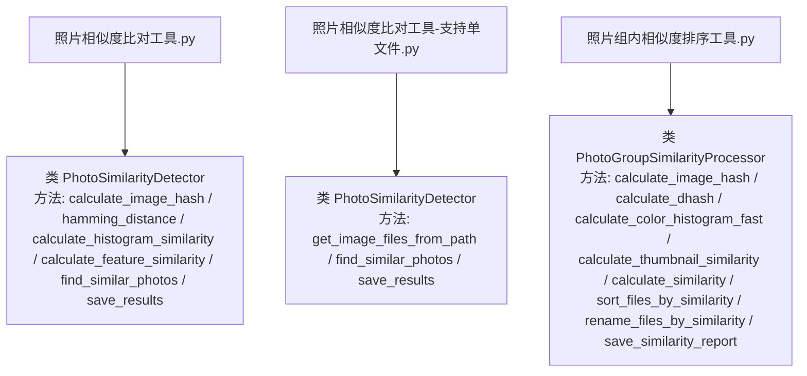
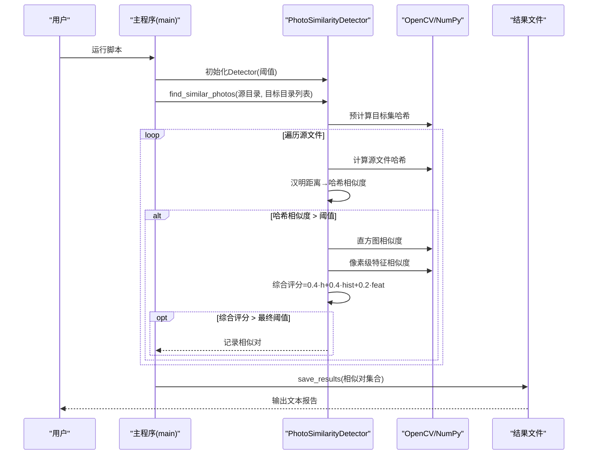
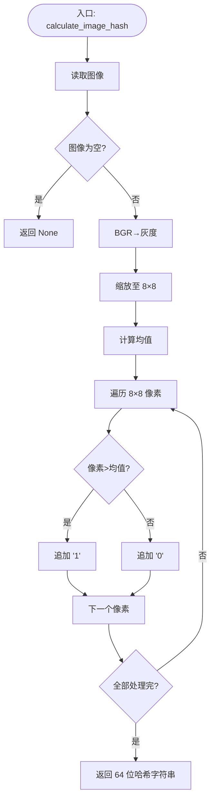
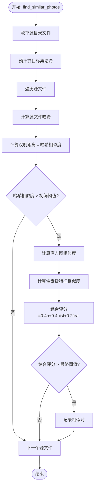
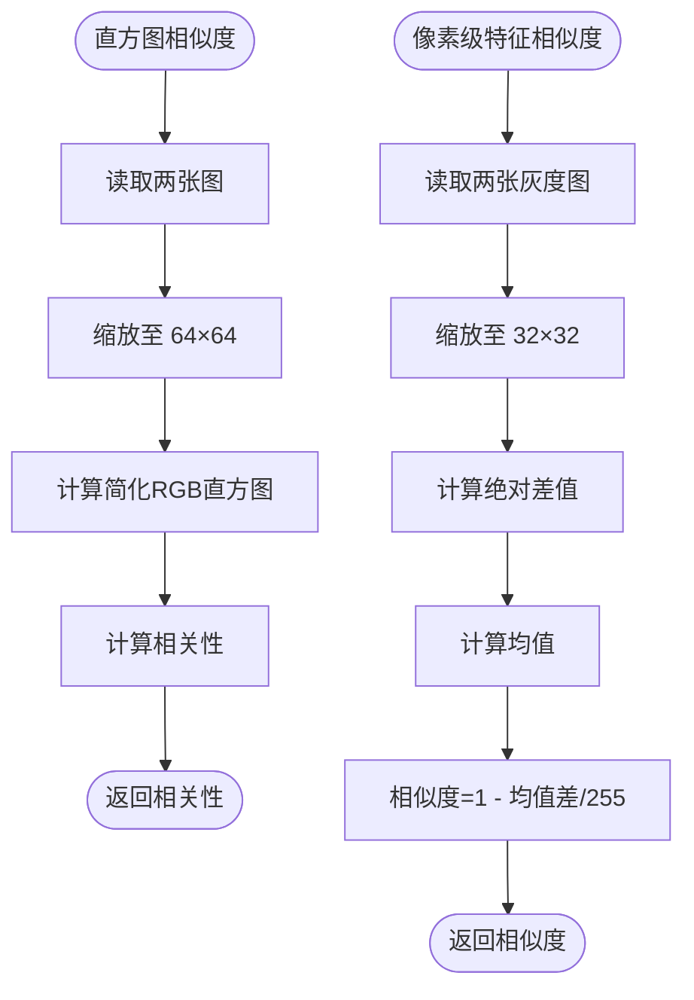
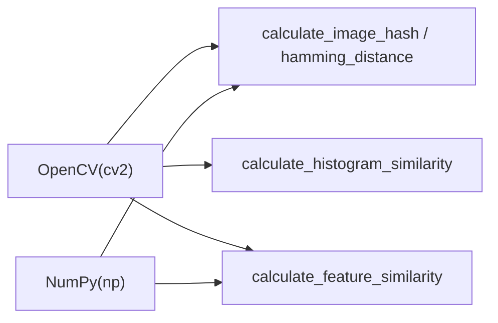
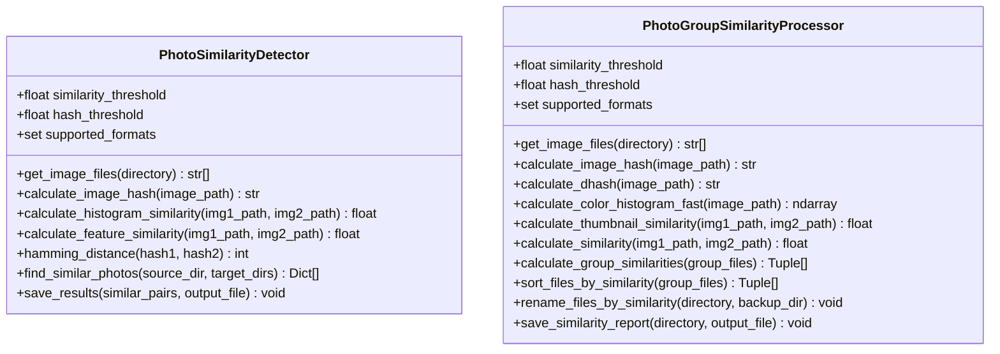

# 照片相似度检测

<cite>
**本文引用的文件**
- [照片相似度比对工具.py](file://医院/照片相似度比对工具.py)
- [照片相似度比对工具-支持单文件.py](file://医院/照片相似度比对工具-支持单文件.py)
- [照片组内相似度排序工具.py](file://医院/照片组内相似度排序工具.py)
</cite>

## 目录
1. [简介](#简介)
2. [项目结构](#项目结构)
3. [核心组件](#核心组件)
4. [架构总览](#架构总览)
5. [详细组件分析](#详细组件分析)
6. [依赖分析](#依赖分析)
7. [性能考量](#性能考量)
8. [故障排查指南](#故障排查指南)
9. [结论](#结论)
10. [附录](#附录)

## 简介
本文件面向“照片相似度检测”工具，系统性阐述其技术实现，重点聚焦于：
- 基于 OpenCV 的感知哈希（pHash）算法在 calculate_image_hash 方法中的实现细节：图像灰度化、8×8 缩放、均值哈希生成过程；
- find_similar_photos 中的分阶段比对策略：第一阶段通过哈希初筛（hamming_distance 计算）快速过滤候选集；第二阶段结合直方图相似度（calculate_histogram_similarity）与像素级特征相似度（calculate_feature_similarity）进行综合评分；
- 整体相似度计算公式（hash_similarity × 0.4 + hist_similarity × 0.4 + feature_similarity × 0.2）的权重设计原理；
- save_results 如何生成结构化文本报告；
- main 函数中预设的源目录与目标目录配置模式；
- 命令行参数配置建议，以及在医药拜访场景中防止重复提交照片的实际应用价值。

## 项目结构
本仓库围绕“照片相似度检测”提供了三个核心脚本，分别面向不同使用场景：
- 单次运行、跨目录比对：[照片相似度比对工具.py](file://医院/照片相似度比对工具.py)
- 支持单文件/目录混合输入：[照片相似度比对工具-支持单文件.py](file://医院/照片相似度比对工具-支持单文件.py)
- 组内相似度排序与重命名：[照片组内相似度排序工具.py](file://医院/照片组内相似度排序工具.py)

图表来源
- [照片相似度比对工具.py](file://医院/照片相似度比对工具.py#L19-L318)
- [照片相似度比对工具-支持单文件.py](file://医院/照片相似度比对工具-支持单文件.py#L19-L341)
- [照片组内相似度排序工具.py](file://医院/照片组内相似度排序工具.py#L18-L476)

章节来源
- [照片相似度比对工具.py](file://医院/照片相似度比对工具.py#L1-L318)
- [照片相似度比对工具-支持单文件.py](file://医院/照片相似度比对工具-支持单文件.py#L1-L341)
- [照片组内相似度排序工具.py](file://医院/照片组内相似度排序工具.py#L1-L476)

## 核心组件
- PhotoSimilarityDetector（双脚本均包含）
  - 计算感知哈希：calculate_image_hash
  - 汉明距离：hamming_distance
  - 直方图相似度：calculate_histogram_similarity
  - 像素级特征相似度：calculate_feature_similarity
  - 分阶段比对：find_similar_photos
  - 结果保存：save_results
- PhotoGroupSimilarityProcessor（仅排序脚本）
  - 差异哈希（dHash）：calculate_dhash
  - 快速颜色直方图：calculate_color_histogram_fast
  - 缩略图像素相似度：calculate_thumbnail_similarity
  - 综合相似度：calculate_similarity
  - 组内排序与重命名：sort_files_by_similarity / rename_files_by_similarity
  - 报告生成：save_similarity_report

章节来源
- [照片相似度比对工具.py](file://医院/照片相似度比对工具.py#L19-L218)
- [照片相似度比对工具-支持单文件.py](file://医院/照片相似度比对工具-支持单文件.py#L19-L241)
- [照片组内相似度排序工具.py](file://医院/照片组内相似度排序工具.py#L18-L407)

## 架构总览
整体流程由“文件枚举—哈希预计算—初筛—详细比对—综合评分—结果输出”构成。双脚本采用相同的分阶段策略，排序脚本在此基础上扩展了多指标融合与组内重命名能力。

图表来源
- [照片相似度比对工具.py](file://医院/照片相似度比对工具.py#L127-L218)
- [照片相似度比对工具.py](file://医院/照片相似度比对工具.py#L219-L318)

## 详细组件分析

### 感知哈希（pHash）实现细节
- 输入：图像路径
- 步骤：
  1) 读取图像（失败返回空）
  2) 转灰度图
  3) 缩放到 8×8
  4) 计算 8×8 像素块的全局均值
  5) 逐像素与均值比较，生成 64 位二进制字符串（哈希）
- 返回：长度为 64 的字符串（二进制位串）

图表来源
- [照片相似度比对工具.py](file://医院/照片相似度比对工具.py#L46-L71)
- [照片相似度比对工具-支持单文件.py](file://医院/照片相似度比对工具-支持单文件.py#L70-L96)
- [照片组内相似度排序工具.py](file://医院/照片组内相似度排序工具.py#L60-L86)

章节来源
- [照片相似度比对工具.py](file://医院/照片相似度比对工具.py#L46-L71)
- [照片相似度比对工具-支持单文件.py](file://医院/照片相似度比对工具-支持单文件.py#L70-L96)
- [照片组内相似度排序工具.py](file://医院/照片组内相似度排序工具.py#L60-L86)

### 分阶段比对策略与综合评分
- 第一阶段（哈希初筛）
  - 预计算目标集所有图片的哈希
  - 对每个源文件计算哈希，计算汉明距离，得到哈希相似度
  - 仅当哈希相似度高于 hash_threshold 时，进入第二阶段
- 第二阶段（详细比对）
  - 计算直方图相似度（相关性）
  - 计算像素级特征相似度（均值绝对差）
  - 综合评分：overall_similarity = 0.4·hash_similarity + 0.4·hist_similarity + 0.2·feature_similarity
  - 仅当 overall_similarity > similarity_threshold 时，记录为相似对

图表来源
- [照片相似度比对工具.py](file://医院/照片相似度比对工具.py#L127-L218)

章节来源
- [照片相似度比对工具.py](file://医院/照片相似度比对工具.py#L127-L218)

### 直方图相似度与像素级特征相似度
- 直方图相似度（calculate_histogram_similarity）
  - 将图像缩小到 64×64，计算 RGB 三通道的简化直方图（例如 16³）
  - 使用相关性作为相似度指标
- 像素级特征相似度（calculate_feature_similarity）
  - 将图像缩小到 32×32，计算灰度图的绝对差值，取均值
  - 转换为相似度：1 - (均值差/255)

图表来源
- [照片相似度比对工具.py](file://医院/照片相似度比对工具.py#L73-L120)
- [照片相似度比对工具-支持单文件.py](file://医院/照片相似度比对工具-支持单文件.py#L97-L144)

章节来源
- [照片相似度比对工具.py](file://医院/照片相似度比对工具.py#L73-L120)
- [照片相似度比对工具-支持单文件.py](file://医院/照片相似度比对工具-支持单文件.py#L97-L144)

### 权重设计原理（0.4/0.4/0.2）
- 设计动机：
  - 哈希相似度（pHash）对亮度、对比度变化鲁棒，适合作为初筛与稳定判据；
  - 直方图相似度反映色彩分布一致性，有助于排除纯色背景或色调差异导致的误判；
  - 像素级特征相似度捕捉局部结构差异，适合进一步细化判断；
- 权重分配：
  - 哈希与直方图各 0.4，强调两者共同作用；
  - 像素级特征 0.2，避免噪声干扰主导整体评分；
- 可调性：阈值与权重均可根据业务场景微调，以平衡召回与精度。

章节来源
- [照片相似度比对工具.py](file://医院/照片相似度比对工具.py#L196-L201)
- [照片相似度比对工具-支持单文件.py](file://医院/照片相似度比对工具-支持单文件.py#L218-L225)

### 结果保存与报告生成
- save_results 输出结构化文本报告，包含：
  - 相似度、源照片、目标照片、哈希相似度、直方图相似度、特征相似度、综合相似度
- main 中默认将报告保存到源目录上一级目录，文件名含时间戳，便于归档与溯源。

章节来源
- [照片相似度比对工具.py](file://医院/照片相似度比对工具.py#L219-L239)
- [照片相似度比对工具.py](file://医院/照片相似度比对工具.py#L310-L316)
- [照片相似度比对工具-支持单文件.py](file://医院/照片相似度比对工具-支持单文件.py#L243-L263)
- [照片相似度比对工具-支持单文件.py](file://医院/照片相似度比对工具-支持单文件.py#L327-L339)

### 主函数配置模式与命令行建议
- 预设配置模式（示例）：
  - 源目录：单个文件夹或单个文件（支持单文件脚本）
  - 目标目录：多个文件夹或文件，支持混合配置
- 命令行参数建议：
  - --source/-s：源路径（文件或目录）
  - --targets/-t：目标路径列表（可多次传入）
  - --hash-threshold/-ht：哈希初筛阈值（默认 0.7）
  - --similarity-threshold/-st：最终相似度阈值（默认 0.85）
  - --output/-o：结果输出文件路径
  - --formats/-f：支持的图片格式集合（如 jpg,jpeg,png,bmp,tiff）
- 医药拜访场景应用价值：
  - 防止重复提交：自动识别同一医生/科室的重复照片，降低人工复核成本；
  - 规范化管理：统一阈值与权重，确保跨地区、跨人员的一致性；
  - 可追溯性：生成结构化报告，便于审计与回溯。

章节来源
- [照片相似度比对工具.py](file://医院/照片相似度比对工具.py#L240-L318)
- [照片相似度比对工具-支持单文件.py](file://医院/照片相似度比对工具-支持单文件.py#L264-L341)

## 依赖分析
- 外部库依赖：
  - OpenCV（cv2）：图像读取、颜色空间转换、尺寸缩放、直方图计算、相似度比较
  - NumPy（np）：数组运算、均值计算
- 内部模块耦合：
  - 三个脚本共享相似的类与方法命名风格，便于迁移与维护；
  - 排序脚本额外引入差异哈希（dHash）、颜色直方图与缩略图相似度，形成更丰富的多指标融合方案。

图表来源
- [照片相似度比对工具.py](file://医院/照片相似度比对工具.py#L46-L120)
- [照片相似度比对工具-支持单文件.py](file://医院/照片相似度比对工具-支持单文件.py#L70-L144)
- [照片组内相似度排序工具.py](file://医院/照片组内相似度排序工具.py#L141-L210)

章节来源
- [照片相似度比对工具.py](file://医院/照片相似度比对工具.py#L8-L18)
- [照片相似度比对工具-支持单文件.py](file://医院/照片相似度比对工具-支持单文件.py#L8-L18)
- [照片组内相似度排序工具.py](file://医院/照片组内相似度排序工具.py#L8-L18)

## 性能考量
- 预计算目标集哈希：显著降低源文件与目标集的全量比对次数，提升整体效率；
- 小尺寸预处理：直方图与特征相似度均采用缩放策略（64×64/32×32），兼顾速度与稳定性；
- 汉明距离：O(64) 常数复杂度，开销极低；
- 综合评分：每次比对仅涉及少量数值运算，整体复杂度与候选数量线性相关。

[本节为通用性能讨论，不直接分析具体文件]

## 故障排查指南
- 图像读取失败：
  - 现象：calculate_image_hash 返回 None 或抛出异常
  - 排查：确认路径存在、权限可读、格式受支持
- 目录为空或无权限：
  - 现象：get_image_files 返回空列表
  - 排查：检查目录是否存在、权限设置、磁盘可用空间
- 相似度为 0：
  - 现象：直方图或特征相似度返回 0
  - 排查：确认图像非空、预处理尺寸有效、OpenCV 可用
- 结果为空：
  - 现象：未发现相似对
  - 排查：适当降低哈希初筛阈值或最终阈值；检查源/目标目录配置

章节来源
- [照片相似度比对工具.py](file://医院/照片相似度比对工具.py#L46-L71)
- [照片相似度比对工具.py](file://医院/照片相似度比对工具.py#L73-L120)
- [照片相似度比对工具-支持单文件.py](file://医院/照片相似度比对工具-支持单文件.py#L26-L69)

## 结论
该工具以 OpenCV 为基础，构建了高效、可调的“哈希初筛 + 多指标融合”的相似度检测体系。pHash 在灰度化与 8×8 缩放后生成稳定指纹，配合直方图与像素级特征，形成稳健的综合评分。通过预计算与阈值控制，显著降低比对成本；结构化报告便于审计与归档。在医药拜访场景中，可有效防止重复提交照片，提升数据质量与合规性。

[本节为总结性内容，不直接分析具体文件]

## 附录

### 类关系图（代码级）

图表来源
- [照片相似度比对工具.py](file://医院/照片相似度比对工具.py#L19-L218)
- [照片组内相似度排序工具.py](file://医院/照片组内相似度排序工具.py#L18-L407)