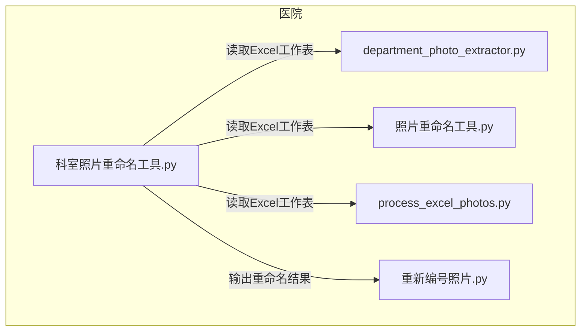
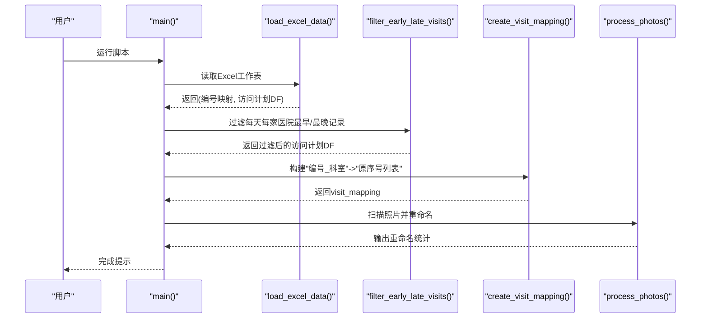
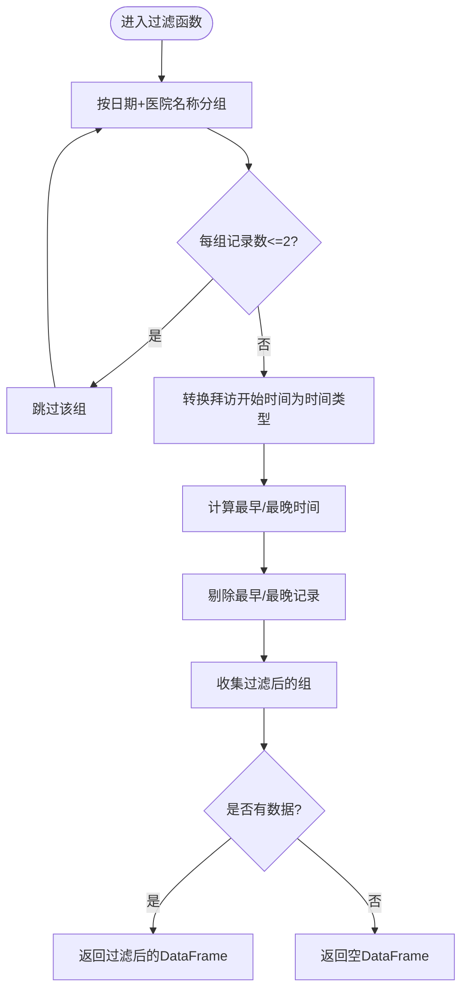
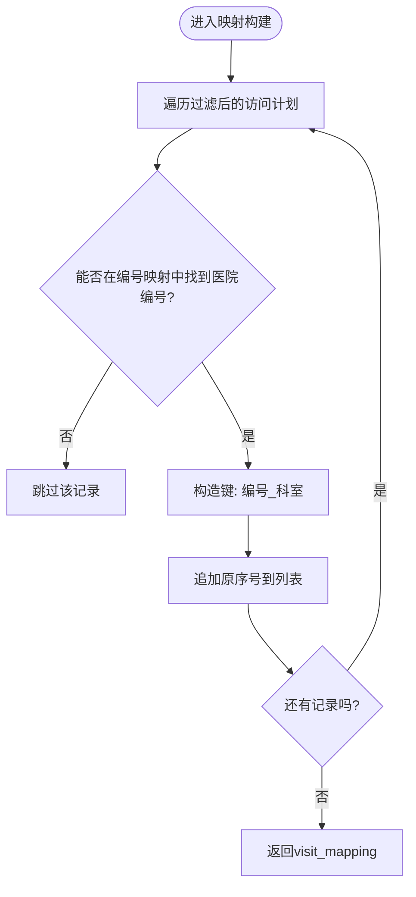
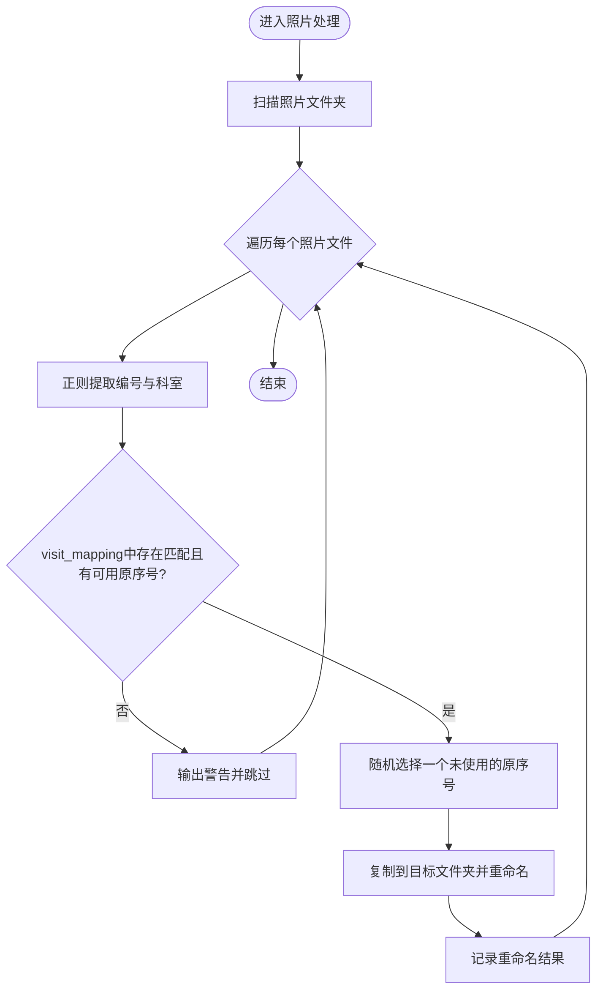
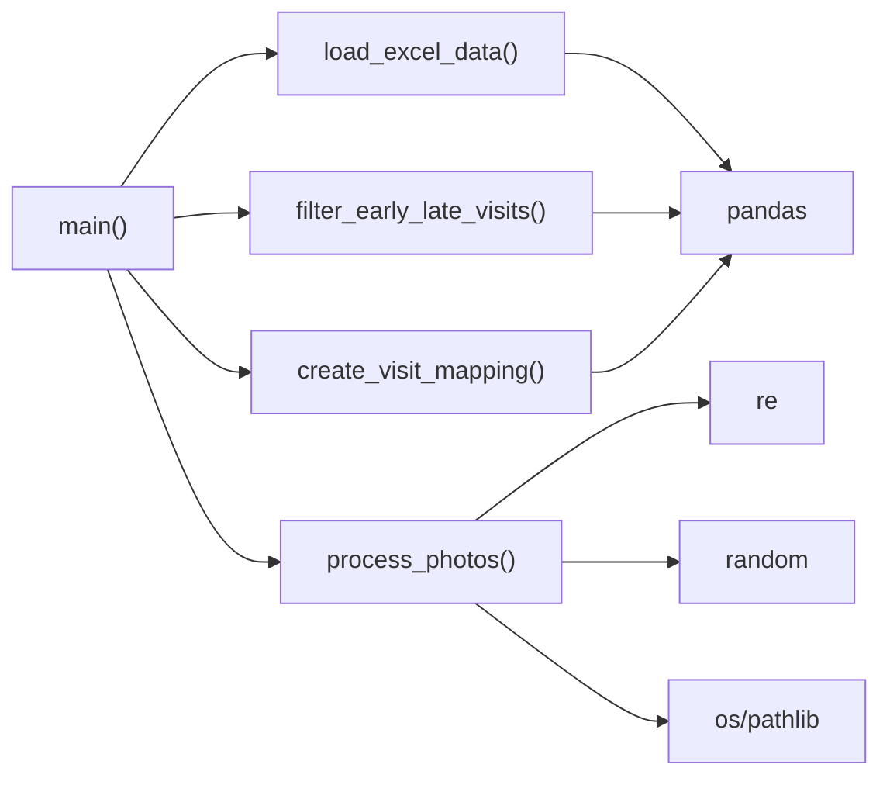

# 医院科室照片重命名

<cite>
**本文引用的文件**
- [科室照片重命名工具.py](file://医院/科室照片重命名工具.py)
- [照片重命名工具.py](file://医院/照片重命名工具.py)
- [department_photo_extractor.py](file://医院/department_photo_extractor.py)
- [process_excel_photos.py](file://医院/process_excel_photos.py)
- [重新编号照片.py](file://医院/重新编号照片.py)
</cite>

## 目录
1. [简介](#简介)
2. [项目结构](#项目结构)
3. [核心组件](#核心组件)
4. [架构总览](#架构总览)
5. [详细组件分析](#详细组件分析)
6. [依赖关系分析](#依赖关系分析)
7. [性能考量](#性能考量)
8. [故障排查指南](#故障排查指南)
9. [结论](#结论)
10. [附录](#附录)

## 简介
本文件面向“科室照片重命名工具”的实现机制进行系统性解析，重点围绕以下四个函数展开：
- load_excel_data：从Excel的“导出计数_列B”和“拜访计划”工作表加载医院编号映射与拜访数据
- filter_early_late_visits：按日期和医院分组，过滤每天每家医院最早和最晚的拜访记录
- create_visit_mapping：构建“编号_科室”到“原序号”列表的映射关系
- process_photos：从照片文件名中提取编号和科室信息进行匹配，并随机分配未使用的原序号作为新文件名

同时，文档阐述该工具在处理医院拜访照片时的业务逻辑、数据流与异常处理机制，并提供实际使用示例与常见问题解决方案。

## 项目结构
该工具位于“医院”目录下，主要文件包括：
- 科室照片重命名工具.py：核心实现
- 照片重命名工具.py：通用照片重命名流程参考
- department_photo_extractor.py：导出计数_列B工作表的医院名称到编号映射读取
- process_excel_photos.py：基于Excel列驱动的照片复制与重命名
- 重新编号照片.py：按文件名排序后重新编号并更新Excel

图表来源
- [科室照片重命名工具.py](file://医院/科室照片重命名工具.py#L32-L200)
- [照片重命名工具.py](file://医院/照片重命名工具.py#L1-L263)
- [department_photo_extractor.py](file://医院/department_photo_extractor.py#L68-L101)
- [process_excel_photos.py](file://医院/process_excel_photos.py#L65-L100)
- [重新编号照片.py](file://医院/重新编号照片.py#L1-L108)

章节来源
- [科室照片重命名工具.py](file://医院/科室照片重命名工具.py#L1-L200)

## 核心组件
- 数据加载与预处理
  - load_excel_data：读取“导出计数_列B”（编号↔医院名称）与“拜访计划”（含日期、医院名称、科室、原序号等），并对日期列进行统一转换
- 访问计划过滤
  - filter_early_late_visits：按“日期+医院名称”分组，剔除每天每家医院最早与最晚的拜访记录，仅保留中间时段的记录
- 映射构建
  - create_visit_mapping：将过滤后的拜访记录映射为“编号_科室”到“原序号列表”的字典，便于后续匹配
- 照片重命名
  - process_photos：扫描照片文件夹，从文件名中提取编号与科室，匹配到“编号_科室”后，随机选择一个未用过的原序号作为新文件名，并复制到目标文件夹

章节来源
- [科室照片重命名工具.py](file://医院/科室照片重命名工具.py#L32-L173)

## 架构总览
整体流程由四步组成：加载数据→过滤访问计划→构建映射→重命名照片。下图展示了模块间调用关系与数据流向。

图表来源
- [科室照片重命名工具.py](file://医院/科室照片重命名工具.py#L175-L200)
- [科室照片重命名工具.py](file://医院/科室照片重命名工具.py#L32-L112)
- [科室照片重命名工具.py](file://医院/科室照片重命名工具.py#L114-L173)

## 详细组件分析

### 组件A：load_excel_data（Excel数据加载）
- 功能要点
  - 读取“导出计数_列B”工作表，建立“编号”到“列B（医院名称）”的映射
  - 读取“拜访计划”工作表，将“日期”列转换为datetime类型，便于后续分组与时间比较
- 关键实现路径
  - [load_excel_data 函数定义](file://医院/科室照片重命名工具.py#L32-L52)
  - [“导出计数_列B”读取与映射构建](file://医院/科室照片重命名工具.py#L36-L42)
  - [“拜访计划”读取与日期转换](file://医院/科室照片重命名工具.py#L45-L51)
- 复杂度与性能
  - 时间复杂度：O(N)，N为“导出计数_列B”行数与“拜访计划”行数之和
  - 空间复杂度：O(N)，用于存储映射与DataFrame
- 异常与边界
  - 若Excel中存在空值，将被跳过；若工作表缺失，需确保外部配置正确
  - 日期转换失败时，应在上层捕获异常并提示

章节来源
- [科室照片重命名工具.py](file://医院/科室照片重命名工具.py#L32-L52)

### 组件B：filter_early_late_visits（访问计划过滤）
- 功能要点
  - 按“日期+医院名称”分组，计算每组最早/最晚“拜访开始时间”，并剔除这两条记录
  - 当某天某医院记录数≤2时，整组被过滤掉，避免极端情况影响统计
- 关键实现路径
  - [分组与时间列转换](file://医院/科室照片重命名工具.py#L60-L70)
  - [最早/最晚时间筛选与过滤](file://医院/科室照片重命名工具.py#L70-L81)
  - [合并过滤结果](file://医院/科室照片重命名工具.py#L82-L89)
- 复杂度与性能
  - 时间复杂度：O(M)，M为分组数量与组内记录数之和
  - 空间复杂度：O(M)
- 异常与边界
  - 时间格式必须为“HH:MM”，否则转换可能失败
  - 当过滤后无剩余记录，返回空DataFrame，调用方需判断

图表来源
- [科室照片重命名工具.py](file://医院/科室照片重命名工具.py#L54-L89)

章节来源
- [科室照片重命名工具.py](file://医院/科室照片重命名工具.py#L54-L89)

### 组件C：create_visit_mapping（映射构建）
- 功能要点
  - 将过滤后的访问计划逐行遍历，通过“医院名称”在编号映射中查找对应“编号”
  - 以“编号_科室”为键，累积“原序号”形成列表，便于后续匹配与去重
- 关键实现路径
  - [遍历过滤后的DataFrame](file://医院/科室照片重命名工具.py#L98-L110)
  - [查找编号并构建键](file://医院/科室照片重命名工具.py#L100-L109)
- 复杂度与性能
  - 时间复杂度：O(K)，K为过滤后记录数
  - 空间复杂度：O(K)
- 异常与边界
  - 若“医院名称”未在编号映射中找到对应编号，该记录将被忽略
  - “原序号”需为可转换为整型的值

图表来源
- [科室照片重命名工具.py](file://医院/科室照片重命名工具.py#L91-L112)

章节来源
- [科室照片重命名工具.py](file://医院/科室照片重命名工具.py#L91-L112)

### 组件D：process_photos（照片重命名）
- 功能要点
  - 扫描照片文件夹，筛选出图片文件
  - 从文件名中提取“编号”和“科室”，拼接为“编号_科室”键
  - 在visit_mapping中查找匹配项，随机选择一个未使用的“原序号”作为新文件名
  - 将原文件复制到目标文件夹，保留原始文件
- 关键实现路径
  - [扫描与筛选照片文件](file://医院/科室照片重命名工具.py#L121-L124)
  - [文件名正则提取编号与科室](file://医院/科室照片重命名工具.py#L133-L138)
  - [匹配visit_mapping与随机选择原序号](file://医院/科室照片重命名工具.py#L140-L149)
  - [复制文件并输出日志](file://医院/科室照片重命名工具.py#L156-L166)
- 复杂度与性能
  - 时间复杂度：O(P)，P为照片文件数量
  - 空间复杂度：O(U)，U为已使用原序号集合（通常远小于P）
- 异常与边界
  - 文件名不符合“编号_科室_”模式时，将被标记为无法解析
  - 当某“编号_科室”无可用原序号时，输出警告
  - 复制过程异常会被捕获并打印错误信息

图表来源
- [科室照片重命名工具.py](file://医院/科室照片重命名工具.py#L114-L173)

章节来源
- [科室照片重命名工具.py](file://医院/科室照片重命名工具.py#L114-L173)

### 组件E：与其它工具的对比与补充
- 通用照片重命名工具（照片重命名工具.py）
  - 提供Excel结构分析、照片目录检查、文件名合法性校验、备份策略与重命名执行
  - 与本工具差异：本工具专注于“编号_科室”匹配与“原序号”复用，而通用工具更偏向“按医院编号”直接重命名
- 导出计数_列B映射读取（department_photo_extractor.py）
  - 展示了从“导出计数_列B”工作表读取编号与名称映射的标准做法，可作为load_excel_data的参考实现
- 基于Excel列驱动的照片复制（process_excel_photos.py）
  - 通过“照片编号”与“新列a”进行匹配复制，体现另一种“原序号”驱动的重命名思路
- 重新编号照片（重新编号照片.py）
  - 按文件名排序后重新编号并更新Excel，适合批量重命名场景

章节来源
- [照片重命名工具.py](file://医院/照片重命名工具.py#L1-L263)
- [department_photo_extractor.py](file://医院/department_photo_extractor.py#L68-L101)
- [process_excel_photos.py](file://医院/process_excel_photos.py#L65-L100)
- [重新编号照片.py](file://医院/重新编号照片.py#L1-L108)

## 依赖关系分析
- 内部依赖
  - main() 依次调用 load_excel_data → filter_early_late_visits → create_visit_mapping → process_photos
  - process_photos 依赖 visit_mapping 的键“编号_科室”与值“原序号列表”
- 外部依赖
  - pandas：读取Excel、分组与时间处理
  - os/pathlib：文件系统操作与路径管理
  - re：文件名正则匹配
  - random：随机选择原序号
  - collections.defaultdict：字典默认值与集合去重

图表来源
- [科室照片重命名工具.py](file://医院/科室照片重命名工具.py#L175-L200)
- [科室照片重命名工具.py](file://医院/科室照片重命名工具.py#L32-L173)

章节来源
- [科室照片重命名工具.py](file://医院/科室照片重命名工具.py#L175-L200)

## 性能考量
- I/O开销
  - Excel读取与照片复制为主要耗时环节，建议在本地SSD上运行，避免网络盘导致延迟
- 正则与字典查找
  - 文件名正则匹配与字典查找均为O(1)平均复杂度，整体线性扩展
- 内存占用
  - visit_mapping 与 used_numbers 集合规模受记录数与照片数限制，通常可控
- 并发与批处理
  - 当前实现为顺序处理，如需加速可考虑多进程复制（注意文件锁与目标路径一致性）

## 故障排查指南
- Excel工作表缺失或列名不一致
  - 现象：读取失败或列名不匹配
  - 排查：确认Excel包含“导出计数_列B”和“拜访计划”工作表；核对列名与数据类型
  - 参考实现路径：[load_excel_data](file://医院/科室照片重命名工具.py#L36-L51)
- 日期/时间格式异常
  - 现象：分组或时间比较失败
  - 排查：确保“日期”列为日期类型，“拜访开始时间”为“HH:MM”格式
  - 参考实现路径：[filter_early_late_visits](file://医院/科室照片重命名工具.py#L48-L70)
- 照片文件名格式不符
  - 现象：无法解析编号与科室
  - 排查：文件名需满足“编号_科室_”前缀；检查扩展名大小写与特殊字符
  - 参考实现路径：[process_photos 正则匹配](file://医院/科室照片重命名工具.py#L133-L138)
- 无可用原序号
  - 现象：输出“已无可用原序号”的警告
  - 排查：检查visit_mapping中对应“编号_科室”的原序号列表是否为空或已被全部使用
  - 参考实现路径：[process_photos 原序号选择](file://医院/科室照片重命名工具.py#L140-L149)
- 复制失败
  - 现象：复制文件时报错
  - 排查：检查源路径、目标路径权限、磁盘空间；确认文件未被占用
  - 参考实现路径：[process_photos 复制逻辑](file://医院/科室照片重命名工具.py#L156-L166)
- 异常处理
  - 现象：程序中断
  - 排查：main()中捕获异常并打印堆栈，定位具体位置
  - 参考实现路径：[main 异常捕获](file://医院/科室照片重命名工具.py#L194-L198)

章节来源
- [科室照片重命名工具.py](file://医院/科室照片重命名工具.py#L114-L173)
- [科室照片重命名工具.py](file://医院/科室照片重命名工具.py#L175-L200)

## 结论
该工具通过“编号_科室”与“原序号”的双维度映射，实现了对科室照片的精准匹配与重命名。其核心优势在于：
- 业务清晰：先过滤极端时段，再构建映射，最后按规则重命名
- 可靠性强：完善的异常处理与日志输出，便于问题定位
- 可扩展性：模块化设计，易于与其他工具协同（如通用照片重命名工具、导出计数映射读取）

## 附录

### 实际使用示例
- 准备Excel
  - 确保包含“导出计数_列B”（编号↔医院名称）与“拜访计划”（日期、医院名称、科室、原序号等）
- 配置路径
  - 修改EXCEL_FILE_PATH、PHOTO_FOLDER_PATH、TARGET_FOLDER_PATH为实际路径
  - 参考路径设置：[配置常量](file://医院/科室照片重命名工具.py#L21-L29)
- 运行脚本
  - 执行main()，观察控制台输出的日志与统计
  - 参考入口：[main](file://医院/科室照片重命名工具.py#L175-L200)

### 常见问题与解决方案
- 问：Excel中“导出计数_列B”列名不同怎么办？
  - 解决：修改读取列名或在读取后重命名列；也可参考department_photo_extractor.py的映射读取方式
  - 参考：[department_photo_extractor](file://医院/department_photo_extractor.py#L68-L101)
- 问：照片文件名不规范如何处理？
  - 解决：统一命名规则为“编号_科室_”前缀；必要时先用重新编号工具整理
  - 参考：[重新编号照片](file://医院/重新编号照片.py#L1-L108)
- 问：如何验证重命名结果？
  - 解决：检查目标文件夹中文件名是否为“原序号.扩展名”，并与visit_plan对应
  - 参考：[process_photos 输出](file://医院/科室照片重命名工具.py#L156-L166)