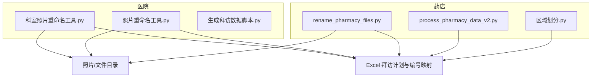
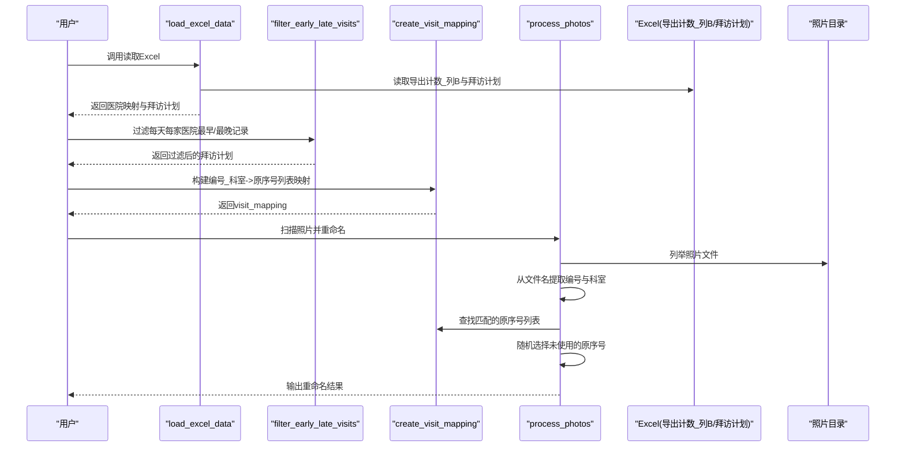
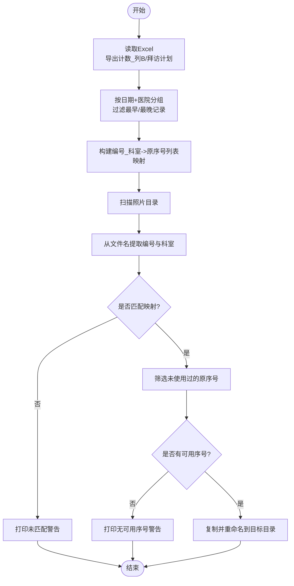
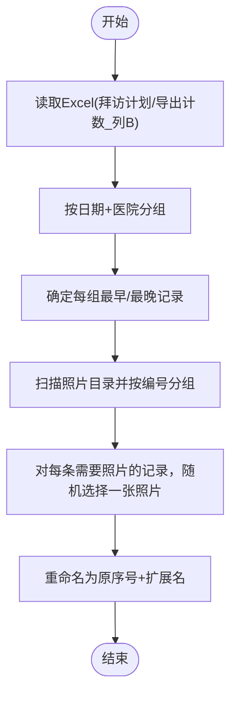
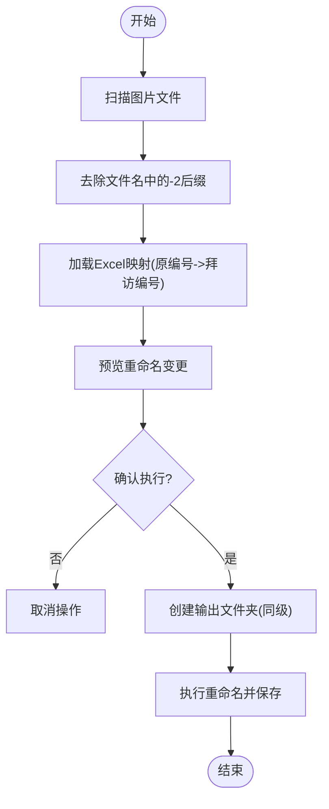
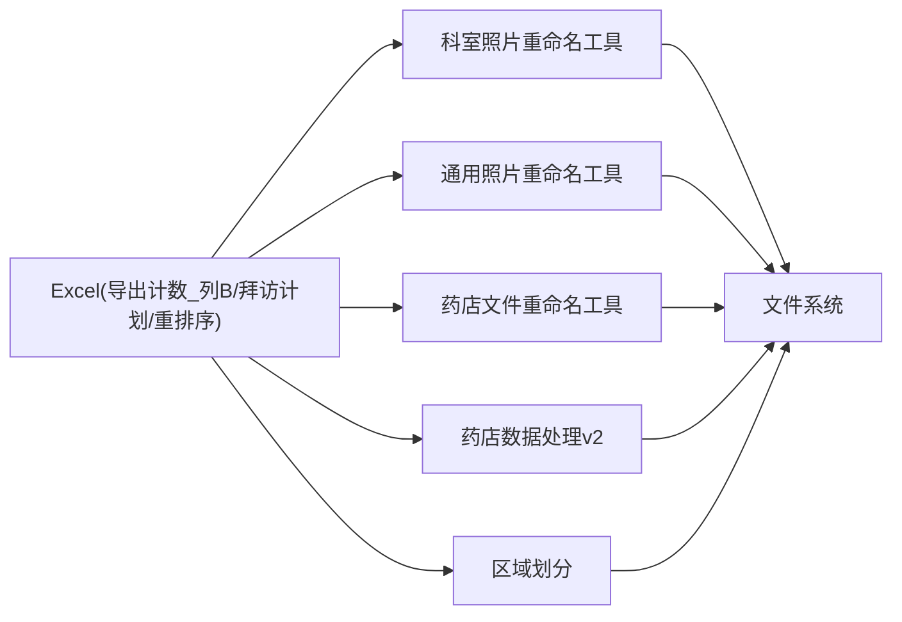

# 照片重命名与文件管理

<cite>
**本文引用的文件**
- [医院/科室照片重命名工具.py](file://医院/科室照片重命名工具.py)
- [医院/照片重命名工具.py](file://医院/照片重命名工具.py)
- [药店/rename_pharmacy_files.py](file://药店/rename_pharmacy_files.py)
- [药店/process_pharmacy_data_v2.py](file://药店/process_pharmacy_data_v2.py)
- [医院/生成拜访数据脚本.py](file://医院/生成拜访数据脚本.py)
- [药店/区域划分.py](file://药店/区域划分.py)
</cite>

## 目录
1. [简介](#简介)
2. [项目结构](#项目结构)
3. [核心组件](#核心组件)
4. [架构总览](#架构总览)
5. [详细组件分析](#详细组件分析)
6. [依赖分析](#依赖分析)
7. [性能考虑](#性能考虑)
8. [故障排查指南](#故障排查指南)
9. [结论](#结论)
10. [附录](#附录)

## 简介
本文件围绕“照片重命名工具”的功能设计与实现细节展开，重点解析以下内容：
- 科室照片重命名工具如何通过 load_excel_data 函数读取 Excel 文件中的医院编号映射与拜访计划数据，并利用 filter_early_late_visits 函数过滤每天每家医院最早和最晚的拜访记录。
- create_visit_mapping 函数如何构建“编号_科室”到“原序号”列表的映射关系。
- process_photos 函数如何从照片文件名中提取编号和科室信息进行匹配，并随机分配未使用的原序号作为新文件名。
- 对比分析通用照片重命名工具与药店文件重命名工具的命名规则差异，阐述这些工具在统一医药拜访照片命名规范、提升文件管理效率方面的实际价值。

## 项目结构
本仓库包含两类工具链：
- 医院侧：提供“科室照片重命名工具”和“通用照片重命名工具”，分别面向“科室照片”和“大门照片”的重命名需求。
- 药店侧：提供“药店文件重命名工具”和“药店拜访数据处理工具”，用于药店拜访数据的区域划分与重排序，以及文件重命名。

图表来源
- [医院/科室照片重命名工具.py](file://医院/科室照片重命名工具.py#L1-L200)
- [医院/照片重命名工具.py](file://医院/照片重命名工具.py#L1-L263)
- [药店/rename_pharmacy_files.py](file://药店/rename_pharmacy_files.py#L1-L183)
- [药店/process_pharmacy_data_v2.py](file://药店/process_pharmacy_data_v2.py#L1-L173)
- [药店/区域划分.py](file://药店/区域划分.py#L1-L321)
- [医院/生成拜访数据脚本.py](file://医院/生成拜访数据脚本.py#L1-L127)

章节来源
- [医院/科室照片重命名工具.py](file://医院/科室照片重命名工具.py#L1-L200)
- [医院/照片重命名工具.py](file://医院/照片重命名工具.py#L1-L263)
- [药店/rename_pharmacy_files.py](file://药店/rename_pharmacy_files.py#L1-L183)
- [药店/process_pharmacy_data_v2.py](file://药店/process_pharmacy_data_v2.py#L1-L173)
- [药店/区域划分.py](file://药店/区域划分.py#L1-L321)
- [医院/生成拜访数据脚本.py](file://医院/生成拜访数据脚本.py#L1-L127)

## 核心组件
- 科室照片重命名工具
  - load_excel_data：读取“导出计数_列B”和“拜访计划”两个工作表，建立医院编号映射与拜访计划数据。
  - filter_early_late_visits：按日期与医院分组，过滤掉每天每家医院最早与最晚的拜访记录。
  - create_visit_mapping：将过滤后的拜访记录映射为“编号_科室”到“原序号”列表。
  - process_photos：扫描照片目录，从文件名中提取编号与科室，匹配映射并随机分配原序号作为新文件名。
- 通用照片重命名工具
  - 读取Excel中的“拜访计划”和“导出计数_列B”，构建医院名称到编号的映射。
  - 分析每天每家医院的最早/最晚时间，确定需要照片的记录集合。
  - 按医院编号分组照片，随机选择照片并直接重命名，不使用“最早/最晚”过滤策略。
- 药店文件重命名工具
  - 扫描目标目录中的图片文件，去掉文件名中的“-2”后缀，再依据Excel中的映射关系重命名。
  - 支持预览变更、确认执行、输出到同级新建文件夹等流程。

章节来源
- [医院/科室照片重命名工具.py](file://医院/科室照片重命名工具.py#L32-L174)
- [医院/照片重命名工具.py](file://医院/照片重命名工具.py#L83-L240)
- [药店/rename_pharmacy_files.py](file://药店/rename_pharmacy_files.py#L25-L181)

## 架构总览
下面以序列图展示“科室照片重命名工具”的端到端流程，体现数据读取、过滤、映射与重命名的关键步骤。

图表来源
- [医院/科室照片重命名工具.py](file://医院/科室照片重命名工具.py#L32-L174)

## 详细组件分析

### 组件A：科室照片重命名工具
- 数据读取与映射
  - load_excel_data 读取“导出计数_列B”工作表，建立“编号”到“列B（医院名称）”的映射；同时读取“拜访计划”工作表，转换日期列类型，便于后续按日期与医院分组。
- 过滤策略
  - filter_early_late_visits 对每个“日期+医院名称”组合，先将“拜访开始时间”转换为时间类型，再找出最早与最晚时间，过滤掉这两条记录。若某天某医院记录数≤2，则整体过滤掉。
- 映射构建
  - create_visit_mapping 遍历过滤后的拜访记录，查找对应编号，构造“编号_科室”作为键，收集“原序号”形成列表。
- 文件重命名
  - process_photos 扫描照片目录，仅处理图片文件；从文件名中正则提取“编号_科室”键，与映射匹配；在该键对应的原序号列表中，排除已使用过的序号，随机选择一个未使用的序号作为新文件名；将原文件复制到目标目录并命名为新文件名，保留原文件。

图表来源
- [医院/科室照片重命名工具.py](file://医院/科室照片重命名工具.py#L32-L174)

章节来源
- [医院/科室照片重命名工具.py](file://医院/科室照片重命名工具.py#L32-L174)

### 组件B：通用照片重命名工具（医院大门照片）
- 数据读取与映射
  - 读取“拜访计划”和“导出计数_列B”，建立“医院名称->编号”的映射。
- 识别需要照片的记录
  - 按“日期+医院名称”分组，计算每组的最早与最晚时间，将“最早/最晚”记录标记为需要照片的记录集合。
- 照片分组与重命名
  - 按“医院编号”对照片进行分组；对每个需要照片的记录，随机选择一张照片并直接重命名为“原序号”（保留扩展名），不进行“最早/最晚”过滤。

图表来源
- [医院/照片重命名工具.py](file://医院/照片重命名工具.py#L83-L240)

章节来源
- [医院/照片重命名工具.py](file://医院/照片重命名工具.py#L83-L240)

### 组件C：药店文件重命名工具
- 功能概述
  - 扫描目标目录中的PNG/JPG文件，去掉文件名中的“-2”后缀，再依据Excel中的映射关系重命名。
- 关键流程
  - scan_image_files：列出图片文件。
  - remove_suffix_2：正则匹配并去除“-2”后缀。
  - load_mapping_data：从Excel“重排序”工作表读取映射（原编号->拜访编号），过滤空值。
  - preview_changes：预览将要进行的重命名操作。
  - rename_files：执行重命名并将文件保存到同级新建的输出文件夹。

图表来源
- [药店/rename_pharmacy_files.py](file://药店/rename_pharmacy_files.py#L25-L181)

章节来源
- [药店/rename_pharmacy_files.py](file://药店/rename_pharmacy_files.py#L25-L181)

### 组件D：药店拜访数据处理与区域划分
- process_pharmacy_data_v2
  - 读取Excel，按“区域编号”分组统计“区域”数量，确定每个区域编号的“区域a”（即该编号下药店数量最多的区域）。
  - 计算“区域a计数”，并按“区域a优先级（以'区'结尾优先）->区域a计数（降序）->区域a（升序）->区域编号（升序）->区域内顺序（升序）”进行多级排序。
  - 将排序结果写回原Excel的新标签页或保存为备份文件。
- 区域划分.py
  - 基于经纬度使用贪心算法与KDTree进行区域划分，生成“区域编号”和“区域内顺序”，并输出结果Excel。

章节来源
- [药店/process_pharmacy_data_v2.py](file://药店/process_pharmacy_data_v2.py#L21-L166)
- [药店/区域划分.py](file://药店/区域划分.py#L1-L321)

## 依赖分析
- 工具间耦合关系
  - 科室照片重命名工具与通用照片重命名工具均依赖Excel中的“导出计数_列B”和“拜访计划”工作表，但前者额外引入“过滤最早/最晚”的策略。
  - 药店文件重命名工具依赖Excel中的“重排序”工作表，且不涉及“最早/最晚”过滤。
- 外部依赖
  - pandas：读取Excel、分组与排序。
  - re：文件名解析与后缀处理。
  - os/shutil/pathlib：文件系统操作与路径管理。
  - random：随机选择原序号与照片。

图表来源
- [医院/科室照片重命名工具.py](file://医院/科室照片重命名工具.py#L32-L174)
- [医院/照片重命名工具.py](file://医院/照片重命名工具.py#L83-L240)
- [药店/rename_pharmacy_files.py](file://药店/rename_pharmacy_files.py#L25-L181)
- [药店/process_pharmacy_data_v2.py](file://药店/process_pharmacy_data_v2.py#L21-L166)
- [药店/区域划分.py](file://药店/区域划分.py#L1-L321)

章节来源
- [医院/科室照片重命名工具.py](file://医院/科室照片重命名工具.py#L32-L174)
- [医院/照片重命名工具.py](file://医院/照片重命名工具.py#L83-L240)
- [药店/rename_pharmacy_files.py](file://药店/rename_pharmacy_files.py#L25-L181)
- [药店/process_pharmacy_data_v2.py](file://药店/process_pharmacy_data_v2.py#L21-L166)
- [药店/区域划分.py](file://药店/区域划分.py#L1-L321)

## 性能考虑
- 时间复杂度
  - load_excel_data：O(N)，N为“拜访计划”记录数。
  - filter_early_late_visits：O(N)，按日期+医院分组后逐组处理。
  - create_visit_mapping：O(N)，遍历过滤后的记录。
  - process_photos：O(M+N)，M为照片数，N为映射键数，查找与随机选择均为常数级。
  - 通用照片重命名工具：按日期+医院分组后计算最早/最晚，整体O(N)。
- I/O与复制
  - 科室照片重命名工具采用复制而非移动，避免误删原文件，但会增加磁盘I/O与存储占用。
  - 通用照片重命名工具直接在原目录重命名，减少I/O。
- 并发与缓存
  - 当前实现未使用并发，若数据量较大可考虑多进程/线程分批处理。
  - 区域划分中使用距离缓存与KDTree，有助于加速最近点查询。

[本节为通用性能讨论，不直接分析具体代码文件]

## 故障排查指南
- Excel文件读取失败
  - 检查工作表名称是否为“导出计数_列B”、“拜访计划”或“重排序”，确保列名与脚本预期一致。
  - 若读取异常，查看异常堆栈并确认Excel路径与权限。
- 文件名解析失败
  - 科室照片重命名工具要求文件名以“编号_科室_...”格式，若无法匹配将打印警告。
  - 药店重命名工具要求文件名中可能包含“-2”后缀，需确认文件名格式。
- 原序号重复或耗尽
  - 科室照片重命名工具会跟踪已使用序号，若某键下无可用序号会打印警告；建议在Excel中补充更多原序号。
- 目标目录不存在或权限不足
  - 科室照片重命名工具会自动创建目标目录；若仍失败，请检查路径权限与磁盘空间。
- 通用照片重命名工具未生成照片
  - 若某医院当天仅有一条或两条拜访记录，将被过滤掉，导致无照片可重命名；请核对Excel数据完整性。

章节来源
- [医院/科室照片重命名工具.py](file://医院/科室照片重命名工具.py#L114-L174)
- [药店/rename_pharmacy_files.py](file://药店/rename_pharmacy_files.py#L125-L181)
- [医院/照片重命名工具.py](file://医院/照片重命名工具.py#L138-L240)

## 结论
- 科室照片重命名工具通过“过滤最早/最晚”策略，确保每家医院每天的代表性照片被保留，结合“编号_科室->原序号”映射，实现了精准、随机且可追溯的命名。
- 通用照片重命名工具侧重“大门照片”的批量重命名，流程更简洁，适合快速归档。
- 药店文件重命名工具专注于“重排序”映射与后缀清理，配合区域划分与数据处理工具，形成完整的药店拜访数据与文件管理闭环。
- 这些工具共同提升了医药拜访照片的命名一致性与检索效率，降低了人工整理成本，增强了数据治理质量。

[本节为总结性内容，不直接分析具体代码文件]

## 附录

### 命名规则对比与实践价值
- 科室照片重命名工具
  - 规则：基于“编号_科室”匹配，过滤“最早/最晚”后随机分配“原序号”作为文件名。
  - 实践价值：保证代表性照片与拜访计划一一对应，便于回溯与审计。
- 通用照片重命名工具（大门照片）
  - 规则：按“日期+医院”分组，识别“最早/最晚”记录，随机分配“原序号”重命名。
  - 实践价值：简化流程，快速归档，适合大规模批量处理。
- 药店文件重命名工具
  - 规则：去除“-2”后缀，按“原编号->拜访编号”映射重命名，输出到同级新文件夹。
  - 实践价值：统一药店照片命名，便于区域与顺序管理。

章节来源
- [医院/科室照片重命名工具.py](file://医院/科室照片重命名工具.py#L32-L174)
- [医院/照片重命名工具.py](file://医院/照片重命名工具.py#L83-L240)
- [药店/rename_pharmacy_files.py](file://药店/rename_pharmacy_files.py#L25-L181)