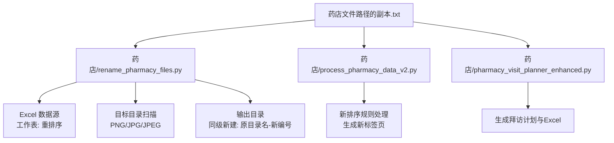
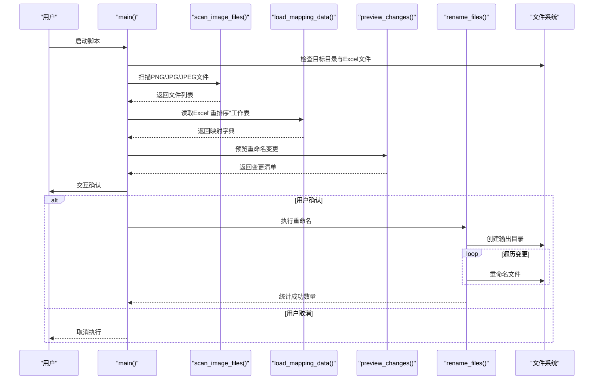
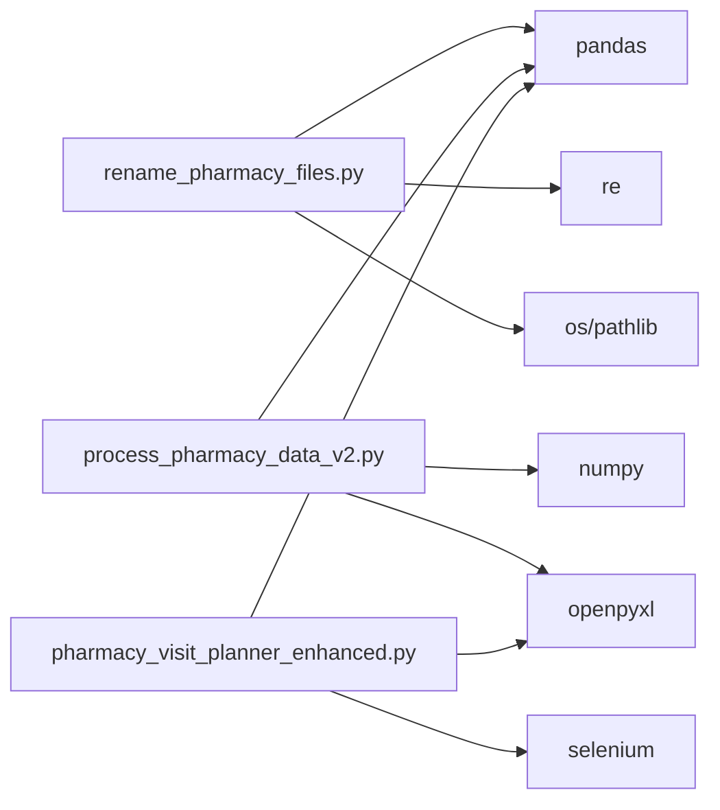

# 药店文件重命名

<cite>
**本文引用的文件**
- [药店/rename_pharmacy_files.py](file://药店/rename_pharmacy_files.py)
- [药店/process_pharmacy_data_v2.py](file://药店/process_pharmacy_data_v2.py)
- [药店/pharmacy_visit_planner_enhanced.py](file://药店/pharmacy_visit_planner_enhanced.py)
- [药店文件路径的副本.txt](file://药店文件路径的副本.txt)
- [医院/文件重命名脚本.py](file://医院/文件重命名脚本.py)
- [医院/照片重命名工具.py](file://医院/照片重命名工具.py)
</cite>

## 目录
1. [简介](#简介)
2. [项目结构](#项目结构)
3. [核心组件](#核心组件)
4. [架构总览](#架构总览)
5. [详细组件分析](#详细组件分析)
6. [依赖关系分析](#依赖关系分析)
7. [性能考量](#性能考量)
8. [故障排查指南](#故障排查指南)
9. [结论](#结论)
10. [附录](#附录)

## 简介
本文件面向“药店文件重命名工具”的使用者与维护者，系统阐述以下处理逻辑与设计考量：
- remove_suffix_2 函数如何移除文件名中的“-2”后缀；
- load_mapping_data 函数如何从Excel的“重排序”工作表中读取“原编号”到“拜访编号”的映射关系；
- preview_changes 函数如何预览重命名结果；
- rename_files 函数如何将文件重命名并保存到新创建的输出目录中；
- 工具通过交互式确认机制防止误操作的设计；
- 结果文件保存在带有“-新编号”后缀的独立文件夹中的设计考量；
- 与“医院照片重命名工具”在命名规则、数据源与处理流程上的根本区别。

## 项目结构
药店相关脚本位于“药店”目录，核心文件包括：
- rename_pharmacy_files.py：药店文件重命名主程序；
- process_pharmacy_data_v2.py：按新排序规则处理药店拜访数据；
- pharmacy_visit_planner_enhanced.py：增强版药店拜访规划系统；
- 药店文件路径的副本.txt：列出与药店相关的脚本与路径。

图表来源
- [药店/rename_pharmacy_files.py](file://药店/rename_pharmacy_files.py#L1-L183)
- [药店/process_pharmacy_data_v2.py](file://药店/process_pharmacy_data_v2.py#L1-L173)
- [药店/pharmacy_visit_planner_enhanced.py](file://药店/pharmacy_visit_planner_enhanced.py#L1-L555)
- [药店文件路径的副本.txt](file://药店文件路径的副本.txt#L1-L23)

章节来源
- [药店/rename_pharmacy_files.py](file://药店/rename_pharmacy_files.py#L1-L183)
- [药店/process_pharmacy_data_v2.py](file://药店/process_pharmacy_data_v2.py#L1-L173)
- [药店/pharmacy_visit_planner_enhanced.py](file://药店/pharmacy_visit_planner_enhanced.py#L1-L555)
- [药店文件路径的副本.txt](file://药店文件路径的副本.txt#L1-L23)

## 核心组件
- remove_suffix_2：正则匹配并移除文件名中的“-2”，仅作用于扩展名前的“-2”片段，避免误伤业务编号。
- load_mapping_data：从Excel“重排序”工作表读取“原编号”到“拜访编号”的映射，过滤空值与NaN，构建字典。
- preview_changes：先去“-2”，再按映射生成新文件名，打印预览；未命中映射的文件单独提示。
- rename_files：在输出目录逐条执行重命名，跳过已存在的目标文件，统计成功数量。
- main：串联扫描、加载、预览、确认与执行，自动在同级创建“原目录名-新编号”的输出目录。

章节来源
- [药店/rename_pharmacy_files.py](file://药店/rename_pharmacy_files.py#L38-L124)
- [药店/rename_pharmacy_files.py](file://药店/rename_pharmacy_files.py#L125-L183)

## 架构总览
药店文件重命名工具采用“扫描-加载-预览-确认-执行”的线性流水线，数据流自上而下推进，错误与边界条件在各阶段显式处理。

图表来源
- [药店/rename_pharmacy_files.py](file://药店/rename_pharmacy_files.py#L25-L183)

## 详细组件分析

### remove_suffix_2：移除“-2”后缀
- 设计要点
  - 使用正则匹配文件名中“-2”后缀，确保仅替换扩展名前的“-2”，避免误伤业务编号。
  - 若未匹配到“-2”，直接返回原文件名，保证幂等性。
- 复杂度
  - 时间复杂度 O(n)，n 为文件名长度；空间复杂度 O(1)。
- 边界与错误处理
  - 不改变扩展名大小写；若文件名不含“-2”，不作任何改动。
- 适用场景
  - 针对特定命名模式（如“编号-2.png”）的清理，便于后续映射。

章节来源
- [药店/rename_pharmacy_files.py](file://药店/rename_pharmacy_files.py#L38-L46)

### load_mapping_data：从Excel读取映射
- 数据源
  - Excel 工作表：重排序
  - 列名：原编号、拜访编号
- 处理逻辑
  - 读取首行为表头，校验两列是否存在；若缺失则返回空映射。
  - 遍历行，对“原编号”和“拜访编号”做空白与NaN过滤，构建字典。
- 复杂度
  - 时间复杂度 O(m)，m 为行数；空间复杂度 O(k)，k 为有效映射数量。
- 错误处理
  - 读取异常时返回空映射并打印错误信息，避免中断流程。
- 与“医院照片重命名工具”的差异
  - 药店：按“原编号→拜访编号”一对一映射，强调“重排序”工作表。
  - 医院：按“拜访编号→新编号”生成新编号并复制文件，强调“生成新编号”的过程。

章节来源
- [药店/rename_pharmacy_files.py](file://药店/rename_pharmacy_files.py#L47-L76)

### preview_changes：预览重命名结果
- 流程
  - 对每个文件先调用 remove_suffix_2 清理“-2”。
  - 分离扩展名，查询映射字典，若命中则生成“新编号+扩展名”并加入变更清单；否则提示未命中。
  - 打印每条变更，便于用户核对。
- 复杂度
  - 时间复杂度 O(f)，f 为文件数；查找映射为 O(1) 平均。
- 交互价值
  - 在执行前提供可视化预览，降低误操作风险。

章节来源
- [药店/rename_pharmacy_files.py](file://药店/rename_pharmacy_files.py#L77-L98)

### rename_files：执行重命名并保存
- 流程
  - 遍历变更清单，拼接旧路径与新路径。
  - 若目标文件已存在则跳过并提示，避免覆盖。
  - 成功重命名后统计计数并打印进度。
- 复杂度
  - 时间复杂度 O(c)，c 为变更数量；系统调用开销主要来自文件系统。
- 错误处理
  - 捕获重命名异常并打印错误，不影响其余文件的处理。
- 输出目录策略
  - 在原目录同级创建“原目录名-新编号”的输出目录，便于隔离与归档。

章节来源
- [药店/rename_pharmacy_files.py](file://药店/rename_pharmacy_files.py#L99-L124)

### main：控制流与交互确认
- 流程
  - 参数检查：目标目录与Excel文件存在性校验。
  - 扫描与加载：调用 scan_image_files 与 load_mapping_data。
  - 预览与确认：调用 preview_changes 并等待用户输入 y/N。
  - 执行：若确认，则调用 rename_files；否则取消。
  - 输出目录：自动在同级创建“原目录名-新编号”目录。
- 交互式确认机制
  - 通过标准输入等待用户确认，防止误操作。
- 设计考量
  - 输出目录与源目录同级，避免污染源目录；“-新编号”后缀直观表明用途。

章节来源
- [药店/rename_pharmacy_files.py](file://药店/rename_pharmacy_files.py#L125-L183)

### 与“医院照片重命名工具”的对比
- 命名规则
  - 药店：基于“原编号→拜访编号”的映射，重命名为“拜访编号+扩展名”。
  - 医院：基于“原序号”生成“新编号”，并在原目录直接重命名。
- 数据源
  - 药店：Excel“重排序”工作表，列名为“原编号”“拜访编号”。
  - 医院：Excel“拜访计划”“导出计数_列B”两个工作表，建立“医院名称→编号”的映射。
- 处理流程
  - 药店：扫描→去“-2”→映射→预览→确认→重命名到独立输出目录。
  - 医院：分析Excel→筛选需要照片的记录→备份→随机选择照片→在原目录重命名。
- 输出策略
  - 药店：独立输出目录，避免覆盖源文件。
  - 医院：直接在原目录重命名，同时创建备份目录。

章节来源
- [药店/rename_pharmacy_files.py](file://药店/rename_pharmacy_files.py#L25-L183)
- [医院/文件重命名脚本.py](file://医院/文件重命名脚本.py#L1-L130)
- [医院/照片重命名工具.py](file://医院/照片重命名工具.py#L1-L263)

## 依赖关系分析
- 内部依赖
  - rename_pharmacy_files.py 依赖 pandas、re、os、pathlib。
  - process_pharmacy_data_v2.py 依赖 pandas、numpy、openpyxl。
  - pharmacy_visit_planner_enhanced.py 依赖 selenium、pandas、openpyxl。
- 外部依赖
  - pandas：读取Excel、数据处理与排序。
  - openpyxl：写入Excel新标签页。
  - selenium：增强版规划系统自动化抓取。
- 耦合与内聚
  - rename_pharmacy_files.py 功能单一、内聚度高，模块间耦合低。
  - process_pharmacy_data_v2.py 专注于排序与统计，与重命名脚本解耦。
  - pharmacy_visit_planner_enhanced.py 与重命名脚本解耦，但共同服务于“药店”主题。

图表来源
- [药店/rename_pharmacy_files.py](file://药店/rename_pharmacy_files.py#L1-L24)
- [药店/process_pharmacy_data_v2.py](file://药店/process_pharmacy_data_v2.py#L1-L20)
- [药店/pharmacy_visit_planner_enhanced.py](file://药店/pharmacy_visit_planner_enhanced.py#L1-L30)

章节来源
- [药店/rename_pharmacy_files.py](file://药店/rename_pharmacy_files.py#L1-L24)
- [药店/process_pharmacy_data_v2.py](file://药店/process_pharmacy_data_v2.py#L1-L20)
- [药店/pharmacy_visit_planner_enhanced.py](file://药店/pharmacy_visit_planner_enhanced.py#L1-L30)

## 性能考量
- 文件扫描与映射查找
  - 扫描目录与映射查找均为线性复杂度，适合中小规模目录。
- 正则匹配
  - 正则仅在 remove_suffix_2 中使用，匹配简单，性能开销可忽略。
- I/O 与并发
  - rename_files 逐条重命名，I/O 为主瓶颈；当前未启用并发，避免竞态与覆盖风险。
- 建议
  - 大量文件时可考虑分批处理或并行化（需谨慎处理文件锁与冲突）。
  - 预览阶段可限制显示数量，避免终端溢出。

[本节为通用建议，无需具体文件分析]

## 故障排查指南
- 目标目录或Excel文件不存在
  - 现象：程序提前终止并提示错误。
  - 处理：检查路径配置，确保文件存在且可读。
- 未找到“原编号”或“拜访编号”列
  - 现象：返回空映射并打印警告。
  - 处理：确认Excel工作表名称与列名一致。
- 未命中映射
  - 现象：预览中提示“未找到对应的拜访编号”。
  - 处理：检查“原编号”是否与文件名（去“-2”后）一致，或Excel中是否存在该编号。
- 目标文件已存在
  - 现象：跳过重命名并提示。
  - 处理：删除或手动处理冲突文件后再执行。
- 交互确认取消
  - 现象：用户输入非 y/Y 后取消执行。
  - 处理：重新运行并确认，或在确认前先预览变更。

章节来源
- [药店/rename_pharmacy_files.py](file://药店/rename_pharmacy_files.py#L125-L183)

## 结论
药店文件重命名工具通过“去-2→映射→预览→确认→重命名”的清晰流程，结合独立输出目录与交互确认，有效降低了误操作风险。与医院照片重命名工具相比，药店工具更强调“原编号→拜访编号”的映射与“重排序”工作表的数据源，流程简洁、职责明确，适配当前业务场景。未来可在大文件场景下引入更稳健的并发与日志记录，进一步提升可靠性与可观测性。

[本节为总结，无需具体文件分析]

## 附录
- 药店相关脚本与路径参考
  - 药店文件重命名脚本：[药店/rename_pharmacy_files.py](file://药店/rename_pharmacy_files.py#L1-L183)
  - 药店数据重排序脚本：[药店/process_pharmacy_data_v2.py](file://药店/process_pharmacy_data_v2.py#L1-L173)
  - 增强版药店拜访规划系统：[药店/pharmacy_visit_planner_enhanced.py](file://药店/pharmacy_visit_planner_enhanced.py#L1-L555)
  - 药店文件路径参考：[药店文件路径的副本.txt](file://药店文件路径的副本.txt#L1-L23)
- 医院相关脚本对比参考
  - 医院文件重命名脚本：[医院/文件重命名脚本.py](file://医院/文件重命名脚本.py#L1-L130)
  - 医院照片重命名工具：[医院/照片重命名工具.py](file://医院/照片重命名工具.py#L1-L263)