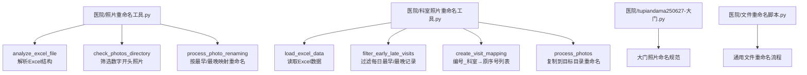
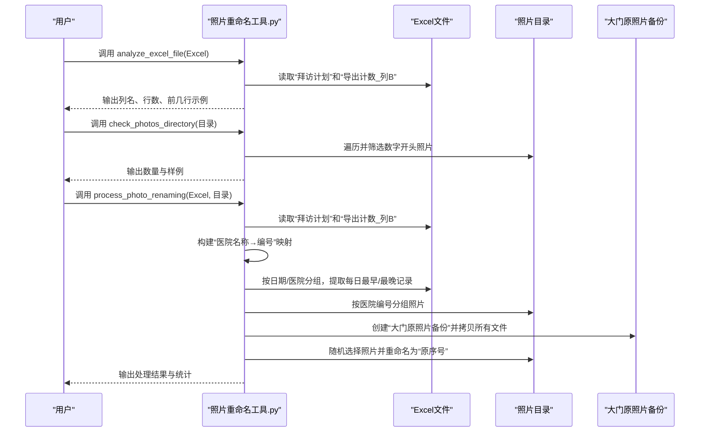
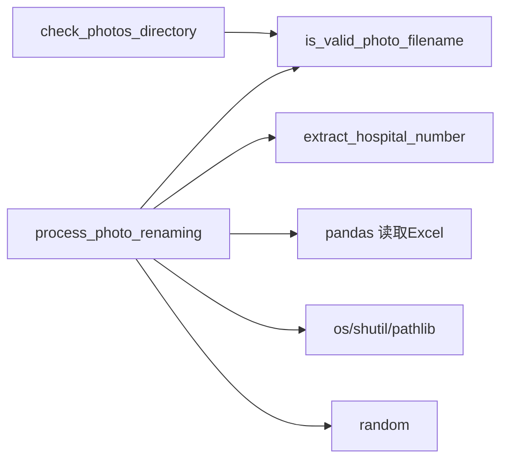

# 通用照片重命名处理

<cite>
**本文引用的文件**
- [照片重命名工具.py](file://医院/照片重命名工具.py)
- [科室照片重命名工具.py](file://医院/科室照片重命名工具.py)
- [tupiandama250627-大门.py](file://医院/tupiandama250627-大门.py)
- [文件重命名脚本.py](file://医院/文件重命名脚本.py)
</cite>

## 目录
1. [简介](#简介)
2. [项目结构](#项目结构)
3. [核心组件](#核心组件)
4. [架构总览](#架构总览)
5. [详细组件分析](#详细组件分析)
6. [依赖关系分析](#依赖关系分析)
7. [性能考量](#性能考量)
8. [故障排查指南](#故障排查指南)
9. [结论](#结论)
10. [附录](#附录)

## 简介
本文件面向“通用照片重命名工具”的工作流程进行深入分析，重点围绕以下三个函数展开：
- analyze_excel_file：解析Excel文件结构，输出“拜访计划”和“导出计数_列B”两个工作表的列名、行数及前几行示例，帮助确认数据结构与字段。
- check_photos_directory：识别以数字开头的合法照片文件（支持“数字-”或“数字_”两种分隔符），统计数量并列出部分样本，便于预检。
- process_photo_renaming：从Excel中读取“拜访计划”和“导出计数_列B”，构建“医院编号→医院名称”的映射；按日期与医院分组，提取每日每家医院的最早与最晚拜访记录；按医院编号分组照片，随机选择一张照片，将其重命名为对应的“原序号”。

此外，脚本会在与照片目录同一级创建“大门原照片备份”目录，将照片目录下的所有文件进行备份，随后在原目录直接重命名照片文件，避免丢失原始文件。

最后，文档将对比“通用照片重命名工具”与“科室照片重命名工具”的差异，突出其适用于大门照片等通用场景的特点。

## 项目结构
本仓库包含多个与医院/药店拜访相关的脚本，其中与本次分析直接相关的文件如下：
- 医院/照片重命名工具.py：实现Excel解析、照片筛选、映射与重命名的核心逻辑。
- 医院/科室照片重命名工具.py：针对科室场景的重命名策略，强调过滤每日最早/最晚记录并按“编号_科室”匹配。
- 医院/tupiandama250627-大门.py：与大门场景相关的照片命名与水印脚本，体现大门照片命名规范。
- 医院/文件重命名脚本.py：通用文件重命名与复制流程示例，便于对照理解。

图表来源
- [照片重命名工具.py](file://医院/照片重命名工具.py#L7-L35)
- [照片重命名工具.py](file://医院/照片重命名工具.py#L36-L81)
- [照片重命名工具.py](file://医院/照片重命名工具.py#L83-L246)
- [科室照片重命名工具.py](file://医院/科室照片重命名工具.py#L32-L52)
- [科室照片重命名工具.py](file://医院/科室照片重命名工具.py#L54-L89)
- [科室照片重命名工具.py](file://医院/科室照片重命名工具.py#L91-L112)
- [科室照片重命名工具.py](file://医院/科室照片重命名工具.py#L114-L173)
- [tupiandama250627-大门.py](file://医院/tupiandama250627-大门.py#L1-L179)
- [文件重命名脚本.py](file://医院/文件重命名脚本.py#L1-L130)

章节来源
- [照片重命名工具.py](file://医院/照片重命名工具.py#L1-L263)
- [科室照片重命名工具.py](file://医院/科室照片重命名工具.py#L1-L200)
- [tupiandama250627-大门.py](file://医院/tupiandama250627-大门.py#L1-L179)
- [文件重命名脚本.py](file://医院/文件重命名脚本.py#L1-L130)

## 核心组件
- analyze_excel_file：读取Excel并打印工作表清单、列名、行数以及前几行数据，便于快速核对“拜访计划”和“导出计数_列B”的结构。
- check_photos_directory：遍历指定目录，筛选以数字开头且满足“数字-”或“数字_”格式的照片文件，输出数量与样例。
- process_photo_renaming：核心流程函数，负责：
  - 读取“拜访计划”和“导出计数_列B”，建立“医院名称→编号”的映射；
  - 按日期与医院分组，提取每日每家医院的最早与最晚拜访记录；
  - 按医院编号对照片进行分组；
  - 为每条需要照片的记录随机选择一张照片，直接重命名为“原序号”；
  - 在与照片目录同一级创建“大门原照片备份”目录，备份所有文件，确保可回滚。

章节来源
- [照片重命名工具.py](file://医院/照片重命名工具.py#L7-L35)
- [照片重命名工具.py](file://医院/照片重命名工具.py#L36-L81)
- [照片重命名工具.py](file://医院/照片重命名工具.py#L83-L246)

## 架构总览
下图展示了通用照片重命名工具的高层调用关系与数据流：

图表来源
- [照片重命名工具.py](file://医院/照片重命名工具.py#L7-L35)
- [照片重命名工具.py](file://医院/照片重命名工具.py#L36-L81)
- [照片重命名工具.py](file://医院/照片重命名工具.py#L83-L246)

## 详细组件分析

### analyze_excel_file：解析Excel文件结构
- 功能要点
  - 读取Excel所有工作表名称，输出工作表清单。
  - 若存在“拜访计划”工作表，输出列名、行数与前5行数据。
  - 若存在“导出计数_列B”工作表，输出列名、行数与前5行数据。
- 数据用途
  - “拜访计划”用于后续按日期与医院分组，提取每日最早/最晚拜访记录。
  - “导出计数_列B”用于建立“医院名称→编号”的映射，供重命名时使用。
- 输出信息
  - 列名、行数、前几行示例，便于核对字段是否正确。

章节来源
- [照片重命名工具.py](file://医院/照片重命名工具.py#L7-L35)

### check_photos_directory：识别数字开头照片文件
- 功能要点
  - 检查目录是否存在，不存在则返回空列表。
  - 遍历目录中的文件，使用 is_valid_photo_filename 判断是否以数字开头（支持“数字-”或“数字_”）。
  - 输出找到的合法照片数量与部分样例（最多显示前10张）。
- 文件名判定规则
  - 通过查找第一个“-”或“_”分隔符，取分隔符之前的片段，若全为数字则视为有效。
- 作用
  - 快速预检照片目录，确认待处理文件数量与命名格式。

章节来源
- [照片重命名工具.py](file://医院/照片重命名工具.py#L36-L81)

### process_photo_renaming：提取医院编号、构建每日最早/最晚记录并重命名
- 主要步骤
  1) 读取“拜访计划”和“导出计数_列B”，建立“医院名称→编号”的映射。
  2) 将“拜访计划”中的“日期”列转换为日期类型，按“日期+医院名称”分组，计算每组的最早与最晚“拜访开始时间”，分别生成一条“最早/最晚”记录，记录包含“原序号”“日期”“医院”“医院编号”“时间”“类型”。
  3) 遍历照片目录，按医院编号对照片进行分组（通过 extract_hospital_number 从文件名提取编号）。
  4) 在与照片目录同一级创建“大门原照片备份”目录，将照片目录下的所有文件拷贝到备份目录，确保可回滚。
  5) 为每条需要照片的记录（每日每家医院的最早/最晚）随机选择一张照片，直接重命名为“原序号”，保留原扩展名。
- 关键辅助函数
  - is_valid_photo_filename：判断文件名是否以数字开头（支持“-”或“_”）。
  - extract_hospital_number：从文件名提取医院编号（取首个分隔符前的数字）。
- 备份策略
  - 在与照片目录同一级创建“大门原照片备份”，拷贝所有文件，避免直接重命名导致的不可逆风险。
- 重命名策略
  - 直接在原目录执行 os.rename，将选定照片重命名为“原序号”，不移动到其他目录。

图表来源
- [照片重命名工具.py](file://医院/照片重命名工具.py#L83-L246)

章节来源
- [照片重命名工具.py](file://医院/照片重命名工具.py#L83-L246)

### 与科室照片重命名工具的差异对比
- 匹配规则不同
  - 通用工具：按“日期+医院名称”分组，提取每日每家医院的最早/最晚记录，直接以“原序号”重命名。
  - 科室工具：过滤掉每天每家医院的最早/最晚记录，仅对中间的拜访记录进行匹配；匹配键为“编号_科室→原序号列表”，并在目标目录复制重命名，保留原文件。
- 目录行为不同
  - 通用工具：在与照片目录同一级创建备份目录，备份所有文件，随后在原目录直接重命名。
  - 科室工具：将重命名后的照片复制到目标目录，不改变原目录文件名。
- 适用场景不同
  - 通用工具：适用于大门照片等通用场景，强调“最早/最晚”关键节点照片的原序号标记。
  - 科室工具：适用于科室照片，强调中间拜访记录的随机分配与去重控制。

章节来源
- [科室照片重命名工具.py](file://医院/科室照片重命名工具.py#L32-L52)
- [科室照片重命名工具.py](file://医院/科室照片重命名工具.py#L54-L89)
- [科室照片重命名工具.py](file://医院/科室照片重命名工具.py#L91-L112)
- [科室照片重命名工具.py](file://医院/科室照片重命名工具.py#L114-L173)
- [照片重命名工具.py](file://医院/照片重命名工具.py#L165-L240)

### 大门照片命名规范参考
- 大门照片命名通常包含“日期-终端名称-拜访人员-照片进出”等要素，体现了大门场景的标准化命名方式。
- 该规范与通用工具的“原序号”重命名策略互补：前者强调描述性命名，后者强调业务编号映射。

章节来源
- [tupiandama250627-大门.py](file://医院/tupiandama250627-大门.py#L1-L179)

## 依赖关系分析
- 内部依赖
  - process_photo_renaming 依赖 is_valid_photo_filename 和 extract_hospital_number。
  - check_photos_directory 依赖 is_valid_photo_filename。
- 外部依赖
  - pandas：读取Excel工作表。
  - os/shutil/pathlib：文件系统操作与目录管理。
  - random：随机选择照片。
- 潜在耦合点
  - Excel列名需与代码假设一致（如“日期”“医院名称”“原序号”“拜访开始时间”“编号”“列B”）。
  - 文件名格式需满足“数字-”或“数字_”的约定，否则无法提取医院编号。

图表来源
- [照片重命名工具.py](file://医院/照片重命名工具.py#L36-L81)
- [照片重命名工具.py](file://医院/照片重命名工具.py#L83-L246)

章节来源
- [照片重命名工具.py](file://医院/照片重命名工具.py#L1-L263)

## 性能考量
- 时间复杂度
  - Excel读取与分组：O(N)，N为“拜访计划”记录数。
  - 照片扫描与分组：O(M)，M为照片数量。
  - 备份：O(M)，逐个文件拷贝。
  - 随机选择与重命名：O(K)，K为需要照片的记录数（K≤N）。
- 空间复杂度
  - 存储映射与分组结构，空间约为 O(N+M)。
- 优化建议
  - 对超大目录，可考虑分批处理或并行拷贝（注意备份一致性）。
  - 若Excel数据量较大，可在读取后进行必要字段过滤，减少后续处理开销。
  - 备份阶段尽量使用更高效的复制策略（如跨平台的高效复制库）。

## 故障排查指南
- Excel读取异常
  - 现象：提示读取Excel时出错。
  - 排查：确认Excel路径正确、工作表名称与列名与代码假设一致；检查文件权限与格式。
- 目录不存在
  - 现象：提示照片目录不存在。
  - 排查：确认传入的目录路径正确，且具有读取权限。
- 文件名不符合规范
  - 现象：无法提取医院编号或被判定为无效照片。
  - 排查：检查文件名是否以“数字-”或“数字_”开头，分隔符前后格式是否符合预期。
- 备份失败
  - 现象：备份过程抛出异常。
  - 排查：检查备份目录权限、磁盘空间、文件占用情况。
- 重命名失败
  - 现象：重命名抛出异常。
  - 排查：确认目标文件名未被占用、原文件存在且可重命名；检查操作系统对文件名长度与字符的限制。

章节来源
- [照片重命名工具.py](file://医院/照片重命名工具.py#L36-L81)
- [照片重命名工具.py](file://医院/照片重命名工具.py#L165-L240)

## 结论
通用照片重命名工具通过“拜访计划”与“导出计数_列B”的协同，实现了对每日每家医院最早/最晚拜访记录的精准映射，并以“原序号”为命名目标，结合“大门原照片备份”机制，确保了可回滚的安全性。其与科室照片重命名工具相比，更强调通用场景下的关键节点标记与直接重命名策略，适合大门照片等需要快速定位关键记录的场景。

## 附录
- 通用文件重命名流程示例可参考文件重命名脚本，了解复制与重命名的一般模式，便于对照理解。

章节来源
- [文件重命名脚本.py](file://医院/文件重命名脚本.py#L1-L130)