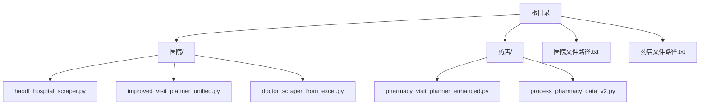
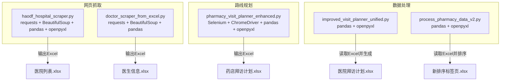
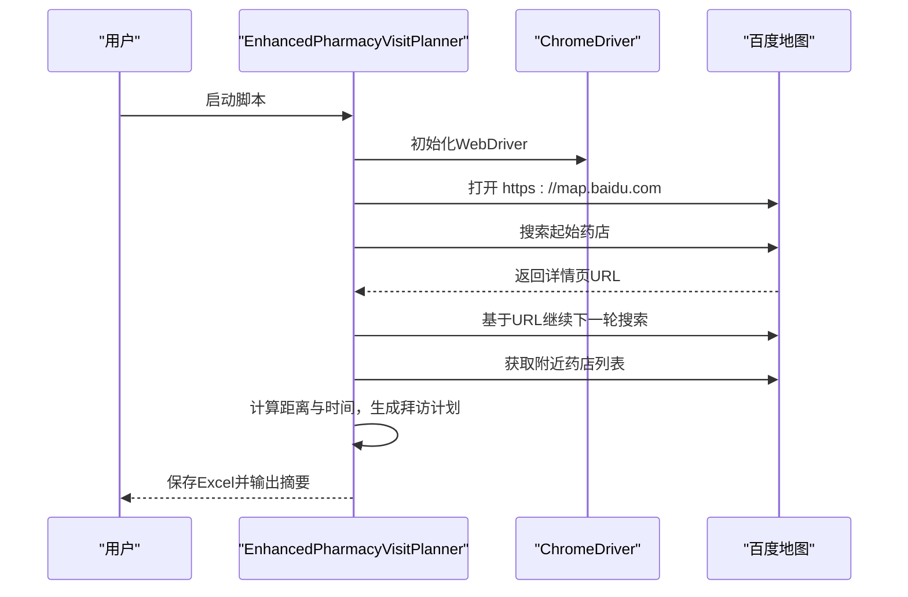
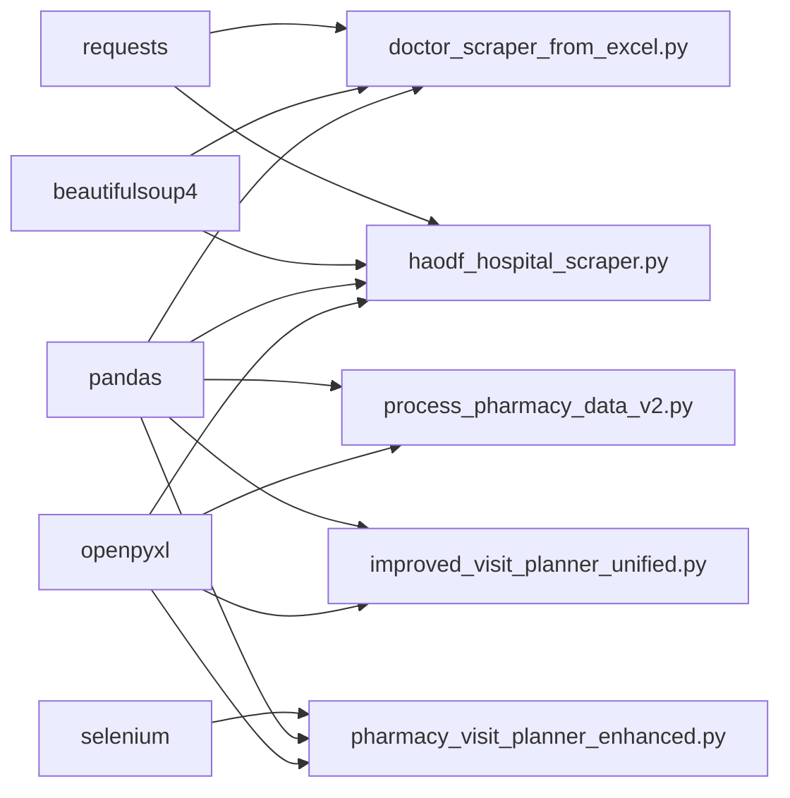

# 安装与配置

<cite>
**本文引用的文件**
- [医院/haodf_hospital_scraper.py](file://医院/haodf_hospital_scraper.py)
- [药店/pharmacy_visit_planner_enhanced.py](file://药店/pharmacy_visit_planner_enhanced.py)
- [医院/improved_visit_planner_unified.py](file://医院/improved_visit_planner_unified.py)
- [医院/doctor_scraper_from_excel.py](file://医院/doctor_scraper_from_excel.py)
- [药店/process_pharmacy_data_v2.py](file://药店/process_pharmacy_data_v2.py)
- [医院文件路径.txt](file://医院文件路径.txt)
- [药店文件路径.txt](file://药店文件路径.txt)
- [脚本文件备份工具.py](file://脚本文件备份工具.py)
- [.gitignore](file://.gitignore)
</cite>

## 目录
1. [简介](#简介)
2. [项目结构](#项目结构)
3. [核心组件](#核心组件)
4. [架构总览](#架构总览)
5. [详细组件分析](#详细组件分析)
6. [依赖关系分析](#依赖关系分析)
7. [性能注意事项](#性能注意事项)
8. [故障排查指南](#故障排查指南)
9. [结论](#结论)
10. [附录](#附录)

## 简介
本章节面向首次使用者，提供从零开始的本地环境搭建与运行前配置指南。内容覆盖：
- Python 版本要求与虚拟环境建议
- 必要依赖库安装（pandas、openpyxl、requests、beautifulsoup4、selenium、opencv-python 等）
- 浏览器驱动（ChromeDriver）安装与配置，确保网页抓取脚本正常运行
- 医院与药店数据源文件路径配置方法（含 Excel 表结构要求）
- visitor_config 字典参数设置示例（拜访时长、午休时间、每日拜访数量范围等）
- 相对路径与绝对路径处理策略，确保脚本能正确读取输入并写入输出
- 常见环境错误排查与解决方案

## 项目结构
仓库采用按“业务域”组织的文件布局，主要分为“医院”和“药店”两大子目录，分别存放对应的抓取、规划与数据处理脚本；根目录提供两类数据源路径清单文件，便于统一管理。

图表来源
- [医院/haodf_hospital_scraper.py](file://医院/haodf_hospital_scraper.py#L1-L183)
- [药店/pharmacy_visit_planner_enhanced.py](file://药店/pharmacy_visit_planner_enhanced.py#L1-L555)
- [医院/improved_visit_planner_unified.py](file://医院/improved_visit_planner_unified.py#L1-L639)
- [医院/doctor_scraper_from_excel.py](file://医院/doctor_scraper_from_excel.py#L1-L310)
- [药店/process_pharmacy_data_v2.py](file://药店/process_pharmacy_data_v2.py#L1-L173)
- [医院文件路径.txt](file://医院文件路径.txt#L1-L54)
- [药店文件路径.txt](file://药店文件路径.txt#L1-L30)

章节来源
- [医院文件路径.txt](file://医院文件路径.txt#L1-L54)
- [药店文件路径.txt](file://药店文件路径.txt#L1-L30)

## 核心组件
- 网页抓取与数据导出
  - 医院抓取：基于 requests + BeautifulSoup，输出 Excel（pandas + openpyxl）
  - 药店抓取：基于 Selenium 控制 Chrome，抓取百度地图附近药店并生成 Excel
- 拜访计划生成
  - 医院：基于 Excel 数据，按工作日、科室、医生等维度生成拜访时间线
  - 药店：基于 Selenium 获取药店详情 URL，结合距离与时间规则生成拜访计划
- 数据处理与排序
  - 药店数据按区域、区域编号、区域内顺序等规则重新排序并写回 Excel

章节来源
- [医院/haodf_hospital_scraper.py](file://医院/haodf_hospital_scraper.py#L1-L183)
- [药店/pharmacy_visit_planner_enhanced.py](file://药店/pharmacy_visit_planner_enhanced.py#L1-L555)
- [医院/improved_visit_planner_unified.py](file://医院/improved_visit_planner_unified.py#L1-L639)
- [药店/process_pharmacy_data_v2.py](file://药店/process_pharmacy_data_v2.py#L1-L173)

## 架构总览
下图展示了两类任务的典型运行流程：网页抓取与 Excel 输出、基于 Selenium 的药店路线规划、以及基于 Excel 的拜访计划生成。

图表来源
- [医院/haodf_hospital_scraper.py](file://医院/haodf_hospital_scraper.py#L1-L183)
- [药店/pharmacy_visit_planner_enhanced.py](file://药店/pharmacy_visit_planner_enhanced.py#L1-L555)
- [医院/improved_visit_planner_unified.py](file://医院/improved_visit_planner_unified.py#L1-L639)
- [药店/process_pharmacy_data_v2.py](file://药店/process_pharmacy_data_v2.py#L1-L173)

## 详细组件分析

### Python 环境与依赖安装
- Python 版本建议
  - 建议使用 Python 3.8 及以上版本，以兼容 pandas、openpyxl、selenium 等现代库
- 依赖库安装
  - 基础网络与数据处理：requests、beautifulsoup4、pandas、openpyxl
  - 自动化浏览器：selenium
  - 图像处理（如相关脚本需要）：opencv-python
  - 可选：chinesecalendar（用于节假日判断，非必需）

安装命令示例（建议在虚拟环境中执行）：
- pip install requests beautifulsoup4 pandas openpyxl selenium opencv-python

章节来源
- [医院/haodf_hospital_scraper.py](file://医院/haodf_hospital_scraper.py#L1-L183)
- [药店/pharmacy_visit_planner_enhanced.py](file://药店/pharmacy_visit_planner_enhanced.py#L1-L555)
- [医院/improved_visit_planner_unified.py](file://医院/improved_visit_planner_unified.py#L1-L639)

### 浏览器驱动（ChromeDriver）配置
- 适用场景
  - 药店抓取脚本使用 Selenium 控制 Chrome，需正确安装与配置 ChromeDriver
- 安装步骤
  - 下载与当前 Chrome 浏览器版本匹配的 ChromeDriver
  - 将 ChromeDriver 放入系统 PATH 或在脚本中显式指定其路径
  - 确认 Chrome 与 ChromeDriver 版本兼容
- 运行验证
  - 脚本启动时会尝试初始化 WebDriver，若失败会抛出异常并提示
  - 若遇到驱动不可用，请检查版本匹配与 PATH 配置

章节来源
- [药店/pharmacy_visit_planner_enhanced.py](file://药店/pharmacy_visit_planner_enhanced.py#L1-L555)

### 数据源文件路径配置
- 医院数据源
  - Excel 文件路径：脚本中通过配置变量指定（例如 doctor_scraper_from_excel.py 中的 EXCEL_FILE_PATH）
  - 表结构要求（示例，以 doctor_scraper_from_excel.py 为例）
    - 必须包含目标工作表（例如“医院科室筛选后 其他”）
    - 列名示例：医院名称、所属城市、医院等级、科室名称、科室链接、医生数量
    - 读取逻辑会基于这些列提取数据并抓取医生信息
- 药店数据源
  - Excel 文件路径：process_pharmacy_data_v2.py 中通过 FILE_PATH 指定
  - 表结构要求（示例，以 process_pharmacy_data_v2.py 为例）
    - 工作表名称：SHEET_NAME（例如“拜访时间安排-删减”）
    - 列名示例：区域编号、区域、区域内顺序、名称等
    - 脚本会按区域a计数、区域a优先级、区域编号、区域内顺序等规则进行排序
- 路径文件清单
  - 医院文件路径.txt：列出与医院相关的脚本路径
  - 药店文件路径.txt：列出与药店相关的脚本路径
  - 脚本文件备份工具.py：可从注释或文本文件中解析路径，支持带引号与不带引号的路径格式

章节来源
- [医院/doctor_scraper_from_excel.py](file://医院/doctor_scraper_from_excel.py#L1-L310)
- [药店/process_pharmacy_data_v2.py](file://药店/process_pharmacy_data_v2.py#L1-L173)
- [医院文件路径.txt](file://医院文件路径.txt#L1-L54)
- [药店文件路径.txt](file://药店文件路径.txt#L1-L30)
- [脚本文件备份工具.py](file://脚本文件备份工具.py#L20-L166)

### visitor_config 参数设置示例（医院拜访计划）
- 关键参数
  - 拜访人员名称：visitor_name
  - 目标医院列表：target_hospitals
  - 每日拜访数量范围：DAILY_VISITS_RANGE（例如 (13, 16)）
  - 目标总拜访次数：TARGET_VISITS（例如 400）
  - 输入/输出 Excel 路径：EXCEL_FILE、OUTPUT_FILE
  - 时间范围：START_YEAR_MONTH、END_YEAR_MONTH
- 示例配置
  - 人员配置字典 CONFIG 中包含多个人员的 visitor_name 与 target_hospitals
  - VISITOR_CONFIG 指定当前使用的人员键名（如“何勇”或“张丹凤”）
  - DAILY_VISITS_RANGE 指定每日拜访条数范围
  - EXCEL_FILE 指向已准备好的医生列表 Excel
  - OUTPUT_FILE 指向输出的拜访计划 Excel

章节来源
- [医院/improved_visit_planner_unified.py](file://医院/improved_visit_planner_unified.py#L590-L639)

### 相对路径与绝对路径处理
- 绝对路径
  - 多数脚本直接使用绝对路径（如 EXCEL_FILE、FILE_PATH），确保跨目录运行时仍可定位文件
- 相对路径
  - 若希望使用相对路径，可在脚本中将路径转换为绝对路径（例如使用 os.path.abspath）
  - 保持与项目根目录一致的相对关系，避免硬编码绝对路径导致迁移不便
- 输出路径
  - 输出文件通常写入输入文件所在目录或指定输出目录，确保权限与磁盘空间充足

章节来源
- [医院/doctor_scraper_from_excel.py](file://医院/doctor_scraper_from_excel.py#L20-L30)
- [药店/process_pharmacy_data_v2.py](file://药店/process_pharmacy_data_v2.py#L16-L20)
- [医院/improved_visit_planner_unified.py](file://医院/improved_visit_planner_unified.py#L600-L605)

### 运行流程示意（以 Selenium 药店规划为例）

图表来源
- [药店/pharmacy_visit_planner_enhanced.py](file://药店/pharmacy_visit_planner_enhanced.py#L1-L555)

## 依赖关系分析
- 库依赖
  - requests + beautifulsoup4：网页抓取与解析
  - pandas + openpyxl：Excel 读写与格式化
  - selenium：自动化浏览器控制
  - 可选 chinesecalendar：节假日判断
- 脚本耦合
  - 医院抓取脚本与 Excel 表结构强相关（列名与工作表名称）
  - 药店规划脚本依赖 ChromeDriver 与百度地图 DOM 结构
  - 拜访计划生成脚本依赖 Excel 输入与节假日配置

图表来源
- [医院/haodf_hospital_scraper.py](file://医院/haodf_hospital_scraper.py#L1-L183)
- [药店/pharmacy_visit_planner_enhanced.py](file://药店/pharmacy_visit_planner_enhanced.py#L1-L555)
- [医院/improved_visit_planner_unified.py](file://医院/improved_visit_planner_unified.py#L1-L639)
- [药店/process_pharmacy_data_v2.py](file://药店/process_pharmacy_data_v2.py#L1-L173)
- [医院/doctor_scraper_from_excel.py](file://医院/doctor_scraper_from_excel.py#L1-L310)

## 性能注意事项
- 请求频率控制
  - 网页抓取应设置合理的延时与指数退避，避免触发反爬机制
- Excel 处理
  - 大规模数据建议分批处理，避免一次性加载过多行导致内存压力
- 浏览器资源
  - Selenium 驱动占用内存较高，建议在任务完成后及时关闭浏览器实例

## 故障排查指南
- 模块未找到（ImportError）
  - 症状：提示缺少 pandas、openpyxl、selenium 等模块
  - 处理：确认已在当前 Python 环境安装上述依赖；若使用虚拟环境，确保已激活
- ChromeDriver 不可用
  - 症状：Selenium 初始化失败或弹出驱动错误
  - 处理：下载与 Chrome 版本匹配的 ChromeDriver，并将其加入系统 PATH 或在脚本中显式指定路径
- Excel 读取失败
  - 症状：提示找不到工作表或列名不匹配
  - 处理：核对 Excel 工作表名称与列名；确保文件路径正确且可读
- 路径问题
  - 症状：脚本报错找不到输入文件或无法写入输出
  - 处理：使用绝对路径或在脚本中将相对路径转换为绝对路径；检查目录权限与磁盘空间
- Selenium 页面元素定位失败
  - 症状：等待元素超时或找不到特定元素
  - 处理：检查百度地图 DOM 是否变化；适当增加等待时间或调整选择器

章节来源
- [药店/pharmacy_visit_planner_enhanced.py](file://药店/pharmacy_visit_planner_enhanced.py#L1-L555)
- [医院/doctor_scraper_from_excel.py](file://医院/doctor_scraper_from_excel.py#L1-L310)
- [药店/process_pharmacy_data_v2.py](file://药店/process_pharmacy_data_v2.py#L1-L173)

## 结论
通过本指南，您可以在本地完成 Python 环境与依赖安装、浏览器驱动配置，并正确设置医院与药店的数据源路径。按照 visitor_config 的参数示例进行配置后，即可运行网页抓取与拜访计划生成脚本，获得结构化的 Excel 输出。遇到常见问题时，可依据故障排查指南快速定位并解决问题。

## 附录
- 常用安装命令（示例）
  - pip install requests beautifulsoup4 pandas openpyxl selenium opencv-python
- 路径配置要点
  - 优先使用绝对路径，确保跨目录运行稳定
  - 输出文件写入输入文件所在目录或指定输出目录
- 路径文件清单
  - 医院文件路径.txt：列出与医院相关的脚本路径
  - 药店文件路径.txt：列出与药店相关的脚本路径
  - 脚本文件备份工具.py：支持从注释或文本文件中解析路径

章节来源
- [医院文件路径.txt](file://医院文件路径.txt#L1-L54)
- [药店文件路径.txt](file://药店文件路径.txt#L1-L30)
- [脚本文件备份工具.py](file://脚本文件备份工具.py#L20-L166)
- [.gitignore](file://.gitignore#L1-L131)