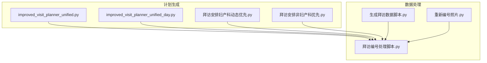
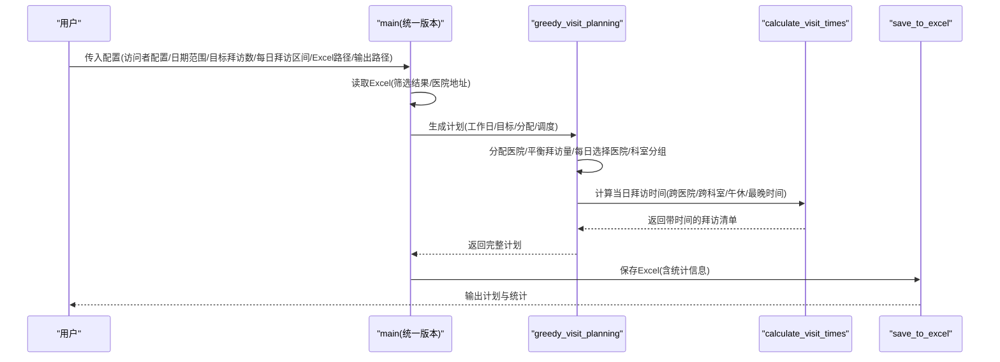
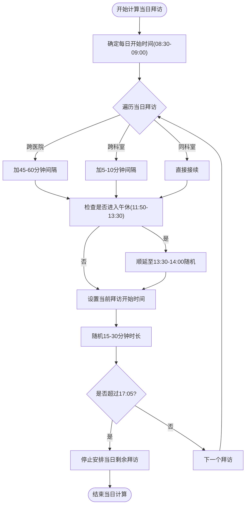
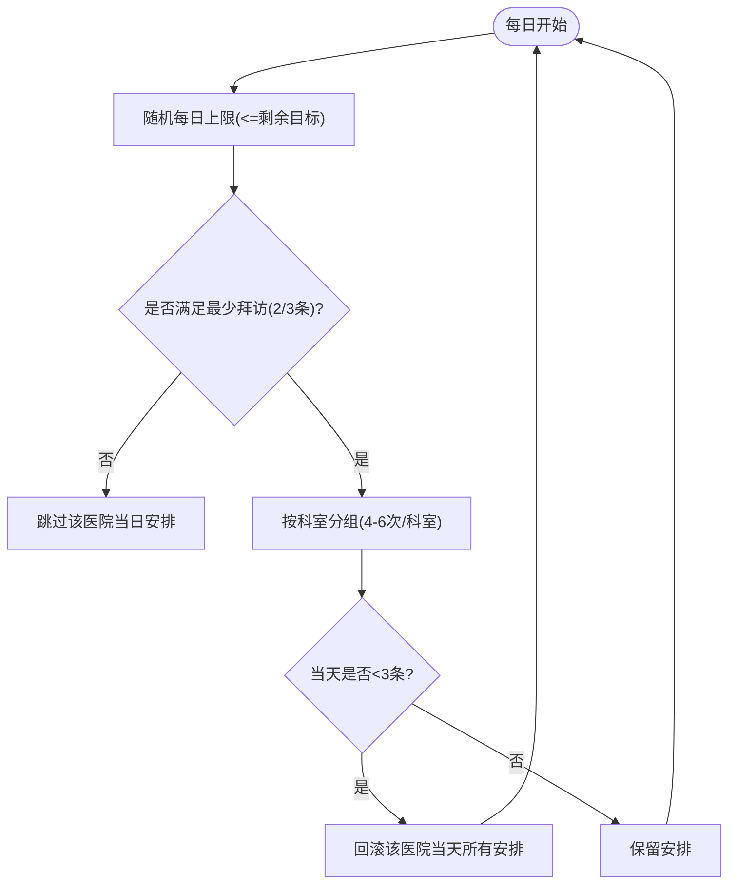
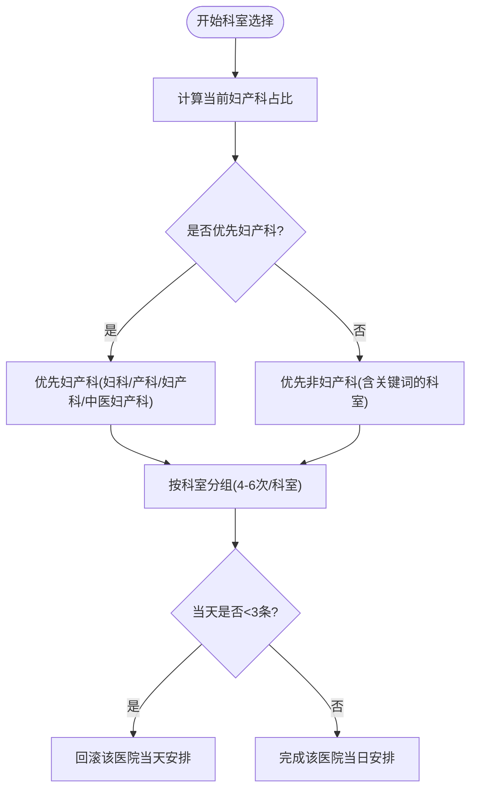
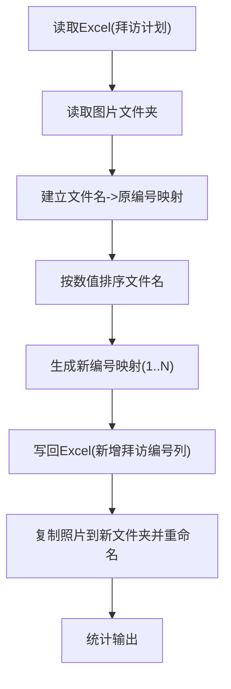
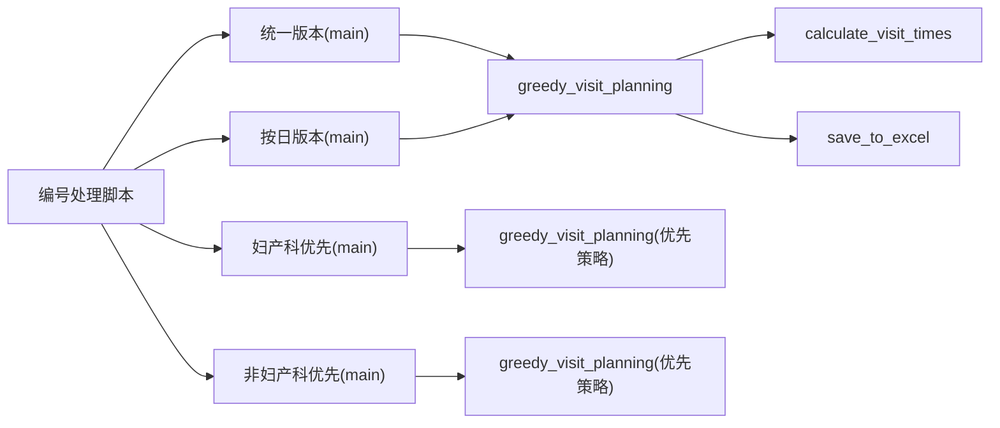

# 医院拜访计划生成

<cite>
**本文引用的文件**
- [improved_visit_planner_unified.py](file://医院/improved_visit_planner_unified.py)
- [improved_visit_planner_unified_day.py](file://医院/improved_visit_planner_unified_day.py)
- [拜访安排妇产科动态优先.py](file://医院/拜访安排妇产科动态优先.py)
- [拜访安排非妇产科优先.py](file://医院/拜访安排非妇产科优先.py)
- [拜访编号处理脚本.py](file://医院/拜访编号处理脚本.py)
- [生成拜访数据脚本.py](file://医院/生成拜访数据脚本.py)
- [重新编号照片.py](file://医院/重新编号照片.py)
</cite>

## 目录
1. [简介](#简介)
2. [项目结构](#项目结构)
3. [核心组件](#核心组件)
4. [架构总览](#架构总览)
5. [详细组件分析](#详细组件分析)
6. [依赖分析](#依赖分析)
7. [性能考量](#性能考量)
8. [故障排查指南](#故障排查指南)
9. [结论](#结论)
10. [附录](#附录)

## 简介
本文件面向“医院拜访计划生成系统”的实现机制，围绕统一版本的主程序与配套脚本展开，重点解释以下内容：
- main 函数的参数设计与业务含义（如 visitor_config、日期范围、目标拜访次数等）
- 时间调度算法如何综合考虑工作日、法定节假日、午休时段等因素进行智能排班
- 支持按科室类型动态调整优先级（妇产科优先与非妇产科优先策略）
- 每日拜访数量区间（daily_visits_range）的弹性控制机制
- 拜访编号处理脚本如何保障编号连续性和唯一性
- 从输入配置到输出拜访日程表的完整流程，并解读输出结果中的时间分配逻辑与优先级排序规则

## 项目结构
系统由多个脚本组成，分别负责数据读取、计划生成、时间调度、优先级策略、编号处理与数据整理等职责。核心文件如下：
- 统一计划生成器：improved_visit_planner_unified.py
- 按日计划生成器：improved_visit_planner_unified_day.py
- 妇产科优先策略：拜访安排妇产科动态优先.py
- 非妇产科优先策略：拜访安排非妇产科优先.py
- 拜访编号处理：拜访编号处理脚本.py
- 数据整理与编号：生成拜访数据脚本.py、重新编号照片.py

图表来源
- [improved_visit_planner_unified.py](file://医院/improved_visit_planner_unified.py#L514-L639)
- [improved_visit_planner_unified_day.py](file://医院/improved_visit_planner_unified_day.py#L534-L653)
- [拜访安排妇产科动态优先.py](file://医院/拜访安排妇产科动态优先.py#L668-L793)
- [拜访安排非妇产科优先.py](file://医院/拜访安排非妇产科优先.py#L582-L725)
- [拜访编号处理脚本.py](file://医院/拜访编号处理脚本.py#L1-L157)
- [生成拜访数据脚本.py](file://医院/生成拜访数据脚本.py#L1-L127)
- [重新编号照片.py](file://医院/重新编号照片.py#L1-L108)

章节来源
- [improved_visit_planner_unified.py](file://医院/improved_visit_planner_unified.py#L514-L639)
- [improved_visit_planner_unified_day.py](file://医院/improved_visit_planner_unified_day.py#L534-L653)
- [拜访安排妇产科动态优先.py](file://医院/拜访安排妇产科动态优先.py#L668-L793)
- [拜访安排非妇产科优先.py](file://医院/拜访安排非妇产科优先.py#L582-L725)
- [拜访编号处理脚本.py](file://医院/拜访编号处理脚本.py#L1-L157)
- [生成拜访数据脚本.py](file://医院/生成拜访数据脚本.py#L1-L127)
- [重新编号照片.py](file://医院/重新编号照片.py#L1-L108)

## 核心组件
- 计划生成器（统一版本）：负责读取Excel数据、过滤目标医院、生成工作日历、执行贪心分配与时间调度、输出Excel结果。
- 计划生成器（按日版本）：与统一版本类似，但日期范围以具体起止日期传入。
- 妇产科优先策略：在科室层面动态调整优先级，确保妇产科占比不低于一定阈值。
- 非妇产科优先策略：在科室层面优先安排高价值或高优先级科室，妇产科放在最后。
- 编号处理脚本：将图片文件与Excel中的拜访记录关联，按数值排序重新编号，并写回Excel。
- 数据整理脚本：将计划表转换为业务侧“拜访数据”格式，便于后续录入与归档。

章节来源
- [improved_visit_planner_unified.py](file://医院/improved_visit_planner_unified.py#L514-L639)
- [improved_visit_planner_unified_day.py](file://医院/improved_visit_planner_unified_day.py#L534-L653)
- [拜访安排妇产科动态优先.py](file://医院/拜访安排妇产科动态优先.py#L668-L793)
- [拜访安排非妇产科优先.py](file://医院/拜访安排非妇产科优先.py#L582-L725)
- [拜访编号处理脚本.py](file://医院/拜访编号处理脚本.py#L1-L157)
- [生成拜访数据脚本.py](file://医院/生成拜访数据脚本.py#L1-L127)

## 架构总览
系统采用“配置驱动 + 贪心调度 + 时间约束 + 优先级策略”的整体架构。统一版本通过main函数接收配置参数，内部调用工作日计算、数据读取、分配与调度、时间计算、结果保存等模块；按日版本提供更灵活的日期范围；优先级策略脚本在科室层面对妇产科或非妇产科进行差异化处理；编号处理脚本贯穿计划生成与照片管理的闭环。

图表来源
- [improved_visit_planner_unified.py](file://医院/improved_visit_planner_unified.py#L514-L639)
- [improved_visit_planner_unified.py](file://医院/improved_visit_planner_unified.py#L276-L468)
- [improved_visit_planner_unified.py](file://医院/improved_visit_planner_unified.py#L470-L499)

章节来源
- [improved_visit_planner_unified.py](file://医院/improved_visit_planner_unified.py#L514-L639)
- [improved_visit_planner_unified.py](file://医院/improved_visit_planner_unified.py#L276-L468)
- [improved_visit_planner_unified.py](file://医院/improved_visit_planner_unified.py#L470-L499)

## 详细组件分析

### 统一版本 main 函数参数设计与业务含义
- visitor_config：访问者配置键，用于从全局 CONFIG 中选择具体人员与其目标医院集合。
- daily_visits_range：每日拜访数量区间，作为每日上限的随机下限，确保计划弹性与工作负荷平衡。
- excel_file：输入Excel路径，包含“导出筛选结果”和“医院地址”两个工作表。
- output_file：输出Excel路径，包含“拜访计划”和“统计信息”两个工作表。
- start_year_month / end_year_month：以年-月形式定义计划周期，程序内部推导当月最后一天。
- target_visits：总拜访目标，系统会在达到目标或全部医生被安排后停止。

业务要点
- 仅支持单人配置（统一版本），若需多人，可参考按日版本或优先级策略脚本的多人员模式。
- 目标医院集合由 CONFIG 中的 target_hospitals 决定，程序会过滤Excel数据仅保留这些医院的医生。
- 工作日由 is_workday 与 get_working_days 统一判定，排除周日与法定节假日。

章节来源
- [improved_visit_planner_unified.py](file://医院/improved_visit_planner_unified.py#L514-L639)
- [improved_visit_planner_unified.py](file://医院/improved_visit_planner_unified.py#L23-L67)
- [improved_visit_planner_unified.py](file://医院/improved_visit_planner_unified.py#L69-L79)

### 时间调度算法与午休/跨医院/跨科室约束
- 每日开始时间：随机落在 08:30-09:00 之间，避免过早影响医生工作节奏。
- 跨医院间隔：45-60分钟，考虑交通与准备时间。
- 跨科室间隔：5-10分钟，尽量在同一科室连续拜访。
- 午休约束：若当前时间进入 11:50-13:30，自动顺延至 13:30-14:00 之间的随机时间，保证不打断医生午休。
- 最晚开始时间：超过 17:05 的开始时间将不再安排本次拜访，避免超时。
- 拜访时长：15-30分钟固定随机区间，便于与间隔时间协调。

图表来源
- [improved_visit_planner_unified.py](file://医院/improved_visit_planner_unified.py#L183-L243)

章节来源
- [improved_visit_planner_unified.py](file://医院/improved_visit_planner_unified.py#L183-L243)

### 每日拜访数量区间（daily_visits_range）弹性控制机制
- 每日拜访量：从 daily_visits_range 的随机下限出发，同时受“剩余目标”限制，避免超额。
- 医院最少拜访条数：在剩余医生较少或接近目标完成时，放宽为至少 2 条；否则为 3 条，防止“空医院”导致浪费。
- 科室每日上限：每个科室每天最多 4-6 次，避免过度集中。
- 后置验证：若某医院当天安排不足 3 条，系统会回滚该医院当天所有安排，确保每家医院至少有合理数量的拜访。

图表来源
- [improved_visit_planner_unified.py](file://医院/improved_visit_planner_unified.py#L311-L385)
- [improved_visit_planner_un Unified.py](file://医院/improved_visit_planner_unified.py#L394-L410)
- [improved_visit_planner_unified.py](file://医院/improved_visit_planner_unified.py#L520-L537)

章节来源
- [improved_visit_planner_unified.py](file://医院/improved_visit_planner_unified.py#L311-L385)
- [improved_visit_planner_unified.py](file://医院/improved_visit_planner_unified.py#L394-L410)
- [improved_visit_planner_unified.py](file://医院/improved_visit_planner_unified.py#L520-L537)

### 科室优先级策略（妇产科优先 vs 非妇产科优先）
- 妇产科优先策略：
  - 通过动态比率控制，若妇产科占比低于阈值（如 20%），优先安排妇产科；否则优先非妇产科。
  - 若最后一批安排导致妇产科占比过高，系统会回滚并替换为非妇产科，确保整体比例合理。
- 非妇产科优先策略：
  - 将包含“呼吸、肺、泌尿、儿科、肾、中医、全科”等关键词的科室优先安排，妇产科放在最后。
  - 保持每家医院当天至少 3 条拜访的后置验证。

图表来源
- [拜访安排妇产科动态优先.py](file://医院/拜访安排妇产科动态优先.py#L420-L520)
- [拜访安排非妇产科优先.py](file://医院/拜访安排非妇产科优先.py#L415-L520)

章节来源
- [拜访安排妇产科动态优先.py](file://医院/拜访安排妇产科动态优先.py#L420-L520)
- [拜访安排非妇产科优先.py](file://医院/拜访安排非妇产科优先.py#L415-L520)

### 拜访编号处理脚本：连续性与唯一性保障
- 关联机制：读取Excel“拜访计划”表，建立文件名与原拜访编号的对应关系。
- 排序与映射：按数值提取文件名并排序，生成新编号映射（从1开始）。
- 写回Excel：在“拜访计划”表中新增“拜访编号”列，覆盖原序号。
- 照片重命名：复制原照片到新文件夹，按新编号重命名，确保编号连续且唯一。
- 统计信息：输出总行数、已分配编号行数、未分配编号行数、复制文件数。

图表来源
- [拜访编号处理脚本.py](file://医院/拜访编号处理脚本.py#L1-L157)

章节来源
- [拜访编号处理脚本.py](file://医院/拜访编号处理脚本.py#L1-L157)

### 数据整理与编号（生成拜访数据脚本、重新编号照片）
- 生成拜访数据脚本：将统一版本生成的“拜访计划”转换为业务侧“拜访数据”，包括终端名称、地址、日期、时间、科室、对象、人员、目的及效果、客户反馈等字段。
- 重新编号照片：按照片名称排序后重新编号，更新Excel中的新拜访编号列，并复制照片到目标目录。

章节来源
- [生成拜访数据脚本.py](file://医院/生成拜访数据脚本.py#L1-L127)
- [重新编号照片.py](file://医院/重新编号照片.py#L1-L108)

## 依赖分析
- 统一版本与按日版本共享核心调度逻辑，差异在于日期范围输入方式与部分配置键名。
- 妇产科优先与非妇产科优先脚本在科室分组与优先级策略上存在显著差异，但均遵循相同的“最少拜访条数 + 科室上限 + 后置验证”的约束。
- 编号处理脚本独立于计划生成，但与“拜访计划”表强耦合，确保编号一致性。

图表来源
- [improved_visit_planner_unified.py](file://医院/improved_visit_planner_unified.py#L514-L639)
- [improved_visit_planner_unified_day.py](file://医院/improved_visit_planner_unified_day.py#L534-L653)
- [拜访安排妇产科动态优先.py](file://医院/拜访安排妇产科动态优先.py#L668-L793)
- [拜访安排非妇产科优先.py](file://医院/拜访安排非妇产科优先.py#L582-L725)
- [拜访编号处理脚本.py](file://医院/拜访编号处理脚本.py#L1-L157)

章节来源
- [improved_visit_planner_unified.py](file://医院/improved_visit_planner_unified.py#L514-L639)
- [improved_visit_planner_unified_day.py](file://医院/improved_visit_planner_unified_day.py#L534-L653)
- [拜访安排妇产科动态优先.py](file://医院/拜访安排妇产科动态优先.py#L668-L793)
- [拜访安排非妇产科优先.py](file://医院/拜访安排非妇产科优先.py#L582-L725)
- [拜访编号处理脚本.py](file://医院/拜访编号处理脚本.py#L1-L157)

## 性能考量
- 数据过滤与分组：按医院与科室分组操作在大数据量下可能成为瓶颈，建议在输入数据规模较大时提前做索引优化与分片处理。
- 随机化与回滚：每日随机下限与回滚机制可能导致多次迭代，建议在极端场景下适当放宽最少拜访条数或增加日志提示。
- I/O 操作：Excel读写与照片复制为 I/O 密集型，建议批量写入与并发复制（注意文件锁与幂等性）。

## 故障排查指南
- Excel读取失败：检查“导出筛选结果”和“医院地址”工作表是否存在，列名是否正确。
- 日期范围异常：统一版本使用年-月，按日版本使用具体日期；确保输入格式与边界处理一致。
- 节假日包缺失：若未安装节假日包，系统会降级为简化节假日处理，建议安装以获得准确节假日判断。
- 编号不连续：检查编号处理脚本是否正确匹配文件名与原编号，以及排序规则是否按数值提取。

章节来源
- [improved_visit_planner_unified.py](file://医院/improved_visit_planner_unified.py#L81-L99)
- [improved_visit_planner_unified.py](file://医院/improved_visit_planner_unified.py#L12-L20)
- [improved_visit_planner_unified.py](file://医院/improved_visit_planner_unified.py#L500-L513)
- [improved_visit_planner_unified_day.py](file://医院/improved_visit_planner_unified_day.py#L81-L99)
- [improved_visit_planner_unified_day.py](file://医院/improved_visit_planner_unified_day.py#L12-L20)
- [improved_visit_planner_unified_day.py](file://医院/improved_visit_planner_unified_day.py#L520-L533)
- [拜访编号处理脚本.py](file://医院/拜访编号处理脚本.py#L23-L50)

## 结论
本系统通过“配置驱动 + 贪心调度 + 时间约束 + 优先级策略 + 编号闭环”的设计，实现了高效、灵活且可追溯的医院拜访计划生成。统一版本适合单人、按月周期的计划生成；按日版本适合短期、精确日期范围的计划；妇产科与非妇产科优先策略满足不同业务目标；编号处理脚本确保计划与照片管理的一致性。建议在大规模数据场景下关注 I/O 与分组性能，并在节假日与午休等约束上保持配置一致性。

## 附录
- 实际调用示例（以统一版本为例）：
  - 输入：visitor_config（如“何勇”）、daily_visits_range（如 13-16）、excel_file、output_file、start_year_month、end_year_month、target_visits（如 400）
  - 输出：包含“拜访计划”和“统计信息”的Excel文件，统计总拜访次数、涉及医院数量、涉及医生数量等
- 时间分配逻辑解读：
  - 每日开始时间随机，跨医院/跨科室间隔不同，午休强制顺延，最晚开始时间限制，确保合理的工作节奏与医生体验
- 优先级排序规则：
  - 妇产科优先策略：动态控制占比，必要时回滚替换
  - 非妇产科优先策略：关键词优先，妇产科最后

章节来源
- [improved_visit_planner_unified.py](file://医院/improved_visit_planner_unified.py#L514-L639)
- [improved_visit_planner_unified.py](file://医院/improved_visit_planner_unified.py#L183-L243)
- [improved_visit_planner_unified.py](file://医院/improved_visit_planner_unified.py#L470-L499)
- [improved_visit_planner_unified.py](file://医院/improved_visit_planner_unified.py#L572-L589)