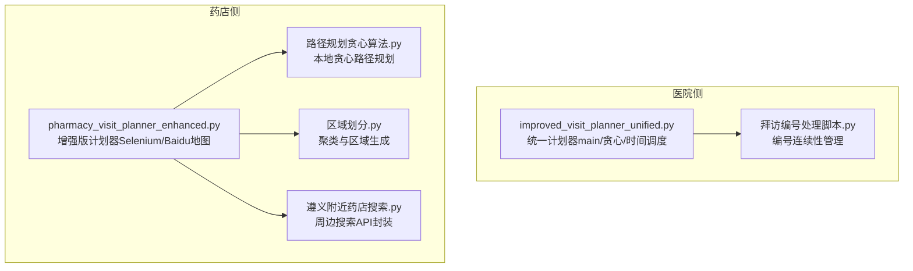
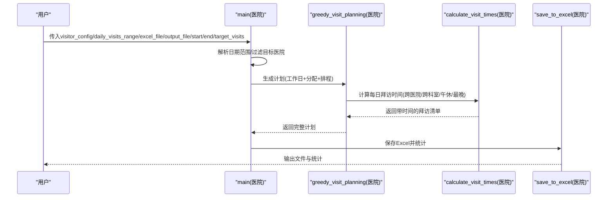
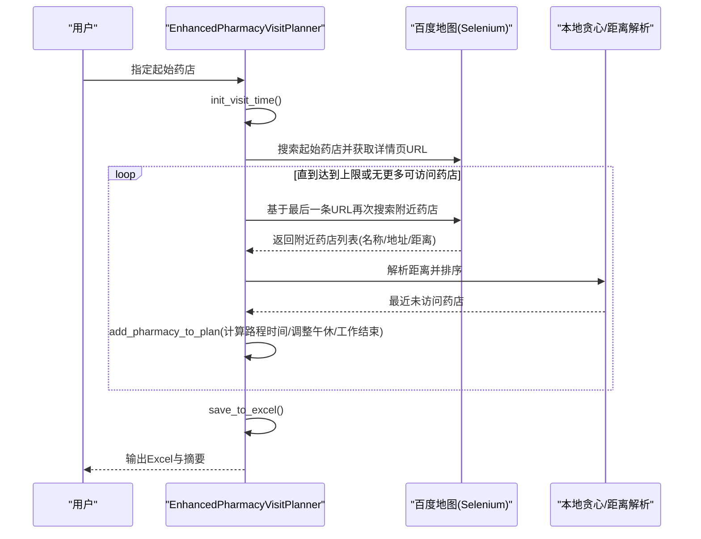
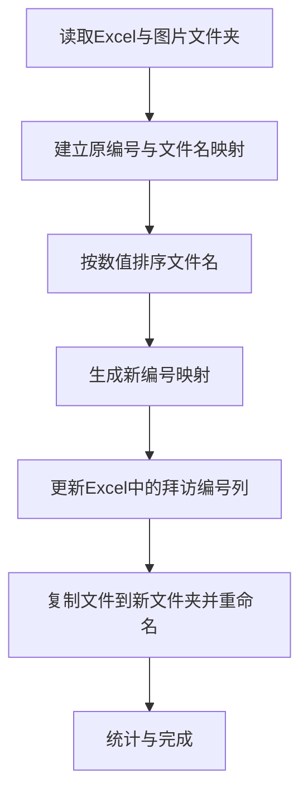
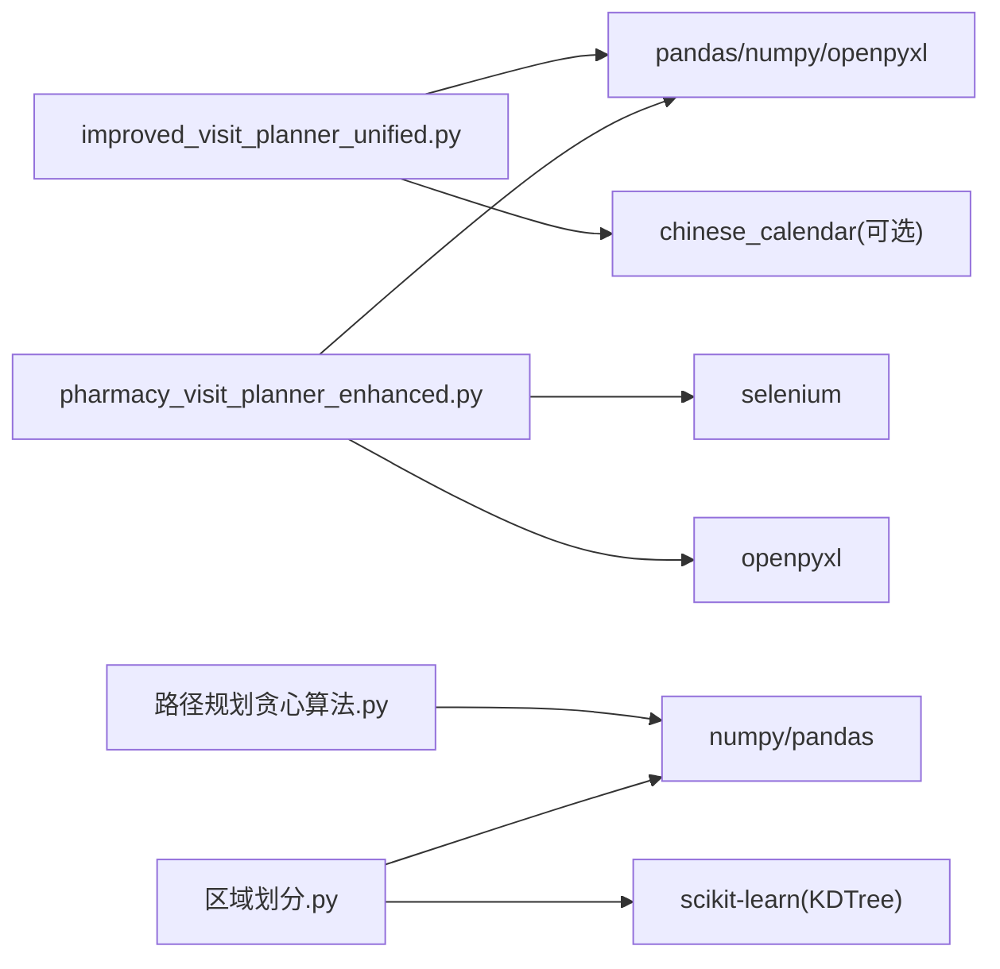

# 拜访计划生成

<cite>
**本文引用的文件**
- [improved_visit_planner_unified.py](file://医院/improved_visit_planner_unified.py)
- [pharmacy_visit_planner_enhanced.py](file://药店/pharmacy_visit_planner_enhanced.py)
- [路径规划贪心算法.py](file://药店/路径规划贪心算法.py)
- [拜访编号处理脚本.py](file://医院/拜访编号处理脚本.py)
- [区域划分.py](file://药店/区域划分.py)
- [遵义附近药店搜索.py](file://药店/遵义附近药店搜索.py)
</cite>

## 目录
1. [简介](#简介)
2. [项目结构](#项目结构)
3. [核心组件](#核心组件)
4. [架构总览](#架构总览)
5. [详细组件分析](#详细组件分析)
6. [依赖关系分析](#依赖关系分析)
7. [性能考量](#性能考量)
8. [故障排查指南](#故障排查指南)
9. [结论](#结论)
10. [附录](#附录)

## 简介
本文件面向“医院与药店拜访计划生成系统”，围绕以下目标展开：
- 深入讲解医院与药店两类拜访计划的生成机制与差异
- 解释时间调度算法如何考虑工作日、节假日、午休时段等因素进行智能排班
- 对比医院与药店拜访逻辑差异：医院侧重科室与医生优先级排序；药店强调地理位置路径优化（结合路径规划贪心算法）
- 展示药店端基于起始药店搜索、距离计算与行程时间预估的路径规划流程
- 说明如何通过调整 daily_visits_range 参数控制每日工作量，以及如何利用“拜访编号处理脚本”实现编号连续性管理
- 提供实际调用示例与输出结果解读，帮助用户理解计划表的生成逻辑

## 项目结构
系统由“医院侧”和“药店侧”两条主线构成：
- 医院侧：基于统一的改进型计划器，读取Excel数据，按科室/医生维度进行分配与时间排程
- 药店侧：基于增强版计划器，结合百度地图API与本地贪心算法，实现就近路径规划与时间预估

图表来源
- [improved_visit_planner_unified.py](file://医院/improved_visit_planner_unified.py#L514-L639)
- [pharmacy_visit_planner_enhanced.py](file://药店/pharmacy_visit_planner_enhanced.py#L1-L120)
- [路径规划贪心算法.py](file://药店/路径规划贪心算法.py#L1-L65)
- [区域划分.py](file://药店/区域划分.py#L1-L120)
- [遵义附近药店搜索.py](file://药店/遵义附近药店搜索.py#L1-L120)

章节来源
- [improved_visit_planner_unified.py](file://医院/improved_visit_planner_unified.py#L514-L639)
- [pharmacy_visit_planner_enhanced.py](file://药店/pharmacy_visit_planner_enhanced.py#L1-L120)

## 核心组件
- 医院统一计划器（improved_visit_planner_unified.py）
  - 主函数 main：负责参数校验、日期范围解析、数据过滤、工作日计算、计划生成与结果保存
  - 贪心计划函数 greedy_visit_planning：按科室/医生维度进行分配与排程
  - 时间调度函数 calculate_visit_times：考虑跨医院/跨科室间隔、午休顺延、最晚开始时间等
  - 工作日判断与节假日处理：基于规则与可选第三方包
- 药店增强计划器（pharmacy_visit_planner_enhanced.py）
  - 基于 Selenium 的百度地图交互，实现起始药店定位、附近药店搜索、详情页URL抓取
  - 路径规划：按距离排序选择最近未访问药店，结合距离估算路程时间
  - 时间规划：考虑午休与工作结束时间限制
- 路径规划辅助（路径规划贪心算法.py、区域划分.py）
  - 本地贪心算法：以经纬度为特征，按最近邻逐步扩展
  - 区域划分：基于密度与阈值的聚类，提升路径规划效率
- 编号连续性管理（拜访编号处理脚本.py）
  - 将图片文件与Excel中的原编号建立映射，按数值排序后生成连续的新编号，并复制重命名文件

章节来源
- [improved_visit_planner_unified.py](file://医院/improved_visit_planner_unified.py#L1-L244)
- [pharmacy_visit_planner_enhanced.py](file://药店/pharmacy_visit_planner_enhanced.py#L1-L120)
- [路径规划贪心算法.py](file://药店/路径规划贪心算法.py#L1-L65)
- [区域划分.py](file://药店/区域划分.py#L1-L120)
- [拜访编号处理脚本.py](file://医院/拜访编号处理脚本.py#L1-L157)

## 架构总览
系统采用“数据读取—规则约束—贪心/路径规划—时间调度—结果输出”的流水线式架构。医院侧以科室/医生为粒度，药店侧以地理距离为粒度，二者在“时间调度”层面共享相似的午休与工作时间限制策略。

图表来源
- [improved_visit_planner_unified.py](file://医院/improved_visit_planner_unified.py#L514-L639)
- [improved_visit_planner_unified.py](file://医院/improved_visit_planner_unified.py#L276-L468)
- [improved_visit_planner_unified.py](file://医院/improved_visit_planner_unified.py#L470-L499)

## 详细组件分析

### 医院统一计划器（improved_visit_planner_unified.py）
- main 函数参数设计与业务含义
  - visitor_config：人员配置键，用于从 CONFIG 中选择具体人员与其目标医院集合
  - daily_visits_range：每日拜访条数范围，用于控制每日工作量波动
  - excel_file：输入Excel，包含“导出筛选结果”和“医院地址”两个工作表
  - output_file：输出Excel文件路径
  - start_year_month/end_year_month：计划覆盖的起止年月
  - target_visits：总目标拜访次数
  - 业务流程：校验配置→读取数据→过滤目标医院→计算工作日→生成计划→保存统计
- 时间调度算法
  - 每日开始时间随机落在 8:30-9:00
  - 跨医院：上一结束时间 + 45-60 分钟
  - 跨科室（同医院）：上一结束时间 + 5-10 分钟
  - 午休顺延：11:50-13:30 内的开始时间顺延至 13:30-14:00 随机
  - 最晚开始时间：超过 17:05 则终止当日后续安排
- 关键函数与职责
  - is_workday/get_working_days：工作日判定与可拜访日期集
  - assign_hospitals_to_visitors/balance_daily_visits：按医生总量差额最小化分配医院，均衡拜访量
  - select_daily_hospitals/greedy_visit_planning：每日选择医院与按科室分组的贪心选择
  - calculate_visit_times：时间计算与约束
  - save_to_excel/print_calendar_info：结果保存与日历信息打印

图表来源
- [improved_visit_planner_unified.py](file://医院/improved_visit_planner_unified.py#L514-L639)
- [improved_visit_planner_unified.py](file://医院/improved_visit_planner_unified.py#L276-L468)
- [improved_visit_planner_unified.py](file://医院/improved_visit_planner_unified.py#L183-L243)

章节来源
- [improved_visit_planner_unified.py](file://医院/improved_visit_planner_unified.py#L514-L639)
- [improved_visit_planner_unified.py](file://医院/improved_visit_planner_unified.py#L1-L244)

### 药店增强计划器（pharmacy_visit_planner_enhanced.py）
- 路径规划流程
  - 从指定起始药店出发，使用 Selenium 访问百度地图，搜索“药店”
  - 采集附近药店信息（名称、地址、距离），按距离升序排序
  - 选择最近且未访问的药店加入计划，计算路程时间并累加当前时间
  - 每次以最后一条记录的详情页URL继续下一轮搜索，提升局部连贯性
- 时间与距离策略
  - 路程时间估算：依据距离字符串解析（km/m），按不同区间采用不同速度模型
  - 午休与工作结束：12:00-13:30 午休期间顺延；18:30 结束
  - 每日最多规划 16-19 家药店，编号连续
- 数据结构与方法
  - 类 EnhancedPharmacyVisitPlanner：封装浏览器驱动、时间初始化、距离解析、路径选择、保存Excel等
  - 关键方法：init_visit_time、get_nearby_pharmacies、add_pharmacy_to_plan、calculate_travel_time、adjust_time_for_lunch、navigate_to_pharmacy_detail、save_to_excel

图表来源
- [pharmacy_visit_planner_enhanced.py](file://药店/pharmacy_visit_planner_enhanced.py#L1-L120)
- [pharmacy_visit_planner_enhanced.py](file://药店/pharmacy_visit_planner_enhanced.py#L120-L370)
- [pharmacy_visit_planner_enhanced.py](file://药店/pharmacy_visit_planner_enhanced.py#L370-L555)

章节来源
- [pharmacy_visit_planner_enhanced.py](file://药店/pharmacy_visit_planner_enhanced.py#L1-L120)
- [pharmacy_visit_planner_enhanced.py](file://药店/pharmacy_visit_planner_enhanced.py#L120-L370)
- [pharmacy_visit_planner_enhanced.py](file://药店/pharmacy_visit_planner_enhanced.py#L370-L555)

### 路径规划辅助（路径规划贪心算法.py、区域划分.py）
- 本地贪心算法
  - 以经纬度为特征，计算欧氏距离，按最近邻逐步扩展，生成顺序列
  - 适用于小规模或已聚类后的子集
- 区域划分
  - 基于网格密度与阈值，将点集划分为多个区域，每个区域包含约 16-19 个点
  - 通过 KDTree 与邻域密度估算加速最近邻查找，减少跨区域往返

图表来源
- [路径规划贪心算法.py](file://药店/路径规划贪心算法.py#L1-L65)
- [区域划分.py](file://药店/区域划分.py#L1-L120)
- [区域划分.py](file://药店/区域划分.py#L120-L220)

章节来源
- [路径规划贪心算法.py](file://药店/路径规划贪心算法.py#L1-L65)
- [区域划分.py](file://药店/区域划分.py#L1-L120)
- [区域划分.py](file://药店/区域划分.py#L120-L220)

### 编号连续性管理（拜访编号处理脚本.py）
- 功能概述
  - 读取Excel中的“拜访计划”表，建立文件名与原拜访编号的对应关系
  - 按数值排序文件名，生成新的连续编号映射
  - 在Excel中新增“拜访编号”列，并将匹配到的文件复制到新文件夹，按新编号重命名
- 关键步骤
  - 读取Excel与图片文件夹
  - 建立原编号与文件名的映射
  - 排序并生成新编号映射
  - 更新Excel并复制重命名文件

图表来源
- [拜访编号处理脚本.py](file://医院/拜访编号处理脚本.py#L1-L157)

章节来源
- [拜访编号处理脚本.py](file://医院/拜访编号处理脚本.py#L1-L157)

## 依赖关系分析
- 医院侧
  - 依赖 pandas/numpy/openpyxl 等库进行数据读写与统计
  - 可选依赖 chinese_calendar 用于节假日判断
- 药店侧
  - 依赖 selenium 控制浏览器，百度地图 API 进行周边搜索
  - 依赖 pandas/openpyxl 保存结果
- 辅助工具
  - 路径规划贪心算法与区域划分依赖 numpy/pandas/scikit-learn

图表来源
- [improved_visit_planner_unified.py](file://医院/improved_visit_planner_unified.py#L1-L20)
- [pharmacy_visit_planner_enhanced.py](file://药店/pharmacy_visit_planner_enhanced.py#L1-L27)
- [路径规划贪心算法.py](file://药店/路径规划贪心算法.py#L1-L10)
- [区域划分.py](file://药店/区域划分.py#L1-L10)

章节来源
- [improved_visit_planner_unified.py](file://医院/improved_visit_planner_unified.py#L1-L20)
- [pharmacy_visit_planner_enhanced.py](file://药店/pharmacy_visit_planner_enhanced.py#L1-L27)
- [路径规划贪心算法.py](file://药店/路径规划贪心算法.py#L1-L10)
- [区域划分.py](file://药店/区域划分.py#L1-L10)

## 性能考量
- 医院侧
  - 贪心分配与科室分组：按医生数量排序与每日科室上限控制，避免过度集中
  - 动态放宽最少拜访限制：在剩余医生较少或接近目标完成时降低门槛，提升覆盖率
  - 时间计算：跨医院/跨科室间隔与午休顺延均为常数时间操作
- 药店侧
  - Selenium 交互与百度地图 API：受网络与接口限制，建议合理控制并发与重试
  - 路径规划：本地贪心算法时间复杂度与点数近似线性，区域划分可显著减少搜索空间
- 编号处理
  - 文件复制与重命名：I/O 成本主要取决于文件数量与大小

[本节为通用指导，无需列出章节来源]

## 故障排查指南
- 医院侧
  - 未安装 chinese_calendar：系统会降级为简化节假日处理，不影响核心逻辑
  - Excel 工作表缺失：读取失败时会提示错误，需检查“导出筛选结果”“医院地址”是否存在
  - 目标医院不在数据中：过滤后数据为空，需核对 CONFIG 与 Excel 中的医院名称一致性
- 药店侧
  - 浏览器驱动问题：Chrome 启动失败会抛出异常，需检查 chromedriver 版本与系统兼容性
  - 百度地图 API 限制：达到最大调用次数或返回错误状态时会记录日志，需调整参数或更换 AK
  - Selenium 定位失败：页面结构变化可能导致元素定位异常，需更新选择器
- 编号处理
  - 文件夹不存在：脚本报错并终止，需确认路径正确
  - 原编号与文件名不匹配：脚本会尝试匹配，若无匹配则不会分配新编号

章节来源
- [improved_visit_planner_unified.py](file://医院/improved_visit_planner_unified.py#L81-L99)
- [pharmacy_visit_planner_enhanced.py](file://药店/pharmacy_visit_planner_enhanced.py#L39-L52)
- [遵义附近药店搜索.py](file://药店/遵义附近药店搜索.py#L1-L40)
- [拜访编号处理脚本.py](file://医院/拜访编号处理脚本.py#L1-L40)

## 结论
- 医院与药店两类计划器分别针对“医生/科室”与“地理距离”两大场景，采用不同的优先级与路径策略
- 时间调度在两类场景中均体现对午休与工作结束时间的尊重，保证合理性与可执行性
- 通过 daily_visits_range 可灵活控制每日工作量，通过编号处理脚本可保障照片与计划的一致性
- 建议在实际部署中结合数据质量与外部依赖稳定性，做好参数与容错配置

[本节为总结性内容，无需列出章节来源]

## 附录

### 实际调用示例与输出解读
- 医院侧
  - 调用入口：main(visitor_config, daily_visits_range, excel_file, output_file, start_year_month, end_year_month, target_visits)
  - 示例参数
    - visitor_config：'何勇' 或 '张丹凤'
    - daily_visits_range：(13, 16)，表示每日拜访条数在 13-16 条之间随机
    - start_year_month/end_year_month：(2025, 10) 表示 2025 年 10 月
    - target_visits：400
  - 输出
    - Excel 文件包含“拜访计划”与“统计信息”两个工作表
    - 统计信息包括总拜访次数、涉及医院数量、涉及医生数量等
- 药店侧
  - 调用入口：EnhancedPharmacyVisitPlanner.run()/main()
  - 示例参数
    - 起始药店名称（可交互输入，默认某指定名称）
    - 每日最多规划 16-19 家药店
  - 输出
    - Excel 文件包含“编号、药店名称、地址、拜访开始时间、拜访结束时间、详情页URL、距离、路程时间”等列
- 编号处理
  - 输入：Excel（含“拜访计划”）与图片文件夹
  - 输出：更新后的 Excel（新增“拜访编号”列）与按新编号重命名的文件副本

章节来源
- [improved_visit_planner_unified.py](file://医院/improved_visit_planner_unified.py#L514-L639)
- [pharmacy_visit_planner_enhanced.py](file://药店/pharmacy_visit_planner_enhanced.py#L526-L555)
- [拜访编号处理脚本.py](file://医院/拜访编号处理脚本.py#L1-L157)