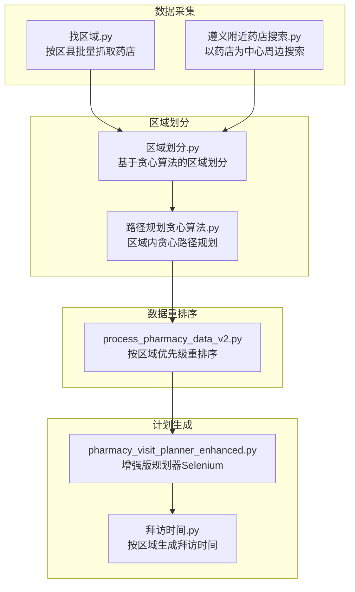
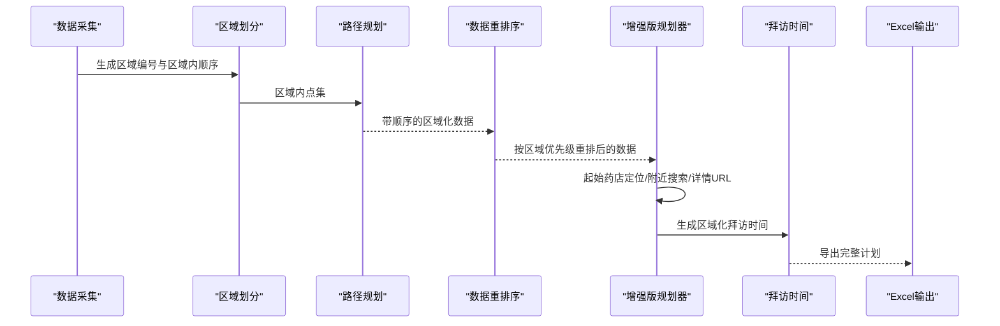
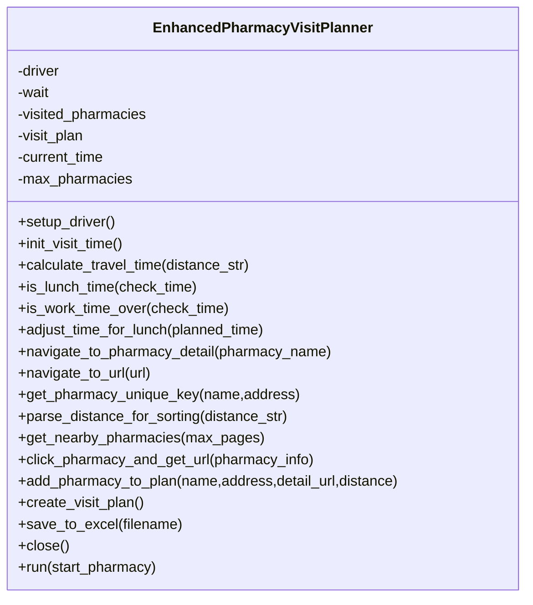
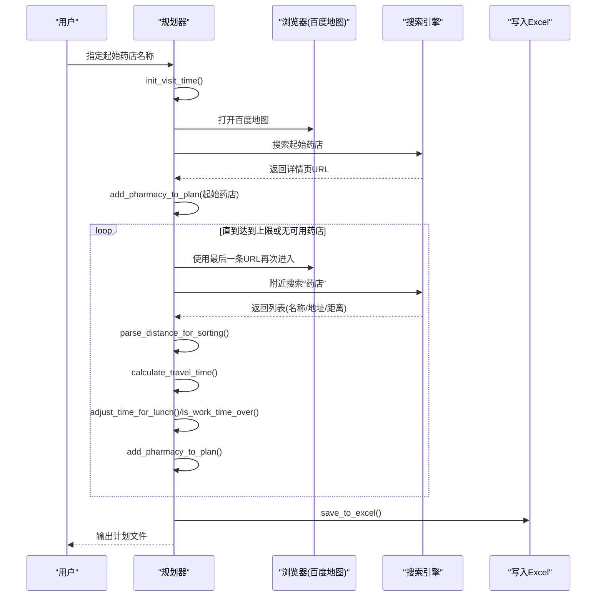
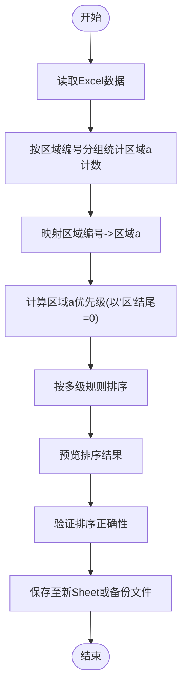
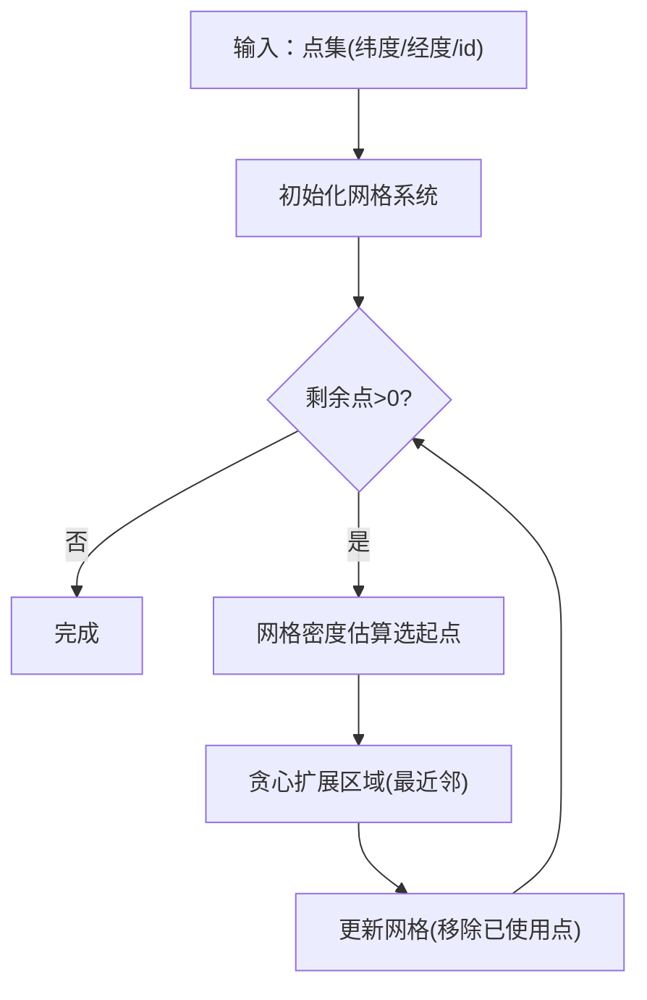
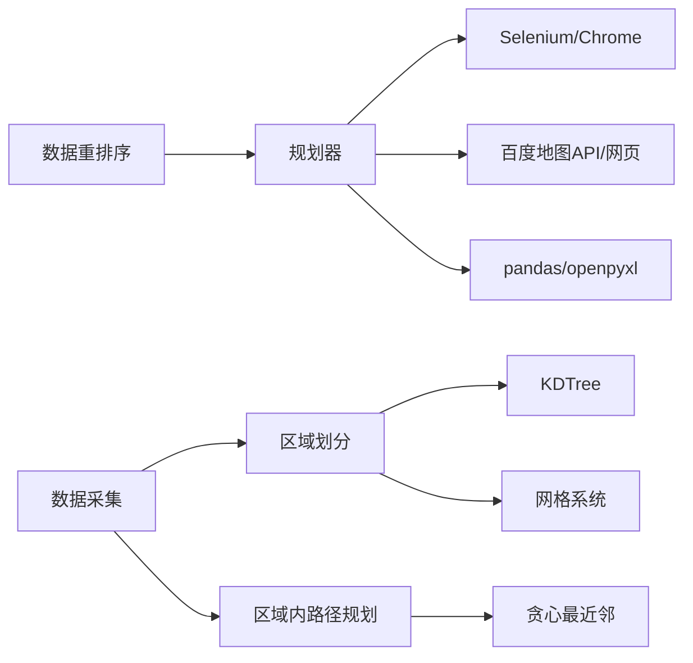

# 药店拜访计划生成

<cite>
**本文引用的文件**
- [pharmacy_visit_planner_enhanced.py](file://药店/pharmacy_visit_planner_enhanced.py)
- [process_pharmacy_data_v2.py](file://药店/process_pharmacy_data_v2.py)
- [区域划分.py](file://药店/区域划分.py)
- [路径规划贪心算法.py](file://药店/路径规划贪心算法.py)
- [遵义附近药店搜索.py](file://药店/遵义附近药店搜索.py)
- [拜访时间.py](file://药店/拜访时间.py)
- [找区域.py](file://药店/找区域.py)
</cite>

## 目录
1. [简介](#简介)
2. [项目结构](#项目结构)
3. [核心组件](#核心组件)
4. [架构总览](#架构总览)
5. [详细组件分析](#详细组件分析)
6. [依赖关系分析](#依赖关系分析)
7. [性能考量](#性能考量)
8. [故障排查指南](#故障排查指南)
9. [结论](#结论)
10. [附录](#附录)

## 简介
本文件面向“药店拜访计划生成”模块，围绕增强版规划器与配套数据处理脚本，系统梳理从数据采集、区域划分、路径规划到计划输出的完整技术链路。重点解析以下内容：
- 增强版规划器的架构设计与核心流程：基于起始药店的位置搜索、邻近药店的距离解析、行程时间预估、贪心策略的路径优化。
- 数据预处理与调度：通过数据重排序脚本构建可调度的区域优先序列，降低跨区域往返成本。
- 区域划分与路径规划：基于贪心算法的区域划分与区域内路径规划，支撑区域性拜访路线定制。
- 参数调优建议：最大行程时间、每日拜访上限等关键参数的设定与影响。
- 输出格式与字段说明：计划输出字段的生成逻辑与解读方法。
- 实战案例：结合区域划分脚本，演示如何按区域定制化生成区域性拜访路线。

## 项目结构
该模块由“数据采集—区域划分—路径规划—计划生成—时间排程—输出”六段流水线组成，文件组织以功能域划分，便于按阶段独立演进与复用。

图表来源
- [找区域.py](file://药店/找区域.py#L1-L184)
- [遵义附近药店搜索.py](file://药店/遵义附近药店搜索.py#L1-L184)
- [区域划分.py](file://药店/区域划分.py#L1-L321)
- [路径规划贪心算法.py](file://药店/路径规划贪心算法.py#L1-L65)
- [process_pharmacy_data_v2.py](file://药店/process_pharmacy_data_v2.py#L1-L173)
- [pharmacy_visit_planner_enhanced.py](file://药店/pharmacy_visit_planner_enhanced.py#L1-L555)
- [拜访时间.py](file://药店/拜访时间.py#L1-L92)

章节来源
- [pharmacy_visit_planner_enhanced.py](file://药店/pharmacy_visit_planner_enhanced.py#L1-L555)
- [process_pharmacy_data_v2.py](file://药店/process_pharmacy_data_v2.py#L1-L173)
- [区域划分.py](file://药店/区域划分.py#L1-L321)
- [路径规划贪心算法.py](file://药店/路径规划贪心算法.py#L1-L65)
- [遵义附近药店搜索.py](file://药店/遵义附近药店搜索.py#L1-L184)
- [拜访时间.py](file://药店/拜访时间.py#L1-L92)
- [找区域.py](file://药店/找区域.py#L1-L184)

## 核心组件
- 增强版规划器（EnhancedPharmacyVisitPlanner）
  - 以Selenium驱动浏览器，基于百度地图进行起始药店定位、附近药店搜索、详情页URL获取与计划生成。
  - 时间管理：随机起始时间、午休避让、工作时间上限控制。
  - 路径优化：按距离排序选择最近未访问药店，采用贪心策略逐步扩展。
  - 输出：生成Excel计划，包含编号、名称、地址、开始/结束时间、详情URL、距离、路程时间等字段。
- 数据重排序（process_pharmacy_data_v2）
  - 依据“区域a优先级、区域a计数、区域a值、区域编号、区域内顺序”的多级排序规则，提升同区域集中度，减少跨区域往返。
- 区域划分与路径规划（区域划分.py、路径规划贪心算法.py）
  - 区域划分：基于贪心算法，结合网格密度与KDTree邻近查询，生成区域编号与区域内顺序。
  - 路径规划：对区域内点集执行贪心最近邻路径规划，输出顺序列。
- 数据采集（找区域.py、遵义附近药店搜索.py）
  - 通过百度地图API按区县或以药店为中心周边搜索，产出标准化的药店数据，供后续区域划分与路径规划使用。

章节来源
- [pharmacy_visit_planner_enhanced.py](file://药店/pharmacy_visit_planner_enhanced.py#L28-L555)
- [process_pharmacy_data_v2.py](file://药店/process_pharmacy_data_v2.py#L1-L173)
- [区域划分.py](file://药店/区域划分.py#L1-L321)
- [路径规划贪心算法.py](file://药店/路径规划贪心算法.py#L1-L65)
- [找区域.py](file://药店/找区域.py#L1-L184)
- [遵义附近药店搜索.py](file://药店/遵义附近药店搜索.py#L1-L184)

## 架构总览
整体架构遵循“采集—划分—规划—重排—生成—排时—导出”的流水线式设计，各阶段职责清晰、耦合度低，便于独立迭代与扩展。

图表来源
- [pharmacy_visit_planner_enhanced.py](file://药店/pharmacy_visit_planner_enhanced.py#L370-L525)
- [区域划分.py](file://药店/区域划分.py#L1-L321)
- [路径规划贪心算法.py](file://药店/路径规划贪心算法.py#L1-L65)
- [process_pharmacy_data_v2.py](file://药店/process_pharmacy_data_v2.py#L1-L173)
- [拜访时间.py](file://药店/拜访时间.py#L1-L92)

## 详细组件分析

### 增强版规划器（EnhancedPharmacyVisitPlanner）设计与流程
- 设计要点
  - 面向对象封装：以类为单位管理浏览器驱动、时间推进、计划构建与输出。
  - 时间智能：随机起始时间、午休避让、工作时间上限，保证计划可执行性。
  - 路径贪心：每次从“最后一条记录的URL”进入，再在附近搜索中按距离排序选择最近未访问药店，避免跨区域往返。
  - 去重保障：以“名称+地址”生成唯一键，避免重复规划。
  - 输出规范：统一列宽、标题样式、居中对齐，便于阅读与打印。
- 关键流程
  - 初始化与起始时间：随机8:30-9:00之间起始，记录current_time。
  - 起始药店定位：通过百度地图搜索起始名称，获取详情页URL与地址。
  - 附近药店搜索：点击“附近”按钮，输入“药店”，循环翻页抓取列表，解析名称、地址、距离，按距离升序排序。
  - 路程时间预估：根据距离字符串解析单位与数值，按短途步行/骑行/长距离交通三档估算时间，并叠加随机扰动。
  - 时间推进与约束：每次添加新药店前累加路程时间；若触发午休或超时，则调整或终止。
  - 计划项生成：计算拜访时长（10-20分钟随机），生成开始/结束时间，写入visit_plan。
  - Excel导出：保存为带格式的工作表，列宽与标题样式统一。

图表来源
- [pharmacy_visit_planner_enhanced.py](file://药店/pharmacy_visit_planner_enhanced.py#L28-L525)

图表来源
- [pharmacy_visit_planner_enhanced.py](file://药店/pharmacy_visit_planner_enhanced.py#L370-L525)

章节来源
- [pharmacy_visit_planner_enhanced.py](file://药店/pharmacy_visit_planner_enhanced.py#L28-L555)

### 数据重排序（process_pharmacy_data_v2）
- 目标：在区域维度上提升集中度，减少跨区域往返，提高整体效率。
- 方法：
  - 为每个“区域编号”确定主要“区域a”（以其下药店数量最多的区域为准）。
  - 为每条记录标注“区域a计数”，并据此进行多级排序：区域a优先级（以“区”结尾优先）、区域a计数降序、区域a值升序、区域编号升序、区域内顺序升序。
- 效果：排序后同区域内的药店更紧密相邻，利于后续区域化路径规划与时间排程。

图表来源
- [process_pharmacy_data_v2.py](file://药店/process_pharmacy_data_v2.py#L1-L173)

章节来源
- [process_pharmacy_data_v2.py](file://药店/process_pharmacy_data_v2.py#L1-L173)

### 区域划分与路径规划（区域划分.py、路径规划贪心算法.py）
- 区域划分（贪心算法）
  - 策略：随机确定每个区域最大点数（16-19），使用网格密度估算选择高密度起点，随后以最近邻方式扩展区域，连续多次未找到合适点则提前结束当前区域构建。
  - 优化：网格系统缓存点索引，更新网格时移除已使用点；邻近查询使用KDTree，减少全量距离计算。
- 区域内路径规划（贪心算法）
  - 策略：以区域内顺序为基准，每次选择距离当前点最近的未访问点，逐步形成路径顺序列。
  - 应用：将区域划分结果与区域内路径规划结果合并，形成可直接用于计划生成的数据基础。

图表来源
- [区域划分.py](file://药店/区域划分.py#L1-L321)

章节来源
- [区域划分.py](file://药店/区域划分.py#L1-L321)
- [路径规划贪心算法.py](file://药店/路径规划贪心算法.py#L1-L65)

### 数据采集（找区域.py、遵义附近药店搜索.py）
- 找区域.py：按区县批量调用百度地图API，抓取药店列表，保存为Excel，包含名称、地址、经纬度、详情链接等字段。
- 遵义附近药店搜索.py：以已有药店为中心，调用API进行周边搜索，聚合结果并保存，便于后续区域划分与路径规划。

章节来源
- [找区域.py](file://药店/找区域.py#L1-L184)
- [遵义附近药店搜索.py](file://药店/遵义附近药店搜索.py#L1-L184)

### 计划输出格式与字段生成逻辑
- 字段说明（来自规划器输出）：
  - 编号：计划序号（递增）。
  - 药店名称、地址：来源于搜索结果与详情页解析。
  - 拜访开始时间、拜访结束时间：基于当前时间推进与随机停留时间生成。
  - 药店详情页URL：通过浏览器点击获取。
  - 距离：来源于附近搜索结果中的距离文本。
  - 路程时间（分钟）：基于距离字符串解析与三档速度模型估算，叠加随机扰动；首站为0。
- 生成逻辑要点：
  - 首站固定为起始药店，不计入路程时间。
  - 每次新增站点前累加上一站到当前站的路程时间。
  - 午休时段（12:00-13:30）若命中，则将当前时间调整至午休结束后。
  - 工作时间上限（18:30）触发后停止规划。
  - 每站停留时间随机（10-20分钟），与路程时间共同决定下一站开始时间。

章节来源
- [pharmacy_visit_planner_enhanced.py](file://药店/pharmacy_visit_planner_enhanced.py#L323-L368)

## 依赖关系分析
- 组件耦合
  - 规划器依赖浏览器自动化与百度地图接口，耦合于外部服务稳定性与反爬策略。
  - 区域划分与路径规划相互独立，但输出被数据重排序与计划生成所消费。
  - 数据重排序依赖区域划分输出，形成“先划分、后重排、再规划”的闭环。
- 外部依赖
  - Selenium、ChromeDriver：用于网页自动化。
  - 百度地图API：用于区域抓取与附近搜索。
  - pandas/openpyxl：用于数据读写与格式化输出。
- 潜在风险
  - API配额限制与网络波动可能影响采集质量。
  - 百度地图UI变更可能导致解析XPath失效。
  - 路径贪心策略在极端分布下可能产生局部最优而非全局最优。

图表来源
- [pharmacy_visit_planner_enhanced.py](file://药店/pharmacy_visit_planner_enhanced.py#L1-L555)
- [区域划分.py](file://药店/区域划分.py#L1-L321)
- [路径规划贪心算法.py](file://药店/路径规划贪心算法.py#L1-L65)
- [process_pharmacy_data_v2.py](file://药店/process_pharmacy_data_v2.py#L1-L173)

章节来源
- [pharmacy_visit_planner_enhanced.py](file://药店/pharmacy_visit_planner_enhanced.py#L1-L555)
- [区域划分.py](file://药店/区域划分.py#L1-L321)
- [路径规划贪心算法.py](file://药店/路径规划贪心算法.py#L1-L65)
- [process_pharmacy_data_v2.py](file://药店/process_pharmacy_data_v2.py#L1-L173)

## 性能考量
- 路径贪心策略
  - 时间复杂度：每次选择最近邻需遍历未访问集合，整体约为O(N^2)；对大规模数据建议分批或引入近似最近邻（如KDTree）以降低常数因子。
  - 空间复杂度：网格系统与KDTree带来额外空间开销，但显著减少距离计算次数。
- 采集与解析
  - API调用频率与配额限制：应设置合理的延时与断点续传机制，避免触发限流。
  - 页面解析稳定性：XPath与CSS选择器易受UI变化影响，建议增加容错与降级策略。
- 时间管理
  - 随机停留与随机起始时间提升了现实适配性，但也引入不确定性；可通过统计多次运行的均值与方差评估稳定性。

[本节为通用性能讨论，不直接分析具体文件]

## 故障排查指南
- 浏览器启动失败
  - 症状：Chrome启动报错。
  - 排查：确认ChromeDriver版本与Chrome匹配；检查窗口大小与用户代理参数；查看异常堆栈。
- 百度地图页面元素定位失败
  - 症状：搜索框、附近按钮、结果链接等元素查找失败。
  - 排查：确认目标元素的XPath/CSS选择器是否随UI更新而变化；增加显式等待与异常捕获；必要时切换到更稳定的解析策略。
- API调用限制
  - 症状：采集中断或返回空数据。
  - 排查：检查已用API次数与最大限制；为每个区县/中心点设置延时；记录日志并支持断点续传。
- 区域划分异常
  - 症状：区域数量过多或过少、区域内点数不稳定。
  - 排查：调整阈值与最大点数区间；检查网格初始化与邻近查询逻辑；验证距离缓存一致性。
- 计划生成异常
  - 症状：时间越界、重复规划、无输出。
  - 排查：核对唯一键生成规则（名称+地址）；检查午休与工作时间上限逻辑；确认Excel列宽与样式设置未引发异常。

章节来源
- [pharmacy_visit_planner_enhanced.py](file://药店/pharmacy_visit_planner_enhanced.py#L1-L555)
- [区域划分.py](file://药店/区域划分.py#L1-L321)
- [找区域.py](file://药店/找区域.py#L1-L184)
- [遵义附近药店搜索.py](file://药店/遵义附近药店搜索.py#L1-L184)

## 结论
该模块通过“采集—划分—规划—重排—生成—排时—导出”的流水线，实现了从零散药店数据到可执行拜访计划的自动化闭环。增强版规划器以贪心策略与时间约束为核心，兼顾现实可行性；数据重排序与区域化路径规划进一步提升效率与可维护性。建议在生产环境中完善异常处理、参数化配置与可视化监控，持续优化阈值与策略参数以适配不同区域特征。

[本节为总结性内容，不直接分析具体文件]

## 附录

### 参数调优建议
- 最大行程时间
  - 建议：结合实际交通状况与工作时间上限（18:30）倒推每日最大可覆盖半径，动态调整“附近搜索页数”与“最大点数区间”。
- 每日拜访上限
  - 建议：以16-19家为基准，结合午休与工作时间，预留10%-20%缓冲；高峰期可下调以提升服务质量。
- 区域划分阈值
  - 建议：以区域密度与平均步行距离为参考，调整网格阈值与邻域半径，使区域内点数稳定在16-19之间。
- 路径规划速度模型
  - 建议：根据城市道路类型与实际通勤数据校准三档速度与随机扰动，提高时间估算精度。

[本节为通用建议，不直接分析具体文件]

### 区域化定制化生成步骤（实战案例）
- 步骤1：采集数据
  - 使用“找区域.py”按区县抓取药店，或使用“遵义附近药店搜索.py”以现有药店为中心周边搜索，生成标准化Excel。
- 步骤2：区域划分
  - 运行“区域划分.py”，得到带“区域编号”和“区域内顺序”的划分结果。
- 步骤3：区域内路径规划
  - 运行“路径规划贪心算法.py”，对每个区域内的点集生成顺序列，合并为最终数据。
- 步骤4：数据重排序
  - 运行“process_pharmacy_data_v2.py”，按区域优先级与计数进行重排序，降低跨区域往返。
- 步骤5：生成计划
  - 运行“pharmacy_visit_planner_enhanced.py”，以某区域内的起始点为起点，按贪心策略生成拜访计划。
- 步骤6：时间排程
  - 运行“拜访时间.py”，按区域生成带时间戳的拜访时间表，合并导出。

章节来源
- [找区域.py](file://药店/找区域.py#L1-L184)
- [遵义附近药店搜索.py](file://药店/遵义附近药店搜索.py#L1-L184)
- [区域划分.py](file://药店/区域划分.py#L1-L321)
- [路径规划贪心算法.py](file://药店/路径规划贪心算法.py#L1-L65)
- [process_pharmacy_data_v2.py](file://药店/process_pharmacy_data_v2.py#L1-L173)
- [pharmacy_visit_planner_enhanced.py](file://药店/pharmacy_visit_planner_enhanced.py#L1-L555)
- [拜访时间.py](file://药店/拜访时间.py#L1-L92)