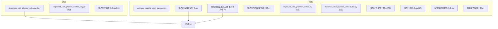
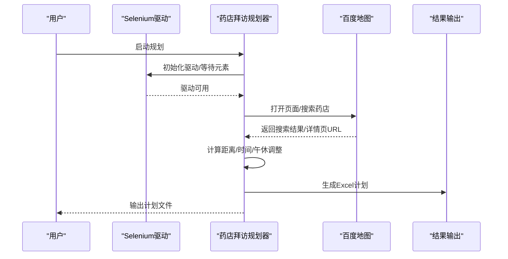
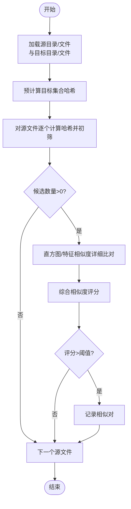
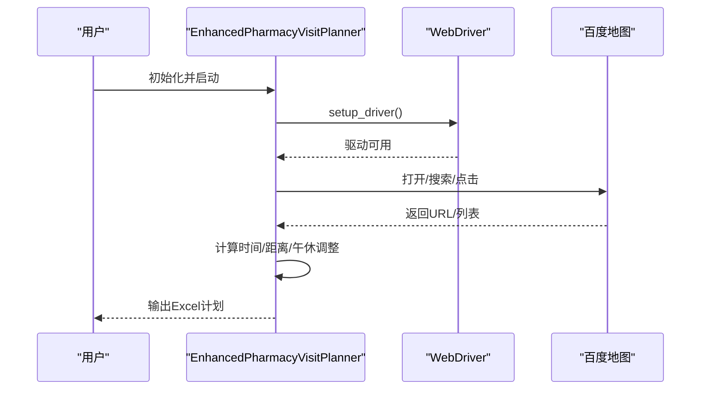
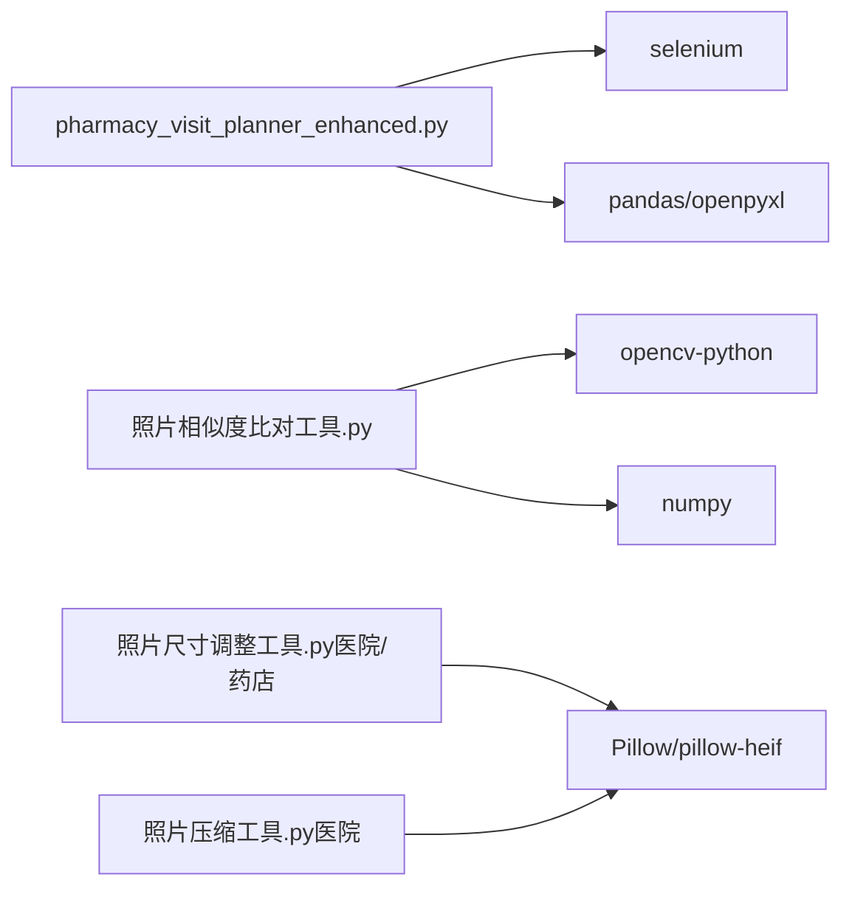

# 故障排除与常见问题

<cite>
**本文引用的文件**
- [药店/pharmacy_visit_planner_enhanced.py](file://药店/pharmacy_visit_planner_enhanced.py)
- [医院/照片相似度比对工具.py](file://医院/照片相似度比对工具.py)
- [医院/照片相似度比对工具-支持单文件.py](file://医院/照片相似度比对工具-支持单文件.py)
- [医院/照片组内相似度排序工具.py](file://医院/照片组内相似度排序工具.py)
- [医院/脚本文件备份工具.py](file://医院/脚本文件备份工具.py)
- [测试.txt](file://测试.txt)
- [guizhou_hospital_dept_scraper.py](file://医院/guizhou_hospital_dept_scraper.py)
- [照片尺寸调整工具.py（医院）](file://医院/照片尺寸调整工具.py)
- [照片尺寸调整工具.py（药店）](file://药店/照片尺寸调整工具.py)
- [照片压缩工具.py（医院）](file://医院/照片压缩工具.py)
- [科室照片重命名工具.py](file://医院/科室照片重命名工具.py)
- [improved_visit_planner_unified.py（医院）](file://医院/improved_visit_planner_unified.py)
- [improved_visit_planner_unified_day.py（医院）](file://医院/improved_visit_planner_unified_day.py)
- [improved_visit_planner_unified_day.py（药店）](file://药店/improved_visit_planner_unified_day.py)
</cite>

## 目录
1. [简介](#简介)
2. [项目结构](#项目结构)
3. [核心组件](#核心组件)
4. [架构总览](#架构总览)
5. [详细组件分析](#详细组件分析)
6. [依赖关系分析](#依赖关系分析)
7. [性能考量](#性能考量)
8. [故障排除指南与常见问题](#故障排除指南与常见问题)
9. [结论](#结论)
10. [附录](#附录)

## 简介
本指南面向使用本仓库脚本进行“医院/药店”相关数据采集、图片处理与拜访计划生成的用户，聚焦以下典型问题：
- 脚本运行报 ModuleNotFoundError
- Selenium 无法启动浏览器
- 照片相似度比对结果不准确
- 拜访计划生成时间过长
- 数据处理脚本误删/覆盖风险
- 日志分析与定位错误

同时，结合测试.txt中的示例数据，给出可复现的验证方法；强调定期备份原始数据与建立测试沙箱环境的重要性。

## 项目结构
仓库采用按业务域分层组织：医院与药店两大领域，分别包含数据采集、图片处理、计划生成与辅助工具。关键文件分布如下：
- 药店：增强版拜访规划、路径规划、数据处理与图片工具
- 医院：科室/医生抓取、图片处理、计划生成与辅助工具
- 通用：脚本备份工具、日志配置示例

图表来源
- [药店/pharmacy_visit_planner_enhanced.py](file://药店/pharmacy_visit_planner_enhanced.py#L1-L200)
- [医院/照片相似度比对工具.py](file://医院/照片相似度比对工具.py#L1-L318)
- [医院/照片相似度比对工具-支持单文件.py](file://医院/照片相似度比对工具-支持单文件.py#L1-L341)
- [医院/照片组内相似度排序工具.py](file://医院/照片组内相似度排序工具.py#L1-L244)
- [医院/脚本文件备份工具.py](file://医院/脚本文件备份工具.py#L1-L285)
- [测试.txt](file://测试.txt#L1-L5)

章节来源
- [药店/pharmacy_visit_planner_enhanced.py](file://药店/pharmacy_visit_planner_enhanced.py#L1-L200)
- [医院/照片相似度比对工具.py](file://医院/照片相似度比对工具.py#L1-L318)
- [医院/照片相似度比对工具-支持单文件.py](file://医院/照片相似度比对工具-支持单文件.py#L1-L341)
- [医院/脚本文件备份工具.py](file://医院/脚本文件备份工具.py#L1-L285)
- [测试.txt](file://测试.txt#L1-L5)

## 核心组件
- Selenium 自动化脚本（药店）：负责百度地图搜索、详情页URL获取与计划生成。
- 图像相似度检测工具：多阶段哈希初筛+直方图/特征相似度综合评分，支持文件夹与单文件模式。
- 计划生成脚本：基于贪心策略的医院/药店拜访计划，考虑工作时间、午休与距离。
- 图片处理工具：尺寸调整、压缩、重命名与重命名辅助工具。
- 脚本备份工具：从文本或注释中解析待备份文件列表，分类复制至备份目录。

章节来源
- [药店/pharmacy_visit_planner_enhanced.py](file://药店/pharmacy_visit_planner_enhanced.py#L1-L200)
- [医院/照片相似度比对工具.py](file://医院/照片相似度比对工具.py#L1-L318)
- [医院/照片相似度比对工具-支持单文件.py](file://医院/照片相似度比对工具-支持单文件.py#L1-L341)
- [improved_visit_planner_unified.py（医院）](file://医院/improved_visit_planner_unified.py#L276-L468)
- [improved_visit_planner_unified_day.py（医院）](file://医院/improved_visit_planner_unified_day.py#L296-L488)
- [improved_visit_planner_unified_day.py（药店）](file://药店/improved_visit_planner_unified_day.py#L296-L488)
- [照片尺寸调整工具.py（医院）](file://医院/照片尺寸调整工具.py#L120-L160)
- [照片压缩工具.py（医院）](file://医院/照片压缩工具.py#L135-L177)
- [科室照片重命名工具.py](file://医院/科室照片重命名工具.py#L175-L200)
- [医院/脚本文件备份工具.py](file://医院/脚本文件备份工具.py#L1-L285)

## 架构总览
下图展示“药店拜访规划”与“图像相似度检测”的关键流程与交互。

图表来源
- [药店/pharmacy_visit_planner_enhanced.py](file://药店/pharmacy_visit_planner_enhanced.py#L39-L146)
- [药店/pharmacy_visit_planner_enhanced.py](file://药店/pharmacy_visit_planner_enhanced.py#L321-L386)

## 详细组件分析

### 组件A：照片相似度检测（双工具对比）
- 功能要点
  - 多阶段比对：先计算感知哈希，初筛相似度高于阈值的候选，再进行直方图与特征相似度的详细比对。
  - 支持文件夹与单文件两种模式，便于灵活使用。
  - 统计输出：记录总比对次数、详细比对次数与效率提升比例。
- 关键参数
  - 哈希初筛阈值与最终阈值，影响召回与性能平衡。
  - 直方图/特征相似度权重，综合评分决定最终判定。
- 适用场景
  - 批量清理重复照片、跨目录比对、组内相似度排序。

图表来源
- [医院/照片相似度比对工具.py](file://医院/照片相似度比对工具.py#L127-L217)
- [医院/照片相似度比对工具-支持单文件.py](file://医院/照片相似度比对工具-支持单文件.py#L151-L241)

章节来源
- [医院/照片相似度比对工具.py](file://医院/照片相似度比对工具.py#L1-L318)
- [医院/照片相似度比对工具-支持单文件.py](file://医院/照片相似度比对工具-支持单文件.py#L1-L341)
- [医院/照片组内相似度排序工具.py](file://医院/照片组内相似度排序工具.py#L114-L244)

### 组件B：药店拜访规划（Selenium自动化）
- 功能要点
  - 自动化百度地图搜索、点击详情页、提取URL。
  - 时间规划：随机起始时间、午休避让、工作时间上限控制。
  - 路线规划：根据距离估算移动时间，累加形成拜访时间序列。
- 关键异常
  - 浏览器启动失败、元素等待超时、网络不稳定导致的页面元素缺失。

图表来源
- [药店/pharmacy_visit_planner_enhanced.py](file://药店/pharmacy_visit_planner_enhanced.py#L39-L146)
- [药店/pharmacy_visit_planner_enhanced.py](file://药店/pharmacy_visit_planner_enhanced.py#L321-L386)

章节来源
- [药店/pharmacy_visit_planner_enhanced.py](file://药店/pharmacy_visit_planner_enhanced.py#L1-L200)
- [药店/pharmacy_visit_planner_enhanced.py](file://药店/pharmacy_visit_planner_enhanced.py#L321-L386)

### 组件C：脚本备份工具（安全版对比）
- 功能要点
  - 从文本文件或脚本注释区域解析待备份文件列表，分类复制至“药店/医院”备份目录。
  - 支持列出备份目录内容，便于核对。
- 危险操作警示
  - 存在一个名为“脚本文件备份工具-不能运行-会覆盖.py”的文件，其命名明确提示不可运行，否则可能覆盖现有文件。
  - 安全版脚本（如“拜访编号处理脚本_安全版.py”）体现了对危险操作的规避设计，应优先使用安全版。

章节来源
- [医院/脚本文件备份工具.py](file://医院/脚本文件备份工具.py#L1-L285)

## 依赖关系分析
- Selenium 自动化依赖：Chrome 驱动、WebDriverWait、元素定位策略。
- OpenCV/NumPy：图像处理与相似度计算。
- Pandas/OpenPyXL：Excel 生成与数据处理。
- Pillow/pillow-heif：图片解码与HEIF支持（尺寸调整/压缩工具）。

图表来源
- [药店/pharmacy_visit_planner_enhanced.py](file://药店/pharmacy_visit_planner_enhanced.py#L1-L26)
- [医院/照片相似度比对工具.py](file://医院/照片相似度比对工具.py#L1-L18)
- [照片尺寸调整工具.py（医院）](file://医院/照片尺寸调整工具.py#L1-L20)
- [照片尺寸调整工具.py（药店）](file://药店/照片尺寸调整工具.py#L1-L20)
- [照片压缩工具.py（医院）](file://医院/照片压缩工具.py#L1-L20)

## 性能考量
- 相似度检测
  - 通过哈希初筛显著降低详细比对数量，建议根据数据规模调优哈希阈值与最终阈值。
  - 对于大规模数据集，建议分批处理或限制扫描深度。
- 计划生成
  - 贪心策略时间复杂度与数据规模相关，建议控制每日目标数量与候选项范围。
- 图片处理
  - 尺寸调整与压缩工具支持递归遍历，注意磁盘IO与CPU占用，建议在独立磁盘或SSD上执行。

章节来源
- [医院/照片相似度比对工具.py](file://医院/照片相似度比对工具.py#L127-L217)
- [improved_visit_planner_unified.py（医院）](file://医院/improved_visit_planner_unified.py#L276-L468)
- [照片尺寸调整工具.py（医院）](file://医院/照片尺寸调整工具.py#L120-L160)
- [照片压缩工具.py（医院）](file://医院/照片压缩工具.py#L135-L177)

## 故障排除指南与常见问题

### 问题1：脚本运行报 ModuleNotFoundError
- 现象
  - 报错显示缺少模块（如 selenium、cv2、openpyxl、Pillow 等）。
- 诊断步骤
  - 确认当前 Python 解释器与虚拟环境正确激活。
  - 检查依赖安装状态：Selenium、OpenCV、Pandas、OpenPyXL、Pillow、pillow-heif 等。
  - 若脚本内置了自动安装逻辑，确认网络可达镜像源，避免 pip 超时。
- 解决方案
  - 使用脚本提供的自动安装函数（如尺寸调整/压缩工具中的安装逻辑）或手动 pip 安装。
  - 如遇版本冲突，参考“强制重装+禁用缓存”的方式逐步安装。
- 相关实现参考
  - [照片尺寸调整工具.py（医院）](file://医院/照片尺寸调整工具.py#L25-L60)
  - [照片尺寸调整工具.py（药店）](file://药店/照片尺寸调整工具.py#L25-L60)
  - [照片压缩工具.py（医院）](file://医院/照片压缩工具.py#L228-L257)

章节来源
- [照片尺寸调整工具.py（医院）](file://医院/照片尺寸调整工具.py#L25-L60)
- [照片尺寸调整工具.py（药店）](file://药店/照片尺寸调整工具.py#L25-L60)
- [照片压缩工具.py（医院）](file://医院/照片压缩工具.py#L228-L257)

### 问题2：Selenium 无法启动浏览器
- 现象
  - 浏览器启动失败、窗口尺寸异常、元素等待超时。
- 诊断步骤
  - 检查 Chrome 驱动版本与浏览器版本兼容性。
  - 确认 WebDriverWait 等待条件是否合理，必要时延长等待时间。
  - 观察页面元素选择器是否随页面更新而失效。
- 解决方案
  - 下载与浏览器匹配的 ChromeDriver 并配置 PATH。
  - 调整浏览器参数（窗口大小、UA 等），确保页面渲染稳定。
  - 针对百度地图页面元素变更，更新定位策略或增加容错重试。
- 相关实现参考
  - [药店/pharmacy_visit_planner_enhanced.py](file://药店/pharmacy_visit_planner_enhanced.py#L39-L51)
  - [药店/pharmacy_visit_planner_enhanced.py](file://药店/pharmacy_visit_planner_enhanced.py#L111-L146)

章节来源
- [药店/pharmacy_visit_planner_enhanced.py](file://药店/pharmacy_visit_planner_enhanced.py#L39-L51)
- [药店/pharmacy_visit_planner_enhanced.py](file://药店/pharmacy_visit_planner_enhanced.py#L111-L146)

### 问题3：照片相似度比对结果不准确
- 现象
  - 相似度阈值设置不当导致漏判或误判；图像质量差异导致直方图/特征相似度偏差。
- 诊断步骤
  - 检查哈希初筛阈值与最终阈值设置，结合数据规模评估。
  - 对比直方图与特征相似度权重，确认综合评分是否合理。
  - 使用“支持单文件”工具对特定样本进行验证，缩小问题范围。
- 解决方案
  - 调整哈希初筛阈值与最终阈值，平衡召回与性能。
  - 适当提高直方图/特征相似度权重，或引入更多特征（如 dHash）。
  - 对极端情况（如曝光差异大）采用更稳健的特征组合。
- 相关实现参考
  - [医院/照片相似度比对工具.py](file://医院/照片相似度比对工具.py#L127-L217)
  - [医院/照片相似度比对工具-支持单文件.py](file://医院/照片相似度比对工具-支持单文件.py#L151-L241)
  - [医院/照片组内相似度排序工具.py](file://医院/照片组内相似度排序工具.py#L114-L244)

章节来源
- [医院/照片相似度比对工具.py](file://医院/照片相似度比对工具.py#L127-L217)
- [医院/照片相似度比对工具-支持单文件.py](file://医院/照片相似度比对工具-支持单文件.py#L151-L241)
- [医院/照片组内相似度排序工具.py](file://医院/照片组内相似度排序工具.py#L114-L244)

### 问题4：拜访计划生成时间过长
- 现象
  - 数据量大、贪心策略迭代次数多、网络请求频繁导致耗时。
- 诊断步骤
  - 检查每日目标数量与候选项范围，确认是否过大。
  - 观察 Selenium 请求耗时，评估网络稳定性与页面响应。
  - 分析计划生成过程中的时间瓶颈（计算时间/IO/网络）。
- 解决方案
  - 控制每日目标数量与候选项范围，必要时分批生成。
  - 优化页面交互策略（减少不必要的点击/等待），或引入缓存机制。
  - 将计划生成与数据抓取分离，先离线生成再导出。
- 相关实现参考
  - [improved_visit_planner_unified.py（医院）](file://医院/improved_visit_planner_unified.py#L276-L468)
  - [improved_visit_planner_unified_day.py（医院）](file://医院/improved_visit_planner_unified_day.py#L296-L488)
  - [improved_visit_planner_unified_day.py（药店）](file://药店/improved_visit_planner_unified_day.py#L296-L488)

章节来源
- [improved_visit_planner_unified.py（医院）](file://医院/improved_visit_planner_unified.py#L276-L468)
- [improved_visit_planner_unified_day.py（医院）](file://医院/improved_visit_planner_unified_day.py#L296-L488)
- [improved_visit_planner_unified_day.py（药店）](file://药店/improved_visit_planner_unified_day.py#L296-L488)

### 问题5：脚本文件备份工具不可运行（覆盖风险）
- 现象
  - 存在“脚本文件备份工具-不能运行-会覆盖.py”，其命名明确提示不可运行。
- 诊断步骤
  - 确认当前使用的备份脚本是否为“脚本文件备份工具.py”（安全版）。
  - 检查备份目录结构与文件列表来源（文本文件或脚本注释区域）。
- 解决方案
  - 优先使用“脚本文件备份工具.py”，避免运行危险版本。
  - 建议在执行备份前先列出备份目录内容进行核对。
- 相关实现参考
  - [医院/脚本文件备份工具.py](file://医院/脚本文件备份工具.py#L1-L285)

章节来源
- [医院/脚本文件备份工具.py](file://医院/脚本文件备份工具.py#L1-L285)

### 问题6：日志分析与错误定位
- 现象
  - 脚本运行异常但无明确错误信息。
- 诊断步骤
  - 查看脚本中是否配置了日志（如抓取脚本的日志配置）。
  - 使用异常捕获打印堆栈信息，定位具体异常点。
- 解决方案
  - 在关键流程处增加日志输出，记录输入参数、中间结果与异常信息。
  - 对外部依赖（网络、文件系统）增加超时与重试策略。
- 相关实现参考
  - [guizhou_hospital_dept_scraper.py](file://医院/guizhou_hospital_dept_scraper.py#L1-L26)
  - [科室照片重命名工具.py](file://医院/科室照片重命名工具.py#L175-L200)

章节来源
- [guizhou_hospital_dept_scraper.py](file://医院/guizhou_hospital_dept_scraper.py#L1-L26)
- [科室照片重命名工具.py](file://医院/科室照片重命名工具.py#L175-L200)

### 问题7：测试验证方法（基于测试.txt）
- 说明
  - 测试.txt 提供了基础示例数据，可用于验证脚本读取与处理逻辑。
- 验证建议
  - 使用“脚本文件备份工具.py”读取备份路径列表，验证路径解析与复制流程。
  - 使用“照片相似度比对工具-支持单文件.py”对测试.txt中涉及的路径进行单文件比对，观察相似度评分与输出结果。
- 相关实现参考
  - [测试.txt](file://测试.txt#L1-L5)
  - [医院/脚本文件备份工具.py](file://医院/脚本文件备份工具.py#L64-L114)
  - [医院/照片相似度比对工具-支持单文件.py](file://医院/照片相似度比对工具-支持单文件.py#L265-L341)

章节来源
- [测试.txt](file://测试.txt#L1-L5)
- [医院/脚本文件备份工具.py](file://医院/脚本文件备份工具.py#L64-L114)
- [医院/照片相似度比对工具-支持单文件.py](file://医院/照片相似度比对工具-支持单文件.py#L265-L341)

## 结论
- 针对 ModuleNotFoundError，优先使用脚本内置安装逻辑或手动 pip 安装依赖。
- Selenium 启动失败多由驱动版本不匹配，需严格校验浏览器与驱动版本。
- 相似度检测需在“召回/性能”间权衡，建议结合直方图与特征相似度综合评分。
- 计划生成耗时可通过控制目标规模与优化页面交互缓解。
- 备份工具务必使用安全版本，避免覆盖风险；建议建立测试沙箱与定期备份原始数据。

## 附录
- 建议的测试沙箱实践
  - 将测试数据与生产数据隔离，使用独立目录与虚拟环境。
  - 对关键脚本（如备份、重命名、压缩）先在沙箱执行，核对输出后再推广到生产。
- 常用命令参考
  - pip 安装依赖（含镜像源与强制重装）
  - ChromeDriver 下载与版本匹配
  - Python 虚拟环境管理与激活