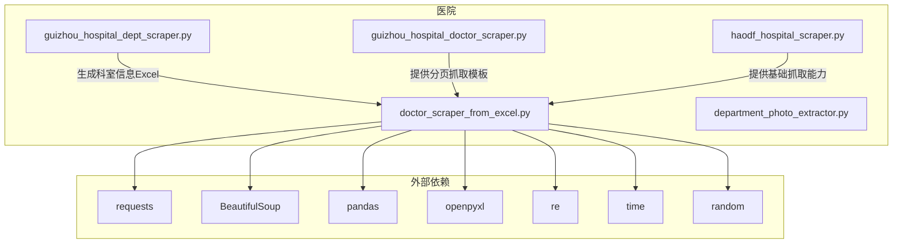
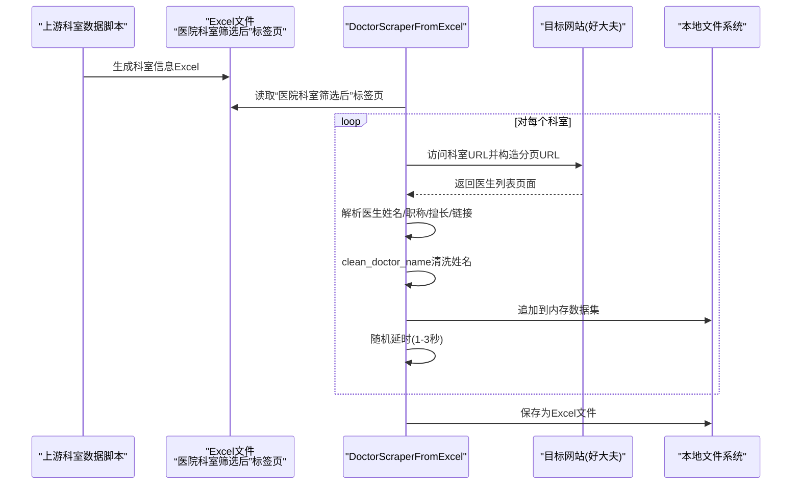
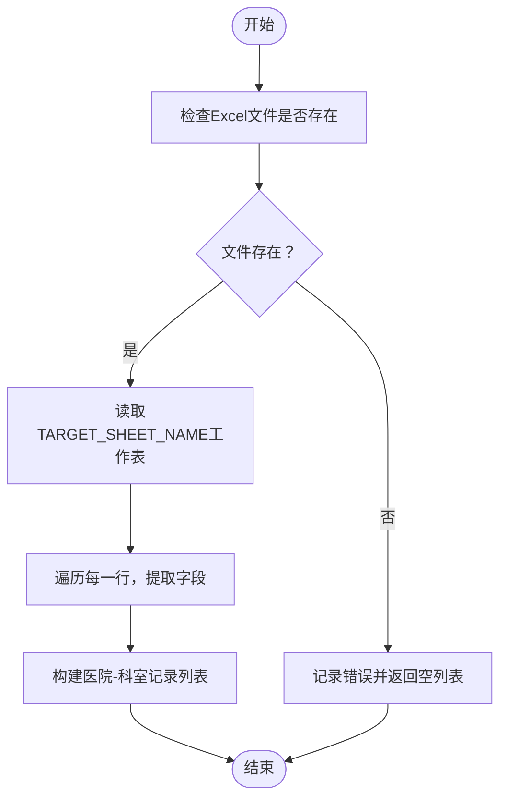
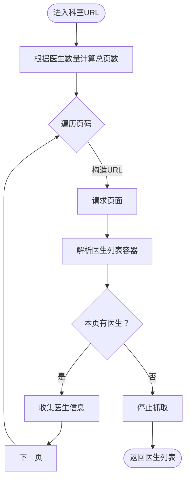
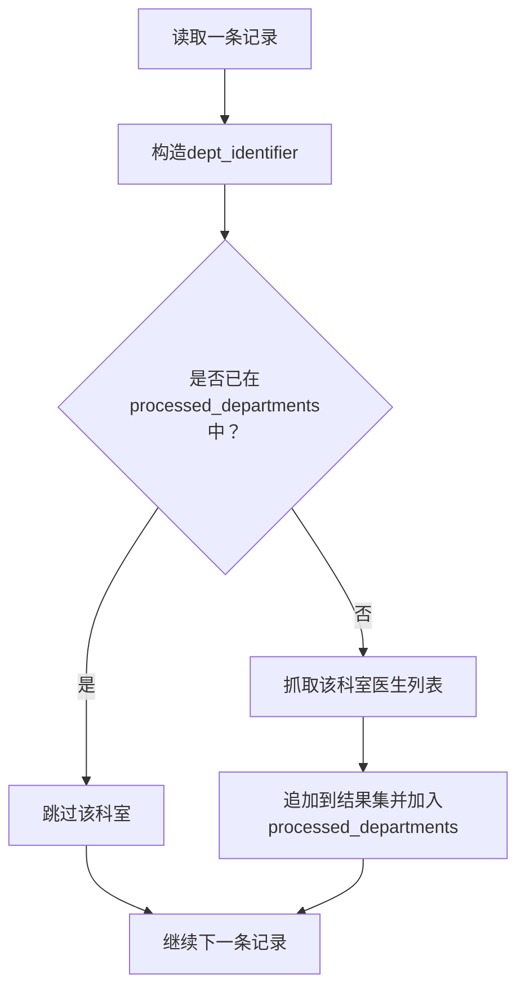
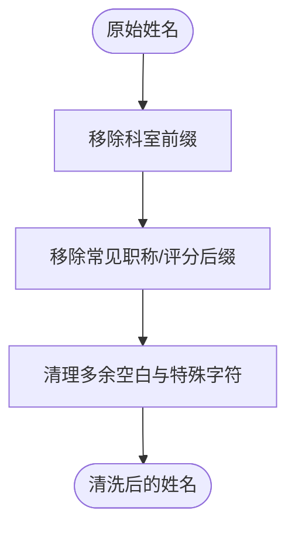
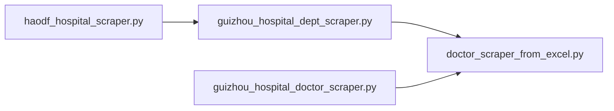
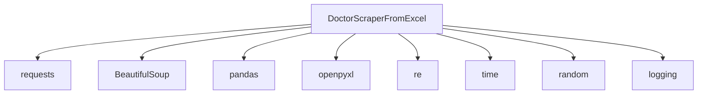

# Excel数据补充抓取

<cite>
**本文引用的文件**
- [doctor_scraper_from_excel.py](file://医院/doctor_scraper_from_excel.py)
- [guizhou_hospital_dept_scraper.py](file://医院/guizhou_hospital_dept_scraper.py)
- [guizhou_hospital_doctor_scraper.py](file://医院/guizhou_hospital_doctor_scraper.py)
- [haodf_hospital_scraper.py](file://医院/haodf_hospital_scraper.py)
- [department_photo_extractor.py](file://医院/department_photo_extractor.py)
</cite>

## 目录
1. [简介](#简介)
2. [项目结构](#项目结构)
3. [核心组件](#核心组件)
4. [架构总览](#架构总览)
5. [详细组件分析](#详细组件分析)
6. [依赖分析](#依赖分析)
7. [性能考虑](#性能考虑)
8. [故障排查指南](#故障排查指南)
9. [结论](#结论)
10. [附录](#附录)

## 简介
本文件面向“基于Excel文件中的医院科室链接进行精准医生数据补充抓取”的技术实现，围绕 doctor_scraper_from_excel.py 展开，系统性说明：
- 如何读取Excel中“医院科室筛选后”标签页的数据，解析医院名称、城市、等级、科室名称、科室链接、医生数量等字段；
- 如何直接跳转到Excel提供的科室URL进行医生信息抓取，并支持分页处理；
- 如何通过 dept_identifier 机制避免重复抓取相同科室；
- 如何通过随机延时策略降低被反爬虫机制封锁的风险；
- 数据清洗流程，特别是 clean_doctor_name 方法如何移除科室前缀和职称后缀以确保姓名准确性；
- 配置文件 EXCEL_FILE_PATH、TARGET_SHEET_NAME 的使用方法与最佳实践；
- 与上游科室数据采集脚本（如 guizhou_hospital_dept_scraper.py、guizhou_hospital_doctor_scraper.py、haodf_hospital_scraper.py）的关系与衔接。

## 项目结构
本仓库采用按功能模块分层的组织方式，其中“医院”目录存放与医院相关的数据采集、处理与展示脚本。doctor_scraper_from_excel.py 位于“医院”目录下，负责从Excel中读取科室链接并抓取医生数据；上游脚本负责生成Excel中的科室数据。

图表来源
- [doctor_scraper_from_excel.py](file://医院/doctor_scraper_from_excel.py#L1-L310)
- [guizhou_hospital_dept_scraper.py](file://医院/guizhou_hospital_dept_scraper.py#L1-L391)
- [guizhou_hospital_doctor_scraper.py](file://医院/guizhou_hospital_doctor_scraper.py#L278-L315)
- [haodf_hospital_scraper.py](file://医院/haodf_hospital_scraper.py#L1-L183)

章节来源
- [doctor_scraper_from_excel.py](file://医院/doctor_scraper_from_excel.py#L1-L310)

## 核心组件
- DoctorScraperFromExcel 类：封装抓取流程，包括读取Excel、构造分页URL、解析医生信息、清洗姓名、保存结果等。
- get_page 方法：带指数退避的页面获取，增强稳定性。
- read_hospitals_from_excel 方法：从Excel读取“医院科室筛选后”标签页，提取所需字段。
- get_department_doctors 方法：根据科室URL抓取医生列表，支持分页与空页检测。
- clean_doctor_name 方法：清洗医生姓名，移除科室前缀与职称后缀。
- scrape_doctors_from_excel 方法：主流程调度，去重与随机延时控制。
- save_to_excel 方法：将结果保存为Excel文件。

章节来源
- [doctor_scraper_from_excel.py](file://医院/doctor_scraper_from_excel.py#L40-L310)

## 架构总览
整体流程分为三层：
- 数据准备层：上游脚本生成Excel，包含“医院科室筛选后”标签页，字段包括医院名称、城市、等级、科室名称、科室链接、医生数量。
- 抓取执行层：doctor_scraper_from_excel.py 读取Excel，逐条抓取科室医生信息，支持分页与去重。
- 结果存储层：将清洗后的医生数据保存为Excel文件。

图表来源
- [doctor_scraper_from_excel.py](file://医院/doctor_scraper_from_excel.py#L71-L309)
- [guizhou_hospital_dept_scraper.py](file://医院/guizhou_hospital_dept_scraper.py#L285-L391)

## 详细组件分析

### Excel读取与字段解析
- 读取位置：EXCEL_FILE_PATH 指向Excel文件路径；TARGET_SHEET_NAME 指定工作表名称。
- 字段提取：从“医院科室筛选后”标签页读取“医院名称”“所属城市”“医院等级”“科室名称”“科室链接”“医生数量”等字段。
- 异常处理：文件不存在或读取异常时记录错误并返回空列表。

图表来源
- [doctor_scraper_from_excel.py](file://医院/doctor_scraper_from_excel.py#L71-L104)

章节来源
- [doctor_scraper_from_excel.py](file://医院/doctor_scraper_from_excel.py#L71-L104)

### 分页抓取与URL构造
- 分页依据：根据“医生数量”字段计算页数（每页20人），若无数量则默认最多5页。
- URL构造规则：
  - 若URL包含“/keshi/”且不以“/tuijian.html”结尾，则替换为“/tuijian.html”作为基础URL；
  - 第1页附加“?type=keshi”，后续页附加“?type=keshi&p={page}”。
- 页面解析：定位医生列表容器，提取医生姓名、职称、学历/教授信息、擅长领域、医生链接等。
- 空页检测：若某页未解析到医生，提前终止后续页抓取。

图表来源
- [doctor_scraper_from_excel.py](file://医院/doctor_scraper_from_excel.py#L105-L209)

章节来源
- [doctor_scraper_from_excel.py](file://医院/doctor_scraper_from_excel.py#L105-L209)

### 去重机制：dept_identifier
- 识别键：dept_identifier = “{医院名称}_{科室名称}”
- 存储结构：processed_departments 为已处理科室标识列表
- 作用：若已存在该标识，则跳过该科室，避免重复抓取

图表来源
- [doctor_scraper_from_excel.py](file://医院/doctor_scraper_from_excel.py#L256-L271)

章节来源
- [doctor_scraper_from_excel.py](file://医院/doctor_scraper_from_excel.py#L256-L271)

### 随机延时与反爬虫策略
- 随机延时：每次成功抓取一个科室后，sleep 1-3秒，降低访问频率。
- 页面获取：get_page 支持最多3次重试，指数退避（2^attempt），提升网络波动下的成功率。
- 请求头：统一设置User-Agent、Accept、Accept-Language、Connection等，模拟真实浏览器。

图表来源
- [doctor_scraper_from_excel.py](file://医院/doctor_scraper_from_excel.py#L55-L69)
- [doctor_scraper_from_excel.py](file://医院/doctor_scraper_from_excel.py#L275-L277)

章节来源
- [doctor_scraper_from_excel.py](file://医院/doctor_scraper_from_excel.py#L40-L69)
- [doctor_scraper_from_excel.py](file://医院/doctor_scraper_from_excel.py#L275-L277)

### 数据清洗：clean_doctor_name
- 移除科室前缀：若原始姓名包含“科室名称”，则移除。
- 移除职称后缀：使用正则匹配“主任医师/副主任医师/主治医师/住院医师/教授/副教授/讲师/科主任/副主任/主任/评分数字”等模式并剔除。
- 清理空白与特殊字符：合并多余空白并去首尾空白，保证姓名整洁。

图表来源
- [doctor_scraper_from_excel.py](file://医院/doctor_scraper_from_excel.py#L211-L233)

章节来源
- [doctor_scraper_from_excel.py](file://医院/doctor_scraper_from_excel.py#L211-L233)

### 配置文件与最佳实践
- EXCEL_FILE_PATH：Excel文件完整路径，建议使用绝对路径，便于跨目录运行。
- TARGET_SHEET_NAME：工作表名称，需与上游生成的Excel一致，否则读取失败。
- 输出文件：在同一目录下生成带时间戳的Excel文件，避免覆盖历史数据。
- 日志：同时输出到文件与控制台，便于问题定位。

最佳实践
- 在上游脚本完成后，确认Excel中“医院科室筛选后”标签页字段齐全且命名一致；
- 若上游脚本生成的Excel字段名变更，需同步修改读取逻辑；
- 保持随机延时与指数退避策略不变，避免触发反爬虫；
- 对于大规模抓取，建议分批执行并监控日志。

章节来源
- [doctor_scraper_from_excel.py](file://医院/doctor_scraper_from_excel.py#L20-L28)
- [doctor_scraper_from_excel.py](file://医院/doctor_scraper_from_excel.py#L284-L309)

### 与上游脚本的关系
- guizhou_hospital_dept_scraper.py：从好大夫网站动态抓取医院列表与科室信息，生成Excel供下游使用。
- guizhou_hospital_doctor_scraper.py：提供分页抓取模板（计算页数、构造分页URL、解析医生列表），与本脚本的分页逻辑一致。
- haodf_hospital_scraper.py：抓取医院列表的基础脚本，为科室抓取提供网站解析经验。

图表来源
- [guizhou_hospital_dept_scraper.py](file://医院/guizhou_hospital_dept_scraper.py#L1-L391)
- [guizhou_hospital_doctor_scraper.py](file://医院/guizhou_hospital_doctor_scraper.py#L278-L315)
- [doctor_scraper_from_excel.py](file://医院/doctor_scraper_from_excel.py#L1-L310)

章节来源
- [guizhou_hospital_dept_scraper.py](file://医院/guizhou_hospital_dept_scraper.py#L1-L391)
- [guizhou_hospital_doctor_scraper.py](file://医院/guizhou_hospital_doctor_scraper.py#L278-L315)
- [doctor_scraper_from_excel.py](file://医院/doctor_scraper_from_excel.py#L1-L310)

## 依赖分析
- 外部库依赖：requests、BeautifulSoup、pandas、openpyxl、re、time、random、logging。
- 组件耦合：
  - DoctorScraperFromExcel 依赖 requests/bs4/pandas/openpyxl/re/time/random/logging；
  - 与上游脚本解耦，仅依赖Excel文件输出；
  - 与目标网站结构耦合，需随网站结构调整解析逻辑。

图表来源
- [doctor_scraper_from_excel.py](file://医院/doctor_scraper_from_excel.py#L1-L39)

章节来源
- [doctor_scraper_from_excel.py](file://医院/doctor_scraper_from_excel.py#L1-L39)

## 性能考虑
- 并发控制：当前实现为串行抓取，避免触发反爬虫；若需提速，可在保证稳定性的前提下引入轻量并发（如线程池），并严格控制并发度与延时。
- 稳定性：指数退避与重试机制有效提升网络波动下的成功率。
- IO优化：一次性将结果写入Excel，减少多次IO操作。

## 故障排查指南
- Excel读取失败
  - 检查 EXCEL_FILE_PATH 是否正确、文件是否存在；
  - 检查 TARGET_SHEET_NAME 是否与Excel中的工作表名称一致；
  - 确认“医院科室筛选后”标签页字段齐全。
- 页面解析异常
  - 网站结构变化导致HTML选择器失效，需更新解析逻辑；
  - 检查 get_page 的超时与重试配置。
- 反爬虫拦截
  - 适当增大随机延时范围或提高重试次数；
  - 检查请求头是否合理，必要时轮换UA。
- 数据缺失
  - 检查“医生数量”字段是否为空，若为空将默认最多5页；
  - 确认分页URL构造逻辑与目标网站实际URL一致。

章节来源
- [doctor_scraper_from_excel.py](file://医院/doctor_scraper_from_excel.py#L55-L69)
- [doctor_scraper_from_excel.py](file://医院/doctor_scraper_from_excel.py#L105-L209)
- [doctor_scraper_from_excel.py](file://医院/doctor_scraper_from_excel.py#L211-L233)

## 结论
doctor_scraper_from_excel.py 通过“Excel驱动”的方式，将上游科室数据采集与下游医生信息抓取高效衔接。其关键优势在于：
- 明确的字段解析与稳健的分页抓取；
- 去重机制避免重复抓取；
- 随机延时与指数退避降低反爬虫风险；
- 清洗逻辑保障医生姓名准确性；
- 与上游脚本形成清晰的上下游关系，便于扩展与维护。

## 附录
- 与上游脚本的衔接要点
  - 确保Excel中“医院科室筛选后”标签页字段与读取逻辑一致；
  - 若上游脚本字段名变更，需同步修改读取代码；
  - 可参考 guizhou_hospital_doctor_scraper.py 的分页抓取模板，保持一致性。

章节来源
- [guizhou_hospital_dept_scraper.py](file://医院/guizhou_hospital_dept_scraper.py#L285-L391)
- [guizhou_hospital_doctor_scraper.py](file://医院/guizhou_hospital_doctor_scraper.py#L278-L315)
- [doctor_scraper_from_excel.py](file://医院/doctor_scraper_from_excel.py#L71-L104)