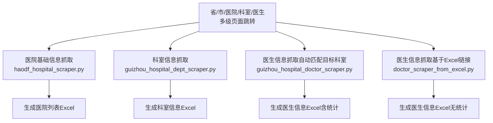
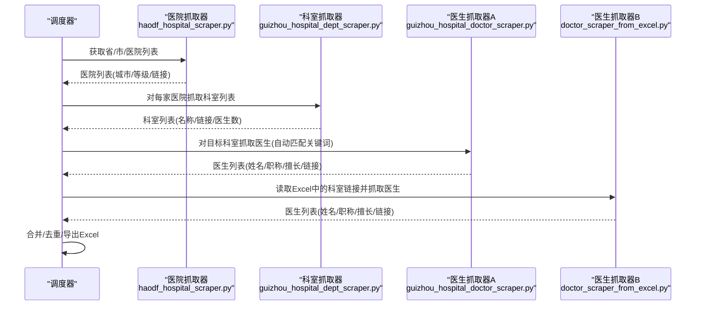
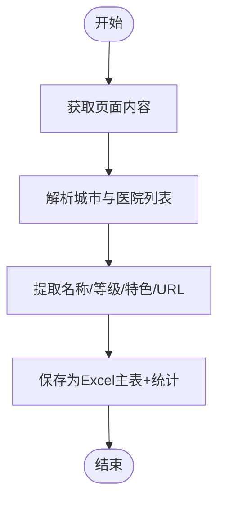
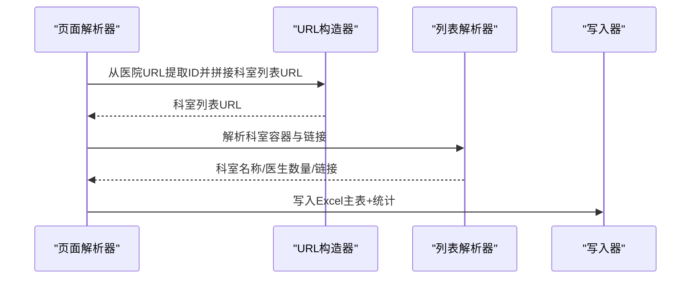
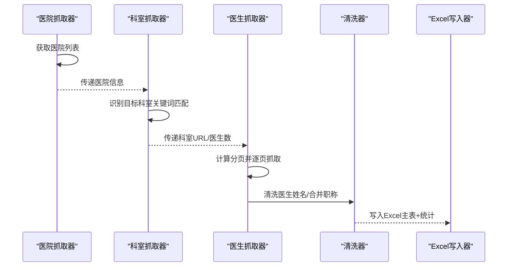
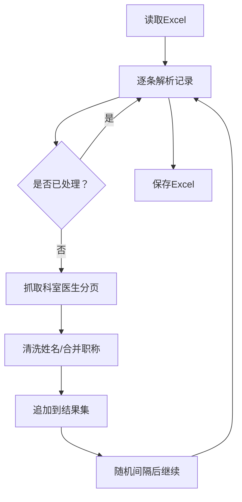
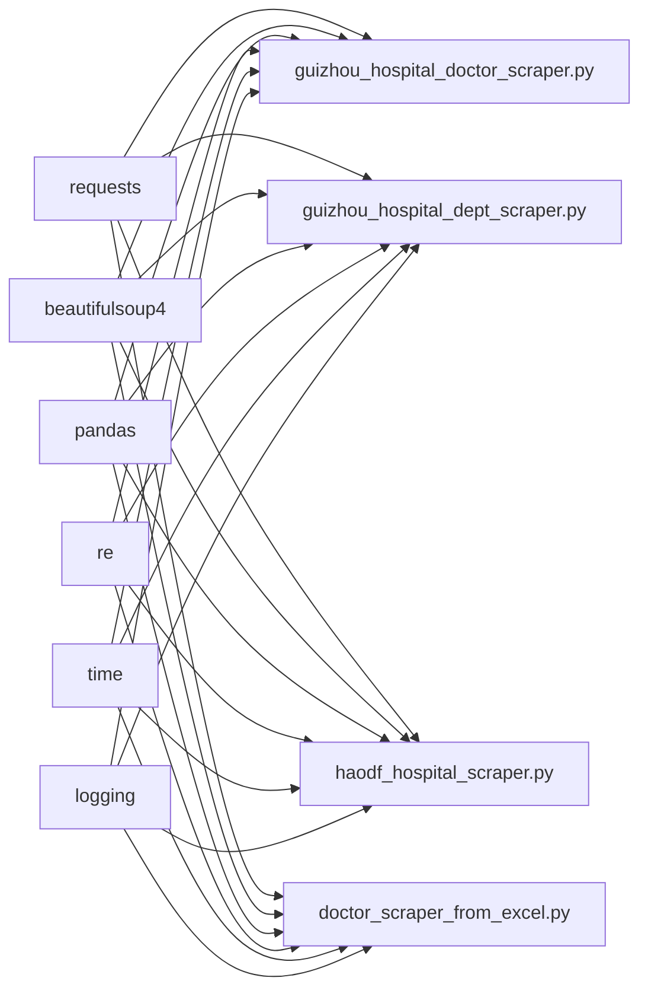

# 医院数据抓取

<cite>
**本文引用的文件**
- [guizhou_hospital_doctor_scraper.py](file://医院/guizhou_hospital_doctor_scraper.py)
- [haodf_hospital_scraper.py](file://医院/haodf_hospital_scraper.py)
- [doctor_scraper_from_excel.py](file://医院/doctor_scraper_from_excel.py)
- [guizhou_hospital_dept_scraper.py](file://医院/guizhou_hospital_dept_scraper.py)
</cite>

## 目录
1. [简介](#简介)
2. [项目结构](#项目结构)
3. [核心组件](#核心组件)
4. [架构总览](#架构总览)
5. [详细组件分析](#详细组件分析)
6. [依赖关系分析](#依赖关系分析)
7. [性能与稳定性考虑](#性能与稳定性考虑)
8. [故障排查指南](#故障排查指南)
9. [结论](#结论)
10. [附录](#附录)

## 简介
本文件面向“从好大夫在线网站抓取贵州省医院及医生信息”的技术实现，系统性梳理以下方面：
- 多脚本协同工作流：从医院列表、科室识别（关键词匹配）、医生信息提取，到基于Excel补充抓取的完整链路
- 反爬虫应对策略：User-Agent伪装、指数退避重试、请求间隔控制
- 数据清洗与标准化：医生姓名去重、职称信息合并、科室名称规范化
- 多级页面跳转与分页处理：省/市/医院/科室/医生的层级导航与分页
- 最佳实践：去重与合并策略，确保最终数据的准确性与完整性

## 项目结构
围绕“贵州省”目标区域，仓库提供了四类抓取脚本，分别承担不同阶段的数据采集职责：
- 医院基础信息抓取：haodf_hospital_scraper.py
- 科室信息抓取：guizhou_hospital_dept_scraper.py
- 医生信息抓取（自动发现目标科室）：guizhou_hospital_doctor_scraper.py
- 医生信息抓取（基于已有Excel链接补充）：doctor_scraper_from_excel.py

图表来源
- [haodf_hospital_scraper.py](file://医院/haodf_hospital_scraper.py#L1-L183)
- [guizhou_hospital_dept_scraper.py](file://医院/guizhou_hospital_dept_scraper.py#L1-L391)
- [guizhou_hospital_doctor_scraper.py](file://医院/guizhou_hospital_doctor_scraper.py#L1-L529)
- [doctor_scraper_from_excel.py](file://医院/doctor_scraper_from_excel.py#L1-L310)

章节来源
- [haodf_hospital_scraper.py](file://医院/haodf_hospital_scraper.py#L1-L183)
- [guizhou_hospital_dept_scraper.py](file://医院/guizhou_hospital_dept_scraper.py#L1-L391)
- [guizhou_hospital_doctor_scraper.py](file://医院/guizhou_hospital_doctor_scraper.py#L1-L529)
- [doctor_scraper_from_excel.py](file://医院/doctor_scraper_from_excel.py#L1-L310)

## 核心组件
- 请求与解析层：统一使用 requests + BeautifulSoup，封装 get_page 实现超时、编码与异常重试
- 页面导航层：按省/市/医院/科室/医生逐级跳转，构造分页URL并遍历
- 关键词匹配层：针对目标科室（呼吸、儿科、妇科、泌尿、肾内科、中医、全科）进行模糊匹配
- 数据清洗层：清洗医生姓名、合并职称与学历信息、标准化科室名称
- 输出层：统一导出Excel，包含主表与统计表

章节来源
- [guizhou_hospital_doctor_scraper.py](file://医院/guizhou_hospital_doctor_scraper.py#L56-L100)
- [guizhou_hospital_doctor_scraper.py](file://医院/guizhou_hospital_doctor_scraper.py#L178-L283)
- [guizhou_hospital_doctor_scraper.py](file://医院/guizhou_hospital_doctor_scraper.py#L285-L390)
- [guizhou_hospital_doctor_scraper.py](file://医院/guizhou_hospital_doctor_scraper.py#L391-L414)
- [guizhou_hospital_doctor_scraper.py](file://医院/guizhou_hospital_doctor_scraper.py#L470-L526)
- [guizhou_hospital_dept_scraper.py](file://医院/guizhou_hospital_dept_scraper.py#L43-L58)
- [guizhou_hospital_dept_scraper.py](file://医院/guizhou_hospital_dept_scraper.py#L152-L283)
- [guizhou_hospital_dept_scraper.py](file://医院/guizhou_hospital_dept_scraper.py#L285-L373)
- [haodf_hospital_scraper.py](file://医院/haodf_hospital_scraper.py#L23-L35)
- [haodf_hospital_scraper.py](file://医院/haodf_hospital_scraper.py#L36-L117)
- [haodf_hospital_scraper.py](file://医院/haodf_hospital_scraper.py#L118-L154)
- [doctor_scraper_from_excel.py](file://医院/doctor_scraper_from_excel.py#L55-L70)
- [doctor_scraper_from_excel.py](file://医院/doctor_scraper_from_excel.py#L105-L209)
- [doctor_scraper_from_excel.py](file://医院/doctor_scraper_from_excel.py#L211-L234)
- [doctor_scraper_from_excel.py](file://医院/doctor_scraper_from_excel.py#L284-L302)

## 架构总览
整体抓取流程遵循“先广度后深度”的策略：先抓取医院与科室，再抓取医生；同时提供两种医生抓取模式：自动匹配目标科室或基于已有Excel链接补充。

图表来源
- [haodf_hospital_scraper.py](file://医院/haodf_hospital_scraper.py#L155-L183)
- [guizhou_hospital_dept_scraper.py](file://医院/guizhou_hospital_dept_scraper.py#L285-L327)
- [guizhou_hospital_doctor_scraper.py](file://医院/guizhou_hospital_doctor_scraper.py#L415-L469)
- [doctor_scraper_from_excel.py](file://医院/doctor_scraper_from_excel.py#L235-L283)

## 详细组件分析

### 组件A：医院基础信息抓取（haodf_hospital_scraper.py）
- 功能要点
  - 从指定页面抓取贵州省医院列表，解析城市、医院名称、等级、特色科室、URL
  - 支持多种HTML结构变体，通过兄弟节点/父节点查找与正则提取等级与特色
  - 导出Excel，包含主表与统计信息（总医院数、城市数、三甲/二甲数量等）

图表来源
- [haodf_hospital_scraper.py](file://医院/haodf_hospital_scraper.py#L23-L35)
- [haodf_hospital_scraper.py](file://医院/haodf_hospital_scraper.py#L36-L117)
- [haodf_hospital_scraper.py](file://医院/haodf_hospital_scraper.py#L118-L154)

章节来源
- [haodf_hospital_scraper.py](file://医院/haodf_hospital_scraper.py#L1-L183)

### 组件B：科室信息抓取（guizhou_hospital_dept_scraper.py）
- 功能要点
  - 从医院详情页抓取科室列表，支持两类结构：按大类组织与直接列表
  - 通过正则提取医院ID构造科室列表URL，解析科室名称、医生数量与链接
  - 导出Excel，包含主表与统计（总科室数、医院数、城市数、总医生数）

图表来源
- [guizhou_hospital_dept_scraper.py](file://医院/guizhou_hospital_dept_scraper.py#L152-L283)
- [guizhou_hospital_dept_scraper.py](file://医院/guizhou_hospital_dept_scraper.py#L285-L373)

章节来源
- [guizhou_hospital_dept_scraper.py](file://医院/guizhou_hospital_dept_scraper.py#L1-L391)

### 组件C：医生信息抓取（自动匹配目标科室）（guizhou_hospital_doctor_scraper.py）
- 功能要点
  - 从医院列表页获取目标省份的医院清单（含城市、等级、URL）
  - 识别目标科室（关键词：呼吸、儿科、妇科、泌尿、肾内科、中医、全科），支持模糊匹配
  - 分页抓取医生列表，解析姓名、职称、擅长领域、医生链接
  - 数据清洗：去除科室前缀与常见职称后缀，合并学历/教授信息
  - 导出Excel，包含主表与按医院/科室统计

图表来源
- [guizhou_hospital_doctor_scraper.py](file://医院/guizhou_hospital_doctor_scraper.py#L72-L177)
- [guizhou_hospital_doctor_scraper.py](file://医院/guizhou_hospital_doctor_scraper.py#L178-L283)
- [guizhou_hospital_doctor_scraper.py](file://医院/guizhou_hospital_doctor_scraper.py#L285-L390)
- [guizhou_hospital_doctor_scraper.py](file://医院/guizhou_hospital_doctor_scraper.py#L391-L414)
- [guizhou_hospital_doctor_scraper.py](file://医院/guizhou_hospital_doctor_scraper.py#L470-L526)

章节来源
- [guizhou_hospital_doctor_scraper.py](file://医院/guizhou_hospital_doctor_scraper.py#L1-L529)

### 组件D：医生信息抓取（基于Excel链接补充）（doctor_scraper_from_excel.py）
- 功能要点
  - 从Excel读取“医院名称/所属城市/医院等级/科室名称/科室链接/医生数量”
  - 逐条抓取科室医生，支持分页
  - 去重：以“医院+科室”为标识避免重复抓取
  - 导出Excel，仅包含主表

图表来源
- [doctor_scraper_from_excel.py](file://医院/doctor_scraper_from_excel.py#L71-L104)
- [doctor_scraper_from_excel.py](file://医院/doctor_scraper_from_excel.py#L105-L209)
- [doctor_scraper_from_excel.py](file://医院/doctor_scraper_from_excel.py#L211-L234)
- [doctor_scraper_from_excel.py](file://医院/doctor_scraper_from_excel.py#L235-L302)

章节来源
- [doctor_scraper_from_excel.py](file://医院/doctor_scraper_from_excel.py#L1-L310)

## 依赖关系分析
- 组件耦合
  - 四个脚本均依赖 requests、BeautifulSoup、pandas、re、time、logging 等标准库
  - 业务上存在“医院→科室→医生”的强依赖关系，且存在“科室→医生”的独立抓取路径（Excel补充）
- 外部依赖
  - 好大夫在线网站结构变化可能导致选择器失效，需在解析函数中增加容错与回退策略
- 潜在循环依赖
  - 无直接循环导入；通过模块间调用实现协作

图表来源
- [guizhou_hospital_doctor_scraper.py](file://医院/guizhou_hospital_doctor_scraper.py#L1-L50)
- [guizhou_hospital_dept_scraper.py](file://医院/guizhou_hospital_dept_scraper.py#L1-L42)
- [haodf_hospital_scraper.py](file://医院/haodf_hospital_scraper.py#L1-L22)
- [doctor_scraper_from_excel.py](file://医院/doctor_scraper_from_excel.py#L1-L39)

章节来源
- [guizhou_hospital_doctor_scraper.py](file://医院/guizhou_hospital_doctor_scraper.py#L1-L50)
- [guizhou_hospital_dept_scraper.py](file://医院/guizhou_hospital_dept_scraper.py#L1-L42)
- [haodf_hospital_scraper.py](file://医院/haodf_hospital_scraper.py#L1-L22)
- [doctor_scraper_from_excel.py](file://医院/doctor_scraper_from_excel.py#L1-L39)

## 性能与稳定性考虑
- 反爬虫应对
  - User-Agent伪装：统一设置浏览器UA与Accept头，模拟真实访问
  - 指数退避重试：get_page实现最大重试次数与指数等待，降低被封风险
  - 请求间隔控制：在不同脚本中采用固定或随机间隔，避免触发限流
- 解析健壮性
  - 多种选择器与回退策略：当首选选择器未命中时，尝试备用规则
  - 编码处理：统一设置UTF-8编码，避免乱码
- 数据质量
  - 清洗与合并：统一清洗医生姓名、合并职称与学历信息
  - 去重：基于“医院+科室”标识避免重复抓取

章节来源
- [guizhou_hospital_doctor_scraper.py](file://医院/guizhou_hospital_doctor_scraper.py#L30-L41)
- [guizhou_hospital_doctor_scraper.py](file://医院/guizhou_hospital_doctor_scraper.py#L56-L71)
- [guizhou_hospital_doctor_scraper.py](file://医院/guizhou_hospital_doctor_scraper.py#L458-L463)
- [guizhou_hospital_dept_scraper.py](file://医院/guizhou_hospital_dept_scraper.py#L30-L38)
- [guizhou_hospital_dept_scraper.py](file://医院/guizhou_hospital_dept_scraper.py#L43-L58)
- [guizhou_hospital_dept_scraper.py](file://医院/guizhou_hospital_dept_scraper.py#L316-L321)
- [doctor_scraper_from_excel.py](file://医院/doctor_scraper_from_excel.py#L40-L51)
- [doctor_scraper_from_excel.py](file://医院/doctor_scraper_from_excel.py#L55-L70)
- [doctor_scraper_from_excel.py](file://医院/doctor_scraper_from_excel.py#L275-L277)

## 故障排查指南
- 页面获取失败
  - 现象：get_page返回None或抛出异常
  - 排查：检查网络连通、代理设置、User-Agent是否被屏蔽；查看日志中的重试次数与等待时间
  - 参考路径：[get_page](file://医院/guizhou_hospital_doctor_scraper.py#L56-L71)、[get_page](file://医院/guizhou_hospital_dept_scraper.py#L43-L58)、[get_page](file://医院/doctor_scraper_from_excel.py#L55-L70)
- HTML结构变化导致解析失败
  - 现象：找不到城市/医院/科室/医生列表容器
  - 排查：确认选择器是否仍有效；增加兄弟节点/父节点查找与正则回退
  - 参考路径：[解析医院列表](file://医院/haodf_hospital_scraper.py#L36-L117)、[解析科室列表](file://医院/guizhou_hospital_dept_scraper.py#L152-L283)
- 分页抓取不完整
  - 现象：医生数量不足或提前终止
  - 排查：确认分页URL构造逻辑与“当前页为空即停止”的判断
  - 参考路径：[分页抓取医生](file://医院/guizhou_hospital_doctor_scraper.py#L285-L390)、[分页抓取医生](file://医院/doctor_scraper_from_excel.py#L105-L209)
- 数据重复或姓名不规范
  - 现象：同一位医生重复、姓名包含职称或科室前缀
  - 排查：检查清洗逻辑与去重标识
  - 参考路径：[清洗医生姓名](file://医院/guizhou_hospital_doctor_scraper.py#L391-L414)、[去重标识](file://医院/doctor_scraper_from_excel.py#L259-L272)

章节来源
- [guizhou_hospital_doctor_scraper.py](file://医院/guizhou_hospital_doctor_scraper.py#L56-L71)
- [guizhou_hospital_doctor_scraper.py](file://医院/guizhou_hospital_doctor_scraper.py#L285-L390)
- [guizhou_hospital_doctor_scraper.py](file://医院/guizhou_hospital_doctor_scraper.py#L391-L414)
- [guizhou_hospital_dept_scraper.py](file://医院/guizhou_hospital_dept_scraper.py#L152-L283)
- [doctor_scraper_from_excel.py](file://医院/doctor_scraper_from_excel.py#L105-L209)
- [doctor_scraper_from_excel.py](file://医院/doctor_scraper_from_excel.py#L259-L272)

## 结论
本仓库通过四个脚本实现了从省/市/医院/科室/医生的完整抓取闭环，并提供了两种医生抓取模式以满足不同场景需求。整体方案具备良好的健壮性与扩展性：解析层具备多策略回退、清洗层保证数据质量、输出层提供统计维度，便于后续治理与分析。

## 附录

### 多级页面跳转与分页处理机制
- 省/市/医院/科室/医生的层级导航
  - 从省列表页获取医院清单，再进入医院详情页获取科室列表，最后进入科室详情页抓取医生
  - 参考路径：[获取医院列表](file://医院/haodf_hospital_scraper.py#L36-L117)、[获取科室列表](file://医院/guizhou_hospital_dept_scraper.py#L152-L283)、[获取医生列表](file://医院/guizhou_hospital_doctor_scraper.py#L285-L390)
- 分页处理
  - 依据每页固定数量计算总页数，逐页抓取；若某页为空则提前终止
  - 参考路径：[分页计算与抓取](file://医院/guizhou_hospital_doctor_scraper.py#L289-L307)、[分页计算与抓取](file://医院/doctor_scraper_from_excel.py#L109-L127)

### 数据清洗与标准化
- 医生姓名清洗
  - 去除科室前缀与常见职称后缀，清理多余空格与数字
  - 参考路径：[清洗逻辑](file://医院/guizhou_hospital_doctor_scraper.py#L391-L414)、[清洗逻辑](file://医院/doctor_scraper_from_excel.py#L211-L234)
- 职称信息合并
  - 将学历/教授信息与职称合并，形成更完整的职称描述
  - 参考路径：[合并逻辑](file://医院/guizhou_hospital_doctor_scraper.py#L339-L349)、[合并逻辑](file://医院/doctor_scraper_from_excel.py#L159-L169)
- 科室名称标准化
  - 通过关键词匹配与结构化解析，确保科室名称一致性
  - 参考路径：[关键词匹配](file://医院/guizhou_hospital_doctor_scraper.py#L42-L51)、[解析科室名称](file://医院/guizhou_hospital_dept_scraper.py#L190-L204)

### 反爬虫应对策略
- User-Agent伪装与请求头设置
  - 统一设置浏览器UA与Accept头，模拟真实用户行为
  - 参考路径：[伪装头设置](file://医院/guizhou_hospital_doctor_scraper.py#L30-L41)、[伪装头设置](file://医院/guizhou_hospital_dept_scraper.py#L30-L38)、[伪装头设置](file://医院/doctor_scraper_from_excel.py#L40-L51)、[伪装头设置](file://医院/haodf_hospital_scraper.py#L19-L22)
- 指数退避重试
  - 在网络异常或状态码异常时自动重试，并按指数增长等待
  - 参考路径：[重试逻辑](file://医院/guizhou_hospital_doctor_scraper.py#L56-L71)、[重试逻辑](file://医院/guizhou_hospital_dept_scraper.py#L43-L58)、[重试逻辑](file://医院/doctor_scraper_from_excel.py#L55-L70)
- 请求间隔控制
  - 在处理完一家医院或一个科室后设置固定或随机间隔，降低请求频率
  - 参考路径：[间隔控制](file://医院/guizhou_hospital_doctor_scraper.py#L458-L463)、[间隔控制](file://医院/guizhou_hospital_dept_scraper.py#L316-L321)、[间隔控制](file://医院/doctor_scraper_from_excel.py#L275-L277)

### 数据去重与合并最佳实践
- 去重策略
  - 基于“医院+科室”标识避免重复抓取；对Excel补充抓取时同样应用
  - 参考路径：[去重标识](file://医院/doctor_scraper_from_excel.py#L259-L272)
- 合并策略
  - 职称与学历信息合并，确保字段完整性；姓名清洗后统一格式
  - 参考路径：[合并逻辑](file://医院/guizhou_hospital_doctor_scraper.py#L339-L349)、[清洗逻辑](file://医院/guizhou_hospital_doctor_scraper.py#L391-L414)
- 输出建议
  - 主表包含关键字段（医院/城市/等级/科室/医生姓名/职称/擅长/链接/抓取时间）
  - 统计表包含按医院/科室的汇总，便于核验与二次分析
  - 参考路径：[导出主表与统计](file://医院/guizhou_hospital_doctor_scraper.py#L470-L526)、[导出主表与统计](file://医院/guizhou_hospital_dept_scraper.py#L328-L373)、[导出主表](file://医院/doctor_scraper_from_excel.py#L284-L302)