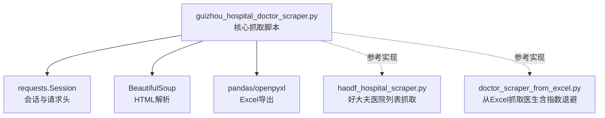
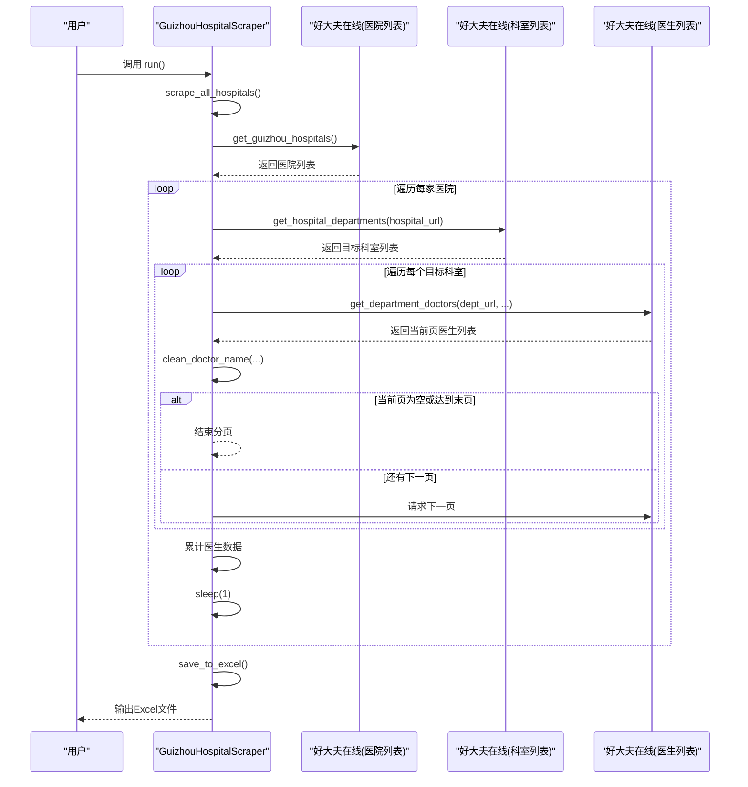
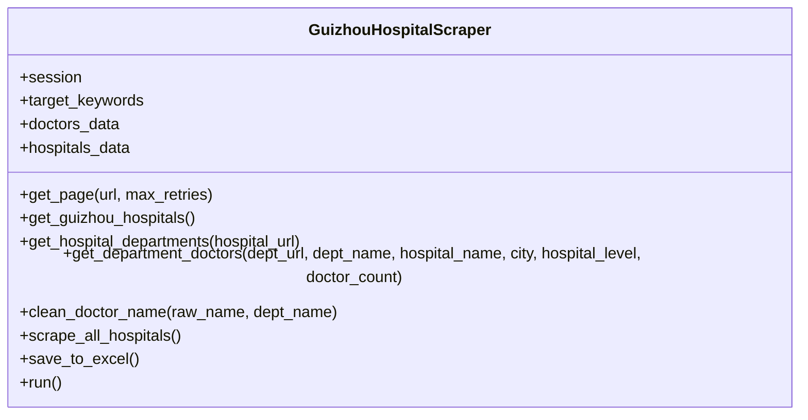
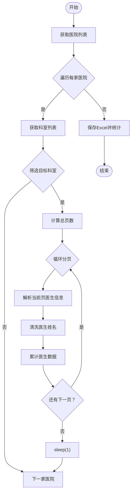
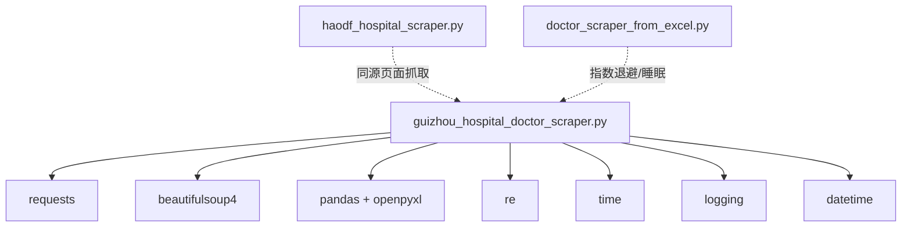

# 医生信息抓取

<cite>
**本文引用的文件**
- [guizhou_hospital_doctor_scraper.py](file://医院/guizhou_hospital_doctor_scraper.py)
- [haodf_hospital_scraper.py](file://医院/haodf_hospital_scraper.py)
- [doctor_scraper_from_excel.py](file://医院/doctor_scraper_from_excel.py)
</cite>

## 目录
1. [简介](#简介)
2. [项目结构](#项目结构)
3. [核心组件](#核心组件)
4. [架构总览](#架构总览)
5. [详细组件分析](#详细组件分析)
6. [依赖关系分析](#依赖关系分析)
7. [性能考虑](#性能考虑)
8. [故障排查指南](#故障排查指南)
9. [结论](#结论)
10. [附录](#附录)

## 简介
本文件深入解析贵州省医院医生信息抓取脚本的技术实现，聚焦于 GuizhouHospitalScraper 类的设计与实现。该脚本面向“好大夫在线”网站，目标是抓取贵州省范围内若干重点科室（如呼吸、儿科、妇科、泌尿、肾内科、中医、全科等）的医生详细信息。文档将系统阐述以下关键点：
- 使用 requests.Session 维持会话与配置 User-Agent 等请求头以模拟浏览器行为
- 多级页面抓取流程：获取医院列表 -> 获取科室列表 -> 抓取目标科室医生信息
- 目标科室过滤机制：基于关键词列表对科室名称进行匹配
- 分页处理逻辑：依据医生数量计算总页数并构造分页 URL
- 医生信息提取与清洗：解析姓名、职称、擅长领域，并清洗姓名中的冗余信息
- 反爬虫策略：指数退避与请求间隔 sleep
- 数据导出：将抓取结果保存为包含“医生信息”、“医院统计”、“科室统计”的 Excel 文件

## 项目结构
该仓库包含多个与医院、药店相关的自动化脚本。与本主题直接相关的文件位于“医院”目录下，其中 guizhou_hospital_doctor_scraper.py 是本次分析的核心；另外还提供了同源的科室抓取脚本与好大夫医院列表抓取脚本作为参考。

图表来源
- [guizhou_hospital_doctor_scraper.py](file://医院/guizhou_hospital_doctor_scraper.py#L30-L529)
- [haodf_hospital_scraper.py](file://医院/haodf_hospital_scraper.py#L1-L183)
- [doctor_scraper_from_excel.py](file://医院/doctor_scraper_from_excel.py#L40-L70)

章节来源
- [guizhou_hospital_doctor_scraper.py](file://医院/guizhou_hospital_doctor_scraper.py#L1-L529)

## 核心组件
- GuizhouHospitalScraper 类：封装所有抓取逻辑，包括会话管理、页面获取、目标科室筛选、分页抓取、数据清洗与导出。
- 关键字段与职责
  - session：维持 HTTP 会话，统一注入浏览器请求头，降低被识别为爬虫的概率
  - target_keywords：目标科室关键词集合，用于科室名称匹配
  - doctors_data / hospitals_data：分别存储医生与医院统计数据
- 关键方法
  - get_page：带指数退避的页面获取，提升稳定性
  - get_guizhou_hospitals：抓取贵州省医院列表（含城市、等级、URL）
  - get_hospital_departments：抓取某医院的科室列表，匹配目标关键词
  - get_department_doctors：抓取目标科室的医生列表，支持分页
  - clean_doctor_name：清洗医生姓名，去除冗余信息
  - scrape_all_hospitals：串联全流程抓取
  - save_to_excel：将医生信息与统计信息导出为 Excel
  - run：入口执行流程

章节来源
- [guizhou_hospital_doctor_scraper.py](file://医院/guizhou_hospital_doctor_scraper.py#L30-L529)

## 架构总览
整体抓取流程采用“三级联动”模式：先抓取医院列表，再逐医院抓取科室列表，最后对目标科室进行分页抓取医生信息。GuizhouHospitalScraper 通过统一的 Session 与请求头模拟浏览器，结合指数退避与 sleep 控制请求频率，降低反爬虫风险。

图表来源
- [guizhou_hospital_doctor_scraper.py](file://医院/guizhou_hospital_doctor_scraper.py#L415-L526)

## 详细组件分析

### GuizhouHospitalScraper 类设计
- 会话与请求头
  - 使用 requests.Session 并注入 User-Agent、Accept、Accept-Language、Accept-Encoding、Connection、Upgrade-Insecure-Requests 等头部，模拟现代浏览器访问，提高成功率与稳定性
- 目标科室关键词
  - 通过 self.target_keywords 列表对科室名称进行模糊匹配，覆盖呼吸、儿科、妇科、泌尿、肾内科、中医、全科等常见方向
- 数据收集
  - doctors_data 存储每位医生的完整信息
  - hospitals_data 记录每家医院的目标科室数量与科室列表，便于后续统计

图表来源
- [guizhou_hospital_doctor_scraper.py](file://医院/guizhou_hospital_doctor_scraper.py#L30-L529)

章节来源
- [guizhou_hospital_doctor_scraper.py](file://医院/guizhou_hospital_doctor_scraper.py#L30-L529)

### 多级页面抓取流程
- 获取医院列表
  - 从指定 URL 抓取页面，解析城市标题与医院列表，提取医院名称、所在城市、等级、URL 等信息
  - 对解析到的医院 URL 进行补全（若为相对路径），确保后续抓取可用
- 获取科室列表
  - 从医院详情页提取科室链接，优先使用特定类名定位；若未命中，则回退到按医院 ID 或包含“/keshi/”的链接进行二次匹配
  - 在调试阶段会打印前若干个科室的解析过程，便于定位 HTML 结构变化
  - 从每个科室链接中提取“医生数量”，用于后续分页计算
- 抓取目标科室医生信息
  - 仅对匹配到目标关键词的科室进行抓取
  - 计算总页数：若已知医生数量则按每页 20 人向上取整；否则默认最多抓取若干页
  - 构造分页 URL：基础 URL 通常为“/tuijian.html”，第一页附加“?type=keshi”，后续页附加“&p=页码”
  - 解析每页医生列表，提取姓名、职称、擅长领域，并清洗姓名
  - 若某页无医生，提前终止分页循环

图表来源
- [guizhou_hospital_doctor_scraper.py](file://医院/guizhou_hospital_doctor_scraper.py#L415-L526)

章节来源
- [guizhou_hospital_doctor_scraper.py](file://医院/guizhou_hospital_doctor_scraper.py#L72-L390)

### 目标科室过滤机制
- 过滤方式
  - 对每个科室名称进行关键词匹配，只要包含任一目标关键词即视为“目标科室”
- 关键词覆盖
  - 呼吸、儿科、儿内科、妇科、妇产科、泌尿、肾脏、肾内科、肾病、中医、全科等
- 实现位置
  - 在获取科室列表时，对每个科室名称进行匹配并记录匹配结果，最终仅保留匹配成功的科室

章节来源
- [guizhou_hospital_doctor_scraper.py](file://医院/guizhou_hospital_doctor_scraper.py#L42-L51)
- [guizhou_hospital_doctor_scraper.py](file://医院/guizhou_hospital_doctor_scraper.py#L235-L283)

### 分页处理逻辑
- 总页数计算
  - 若已知医生数量 doctor_count，则 total_pages = max(1, ceil(doctor_count / 20))
  - 若未知，则默认最多抓取若干页（避免死循环）
- 分页 URL 构造
  - 基础 URL：若原 URL 为“/keshi/...”，替换“.html”为“/tuijian.html”；否则直接追加“/tuijian.html”
  - 第一页参数：type=keshi
  - 后续页参数：type=keshi&p=页码
- 中止条件
  - 若某页未解析到任何医生，认为已到达末页，提前结束

章节来源
- [guizhou_hospital_doctor_scraper.py](file://医院/guizhou_hospital_doctor_scraper.py#L285-L307)
- [guizhou_hospital_doctor_scraper.py](file://医院/guizhou_hospital_doctor_scraper.py#L290-L307)
- [guizhou_hospital_doctor_scraper.py](file://医院/guizhou_hospital_doctor_scraper.py#L385-L388)

### 医生信息提取与清洗
- 信息提取
  - 医生姓名：从特定类名的元素中提取原始文本
  - 职称：从特定类名的元素中提取，必要时合并学历/教授信息
  - 擅长领域：从特定类名的段落中提取，去除“擅长：”前缀
  - 医生链接：拼接完整 URL
- 姓名清洗
  - 移除科室名称前缀
  - 移除常见职称后缀（主任医师、副主任医师、主治医师、住院医师、教授、副教授、讲师、科主任、副主任、主任、评分数字等）
  - 去除多余空白与特殊字符，保留有效姓名
- 数据完整性
  - 仅当姓名长度满足一定要求时才计入结果，避免空值或异常

章节来源
- [guizhou_hospital_doctor_scraper.py](file://医院/guizhou_hospital_doctor_scraper.py#L332-L374)
- [guizhou_hospital_doctor_scraper.py](file://医院/guizhou_hospital_doctor_scraper.py#L391-L414)

### 反爬虫策略
- 指数退避
  - get_page 方法在请求失败时按 2^attempt 的延迟进行重试，最多尝试指定次数
- 请求间隔
  - 每处理完一个科室后 sleep(1)，每处理完一家医院后 sleep(2)，降低请求频率
- 请求头模拟
  - 统一注入浏览器请求头，提升通过率

章节来源
- [guizhou_hospital_doctor_scraper.py](file://医院/guizhou_hospital_doctor_scraper.py#L56-L71)
- [guizhou_hospital_doctor_scraper.py](file://医院/guizhou_hospital_doctor_scraper.py#L458-L462)

### 数据导出与统计
- 导出内容
  - “医生信息”工作表：包含医院名称、所属城市、医院等级、科室名称、医生姓名、职称、擅长领域、医生链接、抓取时间等字段
  - “医院统计”工作表：按医院分组统计医生数量与覆盖科室列表
  - “科室统计”工作表：按科室分组统计医生数量与覆盖医院列表
- 文件命名
  - 使用当前时间戳作为后缀，避免覆盖历史文件

章节来源
- [guizhou_hospital_doctor_scraper.py](file://医院/guizhou_hospital_doctor_scraper.py#L470-L504)

## 依赖关系分析
- 内部依赖
  - GuizhouHospitalScraper 依赖 requests（会话与请求）、BeautifulSoup（HTML 解析）、pandas/openpyxl（Excel 导出）、re（正则匹配）、time（延时控制）、logging（日志）、datetime（时间戳）
- 外部参考
  - haodf_hospital_scraper.py 展示了类似的“好大夫在线”页面抓取思路（医院列表）
  - doctor_scraper_from_excel.py 展示了从 Excel 读取数据并进行抓取的模式，且同样实现了指数退避与 sleep 控制

图表来源
- [guizhou_hospital_doctor_scraper.py](file://医院/guizhou_hospital_doctor_scraper.py#L1-L20)
- [haodf_hospital_scraper.py](file://医院/haodf_hospital_scraper.py#L1-L22)
- [doctor_scraper_from_excel.py](file://医院/doctor_scraper_from_excel.py#L40-L70)

章节来源
- [guizhou_hospital_doctor_scraper.py](file://医院/guizhou_hospital_doctor_scraper.py#L1-L20)
- [haodf_hospital_scraper.py](file://医院/haodf_hospital_scraper.py#L1-L22)
- [doctor_scraper_from_excel.py](file://医院/doctor_scraper_from_excel.py#L40-L70)

## 性能考虑
- 请求频率控制
  - 每科室 sleep(1)，每医院 sleep(2)，可显著降低被限速或封禁的风险
- 分页上限
  - 未知医生数量时设置最大页数，避免无效请求
- HTML 解析健壮性
  - 多种选择器与回退策略，增强对页面结构变化的适应能力
- 日志与统计
  - 通过日志输出中间状态，便于定位问题；run 方法提供统计摘要，辅助评估抓取效果

[本节为通用建议，不直接分析具体代码文件]

## 故障排查指南
- 页面获取失败
  - 检查网络连通性与代理设置
  - 观察 get_page 的日志输出，确认是否触发指数退避与最终失败
- 科室列表为空
  - 确认 HTML 结构是否发生变化；脚本已提供多种回退策略，仍可能需要更新选择器
  - 检查医院 URL 是否正确补全为绝对路径
- 医生列表为空
  - 确认目标关键词是否覆盖到实际科室名称
  - 检查分页 URL 构造是否正确（是否包含“/tuijian.html”）
- 姓名清洗异常
  - 检查 clean_doctor_name 的正则规则是否覆盖到实际数据形态
- Excel 导出失败
  - 确认 openpyxl 已安装，检查文件权限与磁盘空间

章节来源
- [guizhou_hospital_doctor_scraper.py](file://医院/guizhou_hospital_doctor_scraper.py#L56-L71)
- [guizhou_hospital_doctor_scraper.py](file://医院/guizhou_hospital_doctor_scraper.py#L178-L283)
- [guizhou_hospital_doctor_scraper.py](file://医院/guizhou_hospital_doctor_scraper.py#L285-L390)
- [guizhou_hospital_doctor_scraper.py](file://医院/guizhou_hospital_doctor_scraper.py#L391-L414)
- [guizhou_hospital_doctor_scraper.py](file://医院/guizhou_hospital_doctor_scraper.py#L470-L504)

## 结论
GuizhouHospitalScraper 通过统一的会话与请求头、多层回退的科室解析策略、指数退避与 sleep 控制、以及完善的姓名清洗与统计导出机制，构建了一个稳健、可维护的医生信息抓取框架。其目标科室关键词匹配与分页处理逻辑，能够有效聚焦重点科室并稳定获取医生数据。建议在页面结构变化时及时更新选择器，并持续监控日志与统计指标以优化抓取效率与成功率。

[本节为总结性内容，不直接分析具体代码文件]

## 附录
- 与其他脚本的关系
  - 与 haodf_hospital_scraper.py：同属“好大夫在线”页面抓取，前者聚焦医生，后者聚焦医院列表
  - 与 doctor_scraper_from_excel.py：同具指数退避与 sleep 控制，但前者从网页抓取，后者从 Excel 读取目标

章节来源
- [haodf_hospital_scraper.py](file://医院/haodf_hospital_scraper.py#L1-L183)
- [doctor_scraper_from_excel.py](file://医院/doctor_scraper_from_excel.py#L40-L70)