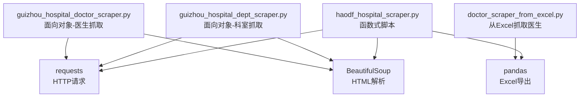
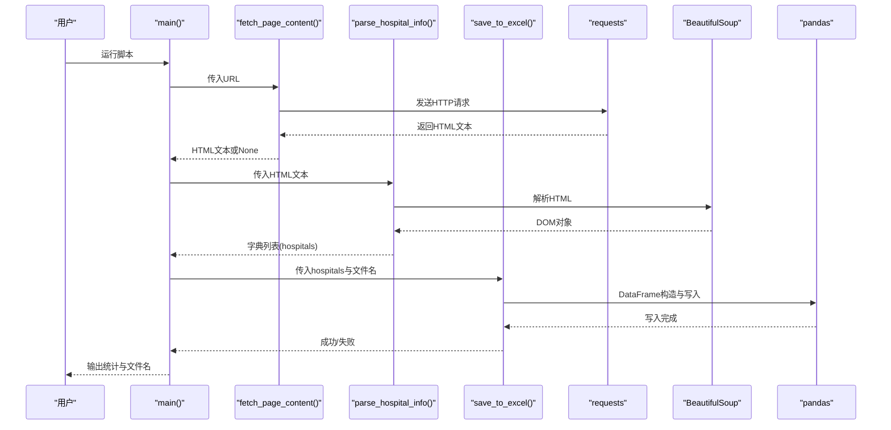
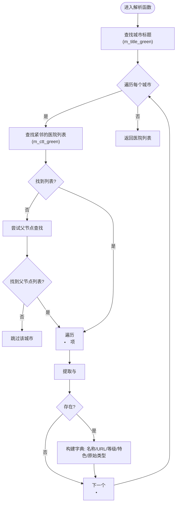
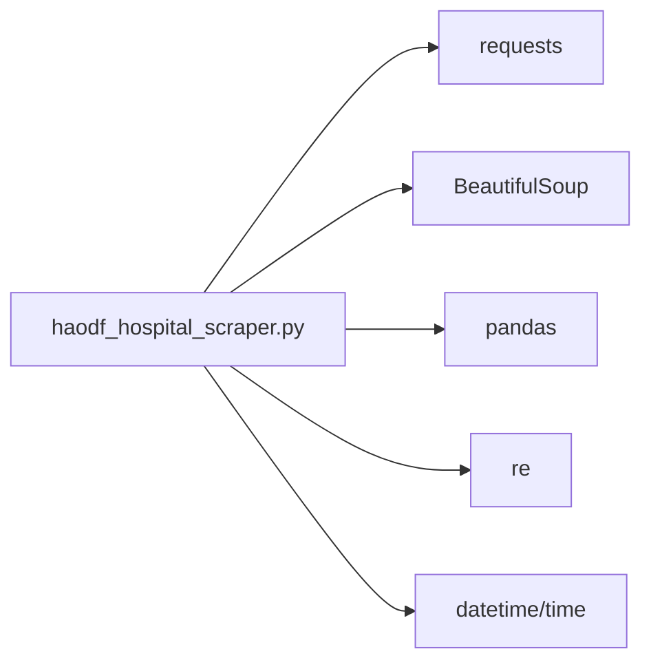

# 医院信息抓取

<cite>
**本文引用的文件**
- [haodf_hospital_scraper.py](file://医院/haodf_hospital_scraper.py)
- [guizhou_hospital_dept_scraper.py](file://医院/guizhou_hospital_dept_scraper.py)
- [guizhou_hospital_doctor_scraper.py](file://医院/guizhou_hospital_doctor_scraper.py)
- [doctor_scraper_from_excel.py](file://医院/doctor_scraper_from_excel.py)
</cite>

## 目录
1. [简介](#简介)
2. [项目结构](#项目结构)
3. [核心组件](#核心组件)
4. [架构总览](#架构总览)
5. [详细组件分析](#详细组件分析)
6. [依赖分析](#依赖分析)
7. [性能考虑](#性能考虑)
8. [故障排查指南](#故障排查指南)
9. [结论](#结论)
10. [附录](#附录)

## 简介
本文件围绕“好大夫在线贵州省医院信息抓取”脚本展开，系统性说明其如何从目标页面抓取数据、解析HTML、提取结构化信息，并将结果保存为Excel多工作表报表。重点包括：
- 使用 requests 发送HTTP请求获取网页内容；
- 使用 BeautifulSoup 解析HTML，定位城市标题与医院列表DOM元素；
- 从医院列表中提取医院名称、URL、等级与特色科室；
- 使用正则表达式解析span中的括号内容，分离等级与特色信息；
- 数据清洗与结构化，形成Python字典列表；
- 使用 pandas 保存为Excel，生成“医院列表”“统计信息”“城市统计”三个工作表；
- 展示 fetch_page_content、parse_hospital_info、save_to_excel 的调用关系与数据流；
- 对比分析该脚本与医生信息抓取脚本在设计上的异同（函数式 vs 面向对象）。

## 项目结构
本仓库中与“医院信息抓取”直接相关的文件位于“医院/”目录下，其中：
- haodf_hospital_scraper.py：本篇文档聚焦的脚本，负责抓取贵州省医院基础信息并导出Excel；
- guizhou_hospital_dept_scraper.py：面向对象版本的“贵州省医院信息抓取”，包含科室抓取逻辑；
- guizhou_hospital_doctor_scraper.py：面向对象版本的“贵州省医生信息抓取”，包含医院列表抓取、科室抓取与医生抓取；
- doctor_scraper_from_excel.py：从Excel读取医院/科室信息并抓取医生数据的脚本，体现“先清单后抓取”的流程。

图表来源
- [haodf_hospital_scraper.py](file://医院/haodf_hospital_scraper.py#L1-L183)
- [guizhou_hospital_dept_scraper.py](file://医院/guizhou_hospital_dept_scraper.py#L1-L200)
- [guizhou_hospital_doctor_scraper.py](file://医院/guizhou_hospital_doctor_scraper.py#L1-L200)
- [doctor_scraper_from_excel.py](file://医院/doctor_scraper_from_excel.py#L1-L200)

章节来源
- [haodf_hospital_scraper.py](file://医院/haodf_hospital_scraper.py#L1-L183)

## 核心组件
- 请求与解析层
  - fetch_page_content(url)：发送HTTP请求，自动检测编码，返回HTML文本；异常时返回None。
  - parse_hospital_info(html_content)：解析HTML，定位城市标题与医院列表，提取医院名称、URL、等级、特色科室，返回字典列表。
- 数据导出层
  - save_to_excel(hospitals, filename)：将字典列表转为DataFrame，写入Excel的“医院列表”“统计信息”“城市统计”三个工作表。
- 主流程
  - main()：串联上述步骤，打印进度与统计信息。

章节来源
- [haodf_hospital_scraper.py](file://医院/haodf_hospital_scraper.py#L23-L183)

## 架构总览
下图展示了从页面抓取到Excel导出的端到端流程，以及与面向对象脚本的关系映射。

图表来源
- [haodf_hospital_scraper.py](file://医院/haodf_hospital_scraper.py#L23-L183)

## 详细组件分析

### 页面内容获取：fetch_page_content
- 功能要点
  - 使用 requests.get 发送请求，设置超时与User-Agent头；
  - 自动检测响应编码，确保中文可正确显示；
  - 捕获异常并返回None，便于上层判断。
- 关键实现位置
  - [请求与编码处理](file://医院/haodf_hospital_scraper.py#L23-L34)

章节来源
- [haodf_hospital_scraper.py](file://医院/haodf_hospital_scraper.py#L23-L34)

### HTML解析与信息提取：parse_hospital_info
- DOM定位策略
  - 通过城市标题类名定位城市区块；
  - 在城市标题后查找相邻的医院列表容器，若无则回溯父节点查找；
  - 遍历列表项，提取链接与span标签内容。
- 字段提取与清洗
  - 医院名称与URL：从a标签提取，补全绝对URL；
  - 类型信息：从span提取原始文本，使用正则表达式解析括号内容；
  - 等级与特色：优先匹配“等级, 特色:科室”格式，其次兼容其他逗号分隔或单一括号内容；
  - 结果字典包含：城市、医院名称、等级、特色科室、URL、原始类型信息。
- 关键实现位置
  - [DOM定位与遍历](file://医院/haodf_hospital_scraper.py#L36-L116)
  - [正则解析括号内容](file://医院/haodf_hospital_scraper.py#L82-L101)

图表来源
- [haodf_hospital_scraper.py](file://医院/haodf_hospital_scraper.py#L36-L116)

章节来源
- [haodf_hospital_scraper.py](file://医院/haodf_hospital_scraper.py#L36-L116)

### Excel导出：save_to_excel
- 数据结构
  - 将字典列表转为DataFrame；
  - 写入三个工作表：
    - “医院列表”：原始字段；
    - “统计信息”：总医院数、城市数、三甲/二甲/其他数量；
    - “城市统计”：按城市分组统计数量。
- 关键实现位置
  - [DataFrame构造与写入](file://医院/haodf_hospital_scraper.py#L118-L154)

章节来源
- [haodf_hospital_scraper.py](file://医院/haodf_hospital_scraper.py#L118-L154)

### 主流程：main
- 调用顺序
  - fetch_page_content -> parse_hospital_info -> save_to_excel；
  - 打印抓取统计与输出文件名。
- 关键实现位置
  - [主流程与调用关系](file://医院/haodf_hospital_scraper.py#L155-L183)

章节来源
- [haodf_hospital_scraper.py](file://医院/haodf_hospital_scraper.py#L155-L183)

### 与医生/科室抓取脚本的设计对比
- 设计风格
  - 本脚本采用函数式编程：三个核心函数独立、职责清晰，适合一次性抓取与导出；
  - 医生/科室脚本采用面向对象：封装Session、统一请求与解析逻辑，便于扩展（如重试、日志、分页、多工作表等）。
- 功能范围
  - 本脚本仅抓取“医院基础信息”并导出Excel；
  - 医生/科室脚本包含“医院列表抓取、科室抓取、医生抓取”的完整链路，且具备更丰富的错误处理与日志记录。
- 关键实现位置
  - [函数式脚本](file://医院/haodf_hospital_scraper.py#L23-L183)
  - [面向对象-医院列表抓取](file://医院/guizhou_hospital_doctor_scraper.py#L72-L176)
  - [面向对象-科室抓取](file://医院/guizhou_hospital_dept_scraper.py#L152-L200)
  - [面向对象-医生抓取（从Excel读取）](file://医院/doctor_scraper_from_excel.py#L71-L200)

章节来源
- [haodf_hospital_scraper.py](file://医院/haodf_hospital_scraper.py#L23-L183)
- [guizhou_hospital_doctor_scraper.py](file://医院/guizhou_hospital_doctor_scraper.py#L72-L176)
- [guizhou_hospital_dept_scraper.py](file://医院/guizhou_hospital_dept_scraper.py#L152-L200)
- [doctor_scraper_from_excel.py](file://医院/doctor_scraper_from_excel.py#L71-L200)

## 依赖分析
- 外部库
  - requests：发送HTTP请求；
  - BeautifulSoup：解析HTML；
  - pandas：构造DataFrame与写入Excel；
  - re：正则表达式解析括号内容；
  - datetime/time：生成文件名与延时控制。
- 内部耦合
  - 三个函数之间通过字符串与字典传递数据，耦合度低，便于维护与复用；
  - 与外部站点结构强耦合：依赖特定的DOM类名与span括号格式。

图表来源
- [haodf_hospital_scraper.py](file://医院/haodf_hospital_scraper.py#L1-L22)

章节来源
- [haodf_hospital_scraper.py](file://医院/haodf_hospital_scraper.py#L1-L22)

## 性能考虑
- 网络请求
  - 设置超时与User-Agent，避免被反爬限制；
  - 如需批量抓取，建议增加指数退避与并发控制，避免触发限流。
- 解析效率
  - BeautifulSoup解析一次即可，后续操作尽量基于DOM对象；
  - 正则解析在循环中执行，建议保持正则简洁，必要时缓存编译后的正则对象。
- 导出性能
  - pandas写入Excel为单次I/O，注意磁盘空间与文件大小；
  - 大数据量时可考虑拆分工作表或分批写入。

## 故障排查指南
- 页面无法获取
  - 检查网络连通性与目标URL是否变更；
  - 观察异常捕获与返回值，确认返回None时上层逻辑是否终止。
  - 参考：[请求与异常处理](file://医院/haodf_hospital_scraper.py#L23-L34)
- HTML结构变化
  - 若城市标题或列表容器类名改变，解析将失败；
  - 建议在解析函数中增加容错分支与日志提示。
  - 参考：[DOM定位与容错](file://医院/haodf_hospital_scraper.py#L41-L59)
- 正则解析失败
  - span内容格式可能不一致，脚本已提供多格式匹配；
  - 建议补充更多样例并记录原始类型信息，便于人工校验。
  - 参考：[正则解析与回退](file://医院/haodf_hospital_scraper.py#L82-L101)
- Excel导出失败
  - 检查文件路径权限与磁盘空间；
  - 确认pandas与openpyxl安装正常。
  - 参考：[Excel写入与统计](file://医院/haodf_hospital_scraper.py#L118-L154)

章节来源
- [haodf_hospital_scraper.py](file://医院/haodf_hospital_scraper.py#L23-L154)

## 结论
本脚本以简洁的函数式设计实现了从好大夫在线抓取贵州省医院基础信息并导出Excel的目标。其关键在于：
- 稳定的DOM定位策略；
- 容错的正则解析与数据清洗；
- 结构化的字典列表与多工作表报表生成。

与面向对象的医生/科室抓取脚本相比，本脚本更轻量、易部署，适合一次性任务；而面向对象脚本更适合长期演进与扩展。

## 附录
- 实际调用关系与数据流
  - main() 调用 fetch_page_content() 获取HTML；
  - main() 调用 parse_hospital_info() 产出字典列表；
  - main() 调用 save_to_excel() 写入Excel并打印统计。
  - 参考：[主流程](file://医院/haodf_hospital_scraper.py#L155-L183)

章节来源
- [haodf_hospital_scraper.py](file://医院/haodf_hospital_scraper.py#L155-L183)