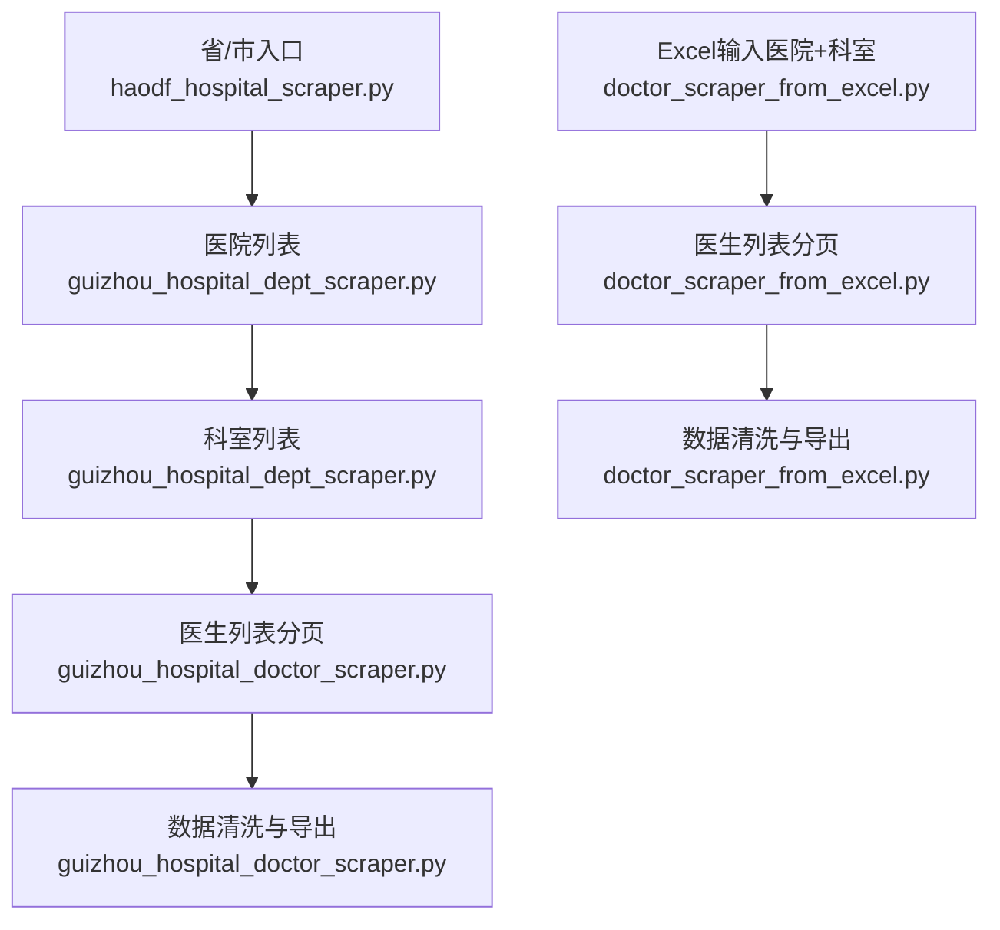
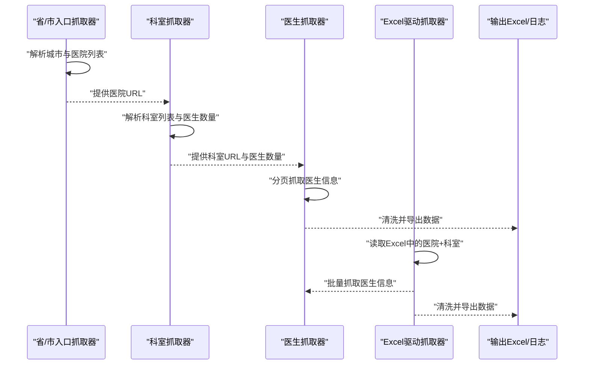
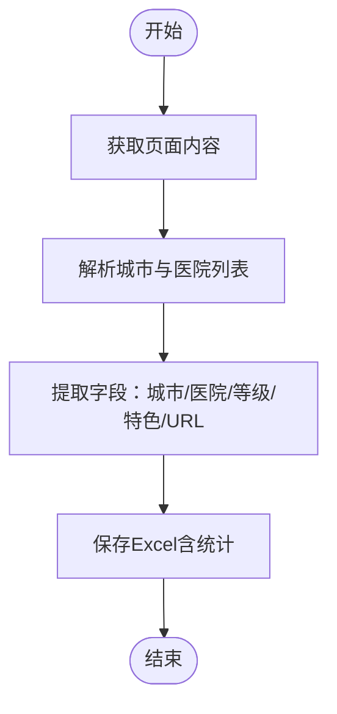
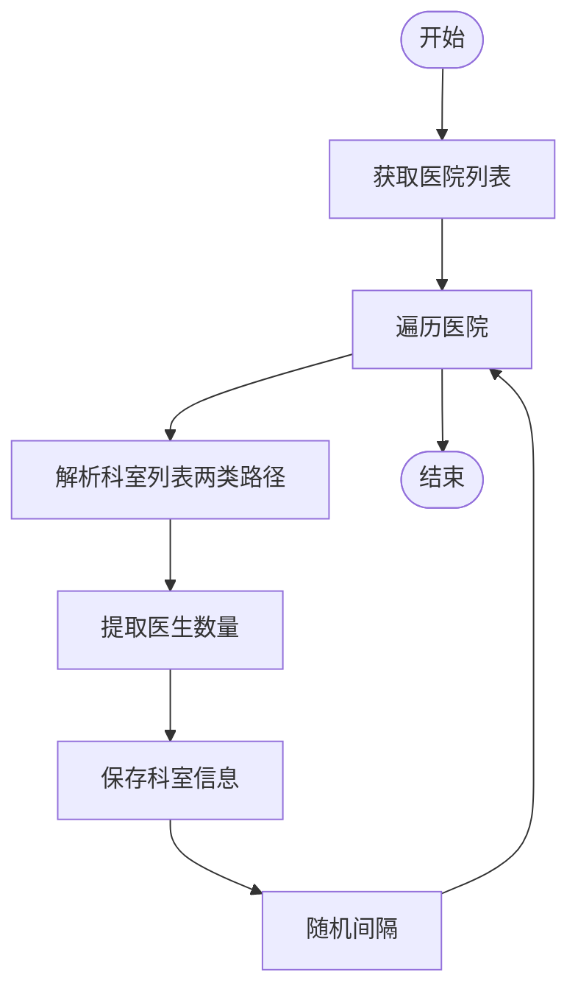
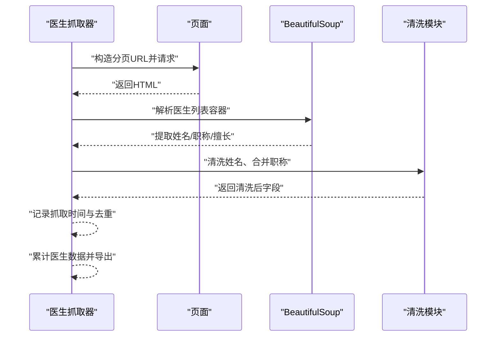
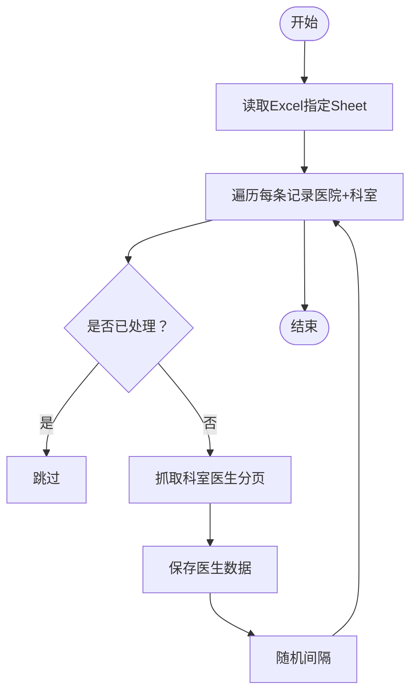
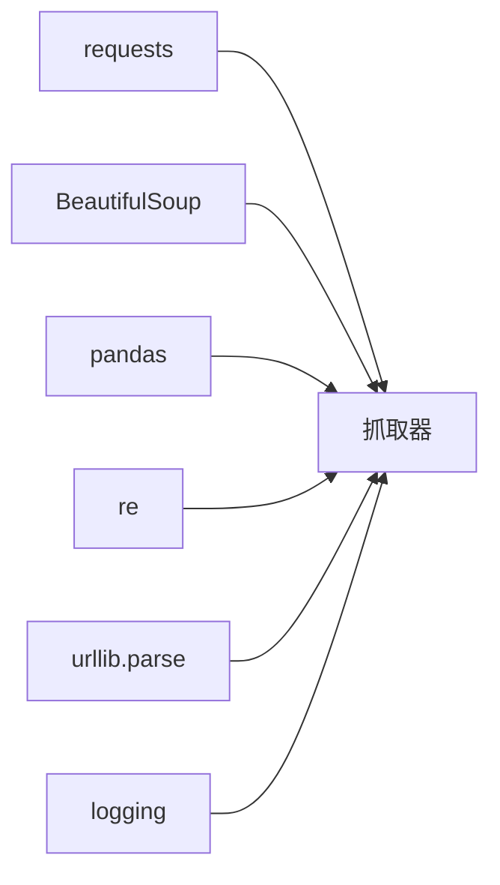

# 网站数据抓取

<cite>
**本文引用的文件**
- [guizhou_hospital_doctor_scraper.py](file://医院/guizhou_hospital_doctor_scraper.py)
- [haodf_hospital_scraper.py](file://医院/haodf_hospital_scraper.py)
- [guizhou_hospital_dept_scraper.py](file://医院/guizhou_hospital_dept_scraper.py)
- [doctor_scraper_from_excel.py](file://医院/doctor_scraper_from_excel.py)
- [医院文件路径.txt](file://医院文件路径.txt)
</cite>

## 目录
1. [简介](#简介)
2. [项目结构](#项目结构)
3. [核心组件](#核心组件)
4. [架构总览](#架构总览)
5. [详细组件分析](#详细组件分析)
6. [依赖关系分析](#依赖关系分析)
7. [性能考量](#性能考量)
8. [故障排查指南](#故障排查指南)
9. [结论](#结论)
10. [附录](#附录)

## 简介
本文件面向“从好大夫在线网站抓取贵州省医院及医生信息”的技术实现进行系统化说明。重点覆盖：
- 使用 requests 与 BeautifulSoup 的网页抓取流程
- 医院列表获取、科室识别（基于呼吸科、儿科、妇科等关键词匹配）、医生信息提取的完整链路
- 多级页面跳转逻辑（省份→城市→医院→科室→医生）与分页处理机制
- 反爬虫应对策略（User-Agent 伪装、请求间隔控制、异常重试机制）
- 数据清洗方法（医生姓名去重与清洗、职称信息合并、科室名称标准化）
- 数据去重与合并的最佳实践，确保最终输出数据的准确性和完整性

## 项目结构
围绕“贵州省医院及医生信息抓取”，仓库中与本主题直接相关的脚本如下：
- 医院/haodf_hospital_scraper.py：抓取贵州省医院基础信息（城市、名称、等级），用于后续科室与医生抓取的数据来源
- 医院/guizhou_hospital_dept_scraper.py：抓取贵州省所有医院的科室信息（含医生数量与链接）
- 医院/guizhou_hospital_doctor_scraper.py：在已知医院与科室的基础上，抓取目标科室（呼吸、儿科、妇科等）的医生信息，并进行数据清洗与导出
- 医院/doctor_scraper_from_excel.py：从 Excel 中读取“医院+科室”清单，批量抓取医生信息，支持去重与分页

图表来源
- [haodf_hospital_scraper.py](file://医院/haodf_hospital_scraper.py#L1-L183)
- [guizhou_hospital_dept_scraper.py](file://医院/guizhou_hospital_dept_scraper.py#L1-L391)
- [guizhou_hospital_doctor_scraper.py](file://医院/guizhou_hospital_doctor_scraper.py#L1-L529)
- [doctor_scraper_from_excel.py](file://医院/doctor_scraper_from_excel.py#L1-L310)

章节来源
- [医院文件路径.txt](file://医院文件路径.txt#L1-L54)

## 核心组件
- 省份/城市入口抓取器：负责从好大夫在线的省/市入口页面解析出城市与医院列表，提取医院名称、等级、URL 等基础信息
- 科室抓取器：在医院详情页基础上，解析科室列表，提取科室名称、医生数量与链接
- 医生抓取器：在科室详情页上，按分页抓取医生信息，清洗姓名、合并职称、提取擅长领域
- Excel驱动抓取器：从已有 Excel 中读取“医院+科室”清单，批量抓取医生信息，支持去重与分页

章节来源
- [haodf_hospital_scraper.py](file://医院/haodf_hospital_scraper.py#L1-L183)
- [guizhou_hospital_dept_scraper.py](file://医院/guizhou_hospital_dept_scraper.py#L1-L391)
- [guizhou_hospital_doctor_scraper.py](file://医院/guizhou_hospital_doctor_scraper.py#L1-L529)
- [doctor_scraper_from_excel.py](file://医院/doctor_scraper_from_excel.py#L1-L310)

## 架构总览
整体抓取流程遵循“省/市入口→医院→科室→医生”的层级关系，采用 requests + BeautifulSoup 进行页面抓取与解析，结合指数退避与随机间隔降低被反爬虫拦截的风险。

图表来源
- [haodf_hospital_scraper.py](file://医院/haodf_hospital_scraper.py#L1-L183)
- [guizhou_hospital_dept_scraper.py](file://医院/guizhou_hospital_dept_scraper.py#L1-L391)
- [guizhou_hospital_doctor_scraper.py](file://医院/guizhou_hospital_doctor_scraper.py#L1-L529)
- [doctor_scraper_from_excel.py](file://医院/doctor_scraper_from_excel.py#L1-L310)

## 详细组件分析

### 组件A：省/市入口抓取器（haodf_hospital_scraper.py）
职责与流程
- 从指定 URL 获取页面 HTML
- 使用 BeautifulSoup 解析城市标题与紧随其后的医院列表容器
- 提取医院名称、URL、等级、特色科室等字段
- 保存为 Excel，包含统计信息与城市分布

关键点
- 页面编码处理：自动检测并统一为 UTF-8
- 异常处理：网络请求失败时打印错误并返回空结果
- 输出：生成带“统计信息”“城市统计”等工作表的 Excel 文件

图表来源
- [haodf_hospital_scraper.py](file://医院/haodf_hospital_scraper.py#L1-L183)

章节来源
- [haodf_hospital_scraper.py](file://医院/haodf_hospital_scraper.py#L1-L183)

### 组件B：科室抓取器（guizhou_hospital_dept_scraper.py）
职责与流程
- 从医院详情页解析科室列表，支持两种解析路径（按大类与直接 faculty-item）
- 提取科室名称、医生数量、科室链接
- 对每个医院循环抓取并汇总

关键点
- 页面解析：优先查找包含“hos-keshi”的容器，再回退到通用选择器
- 医生数量提取：从计数元素中提取数字
- 请求间隔：随机 2-4 秒，降低访问频率

图表来源
- [guizhou_hospital_dept_scraper.py](file://医院/guizhou_hospital_dept_scraper.py#L1-L391)

章节来源
- [guizhou_hospital_dept_scraper.py](file://医院/guizhou_hospital_dept_scraper.py#L1-L391)

### 组件C：医生抓取器（guizhou_hospital_doctor_scraper.py）
职责与流程
- 在已知医院与科室的基础上，抓取目标科室（关键词匹配：呼吸、儿科、妇科、泌尿、肾内科、中医、全科等）的医生信息
- 支持分页（每页约 20 人），当某页为空时提前终止
- 数据清洗：去除科室前缀、职称后缀、评分数字；合并职称与学历信息；标准化擅长领域
- 导出：生成“医生信息”“医院统计”“科室统计”等工作表

图表来源
- [guizhou_hospital_doctor_scraper.py](file://医院/guizhou_hospital_doctor_scraper.py#L1-L529)

章节来源
- [guizhou_hospital_doctor_scraper.py](file://医院/guizhou_hospital_doctor_scraper.py#L1-L529)

### 组件D：Excel驱动抓取器（doctor_scraper_from_excel.py）
职责与流程
- 从 Excel 中读取“医院+科室”清单，逐条抓取医生信息
- 去重：以“医院_科室”为标识，避免重复抓取
- 分页：根据医生数量计算最大页数，逐页抓取
- 导出：将结果保存为 Excel 文件

图表来源
- [doctor_scraper_from_excel.py](file://医院/doctor_scraper_from_excel.py#L1-L310)

章节来源
- [doctor_scraper_from_excel.py](file://医院/doctor_scraper_from_excel.py#L1-L310)

## 依赖关系分析
- requests：发起 HTTP 请求，统一超时与异常处理
- BeautifulSoup：解析 HTML，定位城市、医院、科室、医生等节点
- pandas：将结构化数据写入 Excel，生成统计工作表
- re：正则提取等级、特色、医生数量等字段
- urllib.parse：拼接相对链接为绝对链接
- logging：统一日志输出，便于追踪抓取进度与问题

图表来源
- [guizhou_hospital_doctor_scraper.py](file://医院/guizhou_hospital_doctor_scraper.py#L1-L529)
- [guizhou_hospital_dept_scraper.py](file://医院/guizhou_hospital_dept_scraper.py#L1-L391)
- [haodf_hospital_scraper.py](file://医院/haodf_hospital_scraper.py#L1-L183)
- [doctor_scraper_from_excel.py](file://医院/doctor_scraper_from_excel.py#L1-L310)

章节来源
- [guizhou_hospital_doctor_scraper.py](file://医院/guizhou_hospital_doctor_scraper.py#L1-L529)
- [guizhou_hospital_dept_scraper.py](file://医院/guizhou_hospital_dept_scraper.py#L1-L391)
- [haodf_hospital_scraper.py](file://医院/haodf_hospital_scraper.py#L1-L183)
- [doctor_scraper_from_excel.py](file://医院/doctor_scraper_from_excel.py#L1-L310)

## 性能考量
- 请求间隔控制
  - 科室抓取器：随机 2-4 秒间隔，降低访问频率
  - 医生抓取器：每处理完一个科室/医院后短暂休眠，避免触发限流
  - Excel驱动抓取器：随机 1-3 秒间隔，减少并发压力
- 指数退避重试
  - 所有抓取器均实现最大重试次数与指数退避（如 2^attempt 秒）
- 分页优化
  - 根据医生数量估算最大页数，避免无效请求
  - 当某页无医生时提前终止，节省资源
- 编码与稳定性
  - 统一设置 UTF-8 编码，避免乱码导致解析失败
  - 异常捕获与日志记录，便于快速定位问题

章节来源
- [guizhou_hospital_dept_scraper.py](file://医院/guizhou_hospital_dept_scraper.py#L1-L391)
- [guizhou_hospital_doctor_scraper.py](file://医院/guizhou_hospital_doctor_scraper.py#L1-L529)
- [doctor_scraper_from_excel.py](file://医院/doctor_scraper_from_excel.py#L1-L310)

## 故障排查指南
常见问题与建议
- 页面解析失败
  - 检查 HTML 结构变化：科室与医生列表的选择器可能更新
  - 增加容错分支（如多路径解析），参考科室抓取器的“按大类/通用路径”两套方案
- 请求被拒或返回空内容
  - 更新 User-Agent，模拟不同浏览器
  - 增加重试次数与指数退避间隔
  - 适当增加随机间隔，避免被识别为爬虫
- 字段提取异常
  - 使用正则提取等级、特色、医生数量等，注意多种格式兼容
  - 对缺失字段设置默认值，保证导出完整性
- 数据重复与不一致
  - 医生姓名清洗：去除科室前缀、职称后缀、评分数字
  - 职称合并：将“教授/副教授/讲师”与“主任医师/副主任医师/主治医师”合并为统一格式
  - 科室名称标准化：统一“呼吸内科”“呼吸与危重症医学科”等表述为统一口径
- 导出失败
  - 检查 openpyxl 是否安装
  - 确认路径权限与磁盘空间

章节来源
- [guizhou_hospital_doctor_scraper.py](file://医院/guizhou_hospital_doctor_scraper.py#L1-L529)
- [guizhou_hospital_dept_scraper.py](file://医院/guizhou_hospital_dept_scraper.py#L1-L391)
- [haodf_hospital_scraper.py](file://医院/haodf_hospital_scraper.py#L1-L183)
- [doctor_scraper_from_excel.py](file://医院/doctor_scraper_from_excel.py#L1-L310)

## 结论
本项目通过“省/市入口→医院→科室→医生”的多级抓取流程，结合 requests + BeautifulSoup 实现了对好大夫在线贵州省医院与医生信息的自动化采集。通过关键词匹配与分页处理，有效聚焦目标科室；通过指数退避、随机间隔与异常重试，降低反爬虫风险；通过清洗与标准化，提升数据质量。建议在实际部署中持续监控页面结构变化，动态调整解析策略，并建立完善的日志与告警机制。

## 附录
- 关键实现要点索引
  - 页面获取与异常重试：见“get_page”方法
  - 医院列表解析：见“get_guizhou_hospitals”
  - 科室列表解析：见“get_hospital_departments”
  - 医生列表解析与分页：见“get_department_doctors”
  - 数据清洗与导出：见“clean_doctor_name”“save_to_excel”
- 最佳实践清单
  - 固定 User-Agent 并定期轮换
  - 设置合理的随机间隔与指数退避
  - 多路径解析与字段默认值兜底
  - 去重与合并策略：以“医院_科室”为维度去重，以“职称+学历”合并
  - 导出前进行字段校验与统计核对