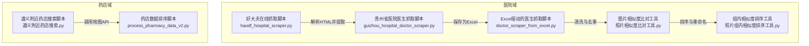
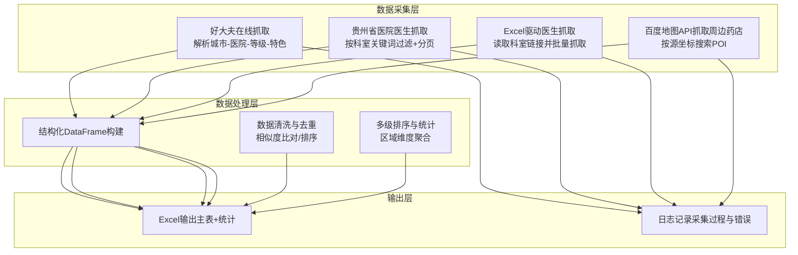
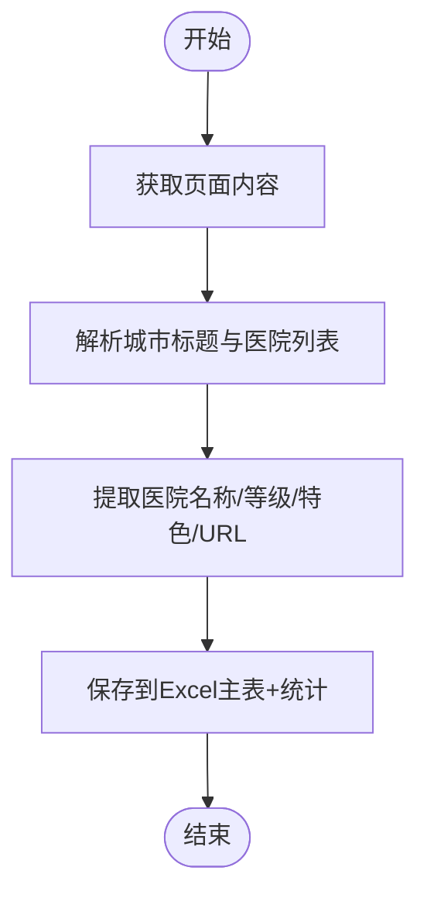
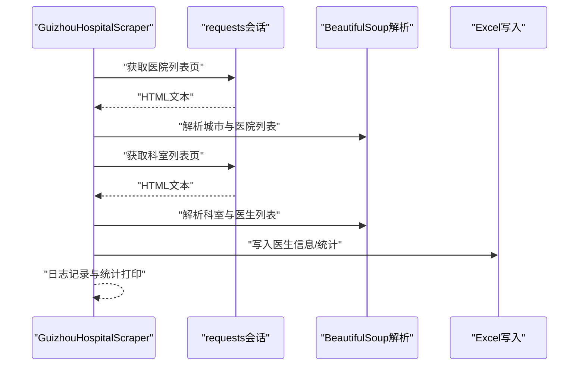
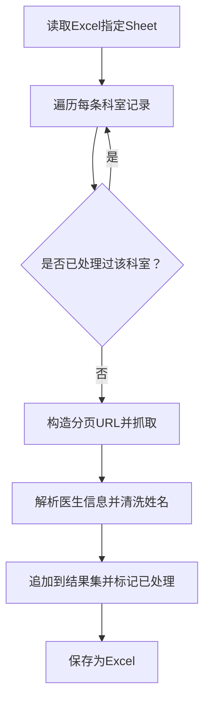
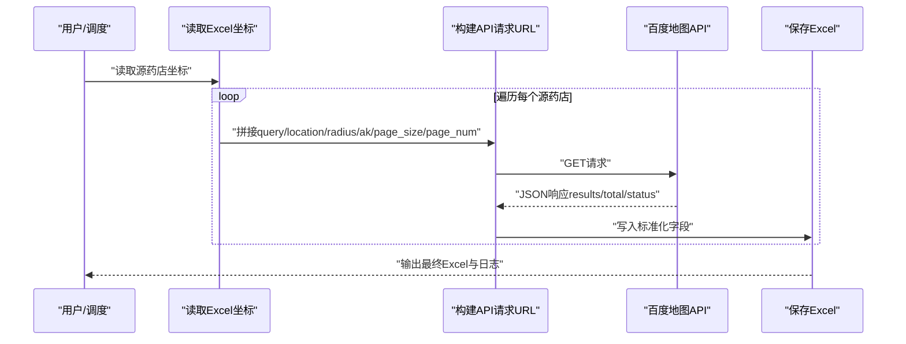
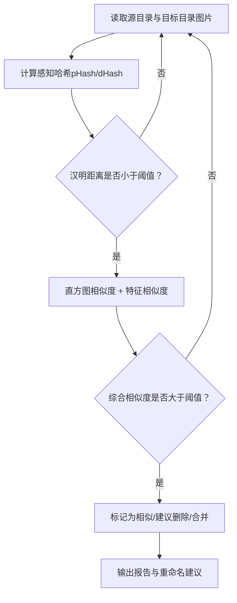
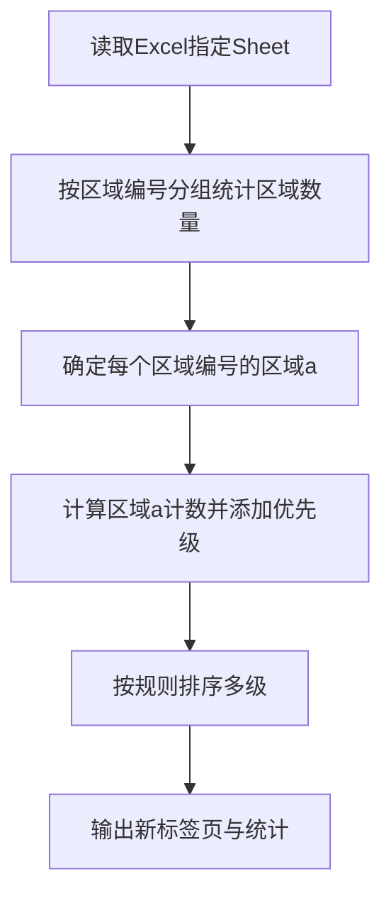
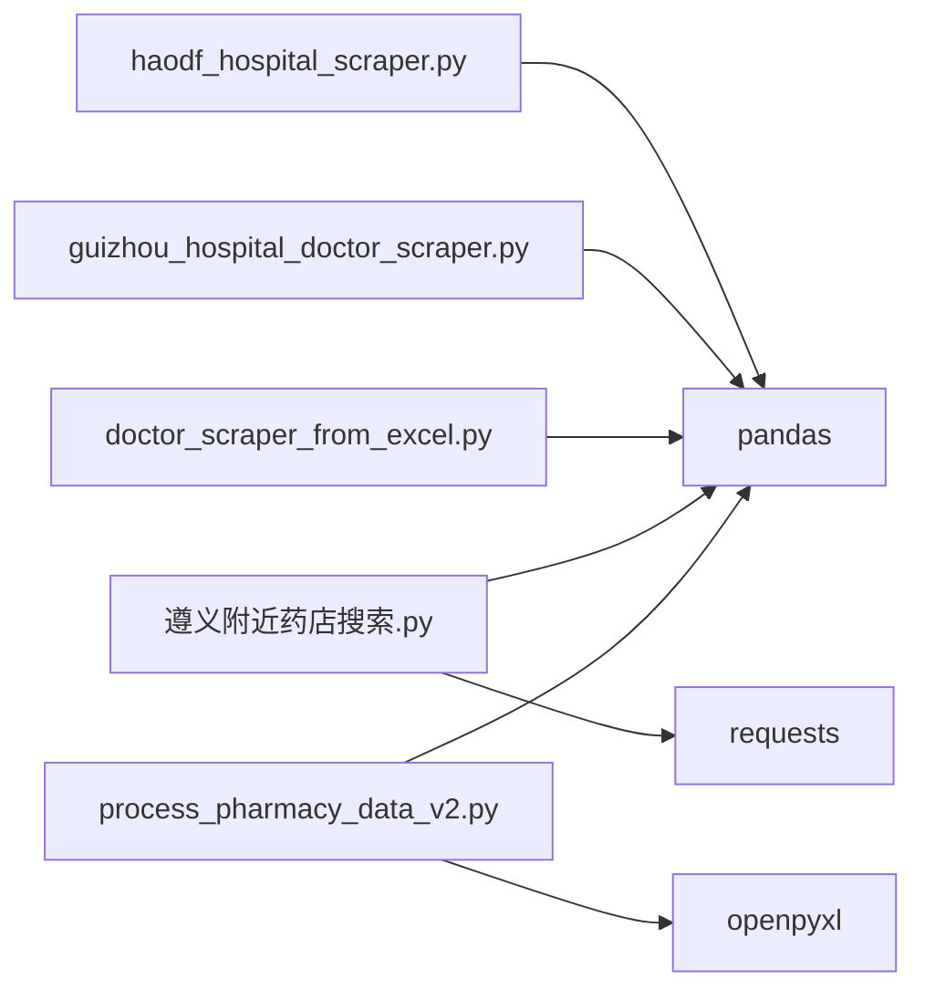

# 数据提取与抓取

<cite>
**本文引用的文件**
- [guizhou_hospital_doctor_scraper.py](file://医院/guizhou_hospital_doctor_scraper.py)
- [haodf_hospital_scraper.py](file://医院/haodf_hospital_scraper.py)
- [doctor_scraper_from_excel.py](file://医院/doctor_scraper_from_excel.py)
- [遵义附近药店搜索.py](file://药店/遵义附近药店搜索.py)
- [process_pharmacy_data_v2.py](file://药店/process_pharmacy_data_v2.py)
- [照片相似度比对工具.py](file://医院/照片相似度比对工具.py)
- [照片组内相似度排序工具.py](file://医院/照片组内相似度排序工具.py)
</cite>

## 目录
1. [引言](#引言)
2. [项目结构](#项目结构)
3. [核心组件](#核心组件)
4. [架构总览](#架构总览)
5. [详细组件分析](#详细组件分析)
6. [依赖关系分析](#依赖关系分析)
7. [性能考量](#性能考量)
8. [故障排查指南](#故障排查指南)
9. [结论](#结论)
10. [附录](#附录)

## 引言
本文件系统性梳理从外部来源提取“医院与药店”数据的技术方案，重点覆盖以下方面：
- 如何使用 requests 与 BeautifulSoup 抓取好大夫在线的结构化数据，包括页面等待策略、元素定位方法与异常处理机制。
- 如何从既有 Excel 中提取医生信息并标准化输出。
- 如何调用地图 API（百度/高德）获取周边药店坐标与详情。
- 数据清洗与去重策略，确保输入数据质量。
- 配置爬虫参数（URL、选择器、登录凭证）的最佳实践，并强调合法合规的数据采集原则。

## 项目结构
仓库采用“功能域+文件”的组织方式，围绕“医院”和“药店”两大业务域分别存放脚本与工具：
- 医院域：包含抓取脚本、数据清洗与排序工具等。
- 药店域：包含抓取周边药店、数据排序与规划工具等。

图表来源
- [haodf_hospital_scraper.py](file://医院/haodf_hospital_scraper.py#L1-L183)
- [guizhou_hospital_doctor_scraper.py](file://医院/guizhou_hospital_doctor_scraper.py#L1-L529)
- [doctor_scraper_from_excel.py](file://医院/doctor_scraper_from_excel.py#L1-L310)
- [遵义附近药店搜索.py](file://药店/遵义附近药店搜索.py#L1-L184)
- [process_pharmacy_data_v2.py](file://药店/process_pharmacy_data_v2.py#L1-L173)
- [照片相似度比对工具.py](file://医院/照片相似度比对工具.py#L1-L200)
- [照片组内相似度排序工具.py](file://医院/照片组内相似度排序工具.py#L1-L200)

章节来源
- [haodf_hospital_scraper.py](file://医院/haodf_hospital_scraper.py#L1-L183)
- [guizhou_hospital_doctor_scraper.py](file://医院/guizhou_hospital_doctor_scraper.py#L1-L529)
- [doctor_scraper_from_excel.py](file://医院/doctor_scraper_from_excel.py#L1-L310)
- [遵义附近药店搜索.py](file://药店/遵义附近药店搜索.py#L1-L184)
- [process_pharmacy_data_v2.py](file://药店/process_pharmacy_data_v2.py#L1-L173)
- [照片相似度比对工具.py](file://医院/照片相似度比对工具.py#L1-L200)
- [照片组内相似度排序工具.py](file://医院/照片组内相似度排序工具.py#L1-L200)

## 核心组件
- 医院抓取组件
  - 好大夫在线医院列表抓取：解析城市-医院-等级-特色等字段，输出结构化 Excel。
  - 贵州省医院医生抓取：按目标科室关键词过滤，分页抓取医生姓名、职称、擅长领域等。
  - Excel驱动的医生抓取：从已有 Excel 中读取科室链接，批量抓取医生数据。
- 药店抓取组件
  - 遵义附近药店搜索：基于百度地图 Place API，按源药店坐标搜索周边药店，输出结构化数据。
- 数据清洗与去重
  - 图片相似度比对与组内相似度排序：通过哈希、直方图与特征相似度进行初筛与精筛，辅助去重与重命名。
- 数据排序与规划
  - 药店数据排序：按区域维度与计数进行多级排序，输出新标签页供规划使用。

章节来源
- [haodf_hospital_scraper.py](file://医院/haodf_hospital_scraper.py#L1-L183)
- [guizhou_hospital_doctor_scraper.py](file://医院/guizhou_hospital_doctor_scraper.py#L1-L529)
- [doctor_scraper_from_excel.py](file://医院/doctor_scraper_from_excel.py#L1-L310)
- [遵义附近药店搜索.py](file://药店/遵义附近药店搜索.py#L1-L184)
- [process_pharmacy_data_v2.py](file://药店/process_pharmacy_data_v2.py#L1-L173)
- [照片相似度比对工具.py](file://医院/照片相似度比对工具.py#L1-L200)
- [照片组内相似度排序工具.py](file://医院/照片组内相似度排序工具.py#L1-L200)

## 架构总览
整体架构由“数据采集层（requests/BeautifulSoup/地图API）—数据处理层（Excel/排序/清洗）—输出层（Excel/日志）”构成，强调模块化与可扩展性。

图表来源
- [haodf_hospital_scraper.py](file://医院/haodf_hospital_scraper.py#L1-L183)
- [guizhou_hospital_doctor_scraper.py](file://医院/guizhou_hospital_doctor_scraper.py#L1-L529)
- [doctor_scraper_from_excel.py](file://医院/doctor_scraper_from_excel.py#L1-L310)
- [遵义附近药店搜索.py](file://药店/遵义附近药店搜索.py#L1-L184)
- [process_pharmacy_data_v2.py](file://药店/process_pharmacy_data_v2.py#L1-L173)
- [照片相似度比对工具.py](file://医院/照片相似度比对工具.py#L1-L200)
- [照片组内相似度排序工具.py](file://医院/照片组内相似度排序工具.py#L1-L200)

## 详细组件分析

### 组件A：好大夫在线医院列表抓取（haodf_hospital_scraper.py）
- 页面等待策略
  - 使用超时控制与异常捕获，避免长时间阻塞；编码自动检测保证中文显示正常。
- 元素定位方法
  - 通过 HTML 结构中的城市标题与相邻列表容器定位医院项；对缺失兄弟节点的情况回退到父节点查找。
- 异常处理机制
  - 页面获取失败时记录告警并继续；解析失败时跳过该条目，不影响整体流程。
- 输出与统计
  - 生成主表与统计表（总医院数、城市数、等级分布、城市统计）。

图表来源
- [haodf_hospital_scraper.py](file://医院/haodf_hospital_scraper.py#L1-L183)

章节来源
- [haodf_hospital_scraper.py](file://医院/haodf_hospital_scraper.py#L1-L183)

### 组件B：贵州省医院医生抓取（guizhou_hospital_doctor_scraper.py）
- 页面等待策略
  - 采用指数退避重试与分页控制，避免触发反爬虫；对空页及时终止。
- 元素定位方法
  - 多种选择器策略：优先使用语义类名，其次回退到包含医院ID或科室路径的链接；医生列表通过 ul.item 容器定位。
- 异常处理机制
  - 单页解析异常不影响后续页；科室为空或无目标关键词时跳过；日志记录关键步骤与错误。
- 数据清洗
  - 姓名清洗：去除科室前缀、职称后缀与评分数字，保留纯姓名；统一字段命名与时间戳。
- 输出与统计
  - 生成“医生信息+医院统计+科室统计”三个 Sheet。

图表来源
- [guizhou_hospital_doctor_scraper.py](file://医院/guizhou_hospital_doctor_scraper.py#L1-L529)

章节来源
- [guizhou_hospital_doctor_scraper.py](file://医院/guizhou_hospital_doctor_scraper.py#L1-L529)

### 组件C：Excel驱动的医生抓取（doctor_scraper_from_excel.py）
- 数据来源
  - 从指定 Excel 的目标 Sheet 读取“医院名称/城市/等级/科室名称/科室链接/医生数量”。
- 抓取流程
  - 按科室链接构造分页 URL，解析医生姓名、职称、擅长领域，清洗姓名后入库。
- 去重与节流
  - 基于“医院_科室”组合去重，避免重复抓取；随机休眠降低请求频率。
- 输出
  - 生成标准化的医生信息 Excel 文件。

图表来源
- [doctor_scraper_from_excel.py](file://医院/doctor_scraper_from_excel.py#L1-L310)

章节来源
- [doctor_scraper_from_excel.py](file://医院/doctor_scraper_from_excel.py#L1-L310)

### 组件D：遵义附近药店搜索（遵义附近药店搜索.py）
- 地图API调用
  - 使用百度地图 Place API，按“药店”关键词、半径范围与 AK 密钥搜索 POI。
- 分页与限额
  - 通过 page_num 与 page_size 控制分页；设置最大 API 调用次数上限，防止超额调用。
- 数据清洗与输出
  - 解析 uid、name、address、经纬度、导航经纬度、营业时间、图片数、详情链接等字段；按源药店分批保存，支持临时落盘。

图表来源
- [遵义附近药店搜索.py](file://药店/遵义附近药店搜索.py#L1-L184)

章节来源
- [遵义附近药店搜索.py](file://药店/遵义附近药店搜索.py#L1-L184)

### 组件E：数据清洗与去重（照片相似度比对工具.py、照片组内相似度排序工具.py）
- 哈希初筛 + 详细比对
  - 先计算感知哈希（pHash/dHash），以汉明距离评估相似度，低于阈值的进入直方图与特征相似度的详细比对。
- 组内排序
  - 按文件名前缀分组，计算组内相似度，按相似度重新排序文件名，便于人工复核与去重。
- 实施建议
  - 针对图片数据先做哈希初筛，再做直方图与特征比对，平衡性能与精度；对相似度高的成对删除或合并。

图表来源
- [照片相似度比对工具.py](file://医院/照片相似度比对工具.py#L1-L200)
- [照片组内相似度排序工具.py](file://医院/照片组内相似度排序工具.py#L1-L200)

章节来源
- [照片相似度比对工具.py](file://医院/照片相似度比对工具.py#L1-L200)
- [照片组内相似度排序工具.py](file://医院/照片组内相似度排序工具.py#L1-L200)

### 组件F：药店数据排序（process_pharmacy_data_v2.py）
- 规则说明
  - 以“区域a计数（降序）”优先；其次“区域a值（升序）”；再次“区域编号（升序）”；最后“区域内顺序（升序）”。
- 实施要点
  - 先统计每个区域编号下各区域的药店数量，确定“区域a”；再按规则排序并输出新标签页。
- 输出
  - 新排序结果与统计分布，便于后续规划与执行。

图表来源
- [process_pharmacy_data_v2.py](file://药店/process_pharmacy_data_v2.py#L1-L173)

章节来源
- [process_pharmacy_data_v2.py](file://药店/process_pharmacy_data_v2.py#L1-L173)

## 依赖关系分析
- 组件耦合
  - 医院抓取脚本之间共享 BeautifulSoup 与 requests 的解析与网络层能力；Excel驱动脚本依赖 pandas 读取与写入。
  - 药店抓取脚本依赖 requests 与 pandas；排序脚本依赖 pandas 与 openpyxl。
- 外部依赖
  - 好大夫在线网站结构变化可能导致选择器失效；地图 API 需要 AK 与配额管理。
- 循环依赖
  - 未发现循环导入；模块间通过函数调用解耦。

图表来源
- [haodf_hospital_scraper.py](file://医院/haodf_hospital_scraper.py#L1-L183)
- [guizhou_hospital_doctor_scraper.py](file://医院/guizhou_hospital_doctor_scraper.py#L1-L529)
- [doctor_scraper_from_excel.py](file://医院/doctor_scraper_from_excel.py#L1-L310)
- [遵义附近药店搜索.py](file://药店/遵义附近药店搜索.py#L1-L184)
- [process_pharmacy_data_v2.py](file://药店/process_pharmacy_data_v2.py#L1-L173)

章节来源
- [haodf_hospital_scraper.py](file://医院/haodf_hospital_scraper.py#L1-L183)
- [guizhou_hospital_doctor_scraper.py](file://医院/guizhou_hospital_doctor_scraper.py#L1-L529)
- [doctor_scraper_from_excel.py](file://医院/doctor_scraper_from_excel.py#L1-L310)
- [遵义附近药店搜索.py](file://药店/遵义附近药店搜索.py#L1-L184)
- [process_pharmacy_data_v2.py](file://药店/process_pharmacy_data_v2.py#L1-L173)

## 性能考量
- 网络请求
  - 使用会话保持连接，设置合理的超时与重试；对分页与空页提前终止，减少无效请求。
- 解析效率
  - 优先使用语义类名定位；对缺失节点进行回退策略，避免多次 DOM 遍历。
- I/O 与内存
  - Excel 写入采用一次性写入多个 Sheet；图片相似度比对先做哈希初筛，显著降低详细比对次数。
- API 限额
  - 百度地图 API 设置最大调用次数，分批保存临时文件，避免超限与数据丢失。

## 故障排查指南
- 页面解析失败
  - 检查网络连通与代理设置；确认 User-Agent 与 Accept 等头部是否合理；关注编码问题（自动检测与 UTF-8）。
- 选择器失效
  - 网站结构更新导致类名或路径变化；建议增加多种备选策略与日志输出，便于定位。
- API 调用异常
  - 关注 status 与 message 字段；检查 AK 是否有效、配额是否耗尽；必要时降低并发与分页大小。
- 数据质量问题
  - 姓名清洗不彻底或字段缺失；建议在解析后增加校验与补全逻辑；对空值与异常值进行标注。
- 图片去重误判
  - 相似度阈值过高或过低都会影响效果；建议结合人工复核与多指标融合判断。

章节来源
- [guizhou_hospital_doctor_scraper.py](file://医院/guizhou_hospital_doctor_scraper.py#L1-L529)
- [doctor_scraper_from_excel.py](file://医院/doctor_scraper_from_excel.py#L1-L310)
- [遵义附近药店搜索.py](file://药店/遵义附近药店搜索.py#L1-L184)
- [照片相似度比对工具.py](file://医院/照片相似度比对工具.py#L1-L200)
- [照片组内相似度排序工具.py](file://医院/照片组内相似度排序工具.py#L1-L200)

## 结论
本方案通过“结构化抓取 + 多级清洗 + 规则排序”的闭环，实现了从好大夫在线与地图 API 的高质量数据采集与治理。建议在生产环境中持续监控网站结构变化与 API 配额，完善异常处理与日志体系，并结合人工复核保障数据质量。

## 附录

### 配置爬虫参数最佳实践
- URL 与选择器
  - 优先使用稳定且语义明确的选择器；为常见结构变化准备回退策略；对分页参数进行健壮性校验。
- 登录凭证
  - 本仓库脚本主要使用 requests 直接抓取，未涉及登录态；若未来引入登录流程，建议使用会话持久化与 Cookie 管理。
- 请求头与速率
  - 设置合理的 User-Agent、Accept、Accept-Language；对高频接口增加随机延迟与指数退避。
- 合规与伦理
  - 遵守网站 robots 协议与服务条款；尊重 API 配额与调用频率限制；仅采集公开、非敏感信息；避免对服务器造成过大压力。

### 数据清洗与去重清单
- 医院/医生字段清洗
  - 去除多余空格与特殊字符；统一日期与时间格式；对缺失字段进行默认值填充或标注。
- 图片去重
  - 哈希初筛 + 直方图 + 特征相似度；对高相似度成对进行人工确认后再删除。
- 排序与统计
  - 以业务规则为核心，输出多维度统计与可视化建议，便于规划与审计。