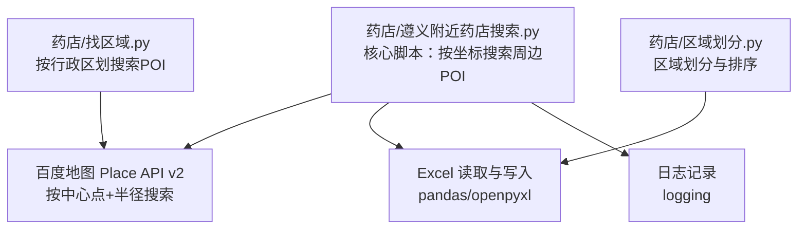
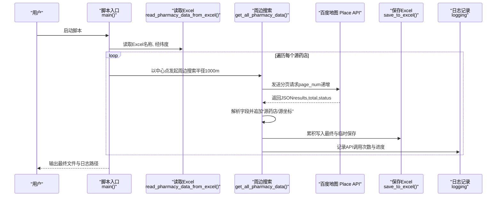
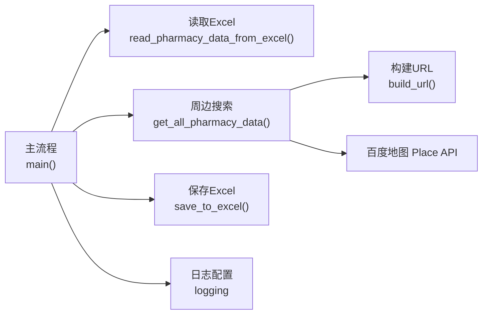

# 基于坐标的药店周边搜索

<cite>
**本文引用的文件**
- [药店/遵义附近药店搜索.py](file://药店/遵义附近药店搜索.py)
- [药店/找区域.py](file://药店/找区域.py)
- [药店/区域划分.py](file://药店/区域划分.py)
</cite>

## 目录
1. [简介](#简介)
2. [项目结构](#项目结构)
3. [核心组件](#核心组件)
4. [架构总览](#架构总览)
5. [详细组件分析](#详细组件分析)
6. [依赖关系分析](#依赖关系分析)
7. [性能考量](#性能考量)
8. [故障排查指南](#故障排查指南)
9. [结论](#结论)
10. [附录](#附录)

## 简介
本文件面向“遵义附近药店搜索”脚本的实现机制进行系统化说明，重点围绕以下目标展开：
- 以现有药店坐标为中心点，通过百度地图 Place API 搜索半径1000米范围内的竞争药店；
- 从 Excel 文件读取源药店名称与经纬度信息，并构建分页请求获取周边 POI 数据；
- 解析 API 响应，提取药店名称、地址、营业时间、图片数量、详情链接等字段；
- 在数据结构中引入“源药店”和“源坐标”字段，用于追溯数据来源；
- 实施 API 调用频率控制策略（20000 次上限）、请求失败重试机制，以及每处理200个药店进行临时保存的断点续存方案；
- 提供实际使用示例，说明如何配置输入 Excel 路径、AK 密钥与输出文件格式，并分析日志输出以监控采集进度。

## 项目结构
该仓库包含多个与“药店”相关的脚本，本次文档聚焦于“基于坐标的药店周边搜索”这一核心流程，同时参考了“按区域搜索”的实现以便对比 API 调用策略与数据落盘方式。

图表来源
- [药店/遵义附近药店搜索.py](file://药店/遵义附近药店搜索.py#L1-L184)
- [药店/找区域.py](file://药店/找区域.py#L1-L184)

章节来源
- [药店/遵义附近药店搜索.py](file://药店/遵义附近药店搜索.py#L1-L184)
- [药店/找区域.py](file://药店/找区域.py#L1-L184)
- [药店/区域划分.py](file://药店/区域划分.py#L1-L321)

## 核心组件
- 参数配置与初始化
  - 输入/输出路径、日志路径、AK 密钥、搜索半径、查询关键词、分页大小、API 计数与上限等均在脚本顶部集中配置。
- URL 构建函数
  - 将查询关键词、范围参数、中心点、半径、分页参数与 AK 组装为百度地图 Place API 请求 URL。
- 分页拉取与解析
  - 循环构建分页请求，解析响应 JSON，提取关键字段（名称、地址、经纬度、导航经纬度、营业时间、图片数、详情链接等），并追加“源药店”和“源坐标”字段。
- Excel 读取与写入
  - 读取 Excel 中的“名称”和“经纬度”两列；将结果写入新的 Excel 文件。
- 断点续存与频率控制
  - 每处理200个药店临时保存一次；API 调用次数达到上限时停止；异常时记录日志并中断当前循环。

章节来源
- [药店/遵义附近药店搜索.py](file://药店/遵义附近药店搜索.py#L1-L184)

## 架构总览
整体流程由“参数配置—读取源数据—逐点发起周边搜索—解析与落盘—断点保存—日志监控”构成。

图表来源
- [药店/遵义附近药店搜索.py](file://药店/遵义附近药店搜索.py#L1-L184)

## 详细组件分析

### 组件A：参数配置与初始化
- 关键参数
  - 输入 Excel 路径、输出 Excel 路径（含时间戳）、日志文件路径；
  - 百度地图 AK、查询关键词（药店）、半径（1000）、分页大小（20）、API 计数与上限（20000）。
- 日志配置
  - 使用 logging 将时间、级别、消息写入日志文件，便于监控采集进度与异常。

章节来源
- [药店/遵义附近药店搜索.py](file://药店/遵义附近药店搜索.py#L1-L40)

### 组件B：URL 构建与分页请求
- URL 构建
  - 使用 query、scope、location、radius、output、ak、page_size、page_num 组装请求。
- 分页策略
  - page_num 从0开始递增，直到 total 达成或 API 次数达到上限。
- 异常处理
  - 对网络请求异常与解析异常进行捕获，记录错误日志并中断当前循环。

章节来源
- [药店/遵义附近药店搜索.py](file://药店/遵义附近药店搜索.py#L30-L107)

### 组件C：响应解析与字段提取
- 关键字段
  - 基础信息：uid、street_id、name、city、area、address；
  - 位置信息：location.lat、location.lng；
  - 导航位置：detail_info.navi_location.lat/lng；
  - 业务信息：detail_info.detail_url、detail_info.shop_hours、detail_info.image_num。
- 数据结构设计
  - 追加“源药店”和“源坐标”，用于溯源每个竞争药店来自哪个源药店与中心点。

章节来源
- [药店/遵义附近药店搜索.py](file://药店/遵义附近药店搜索.py#L55-L87)

### 组件D：Excel 读取与写入
- 读取逻辑
  - 读取名称与经纬度两列；对经纬度字符串进行逗号分割并校验有效性。
- 写入逻辑
  - 将累积结果写入最终 Excel；每处理200个源药店临时保存一次，避免数据丢失。

章节来源
- [药店/遵义附近药店搜索.py](file://药店/遵义附近药店搜索.py#L110-L143)

### 组件E：断点续存与频率控制
- 频率控制
  - API 计数达到上限（20000）时停止处理。
- 断点续存
  - 每处理200个源药店临时保存一次，便于异常恢复。
- 日志监控
  - 记录 API 调用次数、已获取/总计条目、错误与警告信息。

章节来源
- [药店/遵义附近药店搜索.py](file://药店/遵义附近药店搜索.py#L144-L184)

### 组件F：与“按区域搜索”的对比
- 相同点
  - 均使用百度地图 Place API v2，采用分页拉取策略，解析 results 与 total。
- 不同点
  - 坐标搜索：以 location 为中心点+radius，逐点发起请求；
  - 区域搜索：以 region 限定范围，逐页拉取；
  - 落盘策略：区域搜索在每次页处理后立即保存；坐标搜索采用每200个源药店临时保存。

章节来源
- [药店/找区域.py](file://药店/找区域.py#L34-L121)

## 依赖关系分析
- 外部库
  - requests（HTTP 请求）、pandas/openpyxl（Excel 读写）、logging（日志）、datetime（时间戳）。
- 内部依赖
  - 主流程依赖读取函数、搜索函数、保存函数与日志配置。

图表来源
- [药店/遵义附近药店搜索.py](file://药店/遵义附近药店搜索.py#L1-L184)

章节来源
- [药店/遵义附近药店搜索.py](file://药店/遵义附近药店搜索.py#L1-L184)

## 性能考量
- API 调用频率控制
  - 通过计数器与上限控制，避免超出配额；建议在网络波动场景下增加重试与退避策略（当前脚本未内置指数退避，可在扩展时加入）。
- 分页与数据量
  - 分页大小固定为20，total 达成后自动停止；合理设置半径与查询词可减少无效数据。
- IO 与内存
  - 每200个源药店临时保存一次，降低内存占用并提升断点恢复能力；最终一次性保存可减少磁盘写入次数。

[本节为通用性能讨论，不直接分析具体代码文件]

## 故障排查指南
- 常见问题
  - API 返回状态非0：检查 query、location、radius、ak 是否正确；查看日志中的 message 字段。
  - 坐标解析失败：确认 Excel 中经纬度列格式为“纬度,经度”，且数值有效。
  - 网络异常：requests 抛出异常时会记录错误日志，建议检查网络与代理设置。
  - 达到 API 上限：当计数达到20000时脚本会停止，需等待配额恢复或调整策略。
- 日志分析
  - 查看日志文件中的“API调用次数”、“已获取/总计条目”、“错误/警告”等信息，定位问题节点。

章节来源
- [药店/遵义附近药店搜索.py](file://药店/遵义附近药店搜索.py#L40-L107)

## 结论
该脚本以“源药店”为中心点，利用百度地图 Place API 实现半径1000米范围内的竞争药店采集，具备完善的字段提取、断点续存与频率控制机制。通过“源药店/源坐标”字段，实现了数据来源的可追溯性；结合日志与临时保存策略，提升了在大规模采集场景下的稳定性与可靠性。

[本节为总结性内容，不直接分析具体代码文件]

## 附录

### 使用示例与配置说明
- 配置输入 Excel 路径
  - 修改脚本顶部的输入文件路径，确保包含“名称”和“经纬度”两列。
- 配置 AK 密钥
  - 在脚本中设置 AK，确保与百度地图服务绑定。
- 输出文件格式
  - 输出为 Excel（.xlsx），包含“源药店”“源坐标”“名称”“地址”“经纬度”“导航经纬度”“营业时间”“图片数”“详情链接”等字段。
- 日志输出
  - 日志文件包含时间戳、级别与消息，便于监控进度与异常。

章节来源
- [药店/遵义附近药店搜索.py](file://药店/遵义附近药店搜索.py#L1-L40)
- [药店/遵义附近药店搜索.py](file://药店/遵义附近药店搜索.py#L144-L184)

### 字段说明与数据结构设计
- 关键字段
  - 源药店：标识该竞争药店来源于哪个源药店；
  - 源坐标：标识该竞争药店对应的源药店中心点；
  - 名称/地址/城市/区域：基础信息；
  - 经纬度/导航经纬度：位置信息；
  - 营业时间/图片数/详情链接：业务信息。
- 设计目的
  - 便于后续分析“某源药店周边的竞争情况”，并支持回溯到具体源点。

章节来源
- [药店/遵义附近药店搜索.py](file://药店/遵义附近药店搜索.py#L55-L87)

### 与“按区域搜索”的差异与适用场景
- 坐标搜索
  - 适合以现有药店坐标为基准，快速获取周边竞争点；
  - 优点：灵活、可控；缺点：需准备源药店坐标清单。
- 区域搜索
  - 适合全区域覆盖式采集，按区县逐步推进；
  - 优点：覆盖面广；缺点：需维护区县列表与分页保存策略。

章节来源
- [药店/找区域.py](file://药店/找区域.py#L19-L33)
- [药店/找区域.py](file://药店/找区域.py#L122-L184)