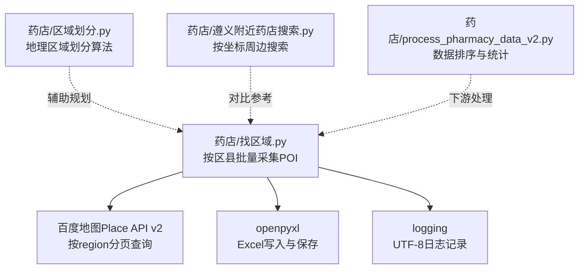
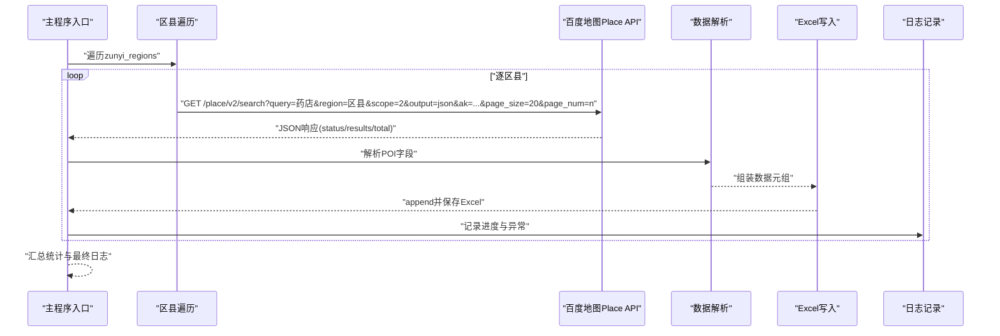
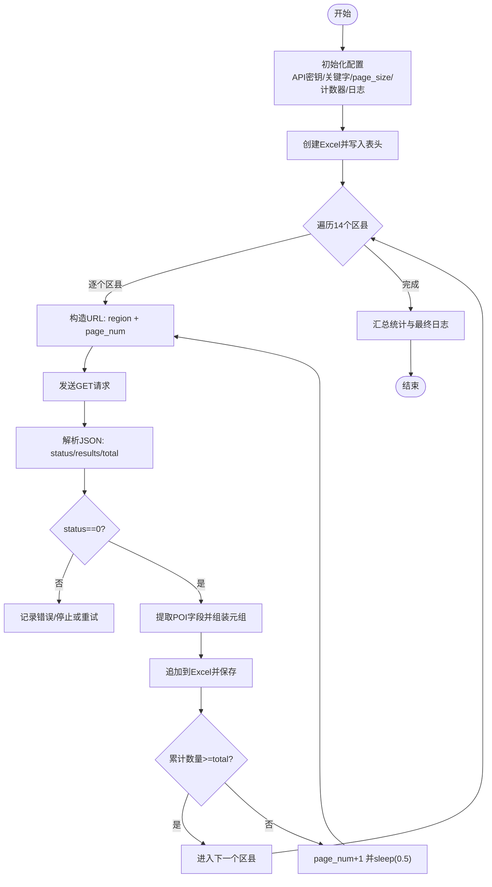
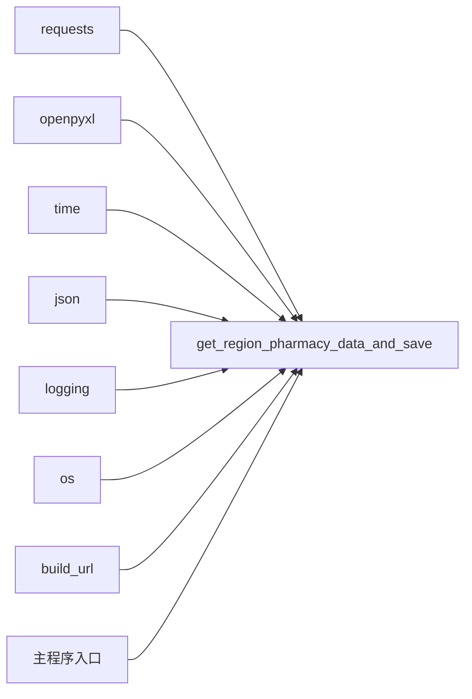

# 基于行政区划的药店全覆盖采集

<cite>
**本文引用的文件**
- [药店/找区域.py](file://药店/找区域.py)
- [药店/区域划分.py](file://药店/区域划分.py)
- [药店/遵义附近药店搜索.py](file://药店/遵义附近药店搜索.py)
- [药店/process_pharmacy_data_v2.py](file://药店/process_pharmacy_data_v2.py)
</cite>

## 目录
1. [简介](#简介)
2. [项目结构](#项目结构)
3. [核心组件](#核心组件)
4. [架构总览](#架构总览)
5. [详细组件分析](#详细组件分析)
6. [依赖关系分析](#依赖关系分析)
7. [性能与稳定性考量](#性能与稳定性考量)
8. [故障排查指南](#故障排查指南)
9. [结论](#结论)
10. [附录：配置与使用指南](#附录配置与使用指南)

## 简介
本文件面向“基于行政区划的药店全覆盖采集”目标，系统解析脚本如何实现对遵义全市14个区县（含红花岗区、汇川区、仁怀市等）的POI数据批量采集。文档重点说明：
- 如何定义遵义市行政区划列表并逐区发起百度地图Place API请求；
- 分页处理机制与page_num迭代策略；
- 每次请求后的Excel即时持久化；
- API请求URL构造方式（region参数、每页20条记录）；
- 地理编码处理（标准经纬度与导航经纬度提取）；
- 0.5秒请求延迟与日志记录（UTF-8编码支持）；
- 配置指南（API密钥、调用计数器、配额耗尽处理）。

## 项目结构
围绕“药店”子目录，本次分析聚焦以下脚本：
- 药店/找区域.py：按行政区划批量采集POI，分页迭代，边采集边保存；
- 药店/区域划分.py：基于地理坐标进行区域划分（辅助规划），与本采集流程互补；
- 药店/遵义附近药店搜索.py：按给定坐标周边半径搜索POI，展示另一种采集模式；
- 药店/process_pharmacy_data_v2.py：对采集后的数据进行排序与统计，便于后续拜访规划。

图表来源
- [药店/找区域.py](file://药店/找区域.py#L1-L184)
- [药店/区域划分.py](file://药店/区域划分.py#L1-L321)
- [药店/遵义附近药店搜索.py](file://药店/遵义附近药店搜索.py#L1-L184)
- [药店/process_pharmacy_data_v2.py](file://药店/process_pharmacy_data_v2.py#L1-L173)

章节来源
- [药店/找区域.py](file://药店/找区域.py#L1-L184)
- [药店/区域划分.py](file://药店/区域划分.py#L1-L321)
- [药店/遵义附近药店搜索.py](file://药店/遵义附近药店搜索.py#L1-L184)
- [药店/process_pharmacy_data_v2.py](file://药店/process_pharmacy_data_v2.py#L1-L173)

## 核心组件
- 行政区划列表与遍历：脚本内置遵义市14个区县列表，依次发起请求。
- URL构造与分页：通过region参数限定区域，page_size固定为20，page_num迭代直至全部数据拉取完毕。
- 数据提取与持久化：解析响应中的POI字段，提取标准经纬度与导航经纬度，逐页保存至Excel。
- 请求控制与限流：内置API计数器与上限，达到上限即停止；同时设置0.5秒延迟降低请求频率。
- 日志记录：统一UTF-8编码，记录请求URL、状态、异常与进度，便于排障。

章节来源
- [药店/找区域.py](file://药店/找区域.py#L1-L184)

## 架构总览
整体流程：初始化配置与日志 → 创建Excel工作簿 → 遍历14个区县 → 逐区分页请求 → 写入Excel并保存 → 统计汇总。

图表来源
- [药店/找区域.py](file://药店/找区域.py#L34-L120)
- [药店/找区域.py](file://药店/找区域.py#L122-L184)

## 详细组件分析

### 组件A：按行政区划批量采集（药店/找区域.py）
- 行政区划列表：包含3个区+新蒲新区、7个县、2个自治县、2个县级市，共计14个区县。
- URL构造：query=药店，region=区县名，scope=2（仅返回检索结果），output=json，page_size=20，page_num从0递增。
- 分页逻辑：当累计已获取数量达到total时停止；否则page_num+1继续请求。
- 数据提取：从每个POI中提取uid、street_id、name、city、area、address、location(lat,lng)、detail_info.shop_hours、detail_info.image_num、detail_info.navi_location(lat2,lng2)、detail_url。
- 持久化：每页写入后立即保存Excel文件，确保中途异常不丢失数据。
- 请求控制：每次请求后api_count自增；达到max_api_calls时停止；同时sleep(0.5)降低频率。
- 日志：UTF-8编码，记录URL、状态、异常、进度与汇总。

图表来源
- [药店/找区域.py](file://药店/找区域.py#L34-L120)
- [药店/找区域.py](file://药店/找区域.py#L122-L184)

章节来源
- [药店/找区域.py](file://药店/找区域.py#L1-L184)

### 组件B：地理编码与经纬度处理
- 标准经纬度：location字段包含lat、lng，以字符串形式拼接为“lat,lng”写入。
- 导航经纬度：detail_info.navi_location包含lat2、lng2，同样拼接为“lat2,lng2”写入。
- 说明：脚本未进行额外地理编码（如逆地理编码），而是直接使用API返回的经纬度字段。

章节来源
- [药店/找区域.py](file://药店/找区域.py#L66-L96)

### 组件C：分页与URL构造详解
- 关键参数
  - query：检索关键字“药店”
  - region：当前区县名称
  - scope：2（仅返回检索结果）
  - output：json
  - ak：百度地图API密钥
  - page_size：20（每页最大20条）
  - page_num：从0开始递增
- 分页终止条件：累计已获取数量（all_pois_count）达到total时停止。
- 实践建议：如需更高并发，可在满足配额前提下适度减少sleep间隔，但应结合实际配额与服务端限流策略。

章节来源
- [药店/找区域.py](file://药店/找区域.py#L11-L18)
- [药店/找区域.py](file://药店/找区域.py#L34-L40)
- [药店/找区域.py](file://药店/找区域.py#L97-L107)

### 组件D：日志与异常处理
- 日志级别：INFO
- 编码：UTF-8
- 内容：请求URL、状态、错误信息、进度、汇总
- 异常捕获：网络请求异常与通用异常均记录并中断当前区县处理，不影响其他区县继续执行。

章节来源
- [药店/找区域.py](file://药店/找区域.py#L27-L33)
- [药店/找区域.py](file://药店/找区域.py#L56-L64)
- [药店/找区域.py](file://药店/找区域.py#L109-L117)

### 组件E：与“按坐标周边搜索”的对比（药店/遵义附近药店搜索.py）
- 适用场景：已有药店坐标，按周边半径搜索附近POI。
- 参数差异：使用location与radius，而非region。
- 分页与保存：与按区县采集一致，分页拉取并保存。
- 用途：可作为“补漏”或“验证”手段，与按区县采集形成互补。

章节来源
- [药店/遵义附近药店搜索.py](file://药店/遵义附近药店搜索.py#L1-L184)

### 组件F：区域划分与后续排序（药店/区域划分.py、process_pharmacy_data_v2.py）
- 区域划分：基于地理坐标与贪心算法进行区域划分，辅助规划拜访路线。
- 数据排序：按区域a计数、区域a值、区域编号、区域内顺序进行多级排序，便于后续拜访安排。

章节来源
- [药店/区域划分.py](file://药店/区域划分.py#L1-L321)
- [药店/process_pharmacy_data_v2.py](file://药店/process_pharmacy_data_v2.py#L1-L173)

## 依赖关系分析
- 外部依赖
  - requests：HTTP请求
  - openpyxl：Excel读写
  - time：请求延迟
  - json：响应解析
  - logging：日志记录
  - os：日志文件路径
- 内部依赖
  - build_url：被get_region_pharmacy_data_and_save调用
  - get_region_pharmacy_data_and_save：被主程序入口调用
  - Excel工作簿与表头：由主程序入口创建并传递给采集函数

图表来源
- [药店/找区域.py](file://药店/找区域.py#L1-L184)

章节来源
- [药店/找区域.py](file://药店/找区域.py#L1-L184)

## 性能与稳定性考量
- 请求频率控制：每次请求后sleep(0.5)，有助于避免触发服务端限流。
- 分页策略：page_size=20，page_num递增，累计数量达到total即停止，避免无效请求。
- 即时持久化：每页写入后保存Excel，降低异常导致的数据丢失风险。
- 配额管理：内置api_count与max_api_calls，达到上限自动停止，避免超额调用。
- 日志UTF-8：确保中文日志正常显示，便于排查问题。

章节来源
- [药店/找区域.py](file://药店/找区域.py#L11-L18)
- [药店/找区域.py](file://药店/找区域.py#L94-L107)
- [药店/找区域.py](file://药店/找区域.py#L27-L33)

## 故障排查指南
- API配额耗尽
  - 现象：达到max_api_calls后停止采集。
  - 处理：调整max_api_calls或更换密钥；可分批执行，保留未完成区县列表。
- 网络异常
  - 现象：requests异常被捕获并记录。
  - 处理：检查网络连通性与代理设置；适当增加超时或重试。
- 响应状态异常
  - 现象：status!=0时记录错误并中断当前区县。
  - 处理：检查query、region、ak是否正确；必要时降低page_size或延长延迟。
- Excel写入失败
  - 现象：保存失败可能由文件占用或磁盘空间不足引起。
  - 处理：关闭Excel文件、清理磁盘空间、检查权限。
- 日志定位
  - 查看UTF-8编码的日志文件，定位URL、错误类型与进度。

章节来源
- [药店/找区域.py](file://药店/找区域.py#L48-L57)
- [药店/找区域.py](file://药店/找区域.py#L60-L64)
- [药店/找区域.py](file://药店/找区域.py#L109-L117)
- [药店/找区域.py](file://药店/找区域.py#L27-L33)

## 结论
该脚本通过明确的行政区划列表、规范的URL构造与分页策略、严格的配额控制与日志记录，实现了对遵义市14个区县的POI数据全覆盖采集。其边采集边保存的设计有效降低了数据丢失风险，0.5秒延迟与计数器共同保障了稳定性与合规性。配合区域划分与排序脚本，可进一步支撑后续的拜访规划与调度。

## 附录：配置与使用指南
- 配置项说明
  - API密钥：ak（百度地图AK）
  - 检索关键字：query（默认“药店”）
  - 每页记录数：page_size（默认20）
  - 区域列表：zunyi_regions（包含14个区县）
  - 计数器与上限：api_count、max_api_calls
  - 日志编码：UTF-8
- 调整步骤
  - 修改ak与max_api_calls以匹配你的配额；
  - 如需变更关键字，修改query；
  - 如需调整分页规模，修改page_size；
  - 如需扩展区域列表，补充zunyi_regions；
  - 如需变更输出路径，修改主程序中的out_file_path。
- 注意事项
  - 配额耗尽时脚本会自动停止，请及时记录剩余区县列表以便后续继续；
  - 若出现频繁限流，可考虑延长sleep间隔或降低page_size；
  - 日志文件位于当前工作目录，注意查看UTF-8编码是否正常。

章节来源
- [药店/找区域.py](file://药店/找区域.py#L8-L18)
- [药店/找区域.py](file://药店/找区域.py#L122-L131)
- [药店/找区域.py](file://药店/找区域.py#L27-L33)