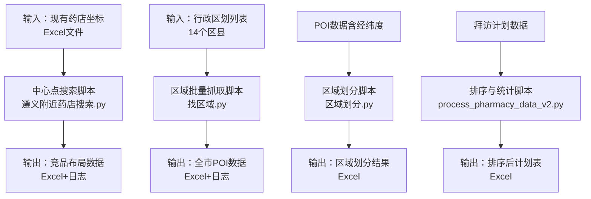
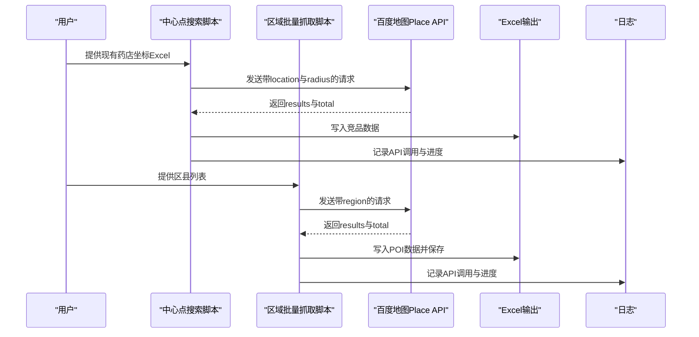
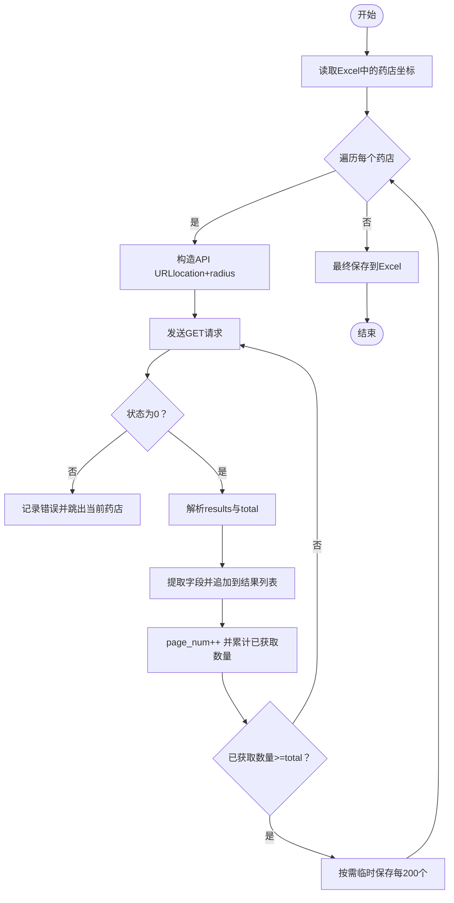
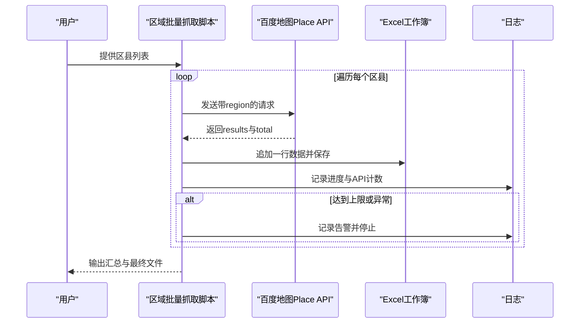
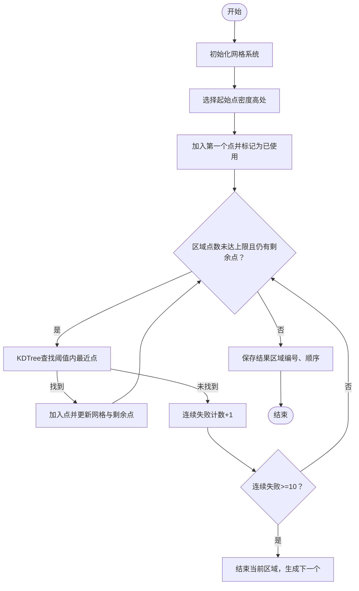
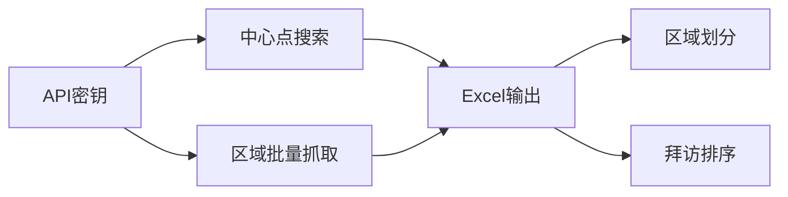

# 药店数据抓取

<cite>
**本文引用的文件**
- [药店/遵义附近药店搜索.py](file://药店/遵义附近药店搜索.py)
- [药店/找区域.py](file://药店/找区域.py)
- [药店/process_pharmacy_data_v2.py](file://药店/process_pharmacy_data_v2.py)
- [药店/区域划分.py](file://药店/区域划分.py)
</cite>

## 目录
1. [简介](#简介)
2. [项目结构](#项目结构)
3. [核心组件](#核心组件)
4. [架构总览](#架构总览)
5. [详细组件分析](#详细组件分析)
6. [依赖关系分析](#依赖关系分析)
7. [性能与配额管理](#性能与配额管理)
8. [故障排查指南](#故障排查指南)
9. [结论](#结论)
10. [附录](#附录)

## 简介
本方案围绕“基于百度地图 Place API”的遵义周边药店数据采集展开，目标包括：
- 以现有药店坐标为中心，半径1000米范围内搜索竞争药店，支撑竞品布局分析。
- 按行政区划（红花岗区、汇川区等14个区县）批量获取全市药店POI数据，覆盖API请求构造、分页处理、响应解析与断点续存。
- 实施API调用频率控制与配额管理（20000次上限），并提供请求失败重试与断点续存策略。
- 规范地理编码（经纬度）处理方法，包括坐标解析、导航位置提取、地址信息标准化。
- 设计数据结构，提取药店名称、营业时间、图片数量、详情链接等字段。
- 提供API密钥安全管理建议与批量处理性能优化方案。

## 项目结构
仓库中与药店数据抓取直接相关的模块如下：
- 遵义附近药店搜索：以现有药店为中心，半径1000米搜索竞争药店，输出竞品清单。
- 找区域：按行政区划批量拉取全市药店POI，支持进度保存与断点续存。
- 区域划分：对POI进行空间聚类与区域编号，辅助拜访规划。
- process_pharmacy_data_v2：对拜访计划数据进行排序与统计，便于后续排班。

图表来源
- [药店/遵义附近药店搜索.py](file://药店/遵义附近药店搜索.py#L1-L184)
- [药店/找区域.py](file://药店/找区域.py#L1-L184)
- [药店/区域划分.py](file://药店/区域划分.py#L1-L321)
- [药店/process_pharmacy_data_v2.py](file://药店/process_pharmacy_data_v2.py#L1-L173)

章节来源
- [药店/遵义附近药店搜索.py](file://药店/遵义附近药店搜索.py#L1-L184)
- [药店/找区域.py](file://药店/找区域.py#L1-L184)
- [药店/区域划分.py](file://药店/区域划分.py#L1-L321)
- [药店/process_pharmacy_data_v2.py](file://药店/process_pharmacy_data_v2.py#L1-L173)

## 核心组件
- 中心点搜索组件：负责读取现有药店坐标，逐个发起百度地图Place API请求，按半径1000米分页拉取竞争药店，解析并保存关键字段。
- 区域批量抓取组件：按区县列表逐个发起API请求，分页拉取POI，边拉边写入Excel，支持断点续存。
- 区域划分组件：对POI进行空间聚类，生成区域编号与区域内顺序，便于后续拜访规划。
- 数据排序组件：对拜访计划数据按区域维度进行排序与统计，输出新标签页。

章节来源
- [药店/遵义附近药店搜索.py](file://药店/遵义附近药店搜索.py#L1-L184)
- [药店/找区域.py](file://药店/找区域.py#L1-L184)
- [药店/区域划分.py](file://药店/区域划分.py#L1-L321)
- [药店/process_pharmacy_data_v2.py](file://药店/process_pharmacy_data_v2.py#L1-L173)

## 架构总览
整体流程分为“数据准备—API抓取—数据处理—结果输出”四个阶段，涉及文件读取、HTTP请求、JSON解析、Excel写入与日志记录。

图表来源
- [药店/遵义附近药店搜索.py](file://药店/遵义附近药店搜索.py#L1-L184)
- [药店/找区域.py](file://药店/找区域.py#L1-L184)

## 详细组件分析

### 组件A：中心点搜索（半径1000米竞品分析）
- 功能概述
  - 以现有药店坐标为中心，半径1000米范围内搜索“药店”类型POI，解析并导出关键字段，形成竞品布局数据。
- 关键流程
  - 读取Excel中的药店名称与经纬度字段，解析为location字符串。
  - 构造百度地图Place API URL，设置query、scope、location、radius、page_size、page_num、ak等参数。
  - 分页拉取results，累计总数total，直到全部拉取完毕或达到API调用上限。
  - 解析每个POI的uid、street_id、name、city、area、address、location、detail_info（含detail_url、shop_hours、image_num、navi_location）等字段，组装为行数据。
  - 每处理一定数量（如200个）临时保存一次，避免中途失败导致数据丢失。
- 数据字段提取逻辑
  - 基础信息：名称、城市、区域、地址、经纬度。
  - 导航位置：从detail_info.navi_location提取lat/lng，拼接为“lat,lng”。
  - 业务信息：营业时间、图片数量、详情链接。
- 错误处理与日志
  - 请求超时、状态码非0、解析异常均记录日志并中断当前药店的搜索。
  - 达到API上限时停止处理并记录告警。
- 断点续存
  - 通过“已使用API次数”与“最大API调用次数”配合，可在中断后继续执行；临时文件用于阶段性保存。

图表来源
- [药店/遵义附近药店搜索.py](file://药店/遵义附近药店搜索.py#L1-L184)

章节来源
- [药店/遵义附近药店搜索.py](file://药店/遵义附近药店搜索.py#L1-L184)

### 组件B：按行政区划批量抓取（14个区县）
- 功能概述
  - 以“药店”为关键词，按区县列表逐个发起API请求，分页拉取POI，边拉边写入Excel，支持断点续存。
- 关键流程
  - 构造API URL，设置query、region、scope、page_size、page_num、ak等参数。
  - 分页循环：每次请求后累加API计数，解析results，写入Excel行，保存文件。
  - 若达到API上限或出现异常，记录日志并停止当前区县或整个流程。
- 数据字段提取逻辑
  - 基础信息：uid、street_id、name、city、area、address、location（lat,lng）、detail_info（detail_url、shop_hours、image_num）、navi_location（lat,lng）。
- 断点续存与进度
  - 每区县独立累计计数，完成后保存Excel；支持后续继续执行时从上次进度继续。
- 性能与稳定性
  - 每页固定20条，请求间增加短暂延迟，降低被限流风险。

图表来源
- [药店/找区域.py](file://药店/找区域.py#L1-L184)

章节来源
- [药店/找区域.py](file://药店/找区域.py#L1-L184)

### 组件C：区域划分（空间聚类与编号）
- 功能概述
  - 基于POI的经纬度，采用贪心+网格+KDTree策略进行空间聚类，生成区域编号与区域内顺序，便于后续拜访规划。
- 关键流程
  - 初始化网格系统，估算密度，选择起始点。
  - 在阈值范围内查找最近未使用点，逐步扩展区域，直至达到区域最大点数或连续失败。
  - 更新网格与剩余点集合，继续生成下一个区域。
- 参数与优化
  - threshold：空间阈值，控制聚类紧密度。
  - 网格系统：加速密度估算与邻居查找。
  - KDTree：高效查询最近邻居。
- 输出
  - 生成包含区域编号、区域内顺序的Excel文件，统计各区域药店数量。

图表来源
- [药店/区域划分.py](file://药店/区域划分.py#L1-L321)

章节来源
- [药店/区域划分.py](file://药店/区域划分.py#L1-L321)

### 组件D：拜访计划排序与统计
- 功能概述
  - 对既有拜访计划数据按“区域a优先级、区域a计数、区域a、区域编号、区域内顺序”进行多级排序，并输出新标签页。
- 关键流程
  - 读取Excel，统计每个区域编号下各区域的药店数量，确定“区域a”。
  - 计算区域a计数，按规则排序，验证排序正确性，保存到原文件新标签页或备用文件。
- 输出
  - 新标签页“拜访时间安排-删减-新排序”，并打印统计信息。

章节来源
- [药店/process_pharmacy_data_v2.py](file://药店/process_pharmacy_data_v2.py#L1-L173)

## 依赖关系分析
- 组件耦合
  - 中心点搜索与区域批量抓取均依赖百度地图Place API，共享相同的AK、分页参数与错误处理模式。
  - 区域划分与拜访排序依赖POI数据（含经纬度、名称、区域等），形成数据驱动的下游处理链。
- 外部依赖
  - requests：HTTP请求。
  - pandas/openpyxl：Excel读写与数据处理。
  - numpy/sklearn：区域划分中的网格与KDTree计算。
- 潜在环路
  - 各脚本均为独立入口，无直接循环依赖；数据在文件层面传递，避免环路。

图表来源
- [药店/遵义附近药店搜索.py](file://药店/遵义附近药店搜索.py#L1-L184)
- [药店/找区域.py](file://药店/找区域.py#L1-L184)
- [药店/区域划分.py](file://药店/区域划分.py#L1-L321)
- [药店/process_pharmacy_data_v2.py](file://药店/process_pharmacy_data_v2.py#L1-L173)

章节来源
- [药店/遵义附近药店搜索.py](file://药店/遵义附近药店搜索.py#L1-L184)
- [药店/找区域.py](file://药店/找区域.py#L1-L184)
- [药店/区域划分.py](file://药店/区域划分.py#L1-L321)
- [药店/process_pharmacy_data_v2.py](file://药店/process_pharmacy_data_v2.py#L1-L173)

## 性能与配额管理
- API调用频率控制
  - 中心点搜索：每请求一次计数+1，达到上限即停止；请求间未显式sleep，但可通过外部调度控制并发。
  - 区域批量抓取：每页固定20条，请求间sleep 0.5秒，降低限流风险。
- 配额管理
  - 两脚本均内置“当前已使用API次数”与“最大API调用次数”（20000），达到上限即停止。
- 断点续存策略
  - 中心点搜索：每处理N个药店临时保存一次，避免大规模失败导致数据丢失。
  - 区域批量抓取：每页保存一次Excel，支持后续继续执行。
- 性能优化建议
  - 合理并发：按区县串行或小批量并发，避免触发限流。
  - 缓存与去重：对已处理过的坐标/UID进行去重，减少重复请求。
  - 分时段抓取：避开高峰时段，降低失败率。
  - 批量写入：尽量合并写入操作，减少磁盘IO。
  - 超时与重试：为请求设置合理超时，对网络异常进行有限重试（建议指数退避）。

章节来源
- [药店/遵义附近药店搜索.py](file://药店/遵义附近药店搜索.py#L1-L184)
- [药店/找区域.py](file://药店/找区域.py#L1-L184)

## 故障排查指南
- 常见问题
  - API状态非0：检查query、location/region、ak是否正确，查看日志中的message。
  - 结果为空：确认关键词、区域或半径设置是否合理；检查是否有权限或配额限制。
  - 坐标解析失败：确保Excel中经纬度格式为“lat,lng”，且非空。
  - 写入Excel失败：检查文件路径权限与并发写入冲突。
- 日志定位
  - 中心点搜索与区域批量抓取均记录API调用次数、URL、错误信息与进度，便于定位问题。
- 重试与恢复
  - 对网络异常进行捕获并记录；在断点处重启脚本，利用临时文件或已保存的Excel继续执行。

章节来源
- [药店/遵义附近药店搜索.py](file://药店/遵义附近药店搜索.py#L1-L184)
- [药店/找区域.py](file://药店/找区域.py#L1-L184)

## 结论
本方案通过“中心点搜索+区域批量抓取+空间聚类+排序统计”的闭环，实现了对遵义地区药店数据的系统化采集与治理。脚本具备良好的断点续存与日志记录能力，能够稳定地在API配额约束下完成大规模数据抓取。建议在生产环境中进一步引入重试与指数退避、并发控制与缓存策略，以提升稳定性与吞吐量。

## 附录
- 地理编码与地址标准化
  - 坐标解析：从Excel读取“纬度/经度”或“经纬度”字段，统一为“lat,lng”格式。
  - 导航位置：从detail_info.navi_location提取导航经纬度，用于后续路径规划。
  - 地址信息：保留city、area、address字段，便于后续清洗与标准化。
- 字段清单（示例）
  - 基础信息：名称、城市、区域、地址、经纬度。
  - 导航信息：导航经纬度。
  - 业务信息：营业时间、图片数量、详情链接。
- API密钥安全管理
  - 不在代码中硬编码密钥，使用环境变量或配置文件管理。
  - 限制密钥使用范围与来源IP，定期轮换。
  - 对日志与输出文件进行敏感信息脱敏处理。