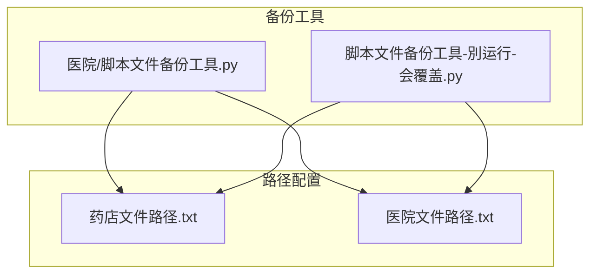
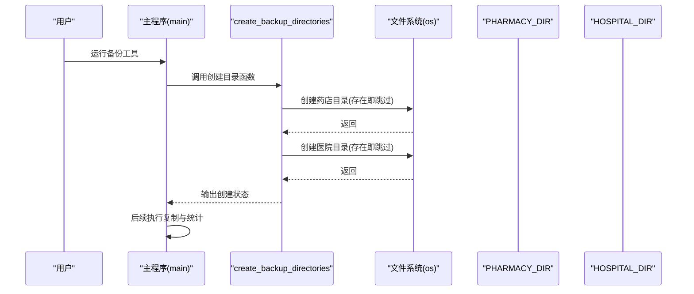
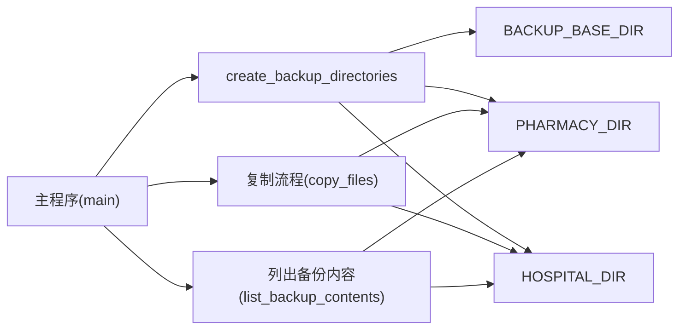

# 备份目录创建

<cite>
**本文引用的文件**
- [医院/脚本文件备份工具.py](file://医院/脚本文件备份工具.py)
- [脚本文件备份工具-別运行-会覆盖.py](file://脚本文件备份工具-別运行-会覆盖.py)
- [药店文件路径.txt](file://药店文件路径.txt)
- [医院文件路径.txt](file://医院文件路径.txt)
</cite>

## 目录
1. [简介](#简介)
2. [项目结构](#项目结构)
3. [核心组件](#核心组件)
4. [架构总览](#架构总览)
5. [详细组件分析](#详细组件分析)
6. [依赖关系分析](#依赖关系分析)
7. [性能考量](#性能考量)
8. [故障排查指南](#故障排查指南)
9. [结论](#结论)
10. [附录](#附录)

## 简介
本节聚焦于“create_backup_directories”函数如何通过标准库调用创建药店与医院两类分类备份目录，并强调其在备份流程中的前置依赖地位。文档重点说明：
- 如何使用 os.makedirs 并通过 exist_ok=True 参数避免重复创建目录；
- 控制台输出的格式规范与用户反馈机制；
- PHARMACY_DIR 与 HOSPITAL_DIR 如何基于 BACKUP_BASE_DIR 根目录进行路径拼接，实现配置集中化与可维护性；
- 在权限不足或磁盘空间受限等异常场景下的建议处理策略。

## 项目结构
仓库包含两套备份工具脚本与对应的路径配置文件：
- 备份工具脚本
  - 医院/脚本文件备份工具.py
  - 脚本文件备份工具-別运行-会覆盖.py
- 路径配置文件
  - 药店文件路径.txt
  - 医院文件路径.txt

图表来源
- [医院/脚本文件备份工具.py](file://医院/脚本文件备份工具.py#L14-L16)
- [脚本文件备份工具-別运行-会覆盖.py](file://脚本文件备份工具-別运行-会覆盖.py#L14-L16)
- [药店文件路径.txt](file://药店文件路径.txt#L1-L30)
- [医院文件路径.txt](file://医院文件路径.txt#L1-L54)

章节来源
- [医院/脚本文件备份工具.py](file://医院/脚本文件备份工具.py#L14-L16)
- [脚本文件备份工具-別运行-会覆盖.py](file://脚本文件备份工具-別运行-会覆盖.py#L14-L16)
- [药店文件路径.txt](file://药店文件路径.txt#L1-L30)
- [医院文件路径.txt](file://医院文件路径.txt#L1-L54)

## 核心组件
- create_backup_directories：负责创建药店与医院两类备份目录，并输出创建状态信息。
- PHARMACY_DIR 与 HOSPITAL_DIR：分别指向 BACKUP_BASE_DIR 下的“药店”与“医院”子目录。
- 路径配置文件：提供两类备份所涉及的源文件清单，供后续复制流程使用。

章节来源
- [医院/脚本文件备份工具.py](file://医院/脚本文件备份工具.py#L14-L16)
- [医院/脚本文件备份工具.py](file://医院/脚本文件备份工具.py#L185-L192)
- [脚本文件备份工具-別运行-会覆盖.py](file://脚本文件备份工具-別运行-会覆盖.py#L14-L16)
- [脚本文件备份工具-別运行-会覆盖.py](file://脚本文件备份工具-別运行-会覆盖.py#L129-L136)
- [药店文件路径.txt](file://药店文件路径.txt#L1-L30)
- [医院文件路径.txt](file://医院文件路径.txt#L1-L54)

## 架构总览
下图展示了备份工具的整体工作流，其中 create_backup_directories 作为流程起点，负责准备目标目录，随后由复制流程将源文件归档至对应分类目录。

图表来源
- [医院/脚本文件备份工具.py](file://医院/脚本文件备份工具.py#L185-L192)
- [脚本文件备份工具-別运行-会覆盖.py](file://脚本文件备份工具-別运行-会覆盖.py#L129-L136)

## 详细组件分析

### create_backup_directories 函数
- 功能概述
  - 通过 os.makedirs 对 PHARMACY_DIR 与 HOSPITAL_DIR 进行创建；
  - 使用 exist_ok=True，确保在目录已存在时不抛出异常，从而避免重复创建带来的错误；
  - 在控制台输出两条状态行，分别打印“药店目录”与“医院目录”的完整路径，便于用户核验。

- 关键实现要点
  - 目录创建：两次调用 os.makedirs，分别针对药店与医院目录；
  - 存在性处理：通过 exist_ok=True，使重复运行脚本时不会因目录已存在而中断；
  - 用户反馈：输出“已创建备份目录：”及两条具体路径，格式统一、清晰易读。

- 控制台输出格式规范
  - 输出层级：先输出总体提示，再分行打印两类目录路径；
  - 路径展示：采用“键值对”形式，键为中文标签，值为实际路径字符串；
  - 可读性：路径完整显示，便于用户直接复制或定位。

- 前置依赖地位
  - 该函数必须在任何复制操作之前执行，否则复制阶段会因目标目录不存在而失败；
  - 由于 exist_ok=True 的存在，即便多次运行也不会产生副作用，保证了幂等性。

- 异常处理建议
  - 权限不足：当目标路径所在目录不可写时，os.makedirs 会抛出异常；建议在外层捕获异常并给出明确提示，例如“请检查备份根目录权限或以管理员身份运行”；
  - 磁盘空间不足：若磁盘空间不足，同样会在创建目录时失败；建议在创建前进行容量预检，或在异常分支中提示“磁盘空间不足，请清理后重试”。

- 代码片段路径
  - [create_backup_directories 定义](file://医院/脚本文件备份工具.py#L185-L192)
  - [create_backup_directories 定义（备用版本）](file://脚本文件备份工具-別运行-会覆盖.py#L129-L136)

章节来源
- [医院/脚本文件备份工具.py](file://医院/脚本文件备份工具.py#L185-L192)
- [脚本文件备份工具-別运行-会覆盖.py](file://脚本文件备份工具-別运行-会覆盖.py#L129-L136)

### PHARMACY_DIR 与 HOSPITAL_DIR 的路径拼接
- 拼接方式
  - 两者均通过 os.path.join(BACKUP_BASE_DIR, 分类名) 形成；
  - 分类名分别为“药店”和“医院”，确保目录层次清晰、语义明确。

- 配置集中化与可维护性
  - BACKUP_BASE_DIR 位于脚本顶部，集中管理根路径；
  - PHARMACY_DIR 与 HOSPITAL_DIR 基于根路径派生，修改根路径即可统一调整所有子目录位置；
  - 若需迁移备份位置，只需变更一处常量，无需逐处修改硬编码路径。

- 代码片段路径
  - [常量定义与拼接](file://医院/脚本文件备份工具.py#L14-L16)
  - [常量定义与拼接（备用版本）](file://脚本文件备份工具-別运行-会覆盖.py#L14-L16)

章节来源
- [医院/脚本文件备份工具.py](file://医院/脚本文件备份工具.py#L14-L16)
- [脚本文件备份工具-別运行-会覆盖.py](file://脚本文件备份工具-別运行-会覆盖.py#L14-L16)

### 控制台输出与用户反馈机制
- 输出内容
  - 总体提示：告知已创建备份目录；
  - 两条明细：分别打印“药店目录”与“医院目录”的完整路径；
  - 格式风格：统一使用“标签: 值”的形式，便于快速核对。

- 用户体验
  - 清晰直观：用户可立即确认目标路径；
  - 可追溯：路径完整显示，便于后续排障与手动访问。

- 代码片段路径
  - [输出格式与内容](file://医院/脚本文件备份工具.py#L189-L191)
  - [输出格式与内容（备用版本）](file://脚本文件备份工具-別运行-会覆盖.py#L133-L135)

章节来源
- [医院/脚本文件备份工具.py](file://医院/脚本文件备份工具.py#L189-L191)
- [脚本文件备份工具-別运行-会覆盖.py](file://脚本文件备份工具-別运行-会覆盖.py#L133-L135)

### 备份流程中的前置依赖
- 依赖关系
  - create_backup_directories 必须在复制流程之前执行；
  - 复制流程依赖 PHARMACY_DIR 与 HOSPITAL_DIR 的存在；
  - 路径配置文件用于提供源文件清单，与目录创建无直接耦合，但共同构成完整备份链路。

- 代码片段路径
  - [主流程调用顺序](file://医院/脚本文件备份工具.py#L255-L285)
  - [主流程调用顺序（备用版本）](file://脚本文件备份工具-別运行-会覆盖.py#L184-L209)

章节来源
- [医院/脚本文件备份工具.py](file://医院/脚本文件备份工具.py#L255-L285)
- [脚本文件备份工具-別运行-会覆盖.py](file://脚本文件备份工具-別运行-会覆盖.py#L184-L209)

## 依赖关系分析
- 模块内依赖
  - create_backup_directories 依赖 BACKUP_BASE_DIR、PHARMACY_DIR、HOSPITAL_DIR；
  - 主程序依赖 create_backup_directories 以确保目录可用；
  - 路径配置文件被加载函数读取，为复制阶段提供源文件列表。

- 外部依赖
  - 标准库 os、shutil、re、pathlib；
  - 文件系统权限与磁盘空间。

图表来源
- [医院/脚本文件备份工具.py](file://医院/脚本文件备份工具.py#L14-L16)
- [医院/脚本文件备份工具.py](file://医院/脚本文件备份工具.py#L185-L192)
- [医院/脚本文件备份工具.py](file://医院/脚本文件备份工具.py#L255-L285)

章节来源
- [医院/脚本文件备份工具.py](file://医院/脚本文件备份工具.py#L14-L16)
- [医院/脚本文件备份工具.py](file://医院/脚本文件备份工具.py#L185-L192)
- [医院/脚本文件备份工具.py](file://医院/脚本文件备份工具.py#L255-L285)

## 性能考量
- 目录创建成本极低，通常可忽略不计；
- exist_ok=True 的使用避免了重复检查与异常开销，提升幂等运行的效率；
- 若备份根目录层级过深或网络路径较慢，建议在主流程入口处进行一次根路径可达性检查，减少后续失败重试成本。

## 故障排查指南
- 目录创建失败
  - 权限不足：检查备份根目录所属与权限位，必要时提权或更换目录；
  - 磁盘空间不足：清理空间后重试；
  - 路径非法：确认 BACKUP_BASE_DIR 不含非法字符或被占用。

- 输出路径核对
  - 若输出路径与预期不符，检查 BACKUP_BASE_DIR 是否被意外修改；
  - 确认 PHARMACY_DIR 与 HOSPITAL_DIR 的拼接逻辑未被其他变量覆盖。

- 复制阶段问题
  - 源文件不存在：检查路径配置文件与脚本注释区域提取逻辑；
  - 复制异常：查看失败项列表与异常信息，针对性修复权限或路径。

章节来源
- [医院/脚本文件备份工具.py](file://医院/脚本文件备份工具.py#L189-L191)
- [医院/脚本文件备份工具.py](file://医院/脚本文件备份工具.py#L193-L219)
- [脚本文件备份工具-別运行-会覆盖.py](file://脚本文件备份工具-別运行-会覆盖.py#L133-L135)
- [脚本文件备份工具-別运行-会覆盖.py](file://脚本文件备份工具-別运行-会覆盖.py#L137-L163)

## 结论
- create_backup_directories 通过 os.makedirs 与 exist_ok=True 实现幂等、稳定的目录创建；
- PHARMACY_DIR 与 HOSPITAL_DIR 基于 BACKUP_BASE_DIR 的路径拼接，实现了配置集中化与可维护性；
- 控制台输出格式统一、信息明确，有助于用户快速核验与排障；
- 该函数在整个备份流程中处于前置依赖地位，应优先执行并确保成功；
- 建议在生产环境中加入权限与空间检查，并完善异常处理与用户提示。

## 附录
- 路径配置文件示例
  - [药店文件路径.txt](file://药店文件路径.txt#L1-L30)
  - [医院文件路径.txt](file://医院文件路径.txt#L1-L54)