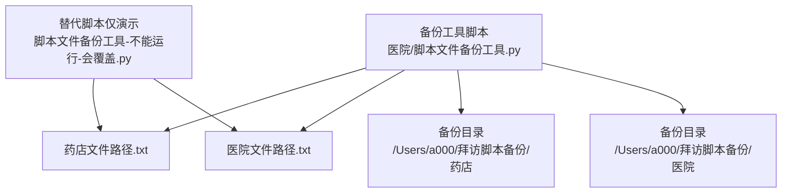
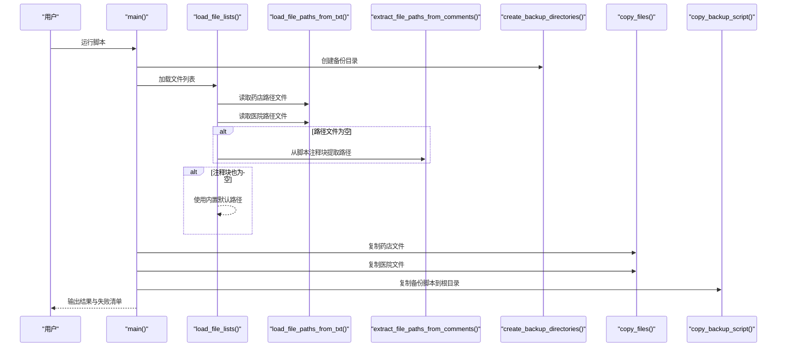
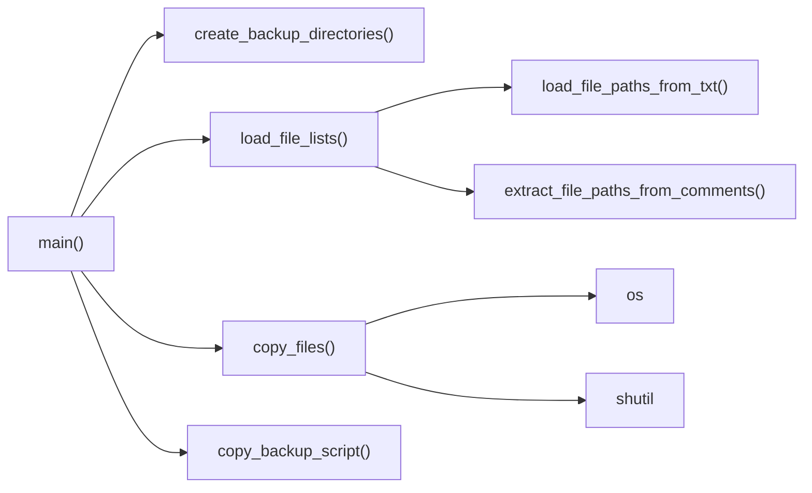
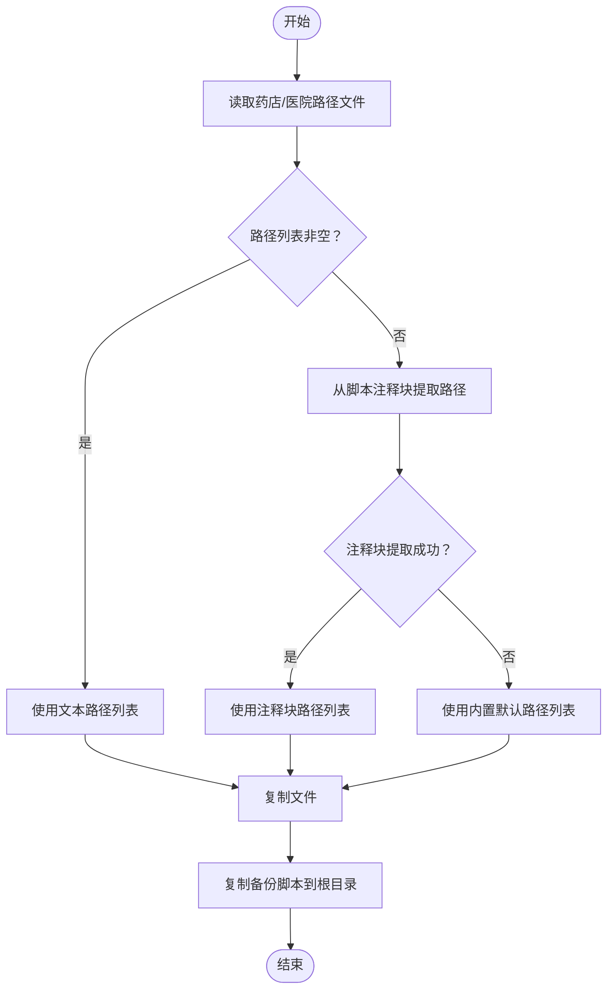
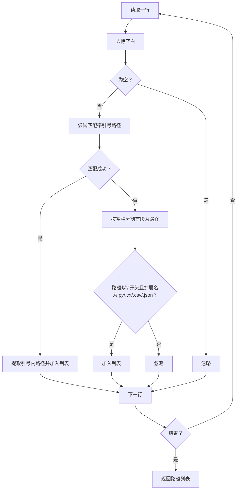

# 备份管理工具

<cite>
**本文引用的文件**
- [医院/脚本文件备份工具.py](file://医院/脚本文件备份工具.py)
- [药店文件路径.txt](file://药店文件路径.txt)
- [医院文件路径.txt](file://医院文件路径.txt)
- [脚本文件备份工具-不能运行-会覆盖.py](file://脚本文件备份工具-不能运行-会覆盖.py)
</cite>

## 目录
1. [简介](#简介)
2. [项目结构](#项目结构)
3. [核心组件](#核心组件)
4. [架构总览](#架构总览)
5. [详细组件分析](#详细组件分析)
6. [依赖关系分析](#依赖关系分析)
7. [性能考量](#性能考量)
8. [故障排查指南](#故障排查指南)
9. [结论](#结论)
10. [附录](#附录)

## 简介
本文件围绕“脚本文件备份工具.py”的三层路径加载机制进行深入解析，重点说明：
- 优先从“药店文件路径.txt”和“医院文件路径.txt”读取路径列表；若失败则尝试从脚本注释块（# {PHARMACY_FILES_START}）提取；最后回退到内置默认路径列表。
- load_file_paths_from_txt 函数如何解析带引号或注释符号的混合路径格式。
- copy_files 函数的错误处理机制及失败文件记录功能。
- 通过 create_backup_directories 和 copy_backup_script 实现自包含备份的特性。
- 在版本控制缺失环境下保障脚本安全的关键价值，并给出定期执行策略建议。

## 项目结构
仓库中与备份工具直接相关的文件包括：
- 备份工具脚本：医院/脚本文件备份工具.py
- 路径配置文件：药店文件路径.txt、医院文件路径.txt
- 一个仅用于演示“纯文本路径加载”的替代脚本：脚本文件备份工具-不能运行-会覆盖.py

图表来源
- [医院/脚本文件备份工具.py](file://医院/脚本文件备份工具.py#L1-L285)
- [药店文件路径.txt](file://药店文件路径.txt#L1-L30)
- [医院文件路径.txt](file://医院文件路径.txt#L1-L54)
- [脚本文件备份工具-不能运行-会覆盖.py](file://脚本文件备份工具-不能运行-会覆盖.py#L1-L209)

章节来源
- [医院/脚本文件备份工具.py](file://医院/脚本文件备份工具.py#L1-L285)
- [药店文件路径.txt](file://药店文件路径.txt#L1-L30)
- [医院文件路径.txt](file://医院文件路径.txt#L1-L54)
- [脚本文件备份工具-不能运行-会覆盖.py](file://脚本文件备份工具-不能运行-会覆盖.py#L1-L209)

## 核心组件
- 三层路径加载机制
  - 优先从“药店文件路径.txt”和“医院文件路径.txt”读取路径列表。
  - 若上述文件为空或读取失败，则尝试从当前脚本的注释块中提取路径。
  - 若仍为空，则使用内置默认路径列表。
- 路径解析函数
  - load_file_paths_from_txt：解析文本文件中的路径，支持带引号路径、带注释路径、以及混合格式。
- 错误处理与失败记录
  - copy_files：逐个复制文件，遇到不存在或异常时记录失败文件并继续处理。
- 自包含备份
  - create_backup_directories：创建药店/医院两类备份目录。
  - copy_backup_script：将备份脚本自身复制到备份根目录，确保可独立运行。

章节来源
- [医院/脚本文件备份工具.py](file://医院/脚本文件备份工具.py#L64-L180)
- [医院/脚本文件备份工具.py](file://医院/脚本文件备份工具.py#L185-L219)
- [医院/脚本文件备份工具.py](file://医院/脚本文件备份工具.py#L238-L253)

## 架构总览
下图展示了三层路径加载流程与关键函数调用关系：

图表来源
- [医院/脚本文件备份工具.py](file://医院/脚本文件备份工具.py#L115-L180)
- [医院/脚本文件备份工具.py](file://医院/脚本文件备份工具.py#L185-L219)
- [医院/脚本文件备份工具.py](file://医院/脚本文件备份工具.py#L238-L253)
- [医院/脚本文件备份工具.py](file://医院/脚本文件备份工具.py#L255-L285)

## 详细组件分析

### 三层路径加载机制
- 优先级
  1) 从“药店文件路径.txt”和“医院文件路径.txt”读取路径列表。
  2) 若为空或读取失败，则从当前脚本注释块中提取路径。
  3) 若仍为空，则使用内置默认路径列表。
- 关键函数
  - load_file_lists：协调三层加载流程。
  - load_file_paths_from_txt：解析文本文件中的路径。
  - extract_file_paths_from_comments：从注释块中提取路径。
- 设计要点
  - 通过“存在性检查+异常捕获”保证容错能力。
  - 注释块采用固定标记（例如“PHARMACY_FILES_START”）定位区域，避免误匹配。
  - 回退到内置默认路径，确保即使在无版本控制或路径文件缺失的情况下也能正常工作。

章节来源
- [医院/脚本文件备份工具.py](file://医院/脚本文件备份工具.py#L115-L180)

### load_file_paths_from_txt 的路径解析规则
- 支持的路径格式
  - 带引号路径："/path/to/file.py" 或 '/path/to/file.py'
  - 不带引号路径：/path/to/file.py
  - 带注释路径：/path/to/file.py 注释内容
  - 带引号且带注释："/path/to/file.py" 注释内容
- 解析策略
  - 首先尝试匹配带引号的路径，提取引号内的路径。
  - 若不匹配，则按空格分割首段作为路径，再校验是否以“/”开头且扩展名为“.py/.txt/.csv/.json”。
  - 忽略空行与无效行，异常时返回空列表并打印错误信息。
- 复杂度
  - 时间复杂度：O(N)，N 为文件行数。
  - 空间复杂度：O(M)，M 为有效路径数量。

章节来源
- [医院/脚本文件备份工具.py](file://医院/脚本文件备份工具.py#L64-L114)

### 注释块路径提取机制
- 标记规范
  - 开始标记：# {SECTION_NAME}_START
  - 结束标记：# {SECTION_NAME}_END
- 提取逻辑
  - 定位开始与结束标记，截取标记之间的区域。
  - 使用正则分别匹配带引号路径与以“#”开头的路径（以空格分隔的路径部分）。
  - 合并两类路径并返回，若未找到则返回 None。
- 容错性
  - 若找不到开始/结束标记，直接返回 None，交由上层决定是否回退默认路径。

章节来源
- [医院/脚本文件备份工具.py](file://医院/脚本文件备份工具.py#L20-L63)

### copy_files 的错误处理与失败记录
- 处理流程
  - 对每个路径尝试存在性检查与复制。
  - 存在即复制并计数成功；不存在或异常则记录失败并继续。
- 输出与统计
  - 打印每个文件的复制状态。
  - 最终输出成功/失败数量，并列出失败文件清单。
- 性能与健壮性
  - 逐个处理，便于定位问题文件。
  - 异常捕获避免中断整体流程。

章节来源
- [医院/脚本文件备份工具.py](file://医院/脚本文件备份工具.py#L193-L219)

### 自包含备份：create_backup_directories 与 copy_backup_script
- create_backup_directories
  - 创建“药店”和“医院”两类备份目录，确保备份根目录存在。
- copy_backup_script
  - 将备份脚本自身复制到备份根目录，使备份目录具备可独立运行的能力。
- 价值
  - 在版本控制缺失或脚本丢失的情况下，仍可通过备份目录中的脚本恢复与执行备份流程。

章节来源
- [医院/脚本文件备份工具.py](file://医院/脚本文件备份工具.py#L185-L192)
- [医院/脚本文件备份工具.py](file://医院/脚本文件备份工具.py#L238-L253)

### 与替代脚本的对比
- 对比文件：脚本文件备份工具-不能运行-会覆盖.py
- 差异点
  - 该替代脚本仅从文本文件加载路径，不包含注释块提取与默认回退逻辑。
  - 缺少“复制备份脚本到根目录”的步骤，不具备自包含备份能力。
- 启示
  - 主脚本通过三层加载与自包含设计，显著提升了可用性与鲁棒性。

章节来源
- [脚本文件备份工具-不能运行-会覆盖.py](file://脚本文件备份工具-不能运行-会覆盖.py#L1-L209)

## 依赖关系分析
- 模块内依赖
  - main 依赖 create_backup_directories、load_file_lists、copy_files、copy_backup_script。
  - load_file_lists 依赖 load_file_paths_from_txt 与 extract_file_paths_from_comments。
  - copy_files 依赖 os、shutil。
- 外部依赖
  - os、shutil、re、pathlib。
- 耦合与内聚
  - 函数职责清晰，耦合度低，便于维护与扩展。

图表来源
- [医院/脚本文件备份工具.py](file://医院/脚本文件备份工具.py#L115-L285)

章节来源
- [医院/脚本文件备份工具.py](file://医院/脚本文件备份工具.py#L115-L285)

## 性能考量
- 路径解析
  - O(N) 行扫描，正则匹配开销较小，适合小至中等规模路径文件。
- 复制过程
  - 逐个文件复制，I/O 为主要瓶颈；失败不影响后续文件处理。
- 建议
  - 路径文件保持简洁，减少无关行；必要时拆分为多个文件以降低单文件体积。
  - 对于大量文件的场景，可考虑批量复制或并行化（需谨慎处理并发写入）。

[本节为通用性能讨论，无需特定文件来源]

## 故障排查指南
- 路径文件为空或读取失败
  - 检查“药店文件路径.txt”和“医院文件路径.txt”是否存在且可读。
  - 确认路径文件编码为 UTF-8。
  - 若路径文件缺失，工具会回退到注释块提取或内置默认路径。
- 注释块未生效
  - 确认注释块标记正确（例如“PHARMACY_FILES_START”、“HOSPITAL_FILES_START”）。
  - 确保标记位于脚本文件中且未被注释屏蔽。
- 文件不存在或复制失败
  - 查看失败清单，确认路径是否正确、文件是否存在、权限是否允许读取。
  - 检查目标备份目录是否可写。
- 脚本不可运行
  - 确认已执行“复制备份脚本到根目录”步骤，使备份目录具备自包含能力。

章节来源
- [医院/脚本文件备份工具.py](file://医院/脚本文件备份工具.py#L115-L180)
- [医院/脚本文件备份工具.py](file://医院/脚本文件备份工具.py#L193-L219)
- [医院/脚本文件备份工具.py](file://医院/脚本文件备份工具.py#L238-L253)

## 结论
该备份工具通过三层路径加载机制与完善的错误处理，实现了在版本控制缺失环境下的稳健备份能力。其自包含备份特性进一步增强了可移植性与可恢复性。建议将其纳入日常运维流程，定期执行以保障脚本资产的安全。

[本节为总结性内容，无需特定文件来源]

## 附录

### 三层路径加载流程图

图表来源
- [医院/脚本文件备份工具.py](file://医院/脚本文件备份工具.py#L115-L180)
- [医院/脚本文件备份工具.py](file://医院/脚本文件备份工具.py#L185-L219)
- [医院/脚本文件备份工具.py](file://医院/脚本文件备份工具.py#L238-L253)

### 路径解析算法流程图

图表来源
- [医院/脚本文件备份工具.py](file://医院/脚本文件备份工具.py#L64-L114)