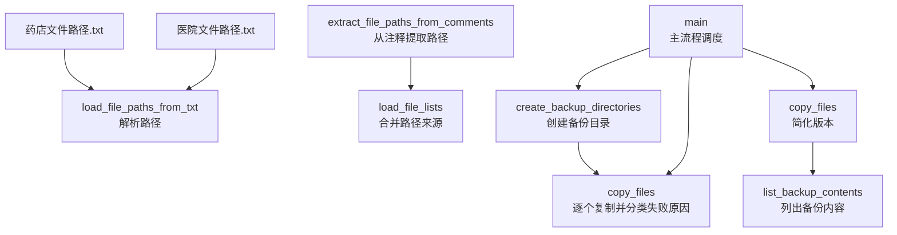
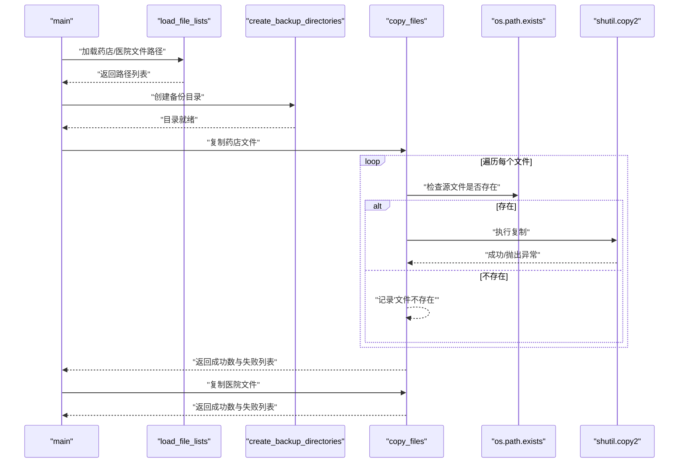
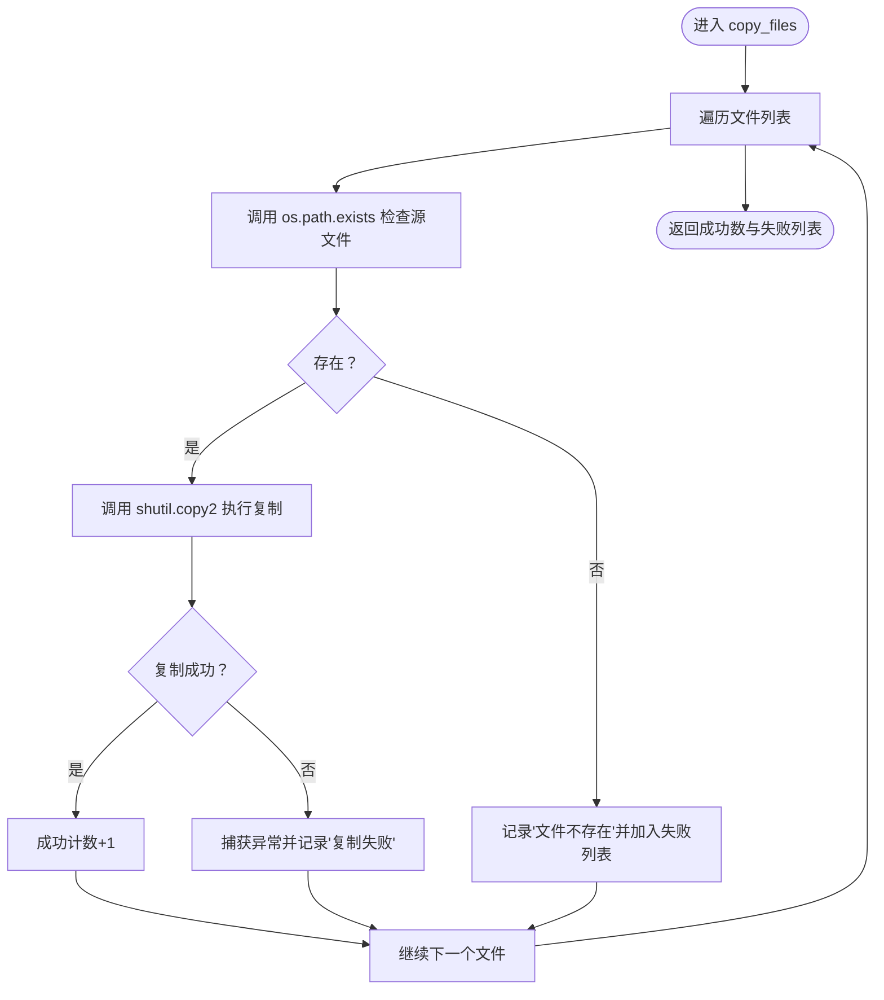
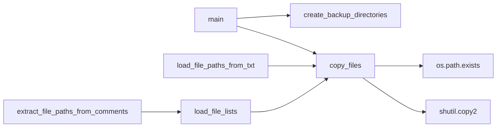

# 异常处理策略

<cite>
**本文引用的文件**
- [医院/脚本文件备份工具.py](file://医院/脚本文件备份工具.py)
- [脚本文件备份工具-別运行-会覆盖.py](file://脚本文件备份工具-別运行-会覆盖.py)
- [药店文件路径.txt](file://药店文件路径.txt)
- [医院文件路径.txt](file://医院文件路径.txt)
</cite>

## 目录
1. [简介](#简介)
2. [项目结构](#项目结构)
3. [核心组件](#核心组件)
4. [架构总览](#架构总览)
5. [详细组件分析](#详细组件分析)
6. [依赖关系分析](#依赖关系分析)
7. [性能考量](#性能考量)
8. [故障排查指南](#故障排查指南)
9. [结论](#结论)
10. [附录](#附录)

## 简介
本文聚焦于仓库中“复制文件”流程的异常处理策略，特别是针对 copy_files 函数中“文件不存在”与“复制异常”的两类失败情形进行深入剖析。我们将解释如何通过 os.path.exists 的显式检查区分“源文件缺失”，以及在 shutil.copy2 执行阶段捕获异常并统一记录为“复制失败”。同时，结合 str(e) 的异常信息输出，讨论其在诊断权限不足、磁盘空间不足、路径过长等常见 IO 问题上的实际价值，并给出基于现有代码的改进建议，包括引入更细粒度的异常类型分类与处理。

## 项目结构
围绕“复制文件”功能的相关文件与职责如下：
- 医院/脚本文件备份工具.py：完整版本，包含路径解析、目录创建、复制、结果统计与展示等全流程逻辑。
- 脚本文件备份工具-別运行-会覆盖.py：简化版本，仅保留复制与结果统计逻辑。
- 药店文件路径.txt / 医院文件路径.txt：分别提供待复制文件的路径清单来源。

图表来源
- [医院/脚本文件备份工具.py](file://医院/脚本文件备份工具.py#L64-L114)
- [医院/脚本文件备份工具.py](file://医院/脚本文件备份工具.py#L115-L179)
- [医院/脚本文件备份工具.py](file://医院/脚本文件备份工具.py#L185-L219)
- [医院/脚本文件备份工具.py](file://医院/脚本文件备份工具.py#L221-L285)
- [脚本文件备份工具-別运行-会覆盖.py](file://脚本文件备份工具-別运行-会覆盖.py#L64-L114)
- [脚本文件备份工具-別运行-会覆盖.py](file://脚本文件备份工具-別运行-会覆盖.py#L129-L163)
- [脚本文件备份工具-別运行-会覆盖.py](file://脚本文件备份工具-別运行-会覆盖.py#L165-L207)

章节来源
- [医院/脚本文件备份工具.py](file://医院/脚本文件备份工具.py#L1-L285)
- [脚本文件备份工具-別运行-会覆盖.py](file://脚本文件备份工具-別运行-会覆盖.py#L1-L209)
- [药店文件路径.txt](file://药店文件路径.txt#L1-L30)
- [医院文件路径.txt](file://医院文件路径.txt#L1-L54)

## 核心组件
- 路径解析与加载
  - 从文本文件解析路径列表，兼容带引号与不带引号的路径格式。
  - 若文本文件不可用或为空，则回退至从脚本注释区域提取路径。
- 目录准备
  - 确保备份目录存在，避免后续复制时报错。
- 复制流程与异常处理
  - 对每个待复制文件，先显式检查是否存在；若存在则调用 shutil.copy2 执行复制；否则直接记录“文件不存在”。
  - 在 shutil.copy2 执行期间捕获任何异常，统一记录为“复制失败”，并将异常信息字符串化输出，便于定位具体原因。
- 结果统计与展示
  - 统计成功/失败数量，汇总失败文件列表，打印结果摘要。

章节来源
- [医院/脚本文件备份工具.py](file://医院/脚本文件备份工具.py#L64-L114)
- [医院/脚本文件备份工具.py](file://医院/脚本文件备份工具.py#L115-L179)
- [医院/脚本文件备份工具.py](file://医院/脚本文件备份工具.py#L185-L219)
- [脚本文件备份工具-別运行-会覆盖.py](file://脚本文件备份工具-別运行-会覆盖.py#L64-L114)
- [脚本文件备份工具-別运行-会覆盖.py](file://脚本文件备份工具-別运行-会覆盖.py#L129-L163)

## 架构总览
下图展示了“复制文件”流程的端到端调用关系与关键决策点。

图表来源
- [医院/脚本文件备份工具.py](file://医院/脚本文件备份工具.py#L185-L219)
- [医院/脚本文件备份工具.py](file://医院/脚本文件备份工具.py#L255-L285)
- [脚本文件备份工具-別运行-会覆盖.py](file://脚本文件备份工具-別运行-会覆盖.py#L129-L163)
- [脚本文件备份工具-別运行-会覆盖.py](file://脚本文件备份工具-別运行-会覆盖.py#L184-L207)

## 详细组件分析

### copy_files 函数的异常处理机制
- 失败分类策略
  - “文件不存在”：在进入 shutil.copy2 之前，通过 os.path.exists 显式判断源文件是否存在。若不存在，直接记录该条目为“文件不存在”，并计入失败列表。
  - “复制失败”：在 shutil.copy2 执行过程中，若发生异常（例如权限不足、磁盘空间不足、路径过长、目标目录不可写等），将被捕获并统一记录为“复制失败”，同时输出异常信息字符串，便于快速定位问题。
- 异常信息的价值
  - str(e) 输出能够暴露底层系统错误的具体描述，有助于区分“权限不足”（通常涉及权限相关错误码）、“磁盘空间不足”（通常包含空间不足提示）、“路径过长”（平台限制相关）等不同 IO 问题类别，从而指导针对性修复。
- 当前实现的局限
  - 使用通用 Exception 捕获，未对具体异常类型进行细分，无法自动区分“权限不足”、“磁盘空间不足”、“路径过长”等场景，需要人工阅读 str(e) 进行判断。

图表来源
- [医院/脚本文件备份工具.py](file://医院/脚本文件备份工具.py#L193-L219)
- [脚本文件备份工具-別运行-会覆盖.py](file://脚本文件备份工具-別运行-会覆盖.py#L137-L163)

章节来源
- [医院/脚本文件备份工具.py](file://医院/脚本文件备份工具.py#L193-L219)
- [脚本文件备份工具-別运行-会覆盖.py](file://脚本文件备份工具-別运行-会覆盖.py#L137-L163)

### 异常信息与诊断实践
- 权限不足
  - 常见表现：源文件只读或目标目录无写权限；str(e) 中可能包含权限相关关键字。
  - 诊断建议：确认源文件权限与目标目录权限，必要时提升权限或切换到可写目录。
- 磁盘空间不足
  - 常见表现：复制过程中抛出资源不足类异常；str(e) 中可能包含“no space left on device”等提示。
  - 诊断建议：清理目标磁盘空间或更换目标路径。
- 路径过长
  - 常见表现：在 Windows 平台出现路径超长错误；str(e) 中可能包含路径长度相关提示。
  - 诊断建议：缩短路径或使用短路径别名，避免超过平台限制。
- 其他 IO 问题
  - 如目标目录不存在、网络存储断开、文件被占用等；str(e) 可作为第一手线索辅助定位。

章节来源
- [医院/脚本文件备份工具.py](file://医院/脚本文件备份工具.py#L193-L219)
- [脚本文件备份工具-別运行-会覆盖.py](file://脚本文件备份工具-別运行-会覆盖.py#L137-L163)

### 改进建议（基于现有代码）
- 引入更细粒度的异常类型分类
  - 在捕获异常后，根据异常类型或 str(e) 的特征子串进行分类，例如：
    - PermissionError：权限不足
    - OSError 且包含“space”：磁盘空间不足
    - OSError 且包含“path”或“too long”：路径过长
    - 其他 OSError：其他 IO 错误
  - 分类后的日志输出应包含明确的标签，便于自动化检索与告警。
- 增强日志字段
  - 记录异常类型、异常码（如 errno）、源路径、目标路径等，便于后续审计与回溯。
- 可选：对“文件不存在”与“复制失败”分别统计并输出不同报表，提高可读性。
- 可选：在复制失败时尝试重试（如权限临时冲突导致的偶发失败），并设置最大重试次数与退避策略。

章节来源
- [医院/脚本文件备份工具.py](file://医院/脚本文件备份工具.py#L193-L219)
- [脚本文件备份工具-別运行-会覆盖.py](file://脚本文件备份工具-別运行-会覆盖.py#L137-L163)

## 依赖关系分析
- 模块间耦合
  - copy_files 依赖 os.path.exists 与 shutil.copy2，二者分别承担“存在性检查”和“复制执行”的职责。
  - 主流程 main 调用 create_backup_directories 与 copy_files，形成清晰的职责分离。
- 外部依赖
  - 文件系统 API（os、shutil）与文本解析（re）。
- 潜在风险
  - 由于使用通用 Exception 捕获，若未来引入第三方库或自定义异常，需评估对日志分类的影响。
  - 路径解析依赖正则表达式，复杂路径格式可能影响准确性，建议增加健壮性校验。

图表来源
- [医院/脚本文件备份工具.py](file://医院/脚本文件备份工具.py#L185-L219)
- [医院/脚本文件备份工具.py](file://医院/脚本文件备份工具.py#L64-L114)
- [医院/脚本文件备份工具.py](file://医院/脚本文件备份工具.py#L115-L179)
- [医院/脚本文件备份工具.py](file://医院/脚本文件备份工具.py#L255-L285)

章节来源
- [医院/脚本文件备份工具.py](file://医院/脚本文件备份工具.py#L64-L114)
- [医院/脚本文件备份工具.py](file://医院/脚本文件备份工具.py#L115-L179)
- [医院/脚本文件备份工具.py](file://医院/脚本文件备份工具.py#L185-L219)
- [医院/脚本文件备份工具.py](file://医院/脚本文件备份工具.py#L255-L285)

## 性能考量
- 复杂度分析
  - 对于 n 个待复制文件，整体时间复杂度近似 O(n)，主要消耗在文件系统 IO 与异常捕获。
  - os.path.exists 与 shutil.copy2 的调用次数与文件数量线性相关。
- 优化建议
  - 批量复制时可考虑并发（注意线程/进程安全与异常隔离）。
  - 对于大量小文件，减少频繁的日志输出频率，或采用异步日志。
  - 预先检查目标目录可用空间，避免在复制中途失败造成资源浪费。

[本节为一般性建议，无需特定文件来源]

## 故障排查指南
- 快速定位步骤
  - 查看失败列表与对应日志，区分“文件不存在”与“复制失败”两类。
  - 对“复制失败”项，关注 str(e) 中的关键字（如权限、空间、路径等）。
- 常见问题与处置
  - 权限不足：提升源文件或目标目录权限，或切换到可写路径。
  - 磁盘空间不足：清理目标磁盘或更换目标路径。
  - 路径过长：缩短路径或使用短路径别名。
  - 目标目录不存在：确保 create_backup_directories 已正确执行。
- 可视化排查
  - 将失败文件按类型分组（不存在、权限、空间、路径、其他），形成简易报表，辅助集中处理。

章节来源
- [医院/脚本文件备份工具.py](file://医院/脚本文件备份工具.py#L193-L219)
- [脚本文件备份工具-別运行-会覆盖.py](file://脚本文件备份工具-別运行-会覆盖.py#L137-L163)

## 结论
现有 copy_files 实现通过“显式存在性检查 + 统一异常捕获”的方式，实现了对“文件不存在”与“复制异常”的基本区分，并借助 str(e) 的输出提升了故障诊断效率。为进一步提升可观测性与自动化运维能力，建议引入更细粒度的异常类型分类与增强日志字段，以便快速识别与自动处理常见问题。

[本节为总结性内容，无需特定文件来源]

## 附录
- 关键路径参考
  - 复制函数定义与异常处理：[医院/脚本文件备份工具.py](file://医院/脚本文件备份工具.py#L193-L219)、[脚本文件备份工具-別运行-会覆盖.py](file://脚本文件备份工具-別运行-会覆盖.py#L137-L163)
  - 路径解析与加载：[医院/脚本文件备份工具.py](file://医院/脚本文件备份工具.py#L64-L114)、[医院/脚本文件备份工具.py](file://医院/脚本文件备份工具.py#L115-L179)
  - 目录创建与主流程：[医院/脚本文件备份工具.py](file://医院/脚本文件备份工具.py#L185-L219)、[医院/脚本文件备份工具.py](file://医院/脚本文件备份工具.py#L255-L285)