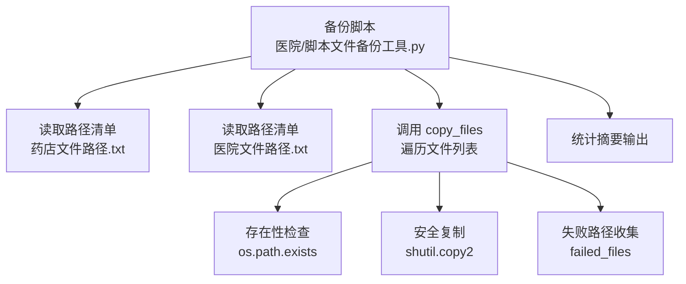
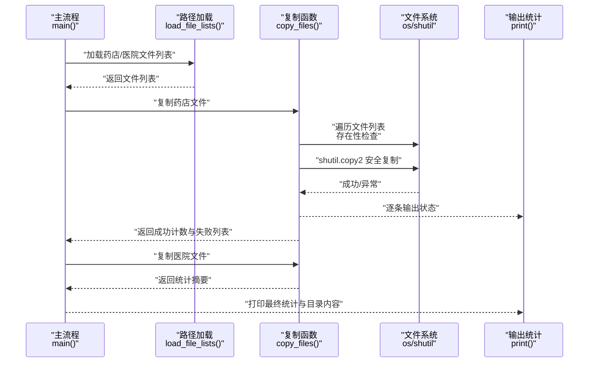
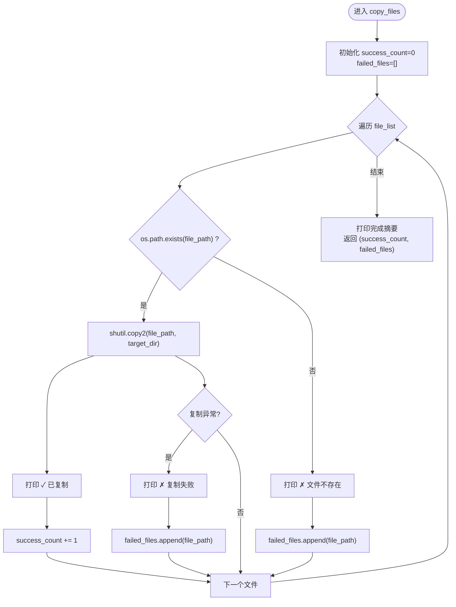
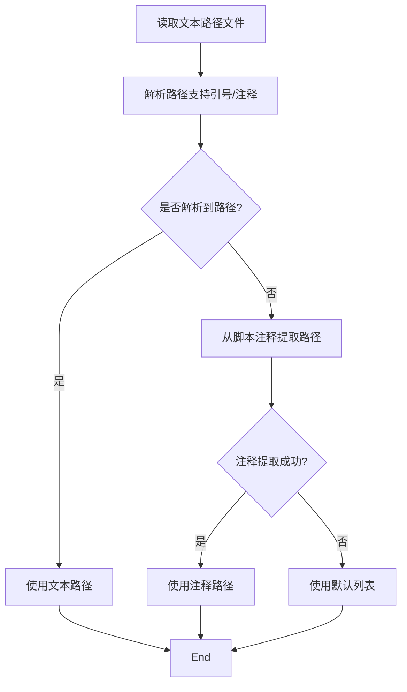
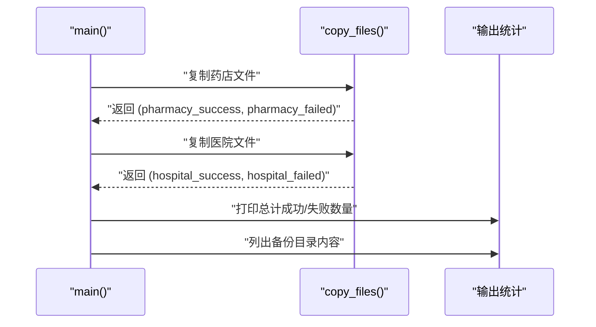
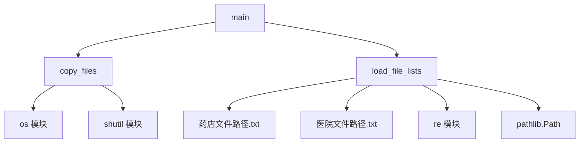

# 文件复制机制

<cite>
**本文引用的文件**
- [医院/脚本文件备份工具.py](file://医院/脚本文件备份工具.py)
- [脚本文件备份工具-不能运行-会覆盖.py](file://脚本文件备份工具-不能运行-会覆盖.py)
- [药店文件路径.txt](file://药店文件路径.txt)
- [医院文件路径.txt](file://医院文件路径.txt)
</cite>

## 目录
1. [简介](#简介)
2. [项目结构](#项目结构)
3. [核心组件](#核心组件)
4. [架构总览](#架构总览)
5. [详细组件分析](#详细组件分析)
6. [依赖分析](#依赖分析)
7. [性能考虑](#性能考虑)
8. [故障排查指南](#故障排查指南)
9. [结论](#结论)
10. [附录](#附录)

## 简介
本文围绕仓库中的 copy_files 函数展开，系统解析其文件复制流程：如何遍历文件列表、如何区分“文件不存在”与“复制异常”两类失败、如何通过失败路径收集与逐条输出实现可追踪的复制状态、以及成功计数与最终统计摘要的生成逻辑。同时，结合实际代码实现，说明该函数在面对权限问题、磁盘空间不足、路径过长等常见 IO 异常时的容错能力，并给出可落地的优化建议（如重试机制、日志持久化）。

## 项目结构
本仓库围绕“备份脚本文件”的自动化需求组织，核心文件与路径如下：
- 备份脚本：位于“医院/脚本文件备份工具.py”，负责从文本文件或脚本注释中加载待复制文件列表，调用 copy_files 完成复制，并汇总统计。
- 备份脚本（覆盖版本）：位于“脚本文件备份工具-不能运行-会覆盖.py”，功能与前者一致，但不包含“复制备份脚本本身”的逻辑。
- 路径清单：位于“药店文件路径.txt”和“医院文件路径.txt”，分别提供两类场景下的文件路径集合，供脚本读取并批量复制。

图表来源
- [医院/脚本文件备份工具.py](file://医院/脚本文件备份工具.py#L193-L219)
- [药店文件路径.txt](file://药店文件路径.txt#L1-L30)
- [医院文件路径.txt](file://医院文件路径.txt#L1-L54)

章节来源
- [医院/脚本文件备份工具.py](file://医院/脚本文件备份工具.py#L1-L285)
- [药店文件路径.txt](file://药店文件路径.txt#L1-L30)
- [医院文件路径.txt](file://医院文件路径.txt#L1-L54)

## 核心组件
- copy_files 函数：接收文件列表、目标目录与类别名称，逐条执行存在性检查与复制，维护成功计数与失败列表，并输出逐条状态与最终统计摘要。
- 路径加载模块：从文本文件读取路径列表，支持带引号与带注释的路径格式；若文本文件缺失或为空，则回退到从脚本注释区域提取路径。
- 主流程：创建备份目录、调用 copy_files 复制两类文件、打印统计摘要、列出备份目录内容。

章节来源
- [医院/脚本文件备份工具.py](file://医院/脚本文件备份工具.py#L193-L219)
- [医院/脚本文件备份工具.py](file://医院/脚本文件备份工具.py#L115-L180)
- [医院/脚本文件备份工具.py](file://医院/脚本文件备份工具.py#L255-L285)

## 架构总览
下图展示从路径加载到复制执行再到统计输出的整体流程，映射到实际代码文件与关键函数。

图表来源
- [医院/脚本文件备份工具.py](file://医院/脚本文件备份工具.py#L115-L180)
- [医院/脚本文件备份工具.py](file://医院/脚本文件备份工具.py#L193-L219)
- [医院/脚本文件备份工具.py](file://医院/脚本文件备份工具.py#L255-L285)

## 详细组件分析

### copy_files 函数：复制流程与错误处理
- 输入参数
  - file_list：待复制的文件路径列表
  - target_dir：目标备份目录
  - category_name：类别名称（用于输出提示）
- 处理逻辑
  - 初始化 success_count 计数器与 failed_files 列表
  - 遍历 file_list 中的每个 file_path
  - 存在性检查：使用 os.path.exists 判断文件是否存在
  - 安全复制：使用 shutil.copy2 完成复制（保留元数据）
  - 成功分支：打印“✓ 已复制”并递增成功计数
  - 失败分支：
    - 文件不存在：打印“✗ 文件不存在”并将路径加入 failed_files
    - 复制异常：捕获 Exception 并打印“✗ 复制失败”，同时将路径加入 failed_files
- 输出与统计
  - 打印类别完成摘要：成功数量与失败数量
  - 若存在失败项，逐条列出失败路径
  - 返回 (success_count, failed_files)，供上层汇总

图表来源
- [医院/脚本文件备份工具.py](file://医院/脚本文件备份工具.py#L193-L219)

章节来源
- [医院/脚本文件备份工具.py](file://医院/脚本文件备份工具.py#L193-L219)

### 路径加载与来源
- 从文本文件加载：优先读取“药店文件路径.txt”和“医院文件路径.txt”，支持带引号与带注释的路径格式，过滤无效行。
- 回退策略：若文本文件为空或缺失，回退到从当前脚本注释区域提取路径（仅“医院/脚本文件备份工具.py”具备此能力）。
- 默认列表：若仍为空，则使用内置默认文件列表（仅“医院/脚本文件备份工具.py”具备此能力）。

图表来源
- [医院/脚本文件备份工具.py](file://医院/脚本文件备份工具.py#L64-L114)
- [医院/脚本文件备份工具.py](file://医院/脚本文件备份工具.py#L115-L180)

章节来源
- [医院/脚本文件备份工具.py](file://医院/脚本文件备份工具.py#L64-L114)
- [医院/脚本文件备份工具.py](file://医院/脚本文件备份工具.py#L115-L180)
- [药店文件路径.txt](file://药店文件路径.txt#L1-L30)
- [医院文件路径.txt](file://医院文件路径.txt#L1-L54)

### 主流程与统计摘要
- 主流程：创建备份目录、分别调用 copy_files 复制两类文件、打印总计统计、列出备份目录内容。
- 统计摘要：计算两类文件的成功总数与失败总数，输出到控制台。

图表来源
- [医院/脚本文件备份工具.py](file://医院/脚本文件备份工具.py#L255-L285)

章节来源
- [医院/脚本文件备份工具.py](file://医院/脚本文件备份工具.py#L255-L285)

## 依赖分析
- 外部依赖
  - os：文件存在性检查、目录创建、路径拼接与列举
  - shutil：安全复制（保留元数据）
  - re：路径解析的正则匹配
  - pathlib.Path：路径对象（在部分函数中使用）
- 内部依赖
  - 路径加载函数依赖文本文件与脚本注释区域
  - copy_files 依赖 os 与 shutil 的行为
  - 主流程依赖 copy_files 的返回值进行统计

图表来源
- [医院/脚本文件备份工具.py](file://医院/脚本文件备份工具.py#L193-L219)
- [医院/脚本文件备份工具.py](file://医院/脚本文件备份工具.py#L115-L180)
- [药店文件路径.txt](file://药店文件路径.txt#L1-L30)
- [医院文件路径.txt](file://医院文件路径.txt#L1-L54)

章节来源
- [医院/脚本文件备份工具.py](file://医院/脚本文件备份工具.py#L1-L285)
- [药店文件路径.txt](file://药店文件路径.txt#L1-L30)
- [医院文件路径.txt](file://医院文件路径.txt#L1-L54)

## 性能考虑
- I/O 密集型：复制过程主要受磁盘写入速度限制，建议批量复制时避免频繁创建目录与重复检查。
- 路径解析成本：正则解析路径在大量路径时可能成为瓶颈，可考虑缓存解析结果或减少重复解析。
- 失败路径收集：失败列表仅用于输出与报告，不会显著影响性能，但应避免在极大规模场景下无界增长。
- 元数据复制：shutil.copy2 会复制时间戳等元数据，通常开销较小，但在大量小文件场景下累积成本不可忽视。

## 故障排查指南
- “文件不存在”与“复制异常”的区分
  - 区分依据：先做存在性检查，再做复制；若存在性检查失败，直接记录为“文件不存在”；若存在性检查通过而复制抛异常，则记录为“复制失败”。该设计确保两类失败被明确区分并分别计入 failed_files。
- 常见 IO 异常与容错
  - 权限问题：复制抛异常会被捕获并记录到 failed_files，程序继续处理下一个文件，具备容错能力。
  - 磁盘空间不足：复制抛异常被捕获并记录，不影响其他文件的处理。
  - 路径过长：复制抛异常被捕获并记录，程序继续推进。
- 输出与报告
  - 逐条输出“✓/✗”状态，便于快速定位问题文件。
  - 最终统计摘要显示成功与失败数量，失败列表逐条列出，便于人工复核与二次处理。

章节来源
- [医院/脚本文件备份工具.py](file://医院/脚本文件备份工具.py#L193-L219)

## 结论
copy_files 函数通过“存在性检查 + shutil.copy2 + 异常捕获”的组合，实现了对两类失败的清晰区分与可靠容错。其“逐条输出状态 + 最终统计摘要”的设计，既保证了可观测性，也为后续报告与二次处理提供了便利。针对大规模场景，建议引入重试机制与日志持久化，以进一步提升稳定性与可追溯性。

## 附录
- 优化建议
  - 重试机制：对复制异常（如瞬时 IO 错误）增加有限次数重试，提高成功率。
  - 日志持久化：将失败路径与异常信息写入日志文件，便于离线分析与审计。
  - 并发复制：在确保目标目录可用的前提下，采用并发复制（需注意线程安全与资源竞争）。
  - 路径校验：在复制前对路径长度与字符合法性进行预检，提前发现潜在问题。
  - 统计增强：在最终摘要中增加耗时统计、平均速率等指标，辅助性能评估。