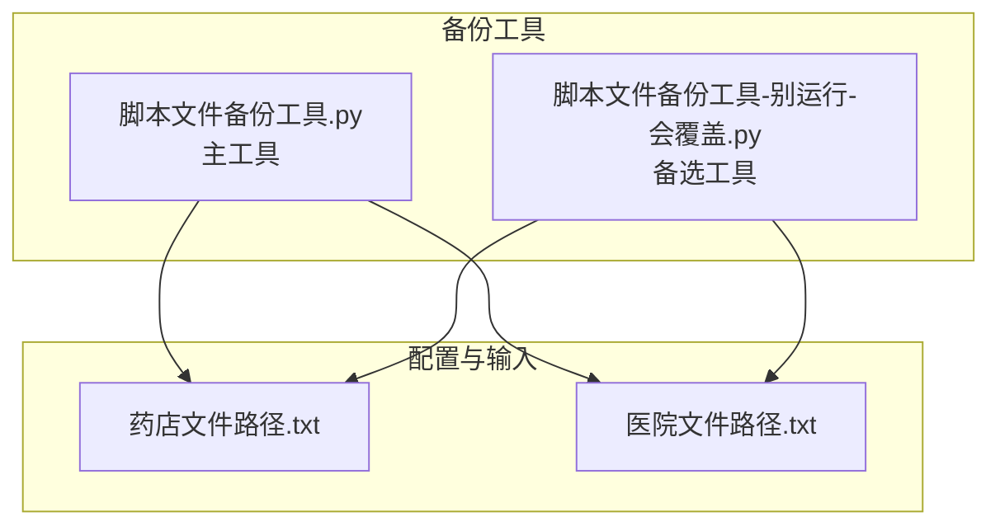
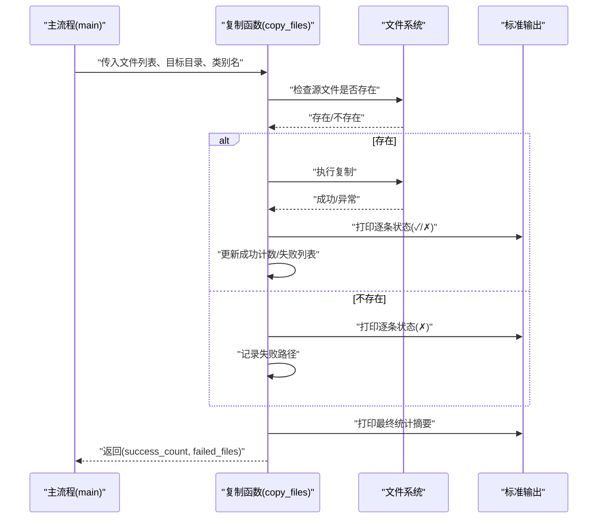
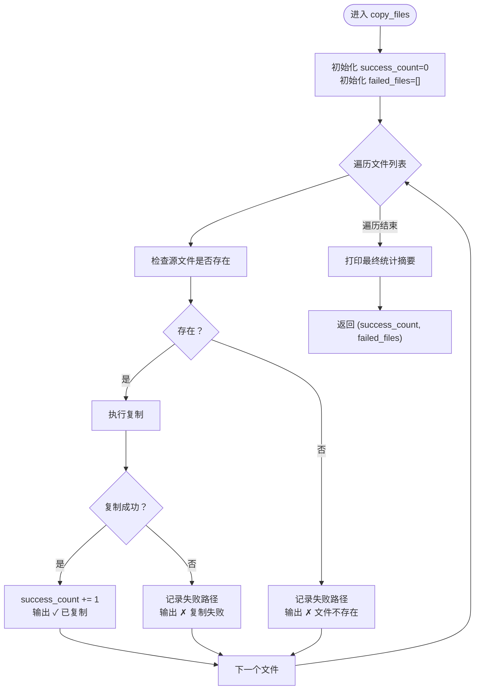
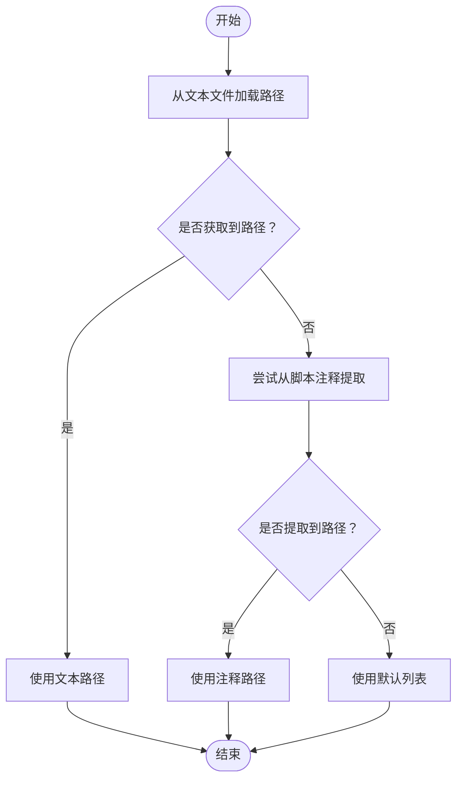
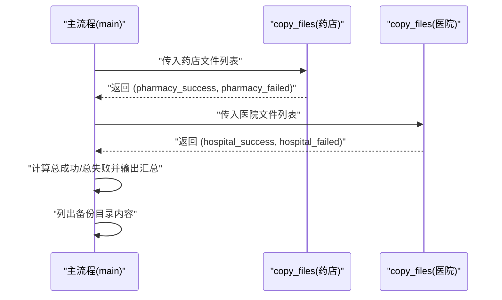

# 状态跟踪机制

<cite>
**本文引用的文件**
- [脚本文件备份工具.py](file://医院/脚本文件备份工具.py)
- [脚本文件备份工具-别运行-会覆盖.py](file://脚本文件备份工具-别运行-会覆盖.py)
- [药店文件路径.txt](file://药店文件路径.txt)
- [医院文件路径.txt](file://医院文件路径.txt)
</cite>

## 目录
1. [简介](#简介)
2. [项目结构](#项目结构)
3. [核心组件](#核心组件)
4. [架构总览](#架构总览)
5. [详细组件分析](#详细组件分析)
6. [依赖关系分析](#依赖关系分析)
7. [性能考量](#性能考量)
8. [故障排查指南](#故障排查指南)
9. [结论](#结论)
10. [附录](#附录)

## 简介
本节聚焦于批量文件复制操作中的状态跟踪机制，重点解析 copy_files 函数中“成功计数器”与“失败列表”的设计原理与协作方式，说明其在以下方面的价值：
- 成功计数器如何准确统计成功复制的文件数量；
- 失败列表如何收集复制失败的文件路径，便于后续错误报告；
- 逐条输出复制状态（✓/✗）的用户反馈机制如何提升操作透明度；
- 最终统计摘要的生成逻辑及其对操作结果评估的价值；
- 如何通过这些状态跟踪元素协同工作，形成完整的操作审计轨迹。

## 项目结构
该仓库围绕“脚本文件备份工具”展开，主要涉及两类实现：
- 主工具：负责从文本文件或脚本注释中加载待备份文件列表，执行复制与汇总统计。
- 备选工具：仅从文本文件加载路径，功能与主工具类似，但路径来源不同。

图表来源
- [脚本文件备份工具.py](file://医院/脚本文件备份工具.py#L180-L219)
- [脚本文件备份工具-别运行-会覆盖.py](file://脚本文件备份工具-别运行-会覆盖.py#L115-L163)
- [药店文件路径.txt](file://药店文件路径.txt#L1-L30)
- [医院文件路径.txt](file://医院文件路径.txt#L1-L54)

章节来源
- [脚本文件备份工具.py](file://医院/脚本文件备份工具.py#L1-L285)
- [脚本文件备份工具-别运行-会覆盖.py](file://脚本文件备份工具-别运行-会覆盖.py#L1-L209)
- [药店文件路径.txt](file://药店文件路径.txt#L1-L30)
- [医院文件路径.txt](file://医院文件路径.txt#L1-L54)

## 核心组件
- copy_files 函数：负责遍历文件列表，执行复制、记录成功与失败、输出逐条状态与最终摘要，并返回成功计数与失败列表。
- 路径加载模块：
  - 主工具：优先从文本文件加载路径；若缺失，则尝试从脚本注释区域提取；仍缺失则使用默认列表。
  - 备选工具：仅从文本文件加载路径。
- 主流程：在 main 中调用 copy_files 对两类文件分别进行复制，并汇总统计。

章节来源
- [脚本文件备份工具.py](file://医院/脚本文件备份工具.py#L192-L219)
- [脚本文件备份工具.py](file://医院/脚本文件备份工具.py#L115-L179)
- [脚本文件备份工具.py](file://医院/脚本文件备份工具.py#L255-L285)
- [脚本文件备份工具-别运行-会覆盖.py](file://脚本文件备份工具-别运行-会覆盖.py#L137-L163)
- [脚本文件备份工具-别运行-会覆盖.py](file://脚本文件备份工具-别运行-会覆盖.py#L184-L207)

## 架构总览
下图展示复制流程与状态跟踪的关键节点，包括逐条状态输出与最终统计摘要。

图表来源
- [脚本文件备份工具.py](file://医院/脚本文件备份工具.py#L192-L219)
- [脚本文件备份工具-别运行-会覆盖.py](file://脚本文件备份工具-别运行-会覆盖.py#L137-L163)

## 详细组件分析

### copy_files 函数的状态跟踪设计
- 成功计数器（success_count）
  - 初始化为 0，用于累计成功复制的文件数量。
  - 在每次成功复制后递增，确保统计精确。
- 失败列表（failed_files）
  - 初始化为空列表，用于收集复制失败或源文件不存在的路径。
  - 当遇到“文件不存在”或异常时，将路径追加至列表，便于后续统一展示与审计。
- 逐条状态输出（✓/✗）
  - 对每个文件，无论成功或失败均输出一行状态，帮助用户即时获知执行结果。
  - 成功时输出“✓ 已复制”，失败时输出“✗ 复制失败/文件不存在”。
- 最终统计摘要
  - 输出“成功 X 个，失败 Y 个”的摘要。
  - 若存在失败项，进一步列出失败文件清单，便于快速定位问题。

图表来源
- [脚本文件备份工具.py](file://医院/脚本文件备份工具.py#L192-L219)
- [脚本文件备份工具-别运行-会覆盖.py](file://脚本文件备份工具-别运行-会覆盖.py#L137-L163)

章节来源
- [脚本文件备份工具.py](file://医院/脚本文件备份工具.py#L192-L219)
- [脚本文件备份工具-别运行-会覆盖.py](file://脚本文件备份工具-别运行-会覆盖.py#L137-L163)

### 路径加载与输入来源
- 主工具的路径加载策略
  - 优先从文本文件加载路径；
  - 若缺失，则尝试从脚本注释区域提取；
  - 仍缺失则使用默认列表。
- 备选工具的路径加载策略
  - 仅从文本文件加载路径。
- 输入文件示例
  - 药店文件路径.txt
  - 医院文件路径.txt

图表来源
- [脚本文件备份工具.py](file://医院/脚本文件备份工具.py#L115-L179)

章节来源
- [脚本文件备份工具.py](file://医院/脚本文件备份工具.py#L115-L179)
- [药店文件路径.txt](file://药店文件路径.txt#L1-L30)
- [医院文件路径.txt](file://医院文件路径.txt#L1-L54)

### 主流程中的状态聚合与审计
- 主流程在调用 copy_files 后，接收返回的 (success_count, failed_files)，并进行汇总统计：
  - 总成功数 = 药店成功数 + 医院成功数；
  - 总失败数 = 药店失败数 + 医院失败数；
  - 可选地输出“备份脚本已复制到备份目录根目录”的提示；
  - 最后列出备份目录内容，形成可审计的最终结果视图。

图表来源
- [脚本文件备份工具.py](file://医院/脚本文件备份工具.py#L255-L285)
- [脚本文件备份工具-别运行-会覆盖.py](file://脚本文件备份工具-别运行-会覆盖.py#L184-L207)

章节来源
- [脚本文件备份工具.py](file://医院/脚本文件备份工具.py#L255-L285)
- [脚本文件备份工具-别运行-会覆盖.py](file://脚本文件备份工具-别运行-会覆盖.py#L184-L207)

## 依赖关系分析
- copy_files 依赖：
  - 文件系统接口：os.path.exists、shutil.copy2；
  - 标准输出：print；
  - 返回值：success_count、failed_files。
- 路径来源：
  - 文本文件（药店/医院文件路径.txt）；
  - 脚本注释区域（主工具）；
  - 默认列表（主工具）。
- 主流程依赖：
  - copy_files 的返回值用于汇总统计；
  - list_backup_contents 用于最终审计视图。

图表来源
- [脚本文件备份工具.py](file://医院/脚本文件备份工具.py#L115-L179)
- [脚本文件备份工具.py](file://医院/脚本文件备份工具.py#L192-L219)
- [脚本文件备份工具.py](file://医院/脚本文件备份工具.py#L221-L237)
- [脚本文件备份工具-别运行-会覆盖.py](file://脚本文件备份工具-别运行-会覆盖.py#L115-L163)
- [脚本文件备份工具-别运行-会覆盖.py](file://脚本文件备份工具-别运行-会覆盖.py#L137-L163)

章节来源
- [脚本文件备份工具.py](file://医院/脚本文件备份工具.py#L115-L179)
- [脚本文件备份工具.py](file://医院/脚本文件备份工具.py#L192-L219)
- [脚本文件备份工具.py](file://医院/脚本文件备份工具.py#L221-L237)
- [脚本文件备份工具-别运行-会覆盖.py](file://脚本文件备份工具-别运行-会覆盖.py#L115-L163)
- [脚本文件备份工具-别运行-会覆盖.py](file://脚本文件备份工具-别运行-会覆盖.py#L137-L163)

## 性能考量
- 时间复杂度
  - 复制过程对每个文件执行一次存在性检查与一次复制操作，整体时间复杂度为 O(N)，N 为文件数量。
- 空间复杂度
  - 失败列表最多存储 N 个路径，空间复杂度为 O(N)。
- I/O 特性
  - 复制操作受磁盘吞吐影响；逐条输出有助于用户感知进度，但也会带来额外的 I/O 开销。
- 优化建议
  - 对于大量小文件，可考虑批处理或并发复制（需谨慎处理锁与错误隔离）；
  - 在输出频率与性能之间权衡，必要时减少逐条输出或合并输出缓冲。

## 故障排查指南
- 常见问题与定位
  - 文件不存在：检查路径是否正确、权限是否足够、路径是否来自预期来源（文本文件/注释/默认列表）。
  - 复制失败：查看异常信息，确认目标目录权限、磁盘空间、文件占用情况。
- 审计与复现
  - 使用失败列表快速定位失败文件；
  - 结合最终统计摘要核对总成功/失败数量；
  - 通过列出备份目录内容验证复制结果。

章节来源
- [脚本文件备份工具.py](file://医院/脚本文件备份工具.py#L192-L219)
- [脚本文件备份工具.py](file://医院/脚本文件备份工具.py#L221-L237)
- [脚本文件备份工具-别运行-会覆盖.py](file://脚本文件备份工具-别运行-会覆盖.py#L137-L163)
- [脚本文件备份工具-别运行-会覆盖.py](file://脚本文件备份工具-别运行-会覆盖.py#L165-L181)

## 结论
copy_files 函数通过“成功计数器 + 失败列表 + 逐条状态输出 + 最终统计摘要”的组合，实现了对批量文件复制操作的精细化状态跟踪与审计：
- 成功计数器确保成功数量的精确统计；
- 失败列表提供可追溯的失败路径集合；
- 逐条输出显著提升了操作透明度；
- 最终摘要与目录内容共同构成完整的审计视图。

这些元素协同工作，为操作结果评估与问题定位提供了可靠依据。

## 附录
- 关键实现参考路径
  - [copy_files 函数（主工具）](file://医院/脚本文件备份工具.py#L192-L219)
  - [copy_files 函数（备选工具）](file://脚本文件备份工具-别运行-会覆盖.py#L137-L163)
  - [主流程调用与汇总](file://医院/脚本文件备份工具.py#L255-L285)
  - [路径加载策略（主工具）](file://医院/脚本文件备份工具.py#L115-L179)
  - [路径加载策略（备选工具）](file://脚本文件备份工具-别运行-会覆盖.py#L115-L163)
  - [输入文件示例](file://药店文件路径.txt#L1-L30)
  - [输入文件示例](file://医院文件路径.txt#L1-L54)