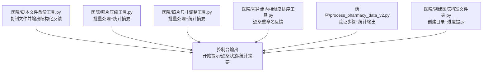
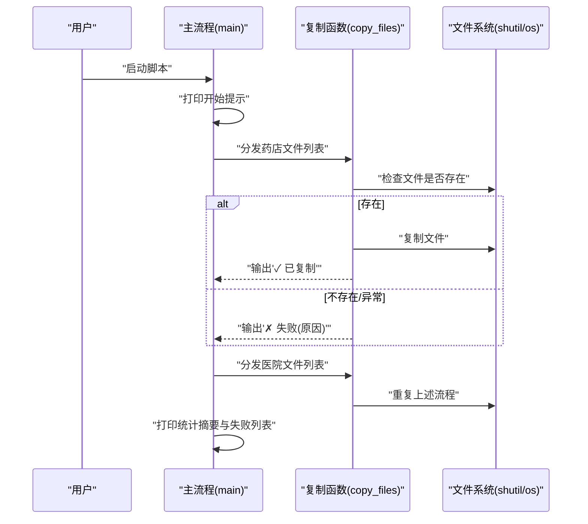
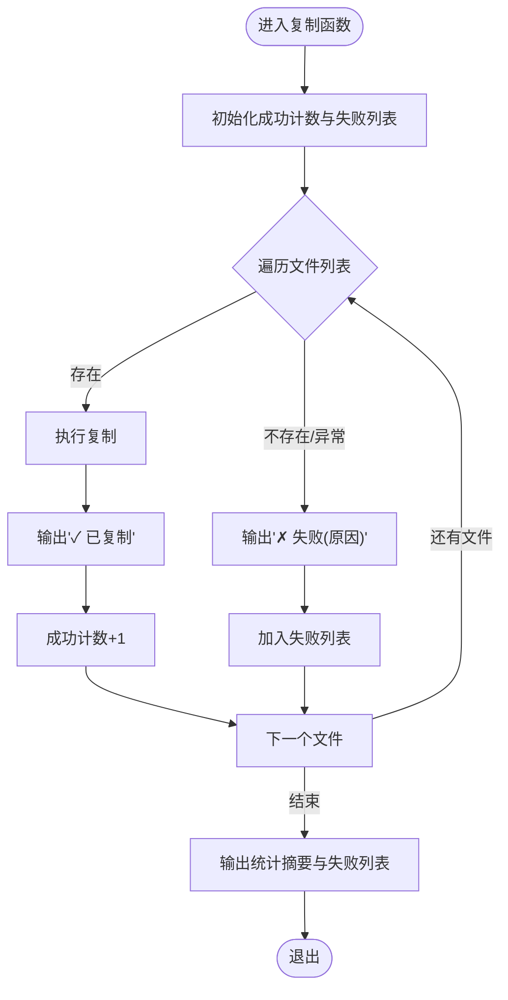
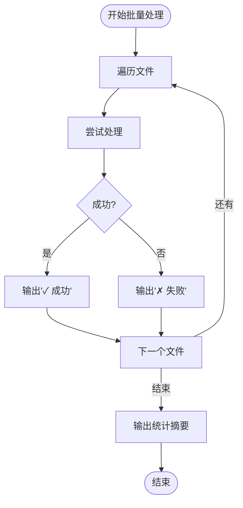
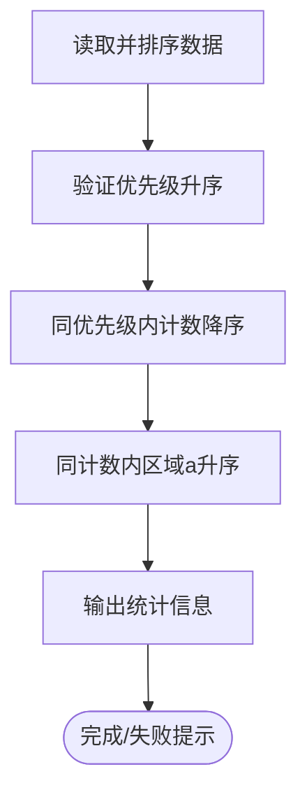
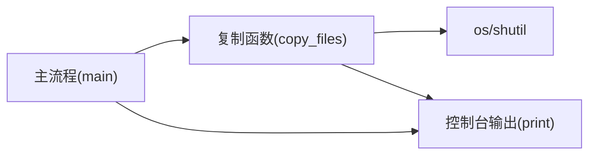

# 用户反馈设计

<cite>
**本文引用的文件**
- [医院/脚本文件备份工具.py](file://医院/脚本文件备份工具.py)
- [脚本文件备份工具-不能运行-会覆盖.py](file://脚本文件备份工具-不能运行-会覆盖.py)
- [医院/照片压缩工具.py](file://医院/照片压缩工具.py)
- [医院/照片尺寸调整工具.py](file://医院/照片尺寸调整工具.py)
- [医院/照片组内相似度排序工具.py](file://医院/照片组内相似度排序工具.py)
- [药店/process_pharmacy_data_v2.py](file://药店/process_pharmacy_data_v2.py)
- [医院/创建医院科室文件夹.py](file://医院/创建医院科室文件夹.py)
</cite>

## 目录
1. [简介](#简介)
2. [项目结构](#项目结构)
3. [核心组件](#核心组件)
4. [架构总览](#架构总览)
5. [详细组件分析](#详细组件分析)
6. [依赖分析](#依赖分析)
7. [性能考虑](#性能考虑)
8. [故障排查指南](#故障排查指南)
9. [结论](#结论)

## 简介
本文件聚焦于仓库中与“文件复制”相关的用户反馈机制，系统性阐述控制台输出如何通过“开始提示—逐条状态—统计摘要”的分阶段结构化信息，帮助用户在长时间批处理任务中获得清晰、可追踪的操作流程视图。文档特别分析“✓”“✗”符号在视觉上快速传达结果的体验优势，以及失败文件列表的详细报告如何支撑问题追溯；同时总结print语句的组织方式如何在信息完整性和输出可读性之间取得平衡，并讨论实时反馈机制对批处理任务的重要性。

## 项目结构
围绕“文件复制”与“用户反馈”，本仓库中与之最直接相关的脚本集中在“医院”和“药店”两个目录。其中，“医院/脚本文件备份工具.py”是典型的文件复制与反馈范例，涵盖从开始提示、逐条状态、失败列表到统计摘要的完整闭环；其他图片处理脚本也广泛采用一致的“✓/✗”视觉反馈模式，形成统一的用户感知体验。

图表来源
- [医院/脚本文件备份工具.py](file://医院/脚本文件备份工具.py#L193-L219)
- [医院/照片压缩工具.py](file://医院/照片压缩工具.py#L190-L227)
- [医院/照片尺寸调整工具.py](file://医院/照片尺寸调整工具.py#L160-L193)
- [医院/照片组内相似度排序工具.py](file://医院/照片组内相似度排序工具.py#L395-L407)
- [药店/process_pharmacy_data_v2.py](file://药店/process_pharmacy_data_v2.py#L100-L173)
- [医院/创建医院科室文件夹.py](file://医院/创建医院科室文件夹.py#L40-L56)

章节来源
- [医院/脚本文件备份工具.py](file://医院/脚本文件备份工具.py#L185-L285)
- [医院/照片压缩工具.py](file://医院/照片压缩工具.py#L190-L286)
- [医院/照片尺寸调整工具.py](file://医院/照片尺寸调整工具.py#L160-L214)
- [医院/照片组内相似度排序工具.py](file://医院/照片组内相似度排序工具.py#L395-L476)
- [药店/process_pharmacy_data_v2.py](file://药店/process_pharmacy_data_v2.py#L100-L173)
- [医院/创建医院科室文件夹.py](file://医院/创建医院科室文件夹.py#L14-L56)

## 核心组件
- 结构化输出的三段式流程
  - 开始提示：明确任务类别与目标，引导用户预期。
  - 逐条状态：对每个文件/步骤进行即时反馈，使用“✓/✗”符号直观传达成功/失败。
  - 统计摘要：汇总成功/失败数量、失败清单、耗时等，便于快速评估整体结果。
- 视觉符号体系
  - “✓”用于成功项，提升正向反馈与可读性。
  - “✗”用于失败项，突出异常并保留上下文信息。
- 失败列表与详细报告
  - 对失败文件进行逐条记录，便于定位问题与重试。
  - 部分脚本提供额外报告文件，支持离线复盘与审计。

章节来源
- [医院/脚本文件备份工具.py](file://医院/脚本文件备份工具.py#L193-L219)
- [医院/照片压缩工具.py](file://医院/照片压缩工具.py#L190-L227)
- [医院/照片尺寸调整工具.py](file://医院/照片尺寸调整工具.py#L160-L193)
- [医院/照片组内相似度排序工具.py](file://医院/照片组内相似度排序工具.py#L395-L407)
- [药店/process_pharmacy_data_v2.py](file://药店/process_pharmacy_data_v2.py#L100-L173)
- [医院/创建医院科室文件夹.py](file://医院/创建医院科室文件夹.py#L40-L56)

## 架构总览
下图展示了“文件复制”类脚本的典型调用序列：主流程负责创建目录、分发复制任务、汇总统计；复制函数负责逐条检查文件存在性、执行复制、输出状态并收集失败清单；最后由主流程输出统计摘要与失败列表。

图表来源
- [医院/脚本文件备份工具.py](file://医院/脚本文件备份工具.py#L193-L219)
- [医院/脚本文件备份工具.py](file://医院/脚本文件备份工具.py#L255-L285)

章节来源
- [医院/脚本文件备份工具.py](file://医院/脚本文件备份工具.py#L193-L285)

## 详细组件分析

### 组件A：文件复制与反馈（复制函数）
- 设计要点
  - 分阶段输出：开始提示、逐条状态、统计摘要。
  - 成功/失败可视化：使用“✓/✗”符号，配合简要上下文（如文件名或错误信息）。
  - 失败追踪：维护失败列表，支持后续重试或人工干预。
- 关键实现路径
  - 开始提示与统计摘要：[复制函数](file://医院/脚本文件备份工具.py#L193-L219)
  - 主流程调度与汇总：[主函数](file://医院/脚本文件备份工具.py#L255-L285)
- 复杂度与性能
  - 时间复杂度：O(N)，N为文件数；逐条输出带来实时反馈，但I/O开销与磁盘吞吐主导实际耗时。
  - 空间复杂度：O(F)，F为失败文件数（仅存储路径）。
- 错误处理
  - 文件不存在与复制异常均以“✗”标注并记录，保证可观测性。
- 可扩展性
  - 可在失败列表中附加更多上下文（如错误码、堆栈摘要），进一步提升可诊断性。

图表来源
- [医院/脚本文件备份工具.py](file://医院/脚本文件备份工具.py#L193-L219)

章节来源
- [医院/脚本文件备份工具.py](file://医院/脚本文件备份工具.py#L193-L219)
- [脚本文件备份工具-不能运行-会覆盖.py](file://脚本文件备份工具-不能运行-会覆盖.py#L137-L163)

### 组件B：批量处理与统计摘要（图片处理脚本）
- 设计要点
  - 逐条处理并输出“✓/✗”，在循环末尾输出统计摘要，便于快速掌握整体结果。
  - 在压缩/尺寸调整等场景，补充节省空间、质量、尺寸等上下文信息，增强反馈价值。
- 关键实现路径
  - 逐条状态与统计摘要：[照片压缩工具](file://医院/照片压缩工具.py#L190-L227)
  - 逐条状态与统计摘要：[照片尺寸调整工具](file://医院/照片尺寸调整工具.py#L160-L193)
  - 逐条状态与处理完成提示：[照片组内相似度排序工具](file://医院/照片组内相似度排序工具.py#L395-L407)
- 复杂度与性能
  - 时间复杂度：O(N)，N为处理文件数；统计摘要在循环后一次性输出，避免频繁I/O。
  - 空间复杂度：O(1)（除失败列表外）。
- 错误处理
  - 异常捕获后输出“✗”并计入失败计数，确保可观测性。

图表来源
- [医院/照片压缩工具.py](file://医院/照片压缩工具.py#L190-L227)
- [医院/照片尺寸调整工具.py](file://医院/照片尺寸调整工具.py#L160-L193)
- [医院/照片组内相似度排序工具.py](file://医院/照片组内相似度排序工具.py#L395-L407)

章节来源
- [医院/照片压缩工具.py](file://医院/照片压缩工具.py#L190-L227)
- [医院/照片尺寸调整工具.py](file://医院/照片尺寸调整工具.py#L160-L193)
- [医院/照片组内相似度排序工具.py](file://医院/照片组内相似度排序工具.py#L395-L407)

### 组件C：验证与统计输出（药店数据处理）
- 设计要点
  - 步骤化验证：逐项输出验证结果（升序/降序等），使用“✓/✗”直观呈现。
  - 统计输出：总数量、分布、前若干项等，辅助业务理解。
- 关键实现路径
  - 验证与统计输出：[药店数据处理](file://药店/process_pharmacy_data_v2.py#L100-L173)

图表来源
- [药店/process_pharmacy_data_v2.py](file://药店/process_pharmacy_data_v2.py#L100-L173)

章节来源
- [药店/process_pharmacy_data_v2.py](file://药店/process_pharmacy_data_v2.py#L100-L173)

### 组件D：目录创建与进度提示（创建医院科室文件夹）
- 设计要点
  - 逐层创建目录并输出进度提示，帮助用户了解创建进度与结果。
- 关键实现路径
  - 目录创建与进度提示：[创建医院科室文件夹](file://医院/创建医院科室文件夹.py#L40-L56)

章节来源
- [医院/创建医院科室文件夹.py](file://医院/创建医院科室文件夹.py#L40-L56)

## 依赖分析
- 组件耦合
  - 复制函数与主流程强耦合：主流程负责调度与汇总，复制函数负责逐条反馈，职责清晰。
  - 失败列表在复制函数内部维护，主流程仅消费结果，降低跨模块传播成本。
- 外部依赖
  - 文件系统接口：os、shutil用于文件存在性检查与复制。
  - 第三方库：pandas（数据处理）、pillow（图片处理）等在各脚本中按需使用。
- 循环依赖
  - 未发现循环依赖，模块间通过函数调用与参数传递交互。

图表来源
- [医院/脚本文件备份工具.py](file://医院/脚本文件备份工具.py#L193-L285)

章节来源
- [医院/脚本文件备份工具.py](file://医院/脚本文件备份工具.py#L193-L285)

## 性能考虑
- 实时反馈与I/O开销
  - 逐条输出“✓/✗”会带来一定I/O开销，但在批处理场景中属于可接受范围，主要瓶颈通常来自磁盘吞吐与CPU处理。
- 统计摘要延迟输出
  - 将统计摘要放在循环结束后输出，减少中间I/O，有利于整体吞吐。
- 并发与批量化
  - 当前实现为串行逐条处理，适合稳定性和可观测性；若需更高吞吐，可在保证可观测性的前提下引入轻量并发（如线程池）并控制输出同步。

[本节为通用性能讨论，不直接分析具体文件]

## 故障排查指南
- 常见问题
  - 文件不存在：复制函数会输出“✗ 文件不存在”，建议核对路径与权限。
  - 复制异常：复制函数会输出“✗ 复制失败(原因)”，建议检查磁盘空间、权限与目标目录可用性。
  - 处理失败：图片处理脚本会在“✗ 处理失败”后计入失败计数，结合失败列表定位问题。
- 排查步骤
  - 检查失败列表：复制函数与图片处理脚本均输出失败清单，优先重试失败项。
  - 核对路径与权限：确认源文件存在、目标目录可写。
  - 查看统计摘要：快速评估整体成功率与失败率，指导下一步行动。
- 建议
  - 在失败列表中增加错误码或简要堆栈摘要，可显著提升诊断效率（当前实现已包含错误字符串，可进一步扩展）。

章节来源
- [医院/脚本文件备份工具.py](file://医院/脚本文件备份工具.py#L193-L219)
- [医院/照片压缩工具.py](file://医院/照片压缩工具.py#L190-L227)
- [医院/照片尺寸调整工具.py](file://医院/照片尺寸调整工具.py#L160-L193)
- [医院/照片组内相似度排序工具.py](file://医院/照片组内相似度排序工具.py#L395-L407)

## 结论
本仓库在“文件复制”与“批量处理”场景中，通过“开始提示—逐条状态—统计摘要”的结构化输出，实现了清晰、可追踪的操作流程视图。统一的“✓/✗”视觉符号体系显著提升了反馈的可读性与用户感知效率；失败列表与统计摘要共同构成问题追溯与复盘的基础。print语句的组织方式在信息完整性与输出可读性之间取得了良好平衡，尤其适用于长时间运行的批处理任务，有助于用户及时掌握进度、定位问题并做出决策。