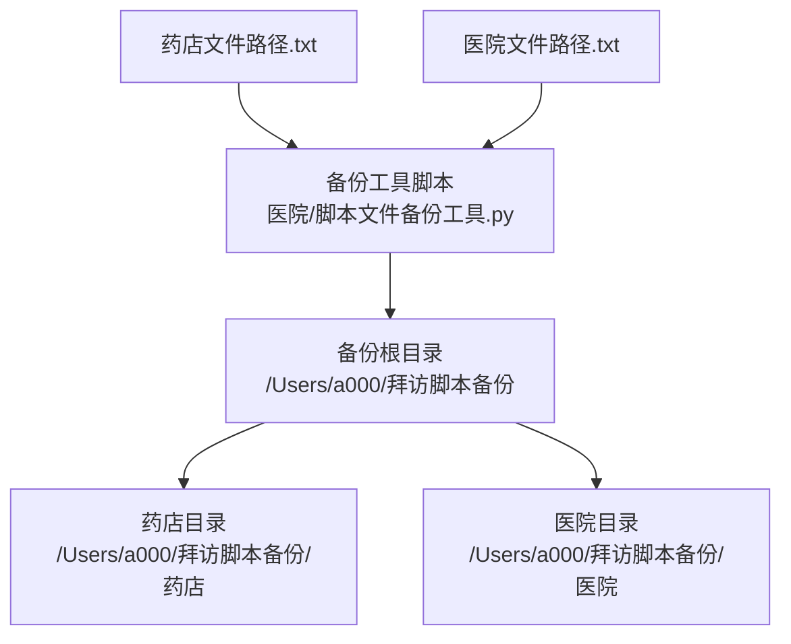
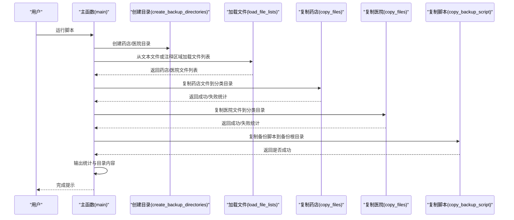
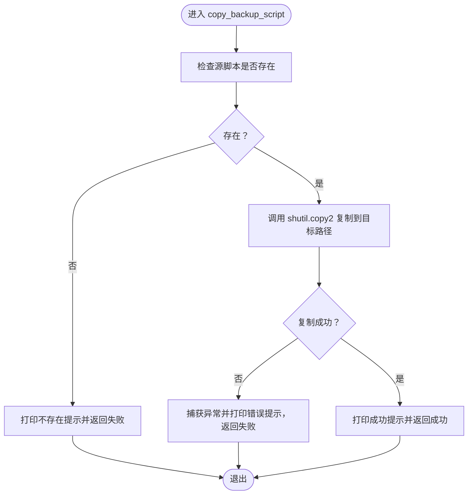
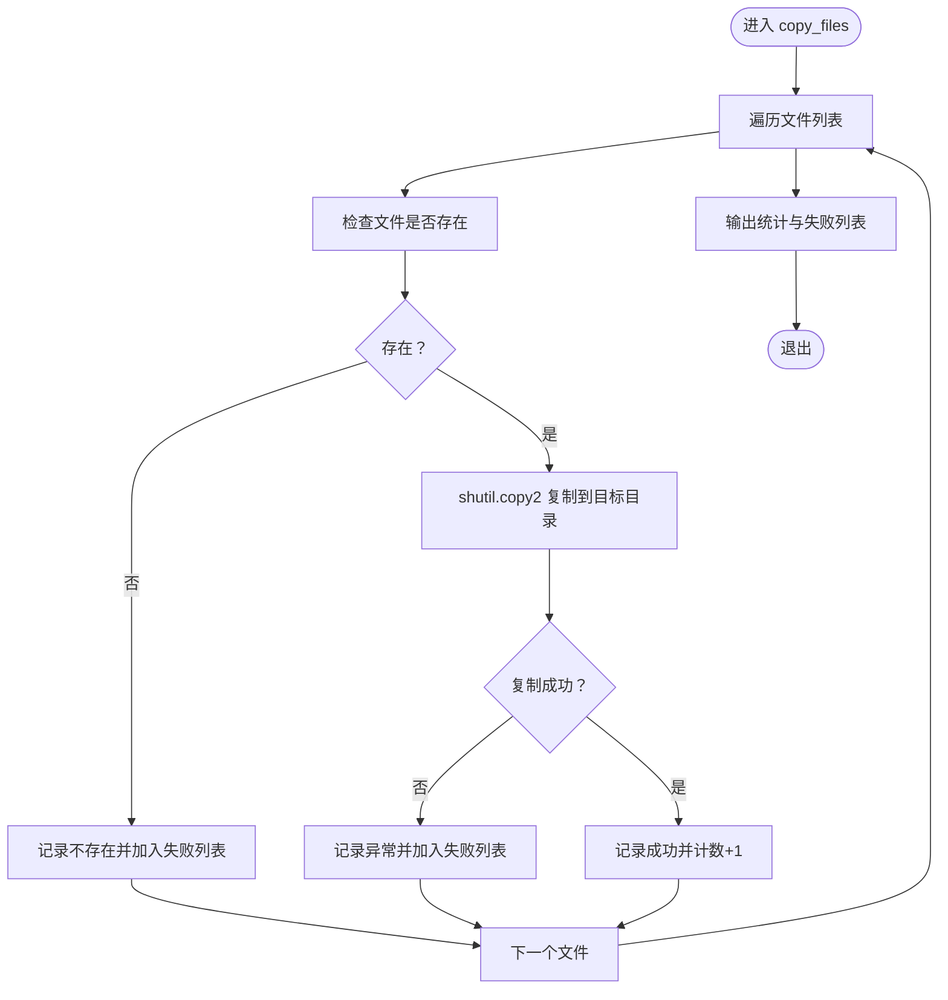
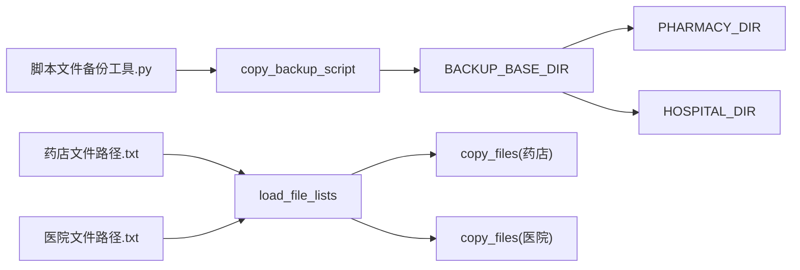

# 脚本自备份机制

<cite>
**本文引用的文件**
- [医院/脚本文件备份工具.py](file://医院/脚本文件备份工具.py)
- [药店文件路径.txt](file://药店文件路径.txt)
- [医院文件路径.txt](file://医院文件路径.txt)
</cite>

## 目录
1. [简介](#简介)
2. [项目结构](#项目结构)
3. [核心组件](#核心组件)
4. [架构总览](#架构总览)
5. [详细组件分析](#详细组件分析)
6. [依赖分析](#依赖分析)
7. [性能考量](#性能考量)
8. [故障排查指南](#故障排查指南)
9. [结论](#结论)
10. [附录](#附录)

## 简介
本文件聚焦于“脚本文件备份工具”中的 copy_backup_script 函数，系统性阐述其如何实现“备份工具自身的复制”，确保备份目录中包含最新版本的备份脚本，从而在版本迭代与灾难恢复场景下形成自包含的恢复闭环。文档将说明目标路径 BACKUP_BASE_DIR/脚本文件备份工具.py 的构造方式与源路径映射关系，并对异常处理流程进行逐项拆解，给出用户提示策略与最佳实践建议。

## 项目结构
仓库采用按业务领域分层的组织方式：
- 根目录存放两类业务线的脚本与路径清单
- “医院”与“药店”两个子目录分别承载各自脚本
- 备份工具位于“医院”目录下，负责将指定脚本复制到统一的备份根目录，并按“药店/医院”分类归档
- 备份根目录下包含“药店文件路径.txt”和“医院文件路径.txt”，用于声明待备份的脚本集合

图表来源
- [医院/脚本文件备份工具.py](file://医院/脚本文件备份工具.py#L14-L16)
- [药店文件路径.txt](file://药店文件路径.txt#L1-L30)
- [医院文件路径.txt](file://医院文件路径.txt#L1-L54)

章节来源
- [医院/脚本文件备份工具.py](file://医院/脚本文件备份工具.py#L14-L16)
- [药店文件路径.txt](file://药店文件路径.txt#L1-L30)
- [医院文件路径.txt](file://医院文件路径.txt#L1-L54)

## 核心组件
- 备份根目录与分类目录
  - 备份根目录 BACKUP_BASE_DIR 固定为 /Users/a000/拜访脚本备份
  - 分类目录 PHARMACY_DIR = BACKUP_BASE_DIR/药店；HOSPITAL_DIR = BACKUP_BASE_DIR/医院
- 文件列表加载
  - 优先从 BACKUP_BASE_DIR 下的“药店文件路径.txt”和“医院文件路径.txt”加载路径
  - 若文本文件为空或缺失，则回退到从当前脚本注释区域提取（见 load_file_lists）
- 复制函数
  - copy_files：遍历文件列表，逐个复制到目标分类目录
  - copy_backup_script：将备份工具自身复制到备份根目录，作为“自备份”的关键一步

章节来源
- [医院/脚本文件备份工具.py](file://医院/脚本文件备份工具.py#L14-L16)
- [医院/脚本文件备份工具.py](file://医院/脚本文件备份工具.py#L115-L181)
- [医院/脚本文件备份工具.py](file://医院/脚本文件备份工具.py#L193-L219)
- [医院/脚本文件备份工具.py](file://医院/脚本文件备份工具.py#L238-L253)

## 架构总览
备份工具的执行流程由主函数驱动，依次完成：
- 创建备份目录
- 从路径清单加载文件列表
- 复制药店与医院脚本到对应分类目录
- 复制备份工具自身到备份根目录
- 输出统计与目录内容清单

图表来源
- [医院/脚本文件备份工具.py](file://医院/脚本文件备份工具.py#L255-L285)
- [医院/脚本文件备份工具.py](file://医院/脚本文件备份工具.py#L185-L192)
- [医院/脚本文件备份工具.py](file://医院/脚本文件备份工具.py#L115-L181)
- [医院/脚本文件备份工具.py](file://医院/脚本文件备份工具.py#L193-L219)
- [医院/脚本文件备份工具.py](file://医院/脚本文件备份工具.py#L238-L253)

## 详细组件分析

### copy_backup_script 函数：备份工具自身的复制
- 目标路径构造
  - 目标根路径：BACKUP_BASE_DIR
  - 目标文件名：与源脚本同名（脚本文件备份工具.py）
  - 最终目标路径：os.path.join(BACKUP_BASE_DIR, '脚本文件备份工具.py')
- 源路径映射
  - 源脚本路径固定为：/Users/a000/拜访脚本备份/脚本文件备份工具.py
  - 该路径与备份根目录保持一致，确保“自备份”时直接从备份根目录读取并写入同一根目录
- 复制行为
  - 使用 shutil.copy2 将源脚本复制到目标路径，保留元数据（时间戳等）
- 异常处理与用户提示
  - 源文件存在性检查：若源文件不存在，输出明确提示并返回失败
  - 复制过程异常捕获：捕获异常并输出错误信息，返回失败
  - 成功时输出确认提示，便于用户核验

图表来源
- [医院/脚本文件备份工具.py](file://医院/脚本文件备份工具.py#L238-L253)

章节来源
- [医院/脚本文件备份工具.py](file://医院/脚本文件备份工具.py#L238-L253)

### 路径清单加载与文件复制
- 路径清单来源
  - 优先从 BACKUP_BASE_DIR 下的“药店文件路径.txt”和“医院文件路径.txt”读取
  - 若文本文件为空或缺失，则回退到从当前脚本注释区域提取（PHARMACY_FILES/_START/_END 与 HOSPITAL_FILES/_START/_END）
- 文件复制策略
  - 对每个文件路径执行存在性检查
  - 存在则复制到对应分类目录，不存在则记录失败并继续
  - 捕获复制异常，记录失败并继续

图表来源
- [医院/脚本文件备份工具.py](file://医院/脚本文件备份工具.py#L193-L219)

章节来源
- [医院/脚本文件备份工具.py](file://医院/脚本文件备份工具.py#L115-L181)
- [药店文件路径.txt](file://药店文件路径.txt#L1-L30)
- [医院文件路径.txt](file://医院文件路径.txt#L1-L54)

### 目标路径构造与源路径映射关系
- 目标根路径：BACKUP_BASE_DIR（固定）
- 目标文件名：与源脚本同名（脚本文件备份工具.py）
- 最终目标路径：os.path.join(BACKUP_BASE_DIR, '脚本文件备份工具.py')
- 源脚本路径：/Users/a000/拜访脚本备份/脚本文件备份工具.py
- 映射关系要点
  - 源与目标共享同一根目录（BACKUP_BASE_DIR），保证“自备份”时不会跨盘符或跨卷复制
  - 目标路径位于备份根目录根部，便于灾备时直接执行备份脚本进行二次备份或恢复

章节来源
- [医院/脚本文件备份工具.py](file://医院/脚本文件备份工具.py#L14-L16)
- [医院/脚本文件备份工具.py](file://医院/脚本文件备份工具.py#L238-L253)

### 异常处理流程与用户提示策略
- 源文件缺失
  - 现象：源脚本不存在
  - 处理：打印不存在提示并返回失败
  - 建议：检查备份根目录是否正确挂载或权限是否允许读取
- 目标写入失败
  - 现象：复制过程中抛出异常
  - 处理：捕获异常并打印错误提示，返回失败
  - 建议：检查目标目录权限、磁盘空间、文件占用情况
- 文件不存在（批量复制）
  - 现象：遍历文件列表时发现路径不存在
  - 处理：记录失败并继续，最终汇总失败列表
  - 建议：核对路径清单与实际文件位置一致性

章节来源
- [医院/脚本文件备份工具.py](file://医院/脚本文件备份工具.py#L238-L253)
- [医院/脚本文件备份工具.py](file://医院/脚本文件备份工具.py#L193-L219)

## 依赖分析
- 外部依赖
  - os：路径拼接、目录创建、文件存在性判断
  - shutil：文件复制（保留元数据）
  - re：路径解析与注释区域提取
  - pathlib.Path：路径对象（在模块中导入但未使用，可考虑移除）
- 内部依赖
  - BACKUP_BASE_DIR、PHARMACY_DIR、HOSPITAL_DIR 三者之间通过字符串拼接建立层次关系
  - load_file_lists 依赖“药店文件路径.txt”和“医院文件路径.txt”
  - copy_files 依赖 load_file_lists 的返回值
  - copy_backup_script 依赖 BACKUP_BASE_DIR 与脚本自身路径

图表来源
- [医院/脚本文件备份工具.py](file://医院/脚本文件备份工具.py#L14-L16)
- [医院/脚本文件备份工具.py](file://医院/脚本文件备份工具.py#L115-L181)
- [药店文件路径.txt](file://药店文件路径.txt#L1-L30)
- [医院文件路径.txt](file://医院文件路径.txt#L1-L54)

章节来源
- [医院/脚本文件备份工具.py](file://医院/脚本文件备份工具.py#L14-L16)
- [医院/脚本文件备份工具.py](file://医院/脚本文件备份工具.py#L115-L181)

## 性能考量
- 复制策略
  - 使用 shutil.copy2 保留时间戳等元数据，有利于后续审计与版本追踪
- 批量复制
  - 对每个文件逐一检查存在性与复制，复杂度 O(N)，N 为文件数量
- I/O 开销
  - 大文件复制可能成为瓶颈，建议在批量复制前预估磁盘空间与网络带宽
- 并发优化
  - 当前实现为串行复制，若需加速可在保证数据一致性的前提下引入并发（需谨慎处理锁与冲突）

## 故障排查指南
- 备份脚本未复制到备份根目录
  - 检查源脚本路径是否正确（/Users/a000/拜访脚本备份/脚本文件备份工具.py）
  - 检查备份根目录权限与磁盘空间
  - 查看异常输出，定位具体错误原因
- 路径清单为空导致未备份任何脚本
  - 确认“药店文件路径.txt”和“医院文件路径.txt”存在且包含有效路径
  - 如需回退，检查脚本注释区域的 _START/_END 标记是否完整
- 复制过程中出现失败
  - 查看失败列表，逐项核对路径是否存在、权限是否足够、目标目录是否可写
  - 对于只读文件或被占用文件，先解除占用或调整权限

章节来源
- [医院/脚本文件备份工具.py](file://医院/脚本文件备份工具.py#L115-L181)
- [医院/脚本文件备份工具.py](file://医院/脚本文件备份工具.py#L193-L219)
- [医院/脚本文件备份工具.py](file://医院/脚本文件备份工具.py#L238-L253)

## 结论
copy_backup_script 函数通过“源路径与目标路径共享同一备份根目录”的设计，实现了备份工具自身的“自备份”。配合路径清单加载与批量复制机制，能够在版本迭代与灾难恢复中提供稳定的恢复闭环：即便原始开发环境受损，备份目录仍保留可执行的备份工具副本，确保后续可再次执行备份或恢复操作，显著提升系统的可维护性与容灾能力。

## 附录
- 关键路径与文件
  - 备份根目录：/Users/a000/拜访脚本备份
  - 药店分类目录：/Users/a000/拜访脚本备份/药店
  - 医院分类目录：/Users/a000/拜访脚本备份/医院
  - 路径清单文件：
    - /Users/a000/拜访脚本备份/药店文件路径.txt
    - /Users/a000/拜访脚本备份/医院文件路径.txt
  - 备份脚本自身：
    - /Users/a000/拜访脚本备份/脚本文件备份工具.py

章节来源
- [医院/脚本文件备份工具.py](file://医院/脚本文件备份工具.py#L14-L16)
- [药店文件路径.txt](file://药店文件路径.txt#L1-L30)
- [医院文件路径.txt](file://医院文件路径.txt#L1-L54)