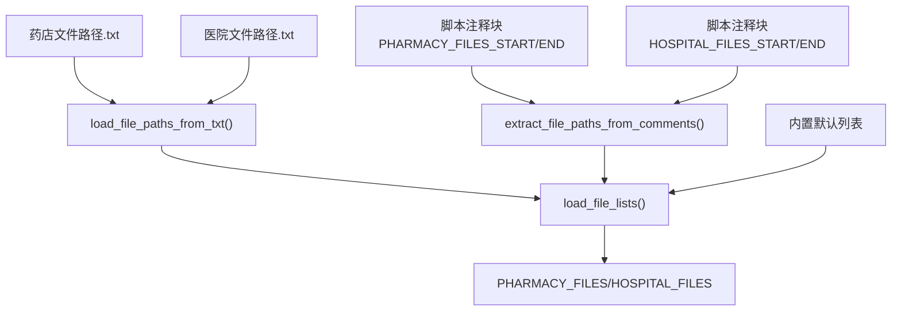
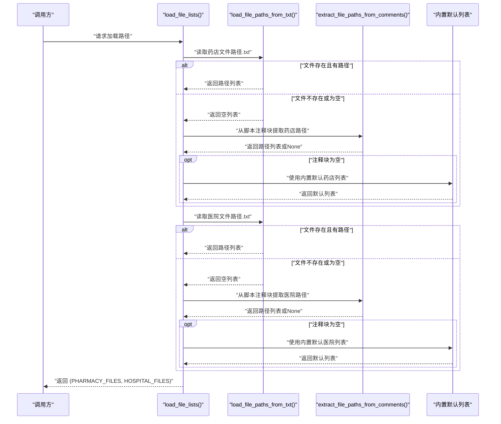
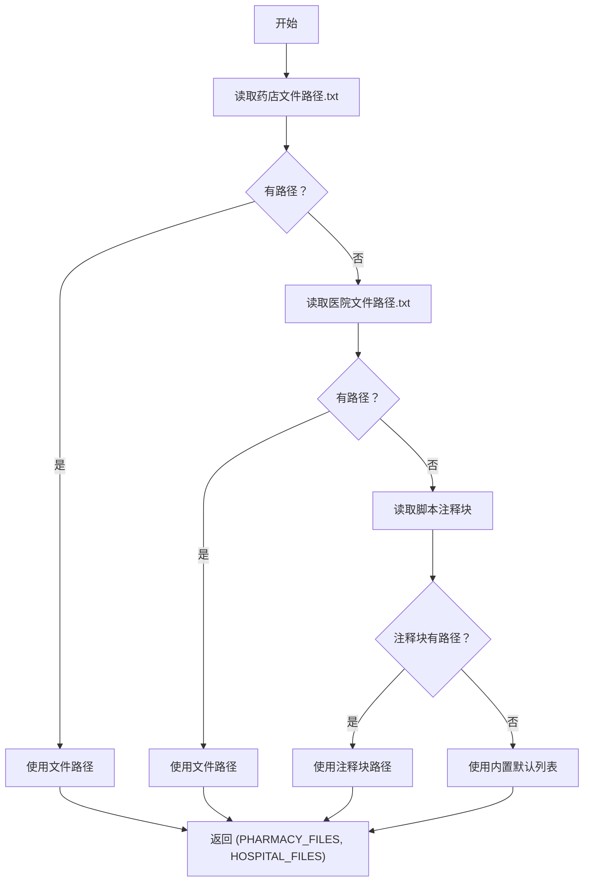
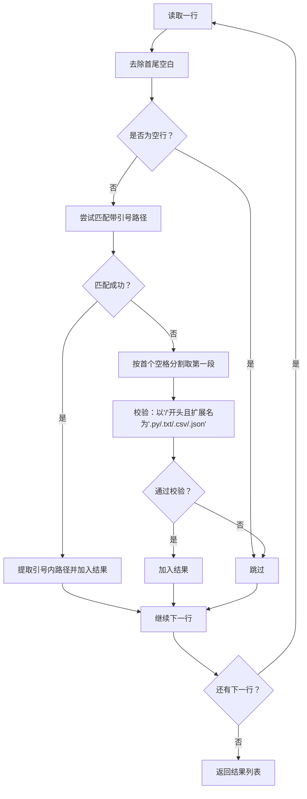
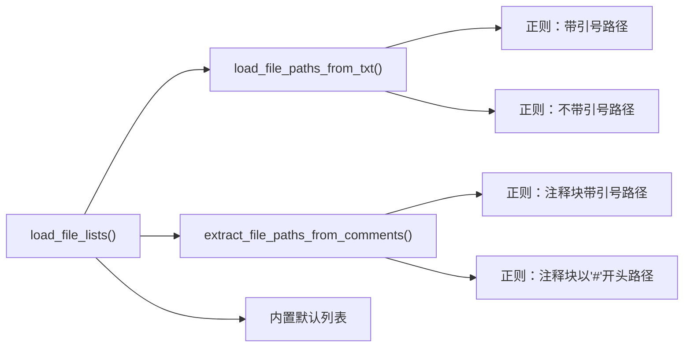

# 路径加载机制

<cite>
**本文引用的文件**
- [医院/脚本文件备份工具.py](file://医院/脚本文件备份工具.py)
- [药店文件路径.txt](file://药店文件路径.txt)
- [医院文件路径.txt](file://医院文件路径.txt)
- [药店文件路径的副本.txt](file://药店文件路径的副本.txt)
- [医院文件路径的副本.txt](file://医院文件路径的副本.txt)
- [脚本文件备份工具-別运行-会覆盖.py](file://脚本文件备份工具-別运行-会覆盖.py)
</cite>

## 目录
1. [简介](#简介)
2. [项目结构](#项目结构)
3. [核心组件](#核心组件)
4. [架构总览](#架构总览)
5. [详细组件分析](#详细组件分析)
6. [依赖关系分析](#依赖关系分析)
7. [性能考量](#性能考量)
8. [故障排查指南](#故障排查指南)
9. [结论](#结论)

## 简介
本文聚焦于“脚本文件备份工具”中路径加载机制的三层优先级策略，以及文本文件路径解析函数的行为细节。目标是帮助使用者理解：
- 三层路径加载优先级：文本文件 -> 脚本注释块 -> 内置默认列表
- 文本文件路径解析函数如何兼容多种混合格式
- 正则表达式在不同匹配场景下的差异
- 路径有效性验证规则

## 项目结构
围绕路径加载的核心文件与输入文件如下：
- 路径加载实现：[医院/脚本文件备份工具.py](file://医院/脚本文件备份工具.py)
- 输入文本文件：
  - [药店文件路径.txt](file://药店文件路径.txt)
  - [医院文件路径.txt](file://医院文件路径.txt)
- 示例副本文件（便于观察混合格式）：
  - [药店文件路径的副本.txt](file://药店文件路径的副本.txt)
  - [医院文件路径的副本.txt](file://医院文件路径的副本.txt)
- 对比参考（仅从文本文件加载，不包含注释回退）：
  - [脚本文件备份工具-別运行-会覆盖.py](file://脚本文件备份工具-別运行-会覆盖.py)

图表来源
- [医院/脚本文件备份工具.py](file://医院/脚本文件备份工具.py#L64-L181)
- [药店文件路径.txt](file://药店文件路径.txt#L1-L30)
- [医院文件路径.txt](file://医院文件路径.txt#L1-L54)

章节来源
- [医院/脚本文件备份工具.py](file://医院/脚本文件备份工具.py#L64-L181)
- [药店文件路径.txt](file://药店文件路径.txt#L1-L30)
- [医院文件路径.txt](file://医院文件路径.txt#L1-L54)

## 核心组件
- load_file_paths_from_txt(file_path)
  - 功能：从文本文件逐行解析路径，支持带引号与带注释的混合格式；并对路径进行有效性校验。
  - 关键点：
    - 带引号路径：使用正则匹配以引号包裹的路径，提取引号内的路径字符串。
    - 不带引号路径：按首个空格分割，取第一段作为路径，再进行以“/”开头且扩展名为“.py/.txt/.csv/.json”的校验。
    - 错误处理：文件不存在或读取异常时返回空列表。
- extract_file_paths_from_comments(script_content, section_marker)
  - 功能：从当前脚本的注释块中提取路径列表，支持两类：
    - 带引号路径：匹配形如“/xxx.py”等被引号包裹的路径。
    - 不带引号但带注释符号的路径：匹配形如“# /xxx.py”这种以“#”开头、后跟空格和路径的行。
  - 返回值：若未找到对应注释块或未提取到路径，返回 None。
- load_file_lists()
  - 三层优先级：
    1) 从 BACKUP_BASE_DIR 下的“药店文件路径.txt”和“医院文件路径.txt”读取；
    2) 若上述文件为空或未找到，则从当前脚本注释块中提取；
    3) 若仍为空，则使用内置默认列表。

章节来源
- [医院/脚本文件备份工具.py](file://医院/脚本文件备份工具.py#L64-L181)

## 架构总览
下图展示三层路径加载流程与关键函数调用关系：

图表来源
- [医院/脚本文件备份工具.py](file://医院/脚本文件备份工具.py#L115-L181)
- [脚本文件备份工具-別运行-会覆盖.py](file://脚本文件备份工具-別运行-会覆盖.py#L115-L127)

## 详细组件分析

### 1) 三层路径加载优先级
- 第一层：从 BACKUP_BASE_DIR 下的“药店文件路径.txt”和“医院文件路径.txt”读取路径。
  - 若文件不存在或解析后为空列表，则进入第二层。
- 第二层：从当前脚本的注释块中提取路径。
  - 注释块标记形式为“# {SECTION_MARKER_START}”和“# {SECTION_MARKER_END}”，分别用于药店与医院。
  - 若注释块中提取到路径，则覆盖上一层结果；否则继续第三层。
- 第三层：使用内置默认路径列表作为兜底。

图表来源
- [医院/脚本文件备份工具.py](file://医院/脚本文件备份工具.py#L115-L181)

章节来源
- [医院/脚本文件备份工具.py](file://医院/脚本文件备份工具.py#L115-L181)

### 2) 文本文件路径解析：load_file_paths_from_txt
该函数支持以下混合格式：
- 带引号的路径：例如 "/path/to/file.py" 或 '/path/to/file.py'
- 不带引号的路径：例如 "/path/to/file.py 注释内容"
- 带引号且带注释：例如 "\"/path/to/file.py\" 注释内容"

解析流程与正则差异：
- 带引号路径
  - 使用正则匹配以单引号或双引号开头的完整路径，确保路径以“/”开头且扩展名为“.py/.txt/.csv/.json”，然后提取引号内的路径。
- 不带引号路径
  - 先按首个空格分割，取第一段作为路径，再进行以“/”开头且扩展名为“.py/.txt/.csv/.json”的校验。
- 空行跳过
- 文件不存在或读取异常时返回空列表

图表来源
- [医院/脚本文件备份工具.py](file://医院/脚本文件备份工具.py#L64-L114)

章节来源
- [医院/脚本文件备份工具.py](file://医院/脚本文件备份工具.py#L64-L114)

### 3) 注释块路径提取：extract_file_paths_from_comments
- 从脚本内容中定位“# {SECTION_MARKER_START}”与“# {SECTION_MARKER_END}”之间的区域。
- 在区域内：
  - 先匹配带引号的路径（形如“/xxx.py”被引号包裹），提取路径。
  - 再匹配不带引号但以“#”开头、后跟空格和路径的行（形如“# /xxx.py”）。
- 合并两类路径并返回；若未找到或为空，返回 None。

图表来源
- [医院/脚本文件备份工具.py](file://医院/脚本文件备份工具.py#L20-L63)

章节来源
- [医院/脚本文件备份工具.py](file://医院/脚本文件备份工具.py#L20-L63)

### 4) 实际文本文件示例与解析演示
以下示例来自仓库中的文本文件，展示了混合格式与注释混杂的常见情况。解析时请遵循“先引号、后空格拆分、再校验”的流程。

- 药店路径示例片段（节选）
  - [药店文件路径.txt](file://药店文件路径.txt#L1-L30)
  - 特征：包含普通路径、带注释的路径、空行与无关文本混杂。
- 医院路径示例片段（节选）
  - [医院文件路径.txt](file://医院文件路径.txt#L1-L54)
  - 特征：包含普通路径、带注释的路径、空行与无关文本混杂。

解析要点（以药店为例）：
- 带引号路径：会被正则直接捕获并提取。
- 不带引号路径：按首个空格拆分取第一段，再进行以“/”开头且扩展名为“.py/.txt/.csv/.json”的校验。
- 空行与无关文本会被跳过。

章节来源
- [药店文件路径.txt](file://药店文件路径.txt#L1-L30)
- [医院文件路径.txt](file://医院文件路径.txt#L1-L54)
- [医院/脚本文件备份工具.py](file://医院/脚本文件备份工具.py#L64-L114)

### 5) 正则表达式在不同场景下的行为差异
- 带引号路径
  - 目标：匹配形如“/xxx.py”被引号包裹的路径。
  - 行为：严格要求以引号开头与结尾，路径必须以“/”开头且扩展名合法。
- 不带引号路径
  - 目标：匹配形如“/xxx.py 注释内容”的行。
  - 行为：先按首个空格拆分取第一段，再进行扩展名与起始符校验。
- 注释块中的路径
  - 带引号：与上述一致。
  - 不带引号但以“#”开头：匹配“# 空格 /xxx.py”。

章节来源
- [医院/脚本文件备份工具.py](file://医院/脚本文件备份工具.py#L20-L63)
- [医院/脚本文件备份工具.py](file://医院/脚本文件备份工具.py#L64-L114)

### 6) 路径有效性验证规则
- 必须以“/”开头
- 扩展名必须为“.py/.txt/.csv/.json”
- 以上两条同时满足才视为有效路径

章节来源
- [医院/脚本文件备份工具.py](file://医院/脚本文件备份工具.py#L64-L114)

## 依赖关系分析
- load_file_lists 依赖：
  - load_file_paths_from_txt：用于从文本文件读取路径
  - extract_file_paths_from_comments：用于从脚本注释块读取路径
  - 内置默认列表：作为最终兜底
- load_file_paths_from_txt 依赖：
  - 正则表达式：用于识别带引号与不带引号的路径
  - 文件系统：读取文本文件并逐行解析
- extract_file_paths_from_comments 依赖：
  - 正则表达式：用于识别注释块中的两类路径
  - 当前脚本内容：通过读取自身源码获取注释块

图表来源
- [医院/脚本文件备份工具.py](file://医院/脚本文件备份工具.py#L20-L181)

章节来源
- [医院/脚本文件备份工具.py](file://医院/脚本文件备份工具.py#L20-L181)

## 性能考量
- 文本文件解析为线性扫描，时间复杂度近似 O(N)，N 为文件行数。
- 正则匹配在每行上执行两次（带引号与不带引号），整体仍为 O(N)。
- 注释块解析仅在文件为空或未找到时触发，避免不必要的额外开销。
- 默认列表规模有限，影响可忽略。

## 故障排查指南
- 文本文件路径未生效
  - 检查文件是否存在且可读
  - 检查路径是否以“/”开头且扩展名为“.py/.txt/.csv/.json”
  - 检查是否存在多余空格或错误的引号使用
- 注释块未生效
  - 确认注释块标记是否正确书写（“# {SECTION_MARKER_START}”与“# {SECTION_MARKER_END}”）
  - 确认注释块内路径格式符合“带引号”或“以'#'开头”的规则
- 仍为空列表
  - 确认三层优先级均未命中时，是否期望使用内置默认列表
- 文件不存在或读取异常
  - 函数会返回空列表，不会抛出异常

章节来源
- [医院/脚本文件备份工具.py](file://医院/脚本文件备份工具.py#L64-L114)
- [医院/脚本文件备份工具.py](file://医院/脚本文件备份工具.py#L115-L181)

## 结论
- 三层优先级设计提供了灵活可靠的路径来源：优先外部配置（文本文件），其次脚本内嵌（注释块），最后内置默认兜底。
- 文本文件解析函数对多种混合格式具备良好容错能力，通过正则与空格拆分相结合，确保在复杂注释环境中也能准确提取路径。
- 路径有效性验证规则简单明确，有助于减少无效路径带来的后续错误。