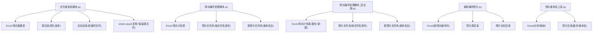
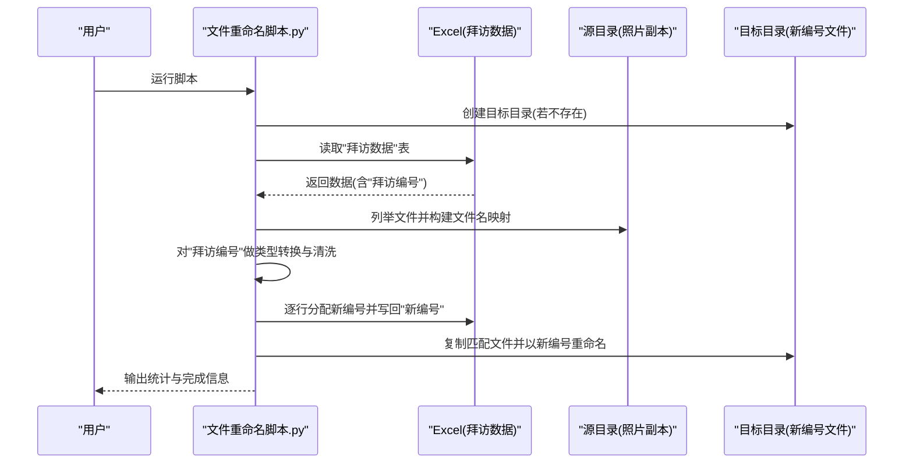
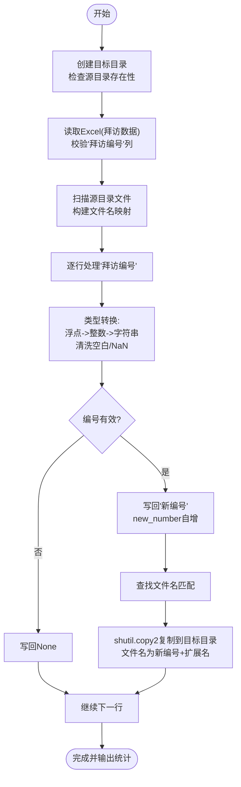

# 医院批量重命名工具

<cite>
**本文引用的文件**
- [文件重命名脚本.py](file://医院/文件重命名脚本.py)
- [拜访编号处理脚本.py](file://医院/拜访编号处理脚本.py)
- [拜访编号处理脚本_安全版.py](file://医院/拜访编号处理脚本_安全版.py)
- [重新编号照片.py](file://医院/重新编号照片.py)
- [照片重命名工具.py](file://医院/照片重命名工具.py)
</cite>

## 目录
1. [简介](#简介)
2. [项目结构](#项目结构)
3. [核心组件](#核心组件)
4. [架构总览](#架构总览)
5. [详细组件分析](#详细组件分析)
6. [依赖分析](#依赖分析)
7. [性能考虑](#性能考虑)
8. [故障排查指南](#故障排查指南)
9. [结论](#结论)
10. [附录](#附录)

## 简介
本文件面向“医院批量重命名工具”的实现机制进行系统化解读，重点围绕以下目标展开：
- 从Excel的“拜访数据”表中读取“拜访编号”，并与源目录中的文件名进行匹配；
- 使用shutil.copy2进行文件复制，确保源文件保留的同时在目标目录生成新编号文件；
- 新编号从1开始递增分配，并同步更新Excel中的“新编号”字段；
- 处理浮点型“拜访编号”的类型转换问题；
- 在文件扫描、路径创建、异常捕获方面提供健壮性设计；
- 提供配置source_dir、target_dir、excel_path的最佳实践，并强调执行前备份数据的重要性。

## 项目结构
该仓库包含多个与“拜访计划、照片处理、重命名”相关的脚本。与本主题直接相关的核心文件如下：
- 医院/文件重命名脚本.py：负责从Excel“拜访数据”表读取“拜访编号”，匹配文件名并复制重命名；
- 医院/拜访编号处理脚本.py：对照片按文件名排序并重新编号，同时更新Excel中的“拜访编号”列；
- 医院/拜访编号处理脚本_安全版.py：在更新Excel前先备份并输出新文件，避免破坏原始文件；
- 医院/重新编号照片.py：按照片名称排序后重新编号，并更新Excel中的“新拜访编号”列；
- 医院/照片重命名工具.py：通用照片重命名工具，包含备份、扫描、重命名等流程。

图表来源
- [文件重命名脚本.py](file://医院/文件重命名脚本.py#L1-L130)
- [拜访编号处理脚本.py](file://医院/拜访编号处理脚本.py#L1-L157)
- [拜访编号处理脚本_安全版.py](file://医院/拜访编号处理脚本_安全版.py#L1-L170)
- [重新编号照片.py](file://医院/重新编号照片.py#L1-L108)
- [照片重命名工具.py](file://医院/照片重命名工具.py#L1-L263)

章节来源
- [文件重命名脚本.py](file://医院/文件重命名脚本.py#L1-L130)
- [拜访编号处理脚本.py](file://医院/拜访编号处理脚本.py#L1-L157)
- [拜访编号处理脚本_安全版.py](file://医院/拜访编号处理脚本_安全版.py#L1-L170)
- [重新编号照片.py](file://医院/重新编号照片.py#L1-L108)
- [照片重命名工具.py](file://医院/照片重命名工具.py#L1-L263)

## 核心组件
- 文件重命名主流程：从Excel“拜访数据”表读取“拜访编号”，构建文件名到文件的映射，按行遍历生成新编号并写回Excel；随后复制匹配到的文件到目标目录并以新编号命名。
- 类型转换与匹配：对“拜访编号”进行浮点数到整数字符串的转换，去除空白与无效值，确保与文件名精确匹配。
- 复制策略：使用shutil.copy2复制文件，保留源文件，仅在目标目录生成新编号文件。
- 健壮性设计：对Excel列存在性、源目录存在性、文件扫描、异常捕获进行保护；对Excel写入采用sheet_name差异（“拜访数据” vs “拜访计划”）以避免覆盖。
- 安全更新：参考“安全版”脚本，建议在更新Excel前先备份或输出新文件，避免破坏原始格式。

章节来源
- [文件重命名脚本.py](file://医院/文件重命名脚本.py#L1-L130)

## 架构总览
下图展示“文件重命名脚本.py”的端到端流程：从Excel读取、文件扫描、编号分配、复制重命名，再到最终输出统计信息。

图表来源
- [文件重命名脚本.py](file://医院/文件重命名脚本.py#L1-L130)

## 详细组件分析

### 组件A：文件重命名主流程（文件重命名脚本.py）
- 功能职责
  - 读取Excel“拜访数据”表，校验“拜访编号”列是否存在；
  - 扫描源目录中的文件，构建“文件名(不含扩展名)”到文件名的映射；
  - 逐行处理“拜访编号”，进行浮点数到整数字符串的转换，清洗空白与无效值；
  - 从1开始为有编号的记录分配“新编号”，并写回Excel；
  - 使用shutil.copy2复制匹配到的文件到目标目录，文件名为新编号+原扩展名；
  - 统计处理数量并输出日志。
- 关键实现要点
  - Excel读取与列校验：通过sheet_name定位“拜访数据”，并检查“拜访编号”列是否存在。
  - 文件名映射：以“文件名(不含扩展名)”为键，便于与“拜访编号”匹配。
  - 编号分配：new_number从1开始递增，仅对有效“拜访编号”分配。
  - 类型转换：对浮点数先转为整数再转为字符串，避免小数点后缀；对空字符串与NaN进行处理。
  - 复制策略：shutil.copy2复制文件，保留源文件，目标文件名以新编号命名。
  - 异常捕获：对Excel读取、目录扫描、文件复制等关键步骤进行try-except保护，并打印堆栈信息便于调试。
- 数据流与复杂度
  - 文件扫描：O(N)，N为源目录文件数；
  - 行遍历：O(M)，M为Excel行数；
  - 总体复杂度：O(N + M)。
- 健壮性设计
  - 目录创建：os.makedirs(target_dir, exist_ok=True)；
  - 源目录存在性检查：若不存在则终止；
  - Excel列存在性检查：缺失则提示并返回；
  - 复制异常捕获：对单个文件复制失败进行日志输出；
  - 写入Excel：使用sheet_name“拜访计划”，避免覆盖“拜访数据”。

图表来源
- [文件重命名脚本.py](file://医院/文件重命名脚本.py#L1-L130)

章节来源
- [文件重命名脚本.py](file://医院/文件重命名脚本.py#L1-L130)

### 组件B：类型转换与匹配逻辑（文件重命名脚本.py）
- 实现要点
  - 对pd.notna且非空的“拜访编号”进行处理；
  - 若为浮点数，先转为整数再转为字符串，避免小数点后缀；
  - 否则去除空白并转为字符串；
  - 任何转换异常或空值统一标记为空；
  - 与文件名映射进行匹配，若存在则加入待复制列表并分配新编号。
- 复杂度
  - 单行转换与匹配为O(1)，整体O(M)。
- 健壮性
  - 对异常进行捕获并置空，避免中断；
  - 与文件名映射匹配时，若找不到对应文件仅输出警告，不影响其他行。

章节来源
- [文件重命名脚本.py](file://医院/文件重命名脚本.py#L60-L99)

### 组件C：复制与重命名策略（文件重命名脚本.py）
- 实现要点
  - 使用shutil.copy2进行复制，保留源文件；
  - 目标文件名格式为“新编号+原扩展名”，避免覆盖；
  - 对每个文件复制操作进行异常捕获并输出错误信息。
- 健壮性
  - 复制失败不影响后续流程，继续处理剩余文件；
  - 统计处理数量，便于核对结果。

章节来源
- [文件重命名脚本.py](file://医院/文件重命名脚本.py#L105-L118)

### 组件D：与“安全版”脚本的对比与最佳实践（参考）
- 安全更新策略
  - “安全版”脚本在更新Excel前先备份原文件，或将更新后数据写入新文件，避免破坏原始格式；
  - 适用于对Excel格式敏感或存在宏/样式等复杂内容的场景。
- 建议
  - 在执行“文件重命名脚本.py”前，对Excel进行手动备份；
  - 若Excel存在复杂格式，可参考“安全版”思路，先备份或输出新文件再核对。

章节来源
- [拜访编号处理脚本_安全版.py](file://医院/拜访编号处理脚本_安全版.py#L104-L118)

### 组件E：与“重新编号照片”脚本的关系（参考）
- “重新编号照片.py”展示了另一种“按文件名排序后重新编号”的思路，适合照片名称即编号的情形；
- 与“文件重命名脚本.py”的区别在于：前者基于文件名直接排序编号，后者基于Excel中的“拜访编号”进行匹配与编号。

章节来源
- [重新编号照片.py](file://医院/重新编号照片.py#L1-L108)

### 组件F：与“照片重命名工具”的关系（参考）
- “照片重命名工具.py”提供了通用的照片重命名能力，包含备份、扫描、重命名等流程；
- 与“文件重命名脚本.py”的共同点在于都涉及文件复制与重命名，不同点在于前者以Excel“拜访编号”为依据进行匹配，后者以“原序号”等字段驱动重命名。

章节来源
- [照片重命名工具.py](file://医院/照片重命名工具.py#L1-L263)

## 依赖分析
- 外部库依赖
  - pandas：读取Excel工作表；
  - os/shutil/pathlib：文件系统操作与复制；
  - traceback：异常堆栈输出。
- 内部依赖
  - 与“安全版”脚本共享“备份+输出新文件”的安全思想；
  - 与“重新编号照片”脚本共享“按文件名排序后编号”的思路；
  - 与“照片重命名工具”共享“备份目录、重命名、复制”的通用模式。

图表来源
- [文件重命名脚本.py](file://医院/文件重命名脚本.py#L1-L130)
- [拜访编号处理脚本_安全版.py](file://医院/拜访编号处理脚本_安全版.py#L104-L118)
- [重新编号照片.py](file://医院/重新编号照片.py#L1-L108)
- [照片重命名工具.py](file://医院/照片重命名工具.py#L1-L263)

章节来源
- [文件重命名脚本.py](file://医院/文件重命名脚本.py#L1-L130)
- [拜访编号处理脚本_安全版.py](file://医院/拜访编号处理脚本_安全版.py#L104-L118)
- [重新编号照片.py](file://医院/重新编号照片.py#L1-L108)
- [照片重命名工具.py](file://医院/照片重命名工具.py#L1-L263)

## 性能考虑
- 时间复杂度
  - 文件扫描与Excel行遍历均为线性复杂度，整体O(N + M)；
  - 复制操作为I/O密集型，受磁盘吞吐影响。
- 空间复杂度
  - 主要消耗在构建文件名映射与匹配列表，空间复杂度O(N)。
- 优化建议
  - 对超大目录，可分批处理或增加进度提示；
  - 复制前可先检查目标文件是否已存在，避免重复复制；
  - 对Excel写入，可在批量完成后一次性写回，减少IO次数（当前脚本逐行写回，建议结合“安全版”思路进行批量写入）。

## 故障排查指南
- 常见问题与处理
  - Excel列缺失：“拜访编号”列不存在时脚本会提示并终止，请确认Excel工作表名称与列名；
  - 源目录不存在：脚本会提示并终止，请检查路径配置；
  - 文件未匹配：当“拜访编号”与文件名不一致时会输出警告，需核对文件命名与Excel编号；
  - 复制失败：对单个文件复制失败会输出错误信息，不影响其他文件处理；
  - Excel写入异常：如遇格式问题，建议参考“安全版”脚本，先备份或输出新文件。
- 建议的日志与调试
  - 使用print输出中间状态（读取Excel、扫描文件、匹配情况、复制结果）；
  - 对异常使用traceback打印堆栈，便于定位具体行号。

章节来源
- [文件重命名脚本.py](file://医院/文件重命名脚本.py#L20-L128)
- [拜访编号处理脚本_安全版.py](file://医院/拜访编号处理脚本_安全版.py#L104-L118)

## 结论
“文件重命名脚本.py”通过从Excel“拜访数据”表读取“拜访编号”，与源目录文件名进行精确匹配，实现了从1开始的连续新编号分配，并通过shutil.copy2复制到目标目录，保证源文件不被破坏。脚本在路径创建、文件扫描、异常捕获等方面具备良好的健壮性。建议在执行前对Excel进行备份，或参考“安全版”脚本的备份与输出新文件策略，以进一步降低风险。

## 附录

### 参数配置最佳实践
- source_dir：指向包含照片副本的目录，确保文件名与Excel中的“拜访编号”一致；
- target_dir：指向目标输出目录，脚本会自动创建；
- excel_path：指向包含“拜访数据”表的Excel文件，确保列名为“拜访编号”。
- 建议
  - 在执行前对Excel进行备份；
  - 确认“拜访编号”列的数据类型与命名一致；
  - 对于存在复杂格式的Excel，优先采用“安全版”思路进行备份或输出新文件。

章节来源
- [文件重命名脚本.py](file://医院/文件重命名脚本.py#L15-L23)
- [拜访编号处理脚本_安全版.py](file://医院/拜访编号处理脚本_安全版.py#L104-L118)