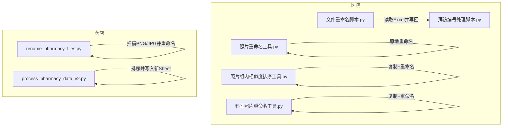
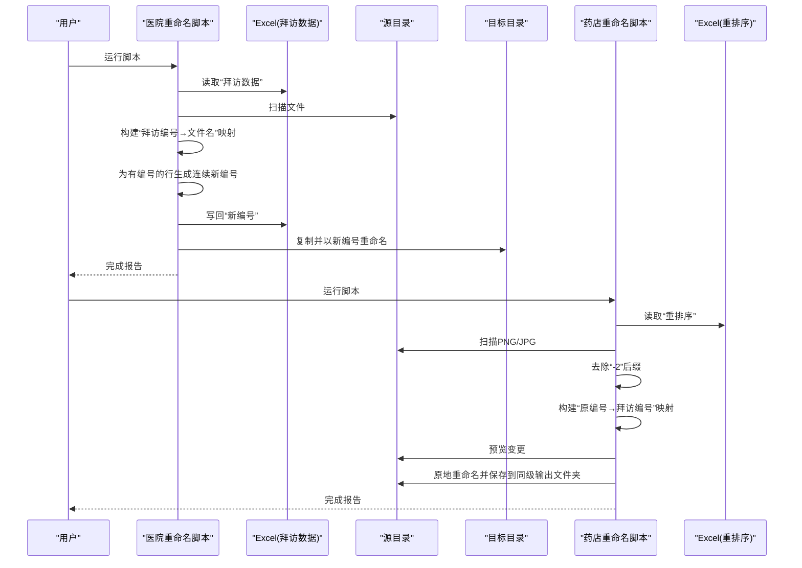
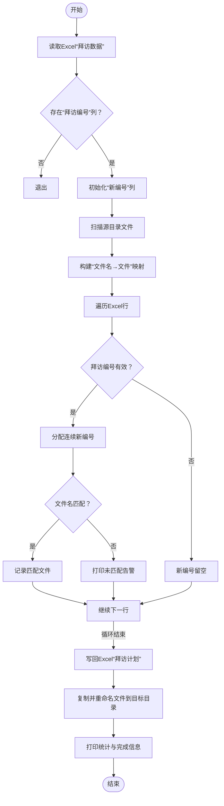
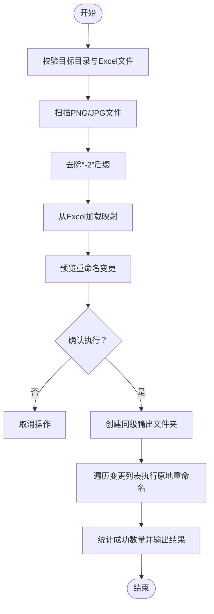
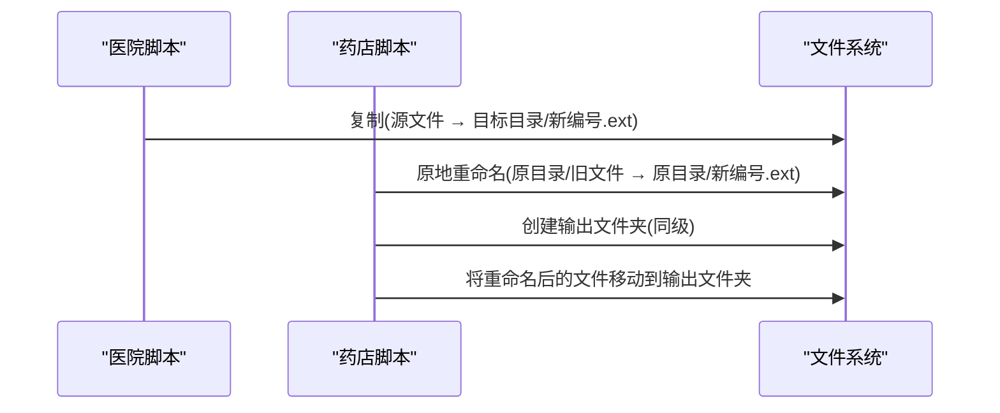
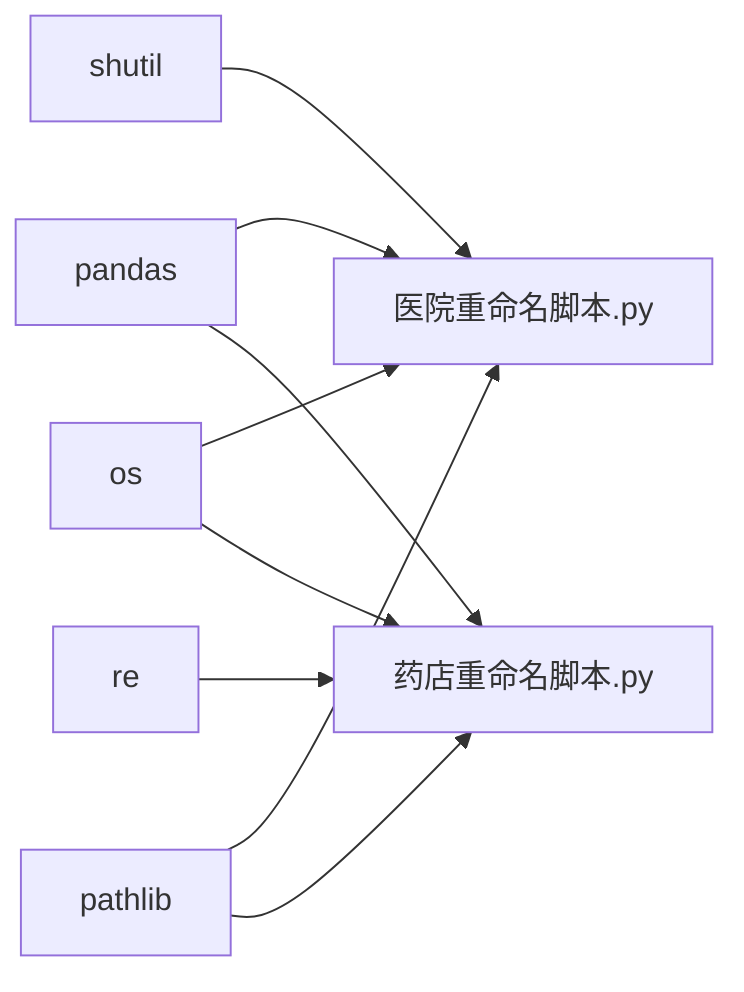

# 批量重命名工具

<cite>
**本文引用的文件**
- [医院/文件重命名脚本.py](file://医院/文件重命名脚本.py)
- [药店/rename_pharmacy_files.py](file://药店/rename_pharmacy_files.py)
- [医院/拜访编号处理脚本.py](file://医院/拜访编号处理脚本.py)
- [药店/process_pharmacy_data_v2.py](file://药店/process_pharmacy_data_v2.py)
- [医院/照片组内相似度排序工具.py](file://医院/照片组内相似度排序工具.py)
- [医院/照片重命名工具.py](file://医院/照片重命名工具.py)
- [医院/科室照片重命名工具.py](file://医院/科室照片重命名工具.py)
</cite>

## 目录
1. [简介](#简介)
2. [项目结构](#项目结构)
3. [核心组件](#核心组件)
4. [架构总览](#架构总览)
5. [详细组件分析](#详细组件分析)
6. [依赖关系分析](#依赖关系分析)
7. [性能考量](#性能考量)
8. [故障排查指南](#故障排查指南)
9. [结论](#结论)
10. [附录](#附录)

## 简介
本文件系统化对比分析“医院”与“药店”两类重命名脚本的异同点，聚焦以下主题：
- 医院脚本如何基于Excel中的“拜访编号”匹配原始文件并生成连续新编号，同时更新Excel的“新编号”字段；
- 药店脚本如何处理“-2”后缀去除并依据“原编号→拜访编号”的映射表进行重命名；
- 两者在路径处理、文件扫描、异常捕获方面的共性设计模式；
- 医院脚本中shutil.copy2的复制策略与药店脚本中os.rename的原地重命名差异；
- 配置参数（如source_dir、target_dir、EXCEL_FILE）的最佳实践与安全执行建议。

## 项目结构
仓库包含“医院”和“药店”两大子目录，分别提供与拜访相关的数据处理与文件重命名工具。本次文档关注与重命名直接相关的核心脚本及辅助工具。

图表来源
- [医院/文件重命名脚本.py](file://医院/文件重命名脚本.py#L1-L130)
- [药店/rename_pharmacy_files.py](file://药店/rename_pharmacy_files.py#L1-L183)
- [医院/拜访编号处理脚本.py](file://医院/拜访编号处理脚本.py#L1-L157)
- [药店/process_pharmacy_data_v2.py](file://药店/process_pharmacy_data_v2.py#L1-L173)
- [医院/照片重命名工具.py](file://医院/照片重命名工具.py#L215-L245)
- [医院/照片组内相似度排序工具.py](file://医院/照片组内相似度排序工具.py#L365-L393)
- [医院/科室照片重命名工具.py](file://医院/科室照片重命名工具.py#L147-L173)

章节来源
- [医院/文件重命名脚本.py](file://医院/文件重命名脚本.py#L1-L130)
- [药店/rename_pharmacy_files.py](file://药店/rename_pharmacy_files.py#L1-L183)

## 核心组件
- 医院重命名脚本：读取Excel“拜访数据”，根据“拜访编号”生成连续新编号并写回；扫描源目录文件，匹配后复制到目标目录并以新编号命名。
- 药店重命名脚本：扫描目标目录PNG/JPG，先去除“-2”后缀，再依据Excel映射表将“原编号”重命名为“拜访编号”，采用原地重命名方式并创建同级输出文件夹保存结果。

章节来源
- [医院/文件重命名脚本.py](file://医院/文件重命名脚本.py#L1-L130)
- [药店/rename_pharmacy_files.py](file://药店/rename_pharmacy_files.py#L1-L183)

## 架构总览
两套脚本均遵循“读取配置→读取Excel→扫描文件→构建映射→执行重命名/复制→保存结果”的通用流程，但在具体实现上存在显著差异。

图表来源
- [医院/文件重命名脚本.py](file://医院/文件重命名脚本.py#L1-L130)
- [药店/rename_pharmacy_files.py](file://药店/rename_pharmacy_files.py#L1-L183)

## 详细组件分析

### 医院重命名脚本（基于Excel“拜访编号”生成连续新编号）
- 数据输入与准备
  - 读取Excel“拜访数据”工作表，检查是否存在“拜访编号”列；若不存在则退出。
  - 若“新编号”列不存在则自动创建。
- 文件扫描与匹配
  - 扫描源目录，仅统计文件（忽略子目录），以“文件名（不含扩展名）”为键建立映射。
  - 遍历Excel行，对“拜访编号”进行类型处理（浮点数转整数字符串），为空则新编号留空。
  - 为有编号的行分配连续新编号，并记录可匹配的文件清单。
- 结果写回与复制
  - 将“新编号”写回Excel“拜访计划”工作表。
  - 逐条复制匹配文件至目标目录，新文件名为“新编号+原扩展名”。

图表来源
- [医院/文件重命名脚本.py](file://医院/文件重命名脚本.py#L1-L130)

章节来源
- [医院/文件重命名脚本.py](file://医院/文件重命名脚本.py#L1-L130)

### 药店重命名脚本（去“-2”后缀并按映射重命名）
- 配置与输入
  - 通过常量配置目标目录、Excel文件、工作表名、列名等。
- 文件扫描与清洗
  - 仅扫描PNG/JPG文件；对文件名执行正则去“-2”后缀。
- 映射加载与预览
  - 从Excel“重排序”工作表读取“原编号→拜访编号”映射，过滤空值。
  - 预览将要执行的重命名操作，便于确认。
- 执行重命名
  - 在原目录同级创建“-新编号”输出文件夹。
  - 逐一执行原地重命名，若目标文件已存在则跳过。
  - 支持交互式确认，避免误操作。

图表来源
- [药店/rename_pharmacy_files.py](file://药店/rename_pharmacy_files.py#L1-L183)

章节来源
- [药店/rename_pharmacy_files.py](file://药店/rename_pharmacy_files.py#L1-L183)

### 两者的共性设计模式
- 路径处理
  - 均使用标准库路径处理函数（如拼接、判断存在性），避免硬编码路径冲突。
- 文件扫描
  - 均采用“列出目录→过滤文件类型/条件→构建集合/映射”的模式，保证扫描效率与准确性。
- 异常捕获
  - 均在关键步骤包裹try/except并打印错误信息，避免程序崩溃；部分脚本还打印堆栈以便定位问题。
- 配置参数
  - 均将路径、文件名、工作表名等集中定义，便于维护与迁移。

章节来源
- [医院/文件重命名脚本.py](file://医院/文件重命名脚本.py#L1-L130)
- [药店/rename_pharmacy_files.py](file://药店/rename_pharmacy_files.py#L1-L183)

### 复制策略与原地重命名差异
- 医院脚本
  - 使用复制策略：shutil.copy2将匹配文件复制到目标目录并以新编号命名，保留原始文件。
  - 优点：安全，不会覆盖原文件；缺点：占用额外磁盘空间。
- 药店脚本
  - 使用原地重命名策略：os.rename直接在原目录内重命名文件，同时创建同级输出文件夹保存结果。
  - 优点：节省空间；缺点：直接修改原文件，需谨慎确认。

图表来源
- [医院/文件重命名脚本.py](file://医院/文件重命名脚本.py#L100-L130)
- [药店/rename_pharmacy_files.py](file://药店/rename_pharmacy_files.py#L99-L183)

章节来源
- [医院/文件重命名脚本.py](file://医院/文件重命名脚本.py#L100-L130)
- [药店/rename_pharmacy_files.py](file://药店/rename_pharmacy_files.py#L99-L183)

### 与其它重命名工具的关联
- 照片组内相似度排序工具：在执行重命名前进行备份（shutil.copy2），并在必要时将目标文件重命名为临时文件以避免覆盖。
- 照片重命名工具：在原目录内直接重命名，强调“原地重命名”的安全性控制（异常捕获与日志）。
- 科室照片重命名工具：采用复制策略（逐字节读写）而非移动，确保不破坏原始文件。

章节来源
- [医院/照片组内相似度排序工具.py](file://医院/照片组内相似度排序工具.py#L365-L393)
- [医院/照片重命名工具.py](file://医院/照片重命名工具.py#L215-L245)
- [医院/科室照片重命名工具.py](file://医院/科室照片重命名工具.py#L147-L173)

## 依赖关系分析
- 医院重命名脚本依赖pandas读取Excel、os与shutil进行文件操作、pathlib辅助路径处理。
- 药店重命名脚本依赖pandas读取Excel、os与re进行文件扫描与清洗、pathlib辅助路径处理。
- 两者均依赖openpyxl（通过pandas）读写Excel，但写入方式不同：医院脚本直接写回原表，药店脚本创建同级输出文件夹并重命名。

图表来源
- [医院/文件重命名脚本.py](file://医院/文件重命名脚本.py#L1-L130)
- [药店/rename_pharmacy_files.py](file://药店/rename_pharmacy_files.py#L1-L183)

章节来源
- [医院/文件重命名脚本.py](file://医院/文件重命名脚本.py#L1-L130)
- [药店/rename_pharmacy_files.py](file://药店/rename_pharmacy_files.py#L1-L183)

## 性能考量
- 文件扫描复杂度
  - 医院脚本：O(N)扫描源目录文件，O(M)遍历Excel行，整体近似O(N+M)。
  - 药店脚本：O(K)扫描图像文件，K为PNG/JPG数量；映射查找为O(1)平均。
- 复制与重命名成本
  - 医院脚本复制文件，I/O开销较大；适合小规模数据或需要保留原文件的场景。
  - 药店脚本原地重命名，I/O开销较小；适合大规模数据且确认映射准确的场景。
- Excel读写
  - 两脚本均使用pandas读写，注意大表时内存占用与写入性能；可考虑分批处理或使用更高效的引擎。

[本节为通用性能讨论，无需特定文件引用]

## 故障排查指南
- 常见问题
  - Excel列缺失：“拜访编号”或“原编号/拜访编号”列不存在会导致脚本提前退出。
  - 目录不存在：源目录或目标目录不存在会触发错误提示。
  - 文件未匹配：Excel中有编号但源目录无对应文件名，脚本会打印告警。
  - 目标文件已存在：药店脚本会跳过该文件，避免覆盖。
- 建议排查步骤
  - 核对Excel列名与工作表名是否一致。
  - 检查文件名是否包含隐藏字符或大小写差异。
  - 使用预览功能（药店脚本提供预览）确认映射关系。
  - 在执行前备份重要文件（医院脚本可参考“照片组内相似度排序工具”的备份策略）。
- 日志与错误
  - 两脚本均打印详细错误信息与堆栈，便于定位问题。

章节来源
- [医院/文件重命名脚本.py](file://医院/文件重命名脚本.py#L1-L130)
- [药店/rename_pharmacy_files.py](file://药店/rename_pharmacy_files.py#L1-L183)
- [医院/照片组内相似度排序工具.py](file://医院/照片组内相似度排序工具.py#L365-L393)

## 结论
- 医院脚本侧重“编号生成+复制保留原文件”，适合需要保留原始文件与可追溯性的场景。
- 药店脚本侧重“去后缀+映射重命名+原地重命名”，适合快速整理与节省空间的场景。
- 两者在路径处理、文件扫描、异常捕获方面具备高度一致性，体现了良好的工程化实践。
- 在实际使用中，应根据数据规模、安全需求与存储空间选择合适的策略，并严格遵循备份与预览流程。

[本节为总结性内容，无需特定文件引用]

## 附录

### 配置参数最佳实践
- source_dir/target_dir
  - 使用绝对路径或相对路径统一管理，避免跨平台差异。
  - 确保目标目录存在或在脚本中显式创建。
- EXCEL_FILE/SHEET_NAME/COLUMN_NAMES
  - 将Excel路径、工作表名与列名集中定义，便于迁移与维护。
  - 读取前先检查列是否存在，避免因列名变化导致失败。
- 安全执行建议
  - 医院脚本：默认复制策略已较安全，建议在执行前手动核对Excel“新编号”列。
  - 药店脚本：务必先预览变更，确认映射正确后再执行；执行前可在同级创建输出文件夹并备份原文件。
  - 通用建议：在执行前对关键文件进行备份，或在测试环境中先行验证。

章节来源
- [医院/文件重命名脚本.py](file://医院/文件重命名脚本.py#L1-L130)
- [药店/rename_pharmacy_files.py](file://药店/rename_pharmacy_files.py#L1-L183)
- [医院/照片组内相似度排序工具.py](file://医院/照片组内相似度排序工具.py#L365-L393)