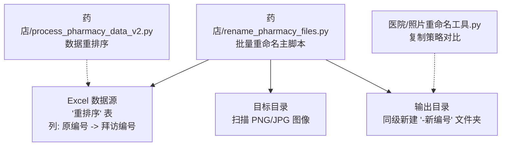
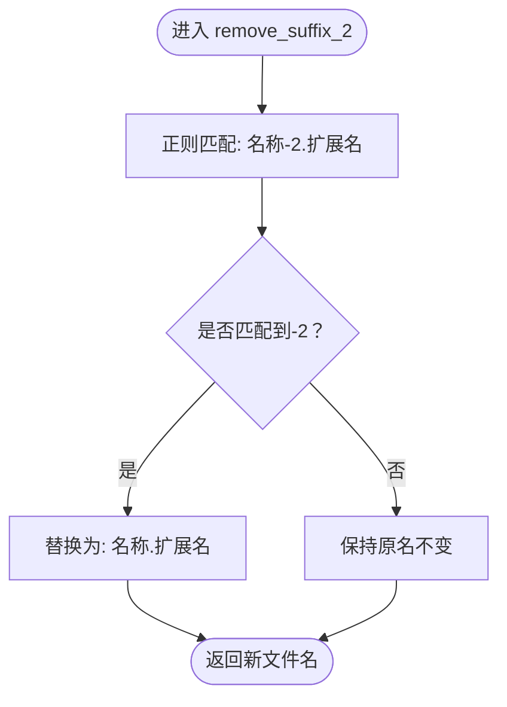
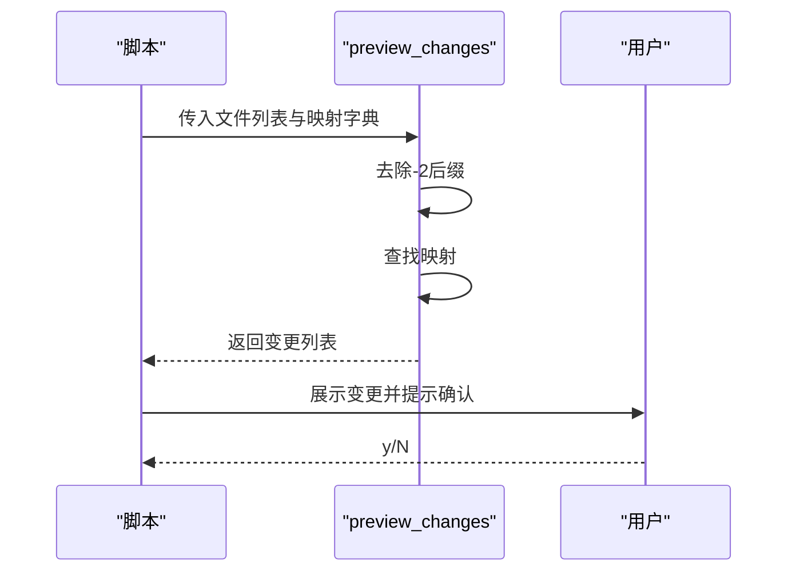
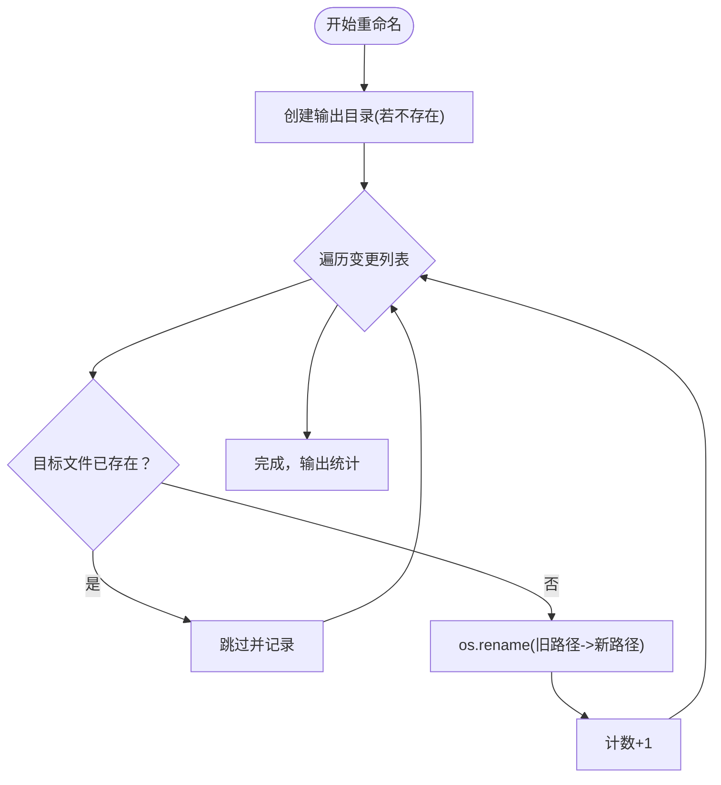

# 药店批量重命名工具

<cite>
**本文引用的文件**
- [rename_pharmacy_files.py](file://药店/rename_pharmacy_files.py)
- [process_pharmacy_data_v2.py](file://药店/process_pharmacy_data_v2.py)
- [照片重命名工具.py](file://医院/照片重命名工具.py)
- [药店文件路径.txt](file://药店文件路径.txt)
</cite>

## 目录
1. [简介](#简介)
2. [项目结构](#项目结构)
3. [核心组件](#核心组件)
4. [架构总览](#架构总览)
5. [详细组件分析](#详细组件分析)
6. [依赖分析](#依赖分析)
7. [性能考虑](#性能考虑)
8. [故障排查指南](#故障排查指南)
9. [结论](#结论)
10. [附录](#附录)

## 简介
本文件面向“药店批量重命名工具”（rename_pharmacy_files.py），系统性解析其工作流程与实现细节，包括：
- 如何扫描指定目录下的 PNG/JPG 图像文件；
- 如何通过正则表达式去除文件名中的“-2”后缀；
- 如何从 Excel 的“重排序”表中读取“原编号”到“拜访编号”的映射关系；
- 基于映射关系进行重命名；
- os.rename 的原地重命名特性及其与医院脚本复制策略的区别；
- 预览功能如何在执行前展示变更列表并通过用户确认机制防止误操作；
- 输出文件夹自动生成规则（添加“-新编号”后缀）及冲突检测机制；
- 修改 TARGET_DIR、EXCEL_FILE 等配置参数的指导，并建议在正式运行前使用预览模式验证映射准确性。

## 项目结构
该仓库包含“医院”和“药店”两大模块。与本工具直接相关的核心文件如下：
- 药店批量重命名工具：药店/rename_pharmacy_files.py
- 药店数据重排序工具：药店/process_pharmacy_data_v2.py
- 医院照片重命名工具（对比参考）：医院/照片重命名工具.py
- 药店相关路径索引：药店文件路径.txt

图表来源
- [rename_pharmacy_files.py](file://药店/rename_pharmacy_files.py#L1-L183)
- [process_pharmacy_data_v2.py](file://药店/process_pharmacy_data_v2.py#L1-L173)
- [照片重命名工具.py](file://医院/照片重命名工具.py#L1-L200)

章节来源
- [rename_pharmacy_files.py](file://药店/rename_pharmacy_files.py#L1-L183)
- [process_pharmacy_data_v2.py](file://药店/process_pharmacy_data_v2.py#L1-L173)
- [药店文件路径.txt](file://药店文件路径.txt#L1-L30)

## 核心组件
- 目录扫描：扫描目标目录中的 PNG/JPG/JPEG 图像文件，返回文件名列表。
- 后缀清理：使用正则表达式匹配并去除文件名中的“-2”后缀（仅在扩展名前）。
- 映射加载：从 Excel 的“重排序”表中读取“原编号”到“拜访编号”的映射字典。
- 预览变更：对扫描到的文件逐一进行预览，展示将要发生的重命名。
- 执行重命名：在同级目录下创建“-新编号”输出文件夹，逐个执行 os.rename 并进行冲突检测。
- 用户确认：在执行前提示变更数量并要求输入确认，防止误操作。

章节来源
- [rename_pharmacy_files.py](file://药店/rename_pharmacy_files.py#L25-L183)

## 架构总览
整体流程由“扫描 -> 清理 -> 加载映射 -> 预览 -> 确认 -> 重命名 -> 输出”构成。与医院脚本的差异在于：医院脚本采用“复制+备份”的策略，而药店脚本采用“原地重命名”，更高效且不产生额外副本。

图表来源
- [rename_pharmacy_files.py](file://药店/rename_pharmacy_files.py#L125-L183)

## 详细组件分析

### 目录扫描与文件筛选
- 功能：遍历目标目录，筛选出扩展名为 png/jpg/jpeg 的文件，返回文件名列表。
- 特性：对异常进行捕获并返回空列表，保证流程健壮性。
- 复杂度：O(N)，N 为目录中文件总数。

章节来源
- [rename_pharmacy_files.py](file://药店/rename_pharmacy_files.py#L25-L36)

### 正则表达式去后缀“-2”
- 功能：匹配文件名中位于扩展名之前的“-2”，并将其替换为空字符串。
- 正则要点：区分大小写忽略；确保“-2”位于扩展名前，避免误伤文件名中间的数字。
- 复杂度：O(L)，L 为文件名长度。

图表来源
- [rename_pharmacy_files.py](file://药店/rename_pharmacy_files.py#L38-L46)

章节来源
- [rename_pharmacy_files.py](file://药店/rename_pharmacy_files.py#L38-L46)

### Excel 映射加载
- 功能：读取 Excel 的“重排序”表，校验列是否存在，构建“原编号 -> 拜访编号”的映射字典。
- 数据清洗：去除空值与 NaN 字符串，统一转为字符串并去空白。
- 复杂度：O(M)，M 为 Excel 行数。

图表来源
- [rename_pharmacy_files.py](file://药店/rename_pharmacy_files.py#L47-L76)

章节来源
- [rename_pharmacy_files.py](file://药店/rename_pharmacy_files.py#L47-L76)

### 预览变更与用户确认
- 功能：对每个文件先去“-2”，再按映射查找“拜访编号”，输出变更列表。
- 未命中：输出“未找到对应的拜访编号”，便于核对映射完整性。
- 用户确认：在执行前打印变更数量并等待 y/N 输入，防止误操作。

图表来源
- [rename_pharmacy_files.py](file://药店/rename_pharmacy_files.py#L77-L98)
- [rename_pharmacy_files.py](file://药店/rename_pharmacy_files.py#L151-L181)

章节来源
- [rename_pharmacy_files.py](file://药店/rename_pharmacy_files.py#L77-L98)
- [rename_pharmacy_files.py](file://药店/rename_pharmacy_files.py#L151-L181)

### 输出目录生成与冲突检测
- 输出目录：在目标目录同级创建“原目录名-新编号”文件夹。
- 冲突检测：若目标文件已存在，则跳过该文件并输出提示，避免覆盖。
- 执行方式：使用 os.rename 原地重命名，不复制文件，节省空间与时间。

图表来源
- [rename_pharmacy_files.py](file://药店/rename_pharmacy_files.py#L99-L124)
- [rename_pharmacy_files.py](file://药店/rename_pharmacy_files.py#L162-L171)

章节来源
- [rename_pharmacy_files.py](file://药店/rename_pharmacy_files.py#L99-L124)
- [rename_pharmacy_files.py](file://药店/rename_pharmacy_files.py#L162-L171)

### 与医院脚本复制策略的对比
- 药店脚本（rename_pharmacy_files.py）：使用 os.rename 原地重命名，不复制文件，输出目录为“-新编号”。
- 医院脚本（照片重命名工具.py）：采用“备份+复制”策略，先在同级创建备份目录，再复制文件，最后可能进行二次处理。
- 影响：药店脚本更高效、占用空间更少；医院脚本更安全，适合需要保留原始文件的场景。

章节来源
- [rename_pharmacy_files.py](file://药店/rename_pharmacy_files.py#L162-L171)
- [照片重命名工具.py](file://医院/照片重命名工具.py#L171-L192)

### 与数据重排序的关系
- process_pharmacy_data_v2.py 用于对药店数据进行重排序，生成新的排序规则与统计信息。
- rename_pharmacy_files.py 依赖 Excel 的“重排序”表中的“原编号 -> 拜访编号”映射，用于文件重命名。
- 关系：前者负责“排好序”，后者负责“按映射重命名”。

章节来源
- [process_pharmacy_data_v2.py](file://药店/process_pharmacy_data_v2.py#L1-L173)
- [rename_pharmacy_files.py](file://药店/rename_pharmacy_files.py#L16-L24)

## 依赖分析
- 外部库依赖：pandas、openpyxl、re、os、pathlib。
- 内部流程耦合：扫描 -> 清理 -> 加载映射 -> 预览 -> 确认 -> 重命名 -> 输出。
- 风险点：Excel 列缺失、文件名不规范、目标文件已存在、磁盘权限不足等。

图表来源
- [rename_pharmacy_files.py](file://药店/rename_pharmacy_files.py#L1-L24)

章节来源
- [rename_pharmacy_files.py](file://药店/rename_pharmacy_files.py#L1-L24)

## 性能考虑
- 目录扫描：O(N)，N 为目录中文件数；建议在大目录下谨慎使用。
- 正则匹配：O(L)，L 为文件名长度；对大量文件影响较小。
- 映射构建：O(M)，M 为 Excel 行数；建议确保 Excel 列名准确，避免重复过滤。
- 重命名：O(K)，K 为变更数量；os.rename 为系统调用，通常很快。
- 冲突检测：每次重命名前检查目标是否存在，避免覆盖。

[本节为通用性能讨论，无需特定文件来源]

## 故障排查指南
- 目录不存在：脚本会在入口处检查并提示错误，确认 TARGET_DIR 是否正确。
- Excel 文件不存在：同样会在入口处提示，确认 EXCEL_FILE 是否正确。
- Excel 列缺失：当“原编号”或“拜访编号”列不存在时，脚本会输出警告并返回空映射，请核对列名。
- 未找到有效映射：若映射为空，脚本会提示并终止，需检查 Excel 数据与列名。
- 预览无变更：若预览列表为空，检查文件名是否包含“-2”后缀，或映射是否正确。
- 冲突跳过：若目标文件已存在，脚本会跳过并提示，可手动删除或重命名目标文件后再试。
- 用户取消：输入非 y/Y 时脚本终止，不会执行任何重命名。

章节来源
- [rename_pharmacy_files.py](file://药店/rename_pharmacy_files.py#L125-L183)
- [rename_pharmacy_files.py](file://药店/rename_pharmacy_files.py#L99-L124)

## 结论
药店批量重命名工具通过清晰的扫描、清理、映射、预览与确认流程，实现了高效、可控的文件重命名。其原地重命名策略与医院脚本的复制策略形成互补：前者强调速度与空间效率，后者强调安全性与可回溯性。建议在正式运行前使用预览模式验证映射准确性，并在必要时结合数据重排序工具确保“原编号 -> 拜访编号”的一致性。

[本节为总结性内容，无需特定文件来源]

## 附录

### 配置参数修改指导
- TARGET_DIR：目标照片目录路径。修改后请确保目录存在且包含 PNG/JPG/JPEG 文件。
- EXCEL_FILE：Excel 文件路径。确保包含名为“重排序”的工作表，且包含“原编号”和“拜访编号”两列。
- SHEET_NAME：工作表名称，默认“重排序”。
- ORIGINAL_ID_COLUMN：Excel 中“原编号”列名，默认“原编号”。
- VISIT_ID_COLUMN：Excel 中“拜访编号”列名，默认“拜访编号”。
- OUTPUT_FOLDER_SUFFIX：输出文件夹后缀，默认“-新编号”。

建议步骤
- 在修改配置前，先使用预览模式运行脚本，核对扫描到的文件数量与预览变更列表。
- 确认 Excel 中“原编号”与“拜访编号”列完整且无空值。
- 若文件名中不含“-2”，可跳过清理步骤；若存在“-2”，确保映射能正确对应到“拜访编号”。

章节来源
- [rename_pharmacy_files.py](file://药店/rename_pharmacy_files.py#L16-L24)
- [rename_pharmacy_files.py](file://药店/rename_pharmacy_files.py#L125-L183)

### 与其他脚本的关系
- 药店文件路径索引：药店文件路径.txt 中明确标注了 rename_pharmacy_files.py 的用途为“改编号”，并与 process_pharmacy_data_v2.py 的“重排序”配合使用。
- 数据重排序：process_pharmacy_data_v2.py 生成新的排序结果，rename_pharmacy_files.py 依据该排序结果中的映射进行重命名。

章节来源
- [药店文件路径.txt](file://药店文件路径.txt#L1-L30)
- [process_pharmacy_data_v2.py](file://药店/process_pharmacy_data_v2.py#L1-L173)