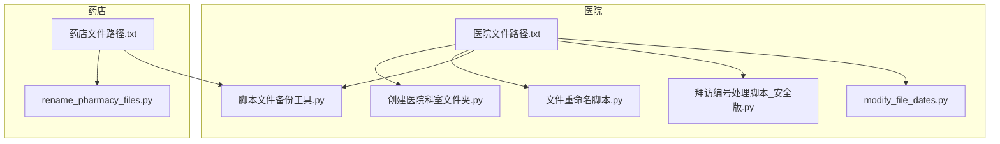
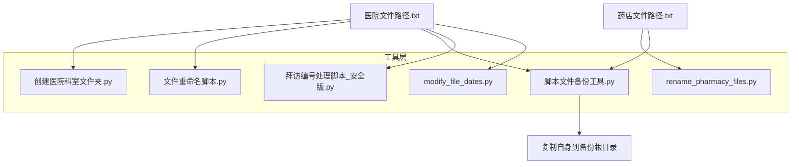
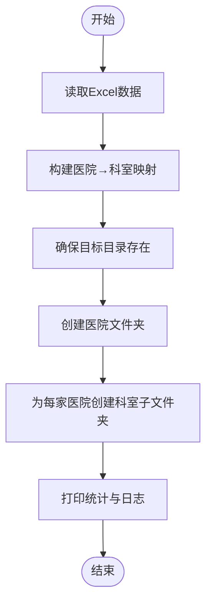
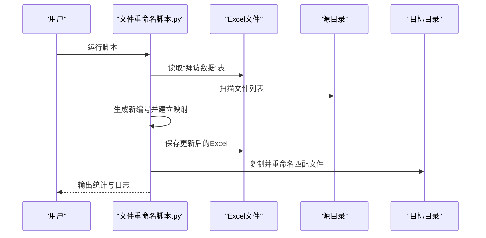
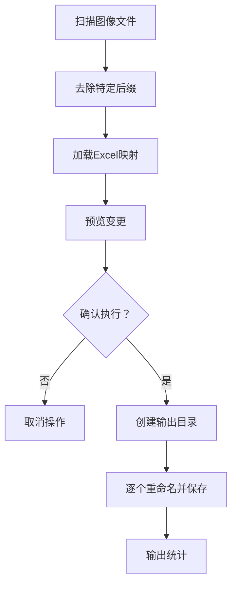
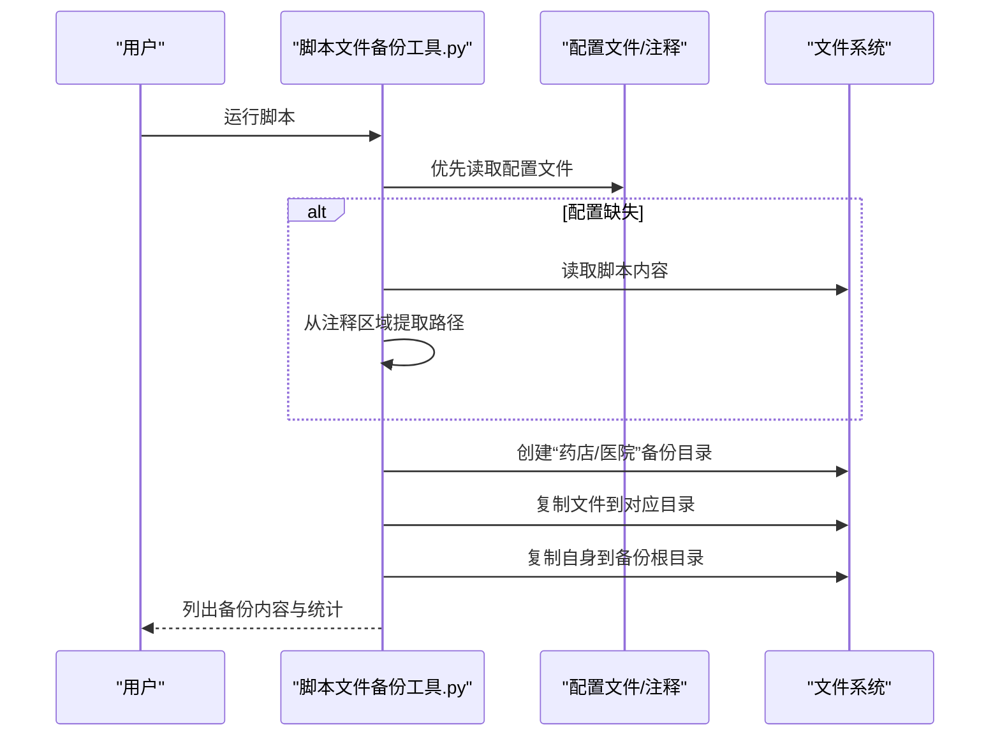
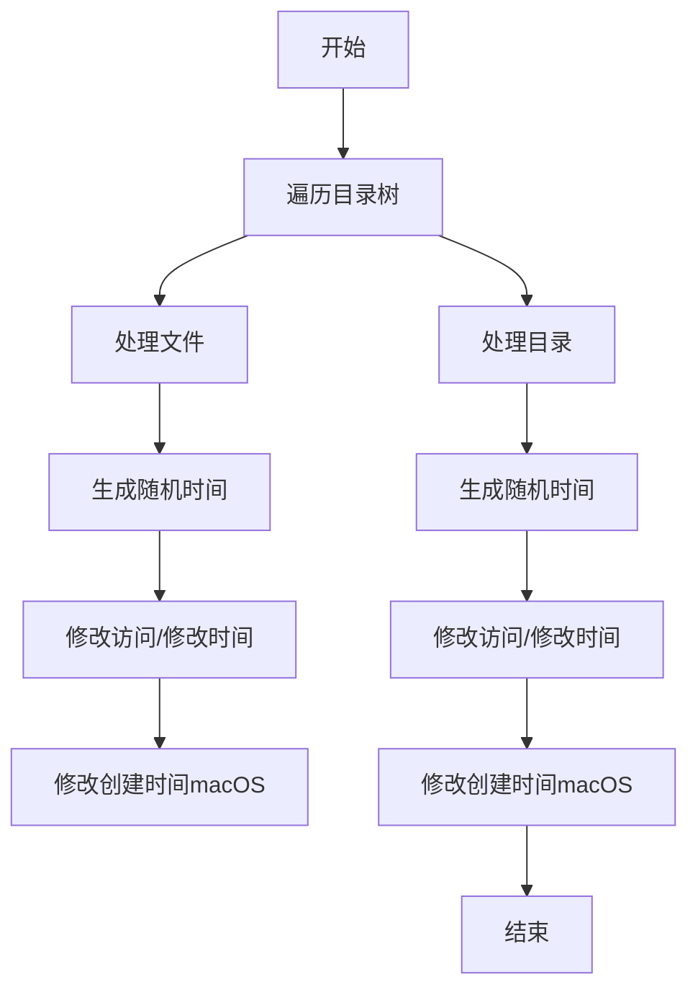
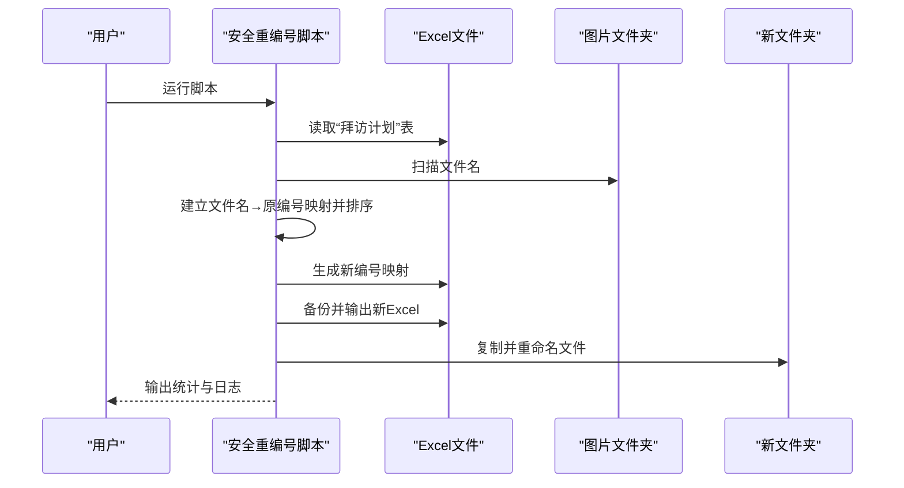
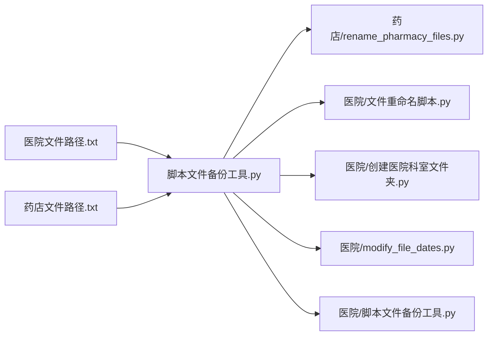

# 文件管理工具

<cite>
**本文引用的文件**
- [创建医院科室文件夹.py](file://医院/创建医院科室文件夹.py)
- [文件重命名脚本.py](file://医院/文件重命名脚本.py)
- [rename_pharmacy_files.py](file://药店/rename_pharmacy_files.py)
- [脚本文件备份工具.py](file://医院/脚本文件备份工具.py)
- [modify_file_dates.py](file://医院/modify_file_dates.py)
- [拜访编号处理脚本_安全版.py](file://医院/拜访编号处理脚本_安全版.py)
- [医院文件路径.txt](file://医院文件路径.txt)
- [药店文件路径.txt](file://药店文件路径.txt)
- [脚本文件备份工具-不能运行-会覆盖.py](file://脚本文件备份工具-不能运行-会覆盖.py)
</cite>

## 目录
1. [简介](#简介)
2. [项目结构](#项目结构)
3. [核心组件](#核心组件)
4. [架构总览](#架构总览)
5. [详细组件分析](#详细组件分析)
6. [依赖分析](#依赖分析)
7. [性能考虑](#性能考虑)
8. [故障排查指南](#故障排查指南)
9. [结论](#结论)
10. [附录](#附录)

## 简介
本文件系统化介绍项目中的各类文件自动化管理工具，重点覆盖以下方面：
- 如何通过“创建医院科室文件夹.py”根据预设结构批量生成医院-科室层级目录，提升组织效率。
- 如何通过“文件重命名脚本.py”与“rename_pharmacy_files.py”基于规则（如前缀、序号、日期）实现批量重命名，避免手动操作错误。
- “脚本文件备份工具.py”的版本备份机制及其安全版与非安全版的区别（是否覆盖检查）。
- “modify_file_dates.py”如何调整文件的创建/修改时间戳以满足特定系统要求。
- 结合“医院文件路径.txt”“药店文件路径.txt”等配置文件说明路径映射机制。
- 提供各工具的使用场景示例，如新项目初始化时的目录搭建或历史数据整理时的批量处理。

## 项目结构
仓库采用按业务域分层的组织方式：
- 医院/：集中存放与医院相关的一系列自动化脚本与工具。
- 药店/：集中存放与药店相关的一系列自动化脚本与工具。
- 配置文件：用于声明路径映射与流程指引，便于统一维护与复用。

图表来源
- [创建医院科室文件夹.py](file://医院/创建医院科室文件夹.py#L1-L57)
- [文件重命名脚本.py](file://医院/文件重命名脚本.py#L1-L130)
- [rename_pharmacy_files.py](file://药店/rename_pharmacy_files.py#L1-L183)
- [脚本文件备份工具.py](file://医院/脚本文件备份工具.py#L1-L285)
- [modify_file_dates.py](file://医院/modify_file_dates.py#L1-L95)
- [拜访编号处理脚本_安全版.py](file://医院/拜访编号处理脚本_安全版.py#L1-L170)
- [医院文件路径.txt](file://医院文件路径.txt#L1-L54)
- [药店文件路径.txt](file://药店文件路径.txt#L1-L30)

章节来源
- [创建医院科室文件夹.py](file://医院/创建医院科室文件夹.py#L1-L57)
- [文件重命名脚本.py](file://医院/文件重命名脚本.py#L1-L130)
- [rename_pharmacy_files.py](file://药店/rename_pharmacy_files.py#L1-L183)
- [脚本文件备份工具.py](file://医院/脚本文件备份工具.py#L1-L285)
- [modify_file_dates.py](file://医院/modify_file_dates.py#L1-L95)
- [拜访编号处理脚本_安全版.py](file://医院/拜访编号处理脚本_安全版.py#L1-L170)
- [医院文件路径.txt](file://医院文件路径.txt#L1-L54)
- [药店文件路径.txt](file://药店文件路径.txt#L1-L30)

## 核心组件
- 目录批量创建工具：基于Excel数据，自动生成“医院/科室”两级目录结构，清理非法字符，避免命名冲突。
- 批量重命名工具：面向两类场景
  - 医院侧：依据Excel中的“拜访编号”与文件名映射，生成新编号并复制到目标目录。
  - 药店侧：扫描PNG/JPG文件，去除特定后缀，按Excel映射重命名，输出到同级新建文件夹。
- 版本备份工具：从配置文件或脚本注释中提取待备份文件列表，分类复制至“药店/医院”子目录，并可复制自身到备份根目录。
- 时间戳调整工具：遍历目录树，按目标日期与时间窗口生成随机时间，批量修改文件的访问/修改/创建时间。
- 安全重编号工具：对图片文件按数值排序后重新编号，同时备份并输出新Excel，避免直接覆盖原文件。

章节来源
- [创建医院科室文件夹.py](file://医院/创建医院科室文件夹.py#L1-L57)
- [文件重命名脚本.py](file://医院/文件重命名脚本.py#L1-L130)
- [rename_pharmacy_files.py](file://药店/rename_pharmacy_files.py#L1-L183)
- [脚本文件备份工具.py](file://医院/脚本文件备份工具.py#L1-L285)
- [modify_file_dates.py](file://医院/modify_file_dates.py#L1-L95)
- [拜访编号处理脚本_安全版.py](file://医院/拜访编号处理脚本_安全版.py#L1-L170)

## 架构总览
整体架构围绕“配置驱动 + 数据驱动”的思路展开：
- 配置文件（.txt）定义路径映射与流程说明，作为“元数据”驱动工具行为。
- 工具脚本读取配置，结合本地数据（Excel/文件系统），完成批量处理。
- 备份工具负责将脚本与相关文件归档，保障版本可追溯。

图表来源
- [医院文件路径.txt](file://医院文件路径.txt#L1-L54)
- [药店文件路径.txt](file://药店文件路径.txt#L1-L30)
- [创建医院科室文件夹.py](file://医院/创建医院科室文件夹.py#L1-L57)
- [文件重命名脚本.py](file://医院/文件重命名脚本.py#L1-L130)
- [rename_pharmacy_files.py](file://药店/rename_pharmacy_files.py#L1-L183)
- [modify_file_dates.py](file://医院/modify_file_dates.py#L1-L95)
- [脚本文件备份工具.py](file://医院/脚本文件备份工具.py#L1-L285)
- [拜访编号处理脚本_安全版.py](file://医院/拜访编号处理脚本_安全版.py#L1-L170)

## 详细组件分析

### 组件A：创建医院-科室文件夹
- 功能概述
  - 读取Excel中的“医院名称/科室”字段，构建“医院→科室”映射。
  - 清理非法字符，创建目标目录及子目录，打印创建过程与统计信息。
- 关键流程
  - 读取Excel → 建立映射 → 创建目录 → 输出日志。
- 使用建议
  - 在新项目初始化或导入数据后，快速生成标准化目录结构，便于后续归档与检索。

图表来源
- [创建医院科室文件夹.py](file://医院/创建医院科室文件夹.py#L1-L57)

章节来源
- [创建医院科室文件夹.py](file://医院/创建医院科室文件夹.py#L1-L57)

### 组件B：文件重命名（医院侧）
- 功能概述
  - 读取Excel“拜访数据”表，为有编号的记录生成“新编号”，并复制对应文件到目标目录。
  - 对“拜访编号”做类型兼容处理（浮点/字符串），匹配文件名后复制。
- 关键流程
  - 读取Excel → 构建文件名映射 → 生成新编号 → 保存Excel → 复制并重命名文件 → 输出统计。

图表来源
- [文件重命名脚本.py](file://医院/文件重命名脚本.py#L1-L130)

章节来源
- [文件重命名脚本.py](file://医院/文件重命名脚本.py#L1-L130)

### 组件C：文件重命名（药店侧）
- 功能概述
  - 扫描目标目录中的PNG/JPG文件，去除特定后缀，按Excel映射重命名。
  - 预览变更后确认执行，避免误操作；输出到同级新建文件夹，保留原文件。
- 关键流程
  - 扫描图像文件 → 去除后缀 → 加载映射 → 预览变更 → 创建输出目录 → 确认执行 → 重命名并保存。

图表来源
- [rename_pharmacy_files.py](file://药店/rename_pharmacy_files.py#L1-L183)

章节来源
- [rename_pharmacy_files.py](file://药店/rename_pharmacy_files.py#L1-L183)

### 组件D：脚本文件备份工具
- 功能概述
  - 从“药店/医院”配置文件中加载待备份文件列表；若配置缺失，则从脚本注释区域提取；若仍缺失，则使用内置默认列表。
  - 将文件分别复制到“药店/医院”子目录，并将自身复制到备份根目录，最后列出备份内容。
- 版本备份机制与安全版区别
  - 安全版：在修改Excel时先备份，再写入新文件，避免直接覆盖原文件，降低风险。
  - 非安全版：脚本文件备份工具-不能运行-会覆盖.py（文件名提示不可运行），其设计可能包含覆盖检查或更激进的策略，但不建议直接运行。

图表来源
- [脚本文件备份工具.py](file://医院/脚本文件备份工具.py#L1-L285)
- [脚本文件备份工具-不能运行-会覆盖.py](file://脚本文件备份工具-不能运行-会覆盖.py)

章节来源
- [脚本文件备份工具.py](file://医院/脚本文件备份工具.py#L1-L285)
- [脚本文件备份工具-不能运行-会覆盖.py](file://脚本文件备份工具-不能运行-会覆盖.py)

### 组件E：修改文件日期
- 功能概述
  - 遍历目标目录树，为每个文件与目录设置访问/修改时间；在macOS上额外设置创建时间。
  - 时间由目标日期与时间窗口生成随机分钟偏移，保证一致性与自然性。
- 使用建议
  - 当系统对文件时间戳敏感（如归档/合规要求）时，可统一调整以满足特定规则。

图表来源
- [modify_file_dates.py](file://医院/modify_file_dates.py#L1-L95)

章节来源
- [modify_file_dates.py](file://医院/modify_file_dates.py#L1-L95)

### 组件F：安全重编号（医院侧）
- 功能概述
  - 从图片文件夹中提取文件名，与Excel中的“原拜访编号”建立映射，按数值排序后生成新编号。
  - 通过备份原Excel并输出新文件的方式，避免直接覆盖原文件，降低风险。
- 使用建议
  - 在历史数据整理或批量重排时，优先使用安全版，确保可回溯。

图表来源
- [拜访编号处理脚本_安全版.py](file://医院/拜访编号处理脚本_安全版.py#L1-L170)

章节来源
- [拜访编号处理脚本_安全版.py](file://医院/拜访编号处理脚本_安全版.py#L1-L170)

## 依赖分析
- 路径映射机制
  - 通过“医院文件路径.txt”“药店文件路径.txt”声明路径清单，工具读取后执行相应操作。
  - 若配置文件缺失，备份工具会尝试从脚本注释中提取路径，最后退回到内置默认列表。
- 工具间耦合
  - 备份工具与路径配置强耦合，是唯一直接读取“.txt”配置的工具。
  - 其他工具主要依赖本地配置（硬编码路径），与配置文件解耦。
- 外部依赖
  - pandas：读取Excel数据。
  - shutil/pathlib/os：文件系统操作。
  - subprocess：在macOS上修改创建时间。

图表来源
- [医院文件路径.txt](file://医院文件路径.txt#L1-L54)
- [药店文件路径.txt](file://药店文件路径.txt#L1-L30)
- [脚本文件备份工具.py](file://医院/脚本文件备份工具.py#L1-L285)

章节来源
- [医院文件路径.txt](file://医院文件路径.txt#L1-L54)
- [药店文件路径.txt](file://药店文件路径.txt#L1-L30)
- [脚本文件备份工具.py](file://医院/脚本文件备份工具.py#L1-L285)

## 性能考虑
- 目录扫描与文件复制
  - 大规模文件复制时，建议分批执行或限制并发，避免磁盘IO瓶颈。
- Excel读写
  - 大表读取与写入需关注内存占用，必要时拆分工作表或分段处理。
- 时间戳批量修改
  - 遍历大量文件时，注意系统调用开销；可在macOS上一次性设置创建时间，减少重复调用次数。
- 路径解析
  - 正则匹配与路径解析应尽量避免重复计算，缓存中间结果可提升性能。

## 故障排查指南
- Excel列缺失
  - 医院重命名脚本会在缺少“拜访编号”列时报错并退出；请检查Excel列名与数据完整性。
- 目标目录不存在
  - 药店重命名脚本会检查目标目录与Excel文件是否存在；请确认路径配置正确。
- 文件已存在
  - 药店重命名脚本在目标文件已存在时会跳过；请清理冲突后再执行。
- 备份失败
  - 备份工具会记录失败文件列表；请检查权限与磁盘空间。
- 时间戳修改失败
  - macOS上需安装Xcode命令行工具以支持SetFile；否则仅能修改访问/修改时间。

章节来源
- [文件重命名脚本.py](file://医院/文件重命名脚本.py#L1-L130)
- [rename_pharmacy_files.py](file://药店/rename_pharmacy_files.py#L1-L183)
- [脚本文件备份工具.py](file://医院/脚本文件备份工具.py#L1-L285)
- [modify_file_dates.py](file://医院/modify_file_dates.py#L1-L95)

## 结论
本项目通过“配置驱动 + 数据驱动”的方式，提供了覆盖目录创建、批量重命名、版本备份与时间戳调整的完整工具链。建议在新项目初始化时使用“创建医院-科室文件夹.py”与“脚本文件备份工具.py”快速搭建规范目录与版本基线；在历史数据整理时优先使用“安全重编号脚本”与“药店重命名脚本”，确保可回溯与零失误。

## 附录
- 使用场景示例
  - 新项目初始化：运行“创建医院-科室文件夹.py”生成标准化目录，随后使用“脚本文件备份工具.py”归档相关脚本。
  - 历史数据整理：使用“安全重编号脚本”对图片文件进行排序与重命名，同时备份Excel；使用“药店重命名脚本”清理后缀并按映射重命名。
  - 归档与合规：使用“modify_file_dates.py”统一调整时间戳，满足系统要求。
- 最佳实践
  - 在执行批量重命名前，先预览变更并确认；对关键文件保留备份。
  - 使用“安全版”脚本处理可能影响生产数据的任务，避免直接覆盖。
  - 将常用路径与流程写入“.txt”配置文件，便于团队共享与复用。