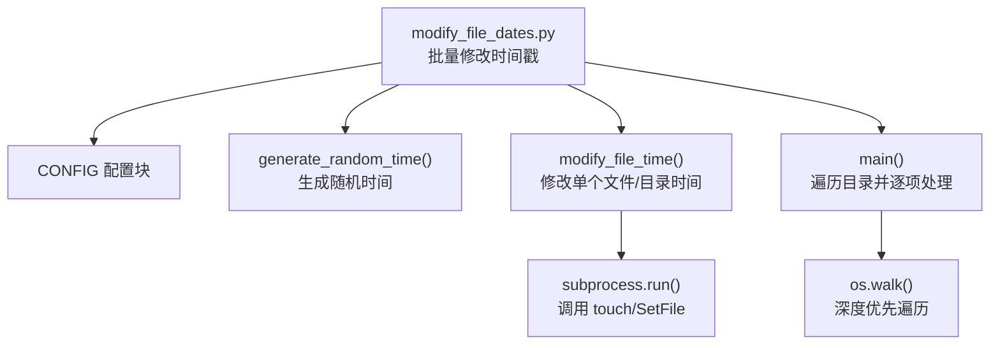
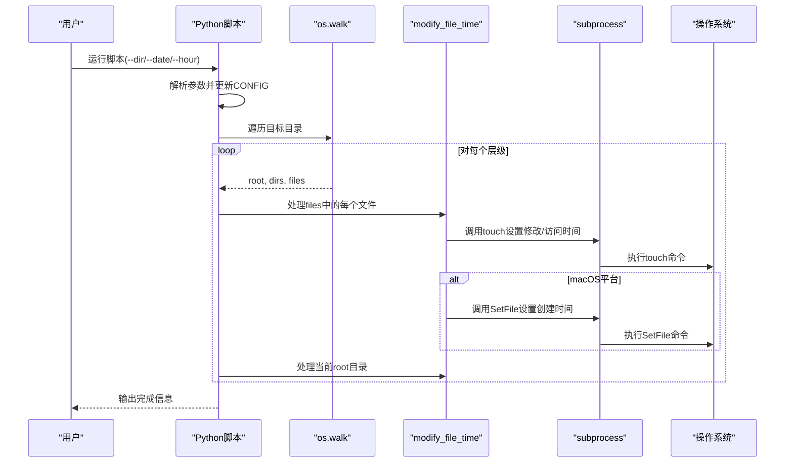
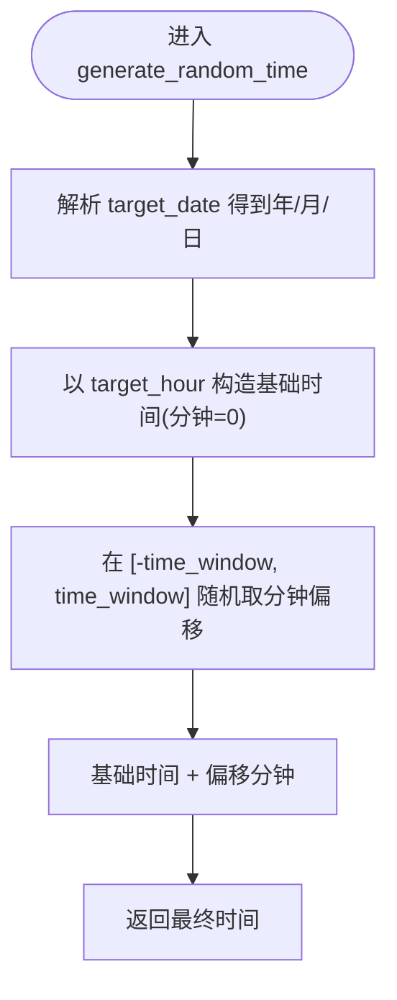
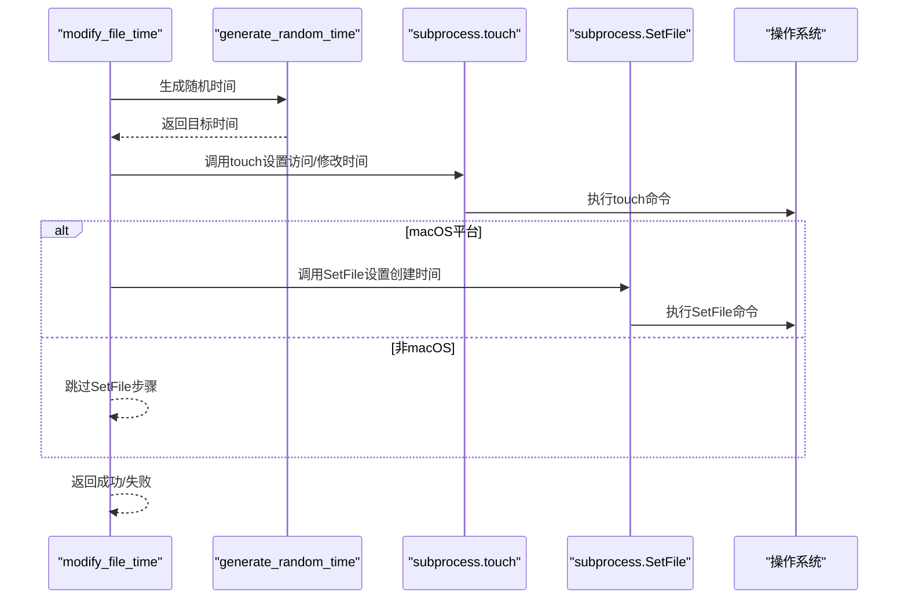
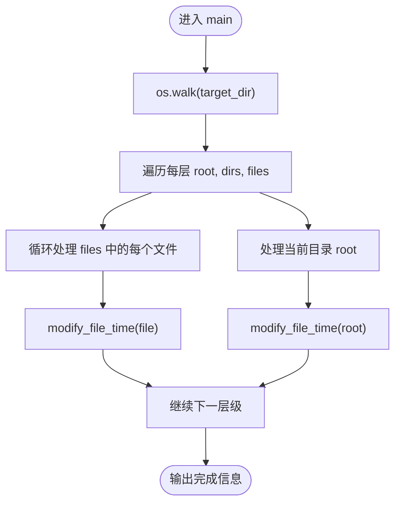
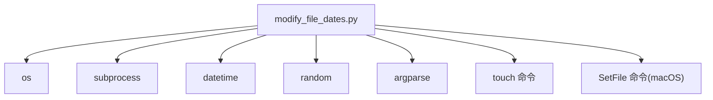

# 时间戳修改工具

<cite>
**本文引用的文件**
- [modify_file_dates.py](file://医院/modify_file_dates.py)
</cite>

## 目录
1. [简介](#简介)
2. [项目结构](#项目结构)
3. [核心组件](#核心组件)
4. [架构总览](#架构总览)
5. [详细组件分析](#详细组件分析)
6. [依赖关系分析](#依赖关系分析)
7. [性能考量](#性能考量)
8. [故障排查指南](#故障排查指南)
9. [结论](#结论)
10. [附录](#附录)

## 简介
本文件面向“时间戳修改工具”的使用者与维护者，系统性阐述 modify_file_dates.py 如何批量修改文件与目录的时间戳以满足审计或系统合规要求。重点包括：
- CONFIG 配置块中 target_date、target_hour 和 time_window 的作用机制
- generate_random_time 函数如何在目标时间前后进行随机偏移以模拟真实访问模式
- modify_file_time 函数通过 subprocess 调用 touch 与 SetFile 命令的技术细节，尤其是 macOS 平台创建时间修改方式
- os.walk 遍历策略如何确保所有子目录与文件被处理
- 命令行参数（--dir、--date、--hour）的使用示例与注意事项
- 权限不足导致操作失败的风险提示

## 项目结构
该工具位于“医院”子目录中，是一个独立的 Python 脚本，负责批量修改指定目录树下文件与目录的时间戳。

图表来源
- [modify_file_dates.py](file://医院/modify_file_dates.py#L14-L94)

章节来源
- [modify_file_dates.py](file://医院/modify_file_dates.py#L1-L94)

## 核心组件
- 配置块 CONFIG：集中定义目标目录、目标日期、目标小时与时间窗口等参数，便于统一管理与命令行覆盖。
- generate_random_time：基于目标日期与目标小时，结合 time_window（分钟）生成目标时间前后随机偏移后的最终时间。
- modify_file_time：对单个文件或目录执行时间戳修改，先修改修改时间与访问时间，再在 macOS 上修改创建时间。
- main：使用 os.walk 遍历目录树，先处理文件，再处理目录本身，保证目录元信息也被更新。
- 命令行解析：支持通过 --dir、--date、--hour 动态覆盖 CONFIG 中的对应字段。

章节来源
- [modify_file_dates.py](file://医院/modify_file_dates.py#L14-L94)

## 架构总览
整体流程从命令行参数解析开始，随后根据 CONFIG 或传入参数确定目标目录与目标时间，再通过 os.walk 遍历目录树，逐个调用 modify_file_time 完成时间戳修改。

图表来源
- [modify_file_dates.py](file://医院/modify_file_dates.py#L39-L74)
- [modify_file_dates.py](file://医院/modify_file_dates.py#L63-L94)

## 详细组件分析

### 配置块 CONFIG 与参数语义
- target_dir：待处理的根目录路径。默认值指向一个具体目录，可通过命令行 --dir 覆盖。
- target_date：目标日期，格式为 YYYYMMDD。用于构造基础时间点。
- target_hour：目标小时，范围 0-23。与 target_date 组合形成基础时间。
- time_window：时间窗口（单位：分钟）。最终时间在基础时间前后随机偏移 ±time_window 分钟，用于模拟真实访问模式。

章节来源
- [modify_file_dates.py](file://医院/modify_file_dates.py#L14-L19)

### generate_random_time：随机时间生成逻辑
- 输入：CONFIG 中的 target_date 与 target_hour
- 处理：
  - 将 target_date 解析为年、月、日
  - 以 target_hour 构造基础时间（分钟设为 0）
  - 在 [-time_window, +time_window] 范围内随机选择分钟偏移
  - 返回最终时间
- 输出：最终时间对象，作为后续时间戳修改的基准

图表来源
- [modify_file_dates.py](file://医院/modify_file_dates.py#L21-L37)

章节来源
- [modify_file_dates.py](file://医院/modify_file_dates.py#L21-L37)

### modify_file_time：单文件/目录时间戳修改
- 输入：文件或目录的绝对路径
- 处理：
  - 调用 generate_random_time 获取目标时间
  - 将目标时间格式化为 shell 命令所需的字符串
  - 调用 touch 命令同时修改访问时间与修改时间
  - 在 macOS 平台上，额外调用 SetFile 命令修改创建时间（需安装 Xcode 命令行工具）
  - 成功打印成功信息；异常捕获并返回失败状态
- 输出：布尔值表示本次修改是否成功

图表来源
- [modify_file_dates.py](file://医院/modify_file_dates.py#L39-L56)

章节来源
- [modify_file_dates.py](file://医院/modify_file_dates.py#L39-L56)

### main：目录遍历与处理策略
- 使用 os.walk 遍历 CONFIG['target_dir'] 下的所有子目录与文件
- 遍历顺序：
  - 先处理当前层级的所有文件（逐个调用 modify_file_time）
  - 再处理当前目录本身（调用 modify_file_time）
- 最后输出“全部处理完成”的提示信息

图表来源
- [modify_file_dates.py](file://医院/modify_file_dates.py#L63-L74)

章节来源
- [modify_file_dates.py](file://医院/modify_file_dates.py#L63-L74)

### 命令行参数与使用示例
- --dir：覆盖 CONFIG['target_dir']，指定目标目录
- --date：覆盖 CONFIG['target_date']，指定目标日期（YYYYMMDD）
- --hour：覆盖 CONFIG['target_hour']，指定目标小时（0-23）

使用示例（不展示具体命令行内容，仅给出路径与参数说明）：
- 指定新的目标目录：python3 医院/modify_file_dates.py --dir "/path/to/target"
- 指定新的目标日期：python3 医院/modify_file_dates.py --date "20251225"
- 指定新的目标小时：python3 医院/modify_file_dates.py --hour 18
- 同时指定多个参数：python3 医院/modify_file_dates.py --dir "/new/dir" --date "20251225" --hour 19

章节来源
- [modify_file_dates.py](file://医院/modify_file_dates.py#L77-L94)

## 依赖关系分析
- 内置模块依赖：
  - os：用于目录遍历与路径拼接
  - subprocess：用于调用外部命令（touch、SetFile）
  - datetime：用于时间解析与计算
  - random：用于生成随机分钟偏移
  - argparse：用于命令行参数解析
- 外部命令依赖：
  - touch：修改文件的访问时间与修改时间
  - SetFile（macOS）：修改文件创建时间（需安装 Xcode 命令行工具）

图表来源
- [modify_file_dates.py](file://医院/modify_file_dates.py#L7-L12)
- [modify_file_dates.py](file://医院/modify_file_dates.py#L39-L56)

章节来源
- [modify_file_dates.py](file://医院/modify_file_dates.py#L7-L12)
- [modify_file_dates.py](file://医院/modify_file_dates.py#L39-L56)

## 性能考量
- 遍历复杂度：os.walk 对于 N 个文件/目录，时间复杂度近似 O(N)，空间复杂度 O(1)（除递归栈外）
- 子进程开销：每次 modify_file_time 调用 subprocess.run 执行外部命令，存在系统调用开销；若目录规模较大，建议分批执行或在可接受范围内使用
- 随机偏移成本：generate_random_time 仅进行简单数值运算，开销极低
- 平台差异：macOS 额外一次 SetFile 调用，其他平台则只执行 touch

[本节为通用性能讨论，无需列出章节来源]

## 故障排查指南
- 权限不足：
  - 现象：modify_file_time 抛出子进程错误，打印失败信息
  - 原因：对某些文件或目录无写权限，无法修改时间戳
  - 处理：提升权限或在更高权限账户下运行
- macOS 创建时间修改失败：
  - 现象：SetFile 命令报错
  - 原因：未安装 Xcode 命令行工具，SetFile 不可用
  - 处理：安装 Xcode 命令行工具后再试
- 目标目录不存在或不可读：
  - 现象：os.walk 无法遍历
  - 处理：确认路径正确且具备读取权限
- 参数覆盖无效：
  - 现象：CONFIG 未按预期更新
  - 处理：检查命令行参数类型与取值范围（--hour 必须为整数）

章节来源
- [modify_file_dates.py](file://医院/modify_file_dates.py#L59-L61)
- [modify_file_dates.py](file://医院/modify_file_dates.py#L52-L55)

## 结论
modify_file_dates.py 提供了简洁高效的批量时间戳修改能力，通过 CONFIG 统一配置与命令行灵活覆盖，结合 generate_random_time 的随机偏移策略，能够较好地模拟真实访问模式。其核心实现依赖 os.walk 与 subprocess，既保证了遍历的完整性，也兼顾了不同平台（尤其是 macOS）的创建时间修改需求。在实际使用中，应关注权限与外部工具依赖，并根据目录规模合理安排执行策略。

[本节为总结性内容，无需列出章节来源]

## 附录

### 关键函数与配置一览
- CONFIG['target_dir']：目标目录
- CONFIG['target_date']：目标日期（YYYYMMDD）
- CONFIG['target_hour']：目标小时（0-23）
- CONFIG['time_window']：随机偏移窗口（分钟）
- generate_random_time()：生成随机时间
- modify_file_time(file_path)：修改单个文件/目录时间戳
- main()：遍历并处理目录树
- 命令行参数：--dir、--date、--hour

章节来源
- [modify_file_dates.py](file://医院/modify_file_dates.py#L14-L94)