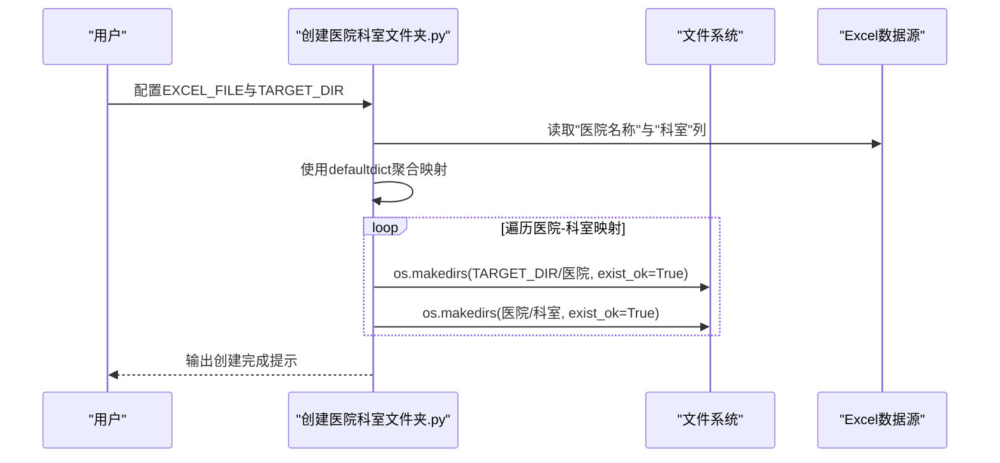
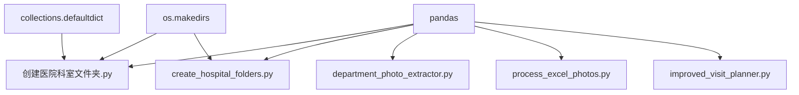

# 目录创建工具

<cite>
**本文引用的文件**
- [创建医院科室文件夹.py](file://医院/创建医院科室文件夹.py)
- [create_hospital_folders.py](file://医院/create_hospital_folders.py)
- [department_photo_extractor.py](file://医院/department_photo_extractor.py)
- [process_excel_photos.py](file://医院/process_excel_photos.py)
- [improved_visit_planner.py](file://医院/improved_visit_planner.py)
</cite>

## 目录
1. [简介](#简介)
2. [项目结构](#项目结构)
3. [核心组件](#核心组件)
4. [架构总览](#架构总览)
5. [详细组件分析](#详细组件分析)
6. [依赖分析](#依赖分析)
7. [性能考虑](#性能考虑)
8. [故障排查指南](#故障排查指南)
9. [结论](#结论)
10. [附录](#附录)

## 简介
本文件围绕“创建医院科室文件夹.py”展开，系统性说明其工作机制：如何读取Excel数据、构建“医院-科室”层级映射关系、通过操作系统接口创建多级目录结构，以及在文件名清理方面对特殊字符的处理策略。同时结合配置项EXCEL_FILE与TARGET_DIR说明输入输出路径设置，并给出实际使用场景（如根据贵州医生拜访数据批量生成科室照片存储目录）。文档还强调该工具在项目初始化阶段的关键作用，以及其依赖pandas与defaultdict进行数据聚合的技术实现细节。

## 项目结构
该仓库以“医院”和“药店”两大业务域划分，其中“创建医院科室文件夹.py”位于“医院”目录下，主要负责基于Excel中的“医院名称”和“科室”字段，批量创建本地文件夹结构，为后续照片抽取、整理与管理提供基础目录环境。

图表来源
- [创建医院科室文件夹.py](file://医院/创建医院科室文件夹.py#L1-L57)

章节来源
- [创建医院科室文件夹.py](file://医院/创建医院科室文件夹.py#L1-L57)

## 核心组件
- 输入配置
  - EXCEL_FILE：Excel输入文件路径，用于读取“医院名称”和“科室”两列。
  - TARGET_DIR：目标根目录，脚本在此目录下创建“医院/科室”两级文件夹。
- 数据读取与聚合
  - 使用pandas读取Excel，遍历行记录，利用defaultdict建立“医院名称 -> 科室集合”的映射。
- 目录创建
  - 使用os.makedirs递归创建目录，支持exist_ok参数避免重复创建时报错。
- 名称清理
  - clean_hospital_name与clean_department_name分别清理文件系统不兼容字符，保留字母、数字、括号、连字符、下划线与空格，并去除首尾空白。

章节来源
- [创建医院科室文件夹.py](file://医院/创建医院科室文件夹.py#L1-L57)

## 架构总览
该工具处于数据驱动的目录初始化阶段，上游通常由数据采集或筛选脚本生成Excel；下游可配合照片抽取与整理脚本使用。整体流程如下：

图表来源
- [创建医院科室文件夹.py](file://医院/创建医院科室文件夹.py#L1-L57)

## 详细组件分析

### 组件A：创建医院-科室目录（创建医院科室文件夹.py）
- 数据读取与聚合
  - 通过pandas读取Excel，遍历每一行，仅当“医院名称”和“科室”均非空时加入映射。
  - 使用defaultdict(set)自动去重并聚合每个医院的科室集合。
- 目录创建
  - 先确保TARGET_DIR存在，再逐个创建“医院”文件夹，再在每个医院下创建“科室”子文件夹。
  - 使用os.makedirs并开启exist_ok，保证幂等性。
- 名称清理
  - clean_hospital_name与clean_department_name采用字符白名单策略，仅保留字母、数字、括号、连字符、下划线与空格，并去除首尾空白，降低文件系统兼容性风险。

图表来源
- [创建医院科室文件夹.py](file://医院/创建医院科室文件夹.py#L1-L57)

章节来源
- [创建医院科室文件夹.py](file://医院/创建医院科室文件夹.py#L1-L57)

### 组件B：增强版目录创建（create_hospital_folders.py）
- 与组件A相比，该版本提供了更完善的目录结构与状态统计：
  - 为每家医院额外创建“大门”子目录。
  - 对已存在医院目录进行跳过处理，并统计新增与更新情况。
  - 提供统一的名称清理函数，移除常见文件系统禁用字符。
- 适用场景
  - 需要标准化的“医院/科室/大门”三层目录结构，便于后续照片管理与归档。

章节来源
- [create_hospital_folders.py](file://医院/create_hospital_folders.py#L1-L125)

### 组件C：照片抽取与目录联动（department_photo_extractor.py）
- 该脚本在已有“医院/科室”目录结构基础上，扫描视频文件并按规则抽取照片，体现目录创建工具的下游价值。
- 关键点
  - 读取Excel统计“医院-科室”拜访次数，作为照片抽取上限。
  - 从VIDEO_BASE_PATH扫描视频，匹配科室目录，按时间片段抽取帧。
  - 输出照片保存至OUTPUT_PHOTO_PATH，文件名包含医院编号、科室、视频文件名与时间戳等信息。

章节来源
- [department_photo_extractor.py](file://医院/department_photo_extractor.py#L1-L338)

### 组件D：Excel数据与照片处理联动（process_excel_photos.py）
- 该脚本读取Excel，为有“拜访编号”的记录生成顺序编号列，并将对应照片复制到新目录，文件名重命名为该顺序编号。
- 与目录创建工具的关系
  - 为后续照片抽取与整理提供编号化、结构化的照片文件，便于与“医院/科室”目录一一对应。

章节来源
- [process_excel_photos.py](file://医院/process_excel_photos.py#L1-L127)

### 组件E：拜访计划与目录准备（improved_visit_planner.py）
- 该脚本读取Excel，基于“导出筛选结果”和“医院地址”两个标签页，生成拜访计划。
- 与目录创建工具的关系
  - 通过统一的Excel数据源，确保“医院/科室”目录结构与计划一致，便于线下执行与照片拍摄。

章节来源
- [improved_visit_planner.py](file://医院/improved_visit_planner.py#L1-L551)

## 依赖分析
- 外部库
  - pandas：读取Excel，进行数据聚合与统计。
  - collections.defaultdict：高效构建“医院->科室集合”的映射。
  - os：调用makedirs创建目录树。
- 内部协作
  - “创建医院科室文件夹.py”与“create_hospital_folders.py”在目录结构设计上互补，前者简洁快速，后者更完整。
  - “department_photo_extractor.py”依赖现有目录结构进行视频扫描与照片抽取。
  - “process_excel_photos.py”与“improved_visit_planner.py”提供数据支撑，确保目录创建与后续流程衔接。

图表来源
- [创建医院科室文件夹.py](file://医院/创建医院科室文件夹.py#L1-L57)
- [create_hospital_folders.py](file://医院/create_hospital_folders.py#L1-L125)
- [department_photo_extractor.py](file://医院/department_photo_extractor.py#L1-L338)
- [process_excel_photos.py](file://医院/process_excel_photos.py#L1-L127)
- [improved_visit_planner.py](file://医院/improved_visit_planner.py#L1-L551)

## 性能考虑
- 数据聚合复杂度
  - 使用defaultdict(set)进行聚合，时间复杂度近似O(N)，N为Excel行数。
- 目录创建
  - os.makedirs为I/O密集型操作，受磁盘性能影响；通过exist_ok避免重复创建，提升幂等性。
- 名称清理
  - 字符白名单过滤为线性扫描，开销与字符串长度成正比，通常可忽略。

[本节为通用性能讨论，无需列出具体文件来源]

## 故障排查指南
- Excel路径或列名不匹配
  - 确认EXCEL_FILE指向正确的Excel文件，且包含“医院名称”和“科室”列。
- 目录权限不足
  - 确认TARGET_DIR具有写入权限；必要时以管理员身份运行或调整路径。
- 名称冲突或非法字符
  - 若Excel中存在斜杠、冒号等非法字符，需在上游清洗或在脚本中进一步加强清理逻辑。
- 数据为空或缺失
  - 当“医院名称”或“科室”为空时，脚本会跳过该记录；请检查Excel数据完整性。

章节来源
- [创建医院科室文件夹.py](file://医院/创建医院科室文件夹.py#L1-L57)
- [create_hospital_folders.py](file://医院/create_hospital_folders.py#L1-L125)

## 结论
“创建医院科室文件夹.py”以极简的设计实现了从Excel到文件系统的自动化映射：借助pandas与defaultdict完成数据聚合，通过os.makedirs创建多级目录，并以字符白名单策略保障文件系统兼容性。它在项目初始化阶段扮演关键角色，为后续照片抽取、整理与拜访计划执行奠定坚实基础。结合“create_hospital_folders.py”、“department_photo_extractor.py”、“process_excel_photos.py”与“improved_visit_planner.py”，可形成从数据采集、目录准备到照片产出与计划执行的完整闭环。

[本节为总结性内容，无需列出具体文件来源]

## 附录

### 实际使用场景示例
- 贵州医生拜访数据批量生成科室照片存储目录
  - 步骤
    1) 准备包含“医院名称”和“科室”列的Excel文件。
    2) 配置EXCEL_FILE与TARGET_DIR为实际路径。
    3) 运行脚本，自动创建“TARGET_DIR/医院/科室”结构。
  - 价值
    - 为后续“department_photo_extractor.py”扫描视频并抽取照片提供标准化目录基础。

章节来源
- [创建医院科室文件夹.py](file://医院/创建医院科室文件夹.py#L1-L57)
- [department_photo_extractor.py](file://医院/department_photo_extractor.py#L1-L338)