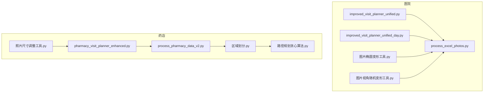
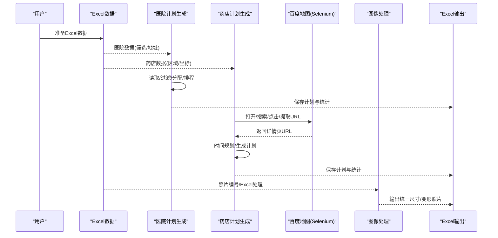
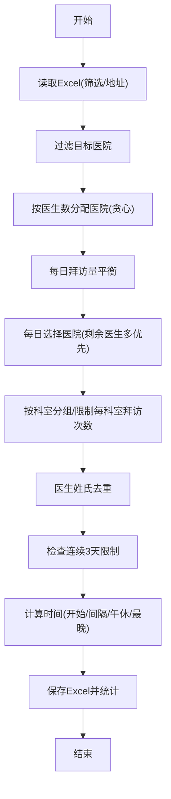
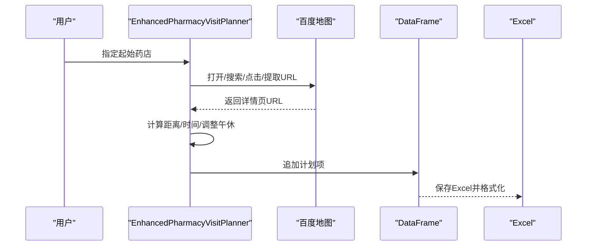
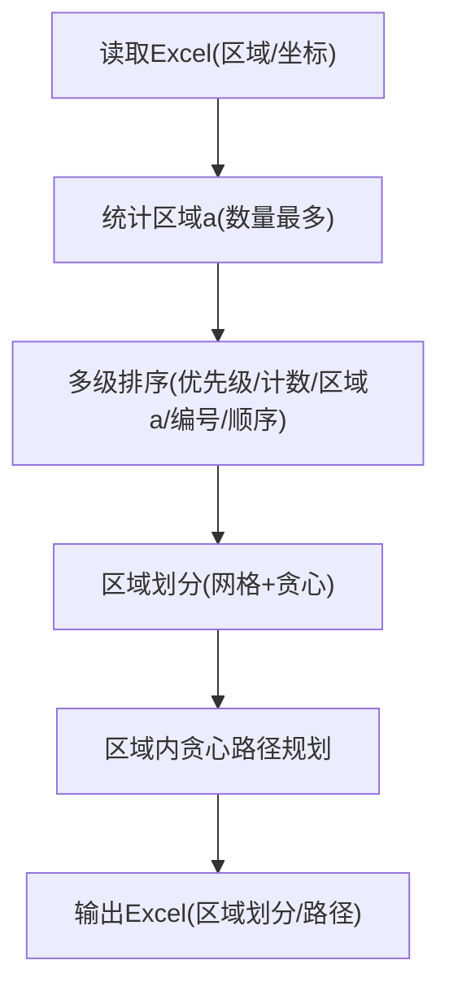
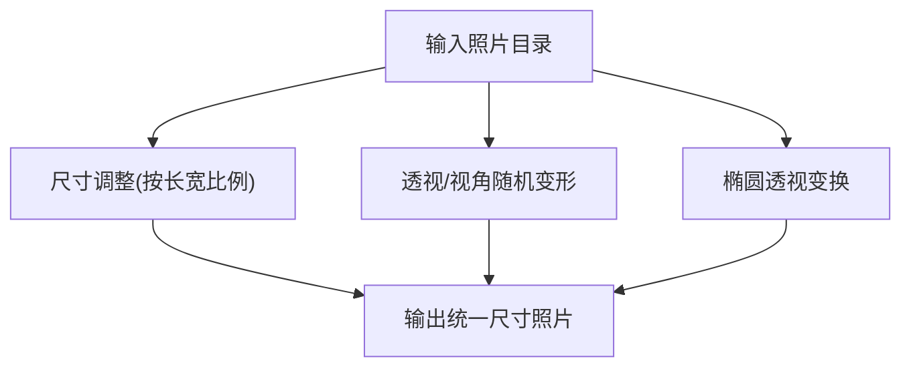
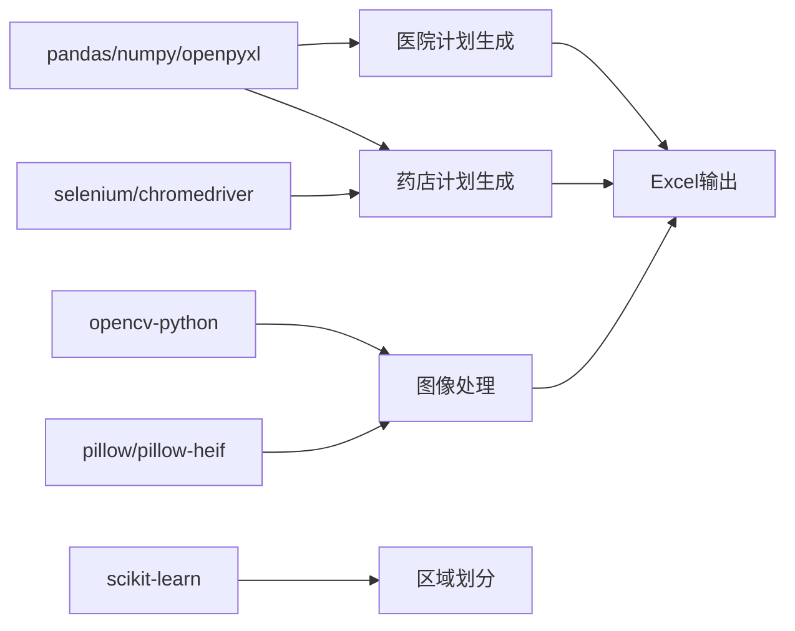

# 项目概述

<cite>
**本文引用的文件**
- [improved_visit_planner_unified.py](file://医院/improved_visit_planner_unified.py)
- [improved_visit_planner_unified_day.py](file://医院/improved_visit_planner_unified_day.py)
- [pharmacy_visit_planner_enhanced.py](file://药店/pharmacy_visit_planner_enhanced.py)
- [process_excel_photos.py](file://医院/process_excel_photos.py)
- [process_pharmacy_data_v2.py](file://药店/process_pharmacy_data_v2.py)
- [区域划分.py](file://药店/区域划分.py)
- [路径规划贪心算法.py](file://药店/路径规划贪心算法.py)
- [图片椭圆变形工具.py](file://医院/图片椭圆变形工具.py)
- [图片视角随机变形工具.py](file://医院/图片视角随机变形工具.py)
- [照片尺寸调整工具.py](file://药店/照片尺寸调整工具.py)
</cite>

## 目录
1. [简介](#简介)
2. [项目结构](#项目结构)
3. [核心组件](#核心组件)
4. [架构总览](#架构总览)
5. [详细组件分析](#详细组件分析)
6. [依赖关系分析](#依赖关系分析)
7. [性能考量](#性能考量)
8. [故障排查指南](#故障排查指南)
9. [结论](#结论)
10. [附录](#附录)

## 简介
“医院药店拜访”项目旨在为医药代表提供一套自动化、可配置的拜访管理解决方案，覆盖“医院”和“药店”两大场景。项目通过模块化的Python脚本，实现以下关键能力：
- 医院侧：基于Excel数据的智能拜访计划生成，兼顾节假日、工作日、午休时间、科室分布、医生姓氏去重、连续拜访限制等约束，输出标准化的拜访计划Excel。
- 药店侧：基于百度地图的网页信息抓取与路线规划，结合区域划分与贪心路径规划，输出带时间安排与URL的拜访计划Excel。
- 图像处理：提供照片尺寸统一、透视/视角随机变形、椭圆透视变换等工具，辅助生成多样化的展示素材。

项目采用命令行交互模式，强调“输入-处理-输出”的流水线式工作流，适合批量处理与重复执行。

## 项目结构
项目按“医院/药店”目录进行功能分区，每个目录下包含多个脚本，分别承担数据处理、计划生成、网页抓取、图像处理等职责。核心文件如下：
- 医院目录
  - 计划生成：improved_visit_planner_unified.py、improved_visit_planner_unified_day.py
  - 数据处理：process_excel_photos.py
  - 图像处理：图片椭圆变形工具.py、图片视角随机变形工具.py
- 药店目录
  - 计划生成：pharmacy_visit_planner_enhanced.py
  - 数据处理：process_pharmacy_data_v2.py
  - 区域划分与路径规划：区域划分.py、路径规划贪心算法.py
  - 图像处理：照片尺寸调整工具.py

图表来源
- [improved_visit_planner_unified.py](file://医院/improved_visit_planner_unified.py#L1-L639)
- [improved_visit_planner_unified_day.py](file://医院/improved_visit_planner_unified_day.py#L1-L653)
- [process_excel_photos.py](file://医院/process_excel_photos.py#L1-L127)
- [pharmacy_visit_planner_enhanced.py](file://药店/pharmacy_visit_planner_enhanced.py#L1-L555)
- [process_pharmacy_data_v2.py](file://药店/process_pharmacy_data_v2.py#L1-L173)
- [区域划分.py](file://药店/区域划分.py#L1-L321)
- [路径规划贪心算法.py](file://药店/路径规划贪心算法.py#L1-L65)
- [图片椭圆变形工具.py](file://医院/图片椭圆变形工具.py#L1-L219)
- [图片视角随机变形工具.py](file://医院/图片视角随机变形工具.py#L1-L310)
- [照片尺寸调整工具.py](file://药店/照片尺寸调整工具.py#L1-L214)

章节来源
- [improved_visit_planner_unified.py](file://医院/improved_visit_planner_unified.py#L1-L639)
- [pharmacy_visit_planner_enhanced.py](file://药店/pharmacy_visit_planner_enhanced.py#L1-L555)

## 核心组件
- 医院拜访计划生成（统一版）
  - 关键能力：节假日判断、工作日筛选、按医生数量分配医院、每日拜访量平衡、科室优先与去重、连续拜访限制、时间排程（含午休与最晚开始时间）、输出Excel统计。
  - 适用场景：按月/季度批量生成拜访计划，支持多人员配置与目标总量控制。
- 医院拜访计划生成（按日版）
  - 关键能力：与统一版一致，但以具体日期范围运行，便于短期计划与复核。
- 药店拜访计划生成（增强版）
  - 关键能力：Selenium驱动百度地图，自动搜索附近药店、提取详情页URL、按距离计算路程时间、考虑午休与工作结束时间、生成Excel计划。
- 药店数据处理与区域划分
  - 关键能力：按区域编号统计与映射、区域a优先级与计数、多级排序规则、区域划分（基于地理坐标与贪心算法）、区域内贪心路径规划。
- 图像处理工具
  - 关键能力：照片尺寸统一、透视/视角随机变形、椭圆透视变换、批量处理与输出。

章节来源
- [improved_visit_planner_unified.py](file://医院/improved_visit_planner_unified.py#L1-L639)
- [improved_visit_planner_unified_day.py](file://医院/improved_visit_planner_unified_day.py#L1-L653)
- [pharmacy_visit_planner_enhanced.py](file://药店/pharmacy_visit_planner_enhanced.py#L1-L555)
- [process_pharmacy_data_v2.py](file://药店/process_pharmacy_data_v2.py#L1-L173)
- [区域划分.py](file://药店/区域划分.py#L1-L321)
- [路径规划贪心算法.py](file://药店/路径规划贪心算法.py#L1-L65)
- [process_excel_photos.py](file://医院/process_excel_photos.py#L1-L127)
- [图片椭圆变形工具.py](file://医院/图片椭圆变形工具.py#L1-L219)
- [图片视角随机变形工具.py](file://医院/图片视角随机变形工具.py#L1-L310)
- [照片尺寸调整工具.py](file://药店/照片尺寸调整工具.py#L1-L214)

## 架构总览
项目采用“数据输入-算法处理-输出报告”的流水线架构，分为两条主线：
- 医院主线：Excel输入 → 计划生成 → Excel输出；可选图像处理链路（Excel处理后生成新编号照片）。
- 药店主线：Excel/地理数据输入 → 区域划分 → 路径规划 → 百度地图抓取 → Excel输出；可选图像处理链路（照片尺寸统一）。

图表来源
- [improved_visit_planner_unified.py](file://医院/improved_visit_planner_unified.py#L514-L639)
- [pharmacy_visit_planner_enhanced.py](file://药店/pharmacy_visit_planner_enhanced.py#L370-L555)
- [process_excel_photos.py](file://医院/process_excel_photos.py#L1-L127)
- [process_pharmacy_data_v2.py](file://药店/process_pharmacy_data_v2.py#L1-L173)
- [区域划分.py](file://药店/区域划分.py#L1-L321)
- [路径规划贪心算法.py](file://药店/路径规划贪心算法.py#L1-L65)
- [照片尺寸调整工具.py](file://药店/照片尺寸调整工具.py#L1-L214)

## 详细组件分析

### 医院拜访计划生成（统一版）
- 数据读取与过滤
  - 从Excel读取“导出筛选结果”和“医院地址”，按目标医院集合过滤，确保后续计划仅覆盖指定机构。
- 医院分配与平衡
  - 按医院医生数量降序，使用贪心策略分配给拜访人，尽量使各人医生总量差距最小；每日拜访量按配置随机上限与剩余目标平衡。
- 每日选择与去重
  - 每日从拜访人负责的医院中选择剩余医生最多的前N家；按科室分组，限制每科室每日拜访次数；医生姓氏去重，避免同姓集中。
- 连续拜访限制
  - 基于历史记录，禁止连续3天在同一医院，降低重复拜访风险。
- 时间排程
  - 每人每天开始时间随机分布在8:30-9:00区间；跨医院/跨科室/同科室分别追加旅行/间隔/无缝衔接；避开午休11:50-13:30；最晚开始时间17:05。
- 输出与统计
  - 保存Excel，包含计划与统计页签；按日期/人员/开始时间排序；打印每日统计。

图表来源
- [improved_visit_planner_unified.py](file://医院/improved_visit_planner_unified.py#L81-L468)

章节来源
- [improved_visit_planner_unified.py](file://医院/improved_visit_planner_unified.py#L1-L639)

### 医院拜访计划生成（按日版）
- 与统一版逻辑一致，但以具体日期范围运行，适合短期计划与复核，配置项中直接使用开始/结束日期而非月份范围。

章节来源
- [improved_visit_planner_unified_day.py](file://医院/improved_visit_planner_unified_day.py#L534-L653)

### 药店拜访计划生成（增强版）
- Selenium驱动
  - 启动Chrome，访问百度地图，搜索指定药店，点击结果进入详情页，提取URL；支持翻页与解析列表，按距离排序选择最近未访问药店。
- 时间规划
  - 每天开始时间8:30-9:00随机；根据距离估算路程时间；避开午休12:00-13:30；工作结束时间18:30；超过时间即停止规划。
- 输出
  - 生成Excel，包含编号、名称、地址、开始/结束时间、URL、距离与路程时间；格式化表格样式。

图表来源
- [pharmacy_visit_planner_enhanced.py](file://药店/pharmacy_visit_planner_enhanced.py#L1-L555)

章节来源
- [pharmacy_visit_planner_enhanced.py](file://药店/pharmacy_visit_planner_enhanced.py#L1-L555)

### 药店数据处理与区域划分
- 数据处理
  - 读取Excel，按区域编号统计各区域药店数量，确定“区域a”（数量最多的区域），计算区域a计数，按优先级与计数、区域a值、区域编号、区域内顺序进行多级排序，写入新标签页。
- 区域划分
  - 基于地理坐标，使用网格系统与贪心算法，按阈值聚类生成区域，每个区域限定最大点数（16-19），记录区域编号与区域内顺序。
- 路径规划
  - 对每个区域内的点，使用贪心算法按欧氏距离最近原则生成顺序，合并后输出Excel。

图表来源
- [process_pharmacy_data_v2.py](file://药店/process_pharmacy_data_v2.py#L1-L173)
- [区域划分.py](file://药店/区域划分.py#L1-L321)
- [路径规划贪心算法.py](file://药店/路径规划贪心算法.py#L1-L65)

章节来源
- [process_pharmacy_data_v2.py](file://药店/process_pharmacy_data_v2.py#L1-L173)
- [区域划分.py](file://药店/区域划分.py#L1-L321)
- [路径规划贪心算法.py](file://药店/路径规划贪心算法.py#L1-L65)

### 图像处理工具
- 照片尺寸调整
  - 根据长宽比例，横向图缩放长边到目标像素，纵向图缩放短边到目标像素；支持HEIF等格式注册与转RGB；输出JPEG并优化质量。
- 透视/视角随机变形
  - 透视变换：随机偏移四角，计算透视矩阵并反向变换，消除黑边；支持批量处理与输出。
  - 视角随机变形：支持透视、旋转、缩放、剪切等组合，生成多变体。
- 椭圆透视变换
  - 在四分之一椭圆范围内随机生成新角点，进行透视变换，确保输出无黑边。

图表来源
- [照片尺寸调整工具.py](file://药店/照片尺寸调整工具.py#L1-L214)
- [图片视角随机变形工具.py](file://医院/图片视角随机变形工具.py#L1-L310)
- [图片椭圆变形工具.py](file://医院/图片椭圆变形工具.py#L1-L219)

章节来源
- [照片尺寸调整工具.py](file://药店/照片尺寸调整工具.py#L1-L214)
- [图片视角随机变形工具.py](file://医院/图片视角随机变形工具.py#L1-L310)
- [图片椭圆变形工具.py](file://医院/图片椭圆变形工具.py#L1-L219)

## 依赖关系分析
- 外部库
  - pandas/numpy/openpyxl：Excel读写与数据分析。
  - selenium/chromedriver：网页抓取与URL提取。
  - opencv-python：图像处理（透视、仿射、矩阵计算）。
  - scikit-learn：区域划分中的KDTree。
  - pillow/pillow-heif：照片格式支持与尺寸调整。
- 模块耦合
  - 医院计划生成与Excel处理耦合紧密，需保证输入数据结构稳定。
  - 药店计划生成依赖Selenium环境与百度地图接口稳定性。
  - 图像处理工具独立性强，可作为前置或后置处理环节接入。

图表来源
- [improved_visit_planner_unified.py](file://医院/improved_visit_planner_unified.py#L1-L639)
- [pharmacy_visit_planner_enhanced.py](file://药店/pharmacy_visit_planner_enhanced.py#L1-L555)
- [区域划分.py](file://药店/区域划分.py#L1-L321)
- [图片视角随机变形工具.py](file://医院/图片视角随机变形工具.py#L1-L310)
- [照片尺寸调整工具.py](file://药店/照片尺寸调整工具.py#L1-L214)

章节来源
- [improved_visit_planner_unified.py](file://医院/improved_visit_planner_unified.py#L1-L639)
- [pharmacy_visit_planner_enhanced.py](file://药店/pharmacy_visit_planner_enhanced.py#L1-L555)
- [区域划分.py](file://药店/区域划分.py#L1-L321)
- [图片视角随机变形工具.py](file://医院/图片视角随机变形工具.py#L1-L310)
- [照片尺寸调整工具.py](file://药店/照片尺寸调整工具.py#L1-L214)

## 性能考量
- 医院计划生成
  - 时间复杂度主要受Excel数据规模与科室分组影响；可通过合理设置每日上限与剩余医生阈值，减少后期清理压力。
  - 午休与最晚开始时间检查为O(n)扫描，对大数据量影响有限。
- 药店计划生成
  - Selenium操作耗时较长，建议控制每日规划数量与页面交互次数；可考虑本地缓存已访问URL，减少重复请求。
  - 路径规划为贪心算法，时间复杂度O(n^2)，适合中小规模区域；大规模数据建议分批或引入更高效算法。
- 图像处理
  - OpenCV透视/仿射变换为像素级操作，批量处理时注意内存占用；建议分批处理与适当降低输出质量以节省空间。

[本节为通用指导，不直接分析具体文件]

## 故障排查指南
- Excel读取失败
  - 检查Excel文件路径与工作表名称是否匹配；确认“导出筛选结果/医院地址”等关键表存在。
- Selenium异常
  - 确认ChromeDriver版本与Chrome匹配；网络不稳定时增加等待与重试机制；必要时手动登录百度地图以规避风控。
- 图像处理失败
  - 检查输入目录是否存在、权限是否足够；确保OpenCV与Pillow依赖已正确安装；HEIF格式需注册插件。
- 区域划分/路径规划异常
  - 检查地理坐标列名与数据类型；阈值与最大点数设置是否合理；输出Excel路径权限是否允许写入。

章节来源
- [process_excel_photos.py](file://医院/process_excel_photos.py#L1-L127)
- [pharmacy_visit_planner_enhanced.py](file://药店/pharmacy_visit_planner_enhanced.py#L1-L555)
- [图片视角随机变形工具.py](file://医院/图片视角随机变形工具.py#L1-L310)
- [照片尺寸调整工具.py](file://药店/照片尺寸调整工具.py#L1-L214)
- [区域划分.py](file://药店/区域划分.py#L1-L321)
- [路径规划贪心算法.py](file://药店/路径规划贪心算法.py#L1-L65)

## 结论
本项目通过模块化脚本实现了“医院/药店”两类场景的自动化拜访管理，覆盖数据准备、计划生成、网页抓取与图像处理的完整链路。其优势在于：
- 面向命令行的简洁交互，易于集成到批处理与CI/CD；
- 可配置的目标总量、每日上限、节假日与时间窗口，满足多样化业务需求；
- 药店侧结合Selenium与区域划分，提升路径规划效率与可执行性。

局限性与改进方向：
- 药店网页抓取依赖外部服务稳定性，建议增加重试与降级策略；
- 医院计划生成的约束条件较多，建议提供可视化配置界面或参数校验工具；
- 图像处理工具可进一步封装为通用组件，支持更多格式与参数。

[本节为总结性内容，不直接分析具体文件]

## 附录
- 典型使用场景
  - 使用 improved_visit_planner_unified.py 生成医院拜访计划：在脚本末尾配置人员、目标医院、时间范围与目标总量，运行后输出Excel。
  - 使用 pharmacy_visit_planner_enhanced.py 生成药店拜访计划：在脚本末尾配置起始药店，运行后输出Excel。
  - 使用 process_excel_photos.py 将Excel中的拜访编号映射为新编号并复制照片到新文件夹。
  - 使用 process_pharmacy_data_v2.py 对药店数据进行区域a映射与多级排序，输出新标签页。
  - 使用 区域划分.py 与 路径规划贪心算法.py 对地理数据进行区域划分与区域内路径规划。
  - 使用 图片椭圆变形工具.py 与 图片视角随机变形工具.py 对照片进行透视/视角随机变形；使用 照片尺寸调整工具.py 对照片进行尺寸统一。

章节来源
- [improved_visit_planner_unified.py](file://医院/improved_visit_planner_unified.py#L590-L639)
- [pharmacy_visit_planner_enhanced.py](file://药店/pharmacy_visit_planner_enhanced.py#L526-L555)
- [process_excel_photos.py](file://医院/process_excel_photos.py#L1-L127)
- [process_pharmacy_data_v2.py](file://药店/process_pharmacy_data_v2.py#L1-L173)
- [区域划分.py](file://药店/区域划分.py#L295-L321)
- [路径规划贪心算法.py](file://药店/路径规划贪心算法.py#L44-L65)
- [图片椭圆变形工具.py](file://医院/图片椭圆变形工具.py#L168-L219)
- [图片视角随机变形工具.py](file://医院/图片视角随机变形工具.py#L220-L310)
- [照片尺寸调整工具.py](file://药店/照片尺寸调整工具.py#L120-L214)